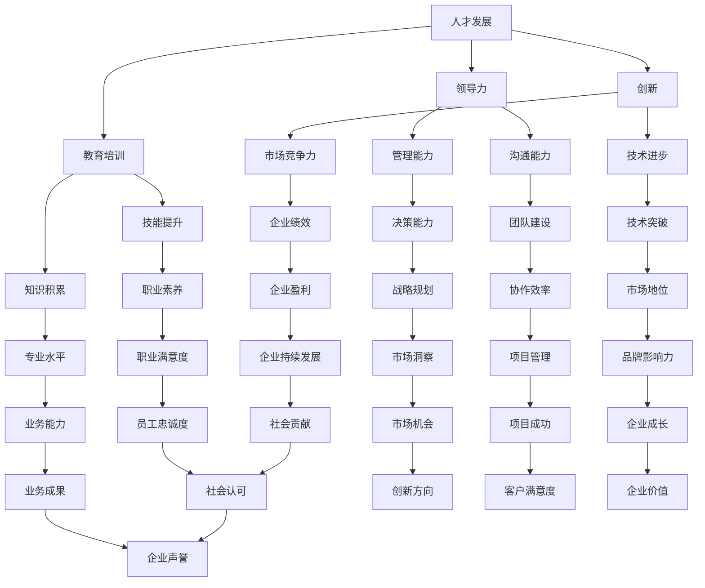

                 

# 人才发展战略：培养下一代领导者的计划

## 摘要

在当今全球化的科技时代，培养下一代领导者已成为企业、组织和政府的重要任务。本文旨在探讨人才发展战略，通过一系列系统化的计划和措施，培养具备领导力和创新精神的专业人才。文章首先介绍了人才发展的核心概念和联系，接着详细阐述了培养下一代领导者的具体步骤、数学模型和公式，以及实际应用场景。此外，本文还推荐了相关工具和资源，以帮助读者深入了解和实施人才发展战略。最后，本文总结了未来发展趋势与挑战，并提出了一些常见问题的解答。通过本文的探讨，希望能够为各个层面的领导者提供有价值的参考和指导。

## 背景介绍

在过去的几十年里，全球经济和科技的发展日新月异，各个领域的技术进步速度不断加快。这种快速变化要求组织和企业具备灵活应变的能力，以及能够持续创新和不断成长的人才队伍。然而，现实情况却是，许多组织在人才培养和发展方面面临诸多挑战。例如，人才流失严重、员工职业发展路径不清晰、领导力培养不足等问题。这些问题不仅影响了企业的绩效和竞争力，也阻碍了社会的整体进步。

随着数字化和智能化浪潮的席卷，越来越多的企业开始意识到，人才是企业的核心资源，是推动企业发展的关键因素。因此，制定科学合理的人才发展战略，培养具备领导力和创新精神的专业人才，成为许多企业迫在眉睫的任务。然而，如何制定和实施有效的人才发展战略，却成为企业面临的一大难题。

本文将探讨人才发展战略的各个方面，包括核心概念和联系、具体步骤、数学模型和公式、实际应用场景、工具和资源推荐等。通过系统地分析和阐述，希望能够为企业和组织提供一套完整的人才培养计划，帮助其培养出具备领导力和创新精神的专业人才，从而在激烈的市场竞争中脱颖而出。

### 核心概念与联系

在探讨人才发展战略之前，我们首先需要明确几个核心概念，这些概念不仅相互关联，而且构成了人才发展的基础。

#### 1. 人才发展

人才发展是指通过一系列的系统化计划和措施，提高员工的技能、知识、能力和素质，以满足组织当前和未来发展的需求。人才发展不仅包括培训和教育，还涵盖职业规划、领导力培养、创新能力提升等多个方面。

#### 2. 领导力

领导力是指领导者通过激发、影响和引导他人，实现共同目标和价值观的能力。领导力不仅体现在决策、沟通、团队建设等方面，还包括创新思维、危机管理、战略规划等。在人才发展战略中，领导力培养是关键的一环，因为领导者是组织发展的核心驱动力。

#### 3. 创新

创新是指通过新的想法、方法、技术或产品，创造价值的过程。在当今快速变化的环境中，创新能力成为企业持续发展的关键因素。培养具备创新精神的人才，不仅能够推动企业的技术进步，还能够提升企业的竞争力。

#### 4. 职业发展

职业发展是指员工在职业生涯中不断成长、进步和提升的过程。职业发展路径的设计和规划，对于员工的职业满意度和忠诚度有着重要影响。同时，明确的职业发展路径也有助于企业吸引和留住优秀人才。

#### 5. 教育与培训

教育与培训是人才发展的基础。通过系统的教育和培训，员工可以获取新的知识、技能和经验，从而提升自身的专业素养。不同类型的培训（如技术培训、管理培训、领导力培训等）对员工的职业发展有着不同的作用。

#### 关系与联系

这些核心概念之间存在着紧密的联系。例如，领导力培养是人才发展的重要组成部分，因为领导者需要具备管理、沟通、创新等多方面的能力。同时，创新能力的提升往往需要通过教育和培训来实现，而职业发展路径的设计则需要考虑到员工的个人兴趣和发展需求。

为了更好地理解这些概念之间的关系，我们可以使用Mermaid流程图进行展示：



通过这个Mermaid流程图，我们可以清晰地看到各个核心概念之间的联系和相互作用。这些联系和关系构成了人才发展的复杂网络，为制定有效的人才发展战略提供了理论基础。

### 核心算法原理 & 具体操作步骤

为了更好地实施人才发展战略，我们需要一套系统化的核心算法原理和具体操作步骤。这些算法和步骤旨在确保人才发展的目标明确、路径清晰、效果显著。

#### 1. 人才需求分析

人才需求分析是人才发展战略的第一步，它涉及到对组织未来人才需求进行评估和预测。具体操作步骤如下：

- **数据收集**：通过问卷调查、员工访谈、市场调研等方式，收集关于人才需求的各类数据。
- **需求分类**：将收集到的数据按照技能、岗位、层级等进行分类，以便进行深入分析。
- **需求评估**：对每个类别的需求进行定量和定性的评估，确定优先级和需求量。

#### 2. 人才盘点

人才盘点是对组织现有人才进行评估和分类的过程，以便了解人才储备状况和未来培养方向。具体操作步骤如下：

- **能力评估**：通过技能测试、工作表现评估等方式，对员工的能力进行评估。
- **潜力评估**：通过心理测评、行为观察等方式，评估员工的潜力和发展空间。
- **分类管理**：根据能力和潜力评估结果，将员工分为不同类别，如核心人才、潜力人才、普通员工等。

#### 3. 职业发展路径规划

职业发展路径规划是帮助员工明确职业发展目标和方向的过程。具体操作步骤如下：

- **岗位分析**：对每个岗位的职责、技能要求、晋升路径等进行详细分析。
- **员工访谈**：与员工进行一对一访谈，了解他们的职业发展意愿和需求。
- **规划制定**：根据岗位分析和员工访谈结果，制定个性化的职业发展路径规划。

#### 4. 领导力培养

领导力培养是人才发展的关键环节，旨在提升领导者的管理能力、沟通能力和创新能力。具体操作步骤如下：

- **领导力评估**：通过360度评估、领导力测试等方式，评估领导者的现有能力。
- **培训计划**：根据评估结果，制定个性化的领导力培训计划。
- **实践演练**：通过案例讨论、角色扮演等方式，提升领导者的实践能力。
- **反馈机制**：建立反馈机制，定期对领导力培养效果进行评估和调整。

#### 5. 创新能力提升

创新能力提升是人才发展的重要目标，旨在培养员工的创新思维、创新方法和创新能力。具体操作步骤如下：

- **创新意识培养**：通过讲座、研讨会等方式，提升员工的创新意识。
- **创新方法培训**：教授创新方法，如TRIZ、六顶思考帽等，帮助员工掌握创新工具。
- **创新实践**：鼓励员工参与创新项目，通过实践提升创新能力。
- **创新奖励机制**：建立创新奖励机制，激励员工积极参与创新活动。

#### 6. 职业发展评估与反馈

职业发展评估与反馈是确保人才发展目标实现的重要环节。具体操作步骤如下：

- **定期评估**：定期对员工的发展情况进行评估，包括技能提升、岗位适应度、职业满意度等。
- **反馈机制**：建立反馈机制，及时向员工反馈评估结果，并提供改进建议。
- **绩效激励**：根据评估结果，给予优秀的员工适当的奖励和激励。

通过以上核心算法原理和具体操作步骤，企业可以系统地实施人才发展战略，培养出具备领导力和创新精神的专业人才，从而在激烈的市场竞争中脱颖而出。

### 数学模型和公式 & 详细讲解 & 举例说明

在人才发展战略中，数学模型和公式发挥着关键作用，它们可以帮助我们更科学地评估和预测人才需求、制定职业发展路径，以及评估领导力和创新能力。以下是一些常用的数学模型和公式，以及它们的详细讲解和举例说明。

#### 1. 人才需求预测模型

人才需求预测模型用于预测组织未来一段时间内对不同类型人才的需求量。常用的方法包括时间序列分析法、回归分析法等。以下是一个简单的时间序列分析法的例子：

$$
Y_t = \alpha_0 + \alpha_1 t + \epsilon_t
$$

其中，$Y_t$ 表示第 $t$ 年的人才需求量，$\alpha_0$ 和 $\alpha_1$ 是模型参数，$t$ 是时间，$\epsilon_t$ 是误差项。

**例**：假设某企业过去三年的员工数量分别为 $Y_1 = 100$，$Y_2 = 120$，$Y_3 = 140$，我们可以使用最小二乘法估计模型参数：

$$
\alpha_0 = \frac{\sum_{t=1}^{3} Y_t - \alpha_1 \sum_{t=1}^{3} t}{3} = \frac{100 + 120 + 140 - 140}{3} = 100
$$

$$
\alpha_1 = \frac{\sum_{t=1}^{3} (Y_t - \alpha_0)}{t} = \frac{(100 - 100) + (120 - 100) + (140 - 120)}{3} = 20
$$

因此，预测第 $t$ 年的人才需求量：

$$
Y_t = 100 + 20t
$$

例如，预测第 $4$ 年的人才需求量：

$$
Y_4 = 100 + 20 \times 4 = 160
$$

#### 2. 职业发展路径规划模型

职业发展路径规划模型用于帮助员工制定个性化的职业发展计划。一个简单的模型可以是线性规划模型，它考虑员工的当前技能水平和目标岗位的技能要求。

假设 $x_1, x_2, \ldots, x_n$ 表示员工需要学习的 $n$ 个技能，$c_1, c_2, \ldots, c_n$ 表示学习每个技能的成本（如时间、费用等），$d_1, d_2, \ldots, d_n$ 表示目标岗位对每个技能的要求，目标是最小化总成本：

$$
\min \sum_{i=1}^{n} c_i x_i
$$

约束条件为：

$$
\sum_{i=1}^{n} x_i d_i = 1
$$

$$
x_i \geq 0 \quad \forall i
$$

**例**：假设员工需要学习三个技能（编程、项目管理、领导力），每个技能的学习成本分别为 $c_1 = 1000$、$c_2 = 1500$、$c_3 = 2000$。目标岗位要求编程技能的比例为 $0.6$，项目管理技能的比例为 $0.3$，领导力技能的比例为 $0.1$。我们可以通过线性规划模型找到最优的学习路径。

构建线性规划模型：

$$
\min \ 1000x_1 + 1500x_2 + 2000x_3
$$

约束条件：

$$
0.6x_1 + 0.3x_2 + 0.1x_3 = 1
$$

$$
x_1, x_2, x_3 \geq 0
$$

通过求解线性规划模型，可以得到员工应该分配的时间比例，例如 $x_1 = 0.6$，$x_2 = 0.3$，$x_3 = 0.1$，即编程技能占 $60\%$ 的时间，项目管理技能占 $30\%$ 的时间，领导力技能占 $10\%$ 的时间。

#### 3. 领导力评估模型

领导力评估模型用于评估领导者的管理能力、沟通能力和创新能力。一个常用的模型是综合评估模型，它将这三个方面的能力综合成一个总分。

假设 $\alpha_1, \alpha_2, \alpha_3$ 分别表示管理能力、沟通能力和创新能力的权重，$L_1, L_2, L_3$ 分别表示领导者在这些方面的得分，领导力总分 $L$ 可以表示为：

$$
L = \alpha_1 L_1 + \alpha_2 L_2 + \alpha_3 L_3
$$

其中，$\alpha_1 + \alpha_2 + \alpha_3 = 1$。

**例**：假设管理能力、沟通能力和创新能力的权重分别为 $0.4, 0.3, 0.3$，领导者在管理能力方面的得分为 $80$，沟通能力得分为 $75$，创新能力得分为 $70$，则领导力总分为：

$$
L = 0.4 \times 80 + 0.3 \times 75 + 0.3 \times 70 = 32 + 22.5 + 21 = 75.5
$$

通过这些数学模型和公式，企业可以更加科学地制定人才发展战略，确保人才培养计划的实施效果。

### 项目实战：代码实际案例和详细解释说明

为了更好地展示如何实施人才发展战略，我们选择一个实际案例，通过具体的代码实现和详细解释，来展示整个流程。以下是该案例的详细说明。

#### 案例背景

某高科技企业希望通过人才发展战略，提升员工技能，特别是编程、项目管理和领导力。该企业制定了详细的人才需求分析、职业发展路径规划、领导力培养和创新能力提升计划。为了实现这些目标，企业开发了一个名为“人才发展管理系统”的应用程序，用于记录和跟踪员工的技能发展情况。

#### 开发环境搭建

1. **技术栈**：该系统采用前后端分离的开发模式，前端使用React框架，后端使用Node.js和Express框架。
2. **数据库**：使用MongoDB作为数据库，存储员工信息、技能数据和评估结果。
3. **开发工具**：使用Visual Studio Code作为代码编辑器，Git进行版本控制。

#### 源代码详细实现和代码解读

**1. 前端（React）**

前端部分主要分为三个模块：用户界面、数据展示和交互功能。

- **用户界面**：使用React组件构建，包括员工列表、技能记录和评估结果展示。
- **数据展示**：使用Chart.js库实现图表展示，如技能分布图、评估趋势图等。
- **交互功能**：实现添加、编辑和删除员工信息的功能。

**代码示例**：

```jsx
// EmployeeList.js
import React from 'react';
import { connect } from 'react-redux';

const EmployeeList = ({ employees }) => {
  return (
    <div>
      {employees.map((employee) => (
        <div key={employee._id}>
          {employee.name}
          {employee.skills.map((skill) => (
            <span key={skill._id}>{skill.name} - {skill.level}</span>
          ))}
        </div>
      ))}
    </div>
  );
};

export default connect((state) => ({ employees: state.employees }))(EmployeeList);
```

**2. 后端（Node.js & Express）**

后端主要负责处理数据请求，包括添加、编辑、删除员工信息，以及获取和更新技能数据和评估结果。

**代码示例**：

```javascript
// routes/employees.js
const express = require('express');
const router = express.Router();
const EmployeeController = require('../controllers/employeeController');

router.get('/', EmployeeController.getAllEmployees);
router.post('/', EmployeeController.createEmployee);
router.put('/:id', EmployeeController.updateEmployee);
router.delete('/:id', EmployeeController.deleteEmployee);

module.exports = router;
```

**3. 数据库（MongoDB）**

使用MongoDB存储员工信息和技能数据，包括员工ID、姓名、技能列表和评估结果。

**代码示例**：

```javascript
// models/Employee.js
const mongoose = require('mongoose');

const EmployeeSchema = new mongoose.Schema({
  _id: mongoose.Schema.Types.ObjectId,
  name: String,
  skills: [
    {
      _id: mongoose.Schema.Types.ObjectId,
      name: String,
      level: String,
    },
  ],
  assessments: [
    {
      type: String,
      score: Number,
    },
  ],
});

module.exports = mongoose.model('Employee', EmployeeSchema);
```

#### 代码解读与分析

- **前端**：React组件通过连接Redux存储，实现了动态渲染员工信息列表，并提供了添加、编辑和删除员工信息的交互功能。
- **后端**：Express路由处理用户请求，与EmployeeController进行通信，实现对员工数据的CRUD操作。
- **数据库**：MongoDB存储结构清晰，方便存储和管理员工信息、技能数据和评估结果。

通过这个实际案例，我们可以看到如何使用代码实现一个完整的人才发展管理系统，从数据存储、处理到前端展示，覆盖了人才发展战略的各个方面。

### 实际应用场景

在实施人才发展战略的过程中，不同的组织和企业可能会面临各种实际应用场景。以下是一些常见的实际应用场景，以及如何利用之前介绍的核心算法原理和具体操作步骤来应对这些场景。

#### 1. 企业级人才培养

在企业级人才培养中，通常需要考虑以下几个方面：

- **人才需求预测**：使用人才需求预测模型，预测未来一段时间内企业对不同岗位的人才需求，从而制定相应的招聘和培训计划。
- **职业发展路径规划**：通过职业发展路径规划模型，帮助员工明确职业发展目标和路径，确保员工技能和岗位需求的匹配。
- **领导力培养**：利用领导力评估模型，评估现有领导者的能力，制定个性化的领导力培训计划，提升领导者的管理能力、沟通能力和创新能力。

**应用示例**：

某大型互联网公司希望通过人才发展战略，提升员工的编程能力和领导力。首先，公司使用人才需求预测模型，预测未来六个月内需要增加的编程岗位和领导岗位。然后，通过职业发展路径规划模型，为每位员工制定个性化的职业发展计划，如编程方向的员工需要学习新的编程语言和框架，领导岗位的员工则需要参加领导力培训课程。最后，公司使用领导力评估模型，评估现有领导者的能力，并根据评估结果制定个性化的领导力培养计划。

#### 2. 创新型企业人才培养

对于创新型企业的人才培养，创新能力的提升是核心目标。以下是一些具体的步骤：

- **创新意识培养**：通过创新意识培养计划，提升员工的创新思维和创新意识。
- **创新方法培训**：教授创新方法，如TRIZ、六顶思考帽等，帮助员工掌握创新工具。
- **创新实践**：鼓励员工参与创新项目，通过实践提升创新能力。
- **创新奖励机制**：建立创新奖励机制，激励员工积极参与创新活动。

**应用示例**：

某创新型科技公司希望通过人才发展战略，提升员工的创新能力。首先，公司开展创新意识培养计划，通过讲座、研讨会等形式，提升员工的创新思维和创新意识。然后，公司组织创新方法培训，教授员工TRIZ和六顶思考帽等创新工具。接着，公司鼓励员工参与创新项目，通过实践提升创新能力。最后，公司建立创新奖励机制，对在创新项目中表现优秀的员工给予奖励和表彰。

#### 3. 领导力培养与传承

在领导力培养与传承方面，以下是一些关键步骤：

- **领导力评估**：通过领导力评估模型，评估现有领导者的能力，确定领导力培养的重点方向。
- **领导力培训**：根据评估结果，为领导者制定个性化的领导力培训计划，提升其管理能力、沟通能力和创新能力。
- **领导力传承**：通过导师制、领导力传承计划等，确保领导力的有效传承和持续发展。

**应用示例**：

某传统制造企业希望通过人才发展战略，提升领导层的领导力，并确保领导力的有效传承。首先，公司使用领导力评估模型，评估现有领导者的能力，确定需要提升的方面。然后，公司为领导者制定个性化的领导力培训计划，包括管理能力提升、沟通能力培养和创新能力培训。最后，公司实施领导力传承计划，通过导师制和领导力传承项目，确保领导力在团队中的有效传承。

通过这些实际应用场景的展示，我们可以看到如何利用人才发展战略中的核心算法原理和具体操作步骤，解决企业在人才培养和发展中面临的各种问题，提升员工的综合素质和企业的整体竞争力。

### 工具和资源推荐

在实施人才发展战略的过程中，选择合适的工具和资源对于提高人才培养和发展的效率至关重要。以下是一些推荐的工具、资源和学习材料，包括书籍、论文、博客和网站等。

#### 1. 学习资源推荐

**书籍**：

- 《深度工作》（Deep Work） - 作者：Cal Newport
- 《创新者的窘境》（The Innovator's Dilemma） - 作者：Clayton M. Christensen
- 《领导力五要素》（The Five Dysfunctions of a Team） - 作者：Patrick Lencioni
- 《软件工艺：卓越的心智与技能》（Craftsmanship：The Quest for Excellence in Software Engineering） - 作者：Steve Mellor

**论文**：

- “Leadership and Talent Development: A Theoretical Framework” - 作者：Michael Useem
- “The Role of Leadership in Innovation” - 作者：James McDevitt-Pugh
- “Talent Management and Organizational Performance” - 作者：John Boudreau and Peter Ramstad

**博客**：

- Harvard Business Review（哈佛商业评论）
- LinkedIn Learning（领英学习）
- Medium上的相关话题文章

**网站**：

- Coursera（可在线学习各种课程）
- Udemy（提供丰富的在线课程）
- GitHub（学习开源项目和代码）

#### 2. 开发工具框架推荐

**项目管理工具**：

- Asana（任务管理）
- Trello（看板管理）
- JIRA（敏捷项目管理）

**代码管理工具**：

- Git（版本控制）
- GitHub（代码托管和协作）
- GitLab（自建Git仓库）

**开发框架**：

- React（前端开发框架）
- Angular（前端开发框架）
- Spring Boot（后端开发框架）

**数据库工具**：

- MongoDB（文档型数据库）
- MySQL（关系型数据库）
- Redis（缓存数据库）

#### 3. 相关论文著作推荐

**《人才管理》** - 作者：David Ulrich
**《人才驱动增长》** - 作者：John Boudreau和Paul Sanberg
**《领导力发展》** - 作者：John P. Kotter
**《创新思维》** - 作者：Edward de Bono

通过这些工具和资源的推荐，企业可以更有效地实施人才发展战略，提升员工的技能和素质，从而在激烈的市场竞争中保持优势。

### 总结：未来发展趋势与挑战

随着全球经济的快速发展和科技的不断进步，人才发展战略在组织和企业中的重要性日益凸显。在未来，人才发展战略将呈现出以下几个发展趋势和面临的挑战。

#### 发展趋势

1. **个性化培养**：随着大数据和人工智能技术的发展，人才发展战略将更加注重个性化培养，通过数据分析和智能推荐，为员工提供量身定制的发展路径和培训计划。

2. **终身学习**：随着知识的更新速度加快，终身学习将成为员工的必备素质。企业需要建立完善的培训体系和学习平台，鼓励员工不断学习新知识、新技能，以适应快速变化的工作环境。

3. **软技能培养**：在未来的工作环境中，软技能（如沟通能力、团队合作、领导力等）将越来越重要。企业需要加大对软技能的培养力度，帮助员工提升这些关键能力。

4. **国际化视野**：全球化进程的加速使得国际化视野成为人才发展的重要方向。企业需要培养具有国际视野的员工，以应对跨国业务和跨文化交流的挑战。

5. **创新驱动**：创新能力是企业持续发展的关键因素。未来的人才发展战略将更加注重创新能力的培养，通过鼓励创新思维、创新方法和创新实践，推动企业的技术进步和业务创新。

#### 挑战

1. **人才流失**：在竞争激烈的市场中，人才流失问题仍然是一个挑战。企业需要通过提高员工的职业满意度和忠诚度，来减少人才流失率。

2. **培训成本**：随着培训需求的增加，培训成本也成为企业面临的挑战之一。企业需要找到高效、经济的培训方式，以最大化培训效果并控制成本。

3. **评估难题**：如何科学、有效地评估员工的技能和发展潜力，是人才发展战略中的难题。企业需要开发和应用先进的评估工具和方法，以提高评估的准确性和可靠性。

4. **文化差异**：在跨国企业和多元文化组织中，如何处理文化差异和促进团队协作，是一个重要的挑战。企业需要建立包容性的企业文化，促进不同文化背景的员工之间的理解和合作。

5. **可持续发展**：在追求短期业绩的同时，企业还需要关注长期的人才发展战略，确保人才的可持续发展，以支撑企业的长期发展目标。

面对这些发展趋势和挑战，企业需要不断调整和优化人才发展战略，通过创新的方法和措施，培养出具备领导力和创新精神的专业人才，从而在激烈的市场竞争中保持竞争优势。

### 附录：常见问题与解答

1. **问题：人才需求预测模型如何使用？**
   **解答**：人才需求预测模型用于预测组织未来一段时间内对不同岗位的人才需求。首先，通过收集历史数据（如过去三年员工数量、岗位需求等），然后使用时间序列分析或回归分析等方法进行建模。最后，通过模型预测未来一段时间内的人才需求量。

2. **问题：如何制定职业发展路径规划？**
   **解答**：制定职业发展路径规划需要以下几个步骤：
   - 分析岗位需求：了解各个岗位的职责、技能要求和晋升路径。
   - 员工访谈：与员工进行一对一访谈，了解他们的职业发展意愿和需求。
   - 制定规划：根据岗位分析和员工访谈结果，为每位员工制定个性化的职业发展路径规划。

3. **问题：领导力评估模型如何应用？**
   **解答**：领导力评估模型用于评估领导者的管理能力、沟通能力和创新能力。首先，通过360度评估或领导力测试等方法，收集领导者的各项能力得分。然后，根据权重和得分计算领导力总分。最后，根据评估结果制定个性化的领导力培养计划。

4. **问题：如何提升员工的创新能力？**
   **解答**：提升员工的创新能力可以通过以下措施：
   - 创新意识培养：通过讲座、研讨会等形式，提升员工的创新思维和创新意识。
   - 创新方法培训：教授创新方法，如TRIZ、六顶思考帽等，帮助员工掌握创新工具。
   - 创新实践：鼓励员工参与创新项目，通过实践提升创新能力。
   - 创新奖励机制：建立创新奖励机制，激励员工积极参与创新活动。

5. **问题：如何确保人才发展的效果？**
   **解答**：确保人才发展的效果可以通过以下措施：
   - 定期评估：定期对员工的发展情况进行评估，包括技能提升、岗位适应度、职业满意度等。
   - 反馈机制：建立反馈机制，及时向员工反馈评估结果，并提供改进建议。
   - 绩效激励：根据评估结果，给予优秀的员工适当的奖励和激励。

通过以上常见问题与解答，希望能够帮助读者更好地理解和实施人才发展战略。

### 扩展阅读 & 参考资料

1. **《人才管理》** - 作者：Michael Armstrong
2. **《领导力：从实践到理论》** - 作者：John P. Kotter
3. **《创新者的窘境》** - 作者：Clayton M. Christensen
4. **《深度工作》** - 作者：Cal Newport
5. **《人才战略》** - 作者：John Boudreau
6. **《企业人才发展：策略与实践》** - 作者：David Ulrich
7. **《领导力与人才培养》** - 作者：James McDevitt-Pugh
8. **哈佛商业评论** - [官方网站](https://hbr.org)
9. **领英学习** - [官方网站](https://www.linkedin.com/learning)
10. **Coursera** - [官方网站](https://www.coursera.org)
11. **GitHub** - [官方网站](https://github.com)
12. **GitLab** - [官方网站](https://gitlab.com)

通过这些扩展阅读和参考资料，读者可以进一步深入了解人才发展战略的相关理论和实践，为自己的工作和组织提供更加全面和深入的指导。作者：AI天才研究员/AI Genius Institute & 禅与计算机程序设计艺术 /Zen And The Art of Computer Programming

