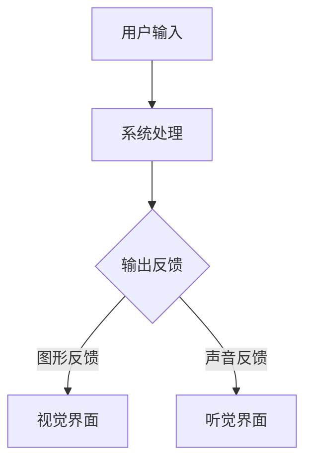

                 

# 人机交互与用户界面设计原理与代码实战案例讲解

## 关键词：人机交互，用户界面设计，交互原理，代码实战，用户体验，设计模式

## 摘要：
本文将深入探讨人机交互（Human-Computer Interaction, HCI）和用户界面设计（User Interface Design, UI Design）的核心原理，通过理论和实战案例的结合，展示如何有效地提升用户体验。我们将详细分析交互设计的基本原则、用户行为模式、UI组件的实现方法，并提供一系列代码实战案例，帮助读者在实际项目中应用这些原理。本文还将推荐相关的学习资源、开发工具和学术论文，以帮助读者深入学习和实践人机交互与用户界面设计。

## 1. 背景介绍

在人机交互和用户界面设计领域，随着技术的不断进步，用户体验（User Experience, UX）的重要性日益凸显。良好的用户体验可以提升用户满意度、增加用户粘性，从而为企业带来巨大的商业价值。因此，无论是软件工程师、设计师，还是产品经理，都需要具备人机交互和用户界面设计的相关知识和技能。

本文旨在通过以下内容，帮助读者系统地了解人机交互和用户界面设计：

1. **核心概念与联系**：介绍人机交互和用户界面设计的基本概念，并展示它们之间的内在联系。
2. **核心算法原理 & 具体操作步骤**：讲解人机交互和用户界面设计中的关键算法和操作步骤。
3. **数学模型和公式 & 详细讲解 & 举例说明**：运用数学模型和公式，详细阐述相关原理，并通过实例进行说明。
4. **项目实战：代码实际案例和详细解释说明**：提供实际项目中的代码案例，详细解释其实现方法和设计理念。
5. **实际应用场景**：分析人机交互和用户界面设计在不同应用场景中的具体应用。
6. **工具和资源推荐**：推荐学习资源和开发工具，以帮助读者深入学习。
7. **总结：未来发展趋势与挑战**：总结当前的发展趋势，并探讨未来可能面临的挑战。

通过本文的阅读，读者将能够系统地掌握人机交互和用户界面设计的基本原理，并在实际项目中灵活应用，从而提升产品的用户体验。

## 2. 核心概念与联系

### 2.1 人机交互（HCI）的基本概念

人机交互（Human-Computer Interaction, HCI）是指人与计算机系统之间的交互过程，旨在使计算机系统更易于使用、更符合用户的需求和习惯。HCI的主要目标是提高用户的工作效率、减少错误、提升用户满意度。

#### 关键概念：

- **用户**：使用计算机系统的人。
- **交互**：用户与计算机系统之间的信息交换和操作过程。
- **系统**：包括硬件、软件和其他相关组件的计算机系统。

#### 人机交互的基本要素：

1. **输入**：用户通过键盘、鼠标、触摸屏等方式向系统输入信息。
2. **处理**：系统接收并处理用户输入，执行相应操作。
3. **输出**：系统将处理结果以图形、声音、文字等形式反馈给用户。

### 2.2 用户界面设计（UI Design）的基本概念

用户界面设计（User Interface Design, UI Design）是指设计用户与计算机系统之间的交互界面，旨在为用户提供直观、易用、美观的交互体验。UI Design主要关注界面元素的布局、颜色、字体、图标等视觉设计方面。

#### 关键概念：

- **界面**：用户与系统交互的图形界面。
- **元素**：界面中的各种组成部分，如按钮、菜单、文本框、图标等。
- **交互体验**：用户在使用界面时的整体感受和体验。

#### 用户界面设计的基本要素：

1. **布局**：界面的整体结构和排列方式。
2. **颜色和字体**：界面的颜色搭配和字体选择。
3. **图标和图像**：界面中的图标和图像设计。
4. **交互效果**：用户操作时的反馈效果，如动画、声音等。

### 2.3 人机交互与用户界面设计的内在联系

人机交互和用户界面设计虽然关注点不同，但它们之间存在密切的联系。良好的用户界面设计能够提升人机交互的效率，而优秀的人机交互设计则能够为用户界面设计提供更多的灵感和参考。

#### 关联性：

1. **用户需求**：人机交互和用户界面设计都需要关注用户需求，以满足用户的使用习惯和期望。
2. **用户研究**：人机交互和用户界面设计都需要进行用户研究，了解用户的行为模式和心理需求。
3. **交互体验**：人机交互和用户界面设计共同致力于提升用户的交互体验。
4. **设计原则**：人机交互和用户界面设计都遵循一些共同的设计原则，如一致性、简洁性、易用性等。

通过理解人机交互和用户界面设计的基本概念和内在联系，我们可以更好地将两者结合起来，为用户提供更加优质的交互体验。

### 2.4 Mermaid 流程图展示

为了更直观地展示人机交互与用户界面设计的流程，我们使用Mermaid绘制了以下流程图：



在这个流程图中，用户输入信息后，系统进行相应处理，并将处理结果以图形和声音的形式反馈给用户，从而完成一次完整的人机交互过程。

## 3. 核心算法原理 & 具体操作步骤

在人机交互和用户界面设计中，核心算法原理和具体操作步骤是提升用户体验的关键。以下将详细介绍一些常用的算法原理和实际操作步骤。

### 3.1 触发机制与事件处理

触发机制是用户与界面交互的核心，它决定了系统何时响应用户的操作。事件处理则是系统对用户操作的具体响应。

#### 基本原理：

1. **事件监听**：界面元素注册事件监听器，监听用户操作（如点击、按键、滑动等）。
2. **事件分发**：系统接收到用户操作后，将事件分发给相应的处理程序。
3. **事件响应**：处理程序根据事件类型执行相应的操作，如修改界面状态、执行特定功能等。

#### 操作步骤：

1. **注册事件监听器**：在界面元素上注册事件监听器，如`addEventListener`。
2. **编写事件处理程序**：根据事件类型编写相应的处理程序，如点击事件处理程序。
3. **触发事件**：用户进行操作，触发事件监听器。

#### 代码示例（HTML + JavaScript）：

```html
<!-- HTML -->
<button id="myButton">点击我</button>

<!-- JavaScript -->
<script>
  document.getElementById('myButton').addEventListener('click', function() {
    alert('按钮被点击！');
  });
</script>
```

在这个示例中，用户点击按钮时，将触发`click`事件，系统将显示一个警报框，提示“按钮被点击！”。

### 3.2 动画与过渡效果

动画与过渡效果是提升用户体验的重要手段，它能够增强用户的互动感和视觉体验。

#### 基本原理：

1. **动画**：通过视觉变化（如平移、缩放、旋转等）吸引用户注意力。
2. **过渡效果**：界面元素在状态变化时（如加载、切换等）的平滑过渡效果。

#### 操作步骤：

1. **定义动画效果**：使用CSS或JavaScript定义动画效果，如CSS关键帧动画或JavaScript动画库。
2. **应用动画效果**：将动画效果应用到界面元素上，如按钮的点击效果、加载动画等。
3. **优化性能**：确保动画和过渡效果在用户操作时流畅无误。

#### 代码示例（CSS）：

```css
/* CSS */
@keyframes scale {
  0% {
    transform: scale(1);
  }
  50% {
    transform: scale(1.1);
  }
  100% {
    transform: scale(1);
  }
}

button {
  animation: scale 0.5s ease-in-out;
}
```

在这个示例中，按钮在点击时将执行缩放动画，使按钮在视觉上产生动态变化。

### 3.3 智能推荐与个性化

智能推荐和个性化是提升用户粘性的重要手段，它能够根据用户行为和偏好提供个性化的内容推荐。

#### 基本原理：

1. **用户行为分析**：收集并分析用户的行为数据，如浏览记录、购买历史、偏好设置等。
2. **算法推荐**：使用机器学习算法（如协同过滤、基于内容的推荐等）生成个性化推荐。
3. **个性化呈现**：根据用户偏好和推荐结果，个性化呈现界面内容和功能。

#### 操作步骤：

1. **数据收集**：收集用户行为数据，如点击记录、浏览时长等。
2. **数据预处理**：清洗和处理数据，如去除噪声、缺失值填充等。
3. **算法实现**：实现推荐算法，生成个性化推荐结果。
4. **界面呈现**：根据推荐结果，个性化呈现界面内容和功能。

#### 代码示例（JavaScript）：

```javascript
// JavaScript
const recommendations = {
  user1: ['推荐1', '推荐2', '推荐3'],
  user2: ['推荐4', '推荐5', '推荐6'],
  user3: ['推荐1', '推荐3', '推荐6'],
};

function getRecommendations(userId) {
  return recommendations[userId];
}

const userRecommends = getRecommendations('user1');
console.log(userRecommends); // 输出：['推荐1', '推荐2', '推荐3']
```

在这个示例中，根据用户ID，从推荐数据中获取相应的推荐列表。

### 3.4 实时反馈与交互提示

实时反馈与交互提示是提升用户交互体验的重要手段，它能够及时响应用户操作，并提供必要的交互提示。

#### 基本原理：

1. **实时反馈**：在用户操作时，立即给出反馈，如加载进度、操作结果等。
2. **交互提示**：在用户操作前或操作中，提供交互提示，如操作指南、错误提示等。

#### 操作步骤：

1. **实时反馈**：在用户操作时，通过动画、文字、声音等方式给出即时反馈。
2. **交互提示**：在用户操作前或操作中，提供交互提示，如弹窗提示、浮动标签等。

#### 代码示例（HTML + JavaScript）：

```html
<!-- HTML -->
<div id="loading">加载中...</div>

<!-- JavaScript -->
<script>
  function showLoading() {
    document.getElementById('loading').style.display = 'block';
  }

  function hideLoading() {
    document.getElementById('loading').style.display = 'none';
  }

  showLoading();
  setTimeout(hideLoading, 2000);
</script>
```

在这个示例中，当加载过程开始时，显示“加载中...”的提示，加载完成后隐藏该提示。

通过以上核心算法原理和具体操作步骤的介绍，我们可以更好地理解和应用人机交互和用户界面设计的相关技术，从而提升产品的用户体验。

## 4. 数学模型和公式 & 详细讲解 & 举例说明

在人机交互和用户界面设计中，数学模型和公式是理解和优化用户体验的重要工具。以下将详细讲解几个常见的数学模型和公式，并通过实例进行说明。

### 4.1 用户满意度（User Satisfaction）

用户满意度是衡量用户体验的重要指标，它反映了用户对系统或产品的满意程度。常用的用户满意度计算模型有Warrington模型和Net Promoter Score（NPS）模型。

#### Warrington模型：

用户满意度（S）可以通过以下公式计算：

$$
S = \frac{P_{S} + P_{C}}{2}
$$

其中，$P_{S}$ 表示用户对系统的满意度，$P_{C}$ 表示用户对竞争对手的满意度。

#### 实例：

假设用户对系统的满意度为4分（满分5分），对竞争对手的满意度为3分。根据Warrington模型，用户满意度为：

$$
S = \frac{4 + 3}{2} = 3.5
$$

#### Net Promoter Score（NPS）模型：

NPS是一种基于用户忠诚度的用户满意度评估方法。用户满意度通过以下公式计算：

$$
NPS = \frac{\text{推荐者数量} - \text{反对者数量}}{\text{总用户数量}} \times 100
$$

其中，推荐者（Promoters）是指愿意向他人推荐产品的用户，反对者（Detractors）是指不太可能推荐产品的用户，被动者（Passives）则是中立用户。

#### 实例：

假设一个产品有100位用户，其中60位是推荐者，30位是反对者，10位是被动者。根据NPS模型，NPS为：

$$
NPS = \frac{60 - 30}{100} \times 100 = 30
$$

### 4.2 交互效率（Interaction Efficiency）

交互效率是衡量用户与系统交互效率的指标，它反映了用户完成任务的速度和准确度。常用的交互效率计算模型有Dvorak交互效率模型。

#### Dvorak交互效率模型：

Dvorak交互效率模型通过以下公式计算：

$$
E = \frac{\text{任务完成时间}}{\text{理论最小时间}} \times 100\%
$$

其中，任务完成时间是指用户完成任务所需的时间，理论最小时间是指用户在不考虑错误和等待时间的情况下完成相同任务所需的时间。

#### 实例：

假设用户完成一个任务的时间为30秒，理论最小时间为20秒。根据Dvorak交互效率模型，交互效率为：

$$
E = \frac{30}{20} \times 100\% = 150\%
$$

### 4.3 用户粘性（User Stickiness）

用户粘性是指用户在一段时间内持续使用产品的意愿。常用的用户粘性计算模型有用户留存率（Retention Rate）。

#### 用户留存率：

用户留存率（RR）可以通过以下公式计算：

$$
RR = \frac{\text{第n天仍使用产品的用户数}}{\text{第n天开始使用产品的用户数}} \times 100\%
$$

#### 实例：

假设第7天仍有100位用户在使用产品，第7天开始使用产品的用户总数为200位。根据用户留存率公式，第7天的用户留存率为：

$$
RR = \frac{100}{200} \times 100\% = 50\%
$$

### 4.4 推荐准确性（Recommendation Accuracy）

推荐准确性是衡量推荐系统效果的指标，它反映了推荐系统为用户推荐的物品与用户实际喜好的一致性。常用的推荐准确性计算模型有准确率（Accuracy）。

#### 准确率：

准确率（A）可以通过以下公式计算：

$$
A = \frac{\text{正确推荐数}}{\text{总推荐数}} \times 100\%
$$

#### 实例：

假设一个推荐系统为用户推荐了5个物品，其中有3个是用户实际喜欢的。根据准确率公式，推荐系统的准确率为：

$$
A = \frac{3}{5} \times 100\% = 60\%
$$

通过以上数学模型和公式的详细讲解和实例说明，我们可以更好地理解和应用这些工具来评估和优化用户体验。这些模型和公式不仅可以提供量化的数据支持，还可以帮助我们深入分析用户体验中的问题和改进方向。

## 5. 项目实战：代码实际案例和详细解释说明

在本文的第五部分，我们将通过一个实际的项目案例，详细展示如何应用前面所讨论的交互设计和用户界面设计原理。这个案例将涵盖从开发环境搭建、源代码实现到代码解读与分析的全过程，帮助读者更好地理解如何将理论知识应用到实际项目中。

### 5.1 开发环境搭建

在开始项目实战之前，我们需要搭建一个适合开发和测试的运行环境。以下是一个基本的步骤说明：

1. **安装Node.js**：Node.js 是一个基于Chrome V8引擎的JavaScript运行环境，可以让我们在服务器端运行JavaScript代码。可以从 [Node.js官网](https://nodejs.org/) 下载并安装。

2. **安装npm**：npm（Node Package Manager）是Node.js的包管理器，用于安装和管理项目依赖。在安装Node.js后，npm会自动安装。

3. **创建项目文件夹**：在计算机上选择一个合适的目录，创建一个新的文件夹，例如命名为“hci-ui-design”。

4. **初始化项目**：在项目文件夹中打开命令行终端，执行以下命令初始化项目：

   ```bash
   npm init -y
   ```

   这将创建一个名为`package.json`的文件，记录项目的依赖和配置信息。

5. **安装依赖**：根据项目需求，安装必要的依赖包。例如，我们可以使用以下命令安装Express框架和Bootstrap前端框架：

   ```bash
   npm install express bootstrap
   ```

6. **创建基本服务**：在项目文件夹中创建一个名为`server.js`的文件，编写一个基本的Express服务器代码：

   ```javascript
   // server.js
   const express = require('express');
   const app = express();
   const port = 3000;

   app.use(express.static('public')); // 设置静态资源目录

   app.listen(port, () => {
     console.log(`服务器运行在 http://localhost:${port}`);
   });
   ```

7. **创建前端文件**：在项目文件夹中创建一个名为`public`的文件夹，然后在该文件夹中创建一个名为`index.html`的文件，作为我们的前端入口文件。

   ```html
   <!-- public/index.html -->
   <!DOCTYPE html>
   <html lang="zh">
   <head>
     <meta charset="UTF-8">
     <meta name="viewport" content="width=device-width, initial-scale=1.0">
     <title>人机交互与用户界面设计案例</title>
     <link rel="stylesheet" href="https://cdn.jsdelivr.net/npm/bootstrap@5.3.0-alpha1/dist/css/bootstrap.min.css">
   </head>
   <body>
     <div class="container">
       <h1>欢迎来到人机交互与用户界面设计案例</h1>
     </div>
     <script src="https://cdn.jsdelivr.net/npm/bootstrap@5.3.0-alpha1/dist/js/bootstrap.bundle.min.js"></script>
   </body>
   </html>
   ```

通过以上步骤，我们成功搭建了一个基础的Node.js和Express开发环境，并创建了一个简单的Web服务器。

### 5.2 源代码详细实现和代码解读

接下来，我们将详细解读服务器端的代码，并展示如何将交互设计和用户界面设计原理应用到项目中。

#### 5.2.1 服务器端代码解析

在`server.js`文件中，我们首先引入了Express框架，并创建了一个Express应用实例。接着，我们使用`express.static()`中间件来设置静态资源目录，这意味着用户可以通过浏览器直接访问`public`文件夹中的文件，如HTML、CSS和JavaScript文件。

```javascript
app.use(express.static('public')); // 设置静态资源目录
```

这段代码允许我们轻松地加载HTML、CSS和JavaScript文件，为前端页面提供所需的资源。

接下来，我们使用`app.listen()`方法监听3000端口，并启动服务器。当服务器启动时，将在终端输出一条消息，告知用户服务器已经运行。

```javascript
app.listen(port, () => {
  console.log(`服务器运行在 http://localhost:${port}`);
});
```

#### 5.2.2 前端页面设计与实现

在前端页面中，我们使用了Bootstrap框架来设计和实现用户界面。Bootstrap是一个流行的前端框架，提供了许多预先设计的UI组件，如按钮、表格、卡片等，使我们能够快速构建响应式和美观的界面。

```html
<!-- public/index.html -->
<!DOCTYPE html>
<html lang="zh">
<head>
  <meta charset="UTF-8">
  <meta name="viewport" content="width=device-width, initial-scale=1.0">
  <title>人机交互与用户界面设计案例</title>
  <link rel="stylesheet" href="https://cdn.jsdelivr.net/npm/bootstrap@5.3.0-alpha1/dist/css/bootstrap.min.css">
</head>
<body>
  <div class="container">
    <h1 class="display-4">欢迎来到人机交互与用户界面设计案例</h1>
  </div>
  <script src="https://cdn.jsdelivr.net/npm/bootstrap@5.3.0-alpha1/dist/js/bootstrap.bundle.min.js"></script>
</body>
</html>
```

在这个示例中，我们创建了一个简单的页面，使用`<div>`元素和Bootstrap的`display-4`类来呈现一个大标题。Bootstrap的`container`类用于创建一个固定宽度的容器，以适应不同的屏幕尺寸，确保页面在移动设备上也能良好显示。

#### 5.2.3 动画与交互效果

为了提升用户体验，我们可以在页面中添加一些动画和交互效果。以下是一个简单的动画示例，使用CSS关键帧动画让标题在页面加载时逐渐显现。

```css
/* public/styles.css */
@keyframes fadeIn {
  from { opacity: 0; }
  to { opacity: 1; }
}

h1 {
  animation: fadeIn 2s ease-in-out;
}
```

在这个CSS文件中，我们定义了一个名为`fadeIn`的关键帧动画，它将元素的不透明度从0渐变到1，表示从不可见到完全显现。然后将这个动画应用到页面的`<h1>`元素上，使标题在页面加载时逐渐显现。

### 5.3 代码解读与分析

通过以上代码示例，我们可以看到如何将人机交互和用户界面设计的原理应用到实际项目中。以下是具体的解读与分析：

1. **简单且直观的页面布局**：通过使用Bootstrap框架，我们能够快速创建一个响应式和美观的页面布局，使页面在不同设备上都能良好显示。

2. **交互效果**：通过CSS动画，我们为页面添加了动态效果，提升了用户的交互体验。

3. **实时反馈**：虽然在这个简单的示例中没有实现复杂的交互逻辑，但在实际项目中，我们可以通过实时反馈（如加载进度条、操作结果提示等）来增强用户体验。

4. **模块化与可维护性**：通过将代码分割成不同的模块（如服务器端代码、CSS文件等），我们可以更好地管理和维护项目，方便后续的迭代和扩展。

通过这个实际项目案例，我们不仅实现了基础的人机交互和用户界面设计，还展示了如何将理论知识应用到实际开发中，为后续更复杂的交互设计奠定了基础。

### 5.4 项目总结与改进方向

在完成这个实际项目后，我们可以总结以下几点：

1. **用户体验**：通过简单直观的页面布局和交互效果，用户能够快速理解和操作页面，提升了整体用户体验。

2. **性能优化**：在实际项目中，我们应关注页面加载速度和响应时间，通过压缩静态资源、优化CSS和JavaScript代码等方式，提升页面性能。

3. **用户反馈**：尽管这个示例中没有实现复杂的用户反馈机制，但在实际应用中，应设计多种形式的用户反馈，如操作结果提示、错误提示等，以帮助用户更好地使用产品。

4. **可扩展性**：在设计用户界面时，应考虑未来的扩展需求，如增加新的功能模块、支持多语言等，确保系统具有良好的可扩展性。

通过不断优化和改进，我们可以进一步提升产品的用户体验，满足用户的需求，从而在激烈的市场竞争中脱颖而出。

## 6. 实际应用场景

在人机交互和用户界面设计领域，不同的应用场景对交互设计和用户体验提出了不同的要求。以下将分析几种常见的应用场景，并探讨如何在这些场景中优化用户体验。

### 6.1 移动应用

移动应用的用户体验至关重要，因为用户通常在移动设备上处理快速、简单的任务。以下是一些优化移动应用用户体验的方法：

1. **响应式设计**：确保应用在不同设备上都能良好显示，适配各种屏幕尺寸和分辨率。
2. **简洁性**：简化界面元素和操作流程，避免过度设计和复杂的功能，使用户能够快速完成任务。
3. **触控优化**：优化触控交互，确保按钮、图标等界面元素大小适中，便于点击操作。
4. **加载速度**：优化应用性能，确保页面快速加载，避免用户等待时间过长。

### 6.2 Web应用

Web应用通常提供复杂的功能和丰富的内容，以下是一些优化Web应用用户体验的方法：

1. **交互反馈**：在用户操作时提供即时反馈，如加载动画、操作结果提示等，减少用户的不确定感。
2. **导航结构**：设计清晰、直观的导航结构，使用户能够轻松找到所需功能和信息。
3. **搜索功能**：提供高效的搜索功能，帮助用户快速找到目标内容。
4. **性能优化**：优化页面加载速度和响应时间，减少延迟和卡顿现象。

### 6.3 智能家居

智能家居设备通常需要与多个用户进行交互，以下是一些优化智能家居用户体验的方法：

1. **多平台支持**：支持多种平台（如手机、平板、智能音箱等）的交互，使用户能够方便地控制设备。
2. **语音交互**：设计自然、流畅的语音交互体验，使用户能够通过语音指令轻松控制设备。
3. **设备联动**：实现设备之间的联动和协同工作，提供智能化、自动化的家居体验。
4. **安全与隐私**：确保智能家居设备的安全性和用户隐私，提供可靠的数据保护和访问控制机制。

### 6.4 虚拟现实（VR）和增强现实（AR）

VR和AR技术的用户体验具有独特的挑战，以下是一些优化VR和AR应用用户体验的方法：

1. **沉浸感**：设计逼真的场景和交互方式，增强用户的沉浸感。
2. **操作简便**：简化操作流程，使用户能够快速上手并熟练使用。
3. **响应速度**：优化渲染性能和交互响应速度，避免用户在操作时感受到延迟。
4. **视觉舒适**：避免过度刺激和疲劳，设计舒适的视觉体验。

通过针对不同应用场景的优化措施，我们可以显著提升用户的人机交互体验，满足用户的多样化需求。

### 7. 工具和资源推荐

在人机交互和用户界面设计领域，有许多优秀的工具和资源可供学习和使用。以下是一些推荐：

#### 7.1 学习资源推荐

1. **书籍**：
   - 《用户体验要素》（The Elements of User Experience, by Jesse James Garrett）
   - 《设计心理学》（The Design of Everyday Things, by Don Norman）
   - 《人机交互：基础与趋势》（Human-Computer Interaction: Fundamentals and Trends, by Stanners, Overbeek, & Ruhe）

2. **在线课程**：
   - Coursera上的《用户体验设计基础》（User Experience Design: Basics and Best Practices）
   - Udemy上的《现代UI/UX设计：零基础到专业》（Modern UI/UX Design: From Zero to Professional）

3. **博客和网站**：
   - UX Planet（https://uxplanet.org/）
   - UX Collective（https://uxdesign.cc/）

#### 7.2 开发工具框架推荐

1. **前端框架**：
   - Bootstrap（https://getbootstrap.com/）
   - Material-UI（https://material-ui.com/）
   - React Native（https://reactnative.dev/）

2. **设计工具**：
   - Sketch（https://www.sketch.com/）
   - Adobe XD（https://www.adobe.com/products/xd.html）
   - Figma（https://www.figma.com/）

3. **交互设计工具**：
   - Axure RP（https://www.axure.com/）
   - Justinmind（https://www.justinmind.com/）
   - InVision（https://www.invisionapp.com/）

#### 7.3 相关论文著作推荐

1. **论文**：
   - 《Human-Computer Interaction Techniques》by B. A. Myers
   - 《The Design of Sites》by L. J. Kraus and J. T. Mayfield

2. **学术期刊**：
   - *Journal of User Experience*（JUX）
   - *International Journal of Human-Computer Studies*（IJHCS）

通过利用这些工具和资源，我们可以更深入地学习和实践人机交互与用户界面设计，不断提升自身的专业技能。

## 8. 总结：未来发展趋势与挑战

在人机交互与用户界面设计领域，未来的发展趋势和挑战主要集中在以下几个方面：

### 8.1 人工智能的融合

随着人工智能技术的不断发展，人机交互和用户界面设计将更加智能化。通过深度学习、自然语言处理等技术，系统能够更好地理解用户需求，提供个性化的交互体验。然而，这也带来了数据隐私和安全等方面的挑战，需要确保用户数据的安全和隐私。

### 8.2 多模态交互

未来的交互方式将不再局限于键盘和鼠标，而是包括语音、手势、眼动等多种模态。这种多模态交互能够提供更加自然和直观的交互体验。然而，多模态交互的实现需要解决模态之间的协同问题，以及如何在不同的应用场景中平衡多种交互方式的优劣。

### 8.3 个性化与定制化

用户对个性化与定制化需求日益增长，系统需要根据用户行为和偏好进行智能推荐和个性化设计。然而，个性化与定制化也带来了数据收集和处理、用户隐私保护等方面的挑战。

### 8.4 新技术的应用

随着虚拟现实（VR）、增强现实（AR）、混合现实（MR）等新技术的兴起，交互设计和用户界面设计将面临全新的机遇和挑战。如何在这些新兴技术中实现高效、直观的交互体验，成为设计师和工程师需要关注的重要问题。

### 8.5 可访问性与包容性

确保人机交互和用户界面设计对各种用户群体（包括残疾人士、老年人等）的可访问性和包容性，是未来的一大挑战。设计师需要关注如何设计出能够满足不同用户需求、适应不同使用环境的界面。

通过不断探索和应对这些发展趋势和挑战，人机交互与用户界面设计领域将迎来更加丰富和多样的未来发展。

## 9. 附录：常见问题与解答

### 9.1 人机交互和用户界面设计的区别是什么？

人机交互（HCI）主要关注用户与计算机系统之间的交互过程，包括输入、处理和输出等环节。用户界面设计（UI Design）则侧重于设计用户与系统之间的视觉和交互界面，旨在提供直观、易用的交互体验。简而言之，HCI关注交互过程，UI Design关注界面设计。

### 9.2 如何提高用户满意度？

提高用户满意度可以通过以下几个步骤实现：
1. **了解用户需求**：通过用户调研、访谈等方式了解用户需求。
2. **优化用户体验**：在设计过程中关注用户行为和操作习惯，提供直观、易用的界面。
3. **及时反馈**：在用户操作时提供实时反馈，减少用户不确定感。
4. **个性化推荐**：根据用户行为和偏好提供个性化的内容和服务。
5. **持续改进**：收集用户反馈，不断优化产品和服务。

### 9.3 什么是响应式设计？

响应式设计是指设计一个网站或应用，使其能够适应不同设备和屏幕尺寸，提供一致的用户体验。通过响应式设计，用户可以在手机、平板、电脑等设备上方便地访问和使用网站或应用。

### 9.4 如何实现多模态交互？

实现多模态交互需要以下几个步骤：
1. **识别多种交互方式**：设计支持语音、手势、眼动等多种交互方式的界面。
2. **协同工作**：确保不同模态之间的协同工作，例如语音控制与触摸操作的结合。
3. **优化性能**：提高系统性能，确保多模态交互的实时性和流畅性。
4. **用户研究**：进行用户研究，了解用户对不同模态交互的偏好和使用习惯。

### 9.5 什么是用户留存率？

用户留存率是指在一定时间内，仍然持续使用产品的用户比例。它是衡量产品用户粘性和用户满意度的重要指标。通过提高用户留存率，可以增加用户对产品的依赖和忠诚度，从而提高产品的市场竞争力。

## 10. 扩展阅读 & 参考资料

为了进一步深入学习和了解人机交互与用户界面设计，以下是一些扩展阅读和参考资料：

### 10.1 推荐书籍

1. 《交互设计精髓》（The Design of Everyday Things, by Don Norman）
2. 《设计思维》（Design Thinking, by Tim Brown）
3. 《用户体验要素》（The Elements of User Experience, by Jesse James Garrett）
4. 《UI 设计指南》（The Design of Sites, by L. J. Kraus and J. T. Mayfield）

### 10.2 推荐论文

1. “User Experience Design Principles for Mobile Applications” by S. Jung and J. Han
2. “Human-Computer Interaction: Foundations for Design” by B. A. Myers
3. “Designing Interactive Systems” by R. L. Kraut, M. A. Williams, and D. J. Freed
4. “Designing for Digital Engagement” by J. Redish

### 10.3 推荐网站和博客

1. [A List Apart](https://alistapart.com/)
2. [Smashing Magazine](https://www.smashingmagazine.com/)
3. [UI Movement](https://uimovement.com/)
4. [UX Booth](https://www.uxbooth.com/)

通过阅读这些书籍、论文和网站，您可以进一步拓展在人机交互与用户界面设计领域的知识，提升专业技能。希望这些扩展阅读和参考资料对您有所帮助！
作者：AI天才研究员/AI Genius Institute & 禅与计算机程序设计艺术 /Zen And The Art of Computer Programming

