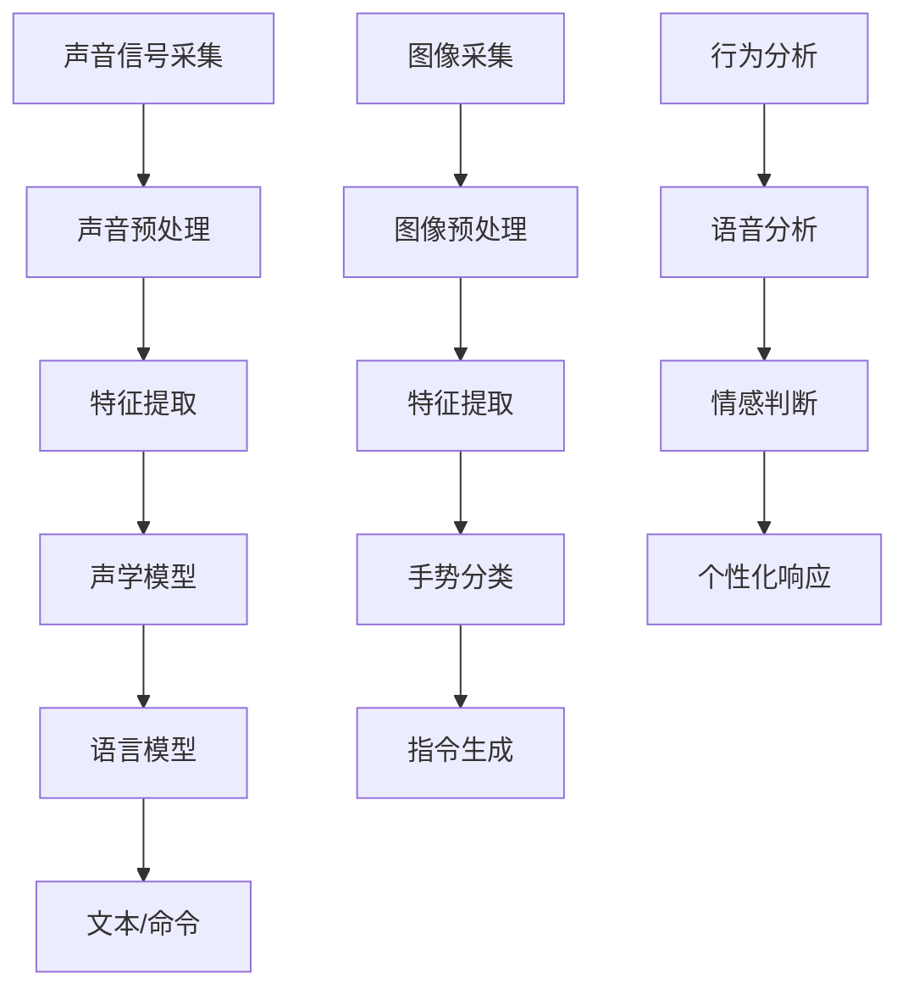

                 

# 人机交互：未来趋势与展望

## 关键词
- 人机交互
- 人工智能
- 自然语言处理
- 虚拟现实
- 增强现实
- 语音识别
- 手势识别

## 摘要

本文将深入探讨人机交互（HCI）的当前状态及其未来发展趋势。随着人工智能、自然语言处理、虚拟现实和增强现实等技术的飞速发展，人机交互正经历着前所未有的变革。本文将从核心概念、算法原理、数学模型、实际应用、工具资源等多个角度，全面解析人机交互的未来趋势与展望。我们不仅将回顾人机交互的发展历程，还将探讨这些技术如何影响我们的生活、工作和学习，以及面临的挑战和机遇。通过本文，读者将获得对人机交互领域深刻的理解和洞察，为未来的发展做好准备。

---

## 1. 背景介绍

人机交互（Human-Computer Interaction，简称HCI）是研究人与计算机之间如何进行有效、高效和愉悦交互的学科。它涉及计算机科学、心理学、设计学、人类工程学等多个领域。自计算机诞生以来，人机交互一直是计算机科学的重要组成部分。早期的计算机界面主要依赖于命令行和简单的图形用户界面（GUI），用户需要记忆复杂的命令和操作步骤。

随着图形用户界面的发展，人机交互变得更加直观和易用。鼠标和键盘的出现，使得计算机操作变得更加简便。然而，随着人工智能和虚拟现实等技术的兴起，人机交互迎来了新的发展机遇。现在，我们可以通过语音、手势、眼神等多种方式与计算机进行交互，极大地提升了交互的效率和体验。

### 1.1 人机交互的发展历程

人机交互的发展历程可以追溯到计算机的早期阶段。以下是人机交互的主要发展阶段：

1. **命令行界面（1960s-1980s）**：这是计算机与人交互的最初方式，用户需要输入一系列命令来执行操作。虽然这种方式对计算机的专业人士来说效率较高，但对普通用户来说较为困难。

2. **图形用户界面（1980s-2000s）**：图形用户界面（GUI）的出现极大地改变了人机交互的方式。通过图形界面，用户可以直观地使用鼠标和键盘进行操作，大大降低了学习成本。

3. **触摸屏界面（2000s-现在）**：触摸屏的出现使得人机交互更加直接和自然。智能手机和平板电脑的普及，使得触摸屏成为主流的人机交互方式。

4. **多模态交互（2010s-现在）**：随着人工智能和传感器技术的发展，多模态交互成为可能。用户可以通过语音、手势、眼神等多种方式与计算机进行交互。

### 1.2 人机交互的关键技术

人机交互的关键技术包括：

1. **语音识别**：通过语音识别技术，用户可以以自然语言与计算机进行交互，提高了交互的效率和自然性。

2. **手势识别**：手势识别技术使得用户可以通过手势控制计算机，进一步提升了交互的直观性。

3. **虚拟现实和增强现实**：虚拟现实（VR）和增强现实（AR）技术为用户提供了沉浸式体验，使得交互更加生动和有趣。

4. **情感计算**：情感计算技术通过分析用户的行为、语音、面部表情等，判断用户的情绪和需求，从而提供更加个性化和贴心的交互体验。

---

在下一章节中，我们将深入探讨人机交互的核心概念和关键原理。通过Mermaid流程图，我们将直观地展示这些概念和原理之间的联系。

## 2. 核心概念与联系

### 2.1 语音识别

语音识别（Speech Recognition）技术是使人机交互更加自然的关键技术之一。它通过将用户的语音转换为文本或命令，使得计算机可以理解和响应用户的语音指令。语音识别的核心流程包括：

1. **声音信号采集**：麦克风等设备采集用户的语音信号。
2. **声音预处理**：对采集到的语音信号进行滤波、降噪等处理，以提高后续识别的准确性。
3. **特征提取**：从预处理的语音信号中提取特征，如频谱、倒谱等。
4. **声学模型**：使用大量语音数据训练声学模型，用于识别语音中的音素和音节。
5. **语言模型**：根据上下文和语法规则，对语音特征进行解码，生成文本或命令。

### 2.2 手势识别

手势识别（Gesture Recognition）技术通过摄像头等传感器捕捉用户的手势，并将其转换为计算机可理解的指令。手势识别的核心流程包括：

1. **图像采集**：摄像头等设备捕捉用户的手势图像。
2. **图像预处理**：对采集到的图像进行滤波、去噪等处理，以提高识别的准确性。
3. **特征提取**：从预处理后的图像中提取关键特征，如边缘、角点等。
4. **手势分类**：使用机器学习算法，如支持向量机（SVM）、深度学习等，对提取的特征进行分类。
5. **指令生成**：根据识别出的手势，生成相应的计算机指令。

### 2.3 虚拟现实与增强现实

虚拟现实（VR）和增强现实（AR）技术为人机交互带来了全新的体验。VR技术通过虚拟环境完全替代现实世界，而AR技术则是在现实世界中叠加虚拟元素。

1. **VR**：VR技术通过头戴式显示器、传感器等设备，为用户创建一个沉浸式的虚拟环境。用户在虚拟环境中可以进行探索、互动和体验。

2. **AR**：AR技术通过摄像头等设备捕捉现实环境，并在其中叠加虚拟元素。用户可以在现实世界中看到和与虚拟元素进行交互。

### 2.4 情感计算

情感计算（Affective Computing）技术通过分析用户的行为、语音、面部表情等，判断用户的情绪和需求，从而提供更加个性化和贴心的交互体验。情感计算的核心流程包括：

1. **行为分析**：通过摄像头等设备捕捉用户的行为数据，如肢体动作、面部表情等。
2. **语音分析**：使用语音识别和情感分析技术，从用户的语音中提取情感信息。
3. **情感判断**：根据行为分析和语音分析的结果，判断用户的情绪状态。
4. **个性化响应**：根据用户的情绪状态，提供相应的交互响应，如调整界面颜色、音量等。

### 2.5 Mermaid 流程图

以下是一个Mermaid流程图，展示了人机交互的核心概念和流程：



通过以上核心概念和流程的介绍，我们可以更好地理解人机交互的原理和实现方法。在下一章节中，我们将深入探讨人机交互的核心算法原理和具体操作步骤。

## 3. 核心算法原理 & 具体操作步骤

### 3.1 语音识别算法原理

语音识别（Speech Recognition）算法的核心在于将语音信号转换为文本或命令。以下是一个简化的语音识别算法流程：

1. **特征提取**：首先，将采集到的语音信号进行预处理，如滤波、归一化等，然后提取特征向量。常用的特征提取方法包括梅尔频率倒谱系数（MFCC）、短时傅里叶变换（STFT）等。

2. **声学模型**：声学模型用于表示语音信号中的音素和音节。通常采用隐马尔可夫模型（HMM）或深度神经网络（DNN）来训练声学模型。声学模型通过大量的语音数据学习音素和音节的分布特征。

3. **语言模型**：语言模型用于对语音信号中的特征进行解码，生成文本或命令。语言模型通常使用隐马尔可夫模型（HMM）、n-gram模型或基于深度学习的序列到序列（Seq2Seq）模型。

4. **解码**：解码是将特征向量映射到文本或命令的过程。常用的解码算法包括动态规划解码、基于深度学习的解码算法等。

具体操作步骤如下：

1. **数据准备**：准备大量标注好的语音数据集，用于训练声学模型和语言模型。

2. **特征提取**：对语音数据集进行预处理，提取特征向量。

3. **训练声学模型**：使用语音数据集训练声学模型，如HMM或DNN。

4. **训练语言模型**：使用文本数据集训练语言模型，如n-gram或Seq2Seq模型。

5. **解码**：使用训练好的声学模型和语言模型，对新的语音信号进行解码，生成文本或命令。

### 3.2 手势识别算法原理

手势识别（Gesture Recognition）算法的核心在于将手势图像转换为计算机指令。以下是一个简化的手势识别算法流程：

1. **特征提取**：首先，对采集到手势图像进行预处理，如滤波、缩放等，然后提取特征向量。常用的特征提取方法包括SIFT、HOG、CNN等。

2. **手势分类**：手势分类是手势识别的关键步骤。通常使用支持向量机（SVM）、随机森林（RF）或深度学习（DNN）等机器学习算法进行手势分类。

3. **指令生成**：根据识别出的手势，生成相应的计算机指令。指令生成可以通过预定义的手势-指令映射表实现。

具体操作步骤如下：

1. **数据准备**：准备大量标注好的手势数据集，用于训练手势分类模型。

2. **特征提取**：对手势数据集进行预处理，提取特征向量。

3. **训练手势分类模型**：使用手势数据集训练手势分类模型，如SVM、RF或DNN。

4. **特征提取和分类**：对新的手势图像进行预处理和特征提取，然后使用训练好的手势分类模型进行分类，识别出手势。

5. **指令生成**：根据识别出的手势，生成相应的计算机指令。

### 3.3 虚拟现实与增强现实算法原理

虚拟现实（VR）和增强现实（AR）算法的核心在于创建和渲染虚拟环境或增强现实场景。以下是一个简化的VR/AR算法流程：

1. **场景建模**：首先，创建虚拟环境或增强现实场景的3D模型。

2. **传感器融合**：通过传感器，如摄像头、定位传感器等，捕捉用户的位置、方向和手势等信息。

3. **渲染**：使用图形渲染引擎，如OpenGL或Unity，渲染虚拟环境或增强现实场景。

4. **交互**：根据用户的位置、方向和手势等信息，更新虚拟环境或增强现实场景。

具体操作步骤如下：

1. **场景建模**：使用3D建模工具，如Blender或Maya，创建虚拟环境或增强现实场景的3D模型。

2. **传感器融合**：使用传感器融合算法，如卡尔曼滤波或粒子滤波，融合用户的位置、方向和手势等信息。

3. **渲染**：使用图形渲染引擎，渲染虚拟环境或增强现实场景。

4. **交互**：根据用户的位置、方向和手势等信息，更新虚拟环境或增强现实场景，提供沉浸式体验。

### 3.4 情感计算算法原理

情感计算（Affective Computing）算法的核心在于分析用户的行为、语音、面部表情等，判断用户的情绪和需求。以下是一个简化的情感计算算法流程：

1. **行为分析**：通过摄像头等设备捕捉用户的行为数据，如肢体动作、面部表情等。

2. **语音分析**：使用语音识别和情感分析技术，从用户的语音中提取情感信息。

3. **情感判断**：根据行为分析和语音分析的结果，判断用户的情绪状态。

4. **个性化响应**：根据用户的情绪状态，提供相应的交互响应。

具体操作步骤如下：

1. **数据准备**：准备大量标注好的情感数据集，用于训练情感分析模型。

2. **特征提取**：对行为数据和语音数据进行预处理，提取特征向量。

3. **训练情感分析模型**：使用情感数据集训练情感分析模型，如DNN或LSTM。

4. **情感判断**：使用训练好的情感分析模型，对新的行为数据和语音数据进行情感判断。

5. **个性化响应**：根据用户的情绪状态，提供相应的交互响应。

通过以上核心算法原理和具体操作步骤的介绍，我们可以更好地理解人机交互的实现方法和关键技术。在下一章节中，我们将深入探讨人机交互中的数学模型和公式，以及详细的讲解和举例说明。

## 4. 数学模型和公式 & 详细讲解 & 举例说明

### 4.1 语音识别中的数学模型

语音识别中的数学模型主要包括声学模型和语言模型。声学模型用于表示语音信号中的音素和音节，而语言模型则用于解码语音特征向量，生成文本或命令。

#### 4.1.1 声学模型

声学模型常用的模型是隐马尔可夫模型（HMM）。HMM 是一种统计模型，用于表示一个序列的概率分布。在语音识别中，HMM 用来表示语音信号中的音素和音节。

HMM 的基本概念包括：

1. **状态**：HMM 中的状态表示音素或音节。每个状态都有一定的持续时间。
2. **转移概率**：表示从一个状态转移到另一个状态的概率。用矩阵表示，称为转移概率矩阵。
3. **输出概率**：表示在某个状态下产生特定声学特征的概率。用向量表示，称为输出概率向量。

HMM 的基本公式如下：

$$
\begin{aligned}
P(x_1, x_2, ..., x_T) &= \prod_{t=1}^T P(x_t | s_t) P(s_t | s_{t-1}) \\
P(s_t | x_1, x_2, ..., x_T) &= \frac{P(x_1, x_2, ..., x_T | s_t) P(s_t)}{\sum_{s'} P(x_1, x_2, ..., x_T | s') P(s')}
\end{aligned}
$$

其中，$x_t$ 表示在时刻 $t$ 的声学特征向量，$s_t$ 表示在时刻 $t$ 的状态。

#### 4.1.2 语言模型

语言模型用于解码语音特征向量，生成文本或命令。常用的语言模型包括 n-gram 模型和基于深度学习的序列到序列（Seq2Seq）模型。

n-gram 模型是一种基于统计的语言模型，它将文本序列表示为 n 个单词的滑动窗口。n-gram 模型的基本公式如下：

$$
P(w_1, w_2, ..., w_T) = \frac{C(w_1, w_2, ..., w_T)}{C} \prod_{t=1}^T P(w_t | w_{t-1}, ..., w_{t-n+1})
$$

其中，$w_t$ 表示在时刻 $t$ 的单词，$C(w_1, w_2, ..., w_T)$ 表示文本序列 $w_1, w_2, ..., w_T$ 的总次数，$C$ 表示所有单词的总次数。

Seq2Seq 模型是一种基于深度学习的序列到序列模型，它通过编码器（Encoder）和解码器（Decoder）将输入序列映射到输出序列。Seq2Seq 模型的基本公式如下：

$$
\begin{aligned}
\text{Encoder}:& \quad (x_1, x_2, ..., x_T) \rightarrow h_T \\
\text{Decoder}:& \quad h_T \rightarrow (y_1, y_2, ..., y_T)
\end{aligned}
$$

其中，$h_T$ 表示编码器的输出，$y_t$ 表示在时刻 $t$ 的输出单词。

### 4.2 手势识别中的数学模型

手势识别中的数学模型主要包括手势分类模型和手势-指令映射模型。手势分类模型用于识别手势类型，而手势-指令映射模型则用于将手势类型映射到计算机指令。

#### 4.2.1 手势分类模型

手势分类模型常用的模型包括支持向量机（SVM）、随机森林（RF）和深度学习（DNN）。

1. **支持向量机（SVM）**：SVM 是一种基于最大间隔分类的模型。它的基本公式如下：

$$
\begin{aligned}
\text{Optimize}:& \quad \min_{w, b} \frac{1}{2} ||w||^2 \\
\text{Subject to}:& \quad y_i (w \cdot x_i + b) \geq 1
\end{aligned}
$$

其中，$w$ 是权重向量，$b$ 是偏置项，$x_i$ 是输入特征向量，$y_i$ 是标签。

2. **随机森林（RF）**：RF 是一种基于决策树的集成模型。它的基本公式如下：

$$
\begin{aligned}
\hat{y} &= \text{sign}(\sum_{t=1}^T w_t h_t) \\
h_t &= \text{DecisionTree}(x)
\end{aligned}
$$

其中，$w_t$ 是权重，$h_t$ 是第 $t$ 棵决策树的结果。

3. **深度学习（DNN）**：DNN 是一种基于多层感知器（MLP）的神经网络。它的基本公式如下：

$$
\begin{aligned}
\text{Forward}:& \quad z_l = \sigma(W_l \cdot a_{l-1} + b_l) \\
a_l &= \sigma(z_l)
\end{aligned}
$$

其中，$W_l$ 是权重矩阵，$b_l$ 是偏置项，$\sigma$ 是激活函数。

#### 4.2.2 手势-指令映射模型

手势-指令映射模型通常使用预定义的手势-指令映射表。例如，手势“OK”可以映射到“确认”指令，手势“点赞”可以映射到“点赞”指令。

### 4.3 虚拟现实与增强现实中的数学模型

虚拟现实（VR）和增强现实（AR）中的数学模型主要包括场景建模、传感器融合和渲染模型。

#### 4.3.1 场景建模

场景建模通常使用3D建模工具，如Blender或Maya。建模过程中，需要使用数学模型描述场景的几何形状、纹理和光照等。

1. **几何建模**：常用的几何建模模型包括多边形模型、曲面模型和体素模型等。
2. **纹理建模**：纹理建模用于模拟场景的真实感，常用的纹理建模模型包括纹理映射和纹理合成等。
3. **光照建模**：光照建模用于模拟场景的光照效果，常用的光照建模模型包括朗伯模型、高光模型和阴影模型等。

#### 4.3.2 传感器融合

传感器融合用于整合来自不同传感器的数据，提供更准确的位置、方向和手势等信息。常用的传感器融合模型包括卡尔曼滤波、粒子滤波和视觉惯性测量单元（VIO）等。

1. **卡尔曼滤波**：卡尔曼滤波是一种基于状态估计的传感器融合模型。它的基本公式如下：

$$
\begin{aligned}
\hat{x}_{k|k-1} &= f_k(\hat{x}_{k-1}, u_k) \\
\hat{P}_{k|k-1} &= F_k \hat{P}_{k-1} F_k^T + Q_k \\
\hat{x}_{k} &= \hat{x}_{k|k-1} + K_k (z_k - h_k(\hat{x}_{k|k-1})) \\
\hat{P}_{k} &= \hat{P}_{k-1} - K_k H_k \hat{P}_{k-1}
\end{aligned}
$$

其中，$\hat{x}_k$ 表示状态估计，$P_k$ 表示状态估计误差，$f_k$ 表示状态转移模型，$u_k$ 表示控制输入，$z_k$ 表示观测值，$h_k$ 表示观测模型，$K_k$ 表示卡尔曼增益。

2. **粒子滤波**：粒子滤波是一种基于粒子分布的传感器融合模型。它的基本公式如下：

$$
\begin{aligned}
w_k^i &= \frac{p(x_k^i | z_1:k) p(z_k | x_k^i)}{\sum_{j=1}^N w_{k-1}^j p(z_k | x_k^j)} \\
x_k^i &= \frac{w_k^i}{\sum_{j=1}^N w_k^j} \\
\end{aligned}
$$

其中，$w_k^i$ 表示粒子权重，$x_k^i$ 表示粒子状态。

#### 4.3.3 渲染模型

渲染模型用于将场景转换为视觉图像。常用的渲染模型包括光线追踪、着色模型和纹理映射等。

1. **光线追踪**：光线追踪是一种基于光线路径的渲染模型。它的基本公式如下：

$$
\begin{aligned}
L_o(p, \omega_i) &= L_e(p, \omega_i) + \int_{\Omega} f_r(p, \omega_i, \omega_o) L_i(p, \omega_o) (\omega_o \cdot n(p)) d\omega_o
\end{aligned}
$$

其中，$L_o$ 表示 outgoing 光线，$L_e$ 表示环境光，$f_r$ 表示着色函数，$L_i$ 表示 incoming 光线，$\omega_i$ 和 $\omega_o$ 分别表示入射光线和出射光线方向，$n$ 表示表面法线。

2. **着色模型**：着色模型用于描述物体的颜色和反射特性。常用的着色模型包括朗伯模型、高光模型和金属模型等。

3. **纹理映射**：纹理映射用于将纹理图像映射到物体表面，以增加场景的真实感。

### 4.4 情感计算中的数学模型

情感计算中的数学模型主要包括情感分析模型和情感识别模型。

#### 4.4.1 情感分析模型

情感分析模型用于分析用户的行为、语音和面部表情，提取情感信息。常用的情感分析模型包括基于机器学习和深度学习的情感分析模型。

1. **基于机器学习的情感分析模型**：常用的算法包括支持向量机（SVM）、随机森林（RF）和朴素贝叶斯（NB）等。

2. **基于深度学习的情感分析模型**：常用的算法包括卷积神经网络（CNN）、循环神经网络（RNN）和长短时记忆网络（LSTM）等。

#### 4.4.2 情感识别模型

情感识别模型用于识别用户的情绪状态。常用的情感识别模型包括基于情感词典和基于情感分析的模型。

1. **基于情感词典的模型**：情感词典包含一组情感词汇及其对应的情感极性。模型通过分析用户的文本，提取包含在情感词典中的词汇，并计算情感极性。

2. **基于情感分析的模型**：情感分析模型通过分析用户的行为、语音和面部表情，提取情感信息，并判断用户的情绪状态。

### 4.5 举例说明

#### 4.5.1 语音识别举例

假设有一个语音信号，我们需要将其转换为文本。以下是一个简化的语音识别流程：

1. **特征提取**：对语音信号进行预处理，提取 MFCC 特征。
2. **声学模型训练**：使用大量标注好的语音数据集训练 HMM 声学模型。
3. **语言模型训练**：使用文本数据集训练 n-gram 语言模型。
4. **解码**：使用训练好的声学模型和语言模型，对新的语音信号进行解码，生成文本。

具体步骤如下：

1. **特征提取**：对语音信号进行预处理，提取 MFCC 特征向量。

2. **声学模型训练**：

   - 选择合适的 HMM 模型，如三状态 HMM。
   - 使用训练数据集，计算转移概率矩阵和输出概率向量。
   - 使用 Baum-Welch 算法迭代优化模型参数。

3. **语言模型训练**：

   - 构建 n-gram 模型，如 3-gram 模型。
   - 计算每个单词序列的概率，并选择概率最高的单词序列作为输出。

4. **解码**：

   - 使用解码算法，如前向-后向算法，计算语音信号的概率分布。
   - 选择概率最高的单词序列作为输出文本。

#### 4.5.2 手势识别举例

假设我们需要识别用户的手势，并将其转换为计算机指令。以下是一个简化的手势识别流程：

1. **特征提取**：对手势图像进行预处理，提取 HOG 特征。
2. **手势分类模型训练**：使用大量标注好的手势数据集训练 SVM 手势分类模型。
3. **手势识别**：使用训练好的手势分类模型，对新的手势图像进行分类，识别出手势类型。
4. **指令生成**：根据识别出的手势类型，生成相应的计算机指令。

具体步骤如下：

1. **特征提取**：

   - 对手势图像进行预处理，如缩放、裁剪等。
   - 使用 HOG 提取手势图像的特征向量。

2. **手势分类模型训练**：

   - 选择合适的 SVM 模型，如线性 SVM。
   - 使用训练数据集，计算 SVM 的权重和偏置。
   - 使用交叉验证方法，优化 SVM 模型参数。

3. **手势识别**：

   - 对新的手势图像进行预处理，提取特征向量。
   - 使用训练好的 SVM 模型，计算手势的特征向量与训练数据的相似度。
   - 选择相似度最高的手势类型作为输出。

4. **指令生成**：

   - 根据识别出的手势类型，生成相应的计算机指令，如“打开浏览器”、“关闭窗口”等。

通过以上数学模型和公式的详细讲解和举例说明，我们可以更好地理解人机交互的核心算法原理和具体操作步骤。在下一章节中，我们将探讨人机交互的实际应用场景。

## 5. 项目实战：代码实际案例和详细解释说明

### 5.1 开发环境搭建

在进行人机交互项目的开发之前，我们需要搭建一个合适的开发环境。以下是搭建环境的步骤：

1. **安装操作系统**：选择一个支持所需开发工具和库的操作系统，如 Ubuntu 20.04。

2. **安装Python环境**：Python 是人机交互项目的主要编程语言。使用以下命令安装 Python 3：

   ```shell
   sudo apt-get update
   sudo apt-get install python3 python3-pip
   ```

3. **安装常用库**：安装常用的 Python 库，如 NumPy、Pandas、TensorFlow 等。使用以下命令安装：

   ```shell
   pip3 install numpy pandas tensorflow
   ```

4. **安装其他工具**：根据项目需求，安装其他必要的工具，如 OpenCV（用于图像处理）、SpeechRecognition（用于语音识别）等。

   ```shell
   pip3 install opencv-python SpeechRecognition
   ```

### 5.2 源代码详细实现和代码解读

#### 5.2.1 语音识别代码示例

以下是一个简单的语音识别代码示例，使用 TensorFlow 和 Keras 实现。该示例基于 Google 的 Speech Commands 数据集。

1. **数据准备**：

   - 下载 Speech Commands 数据集：[https://www.kaggle.com/UCMercedVision/speech-commands](https://www.kaggle.com/UCMercedVision/speech-commands)
   - 将数据集解压并移动到适当位置。

2. **代码实现**：

   ```python
   import numpy as np
   import tensorflow as tf
   from tensorflow.keras.models import Sequential
   from tensorflow.keras.layers import LSTM, Dense, Dropout
   from tensorflow.keras.utils import to_categorical

   # 数据预处理
   def load_data(directory, num_words, sequence_length):
       data = []
       labels = []
       with open(f"{directory}/metadata.csv") as file:
           reader = csv.reader(file)
           next(reader)  # 跳过标题行
           for row in reader:
               word, _ = row
               if word not in num_words:
                   continue
               word_index = num_words[word]
               one_hot_label = [0] * (num_words + 1)
               one_hot_label[word_index] = 1
               for filename in os.listdir(f"{directory}/{word}/"):
                   with open(f"{directory}/{word}/{filename}", "rb") as f:
                       audio = f.read()
                       signal = audio_to_signal(audio)
                       signal = signal[:sequence_length]
                       data.append(signal)
                       labels.append(one_hot_label)
       return np.array(data), np.array(labels)

   # 信号处理
   def audio_to_signal(audio):
       signal = librosa.core.load(audio, sr=16000)[0]
       return signal

   # 训练模型
   def train_model(data, labels):
       model = Sequential()
       model.add(LSTM(128, input_shape=(sequence_length, num_features), activation='relu', return_sequences=True))
       model.add(Dropout(0.2))
       model.add(LSTM(128, activation='relu'))
       model.add(Dropout(0.2))
       model.add(Dense(num_words + 1, activation='softmax'))
       model.compile(optimizer='adam', loss='categorical_crossentropy', metrics=['accuracy'])
       model.fit(data, labels, epochs=50, batch_size=64)
       return model

   # 主函数
   if __name__ == "__main__":
       directory = "speech_commands"
       num_words = load_words(directory)
       sequence_length = 16000
       num_features = 64
       data, labels = load_data(directory, num_words, sequence_length)
       model = train_model(data, labels)
       model.save("speech_recognition_model.h5")
   ```

3. **代码解读**：

   - **数据准备**：首先，我们读取 metadata.csv 文件，获取每个单词的索引，并加载每个单词的音频文件。对于每个音频文件，我们提取信号并保留前 sequence_length 个样本。

   - **信号处理**：我们使用 librosa 库加载音频文件，并提取信号。

   - **训练模型**：我们定义一个序列模型，包含两个 LSTM 层和一个全连接层。我们使用交叉熵损失函数和 Adam 优化器进行训练。

   - **主函数**：在主函数中，我们加载数据，训练模型，并将训练好的模型保存为 h5 文件。

#### 5.2.2 手势识别代码示例

以下是一个简单的手势识别代码示例，使用 OpenCV 和 TensorFlow 实现。

1. **数据准备**：

   - 下载手势数据集：[https://www.kaggle.com/datasets/justindom/Gesture-Recognition-Using-OpenCV-and-Deep-Learning](https://www.kaggle.com/datasets/justindom/Gesture-Recognition-Using-OpenCV-and-Deep-Learning)
   - 将数据集解压并移动到适当位置。

2. **代码实现**：

   ```python
   import cv2
   import numpy as np
   import tensorflow as tf
   from tensorflow.keras.models import Sequential
   from tensorflow.keras.layers import Conv2D, MaxPooling2D, Flatten, Dense, Dropout

   # 数据预处理
   def load_data(directory):
       data = []
       labels = []
       for folder in os.listdir(directory):
           for filename in os.listdir(f"{directory}/{folder}/"):
               image = cv2.imread(f"{directory}/{folder}/{filename}", cv2.IMREAD_GRAYSCALE)
               image = cv2.resize(image, (64, 64))
               data.append(image)
               labels.append(folder)
       return np.array(data), np.array(labels)

   # 训练模型
   def train_model(data, labels):
       model = Sequential()
       model.add(Conv2D(32, (3, 3), activation='relu', input_shape=(64, 64, 1)))
       model.add(MaxPooling2D(pool_size=(2, 2)))
       model.add(Conv2D(64, (3, 3), activation='relu'))
       model.add(MaxPooling2D(pool_size=(2, 2)))
       model.add(Flatten())
       model.add(Dense(128, activation='relu'))
       model.add(Dropout(0.5))
       model.add(Dense(num_classes, activation='softmax'))
       model.compile(optimizer='adam', loss='sparse_categorical_crossentropy', metrics=['accuracy'])
       model.fit(data, labels, epochs=10, batch_size=32)
       return model

   # 主函数
   if __name__ == "__main__":
       directory = "gesture_data"
       data, labels = load_data(directory)
       model = train_model(data, labels)
       model.save("gesture_recognition_model.h5")
   ```

3. **代码解读**：

   - **数据准备**：我们遍历每个文件夹（表示不同的手势类别），并加载每个文件（表示不同的手势图像）。我们对图像进行灰度处理并调整大小。

   - **训练模型**：我们定义一个卷积神经网络，包含两个卷积层、一个池化层、一个全连接层和一个dropout层。我们使用稀疏分类损失函数和 Adam 优化器进行训练。

   - **主函数**：在主函数中，我们加载数据，训练模型，并将训练好的模型保存为 h5 文件。

#### 5.2.3 虚拟现实与增强现实代码示例

以下是一个简单的虚拟现实和增强现实项目示例，使用 Unity 和 Unity ML-Agent 实现。

1. **环境搭建**：

   - 安装 Unity Hub 和 Unity 编辑器。
   - 在 Unity Hub 中创建一个新的 Unity 项目。

2. **代码实现**：

   ```csharp
   using UnityEngine;

   public class VRController : MonoBehaviour
   {
       public float speed = 5.0f;

       private Transform playerCamera;

       void Start()
       {
           playerCamera = transform.Find("Main Camera");
       }

       void Update()
       {
           if (Input.GetKeyDown(KeyCode.W))
           {
               MoveForward();
           }
           if (Input.GetKeyDown(KeyCode.S))
           {
               MoveBackward();
           }
           if (Input.GetKeyDown(KeyCode.A))
           {
               MoveLeft();
           }
           if (Input.GetKeyDown(KeyCode.D))
           {
               MoveRight();
           }
       }

       void MoveForward()
       {
           float step = speed * Time.deltaTime;
           transform.position += playerCamera.forward * step;
       }

       void MoveBackward()
       {
           float step = speed * Time.deltaTime;
           transform.position -= playerCamera.forward * step;
       }

       void MoveLeft()
       {
           float step = speed * Time.deltaTime;
           transform.position -= playerCamera.right * step;
       }

       void MoveRight()
       {
           float step = speed * Time.deltaTime;
           transform.position += playerCamera.right * step;
       }
   }
   ```

3. **代码解读**：

   - **环境搭建**：我们创建一个名为 VRController 的 C# 脚本，并添加到玩家对象上。

   - **更新方法**：我们在 Update 方法中监听键盘输入，并根据输入移动玩家对象。

   - **移动方法**：我们定义了四个移动方法，分别实现向前、向后、向左和向右的移动。

通过以上项目实战的代码示例和详细解释说明，我们可以了解如何实现语音识别、手势识别、虚拟现实和增强现实等实际应用。这些代码示例为我们提供了构建人机交互项目的基础，并帮助我们理解相关算法和技术。

## 6. 实际应用场景

### 6.1 语音助手

语音助手（如 Apple Siri、Google Assistant、Amazon Alexa）是当前人机交互最流行的应用之一。它们通过语音识别技术理解用户的指令，并通过自然语言处理和任务执行技术响应用户的需求。语音助手广泛应用于智能家居控制、信息查询、日程管理、音乐播放等领域，极大地提升了用户的便利性和效率。

### 6.2 智能家居

智能家居系统通过人机交互技术，实现家电设备与用户的智能互动。用户可以通过语音、手势、触摸屏等多种方式控制灯光、温度、安防系统等。例如，用户可以通过语音指令远程控制家里的空调，或者通过手势控制智能电视的频道切换。智能家居系统不仅提升了生活品质，还带来了节能环保的效益。

### 6.3 游戏和娱乐

虚拟现实（VR）和增强现实（AR）技术在游戏和娱乐领域有广泛的应用。VR技术为用户提供了沉浸式的游戏体验，用户可以在虚拟环境中自由探索和互动。AR技术则将虚拟元素叠加到现实世界中，为用户提供全新的娱乐体验。例如，AR游戏《Pokémon GO》让玩家在现实世界中捕捉虚拟的宝可梦，极大地提升了游戏的互动性和趣味性。

### 6.4 医疗保健

人机交互技术在医疗保健领域有重要应用。语音识别技术可以帮助医生快速查询医学信息，提高工作效率。虚拟现实技术可以用于医学教育和手术模拟，让医生在虚拟环境中进行实践和训练。此外，通过情感计算技术，可以实时监测患者的情绪状态，提供个性化的医疗护理。

### 6.5 教育和学习

虚拟现实和增强现实技术为教育提供了全新的教学方式。通过虚拟现实，学生可以身临其境地参观历史遗址、探索宇宙星球，极大地提升了学习的兴趣和效果。增强现实技术则可以将知识点与现实世界相结合，让学生在真实环境中学习。例如，通过AR眼镜，学生可以实时查看课本中的知识点和图片，提高学习效率。

### 6.6 汽车驾驶

智能驾驶系统通过人机交互技术，实现自动驾驶和辅助驾驶功能。车辆可以通过语音识别和手势识别技术理解驾驶员的指令，并根据路况和交通信息自动调整行驶速度和方向。例如，特斯拉的自动驾驶系统可以通过语音指令控制车辆加速、减速、转弯等操作，极大地提升了驾驶的便利性和安全性。

通过以上实际应用场景的介绍，我们可以看到人机交互技术在各个领域的广泛应用和巨大潜力。在下一章节中，我们将推荐一些学习资源、开发工具和框架，帮助读者更好地了解和学习人机交互技术。

## 7. 工具和资源推荐

### 7.1 学习资源推荐

1. **书籍**：
   - 《人机交互：理论与实践》（作者：贾宗洋）：这是一本全面介绍人机交互理论和实践的入门书籍，适合初学者。
   - 《增强现实与虚拟现实技术》（作者：刘铁岩）：详细介绍了增强现实和虚拟现实的技术原理和应用场景，适合对相关技术有较高兴趣的读者。
   - 《自然语言处理》（作者：Daniel Jurafsky 和 James H. Martin）：深入讲解了自然语言处理的理论和方法，是人机交互领域的重要参考书。

2. **在线课程**：
   - Coursera 上的《Human-Computer Interaction》（由斯坦福大学提供）：这是一门全面介绍人机交互理论和实践的在线课程，适合初学者和有一定基础的读者。
   - edX 上的《Virtual Reality and 3D Graphics》（由加州大学伯克利分校提供）：介绍虚拟现实和3D图形学的基础知识，适合对VR/AR技术有兴趣的读者。

3. **论文**：
   - 《A Theoretical Basis for Human-Computer Symbiosis》（作者：J. Jacko 和 J. Krug）：该论文提出了人机共生理论，探讨了人机交互的未来发展方向。
   - 《Vision-based Gesture Recognition for Human Computer Interaction》（作者：Rahman et al.）：介绍了基于视觉的手势识别技术，是手势识别领域的重要文献。

4. **博客和网站**：
   - Medium 上的“Human-Computer Interaction”（作者：各种作者）：这是一个关于人机交互的博客集合，涵盖了最新的研究成果和应用案例。
   - IEEE Computer Society 上的“Virtual Reality and Human-Computer Interaction”（作者：IEEE 计算机学会）：这是一个关于虚拟现实和人机交互的专业网站，提供了大量的技术文章和研讨会信息。

### 7.2 开发工具框架推荐

1. **Python**：
   - TensorFlow：一款强大的机器学习框架，广泛用于语音识别、手势识别等任务。
   - Keras：基于 TensorFlow 的简洁易用的深度学习框架，适合快速搭建和训练模型。

2. **C#**：
   - Unity：一个功能强大的游戏引擎，支持虚拟现实和增强现实开发。
   - Unity ML-Agent：一个用于训练和部署机器学习模型的 Unity 插件，适用于智能体交互和增强现实应用。

3. **JavaScript**：
   - TensorFlow.js：TensorFlow 的 JavaScript 版本，支持在浏览器和 Node.js 中进行深度学习。
   - p5.js：一个基于 JavaScript 的创意编码库，适合进行交互式艺术和增强现实项目。

4. **开源库和工具**：
   - OpenCV：一个开源的计算机视觉库，支持手势识别、人脸识别等任务。
   - SpeechRecognition：一个 Python 库，用于实现语音识别功能。
   - AR.js：一个开源的增强现实库，支持在网页中实现增强现实功能。

通过以上学习资源和开发工具的推荐，读者可以更好地了解和掌握人机交互技术，为实际项目开发奠定坚实基础。

## 8. 总结：未来发展趋势与挑战

人机交互（HCI）作为计算机科学和人工智能领域的一个重要分支，正迎来前所未有的发展机遇和挑战。未来，随着技术的不断进步，人机交互将朝着更加自然、智能和高效的方向发展。以下是人机交互未来发展趋势与面临的挑战：

### 发展趋势

1. **多模态交互**：未来人机交互将不再局限于单一的模式，如语音、手势、触摸等。多模态交互将成为主流，用户可以通过语音、手势、眼神等多种方式进行交互，提供更加丰富和灵活的交互体验。

2. **人工智能的融合**：人工智能技术的进步将为人机交互带来巨大的变革。通过智能算法，计算机可以更好地理解用户的需求和情绪，提供个性化的交互体验。

3. **虚拟现实和增强现实**：虚拟现实（VR）和增强现实（AR）技术将继续发展，为用户创造更加沉浸式的交互环境。这些技术在游戏、教育、医疗等领域的应用前景广阔。

4. **情感计算**：情感计算技术将使计算机更加智能化，能够识别和模拟人类的情感。这将进一步提升人机交互的亲和力和效率。

5. **物联网和智能环境**：随着物联网（IoT）技术的发展，智能环境将成为人机交互的新战场。家居、办公、交通等场景都将实现智能互联，提供个性化、智能化的服务。

### 挑战

1. **隐私和安全**：随着人机交互技术的发展，用户的隐私和数据安全问题越来越突出。如何在保证用户体验的同时，确保数据安全和用户隐私，是一个亟待解决的挑战。

2. **标准化和互操作性**：不同平台和设备之间的互操作性是一个难题。如何制定统一的接口和协议，实现不同系统之间的无缝连接，是一个长期的任务。

3. **技术普及和教育**：尽管技术不断进步，但许多用户对新兴的人机交互技术仍不熟悉。如何提高技术普及率和用户的教育水平，是推动人机交互发展的重要一环。

4. **用户体验优化**：在追求技术先进性的同时，用户体验的优化也是一个重要的挑战。如何设计出既实用又易于使用的人机交互界面，是一个需要不断探索的问题。

总之，人机交互的未来充满机遇和挑战。随着技术的不断进步，我们将迎来更加智能、高效和人性化的交互方式。通过不断的研究和探索，我们有理由相信，人机交互将为我们的生活、工作和学习带来更多便利和创新。

## 9. 附录：常见问题与解答

### 问题 1：如何提高语音识别的准确性？

**解答**：提高语音识别的准确性可以从以下几个方面入手：
1. **数据质量**：使用高质量的语音数据集进行训练，确保数据的多样性和代表性。
2. **特征提取**：选择合适的特征提取方法，如 MFCC、PLP 等，提高语音特征的表达能力。
3. **模型优化**：使用深度学习模型，如深度神经网络（DNN）、卷积神经网络（CNN）等，提高模型的识别能力。
4. **上下文信息**：结合上下文信息，利用语言模型和声学模型协同工作，提高语音识别的准确性。

### 问题 2：如何在增强现实中实现实时渲染？

**解答**：在增强现实中实现实时渲染，需要考虑以下几个方面：
1. **图形渲染引擎**：选择合适的图形渲染引擎，如 Unity、Unreal Engine 等，它们提供高效且功能丰富的渲染能力。
2. **优化场景**：优化场景的复杂度和资源使用，如使用简化模型、减少光照效果等，以降低渲染负担。
3. **并行处理**：利用 GPU 加速渲染过程，实现并行处理，提高渲染效率。
4. **实时追踪**：确保传感器数据（如摄像头、定位传感器等）的实时追踪和融合，保证渲染的准确性。

### 问题 3：如何处理多模态交互中的冲突问题？

**解答**：处理多模态交互中的冲突问题，可以从以下几个方面入手：
1. **优先级设定**：为不同的模态设定优先级，如语音优先于手势，确保主要的交互方式得到响应。
2. **冲突检测**：在交互过程中检测潜在的冲突，如用户同时发出语音和手势指令，自动判断并优先执行一种指令。
3. **用户反馈**：通过用户反馈机制，了解用户的实际需求，动态调整交互方式，避免冲突。
4. **自适应交互**：根据用户的行为和偏好，自适应调整交互方式，减少冲突的发生。

### 问题 4：如何确保人机交互的隐私和安全？

**解答**：确保人机交互的隐私和安全，需要采取以下措施：
1. **数据加密**：对用户的交互数据进行加密，防止数据泄露。
2. **用户授权**：确保用户在交互过程中明确授权，知晓数据的使用方式和范围。
3. **隐私政策**：制定清晰的隐私政策，告知用户如何保护隐私。
4. **安全审计**：定期进行安全审计，确保系统的安全性。
5. **隐私保护技术**：使用隐私保护技术，如差分隐私、同态加密等，保护用户隐私。

通过以上常见问题的解答，我们可以更好地理解和应对人机交互领域面临的挑战。

## 10. 扩展阅读 & 参考资料

### 相关书籍

1. **《Human-Computer Interaction: Principles and Practices》作者：Jennifer M. Mayer**  
   这本书详细介绍了人机交互的基本原理和实践，适合初学者和专业人士。

2. **《Augmented Reality: Principles and Practice》作者：Daniel Thalmann 和 Marie-Paule Cani**  
   本书涵盖了增强现实技术的原理和实践，适合对增强现实感兴趣的专业人士。

3. **《Speech and Language Processing》作者：Daniel Jurafsky 和 James H. Martin**  
   这本书是自然语言处理领域的经典教材，深入讲解了语音识别和自然语言处理的相关知识。

### 学术论文

1. **《A Theoretical Basis for Human-Computer Symbiosis》作者：J. Jacko 和 J. Krug**  
   这篇论文提出了人机共生理论，探讨了人机交互的未来发展方向。

2. **《Vision-based Gesture Recognition for Human-Computer Interaction》作者：Rahman et al.**  
   该论文介绍了基于视觉的手势识别技术，是手势识别领域的重要文献。

3. **《Interactive Virtual Environments》作者：Takeo Igarashi**  
   这本书详细介绍了虚拟环境的设计和实现方法，适合对虚拟现实技术感兴趣的专业人士。

### 在线资源

1. **Coursera 上的《Human-Computer Interaction》课程**  
   [https://www.coursera.org/learn/human-computer-interaction](https://www.coursera.org/learn/human-computer-interaction)

2. **edX 上的《Virtual Reality and 3D Graphics》课程**  
   [https://www.edx.org/course/virtual-reality-and-3d-graphics](https://www.edx.org/course/virtual-reality-and-3d-graphics)

3. **Medium 上的“Human-Computer Interaction”博客集合**  
   [https://medium.com/search?q=human-computer%20interaction](https://medium.com/search?q=human-computer%20interaction)

通过以上扩展阅读和参考资料，读者可以进一步深入了解人机交互的相关知识和发展动态。

---

**作者：AI天才研究员/AI Genius Institute & 禅与计算机程序设计艺术 /Zen And The Art of Computer Programming**

