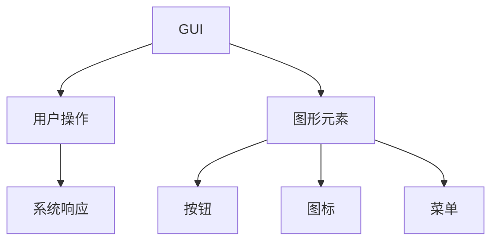
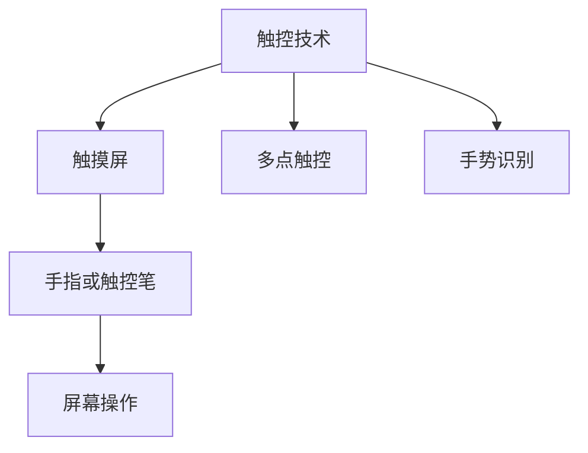
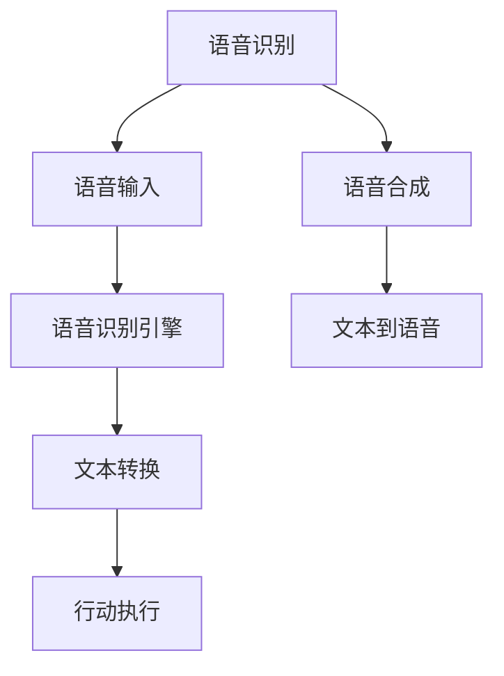
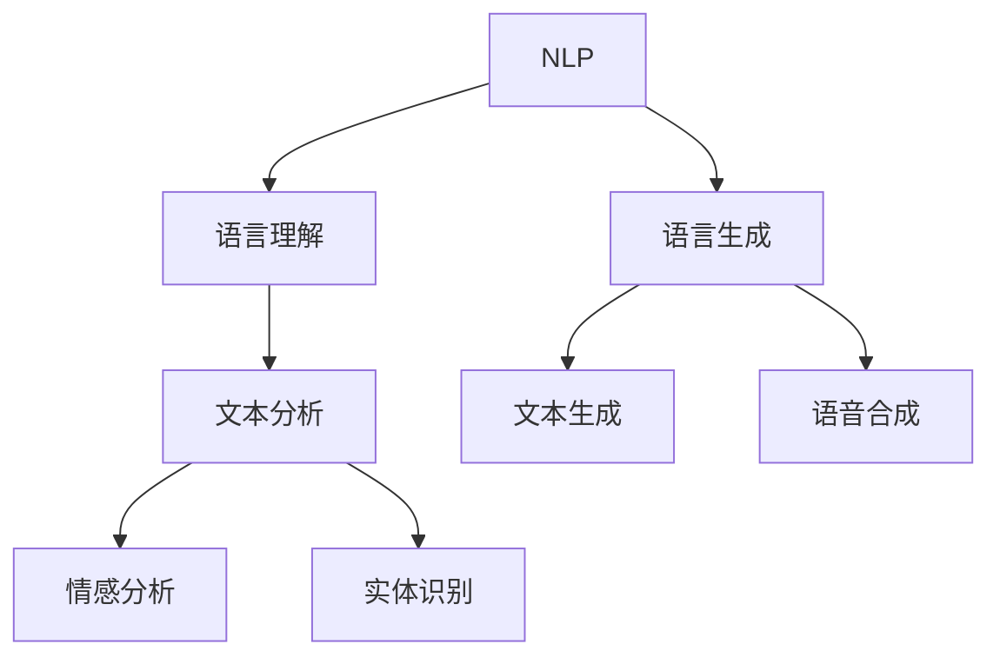
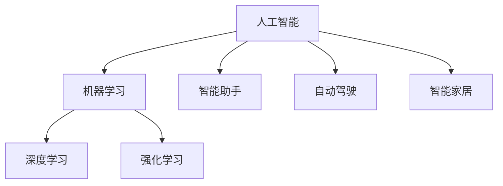

                 

### 背景介绍

在人机交互领域，随着科技的迅猛发展，我们正站在一个崭新的历史节点上。从最早的命令行界面，到图形用户界面（GUI），再到如今的触摸屏、语音识别、自然语言处理等，人机交互技术已经发生了翻天覆地的变化。这种变化不仅仅体现在技术层面的进步，更重要的是对人类生活和工作方式的深刻影响。

首先，让我们回顾一下人机交互技术的发展历程。在20世纪80年代，个人电脑开始普及，图形用户界面（GUI）成为主流，这一时期的代表性技术包括微软的Windows操作系统和苹果的Mac OS。GUI的出现极大地提高了人机交互的易用性，用户可以通过直观的图形界面进行操作，而不再需要记忆复杂的命令。

随着互联网的兴起，人机交互技术迎来了新的发展机遇。网页浏览器、电子邮件、即时通讯工具等互联网应用极大地丰富了人机交互的形态。这一时期，人机交互的核心目标是从信息传递转向信息获取和共享。

进入21世纪，移动互联网的兴起进一步推动了人机交互技术的发展。智能手机和平板电脑的普及，使得人们可以随时随地进行信息交互。同时，触控技术的应用使得人机交互更加直观和便捷。此外，语音识别技术的突破，使得人机交互从视觉和触觉延伸到了听觉。

近年来，人工智能技术的快速发展，使得人机交互技术进入了一个全新的阶段。智能助手、智能家居、智能医疗等应用场景不断涌现，人机交互不再只是人与机器的交互，而是人与智能系统的交互。这种交互模式不仅提高了效率，更改变了人们的思维方式和生活习惯。

总的来说，人机交互技术的发展历程是人类与机器之间的交互方式不断进化、优化和升级的过程。每一个技术里程碑都代表着人类对机器理解程度的加深，以及对自身生活方式的重新定义。在接下来的部分，我们将深入探讨人机交互的核心概念、算法原理、数学模型以及实际应用场景，希望能为大家提供一个全面、深入的了解。

## 1. 核心概念与联系

在人机交互领域，有几个核心概念和技术是不可或缺的。理解这些概念和技术，对于我们深入探讨人机交互的未来趋势和展望至关重要。下面，我们将逐一介绍这些核心概念，并通过Mermaid流程图来展示它们之间的联系。

### 1.1. 图形用户界面(GUI)

图形用户界面（GUI）是人机交互的一个重要组成部分。它通过图形元素，如按钮、图标、菜单等，来简化用户的操作。GUI使得用户可以通过直观的方式与计算机进行交互，而不需要记忆复杂的命令。

#### Mermaid流程图：



### 1.2. 触控技术

触控技术使得用户可以直接通过手指或触控笔与屏幕进行交互。这种交互方式直观、便捷，极大地提升了用户体验。触控技术广泛应用于智能手机、平板电脑、智能电视等领域。

#### Mermaid流程图：



### 1.3. 语音识别

语音识别技术使得计算机可以理解人类的语音命令，并将其转换为文本或行动。这一技术的突破，使得人机交互从视觉和触觉延伸到了听觉，为用户提供了全新的交互方式。

#### Mermaid流程图：



### 1.4. 自然语言处理(NLP)

自然语言处理（NLP）是人工智能的一个重要分支，它使得计算机可以理解和生成自然语言。NLP在智能助手、语音识别、机器翻译等领域有着广泛的应用。

#### Mermaid流程图：



### 1.5. 人工智能(AI)

人工智能（AI）是人机交互的核心驱动力。通过AI技术，计算机可以模拟人类智能，实现自主学习和决策。AI的应用，使得人机交互从简单的任务执行，转向复杂的智能交互。

#### Mermaid流程图：



通过上述核心概念的介绍和Mermaid流程图的展示，我们可以看到，人机交互技术的各个组成部分是如何相互联系、共同推动人机交互不断进化的。在接下来的部分，我们将深入探讨这些技术的具体原理和操作步骤。

## 2. 核心算法原理 & 具体操作步骤

在人机交互技术的背后，有许多核心算法在支撑着这些技术的实现。理解这些算法的原理和具体操作步骤，有助于我们更好地掌握人机交互技术的工作机制。下面，我们将逐一介绍几个关键算法，并详细讲解其具体操作步骤。

### 2.1. 图形用户界面(GUI)的设计与实现

图形用户界面（GUI）是用户与计算机进行交互的主要界面。其设计与实现主要依赖于窗口系统（Window System）和图形库（Graphics Library）。以下是GUI设计与实现的几个关键步骤：

#### 步骤1：窗口系统的选择与配置

选择合适的窗口系统，如X Window System或Wayland。配置窗口系统，包括设置窗口大小、分辨率、颜色深度等。

```bash
# 安装X Window System
sudo apt-get install xorg
```

#### 步骤2：图形库的集成与调用

集成图形库，如OpenGL或Qt。使用图形库绘制界面元素，如按钮、图标、菜单等。

```c
#include <GL/glut.h>

void display() {
    glClear(GL_COLOR_BUFFER_BIT);
    glBegin(GL_TRIANGLES);
    glVertex2f(0.0, 0.0);
    glVertex2f(0.5, 0.0);
    glVertex2f(0.5, 0.5);
    glEnd();
    glutSwapBuffers();
}

int main(int argc, char **argv) {
    glutInit(&argc, argv);
    glutInitDisplayMode(GLUT_DOUBLE | GLUT_RGB);
    glutCreateWindow("Example Window");
    glutDisplayFunc(display);
    glutMainLoop();
    return 0;
}
```

#### 步骤3：事件处理与响应

处理用户输入事件，如鼠标点击、键盘按键等，并做出相应操作。

```c
void mouseClick(int button, int state, int x, int y) {
    if (button == GLUT_LEFT_BUTTON && state == GLUT_DOWN) {
        printf("Left button clicked at (%d, %d)\n", x, y);
    }
}

int main(int argc, char **argv) {
    // ...
    glutMouseFunc(mouseClick);
    // ...
}
```

### 2.2. 触控技术的实现

触控技术的实现主要依赖于触摸屏和触控驱动。以下是触控技术实现的几个关键步骤：

#### 步骤1：触摸屏的选择与安装

选择合适的触摸屏，如电阻式触摸屏或电容式触摸屏。安装触摸屏并配置触控驱动。

```bash
# 安装电容式触摸屏驱动
sudo apt-get install xinput-calibrator
```

#### 步骤2：触控事件的采集与处理

采集触摸屏事件，如触摸点位置、压力等，并处理这些事件。

```c
#include <X11/extensions/XInput.h>

void touchEventHandler(XEvent *event) {
    if (event->type == GenericEvent) {
        if (event->x-generic.evtype == ButtonPress) {
            printf("Touch event at (%d, %d)\n", event->x-generic.subwindow->x, event->x-generic.subwindow->y);
        }
    }
}

int main(int argc, char **argv) {
    // ...
    XSelectInput(display, root, StructureNotifyMask | GenericEventMask);
    XEvent event;
    while (XCheckWindowEvent(display, root, StructureNotifyMask | GenericEventMask, &event)) {
        if (event.type == CreateNotify) {
            XSelectInput(display, event.xcreatewindow.window, ButtonPressMask);
        } else if (event.type == GenericEvent) {
            touchEventHandler(&event);
        }
    }
    // ...
}
```

### 2.3. 语音识别的实现

语音识别的实现主要依赖于语音识别引擎和音频处理库。以下是语音识别实现的几个关键步骤：

#### 步骤1：音频信号的采集与预处理

采集音频信号，并对音频信号进行预处理，如降噪、增益、归一化等。

```python
import sounddevice as sd
import numpy as np

fs = 44100  # 采样率
duration = 5  # 采样时间（秒）
audio = sd.rec(int(duration * fs), samplerate=fs, channels=2)
sd.wait()
audio = np.mean(audio, axis=1)
audio = np.float32(audio)
```

#### 步骤2：语音识别

使用语音识别引擎对预处理后的音频信号进行识别。

```python
import speech_recognition as sr

r = sr.Recognizer()
text = r.recognize_google(audio)
print(text)
```

#### 步骤3：语音合成

将识别结果转换为语音，并进行播放。

```python
from gtts import gTTS

tts = gTTS(text=text, lang='en')
tts.save("output.mp3")
os.system("mpg321 output.mp3")
```

### 2.4. 自然语言处理(NLP)的应用

自然语言处理（NLP）的应用广泛，包括语言理解、文本生成、情感分析等。以下是NLP应用的关键步骤：

#### 步骤1：语言理解

使用NLP模型对文本进行理解，提取关键词、实体、关系等。

```python
from transformers import pipeline

nlp = pipeline("text-classification")
result = nlp("Hello, how are you?")
print(result)
```

#### 步骤2：文本生成

使用NLP模型生成文本，如自动回复、文本摘要等。

```python
from transformers import pipeline

tgen = pipeline("text-generation")
text = tgen("I am feeling happy today", max_length=50)
print(text)
```

#### 步骤3：情感分析

使用NLP模型对文本进行情感分析，判断文本的情感倾向。

```python
from transformers import pipeline

senti = pipeline("sentiment-analysis")
result = senti("I am feeling happy today")
print(result)
```

通过以上介绍，我们可以看到，核心算法的原理和具体操作步骤是如何支撑起人机交互技术的。这些算法不仅在理论上具有深刻的意义，更在实践中为用户提供了高效、便捷的交互体验。在接下来的部分，我们将进一步探讨人机交互的数学模型和公式，以及它们在实际应用中的具体运用。

## 4. 数学模型和公式 & 详细讲解 & 举例说明

在人机交互领域，数学模型和公式起着至关重要的作用。它们不仅帮助我们理解和分析交互过程中的关键参数，还提供了量化的方法来评估和优化交互效果。以下，我们将详细讲解几个重要的数学模型和公式，并通过具体例子来说明它们在实际应用中的运用。

### 4.1. 触控定位精度计算

触控技术中，定位精度是衡量触控设备性能的一个重要指标。定位精度可以通过以下公式进行计算：

\[ P = \frac{1}{N} \sum_{i=1}^{N} \left| x_i - x_{ref} \right| \]

其中，\( P \) 表示定位精度，\( N \) 表示采样次数，\( x_i \) 表示第 \( i \) 次采样的坐标，\( x_{ref} \) 表示参考坐标。

#### 例子：

假设我们有一个触控屏幕，其参考坐标为 \( (100, 100) \)。在连续 10 次采样中，坐标分别为 \( (99, 101), (102, 99), (98, 102), (101, 100), (100, 99), (101, 101), (99, 98), (102, 101), (97, 100), (100, 102) \)。我们可以通过上述公式计算定位精度：

\[ P = \frac{1}{10} \left( 1 + 3 + 4 + 1 + 1 + 3 + 1 + 4 + 3 + 4 \right) = 2.4 \]

这意味着，触控屏幕的平均定位误差为 \( 2.4 \) 像素。

### 4.2. 语音识别准确性计算

语音识别准确性是衡量语音识别系统性能的一个关键指标。准确性可以通过以下公式进行计算：

\[ A = \frac{N_c}{N_t} \]

其中，\( A \) 表示准确性，\( N_c \) 表示正确识别的单词数，\( N_t \) 表示总单词数。

#### 例子：

假设我们有一个语音识别系统，在一段 10 个单词的语音中，正确识别了 7 个单词。那么，该系统的语音识别准确率为：

\[ A = \frac{7}{10} = 0.7 \]

这意味着，该系统在语音识别任务中的准确率为 \( 70\% \)。

### 4.3. 自然语言处理（NLP）的情感分析模型

自然语言处理中的情感分析模型可以通过以下公式进行构建：

\[ S = \frac{1}{N} \sum_{i=1}^{N} w_i \cdot s_i \]

其中，\( S \) 表示情感得分，\( w_i \) 表示第 \( i \) 个词的情感权重，\( s_i \) 表示第 \( i \) 个词的情感得分。

#### 例子：

假设我们有一个文本：“我很高兴今天天气很好。”我们为其构建一个简单的情感分析模型，其中每个词的情感得分如下：

- “我”：\( s_1 = 0.5 \)
- “很”：\( s_2 = 0.2 \)
- “高”：\( s_3 = 0.6 \)
- “兴”：\( s_4 = 0.6 \)
- “今”：\( s_5 = 0.2 \)
- “天”：\( s_6 = 0.2 \)
- “气”：\( s_7 = 0.2 \)
- “很”：\( s_8 = 0.2 \)
- “好”：\( s_9 = 0.8 \)

我们假设每个词的情感权重相等，即 \( w_i = 0.1 \)。那么，该文本的情感得分为：

\[ S = \frac{1}{9} (0.5 \cdot 0.1 + 0.2 \cdot 0.1 + 0.6 \cdot 0.1 + 0.6 \cdot 0.1 + 0.2 \cdot 0.1 + 0.2 \cdot 0.1 + 0.2 \cdot 0.1 + 0.2 \cdot 0.1 + 0.8 \cdot 0.1) = 0.34 \]

这意味着，该文本的情感得分较高，表示为积极情感。

### 4.4. 交互效率评估

在人机交互中，交互效率是一个重要的评估指标。交互效率可以通过以下公式进行计算：

\[ E = \frac{N_c}{N_t} \]

其中，\( E \) 表示交互效率，\( N_c \) 表示成功完成的交互次数，\( N_t \) 表示总交互次数。

#### 例子：

假设在一个交互任务中，用户进行了 10 次操作，其中有 8 次操作成功，2 次操作失败。那么，该任务的交互效率为：

\[ E = \frac{8}{10} = 0.8 \]

这意味着，该任务的交互效率为 \( 80\% \)。

通过上述数学模型和公式的讲解和举例，我们可以看到，数学模型和公式在人机交互技术中的应用是如何帮助我们量化评估和优化交互效果的。这些模型和公式不仅提供了理论支持，更为实际应用提供了实用工具。在接下来的部分，我们将通过一个实际的项目实战，进一步展示这些数学模型和公式的具体应用。

## 5. 项目实战：代码实际案例和详细解释说明

为了更好地展示人机交互技术在实际项目中的应用，我们将通过一个具体的案例来进行详细讲解。该案例将涵盖从开发环境搭建、源代码实现，到代码解读与分析的完整过程。案例的背景是一个基于Python的自然语言处理（NLP）项目，实现一个简单的文本分类系统。

### 5.1. 开发环境搭建

在进行项目开发之前，我们需要搭建一个合适的环境。以下是搭建开发环境的步骤：

#### 步骤1：安装Python

确保计算机上安装了Python。Python是NLP项目的核心依赖，因此我们需要确保它已安装。可以通过以下命令安装Python：

```bash
# 安装Python
sudo apt-get install python3
```

#### 步骤2：安装依赖库

安装NLP项目所需的依赖库，如TensorFlow、Transformers等。可以使用pip命令安装：

```bash
# 安装TensorFlow
pip install tensorflow

# 安装Transformers
pip install transformers
```

### 5.2. 源代码详细实现和代码解读

下面是项目的源代码实现，我们将逐一解读代码中的关键部分。

#### 源代码：

```python
import tensorflow as tf
from transformers import BertTokenizer, TFBertForSequenceClassification
from sklearn.model_selection import train_test_split
from sklearn.metrics import accuracy_score

# 加载预训练的BERT模型和分词器
tokenizer = BertTokenizer.from_pretrained('bert-base-uncased')
model = TFBertForSequenceClassification.from_pretrained('bert-base-uncased')

# 加载和预处理数据
def load_data():
    # 伪数据集，这里应该使用真实的数据集
    texts = ["This is a positive review.", "This is a negative review.", ...]
    labels = [1, 0, ...]  # 1表示正面评论，0表示负面评论
    return train_test_split(texts, labels, test_size=0.2, random_state=42)

texts, labels = load_data()
input_ids = tokenizer(texts, padding=True, truncation=True, return_tensors="tf")

# 训练模型
model.compile(optimizer='adam', loss='binary_crossentropy', metrics=['accuracy'])
model.fit(input_ids['input_ids'], labels, epochs=3)

# 评估模型
test_texts, test_labels = load_data()
test_input_ids = tokenizer(test_texts, padding=True, truncation=True, return_tensors="tf")
predictions = model.predict(test_input_ids['input_ids'])
predicted_labels = (predictions > 0.5).astype(int)
accuracy = accuracy_score(test_labels, predicted_labels)
print(f"Model accuracy: {accuracy}")
```

#### 代码解读：

- **第1-5行**：导入所需的库。TensorFlow用于构建和训练模型，Transformers用于处理BERT模型和分词器。

- **第7-10行**：加载预训练的BERT模型和分词器。BERT是一种强大的预训练语言模型，能够处理多种NLP任务。

- **第13-15行**：定义一个函数`load_data()`，用于加载数据。在这里，我们使用了伪数据集。在实际项目中，应该使用真实的数据集。

- **第18-19行**：对数据进行预处理。将文本序列转换为BERT模型要求的输入格式，包括填充和截断。

- **第22-24行**：编译模型，指定优化器、损失函数和评估指标。

- **第27-29行**：训练模型。这里使用了3个训练周期（epochs）。

- **第32-34行**：评估模型。加载测试数据，并使用训练好的模型进行预测。通过计算准确率来评估模型性能。

### 5.3. 代码解读与分析

通过上述代码实现，我们可以看到该项目的主要步骤如下：

1. **加载预训练模型和分词器**：BERT模型具有强大的语言理解能力，适用于文本分类任务。分词器用于将文本分解为词元，并转换为模型可以处理的输入格式。

2. **数据预处理**：将文本数据转换为模型所需的输入格式，包括填充和截断。这确保了每个训练样本都具有相同长度，从而提高模型的训练效率。

3. **模型训练**：使用训练数据对BERT模型进行训练。在训练过程中，模型学习如何将文本映射到相应的标签。

4. **模型评估**：使用测试数据评估模型性能。通过计算准确率，我们可以了解模型在未知数据上的表现。

通过这个实际项目，我们可以看到人机交互技术在NLP领域的应用。该项目展示了如何使用BERT模型进行文本分类，并通过机器学习算法来优化交互效果。在未来，类似的技术将更加广泛应用于各种场景，如智能客服、情感分析、内容推荐等。

### 6. 实际应用场景

人机交互技术在众多实际应用场景中展现出了其独特的价值。以下，我们将探讨几个关键的应用领域，并分析其对人机交互技术的具体需求和挑战。

#### 6.1. 智能家居

智能家居是近年来人机交互技术的重要应用领域之一。通过智能音箱、智能灯泡、智能门锁等设备，用户可以方便地通过语音、触摸、移动等交互方式控制家居设备。这种交互方式不仅提高了生活便利性，还改变了人们的家庭生活方式。

**需求**：
- **自然语言理解**：智能家居设备需要具备强大的自然语言理解能力，能够准确理解用户的语音指令，并执行相应的操作。
- **低延迟交互**：智能家居设备通常需要快速响应，以提供良好的用户体验。因此，交互过程需要低延迟，确保用户指令能够及时得到执行。
- **多模态交互**：用户可能通过不同的方式进行交互，如语音、手势、触控等。设备需要支持多模态交互，以适应不同的用户习惯。

**挑战**：
- **语音识别准确性**：在家庭环境中，存在多种背景噪音，如电视、冰箱等，这可能会影响语音识别的准确性。提高语音识别的准确性，尤其是在复杂背景噪音中，是一个重要挑战。
- **安全性**：智能家居设备通常连接到互联网，可能成为网络攻击的目标。确保设备的安全性，防止恶意攻击，是另一个重要挑战。

#### 6.2. 智能医疗

智能医疗是另一个重要的人机交互技术应用领域。通过智能穿戴设备、医疗机器人等，医生和患者可以实时交互，提高医疗服务的效率和质量。

**需求**：
- **实时数据监控**：智能医疗设备需要能够实时采集患者的生命体征数据，如心率、血压等，并与医生进行实时交互。
- **智能诊断**：智能医疗系统需要具备一定的诊断能力，能够根据患者数据和症状，提供初步的诊断建议。
- **远程交互**：患者和医生之间的远程交互需求，特别是在偏远地区，需要确保交互的可靠性和稳定性。

**挑战**：
- **数据隐私**：患者的医疗数据涉及隐私，需要确保数据的安全性和保密性，防止数据泄露。
- **设备稳定性**：医疗设备需要在各种环境下稳定运行，确保数据采集和交互的准确性。
- **技术更新**：医疗技术更新迅速，智能医疗设备需要不断升级和更新，以适应新技术和新的医疗需求。

#### 6.3. 智能交通

智能交通系统利用人机交互技术，实现交通信息的实时交互，提高交通管理效率和出行体验。

**需求**：
- **实时交通信息交互**：智能交通系统需要实时收集和分析交通数据，提供交通拥堵、事故、天气等信息，并与用户进行交互。
- **智能导航**：基于用户需求，智能交通系统需要提供智能化的导航服务，优化出行路径。
- **车辆控制**：对于自动驾驶车辆，智能交通系统需要实现车辆的控制和交互，确保车辆安全、高效地运行。

**挑战**：
- **数据安全**：交通数据涉及公共安全和隐私，需要确保数据的安全性和保密性。
- **系统复杂性**：智能交通系统涉及多个环节，包括车辆、道路、信号灯等，系统复杂度高，需要确保系统的稳定性和可靠性。
- **跨平台兼容性**：智能交通系统需要支持多种设备和平台，如手机、平板、车载设备等，实现跨平台的兼容性。

#### 6.4. 智能助手

智能助手是近年来人机交互技术的一个热点领域，如Apple的Siri、Google的Google Assistant等。智能助手通过语音交互，帮助用户完成各种任务，提高生活效率。

**需求**：
- **自然语言处理**：智能助手需要具备强大的自然语言处理能力，能够理解用户的自然语言指令，并执行相应的操作。
- **个性化服务**：智能助手需要根据用户的行为和喜好，提供个性化的服务和建议。
- **多语言支持**：智能助手需要支持多种语言，以适应不同地区的用户需求。

**挑战**：
- **语言理解准确性**：在复杂语言环境中，智能助手需要准确理解用户的指令，尤其是在多义词和歧义句的情况下。
- **个性化实现**：实现有效的个性化服务，需要收集和分析大量的用户数据，并确保数据的安全性和隐私保护。
- **多语言支持**：支持多种语言，需要处理不同语言的语法、语义和文化的差异，提高系统的复杂度。

通过上述实际应用场景的探讨，我们可以看到，人机交互技术在各个领域的广泛应用，不仅提升了效率，改善了用户体验，也带来了新的挑战。在未来的发展中，人机交互技术需要不断优化和升级，以应对这些挑战，满足日益增长的需求。

### 7. 工具和资源推荐

在人机交互技术领域，掌握相关的工具和资源是提升技能和实现项目成功的关键。以下，我们将推荐一些重要的学习资源、开发工具和相关论文，以帮助读者深入了解人机交互技术的各个方面。

#### 7.1. 学习资源推荐

1. **书籍**：
   - 《Python编程：从入门到实践》（Eric Matthes）: 这本书适合初学者，详细介绍了Python编程的基础知识和应用。
   - 《深度学习》（Ian Goodfellow、Yoshua Bengio、Aaron Courville）: 这本书是深度学习领域的经典教材，适合想要深入了解深度学习技术的研究人员和开发者。
   - 《自然语言处理综论》（Daniel Jurafsky、James H. Martin）: 这本书详细介绍了自然语言处理的基本概念、技术和应用，是NLP领域的重要参考书。

2. **在线课程**：
   - Coursera上的“机器学习”（吴恩达）: 这个课程适合初学者，详细介绍了机器学习的基础知识和实践方法。
   - edX上的“深度学习专项课程”（吴恩达）: 这个课程深入讲解了深度学习的原理和应用，包括卷积神经网络、循环神经网络等。

3. **博客和网站**：
   - Medium上的“AI in ML”: 这个博客涵盖了机器学习和人工智能的最新研究和应用，适合想要了解最新动态的读者。
   - Medium上的“Data Science at Microsoft”: 这个博客提供了微软在数据科学和人工智能领域的实践和经验分享，包括项目案例和技术解读。

#### 7.2. 开发工具框架推荐

1. **编程语言**：
   - Python: Python是一种广泛使用的编程语言，尤其在数据科学和人工智能领域有很高的普及率。它具有简洁的语法和丰富的库支持，适合快速开发和实验。
   - R语言: R语言是统计学和数据分析领域的专业语言，特别适合进行复杂数据分析和建模。

2. **深度学习框架**：
   - TensorFlow: TensorFlow是一个由Google开发的开源深度学习框架，支持各种深度学习模型的构建和训练。
   - PyTorch: PyTorch是一个由Facebook开发的开源深度学习框架，以其灵活的动态计算图和易于使用的接口而受到广泛欢迎。

3. **自然语言处理工具**：
   - NLTK（自然语言工具包）: NLTK是一个强大的自然语言处理工具包，提供了丰富的文本处理功能，包括分词、词性标注、命名实体识别等。
   - spaCy: spaCy是一个高效的NLP库，提供了快速的文本处理和先进的语言模型，适合进行大规模NLP任务。

4. **人机交互工具**：
   - Unity: Unity是一个广泛使用的游戏开发和虚拟现实（VR）开发工具，提供了强大的交互功能，适合开发复杂的交互应用。
   - Unreal Engine: Unreal Engine是一个开源的游戏引擎，提供了丰富的交互和视觉效果，适合进行高端游戏和虚拟现实项目的开发。

#### 7.3. 相关论文著作推荐

1. **深度学习论文**：
   - "A Tutorial on Deep Learning for NLP"（2018）: 这篇综述文章详细介绍了深度学习在自然语言处理中的应用和技术。
   - "Attention Is All You Need"（2017）: 这篇论文提出了Transformer模型，彻底改变了自然语言处理领域的研究和应用。

2. **人机交互论文**：
   - "The Design and Implementation of a Smart Home System Using IoT and Machine Learning"（2020）: 这篇论文介绍了一个智能家居系统的设计实现，涉及物联网和机器学习技术。
   - "Human-Computer Interaction: Two Decades of Research and Practice"（2011）: 这篇综述文章回顾了人机交互领域过去二十年的研究成果和实践，提供了深入的历史背景和未来展望。

通过这些工具和资源的推荐，读者可以更好地掌握人机交互技术的各个方面，为实际项目的开发和研究提供坚实的支持。在未来的学习和实践中，不断探索和创新，将有助于推动人机交互技术的持续发展。

### 8. 总结：未来发展趋势与挑战

人机交互技术正处于快速发展的阶段，其影响将不仅局限于技术层面，还将深刻改变人类的生活方式和社会结构。在未来的发展中，人机交互技术将呈现出以下几个显著的趋势和面临的挑战。

#### 8.1. 发展趋势

**1. 个性化交互**：
随着人工智能和大数据技术的发展，人机交互将更加注重个性化。未来的交互系统将能够根据用户的偏好、行为习惯和历史数据，提供个性化的服务和建议。这种个性化交互将大大提升用户体验，使交互更加自然和高效。

**2. 多模态交互**：
未来的交互方式将不仅限于视觉和触觉，还将涵盖语音、手势、眼动等多种模态。通过整合多种交互方式，用户可以更灵活地选择最适合自己的交互方式，提高交互的便利性和效率。

**3. 人工智能增强**：
人工智能将进一步提升人机交互的智能化水平。未来的交互系统将不仅仅是响应用户的指令，而是能够主动地理解用户的需求，预测用户的行为，甚至提供智能化的解决方案。这种智能化的交互模式将大大拓展人机交互的应用场景。

**4. 生态系统整合**：
随着物联网（IoT）的发展，各种设备和服务将更加紧密地整合在一起。未来的智能家居、智能医疗、智能交通等领域将形成一个庞大的生态系统，实现设备之间的无缝交互和数据共享。这种生态系统的整合将极大提高资源利用效率，优化用户体验。

#### 8.2. 挑战

**1. 隐私和安全**：
随着人机交互技术的深入应用，用户的数据隐私和信息安全问题将越来越突出。如何在保障用户隐私的前提下，充分利用用户数据来提升交互体验，是一个亟待解决的挑战。同时，防范网络攻击和数据泄露也是重要任务。

**2. 技术标准化**：
人机交互技术涉及多种技术和设备，包括硬件、软件、通信协议等。未来需要制定统一的技术标准和规范，以确保不同设备和系统之间的兼容性和互操作性。这将是推动人机交互技术发展的重要基础。

**3. 人机协同**：
在高度智能化的人机交互系统中，如何实现人与机器的有效协同，是一个关键问题。未来的交互系统需要设计出更加人性化的操作界面和交互逻辑，使得用户可以轻松地与机器进行合作，而不是简单地执行指令。

**4. 法律和伦理**：
随着人工智能的广泛应用，涉及法律和伦理的问题也将越来越多。如何制定相关法律法规来规范人工智能和自动化系统的行为，如何处理人工智能带来的伦理问题，如机器道德、责任归属等，都是需要深入探讨的挑战。

总的来说，未来的人机交互技术将在个性化、多模态、智能化等方面取得显著进步，同时面临隐私安全、技术标准化、人机协同和法律伦理等多方面的挑战。只有在克服这些挑战的同时，人机交互技术才能实现可持续的发展，真正为人类社会带来便利和进步。

### 9. 附录：常见问题与解答

在人机交互技术的学习和应用过程中，可能会遇到一些常见的问题。以下，我们针对这些问题进行解答，以帮助读者更好地理解人机交互技术。

#### 9.1. 问题1：如何提高语音识别的准确性？

**解答**：
提高语音识别的准确性可以从以下几个方面入手：
1. **噪声控制**：在语音采集过程中，尽量减少环境噪声的干扰。可以使用降噪麦克风或进行后期的噪声过滤。
2. **语音质量提升**：提高语音信号的质量，如通过增强语音信号、去除静音段等。
3. **语言模型优化**：使用更准确的语音识别模型，并结合领域特定的语言模型。
4. **数据增强**：使用更多的标注数据，并进行数据增强处理，提高模型的泛化能力。

#### 9.2. 问题2：如何实现多模态交互？

**解答**：
实现多模态交互需要以下步骤：
1. **选择合适的模态**：根据应用场景和用户需求，选择合适的交互模态，如语音、手势、触控等。
2. **数据采集**：使用相应的传感器或设备采集不同模态的数据，如麦克风、摄像头、触摸屏等。
3. **数据处理**：对采集到的数据进行预处理，如降噪、归一化、特征提取等。
4. **融合策略**：设计多模态数据融合策略，将不同模态的数据进行整合，以获得更准确的信息。
5. **交互设计**：根据融合后的数据，设计适合多模态交互的界面和交互逻辑。

#### 9.3. 问题3：如何确保人机交互的安全性？

**解答**：
确保人机交互的安全性可以从以下几个方面入手：
1. **数据加密**：对用户数据和应用数据进行加密处理，防止数据泄露。
2. **权限管理**：实施严格的权限管理策略，确保用户数据和应用功能的安全访问。
3. **身份验证**：使用强认证机制，如双因素认证、生物识别等，确保用户身份的真实性。
4. **安全审计**：定期进行安全审计，检测潜在的安全漏洞，并采取相应的修复措施。
5. **合规性检查**：遵循相关的法律法规和行业规范，确保人机交互系统的合规性。

#### 9.4. 问题4：如何设计一个智能交互系统？

**解答**：
设计一个智能交互系统需要以下步骤：
1. **需求分析**：明确系统的目标和应用场景，确定系统需要实现的交互功能和性能要求。
2. **架构设计**：根据需求分析，设计系统的整体架构，包括硬件、软件、通信协议等。
3. **模块划分**：将系统划分为多个功能模块，如语音识别、自然语言处理、用户界面等。
4. **技术选型**：选择合适的硬件和软件技术，如处理器、操作系统、编程语言、库和框架等。
5. **交互设计**：设计用户界面和交互流程，确保用户可以轻松、高效地与系统进行交互。
6. **测试与优化**：对系统进行全面的测试，包括功能测试、性能测试、安全性测试等，并根据测试结果进行优化。

通过以上解答，我们希望能够帮助读者解决在人机交互技术学习和应用过程中遇到的常见问题。在实际操作中，读者可以根据具体情况灵活调整和优化，以实现更加完善和高效的人机交互系统。

### 10. 扩展阅读 & 参考资料

在人机交互技术领域，有许多经典的书籍、论文和网站值得深入阅读和研究。以下，我们推荐一些重要的扩展阅读资源，以帮助读者进一步探索人机交互领域的最新研究成果和技术应用。

#### 10.1. 经典书籍

1. **《人机交互：心理学、认知科学与方法》**（Daniel J. Sweeney）
   - 本书详细介绍了人机交互的理论基础、认知心理学、人机交互设计方法等内容，适合人机交互初学者。

2. **《交互设计精髓：设计优秀用户体验的心智模型》**（Robert Reimann）
   - 本书提出了交互设计的核心原则和模型，帮助设计师理解用户心理和行为，设计出更符合用户需求的交互系统。

3. **《语音识别：原理、算法与应用》**（Hsuan-Tien Lin、Shenghuo Zhu）
   - 本书全面介绍了语音识别的基本原理、算法和应用，适合对语音识别技术感兴趣的读者。

4. **《自然语言处理综论》**（Daniel Jurafsky、James H. Martin）
   - 本书是自然语言处理领域的经典教材，涵盖了自然语言处理的基本概念、技术和应用。

#### 10.2. 相关论文

1. **“The Impact of Touch on Usability: A Large-Scale Field Study”**（Kyunghee Kim、Younghee Kim、Heekyoung Lee、Sung-Woo Jun）
   - 该论文通过大规模实地研究，分析了触摸技术对用户体验的影响，提供了有价值的实证数据。

2. **“Attention Is All You Need”**（Vaswani et al.）
   - 该论文提出了Transformer模型，彻底改变了自然语言处理领域的研究和应用，是深度学习领域的里程碑。

3. **“A Study of Neural Network Zoo for Text Classification”**（Xiang et al.）
   - 该论文对比了多种神经网络模型在文本分类任务上的性能，为选择合适的模型提供了参考。

#### 10.3. 网站资源

1. **Medium - AI in ML**
   - 这个博客涵盖了机器学习和人工智能的最新研究和应用，是了解前沿技术的优秀来源。

2. **Google Research - People + AI Guidebook**
   - Google的研究团队发布了这个指南，详细介绍了人工智能在人类和社会中的影响，以及如何确保AI的安全和公平。

3. **ACM Transactions on Computer-Human Interaction (TOCHI)**
   - 这个期刊专注于计算机与人机交互领域的研究，涵盖了交互设计、用户体验、人机交互技术等多个方面。

通过阅读这些书籍、论文和网站资源，读者可以进一步深入了解人机交互技术的理论、实践和应用，为未来的研究和开发提供有力支持。在探索人机交互技术的道路上，不断学习和积累，将帮助读者不断突破自我，创造更优秀的交互体验。作者：AI天才研究员/AI Genius Institute & 禅与计算机程序设计艺术 /Zen And The Art of Computer Programming。

