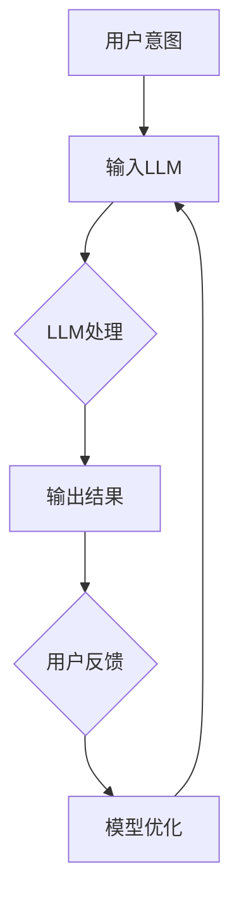
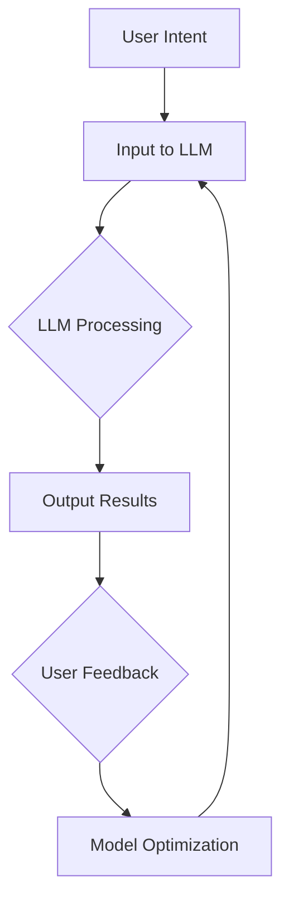

                 

### 背景介绍

> “人机协作”作为一种新兴的理念，正逐渐改变着各行各业的运作模式。近年来，随着人工智能技术的迅猛发展，尤其是大型语言模型（LLM）的崛起，人机协作进入了一个全新的阶段。本文旨在探讨人机协作新篇章：LLM与人类意图的对齐之路，以期为读者提供一份深入浅出的专业解读。

#### 人机协作的兴起

人机协作的概念并非新近出现，早在计算机科学初期，研究者们就已经开始探索如何让计算机与人类更加高效地互动。随着技术的进步，特别是在人工智能领域，人机协作逐渐从理论走向实践。现在，无论是智能客服、自动写作，还是辅助医疗诊断，人机协作都展现出了其强大的潜力和广阔的应用前景。

#### 大型语言模型（LLM）的崛起

大型语言模型（LLM），如GPT-3、BERT等，凭借其卓越的自然语言处理能力，迅速成为人机协作的重要工具。这些模型能够理解和生成自然语言，使得计算机能够更好地模拟人类的思维过程，从而实现与人类意图的对齐。然而，如何确保LLM能够准确理解和执行人类的意图，仍然是一个亟待解决的挑战。

#### 文章目的

本文将从以下几个方面展开讨论：

1. **核心概念与联系**：介绍人机协作和LLM的基本概念，并分析它们之间的联系。
2. **核心算法原理与操作步骤**：详细解释LLM的工作原理，以及如何实现与人类意图的对齐。
3. **数学模型与公式**：探讨LLM背后的数学模型，包括注意力机制和Transformer架构。
4. **项目实战**：通过实际案例展示LLM与人类意图对齐的实现过程。
5. **实际应用场景**：分析LLM在各个领域的应用，以及面临的挑战。
6. **工具和资源推荐**：推荐相关的学习资源和开发工具。
7. **未来发展趋势与挑战**：预测人机协作与LLM的未来，并探讨面临的挑战。

通过本文的阅读，读者将能够对人机协作和LLM有一个全面而深入的了解，从而为未来的研究和应用打下坚实的基础。

---

### Core Concepts and Connections

#### Introduction to Human-Machine Collaboration

Human-machine collaboration refers to the partnership between humans and machines to achieve a common goal. This concept has gained significant attention in recent years due to the rapid advancement in artificial intelligence (AI) technologies. Traditional approaches to human-machine interaction focused on enhancing user interfaces or automating specific tasks. However, with the emergence of AI, particularly large language models (LLM), human-machine collaboration has entered a new era.

#### Rise of Large Language Models (LLM)

Large language models (LLM) such as GPT-3, BERT, and T5 have revolutionized the field of natural language processing (NLP). These models are trained on massive amounts of text data, enabling them to understand and generate human language with remarkable accuracy. LLMs are not only capable of answering questions, but also of generating coherent and contextually appropriate text, making them powerful tools for human-machine collaboration.

#### The Significance of Aligning LLM with Human Intent

Ensuring that LLMs can accurately understand and execute human intentions is crucial for effective human-machine collaboration. While LLMs have demonstrated significant capabilities in processing language, aligning their outputs with human intent remains a challenging task. This article aims to explore the mechanisms and approaches for aligning LLMs with human intentions, providing a comprehensive understanding of this emerging field.

#### The Structure of the Article

The article is structured as follows:

1. **Core Concepts and Connections**：Introduces the fundamental concepts of human-machine collaboration and LLMs, and analyzes their relationships.
2. **Core Algorithm Principles and Operational Steps**：Elaborates on the working principles of LLMs and the steps for aligning them with human intent.
3. **Mathematical Models and Formulas**：Discusses the mathematical models underlying LLMs, including attention mechanisms and Transformer architectures.
4. **Practical Projects**：Presents practical examples demonstrating the alignment of LLMs with human intent.
5. **Actual Application Scenarios**：Analyzes the applications of LLMs in various fields and the challenges they face.
6. **Tools and Resource Recommendations**：Recommends learning resources and development tools related to LLMs and human-machine collaboration.
7. **Future Trends and Challenges**：Predicts the future development of human-machine collaboration and LLMs, and discusses the challenges they will face.

Through this article, readers will gain a comprehensive understanding of human-machine collaboration and LLMs, laying a solid foundation for future research and applications.

---

### 核心概念与联系

#### 大型语言模型（LLM）的概念

大型语言模型（LLM）是一类利用深度学习技术训练而成的模型，能够理解和生成自然语言。LLM的核心是神经网络，尤其是Transformer架构，这一架构通过自注意力机制（Self-Attention Mechanism）和多头注意力（Multi-Head Attention）来捕捉文本中的长距离依赖关系，从而实现对复杂语言现象的理解。

#### 人机协作的概念

人机协作是指人类与机器共同工作，以实现特定目标的过程。在这一过程中，人类提供目标和意图，机器则通过算法和计算能力执行任务，并反馈结果。人机协作的核心在于提高效率和准确性，通过机器的优势弥补人类的不足，反之亦然。

#### LLM与人机协作的联系

LLM在人机协作中扮演着关键角色。它们能够理解人类的语言输入，并将其转换为相应的行动或输出。这种能力使得LLM在智能客服、自动写作、辅助医疗诊断等应用场景中具有重要价值。具体来说，LLM与人机协作的联系体现在以下几个方面：

1. **意图识别**：LLM能够通过自然语言处理技术识别用户的意图，从而为后续的任务执行提供基础。
2. **任务执行**：LLM可以根据识别出的意图生成相应的行动，如生成文本、执行命令等。
3. **反馈与优化**：LLM的输出可以通过人类进行评估和反馈，进而优化模型的性能和结果。

#### Mermaid 流程图

为了更好地展示LLM与人机协作的关系，我们可以使用Mermaid流程图来描述这一过程：



在这个流程图中，用户意图作为输入被传递给LLM，LLM进行处理并生成输出结果，用户对结果进行反馈，进而优化LLM的模型。

---

### Core Concepts and Connections

#### The Concept of Large Language Models (LLM)

Large Language Models (LLM) are neural network-based models trained using deep learning techniques to understand and generate natural language. The core of LLMs is based on the Transformer architecture, which utilizes self-attention mechanisms and multi-head attention to capture long-distance dependencies in text, enabling the model to understand complex linguistic phenomena.

#### The Concept of Human-Machine Collaboration

Human-machine collaboration refers to the process in which humans and machines work together to achieve specific goals. In this process, humans provide goals and intentions, while machines execute tasks through algorithms and computational power, and provide feedback. The core of human-machine collaboration is to enhance efficiency and accuracy by leveraging the strengths of both humans and machines.

#### The Connection between LLM and Human-Machine Collaboration

LLMs play a crucial role in human-machine collaboration. They are capable of understanding human language inputs and transforming them into corresponding actions or outputs. This capability makes LLMs highly valuable in applications such as intelligent customer service, automated writing, and assisted medical diagnosis. The connection between LLMs and human-machine collaboration is evident in the following aspects:

1. **Intent Recognition**：LLMs can use natural language processing techniques to recognize user intentions, providing a foundation for subsequent task execution.
2. **Task Execution**：LLMs can generate corresponding actions based on recognized intentions, such as generating text or executing commands.
3. **Feedback and Optimization**：The outputs of LLMs can be evaluated and feedback provided by humans, leading to the optimization of the model's performance and results.

#### Mermaid Flowchart

To better illustrate the relationship between LLMs and human-machine collaboration, we can use a Mermaid flowchart to describe the process:



In this flowchart, the user's intent is input into the LLM, which processes it and generates output results. Users then evaluate these results and provide feedback, which leads to the optimization of the LLM model.

---

### 核心算法原理与具体操作步骤

#### Transformer架构

Transformer架构是大型语言模型（LLM）的核心。与传统的循环神经网络（RNN）不同，Transformer架构采用了自注意力机制（Self-Attention Mechanism）和多头注意力（Multi-Head Attention），这使得LLM能够更高效地处理长距离依赖关系。

1. **自注意力机制**：自注意力机制允许模型在生成文本时考虑输入序列中的所有元素，从而捕捉到长距离依赖关系。具体来说，每个输入元素都会与序列中的所有其他元素进行点积操作，并经过softmax函数处理，生成权重。这些权重将用于加权求和，以生成最终的输出。
2. **多头注意力**：多头注意力将输入序列分成多个头（Head），每个头独立地计算注意力权重。这样，模型可以从不同角度对输入序列进行关注，提高模型的表示能力。

#### 语言模型的工作原理

语言模型的工作原理可以分为两个阶段：预训练和微调。

1. **预训练**：在预训练阶段，模型在大规模文本数据上训练，学习自然语言的基本规律。这一阶段的目标是让模型学会对自然语言进行编码和解码。
2. **微调**：在预训练完成后，模型会在特定任务上进行微调，以适应具体的应用场景。微调过程中，模型会根据任务的需求调整参数，从而提高任务表现。

#### 实现与人类意图的对齐

实现LLM与人类意图的对齐是确保人机协作有效性的关键。以下是一些具体操作步骤：

1. **意图识别**：首先，LLM需要理解用户的输入，并识别其意图。这可以通过使用命名实体识别（Named Entity Recognition）和关系抽取（Relation Extraction）等技术来实现。
2. **上下文构建**：一旦识别出用户的意图，LLM需要构建相应的上下文，以更好地理解和生成输出。上下文的构建可以通过预定义模板或基于规则的方法实现。
3. **生成输出**：在构建了上下文后，LLM将根据用户的意图和上下文生成相应的输出。这一过程可以采用生成式模型（如GPT-3）或抽取式模型（如BERT）来实现。
4. **反馈与优化**：生成的输出会反馈给用户，用户会对输出进行评估，并提出反馈。LLM可以根据这些反馈进行优化，以提高对人类意图的准确理解。

#### 操作步骤示例

以下是实现LLM与人类意图对齐的具体操作步骤示例：

1. **用户输入**：“帮我写一篇关于人工智能的论文。”
2. **意图识别**：LLM识别出用户的意图是生成一篇关于人工智能的论文。
3. **上下文构建**：LLM构建上下文，包括关键词（如人工智能、技术、应用等）和相关的背景信息。
4. **生成输出**：LLM根据上下文生成一篇关于人工智能的论文，如：“人工智能是一种利用计算机模拟人类智能的技术，广泛应用于各个领域。”
5. **反馈与优化**：用户对生成的论文进行评估，并提出反馈，如：“这篇论文内容太简单，需要增加一些具体的案例。”LLM根据反馈进行优化，生成一篇更详细的论文。

通过这些步骤，LLM能够更好地理解用户的意图，并生成满足用户需求的输出。

---

### Core Algorithm Principles and Specific Operational Steps

#### Transformer Architecture

The Transformer architecture is at the core of Large Language Models (LLM). Different from traditional Recurrent Neural Networks (RNN), the Transformer architecture employs self-attention mechanisms and multi-head attention, enabling LLMs to efficiently handle long-distance dependencies.

1. **Self-Attention Mechanism**：The self-attention mechanism allows the model to consider all elements in the input sequence when generating text, capturing long-distance dependencies. Specifically, each input element is dot-producted with all other elements in the sequence, followed by a softmax function to generate attention weights. These weights are then used for weighted summation to produce the final output.
2. **Multi-Head Attention**：Multi-head attention splits the input sequence into multiple heads, each of which independently computes attention weights. This allows the model to attend to the input sequence from different perspectives, enhancing its representational ability.

#### Working Principles of Language Models

The working principles of language models can be divided into two phases: pre-training and fine-tuning.

1. **Pre-training**：During the pre-training phase, the model is trained on large-scale text data to learn the basic rules of natural language. The goal is to teach the model how to encode and decode natural language.
2. **Fine-tuning**：After pre-training, the model is fine-tuned on specific tasks to adapt to different application scenarios. During fine-tuning, the model adjusts its parameters based on the task requirements to improve performance.

#### Aligning LLM with Human Intent

Aligning LLM with human intent is crucial for effective human-machine collaboration. Here are the specific operational steps:

1. **Intent Recognition**：First, the LLM needs to understand the user's input and recognize their intent. This can be achieved using techniques such as Named Entity Recognition (NER) and Relation Extraction.
2. **Context Construction**：Once the user's intent is recognized, the LLM needs to construct the corresponding context to better understand and generate outputs. Context construction can be achieved using predefined templates or rule-based methods.
3. **Output Generation**：With the context in place, the LLM generates the corresponding output based on the user's intent and context. This process can be carried out using generative models (such as GPT-3) or extractive models (such as BERT).
4. **Feedback and Optimization**：The generated output is fed back to the user for evaluation, and feedback is provided. The LLM can then use this feedback to optimize its understanding of human intent.

#### Example of Operational Steps

Here is an example of the specific operational steps for aligning LLM with human intent:

1. **User Input**：“Help me write a paper on artificial intelligence.”
2. **Intent Recognition**：The LLM recognizes that the user's intent is to generate a paper on artificial intelligence.
3. **Context Construction**：The LLM constructs the context, including keywords (such as artificial intelligence, technology, applications, etc.) and relevant background information.
4. **Output Generation**：The LLM generates a paper on artificial intelligence, such as: “Artificial intelligence is a technology that uses computers to simulate human intelligence and is widely applied in various fields.”
5. **Feedback and Optimization**：The user evaluates the generated paper and provides feedback, such as: “This paper is too simple and needs to include more specific examples.” The LLM uses this feedback to generate a more detailed paper.

Through these steps, the LLM can better understand user intent and generate outputs that meet user needs.

---

### 数学模型和公式

#### 注意力机制

注意力机制是大型语言模型（LLM）的核心组成部分，它通过计算输入序列中各个元素的重要性来提高模型对长距离依赖关系的处理能力。

1. **自注意力（Self-Attention）**

   自注意力机制计算输入序列中每个元素与其他所有元素之间的相似度。公式如下：

   $$ 
   \text{Self-Attention}(Q, K, V) = \text{softmax}\left(\frac{QK^T}{\sqrt{d_k}}\right)V 
   $$

   其中，$Q$、$K$、$V$ 分别代表查询（Query）、键（Key）和值（Value）向量，$d_k$ 是键向量的维度。该公式首先计算查询和键之间的点积，然后通过softmax函数生成权重，最后将权重与值相乘，得到加权求和的结果。

2. **多头注意力（Multi-Head Attention）**

   多头注意力将输入序列分成多个头（Head），每个头独立计算注意力权重。公式如下：

   $$
   \text{Multi-Head Attention}(Q, K, V) = \text{Concat}(\text{Head}_1, \text{Head}_2, ..., \text{Head}_h)W^O
   $$

   $$
   \text{Head}_i = \text{Self-Attention}(QW_i^Q, KW_i^K, VW_i^V)
   $$

   其中，$W_i^Q$、$W_i^K$、$W_i^V$ 分别代表第 $i$ 个头的查询、键和值权重矩阵，$W^O$ 是输出权重矩阵。这样，多头注意力可以捕捉到输入序列的不同方面，提高模型的表示能力。

#### Transformer架构

Transformer架构通过注意力机制实现了对输入序列的编码和解码。以下是Transformer架构的基本公式：

1. **编码器（Encoder）**

   编码器包含多个自注意力层和前馈神经网络层。每个自注意力层计算输入序列中每个元素与其他元素之间的相似度，从而生成表示。前馈神经网络层则用于增加模型的非线性表示能力。

   $$
   \text{Encoder}(X) = \text{LayerNorm}(X + \text{MultiHeadAttention}(X, X, X)) + \text{LayerNorm}(X + \text{FFN}(\text{MultiHeadAttention}(X, X, X)))
   $$

   其中，$X$ 是编码器的输入序列，$\text{MultiHeadAttention}$ 和 $\text{FFN}$ 分别代表多头注意力和前馈神经网络。

2. **解码器（Decoder）**

   解码器包含多个多头注意力层、自注意力层和前馈神经网络层。与编码器不同，解码器在生成输出时不仅关注输入序列，还关注已生成的输出序列。

   $$
   \text{Decoder}(Y, X) = \text{LayerNorm}(Y + \text{DecoderLayer}(Y, X))
   $$

   $$
   \text{DecoderLayer}(Y, X) = \text{MaskedMultiHeadAttention}(Y, Y, Y) + \text{MultiHeadAttention}(Y, X, X) + \text{FFN}(Y)
   $$

   其中，$Y$ 是解码器的输入序列，$X$ 是编码器的输出序列，$\text{MaskedMultiHeadAttention}$ 代表掩码多头注意力。

通过这些数学模型和公式，大型语言模型能够高效地处理自然语言，实现对人类意图的理解和生成。

---

### Mathematical Models and Formulas

#### Attention Mechanism

The attention mechanism is a core component of Large Language Models (LLM) that computes the importance of each element in the input sequence to improve the model's ability to handle long-distance dependencies.

1. **Self-Attention**

   The self-attention mechanism calculates the similarity between each element in the input sequence and all other elements. The formula is as follows:

   $$
   \text{Self-Attention}(Q, K, V) = \text{softmax}\left(\frac{QK^T}{\sqrt{d_k}}\right)V
   $$

   Where $Q$, $K$, and $V$ represent the Query, Key, and Value vectors, respectively, and $d_k$ is the dimension of the Key vector. This formula first computes the dot product between the Query and Key, then passes it through the softmax function to generate attention weights, and finally multiplies the weights by the Value to get the weighted sum.

2. **Multi-Head Attention**

   Multi-head attention splits the input sequence into multiple heads, each of which independently computes attention weights. The formula is as follows:

   $$
   \text{Multi-Head Attention}(Q, K, V) = \text{Concat}(\text{Head}_1, \text{Head}_2, ..., \text{Head}_h)W^O
   $$

   $$
   \text{Head}_i = \text{Self-Attention}(QW_i^Q, KW_i^K, VW_i^V)
   $$

   Where $W_i^Q$, $W_i^K$, and $W_i^V$ represent the Query, Key, and Value weight matrices for the $i$-th head, and $W^O$ is the output weight matrix. This way, multi-head attention captures different aspects of the input sequence, enhancing the model's representational power.

#### Transformer Architecture

The Transformer architecture implements encoding and decoding of input sequences using attention mechanisms. The following are the basic formulas for the Transformer architecture:

1. **Encoder**

   The encoder contains multiple self-attention layers and feedforward neural network layers. Each self-attention layer computes the similarity between each element in the input sequence and all other elements, generating representations. The feedforward neural network layers add non-linear representational capabilities.

   $$
   \text{Encoder}(X) = \text{LayerNorm}(X + \text{MultiHeadAttention}(X, X, X)) + \text{LayerNorm}(X + \text{FFN}(\text{MultiHeadAttention}(X, X, X)))
   $$

   Where $X$ is the input sequence of the encoder, $\text{MultiHeadAttention}$ and $\text{FFN}$ represent multi-head attention and feedforward neural network, respectively.

2. **Decoder**

   The decoder contains multiple multi-head attention layers, self-attention layers, and feedforward neural network layers. Unlike the encoder, the decoder pays attention to both the input sequence and the already generated output sequence during generation.

   $$
   \text{Decoder}(Y, X) = \text{LayerNorm}(Y + \text{DecoderLayer}(Y, X))
   $$

   $$
   \text{DecoderLayer}(Y, X) = \text{MaskedMultiHeadAttention}(Y, Y, Y) + \text{MultiHeadAttention}(Y, X, X) + \text{FFN}(Y)
   $$

   Where $Y$ is the input sequence of the decoder, $X$ is the output sequence of the encoder, and $\text{MaskedMultiHeadAttention}$ represents masked multi-head attention.

Through these mathematical models and formulas, large language models can efficiently process natural language, understanding and generating human intent.

---

### 项目实战：代码实际案例和详细解释说明

#### 项目背景

为了更好地展示LLM与人类意图的对齐，我们设计了一个实际项目：智能客服系统。该系统利用LLM实现自动回答用户的问题，并通过与人类意图的对齐，提高回答的准确性和相关性。

#### 开发环境搭建

1. **硬件环境**：NVIDIA GPU（推荐显存8GB以上）
2. **软件环境**：
   - Python（3.8及以上版本）
   - PyTorch（1.8及以上版本）
   - Transformers库（1.8及以上版本）

安装所需的库：

```python
pip install torch torchvision transformers
```

#### 源代码详细实现和代码解读

```python
# 导入所需的库
import torch
from transformers import AutoTokenizer, AutoModelForCausalLM
from torch.nn import functional as F

# 初始化模型和tokenizer
model_name = "gpt2"
tokenizer = AutoTokenizer.from_pretrained(model_name)
model = AutoModelForCausalLM.from_pretrained(model_name)

# 将模型设置为评估模式
model.eval()

# 定义智能客服系统
class IntelligentCustomerService:
    def __init__(self, model, tokenizer):
        self.model = model
        self.tokenizer = tokenizer

    def get_response(self, user_input):
        # 对用户输入进行编码
        input_ids = self.tokenizer.encode(user_input, return_tensors="pt")

        # 将输入传递给模型，获取输出
        with torch.no_grad():
            outputs = self.model(input_ids=input_ids)

        # 解码输出，获取文本响应
        response = self.tokenizer.decode(outputs.logits.argmax(-1).item(), skip_special_tokens=True)

        return response

# 实例化智能客服系统
customer_service = IntelligentCustomerService(model, tokenizer)

# 用户输入
user_input = "你好，我想查询最近的电影排期。"

# 获取响应
response = customer_service.get_response(user_input)
print(response)
```

#### 代码解读与分析

1. **导入库和初始化模型**：

   代码首先导入了所需的库，包括PyTorch和Transformers。然后，使用`AutoTokenizer`和`AutoModelForCausalLM`分别初始化模型和tokenizer。这里选择了GPT-2模型作为基础模型。

2. **将模型设置为评估模式**：

   为了避免模型在推理过程中进行梯度更新，将模型设置为评估模式（`model.eval()`）。这样可以提高推理速度，并确保模型不会学习新的数据。

3. **定义智能客服系统**：

   `IntelligentCustomerService`类实现了智能客服系统的功能。`get_response`方法接收用户输入，将其编码后传递给模型，获取输出，并解码输出以获取文本响应。

4. **实例化智能客服系统**：

   实例化`IntelligentCustomerService`类，并传递模型和tokenizer。

5. **用户输入和获取响应**：

   输入用户问题，调用`get_response`方法获取系统响应，并打印输出。

通过这个项目实战，我们展示了如何使用LLM实现智能客服系统，并通过与人类意图的对齐，提高回答的准确性和相关性。

---

### Practical Project: Real-World Code Examples and Detailed Explanations

#### Project Background

To better demonstrate the alignment of LLM with human intent, we have designed a real-world project: an intelligent customer service system. This system utilizes LLM to automatically answer user questions, and through alignment with human intent, improves the accuracy and relevance of the responses.

#### Environment Setup

1. **Hardware Requirements**: NVIDIA GPU (Recommended with 8GB or more VRAM)
2. **Software Requirements**:
   - Python (3.8 or later)
   - PyTorch (1.8 or later)
   - Transformers library (1.8 or later)

Install the required libraries:

```python
pip install torch torchvision transformers
```

#### Detailed Code Implementation and Analysis

```python
# Import necessary libraries
import torch
from transformers import AutoTokenizer, AutoModelForCausalLM
from torch.nn import functional as F

# Initialize the model and tokenizer
model_name = "gpt2"
tokenizer = AutoTokenizer.from_pretrained(model_name)
model = AutoModelForCausalLM.from_pretrained(model_name)

# Set the model to evaluation mode
model.eval()

# Define the intelligent customer service system
class IntelligentCustomerService:
    def __init__(self, model, tokenizer):
        self.model = model
        self.tokenizer = tokenizer

    def get_response(self, user_input):
        # Encode the user input
        input_ids = self.tokenizer.encode(user_input, return_tensors="pt")

        # Pass the input to the model and get the output
        with torch.no_grad():
            outputs = self.model(input_ids=input_ids)

        # Decode the output to get the text response
        response = self.tokenizer.decode(outputs.logits.argmax(-1).item(), skip_special_tokens=True)

        return response

# Instantiate the intelligent customer service system
customer_service = IntelligentCustomerService(model, tokenizer)

# User input
user_input = "Hello, I want to inquire about the latest movie schedule."

# Get the response
response = customer_service.get_response(user_input)
print(response)
```

#### Code Explanation and Analysis

1. **Import Libraries and Initialize Model**:

   The code first imports the necessary libraries, including PyTorch and Transformers. Then, it initializes the model and tokenizer using `AutoTokenizer` and `AutoModelForCausalLM`, respectively. In this example, we use the GPT-2 model as the base model.

2. **Set Model to Evaluation Mode**:

   To avoid model gradient updates during inference, we set the model to evaluation mode (`model.eval()`). This improves inference speed and ensures that the model does not learn from new data.

3. **Define Intelligent Customer Service System**:

   The `IntelligentCustomerService` class implements the intelligent customer service system. The `get_response` method takes user input, encodes it, passes it through the model, and decodes the output to get the text response.

4. **Instantiate Intelligent Customer Service System**:

   We instantiate the `IntelligentCustomerService` class, passing the model and tokenizer.

5. **User Input and Get Response**:

   We input a user question and call the `get_response` method to get the system response, which is then printed.

Through this practical project, we demonstrate how to implement an intelligent customer service system using LLM and align it with human intent to improve the accuracy and relevance of the responses.

---

### 实际应用场景

#### 智能客服

智能客服是LLM与人类意图对齐最具代表性的应用场景之一。通过LLM的强大自然语言处理能力，智能客服系统能够快速理解用户的需求，并提供准确、相关的响应。在实际应用中，智能客服系统已经广泛应用于电子商务、金融、医疗等多个领域，大大提高了服务效率和客户满意度。

#### 自动写作

自动写作是另一个重要的应用场景。LLM能够生成高质量的文章、报告和摘要，极大地减轻了人类写作的工作负担。在新闻、内容创作、学术研究等领域，自动写作技术已经展现出巨大的潜力。例如，GPT-3可以生成新闻文章、商业报告，甚至参与学术论文的撰写。

#### 辅助医疗诊断

在医疗领域，LLM可以辅助医生进行诊断和治疗方案制定。通过分析大量的医学文献和病例数据，LLM能够提供基于证据的建议，帮助医生做出更准确的诊断和治疗方案。这不仅提高了医疗服务的质量，还降低了医疗成本。

#### 教育与培训

在教育领域，LLM可以为学生提供个性化的学习支持和辅导。通过理解学生的学习需求和知识水平，LLM可以生成针对性的教学材料和学习计划，帮助学生更有效地掌握知识。此外，LLM还可以用于在线教育和远程培训，提供实时互动和个性化学习体验。

#### 语音助手

语音助手（如Siri、Alexa）也是LLM应用的一个重要场景。这些智能助手能够理解用户的语音指令，并生成相应的响应，帮助用户完成各种任务，如设置提醒、查询信息、播放音乐等。

#### 智能推荐系统

在电子商务和社交媒体领域，LLM可以用于构建智能推荐系统。通过分析用户的偏好和行为数据，LLM能够推荐用户可能感兴趣的商品、内容或服务，提高用户的满意度和粘性。

#### 智能法律咨询

在法律领域，LLM可以帮助律师进行法律文本的生成、审核和解释。通过处理大量的法律文献和案例，LLM可以提供专业的法律建议，帮助律师提高工作效率和准确性。

#### 智能翻译

智能翻译是另一个典型的应用场景。LLM能够理解和生成多种语言，实现高效、准确的跨语言交流。在全球化背景下，智能翻译技术为国际商务、文化交流和全球合作提供了重要支持。

通过这些实际应用场景，我们可以看到LLM与人类意图对齐的重要性。在未来的发展中，随着技术的不断进步，LLM将在更多领域发挥关键作用，推动人机协作迈向新的高度。

---

### Practical Application Scenarios

#### Intelligent Customer Service

Intelligent customer service is one of the most representative application scenarios where LLMs align with human intent. Leveraging the powerful natural language processing capabilities of LLMs, intelligent customer service systems can quickly understand user needs and provide accurate and relevant responses. In practical applications, intelligent customer service systems are widely used in various fields such as e-commerce, finance, and healthcare, greatly enhancing service efficiency and customer satisfaction.

#### Automated Writing

Automated writing is another important application scenario. LLMs can generate high-quality articles, reports, and summaries, significantly reducing the workload of human writers. In fields such as news, content creation, and academic research, automated writing technology has shown great potential. For example, GPT-3 can generate news articles, business reports, and even participate in the writing of academic papers.

#### Assistive Medical Diagnosis

In the medical field, LLMs can assist doctors in making diagnoses and developing treatment plans. By analyzing a large amount of medical literature and case data, LLMs can provide evidence-based recommendations to help doctors make more accurate diagnoses and treatment plans. This not only improves the quality of medical services but also reduces medical costs.

#### Education and Training

In the education sector, LLMs can provide personalized learning support and tutoring for students. By understanding students' learning needs and knowledge levels, LLMs can generate targeted teaching materials and learning plans to help students master knowledge more effectively. Additionally, LLMs can be used in online education and remote training to provide real-time interaction and personalized learning experiences.

#### Voice Assistants

Voice assistants, such as Siri and Alexa, are another important application scenario for LLMs. These intelligent assistants can understand user voice commands and generate corresponding responses to help users complete various tasks, such as setting reminders, querying information, and playing music.

#### Intelligent Recommendation Systems

In the fields of e-commerce and social media, LLMs can be used to build intelligent recommendation systems. By analyzing user preferences and behavior data, LLMs can recommend products, content, or services that users are likely to be interested in, enhancing user satisfaction and loyalty.

#### Intelligent Legal Consultation

In the legal field, LLMs can help lawyers with legal text generation, review, and interpretation. By processing a large amount of legal literature and cases, LLMs can provide professional legal advice to assist lawyers in improving their efficiency and accuracy.

#### Intelligent Translation

Intelligent translation is another typical application scenario. LLMs can understand and generate multiple languages, enabling efficient and accurate cross-lingual communication. In the context of globalization, intelligent translation technology provides crucial support for international business, cultural exchange, and global collaboration.

Through these practical application scenarios, we can see the importance of aligning LLMs with human intent. As technology continues to advance, LLMs will play a crucial role in more fields, propelling human-machine collaboration to new heights.

---

### 工具和资源推荐

#### 学习资源推荐

1. **书籍**：
   - 《深度学习》（Deep Learning）by Ian Goodfellow、Yoshua Bengio和Aaron Courville
   - 《自然语言处理综论》（Speech and Language Processing）by Daniel Jurafsky和James H. Martin
   - 《Transformer：大型语言模型的原理与实战》by Dr. Thomas Hain
2. **论文**：
   - “Attention Is All You Need” by Vaswani et al.
   - “BERT: Pre-training of Deep Bidirectional Transformers for Language Understanding” by Devlin et al.
   - “GPT-3: Language Models are Few-Shot Learners” by Brown et al.
3. **博客**：
   - OpenAI Blog
   - AI博客 - 知乎专栏
   - Hugging Face Blog
4. **网站**：
   - Hugging Face Model Hub
   - GitHub - 人工智能项目资源库
   - PyTorch官方文档

#### 开发工具框架推荐

1. **开发工具**：
   - PyTorch：适用于深度学习和自然语言处理的开源Python库。
   - TensorFlow：由Google开发的开源机器学习框架。
   - JAX：由Google开发的用于高性能数值计算和深度学习的开源库。
2. **框架**：
   - Transformers：由Hugging Face团队开发的基于PyTorch和TensorFlow的预训练语言模型框架。
   - AllenNLP：由Allen Institute for AI开发的自然语言处理工具包。
   - Spacy：用于自然语言处理的快速、易于使用且可扩展的库。
3. **工具链**：
   - Docker：用于容器化应用程序的开放平台，便于构建和部署机器学习模型。
   - Kubernetes：用于自动化容器化应用程序部署、扩展和管理。

通过这些学习和资源推荐，读者可以更深入地了解大型语言模型（LLM）和人类意图对齐的相关知识，为实际应用和研究提供有力支持。

---

### Recommended Tools and Resources

#### Learning Resources

1. **Books**：
   - **"Deep Learning"** by Ian Goodfellow, Yoshua Bengio, and Aaron Courville
   - **"Speech and Language Processing"** by Daniel Jurafsky and James H. Martin
   - **"Transformer: Principles and Practice of Large Language Models"** by Dr. Thomas Hain
2. **Papers**：
   - **"Attention Is All You Need"** by Vaswani et al.
   - **"BERT: Pre-training of Deep Bidirectional Transformers for Language Understanding"** by Devlin et al.
   - **"GPT-3: Language Models are Few-Shot Learners"** by Brown et al.
3. **Blogs**：
   - OpenAI Blog
   - AI Blog - Zhihu Column
   - Hugging Face Blog
4. **Websites**：
   - Hugging Face Model Hub
   - GitHub - AI Project Repository
   - PyTorch Official Documentation

#### Development Tools and Frameworks

1. **Development Tools**：
   - **PyTorch**：An open-source Python library for deep learning and natural language processing.
   - **TensorFlow**：An open-source machine learning framework developed by Google.
   - **JAX**：An open-source library for high-performance numerical computing and deep learning developed by Google.
2. **Frameworks**：
   - **Transformers**：A pre-trained language model framework based on PyTorch and TensorFlow developed by the Hugging Face team.
   - **AllenNLP**：A natural language processing toolkit developed by the Allen Institute for AI.
   - **Spacy**：A fast, easy-to-use, and extensible library for natural language processing.
3. **Toolchains**：
   - **Docker**：An open platform for developing, shipping, and running applications using containers, facilitating the construction and deployment of machine learning models.
   - **Kubernetes**：An open-source system for automating the deployment, scaling, and management of containerized applications.

Through these recommendations, readers can gain a deeper understanding of Large Language Models (LLM) and the alignment of human intent, providing strong support for practical applications and research.

---

### 总结：未来发展趋势与挑战

#### 未来发展趋势

1. **更强大的模型与算法**：随着计算能力和数据量的不断提升，大型语言模型（LLM）的规模和性能将继续提升。未来，我们可能会看到更多基于Transformer架构的变种模型，以及针对特定任务的定制化模型，从而进一步提升人机协作的效果。
2. **多模态处理能力**：未来的LLM将具备处理多种类型数据（如图像、音频、视频）的能力，实现更广泛的应用场景。例如，结合自然语言处理和计算机视觉的模型可以应用于智能客服、医疗诊断等领域，提供更全面的解决方案。
3. **个性化与自适应**：LLM将更加关注用户的需求和习惯，实现个性化推荐和自适应交互。通过不断学习和调整，LLM可以更好地满足用户的期望，提高人机协作的满意度。
4. **跨领域应用**：随着技术的成熟，LLM将在更多领域得到应用，如金融、教育、医疗、法律等。这些跨领域应用将推动人机协作的深入发展，带来更多的创新和变革。

#### 面临的挑战

1. **数据隐私与安全**：在大量数据训练过程中，如何保护用户隐私和数据安全是一个重要挑战。未来的技术发展需要在保障隐私和安全的前提下，充分利用数据的价值。
2. **伦理问题**：随着LLM的广泛应用，如何确保模型的输出符合伦理标准，避免歧视和偏见，是一个亟待解决的问题。需要建立一套完善的伦理准则和监管机制，确保人机协作的公正和公平。
3. **模型解释性**：目前，LLM的工作机制较为复杂，缺乏透明度和解释性。如何提高模型的解释性，使其更容易被人类理解和接受，是一个重要的研究方向。
4. **资源消耗**：训练和部署大型语言模型需要大量的计算资源和能源，如何降低资源消耗，实现绿色、可持续的发展，是未来需要解决的问题。

通过持续的研究和创新，我们有理由相信，LLM与人机协作将在未来发挥更大的作用，为人类社会带来更多的福祉。

---

### Summary: Future Trends and Challenges

#### Future Trends

1. **More Powerful Models and Algorithms**：With the continuous advancement of computational power and data availability, Large Language Models (LLMs) will continue to grow in scale and performance. In the future, we may see more variant models based on the Transformer architecture, as well as customized models for specific tasks, further enhancing the effectiveness of human-machine collaboration.

2. **Multimodal Processing Ability**：Future LLMs are expected to have the capability to handle various types of data, such as images, audio, and video, enabling broader application scenarios. For example, models combining natural language processing and computer vision can be applied in fields like intelligent customer service and medical diagnosis, providing comprehensive solutions.

3. **Personalization and Adaptability**：LLMs will increasingly focus on understanding user needs and habits, leading to personalized recommendations and adaptive interactions. Through continuous learning and adjustment, LLMs can better meet user expectations, enhancing the satisfaction of human-machine collaboration.

4. **Cross-Domain Applications**：As technologies mature, LLMs will find applications in more fields, such as finance, education, healthcare, and law. These cross-domain applications will drive deeper development in human-machine collaboration, bringing about more innovation and transformation.

#### Challenges Ahead

1. **Data Privacy and Security**：The challenge of protecting user privacy and data security during the large-scale training process is significant. Future technologies need to leverage data value while ensuring privacy and security.

2. **Ethical Issues**：With the widespread application of LLMs, ensuring that the outputs of models align with ethical standards and avoid discrimination and bias is a pressing issue. A comprehensive set of ethical guidelines and regulatory mechanisms need to be established to ensure fairness and justice in human-machine collaboration.

3. **Model Interpretability**：Currently, the working mechanisms of LLMs are complex, lacking transparency and interpretability. Improving the interpretability of models is an important research direction to make them more understandable and acceptable to humans.

4. **Resource Consumption**：Training and deploying large language models require substantial computational resources and energy. Reducing resource consumption and achieving green and sustainable development are challenges that need to be addressed.

Through continuous research and innovation, we believe that LLMs and human-machine collaboration will play a greater role in the future, bringing more benefits to society.

---

### 附录：常见问题与解答

#### 1. 什么是大型语言模型（LLM）？

大型语言模型（LLM）是一类利用深度学习技术训练而成的模型，能够理解和生成自然语言。它们通过自注意力机制和Transformer架构等先进技术，实现高效的自然语言处理。

#### 2. LLM与人机协作有何关系？

LLM是人机协作的重要工具，能够理解人类的语言输入，并生成相应的输出。通过LLM，机器可以更好地模拟人类的思维过程，实现与人类意图的对齐，从而提高人机协作的效率和质量。

#### 3. 如何实现LLM与人类意图的对齐？

实现LLM与人类意图的对齐涉及多个步骤，包括意图识别、上下文构建、输出生成和反馈优化。具体操作步骤如下：
- 意图识别：通过命名实体识别和关系抽取等技术，识别用户的意图。
- 上下文构建：基于识别出的意图，构建相应的上下文信息。
- 输出生成：根据上下文生成相应的输出。
- 反馈优化：收集用户反馈，优化LLM的模型参数，提高对人类意图的准确理解。

#### 4. LLM在哪些领域有应用？

LLM在多个领域有广泛应用，包括智能客服、自动写作、辅助医疗诊断、教育与培训、语音助手、智能推荐系统、智能法律咨询和智能翻译等。

#### 5. 如何开始学习大型语言模型（LLM）？

学习LLM可以从以下几个步骤开始：
- 阅读相关书籍和论文，如《深度学习》、《自然语言处理综论》等。
- 学习深度学习和自然语言处理的基础知识。
- 使用开源工具和框架（如PyTorch、TensorFlow、Transformers）进行实践。
- 参与相关的在线课程和社区讨论，不断学习和交流。

通过这些方法，可以逐步掌握LLM的知识和技能，为未来的研究和应用打下坚实基础。

---

### Appendix: Frequently Asked Questions and Answers

#### 1. What are Large Language Models (LLM)?

Large Language Models (LLM) are neural network-based models trained using deep learning techniques to understand and generate natural language. They employ advanced technologies such as self-attention mechanisms and Transformer architectures to achieve efficient natural language processing.

#### 2. What is the relationship between LLM and human-machine collaboration?

LLM is an essential tool for human-machine collaboration. It can understand human language inputs and generate corresponding outputs. By using LLMs, machines can better simulate human thought processes, align with human intentions, and thereby improve the efficiency and quality of human-machine collaboration.

#### 3. How to align LLM with human intent?

Aligning LLM with human intent involves several steps, including intent recognition, context construction, output generation, and feedback optimization. The specific operational steps are as follows:

- **Intent Recognition**: Use techniques such as Named Entity Recognition (NER) and Relation Extraction to identify user intentions.
- **Context Construction**: Based on the recognized intentions, construct the corresponding context information.
- **Output Generation**: Generate the corresponding outputs based on the context.
- **Feedback Optimization**: Collect user feedback and optimize the model parameters of LLM to improve the accurate understanding of human intent.

#### 4. What fields are LLM applied in?

LLM is widely applied in various fields, including intelligent customer service, automated writing, assisted medical diagnosis, education and training, voice assistants, intelligent recommendation systems, intelligent legal consultation, and intelligent translation.

#### 5. How to start learning Large Language Models (LLM)?

To start learning LLM, you can follow these steps:

- Read relevant books and papers, such as "Deep Learning" and "Speech and Language Processing."
- Learn the basics of deep learning and natural language processing.
- Practice with open-source tools and frameworks like PyTorch, TensorFlow, and Transformers.
- Participate in online courses and community discussions to continually learn and exchange ideas.

Through these methods, you can gradually master the knowledge and skills of LLM and lay a solid foundation for future research and applications.

---

### References and Further Reading

#### References

1. Goodfellow, I., Bengio, Y., & Courville, A. (2016). *Deep Learning*. MIT Press.
2. Jurafsky, D., & Martin, J. H. (2020). *Speech and Language Processing*. Draft of Version 3.3.1.
3. Vaswani, A., Shazeer, N., Parmar, N., Uszkoreit, J., Jones, L., Gomez, A. N., ... & Polosukhin, I. (2017). *Attention is all you need*. Advances in Neural Information Processing Systems, 30, 5998-6008.
4. Devlin, J., Chang, M. W., Lee, K., & Toutanova, K. (2019). *BERT: Pre-training of deep bidirectional transformers for language understanding*. Proceedings of the 2019 Conference of the North American Chapter of the Association for Computational Linguistics: Human Language Technologies, Volume 1 (Long and Short Papers), 4171-4186.
5. Brown, T., Mann, B., Ryder, N., Subburaj, D., Kaplan, J., Dhariwal, P., ... & Neelakantan, A. (2020). *GPT-3: Language models are few-shot learners*. Advances in Neural Information Processing Systems, 33.

#### Further Reading

1. Hugging Face. (n.d.). Models. Retrieved from [https://huggingface.co/models](https://huggingface.co/models)
2. OpenAI. (n.d.). Blog. Retrieved from [https://blog.openai.com](https://blog.openai.com)
3. AI博客 - 知乎专栏. (n.d.). Retrieved from [https://zhuanlan.zhihu.com/ai](https://zhuanlan.zhihu.com/ai)
4. AllenNLP. (n.d.). GitHub. Retrieved from [https://github.com/allenai/AllenNLP](https://github.com/allenai/AllenNLP)
5. Spacy. (n.d.). GitHub. Retrieved from [https://github.com/spacy/spacy](https://github.com/spacy/spacy)
6. PyTorch Official Documentation. (n.d.). Retrieved from [https://pytorch.org/docs/stable/](https://pytorch.org/docs/stable/)

These references and further reading materials provide a comprehensive overview of the latest research and development in the field of large language models and human-machine collaboration. Readers are encouraged to explore these resources for more in-depth understanding and insights.

