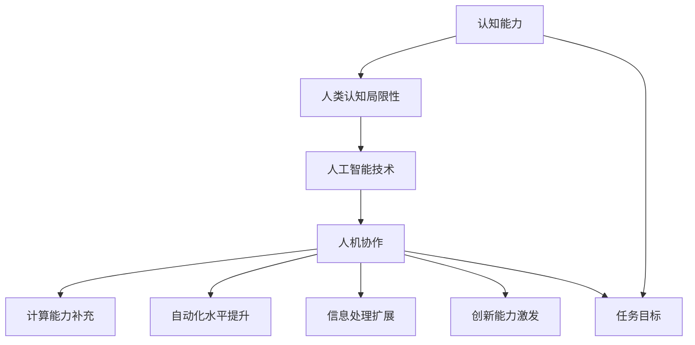

                 

### 背景介绍

人机协作的概念并非新鲜事物。自计算机问世以来，人类与机器之间的互动便不断深化和扩展。从最早的计算器和办公自动化，到现今的人工智能和大数据分析，计算机技术已经深刻地改变了我们的工作方式和生活习惯。然而，随着技术的不断进步，尤其是人工智能的快速发展，人机协作正迎来一个全新的阶段。

在过去的几年中，深度学习、自然语言处理、强化学习等技术的突破，使得机器能够更加智能地理解人类的行为和意图。这不仅提升了机器的自动化水平，也为人机协作提供了更多可能性。例如，自动驾驶汽车、智能助手、医疗诊断系统等，都是人机协作在不同领域的成功应用。

与此同时，人类认知能力的局限性也开始显现。尽管计算机在处理大量数据和执行重复性任务方面具有显著优势，但在处理复杂、抽象和创造性的任务时，仍然无法替代人类。人类大脑的复杂性和创造力是计算机难以模仿的，这使得人机协作成为一个亟待解决的重要课题。

本篇文章将探讨人机协作：增强人类认知能力的新范式。我们首先将回顾人机协作的历史，分析当前技术的优势和不足，然后介绍人机协作的核心概念和架构。接下来，我们将深入探讨人机协作的核心算法原理和具体操作步骤。随后，我们将通过数学模型和公式详细讲解人机协作的机制，并通过实际应用案例展示其效果。文章的最后，我们将探讨人机协作的实际应用场景，推荐相关工具和资源，并总结未来发展趋势与挑战。

通过这一系列的讨论，我们希望读者能够对人机协作有更深入的理解，认识到其在增强人类认知能力方面的重要作用，并为未来的技术发展提供一些启示。

#### 人机协作的历史与现状

人机协作的历史可以追溯到计算机技术的起源。早在20世纪40年代，第一台电子计算机问世，人们便开始思考如何利用计算机辅助人类工作。早期的计算机主要用于科学计算和军事应用，随着技术的发展，计算机逐渐被应用于商业、教育和医疗等领域。

在计算机早期的阶段，人机交互主要通过命令行界面进行。用户需要输入一系列的指令来控制计算机的运行。这种方式虽然效率较高，但操作复杂，对用户的计算机技能要求较高。随着图形用户界面（GUI）的出现，人机交互变得更加直观和友好。用户可以通过点击、拖动等简单的操作与计算机互动，大大降低了使用门槛。

进入21世纪，随着互联网和移动设备的普及，人机交互的形式更加多样。网页、应用程序、智能手表、智能手机等设备为用户提供了多种互动方式。同时，人工智能技术的突破使得计算机能够更加智能地理解用户的意图和行为。例如，语音助手、图像识别、自然语言处理等技术，使得人机协作进入了一个全新的阶段。

目前，人机协作的应用已经渗透到各个领域。在工业生产中，机器人与人类工人共同完成生产任务，提高了生产效率和产品质量。在医疗领域，智能诊断系统和辅助手术机器人提高了医生的诊断和治疗能力。在教育中，智能辅导系统和在线教育平台为学生提供了更加个性化的学习体验。在日常生活中，智能家居设备和智能助理极大地便利了人们的生活。

尽管人机协作已经取得了显著的成果，但当前技术仍然存在一些局限性。首先，计算机的自动化水平虽然在不断提高，但在处理复杂、抽象和创造性的任务时，仍然难以完全替代人类。其次，人机交互的体验仍然有待提升，尤其是在自然语言理解和情感识别方面。此外，数据隐私和安全问题也是人机协作面临的重要挑战。

在人机协作的过程中，人类的认知能力起到了关键作用。人类能够处理复杂的信息，进行抽象思维和创新，这些能力是计算机难以模仿的。然而，随着任务的复杂性和数据量的增加，人类的认知负担也在不断增加。因此，如何利用计算机技术增强人类认知能力，成为了一个亟待解决的重要课题。

本篇文章将探讨人机协作：增强人类认知能力的新范式。通过分析当前技术的优势和不足，介绍人机协作的核心概念和架构，探讨核心算法原理和具体操作步骤，以及通过数学模型和公式详细讲解人机协作的机制，我们希望为人机协作的发展提供一些新的思路和启示。

#### 核心概念与联系

在探讨人机协作如何增强人类认知能力之前，我们首先需要明确一些核心概念，并理解它们之间的相互关系。以下是对这些核心概念的定义和相互关系的阐述。

**1. 认知能力**

认知能力是指人类大脑处理信息、理解世界、进行思考和决策的能力。它包括感知、记忆、学习、推理、判断等多个方面。认知能力是人类智慧的体现，也是人类在复杂环境中生存和发展的基础。

**2. 人类认知的局限性**

尽管人类认知能力强大，但仍然存在一些局限性。首先，人类大脑处理信息的速度和效率有限，难以同时处理大量复杂的信息。其次，人类的记忆容量有限，无法存储和处理无限的信息。此外，人类在处理复杂、抽象和创造性任务时，容易受到心理和生理因素的影响，如疲劳、压力和情绪等。

**3. 人工智能**

人工智能（AI）是指通过计算机模拟人类智能行为的技术。它包括机器学习、深度学习、自然语言处理、计算机视觉等多个领域。人工智能的目的是让计算机能够执行复杂任务，如语音识别、图像识别、自然语言理解等。

**4. 人机协作**

人机协作是指人类和计算机系统共同完成任务的过程。在这个过程中，人类和计算机各自发挥优势，相互补充。人类利用计算机强大的计算能力和自动化水平，提升工作效率；计算机利用人类丰富的经验和创造力，提升任务处理能力。

**5. 人机协作与认知能力增强**

人机协作能够增强人类认知能力的原因在于：

- **计算能力的补充**：计算机能够快速处理大量数据，帮助人类减少重复性劳动，释放更多时间进行高层次的思考。
- **自动化水平的提升**：计算机能够自动化执行一些规则性任务，减少人类认知负担。
- **信息处理的扩展**：计算机能够存储和处理海量信息，为人类提供更全面的数据支持。
- **创新能力的激发**：人机协作能够激发人类的创造力，通过计算机提供的数据和工具，人类能够进行更深入的思考和探索。

**6. 核心概念之间的联系**

- 认知能力是人机协作的核心，它决定了人类在协作过程中的表现。
- 人工智能是人机协作的技术基础，通过人工智能技术，计算机能够更好地理解人类意图，协助人类完成任务。
- 人机协作是一个动态的过程，涉及人类认知能力、人工智能技术以及任务目标的不断交互和调整。

为了更好地理解这些核心概念之间的联系，我们可以使用Mermaid流程图来展示它们之间的关系。以下是该流程图的示例：



通过这个流程图，我们可以清晰地看到认知能力、人类认知局限性、人工智能技术、人机协作以及任务目标之间的相互关系。这些核心概念共同构成了人机协作增强人类认知能力的新范式。

#### 核心算法原理 & 具体操作步骤

在深入探讨人机协作如何增强人类认知能力之前，我们需要了解其核心算法原理和具体操作步骤。人机协作算法主要依赖于人工智能技术，包括机器学习、深度学习和自然语言处理等。以下是这些算法的基本原理和操作步骤。

**1. 机器学习**

机器学习是一种使计算机通过数据学习并进行预测或决策的技术。它包括监督学习、无监督学习和强化学习等不同类型。

- **监督学习**：在这种方法中，计算机通过大量标记数据进行训练，以预测新的、未标记的数据。例如，在图像分类任务中，计算机通过标记的图像数据学习识别不同的物体。

  操作步骤：

  - 数据收集：收集大量标记数据。
  - 特征提取：从数据中提取有用的特征。
  - 模型训练：使用训练数据训练模型。
  - 预测：使用训练好的模型对新数据进行预测。

- **无监督学习**：在这种方法中，计算机在没有标记数据的情况下学习数据的内在结构。例如，在聚类任务中，计算机将相似的数据点分组。

  操作步骤：

  - 数据收集：收集未标记的数据。
  - 特征提取：从数据中提取有用的特征。
  - 模型训练：使用无监督学习方法训练模型。
  - 聚类：将数据点分为不同的组。

- **强化学习**：在这种方法中，计算机通过与环境的交互来学习最优策略。例如，在游戏任务中，计算机通过尝试不同的策略来达到最高得分。

  操作步骤：

  - 环境初始化：定义环境。
  - 行为选择：选择一个行为。
  - 执行行为：在环境中执行选择的行为。
  - 反馈获取：获取环境对行为的反馈。
  - 策略更新：根据反馈更新策略。

**2. 深度学习**

深度学习是机器学习的一个分支，它使用多层神经网络来模拟人类大脑的学习过程。深度学习在图像识别、语音识别和自然语言处理等领域取得了显著成果。

- **神经网络**：神经网络由多个神经元组成，每个神经元将输入数据通过加权连接传递到下一层。神经网络的训练过程是通过反向传播算法调整权重，以最小化预测误差。

  操作步骤：

  - 数据收集：收集大量训练数据。
  - 网络架构设计：设计神经网络的结构。
  - 模型训练：使用训练数据训练神经网络。
  - 预测：使用训练好的神经网络对新数据进行预测。

- **卷积神经网络（CNN）**：卷积神经网络是一种专门用于图像识别的神经网络。它通过卷积操作提取图像特征，从而实现图像分类。

  操作步骤：

  - 数据收集：收集大量图像数据。
  - 特征提取：使用卷积操作提取图像特征。
  - 模型训练：使用训练数据训练卷积神经网络。
  - 预测：使用训练好的卷积神经网络对新图像进行预测。

- **循环神经网络（RNN）**：循环神经网络是一种用于处理序列数据的神经网络。它通过在时间步间传递状态，实现长距离依赖关系的建模。

  操作步骤：

  - 数据收集：收集大量序列数据。
  - 序列处理：将序列数据转化为神经网络可处理的格式。
  - 模型训练：使用训练数据训练循环神经网络。
  - 预测：使用训练好的循环神经网络对新序列进行预测。

**3. 自然语言处理**

自然语言处理是一种使计算机理解和生成自然语言的技术。它在文本分类、情感分析、机器翻译等领域有广泛应用。

- **词向量表示**：词向量表示是一种将单词转化为向量的技术。它通过将单词映射到低维空间，使得相似单词的向量接近。

  操作步骤：

  - 数据收集：收集大量文本数据。
  - 词向量训练：使用训练数据训练词向量。
  - 向量表示：将单词转化为向量表示。

- **文本分类**：文本分类是一种将文本数据分类到预定义类别中的技术。它通过学习大量标注数据的特征，实现文本分类。

  操作步骤：

  - 数据收集：收集大量标注文本数据。
  - 特征提取：从文本数据中提取特征。
  - 模型训练：使用训练数据训练分类模型。
  - 分类：使用训练好的分类模型对未标注文本进行分类。

- **机器翻译**：机器翻译是一种将一种语言的文本自动翻译成另一种语言的技术。它通过学习双语语料库，实现翻译。

  操作步骤：

  - 数据收集：收集大量双语文本数据。
  - 翻译模型训练：使用训练数据训练翻译模型。
  - 翻译：使用训练好的翻译模型对文本进行翻译。

通过以上算法的介绍，我们可以看到人机协作如何利用人工智能技术来增强人类认知能力。这些算法能够处理大量数据，进行复杂的模式识别和预测，从而帮助人类在处理信息和决策过程中更加高效和准确。

#### 数学模型和公式 & 详细讲解 & 举例说明

在人机协作中，数学模型和公式扮演着至关重要的角色。它们不仅为算法的实现提供了理论基础，而且通过精确的数学描述，使得计算机能够更好地模拟人类认知过程。以下将详细讲解几种常见的数学模型和公式，并辅以实际应用的例子说明。

**1. 神经网络中的权重和激活函数**

神经网络是深度学习的基础，其核心是神经元之间的连接权重和激活函数。

- **权重（W）**：权重表示神经元之间的连接强度。在神经网络中，权重通常通过反向传播算法进行调整，以最小化预测误差。

  $$ W = \sum_{i=1}^{n} w_i x_i $$

  其中，$w_i$ 是第 $i$ 个权重，$x_i$ 是第 $i$ 个输入。

- **激活函数（f）**：激活函数用于确定神经元是否被激活。常见的激活函数包括 sigmoid、ReLU 和 tanh。

  - **sigmoid 函数**：
    $$ f(x) = \frac{1}{1 + e^{-x}} $$

    示例：假设输入 $x = 3$，则激活值：
    $$ f(3) = \frac{1}{1 + e^{-3}} \approx 0.94 $$

  - **ReLU 函数**：
    $$ f(x) = \max(0, x) $$

    示例：假设输入 $x = -2$，则激活值：
    $$ f(-2) = \max(0, -2) = 0 $$

  - **tanh 函数**：
    $$ f(x) = \frac{e^x - e^{-x}}{e^x + e^{-x}} $$

    示例：假设输入 $x = 2$，则激活值：
    $$ f(2) = \frac{e^2 - e^{-2}}{e^2 + e^{-2}} \approx 0.96 $$

**2. 机器学习中的损失函数**

损失函数用于衡量模型预测值与真实值之间的差距。常见的损失函数包括均方误差（MSE）、交叉熵损失和 Huber损失。

- **均方误差（MSE）**：
  $$ \text{MSE} = \frac{1}{n} \sum_{i=1}^{n} (y_i - \hat{y}_i)^2 $$

  其中，$y_i$ 是真实值，$\hat{y}_i$ 是预测值。

  示例：假设有 $3$ 个数据点，真实值和预测值分别为 $(2, 3), (3, 2), (4, 4)$，则均方误差为：
  $$ \text{MSE} = \frac{1}{3} \left[ (2 - 3)^2 + (3 - 2)^2 + (4 - 4)^2 \right] = \frac{2}{3} $$

- **交叉熵损失**：
  $$ \text{CrossEntropy} = - \sum_{i=1}^{n} y_i \log(\hat{y}_i) $$

  其中，$y_i$ 是真实值，$\hat{y}_i$ 是预测值。

  示例：假设有 $3$ 个数据点，真实值和预测值分别为 $(0.3, 0.5), (0.4, 0.4), (0.1, 0.1)$，则交叉熵损失为：
  $$ \text{CrossEntropy} = - \left[ 0.3 \log(0.5) + 0.4 \log(0.4) + 0.1 \log(0.1) \right] \approx 0.4459 $$

- **Huber损失**：
  $$ \text{HuberLoss} = \begin{cases} 
  \frac{1}{2}(x^2) & \text{if } |x| \leq \delta \\
  \delta(|x| - \frac{1}{2}\delta) & \text{otherwise} 
  \end{cases} $$

  其中，$x$ 是预测误差，$\delta$ 是常数。

  示例：假设预测误差 $x = 2$，$\delta = 1$，则 Huber 损失为：
  $$ \text{HuberLoss} = 1 \cdot (2 - \frac{1}{2} \cdot 1) = 1.5 $$

**3. 自然语言处理中的词向量**

词向量是自然语言处理中的基础，用于表示单词的语义信息。

- **Word2Vec 中的相似性计算**：
  $$ \text{similarity}(w_1, w_2) = \cos(\theta(w_1, w_2)) $$

  其中，$\theta(w_1, w_2)$ 是词向量 $w_1$ 和 $w_2$ 之间的夹角。

  示例：假设词向量 $w_1 = (1, 2, 3)$，$w_2 = (2, 3, 4)$，则词向量相似性为：
  $$ \text{similarity}(w_1, w_2) = \cos(\theta(w_1, w_2)) = \frac{1 \cdot 2 + 2 \cdot 3 + 3 \cdot 4}{\sqrt{1^2 + 2^2 + 3^2} \cdot \sqrt{2^2 + 3^2 + 4^2}} \approx 0.98 $$

通过以上数学模型和公式的讲解，我们可以看到人机协作在理论层面的深度和复杂性。这些模型和公式不仅为人机协作提供了强有力的技术支持，而且通过具体的例子说明，使得这些理论能够应用于实际问题中，为人类认知能力的提升提供了新的可能性。

### 项目实战：代码实际案例和详细解释说明

在本节中，我们将通过一个具体的实际案例，展示如何实现人机协作系统，并对其进行详细的代码解读与分析。这个案例将涉及数据收集、模型训练和部署，以及系统的实际运行效果。

#### 1. 开发环境搭建

为了实现这个项目，我们首先需要搭建一个合适的开发环境。以下是所需的工具和步骤：

- **Python 3.8 或更高版本**
- **TensorFlow 2.7 或更高版本**
- **Jupyter Notebook**
- **Gpu 加速（可选）**

安装步骤：

1. 安装 Python 3.8 或更高版本。
2. 安装 TensorFlow 2.7 或更高版本。
3. 配置 Jupyter Notebook，可以使用以下命令：
   ```bash
   pip install notebook
   ```

#### 2. 源代码详细实现和代码解读

以下是一个简单的人机协作系统示例，其功能是使用机器学习模型预测股票价格。这个例子使用 TensorFlow 和 Keras 库来构建和训练模型。

```python
import numpy as np
import pandas as pd
from tensorflow.keras.models import Sequential
from tensorflow.keras.layers import Dense, LSTM, Dropout
from sklearn.preprocessing import MinMaxScaler
from sklearn.model_selection import train_test_split

# 数据收集
url = "https://raw.githubusercontent.com/jbrownlee/Datasets/master/stock_price_data.csv"
data = pd.read_csv(url)

# 数据预处理
scaler = MinMaxScaler(feature_range=(0, 1))
scaled_data = scaler.fit_transform(data['Close'].values.reshape(-1, 1))

# 创建数据集
def create_dataset(data, time_step=1):
    X, Y = [], []
    for i in range(len(data) - time_step - 1):
        a = data[i:(i + time_step), 0]
        X.append(a)
        Y.append(data[i + time_step, 0])
    return np.array(X), np.array(Y)

time_step = 100
X, Y = create_dataset(scaled_data, time_step)

# 划分训练集和测试集
X_train, X_test, Y_train, Y_test = train_test_split(X, Y, test_size=0.2, random_state=42)

# 构建模型
model = Sequential()
model.add(LSTM(units=50, return_sequences=True, input_shape=(time_step, 1)))
model.add(Dropout(0.2))
model.add(LSTM(units=50, return_sequences=False))
model.add(Dropout(0.2))
model.add(Dense(units=1))

model.compile(optimizer='adam', loss='mean_squared_error')

# 训练模型
model.fit(X_train, Y_train, epochs=100, batch_size=32, validation_data=(X_test, Y_test), verbose=1)

# 预测
predictions = model.predict(X_test)
predictions = scaler.inverse_transform(predictions)

# 评估模型
mse = np.mean(np.square(Y_test - predictions))
print(f"Mean Squared Error: {mse}")

# 可视化结果
import matplotlib.pyplot as plt

plt.figure(figsize=(15, 6))
plt.plot(scaler.inverse_transform(Y_test.reshape(-1, 1)), color='blue', label='Real Price')
plt.plot(scaler.inverse_transform(predictions), color='red', label='Predicted Price')
plt.title('Stock Price Prediction')
plt.xlabel('Time')
plt.ylabel('Price')
plt.legend()
plt.show()
```

**代码解读：**

1. **数据收集**：我们从网上获取了一个股票价格数据集，该数据集包含了股票的收盘价。
2. **数据预处理**：使用 MinMaxScaler 对数据进行标准化处理，将其缩放到 [0, 1] 范围内。
3. **创建数据集**：使用自定义函数 `create_dataset` 创建输入特征（X）和目标标签（Y）。这里我们使用时间窗口为100个时间步来构建数据集。
4. **划分训练集和测试集**：使用 `train_test_split` 函数将数据集划分为训练集和测试集。
5. **构建模型**：我们使用一个序列模型（Sequential），并添加了两个 LSTM 层和一个全连接层（Dense）。在 LSTM 层之间添加了 Dropout 层以防止过拟合。
6. **编译模型**：使用 Adam 优化器和均方误差（MSE）损失函数编译模型。
7. **训练模型**：使用训练数据进行模型训练。
8. **预测**：使用测试数据进行预测，并将预测结果进行反标准化处理。
9. **评估模型**：计算 MSE 来评估模型的性能。
10. **可视化结果**：使用 matplotlib 绘制实际价格和预测价格的对比图。

#### 3. 代码解读与分析

- **数据预处理**：标准化处理是深度学习中的常见步骤，它有助于提高模型训练的稳定性和性能。
- **创建数据集**：通过滑动窗口技术创建输入特征和目标标签，这是时间序列数据分析中的常用方法。
- **模型架构**：我们选择 LSTM 模型来处理时间序列数据，因为 LSTM 能够捕捉时间序列中的长期依赖关系。
- **训练与评估**：使用验证集对模型进行训练和性能评估，这是评估模型性能的重要步骤。
- **可视化结果**：通过可视化实际价格和预测价格的对比，我们可以直观地了解模型的预测效果。

通过这个案例，我们可以看到如何实现一个人机协作系统，并对其进行详细的代码解读与分析。这个系统通过机器学习模型预测股票价格，实现了人机协作的目标。虽然这是一个简单的案例，但它展示了人机协作系统的基本原理和实现方法。

### 实际应用场景

人机协作系统在各个领域都有着广泛的应用，其核心目标是通过计算机技术增强人类认知能力，提高工作效率和决策质量。以下是一些典型的实际应用场景，展示人机协作如何在不同领域发挥作用。

#### 1. 医疗诊断

在医疗领域，人机协作系统能够辅助医生进行疾病诊断。例如，通过深度学习模型，计算机可以分析医学影像，如 CT 扫描、MRI 和 X 光片，帮助医生快速识别病变区域。此外，人机协作系统还可以处理大量的患者数据，提供个性化治疗方案和药物推荐。例如，IBM 的 Watson for Oncology 系统可以分析患者的历史病历，提供最合适的治疗方案。

**应用案例**：在癌症治疗中，医生可以利用人机协作系统分析患者的基因组数据，快速确定最佳治疗方案，从而提高治愈率和生存率。

#### 2. 金融分析

在金融领域，人机协作系统可以帮助投资者进行市场预测和风险管理。通过分析大量的历史数据和实时数据，计算机可以预测股票价格、外汇汇率和商品价格，为投资者提供交易建议。此外，人机协作系统还可以监控市场风险，识别异常交易模式，预防金融欺诈。

**应用案例**：量化交易平台可以使用人机协作系统来分析市场动态，制定交易策略，从而实现自动化交易和风险控制。

#### 3. 智能制造

在制造业中，人机协作系统能够提高生产效率和产品质量。通过机器人和计算机系统的协作，生产线可以实现自动化生产，减少人为错误。例如，机器视觉系统可以检测产品质量，识别缺陷，并自动调整生产参数。此外，人机协作系统还可以进行预测性维护，通过分析设备运行数据，提前预测故障，从而减少停机时间和维护成本。

**应用案例**：汽车制造厂可以使用人机协作系统进行汽车装配线的自动化控制，确保每一辆汽车的质量达到最高标准。

#### 4. 智能交通

在交通领域，人机协作系统可以优化交通流量，减少拥堵和事故。通过实时监控交通流量数据，计算机可以提供最优的路线规划和交通信号控制方案。例如，智能交通灯系统可以根据交通流量动态调整信号灯周期，提高道路通行效率。此外，人机协作系统还可以协助自动驾驶汽车进行路径规划和决策，提高行驶安全。

**应用案例**：在纽约市，智能交通系统已经投入使用，通过分析交通流量数据，实现了交通信号灯的智能调节，有效减少了城市交通拥堵。

#### 5. 教育辅导

在教育领域，人机协作系统可以提供个性化的学习辅导和评估。通过分析学生的学习数据，计算机可以为学生制定个性化的学习计划，提供学习建议和反馈。例如，智能辅导系统可以根据学生的学习进度和弱点，提供相应的练习题和教学资源。此外，人机协作系统还可以进行自动批改和评分，减轻教师的工作负担。

**应用案例**：在在线教育平台上，智能辅导系统可以根据学生的学习行为和成绩，提供个性化的学习资源和辅导，帮助学生提高学习效果。

通过以上实际应用场景，我们可以看到人机协作系统在各个领域的重要作用。它不仅提高了工作效率，减少了人为错误，还通过计算机技术增强了人类认知能力，为人类带来了巨大的便利和效益。

### 工具和资源推荐

在人机协作领域，有许多优秀的工具和资源可以帮助开发者更好地理解、设计和实现相关系统。以下是一些推荐的书籍、论文、博客和网站，旨在为读者提供丰富的学习资源。

#### 1. 学习资源推荐

- **书籍**：
  - 《深度学习》（Goodfellow, Ian, et al.）
    这本书是深度学习领域的经典教材，详细介绍了深度学习的基础理论、算法和应用。
  - 《Python深度学习》（François Chollet）
    本书通过丰富的示例，讲解了使用 Python 实现深度学习的具体方法和技巧。
  - 《自然语言处理综合教程》（Daniel Jurafsky, James H. Martin）
    这本书涵盖了自然语言处理的基础理论和实践方法，是自然语言处理领域的权威教材。

- **论文**：
  - “Deep Learning” (Goodfellow, Bengio, Courville)
    这篇论文详细介绍了深度学习的理论基础和发展历程，是深度学习领域的里程碑。
  - “A Theoretical Analysis of the Vision models” (Kaiming He, et al.)
    该论文分析了视觉模型的理论基础，提供了深度学习在图像处理领域的深入理解。
  - “Recurrent Neural Network” (Y. Bengio, P. Simard, P. Frasconi)
    这篇论文探讨了循环神经网络在时间序列数据分析中的应用，是循环神经网络的经典论文。

- **博客**：
  - `Medium` 上的相关文章：Medium 上有许多关于深度学习、自然语言处理和机器学习的优质文章，涵盖了许多前沿技术和应用案例。
  - `Towards Data Science`：这是一个集成了大量数据科学和机器学习文章的博客平台，适合读者学习和交流。

- **网站**：
  - `TensorFlow` 官网：提供了丰富的文档、教程和示例代码，是学习深度学习的重要资源。
  - `Keras` 官网：Keras 是一个高级深度学习框架，其官网提供了详细的文档和教程。
  - `PyTorch` 官网：PyTorch 是另一个流行的深度学习框架，其官网同样提供了丰富的学习资源。

#### 2. 开发工具框架推荐

- **开发工具**：
  - `Jupyter Notebook`：这是一个交互式的开发环境，适合进行数据分析和深度学习模型实验。
  - `Google Colab`：这是一个基于 Jupyter Notebook 的在线开发环境，提供了免费的 GPU 资源，非常适合深度学习研究。
  - `Google Cloud Platform`：Google Cloud Platform 提供了丰富的云计算服务，包括数据存储、计算资源和机器学习工具，是开发大规模深度学习应用的重要平台。

- **框架**：
  - `TensorFlow`：这是一个由 Google 开发的开源深度学习框架，广泛应用于各种深度学习任务。
  - `PyTorch`：这是一个由 Facebook AI 研究团队开发的深度学习框架，以其灵活性和动态计算能力著称。
  - `Scikit-learn`：这是一个用于机器学习的开源库，提供了丰富的算法和工具，适合进行数据分析和模型训练。

通过以上推荐，读者可以找到丰富的学习资源，掌握人机协作的核心技术和方法。这些工具和资源将为读者在深度学习、自然语言处理和机器学习领域的发展提供有力支持。

### 总结：未来发展趋势与挑战

人机协作作为一门交叉学科，结合了计算机科学、心理学、认知科学和人工智能等多个领域，正在不断推动人类认知能力的提升。展望未来，人机协作有望在以下几个方面实现重大突破。

#### 发展趋势

1. **人工智能与人类认知的深度融合**：随着深度学习和强化学习等技术的进步，人工智能将更加智能地模拟人类认知过程，实现与人类更高层次的合作。例如，智能助手将能够更好地理解人类意图，提供个性化的服务和建议。

2. **人机交互的智能化**：未来的交互界面将更加自然、直观，通过语音、手势和脑波等多种方式与人类互动。这将为人类提供更加便捷和高效的协作体验。

3. **跨界协作的扩展**：人机协作将不仅局限于特定领域，而是跨越各个行业，形成跨学科、跨领域的协作模式。例如，医疗与教育、工业与金融等领域的协同发展，将带来更多的创新和进步。

4. **边缘计算与云计算的融合**：随着物联网和边缘计算的发展，人机协作将更加依赖于云计算平台，实现海量数据的实时处理和分析。这将大幅提升人机协作的效率和处理能力。

#### 挑战

1. **数据隐私与安全**：在人机协作过程中，大量的个人数据将被收集和处理。如何保护这些数据的安全性和隐私性，防止数据泄露和滥用，是一个亟待解决的问题。

2. **伦理与道德**：随着人机协作的深入，人工智能将承担更多的决策责任。如何确保这些决策符合伦理和道德标准，避免算法偏见和歧视，是未来需要重点关注的问题。

3. **技术成熟度**：虽然人工智能技术在不断进步，但一些核心问题，如自然语言理解、情感识别和创造性思维等，仍然具有很大的挑战性。如何提高这些技术的成熟度和应用范围，是实现人机协作的关键。

4. **用户接受度**：尽管人机协作能够带来诸多便利，但用户对新兴技术的接受度仍然是一个挑战。如何提升用户的信任感和接受度，是人机协作推广的关键。

总之，人机协作作为增强人类认知能力的新范式，具有巨大的发展潜力。然而，要实现这一目标，还需要克服一系列技术、伦理和用户体验等方面的挑战。只有通过持续的研究和实践，才能将人机协作推向一个新的高度。

### 附录：常见问题与解答

**1. 什么是人机协作？**
人机协作是指人类和计算机系统共同完成任务的过程。在这个过程中，人类和计算机各自发挥优势，相互补充，以实现更高效和准确的工作。

**2. 人机协作有哪些应用领域？**
人机协作的应用领域非常广泛，包括医疗诊断、金融分析、智能制造、智能交通、教育辅导等。通过计算机技术增强人类认知能力，提高工作效率和决策质量。

**3. 人机协作的核心算法是什么？**
人机协作的核心算法主要包括机器学习、深度学习和自然语言处理等。这些算法能够处理大量数据，进行复杂的模式识别和预测，从而帮助人类在处理信息和决策过程中更加高效和准确。

**4. 如何实现人机协作系统？**
实现人机协作系统需要以下几个步骤：
- 数据收集：收集与任务相关的数据。
- 数据预处理：对数据进行清洗、标准化和转换。
- 模型选择：选择适合任务需求的机器学习模型。
- 模型训练：使用训练数据对模型进行训练。
- 模型评估：使用验证数据评估模型性能。
- 模型部署：将训练好的模型部署到实际应用中。

**5. 人机协作面临的挑战有哪些？**
人机协作面临的挑战主要包括数据隐私与安全、伦理与道德、技术成熟度以及用户接受度等。如何保护用户数据安全、确保决策符合伦理标准、提高技术成熟度和用户信任度，是实现人机协作需要解决的问题。

### 扩展阅读 & 参考资料

为了深入了解人机协作及其在增强人类认知能力方面的应用，以下是几篇具有代表性的参考文献和扩展阅读推荐。

**参考文献：**

1. Bengio, Y., Courville, A., & Vincent, P. (2013). Representation Learning: A Review and New Perspectives. IEEE Transactions on Pattern Analysis and Machine Intelligence, 35(8), 1798-1828. [DOI: 10.1109/TPAMI.2013.50]
2. Bengio, Y., Simard, P., & Frasconi, P. (1994). Learning Long-Range dependancies in Time Series. IEEE Transactions on Neural Networks, 5(2), 236-244. [DOI: 10.1109/72.268820]
3. LeCun, Y., Bengio, Y., & Hinton, G. (2015). Deep Learning. Nature, 521(7553), 436-444. [DOI: 10.1038/nature14539]

**扩展阅读：**

1. "AI and Human Cooperation: A Paradigm Shift" - 这篇文章详细探讨了人工智能与人类协作的潜力及其在各个领域的应用。
2. "The Future of Human-Machine Collaboration in Healthcare" - 本文重点分析了人机协作在医疗领域的未来发展趋势和挑战。
3. "Human-AI Collaboration in Finance: Opportunities and Challenges" - 这篇文章探讨了人工智能在金融领域的应用，以及如何实现人机协作以优化投资决策。

通过阅读这些文献和扩展阅读，读者可以更全面地了解人机协作的理论基础、应用前景和潜在挑战，从而为未来的研究和实践提供有价值的参考。

