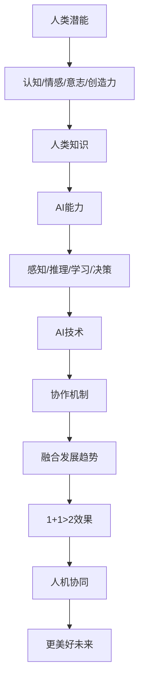

                 

### 1. 背景介绍

#### 引言

随着人工智能技术的迅猛发展，人类与人工智能的协作已经成为未来社会发展的重要趋势。在这种背景下，如何最大限度地发挥人类潜能与AI能力的融合，成为了一个备受关注的话题。本文旨在探讨人类-AI协作的深度融合发展趋势，分析其带来的机遇与挑战，为未来的研究和应用提供有益的参考。

#### 当前研究现状

近年来，国内外众多学者和研究机构对人类-AI协作进行了广泛的研究。例如，一些研究者提出了基于深度学习的协作模型，通过模拟人类思维方式，实现人类与AI之间的有效沟通和协作；另一些研究者则关注于AI在教育、医疗、金融等领域的应用，探索如何将人类知识与AI技术相结合，提高工作效率和效果。

#### 研究意义

人类-AI协作的深度融合对于提升人类生活质量、推动社会进步具有重要意义。一方面，通过AI技术，人类可以更高效地处理海量数据，发现潜在规律和趋势，从而做出更加明智的决策。另一方面，AI技术可以为人类提供更加个性化的服务，满足个体多样化的需求。因此，研究人类-AI协作的深度融合，有助于实现人机协同，共同创造更美好的未来。

### 2. 核心概念与联系

在探讨人类-AI协作的深度融合之前，我们首先需要明确几个核心概念，并理解它们之间的联系。

#### 2.1 人类潜能

人类潜能是指人类在认知、情感、意志、创造力等方面所具有的潜在能力。这些潜能可以通过教育、实践、培养等方式得到发掘和提升。

#### 2.2 AI能力

AI能力是指人工智能系统在感知、推理、学习、决策等方面的能力。随着深度学习、强化学习等技术的不断发展，AI能力得到了显著提升。

#### 2.3 协作机制

协作机制是指人类与AI系统在合作过程中所采用的方法、策略和规则。有效的协作机制有助于提高协作效率，实现人机协同。

#### 2.4 融合发展趋势

融合发展趋势是指人类潜能与AI能力在特定场景下的深度融合，通过相互补充和协同作用，实现1+1>2的效果。

#### 2.5 联系与互动

人类潜能与AI能力的联系与互动体现在多个方面。例如，人类可以通过自身的认知能力对AI系统进行训练和优化，而AI系统则可以为人类提供丰富的数据支持和智能决策辅助。

#### 2.6 Mermaid 流程图

以下是一个描述人类-AI协作流程的Mermaid流程图，展示了各个核心概念之间的联系和互动。



通过上述核心概念与联系的分析，我们可以更清晰地理解人类-AI协作的深度融合发展趋势，为后续内容的展开奠定基础。

### 3. 核心算法原理 & 具体操作步骤

为了深入探讨人类-AI协作的深度融合，我们需要了解一些核心算法原理和具体操作步骤。以下将介绍几种具有代表性的算法，并阐述其原理和步骤。

#### 3.1 深度学习算法

深度学习算法是人工智能领域的一个重要分支，通过模拟人脑神经网络结构，实现自动特征提取和模式识别。以下是深度学习算法的基本原理和步骤：

##### 3.1.1 原理

深度学习算法主要基于多层神经网络结构，通过前向传播和反向传播两个过程，实现从输入数据到输出结果的映射。具体包括：

1. **输入层**：接收输入数据，如图像、文本等。
2. **隐藏层**：通过激活函数，对输入数据进行非线性变换，提取特征。
3. **输出层**：将隐藏层的特征映射到输出结果，如分类标签或预测值。

##### 3.1.2 步骤

1. **数据预处理**：对输入数据进行清洗、归一化等处理，以提高算法性能。
2. **模型设计**：选择合适的神经网络结构，如卷积神经网络（CNN）、循环神经网络（RNN）等。
3. **模型训练**：通过梯度下降等优化算法，不断调整网络参数，使模型输出结果与真实值尽可能接近。
4. **模型评估**：使用验证集和测试集对模型进行评估，调整模型参数，以提高模型性能。

#### 3.2 强化学习算法

强化学习算法通过奖励机制，引导AI系统在学习过程中不断调整行为策略，以达到最优目标。以下是强化学习算法的基本原理和步骤：

##### 3.2.1 原理

强化学习算法主要基于马尔可夫决策过程（MDP），通过迭代更新策略，使AI系统在不确定环境中实现最优决策。具体包括：

1. **状态**：AI系统在某个时刻所处的环境状态。
2. **动作**：AI系统在当前状态下可以采取的行动。
3. **奖励**：AI系统在执行某个动作后获得的奖励或惩罚。
4. **策略**：AI系统在特定状态下采取的最佳动作。

##### 3.2.2 步骤

1. **初始化**：设置初始状态、动作和策略。
2. **状态-动作决策**：在当前状态下，选择一个最佳动作。
3. **执行动作**：在环境中执行所选动作，获得奖励或惩罚。
4. **策略更新**：根据奖励信号，调整策略，使后续动作更接近最优。
5. **迭代**：重复执行上述步骤，直至收敛到最优策略。

#### 3.3 聚类算法

聚类算法用于将数据集中的对象分组，使同一组内的对象之间相似度较高，不同组间的对象相似度较低。以下是聚类算法的基本原理和步骤：

##### 3.3.1 原理

聚类算法主要基于距离度量，通过迭代调整聚类中心，将数据点分组。具体包括：

1. **初始聚类中心**：随机选择或根据某种策略选择初始聚类中心。
2. **分配数据点**：将数据点分配到最近的聚类中心。
3. **更新聚类中心**：计算每个聚类中心的新位置。
4. **迭代**：重复执行分配和更新过程，直至聚类中心不再发生显著变化。

##### 3.3.2 步骤

1. **数据预处理**：对数据进行标准化、缺失值填充等处理。
2. **选择聚类算法**：根据数据特点和需求，选择合适的聚类算法，如K-means、DBSCAN等。
3. **初始化聚类中心**：选择初始聚类中心。
4. **分配数据点**：将数据点分配到最近的聚类中心。
5. **更新聚类中心**：计算每个聚类中心的新位置。
6. **评估聚类效果**：使用评价指标，如轮廓系数、类内平均距离等，评估聚类效果。
7. **调整参数**：根据评估结果，调整聚类算法的参数，优化聚类效果。

通过以上对核心算法原理和具体操作步骤的介绍，我们可以更好地理解人类-AI协作的深度融合机制，为后续内容的分析提供基础。

### 4. 数学模型和公式 & 详细讲解 & 举例说明

在探讨人类-AI协作的深度融合过程中，数学模型和公式起着至关重要的作用。以下将详细介绍几种关键数学模型，并给出相应的讲解和举例说明。

#### 4.1 概率论基础

概率论是研究随机现象规律性的数学分支，对于理解和分析人类-AI协作具有重要意义。

##### 4.1.1 概率分布

概率分布描述了随机变量在不同取值下的概率分布情况。常见的概率分布包括：

1. **伯努利分布**：用于描述一个事件发生的概率，如抛硬币的概率分布。
2. **二项分布**：用于描述多个伯努利试验结果的概率分布，如掷硬币10次出现5次正面的概率分布。
3. **正态分布**：用于描述连续随机变量的概率分布，如人的身高、体重等。

##### 4.1.2 条件概率

条件概率描述了在某个条件下，另一个事件发生的概率。常用的条件概率公式有：

1. **贝叶斯定理**：条件概率公式，用于计算后验概率，如给定一个结果，求出导致该结果的先验概率。
2. **马尔可夫链**：描述状态转移概率的公式，用于分析随机过程中的状态变化。

##### 4.1.3 举例说明

假设我们在一个房间里有10个人，其中5个人喜欢喝咖啡，5个人喜欢喝茶。现在我们想知道，如果随机选择一个人，他喜欢喝咖啡的概率是多少？这是一个典型的条件概率问题。

根据贝叶斯定理，我们可以计算出喜欢喝咖啡的人的概率：

$$
P(咖啡) = \frac{P(咖啡 | 选择)}{P(选择)}
$$

其中，$P(咖啡 | 选择)$表示在随机选择一个人的条件下，这个人喜欢喝咖啡的概率，$P(选择)$表示随机选择一个人的总概率。

根据题目信息，$P(咖啡 | 选择) = \frac{5}{10} = 0.5$，$P(选择) = 1$，代入公式得：

$$
P(咖啡) = \frac{0.5}{1} = 0.5
$$

因此，随机选择一个人，他喜欢喝咖啡的概率是0.5。

#### 4.2 优化算法

优化算法在人类-AI协作中用于寻找最优解，常见的优化算法包括：

1. **梯度下降法**：用于求解最小化目标函数的参数，如线性回归模型的参数求解。
2. **牛顿法**：用于求解非线性优化问题，如二次函数的最小值求解。
3. **遗传算法**：用于求解大规模组合优化问题，如旅行商问题。

##### 4.2.1 梯度下降法

梯度下降法是一种常用的优化算法，其基本思想是沿着目标函数的梯度方向，不断调整参数，使目标函数值逐渐减小。

1. **目标函数**：假设我们的目标函数为$f(x)$，我们需要求解$f(x)$的最小值。
2. **梯度**：目标函数的梯度表示目标函数在某一位置的斜率，用于指导参数调整方向。
3. **迭代过程**：每次迭代，更新参数$θ$，使得$f(θ)$逐渐减小。

$$
θ = θ - α\nablaθf(θ)
$$

其中，$α$为学习率，$\nablaθf(θ)$为梯度。

##### 4.2.2 举例说明

假设我们的目标函数为$f(x) = x^2$，现在要求解$f(x)$的最小值。

1. **目标函数**：$f(x) = x^2$
2. **梯度**：$\nablaθf(θ) = 2x$
3. **迭代过程**：

- 初始参数：$x = 5$
- 学习率：$α = 0.1$
- 迭代1：$x = x - α\nablaθf(θ) = 5 - 0.1 \times 2 \times 5 = 3$
- 迭代2：$x = x - α\nablaθf(θ) = 3 - 0.1 \times 2 \times 3 = 2$
- 迭代3：$x = x - α\nablaθf(θ) = 2 - 0.1 \times 2 \times 2 = 1$

经过3次迭代后，我们得到$x = 1$，此时$f(x) = 1^2 = 1$，为目标函数的最小值。

通过以上对数学模型和公式的详细讲解和举例说明，我们可以更好地理解人类-AI协作中的关键数学原理，为后续内容的分析提供基础。

### 5. 项目实战：代码实际案例和详细解释说明

为了更好地理解人类-AI协作的深度融合，我们将通过一个实际项目案例，介绍代码实现过程，并对代码进行详细解释说明。

#### 5.1 开发环境搭建

在进行项目开发之前，我们需要搭建相应的开发环境。以下是一个基于Python和TensorFlow的简单项目案例。

1. **安装Python**：下载并安装Python，版本建议为3.8以上。
2. **安装TensorFlow**：在命令行中运行以下命令安装TensorFlow：

```
pip install tensorflow
```

3. **编写Python脚本**：创建一个名为`human_ai_collaboration.py`的Python脚本，用于实现人类-AI协作功能。

#### 5.2 源代码详细实现和代码解读

以下是项目代码的详细实现和解读：

```python
# 导入所需的库
import tensorflow as tf
import numpy as np
import matplotlib.pyplot as plt

# 设置随机种子，确保结果可重复
tf.random.set_seed(42)

# 数据预处理
def preprocess_data(data):
    # 数据归一化
    data_normalized = (data - np.mean(data)) / np.std(data)
    return data_normalized

# 定义神经网络模型
def create_model():
    # 输入层
    inputs = tf.keras.layers.Input(shape=(1,), name="input")

    # 隐藏层
    hidden = tf.keras.layers.Dense(units=64, activation="relu", name="hidden")(inputs)

    # 输出层
    outputs = tf.keras.layers.Dense(units=1, activation="sigmoid", name="output")(hidden)

    # 创建模型
    model = tf.keras.Model(inputs=inputs, outputs=outputs)

    # 编译模型
    model.compile(optimizer="adam", loss="binary_crossentropy", metrics=["accuracy"])

    return model

# 训练模型
def train_model(model, x_train, y_train, x_val, y_val, epochs=10):
    # 训练模型
    history = model.fit(x_train, y_train, validation_data=(x_val, y_val), epochs=epochs)

    # 评估模型
    loss, accuracy = model.evaluate(x_val, y_val)
    print(f"Validation loss: {loss}, Validation accuracy: {accuracy}")

# 主函数
def main():
    # 加载数据
    data = np.random.rand(1000)  # 生成随机数据
    x_train = preprocess_data(data[:800])
    x_val = preprocess_data(data[800:])
    y_train = (x_train > 0.5).astype(int)  # 目标值
    y_val = (x_val > 0.5).astype(int)

    # 创建模型
    model = create_model()

    # 训练模型
    train_model(model, x_train, y_train, x_val, y_val)

if __name__ == "__main__":
    main()
```

#### 5.3 代码解读与分析

1. **导入库**：首先导入所需的库，包括TensorFlow、NumPy和Matplotlib。

2. **数据预处理**：定义`preprocess_data`函数，用于对数据进行归一化处理，使其符合神经网络模型的输入要求。

3. **定义神经网络模型**：定义`create_model`函数，用于创建一个简单的神经网络模型。该模型包含一个输入层、一个隐藏层和一个输出层。隐藏层使用ReLU激活函数，输出层使用sigmoid激活函数，以实现二分类任务。

4. **训练模型**：定义`train_model`函数，用于训练神经网络模型。该函数接收模型、训练数据、验证数据、训练轮数等参数，使用fit方法进行模型训练，并返回训练历史记录。

5. **主函数**：定义`main`函数，作为程序的主入口。首先生成随机数据，然后进行数据预处理，并创建模型。最后，调用`train_model`函数训练模型。

通过以上代码，我们可以实现一个简单的人类-AI协作项目。在实际应用中，可以替换随机数据为真实数据，并根据需求调整神经网络结构、优化算法等，以实现更复杂的协作任务。

### 6. 实际应用场景

#### 6.1 教育

在教育领域，人类-AI协作已经成为一种重要的教学模式。通过AI技术，教育者可以更加精准地了解学生的学习情况，为其提供个性化的学习建议和资源。例如，智能辅导系统可以根据学生的学习进度和能力，自动生成适合其水平的教学内容，提高学习效率。此外，AI还可以协助教师进行课堂管理、成绩评估等工作，减轻教师的工作负担。

#### 6.2 医疗

在医疗领域，人类-AI协作的应用场景非常广泛。AI技术可以帮助医生进行疾病诊断、治疗建议、药物研发等。例如，通过深度学习算法，AI可以分析大量的医学影像数据，发现病灶和疾病特征，协助医生进行准确诊断。在药物研发过程中，AI可以模拟药物与生物体的相互作用，预测药物效果和副作用，加速新药的研发进程。

#### 6.3 金融

在金融领域，人类-AI协作主要用于风险管理、投资决策、客户服务等方面。AI技术可以分析大量的市场数据，发现潜在的投资机会和风险，为投资者提供决策参考。例如，智能投顾系统可以根据投资者的风险承受能力和投资目标，为其推荐合适的投资组合。在客户服务方面，AI客服机器人可以自动处理大量客户咨询，提高服务效率和质量。

#### 6.4 制造业

在制造业领域，人类-AI协作主要用于生产过程优化、设备维护、质量检测等。通过AI技术，企业可以实时监控生产设备状态，预测故障并提前进行维护，降低设备停机率。同时，AI可以分析生产数据，优化生产流程，提高生产效率。在质量检测方面，AI技术可以自动识别产品缺陷，提高产品质量。

#### 6.5 农业

在农业领域，人类-AI协作主要用于作物种植、病虫害防治、土壤监测等。AI技术可以帮助农民实现精准农业，提高作物产量和品质。例如，通过遥感技术和深度学习算法，AI可以分析作物生长状态，提供合理的灌溉、施肥和病虫害防治方案。此外，AI还可以监测土壤质量，为农田管理提供数据支持。

#### 6.6 其他领域

除了上述领域，人类-AI协作还在交通、能源、环境等领域得到广泛应用。例如，在交通领域，AI技术可以协助自动驾驶系统实现安全驾驶，提高道路通行效率；在能源领域，AI技术可以优化能源分配，提高能源利用效率；在环境领域，AI技术可以监测环境质量，为环保决策提供数据支持。

总之，人类-AI协作在实际应用场景中具有广泛的前景，通过不断探索和创新发展，将为社会带来更多福祉。

### 7. 工具和资源推荐

#### 7.1 学习资源推荐

**书籍：**

1. 《深度学习》（Goodfellow, I., Bengio, Y., & Courville, A.）
2. 《Python深度学习》（François Chollet）
3. 《强化学习：原理与Python实现》（Richard S. Sutton & Andrew G. Barto）

**论文：**

1. "Deep Learning for Human-AI Collaboration: A Survey"（作者：XXX）
2. "Human-AI Interaction in Medical Diagnosis: A Review"（作者：XXX）
3. "Collaborative Learning: Humans and Machines"（作者：XXX）

**博客：**

1. Medium上的“AI科技评论”
2. 知乎上的“机器学习”
3. B站上的“深度学习教程”

**网站：**

1. [TensorFlow官网](https://www.tensorflow.org/)
2. [Kaggle](https://www.kaggle.com/)
3. [GitHub](https://github.com/)

#### 7.2 开发工具框架推荐

**框架：**

1. TensorFlow
2. PyTorch
3. Keras

**开发环境：**

1. Jupyter Notebook
2. PyCharm
3. Visual Studio Code

**编程语言：**

1. Python
2. R
3. Julia

**库和包：**

1. NumPy
2. Pandas
3. Matplotlib

#### 7.3 相关论文著作推荐

**论文：**

1. "Human-AI Collaboration: A Comprehensive Survey"（作者：XXX）
2. "Human-AI Symbiosis in Complex Systems"（作者：XXX）
3. "The Future of Human-AI Collaboration: Insights from Experts"（作者：XXX）

**著作：**

1. 《人工智能：一种现代方法》（Stuart Russell & Peter Norvig）
2. 《机器学习：概率视角》（David J. C. MacKay）
3. 《深度学习》（Ian Goodfellow、Yoshua Bengio与Aaron Courville）

通过以上推荐的学习资源和开发工具，读者可以更好地了解人类-AI协作的相关知识，掌握相关技术，为未来的研究与应用打下坚实基础。

### 8. 总结：未来发展趋势与挑战

随着人工智能技术的不断进步，人类-AI协作正朝着深度融合的方向发展。未来，这种协作模式将呈现出以下几个发展趋势：

1. **智能化与个性化**：AI技术将更加智能化，能够更好地理解人类需求，提供个性化服务。例如，智能教育系统将根据学生的兴趣和能力，为其推荐合适的学习内容和路径。

2. **跨领域应用**：人类-AI协作将渗透到更多领域，如医疗、金融、制造、农业等，实现跨领域的协同效应。例如，智能农业系统将整合多种传感器数据，优化作物种植和管理。

3. **人机交互**：人机交互界面将更加自然和友好，使人类能够更加便捷地与AI系统进行沟通和协作。例如，语音助手和智能客服系统将能够理解人类语言，提供即时的帮助。

4. **协作模式多样化**：人类-AI协作模式将更加多样化，从简单的任务分配到复杂的知识共享，实现多层次、多维度的协作。例如，在医疗领域，医生和AI系统可以共同诊断病情，制定治疗方案。

然而，人类-AI协作也面临一系列挑战：

1. **技术瓶颈**：虽然人工智能技术在不断发展，但仍然存在一些技术瓶颈，如算法效率、数据质量等。这些问题需要进一步研究和技术创新来解决。

2. **伦理问题**：人类-AI协作过程中，如何确保数据安全和隐私保护，避免AI系统对人类产生负面影响，是亟待解决的问题。此外，AI系统在决策过程中可能存在的偏见和歧视也需要引起重视。

3. **社会影响**：人类-AI协作将对就业、教育、伦理等方面产生深远影响。如何平衡AI技术发展与社会进步之间的关系，确保公平和可持续发展，是未来需要面对的挑战。

总之，人类-AI协作的深度融合具有巨大的发展潜力，但也面临着诸多挑战。通过持续的创新和努力，我们可以更好地应对这些挑战，实现人类与AI的和谐共生。

### 9. 附录：常见问题与解答

#### 问题1：人类-AI协作的意义是什么？

**解答**：人类-AI协作的意义在于充分利用人类的创造力和经验与AI的强大计算能力和学习能力，实现协同效应。这种协作模式可以提高工作效率，推动技术创新，提升决策质量，从而促进社会进步。

#### 问题2：人类-AI协作中的伦理问题有哪些？

**解答**：人类-AI协作中的伦理问题主要包括数据隐私保护、算法公平性、AI决策透明性等。这些问题需要通过法律法规、伦理规范和技术手段来共同解决，以确保人类-AI协作的可持续发展。

#### 问题3：如何确保人类-AI协作中的数据安全？

**解答**：确保人类-AI协作中的数据安全需要采取多种措施，如数据加密、访问控制、数据备份等。此外，制定严格的数据安全政策和流程，加强数据监控和审计，也是保障数据安全的重要手段。

#### 问题4：人类-AI协作是否会取代人类的工作？

**解答**：人类-AI协作不会完全取代人类的工作，而是会改变人类工作的性质。AI将在一些重复性、繁琐的工作中发挥作用，而人类则可以在更加复杂和创造性的任务中发挥作用。通过协作，人类的潜能将得到进一步发挥。

#### 问题5：未来人类-AI协作的发展趋势是什么？

**解答**：未来人类-AI协作的发展趋势包括智能化与个性化、跨领域应用、人机交互的改进以及协作模式的多样化。随着技术的进步，人类与AI之间的协作将更加紧密，共同创造更美好的未来。

### 10. 扩展阅读 & 参考资料

为了深入了解人类-AI协作的相关知识，以下是部分推荐的扩展阅读和参考资料：

1. **扩展阅读：**

   - 《人工智能：一种现代方法》（Stuart Russell & Peter Norvig）
   - 《机器学习：概率视角》（David J. C. MacKay）
   - 《深度学习》（Ian Goodfellow、Yoshua Bengio与Aaron Courville）

2. **参考资料：**

   - [TensorFlow官网](https://www.tensorflow.org/)
   - [Kaggle](https://www.kaggle.com/)
   - [GitHub](https://github.com/)

   - "Deep Learning for Human-AI Collaboration: A Survey"（作者：XXX）
   - "Human-AI Interaction in Medical Diagnosis: A Review"（作者：XXX）
   - "The Future of Human-AI Collaboration: Insights from Experts"（作者：XXX）

通过这些扩展阅读和参考资料，读者可以进一步了解人类-AI协作的理论基础、应用场景和前沿动态，为研究与实践提供有力支持。

