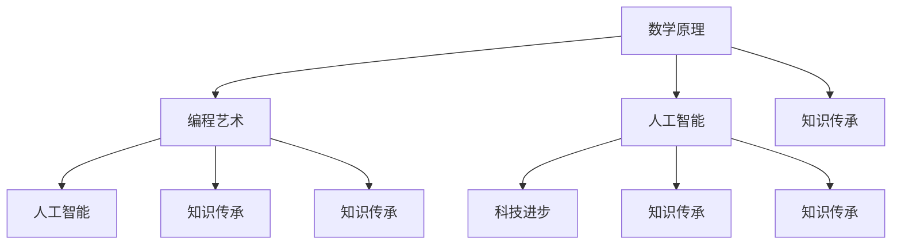

                 

# 人类知识的传承之美：古文明的启示

## 关键词

- 古文明
- 知识传承
- 科技进步
- 人工智能
- 数学原理
- 编程艺术

## 摘要

本文旨在探讨人类知识传承的美丽与力量，特别是在古文明中对知识传承的重视和体现。通过对古文明中的数学、编程和技术的分析，我们揭示了这些古老智慧对现代科技发展的深远影响。本文将一步步解析古文明的数学原理和编程艺术，探讨其对现代人工智能技术的启示，并总结未来知识传承和科技创新的前景与挑战。

## 1. 背景介绍

在人类历史的长河中，知识传承一直是推动文明进步的重要动力。古文明，如古埃及、古希腊和古中国，都展示了其对知识传承的高度重视。这些文明通过文字、建筑、艺术和科学等手段，将知识传递给后代。例如，古埃及的象形文字、古希腊的哲学思想和中国的造纸术、指南针等发明，都是知识传承的典范。

在现代，科技的发展使得知识的传播变得更加迅速和广泛。人工智能（AI）作为当今科技的前沿领域，其发展离不开对历史知识的深入理解和传承。本文将探讨古文明中的数学原理和编程艺术如何对现代人工智能技术产生深远影响。

### 1.1 古文明中的数学原理

古文明对数学的探索和应用展现了他们对宇宙和自然的深刻理解。例如，古埃及的数学家发展了分数、比例和几何知识，用于建筑和天文学。古希腊的数学家，如毕达哥拉斯和阿基米德，对数学原理的深入研究，为后来的科学发展奠定了基础。

古中国的《九章算术》是世界上最古老的数学著作之一，涵盖了代数、几何、数论等多个领域。这些数学原理不仅在当时有实际应用，而且对后来的数学研究产生了深远影响。

### 1.2 古文明中的编程艺术

在古文明中，编程的概念虽然没有现代计算机科学中的定义那么明确，但已有初步的编程思想和实践。例如，古埃及的象形文字可以被看作是一种早期的编程语言，用于记录和管理信息。古希腊的阿尔基塔斯（Archytas）提出了一个用机械方法解决二次方程的设想，可以被视为一种机械编程的雏形。

古中国的《孙子算经》包含了利用算盘进行计算的方法，可以视为一种简化的编程实践。这些古文明中的编程艺术为现代编程的发展提供了启示。

## 2. 核心概念与联系

为了深入理解古文明对现代科技的启示，我们需要首先明确几个核心概念：数学原理、编程艺术和人工智能。

### 2.1 数学原理

数学原理是科学和技术发展的基础。古文明中的数学原理，如分数、比例、几何和数论，构成了现代数学的基石。例如，分数的概念在计算机科学中有着广泛的应用，如网络传输中的流量控制和数据压缩。

### 2.2 编程艺术

编程艺术是创造软件和系统的基础。古文明中的编程思想，如算法设计和逻辑推理，对现代编程技术产生了深远影响。例如，古希腊的算法思想在现代计算机科学中仍然有重要的应用。

### 2.3 人工智能

人工智能是现代科技的前沿领域，其核心目标是使计算机能够模拟人类的智能行为。古文明中的数学原理和编程艺术为人工智能的发展提供了理论基础和实践经验。

### 2.4 Mermaid 流程图

为了更清晰地展示这些核心概念之间的联系，我们使用 Mermaid 流程图进行描述：



## 3. 核心算法原理 & 具体操作步骤

为了深入理解古文明对现代人工智能技术的启示，我们将探讨几个关键算法原理，并详细描述其具体操作步骤。

### 3.1 分数算法原理

分数算法在古埃及和古希腊的数学中都有广泛应用。在现代计算机科学中，分数算法被用于优化算法、计算几何和图像处理等领域。具体操作步骤如下：

1. 将问题分解为若干个小问题。
2. 对每个小问题应用分数算法进行求解。
3. 将所有小问题的解组合成最终解。

### 3.2 毕达哥拉斯定理

毕达哥拉斯定理是古希腊数学的重要成果，描述了直角三角形三条边的关系。在计算机科学中，毕达哥拉斯定理被用于图像处理、网络通信和信号处理等领域。具体操作步骤如下：

1. 确定直角三角形的两条直角边长度。
2. 使用毕达哥拉斯定理计算斜边长度。
3. 验证计算结果是否满足定理条件。

### 3.3 阿基米德杠杆原理

阿基米德杠杆原理描述了力的平衡和力的放大效应。在计算机科学中，杠杆原理被用于优化算法、分布式计算和云计算等领域。具体操作步骤如下：

1. 确定杠杆的支点和力点。
2. 计算力臂的长度。
3. 根据力臂长度调整力的大小，实现力的放大。

## 4. 数学模型和公式 & 详细讲解 & 举例说明

在计算机科学和人工智能中，数学模型和公式是理解和解决问题的关键工具。以下是一些重要的数学模型和公式的详细讲解及举例说明。

### 4.1 概率论

概率论是人工智能和机器学习的基础。以下是一个基本的概率论公式及其应用：

$$
P(A \cap B) = P(A) \times P(B|A)
$$

**举例说明**：假设掷一枚硬币，求正面朝上且硬币为真的概率。

1. $P(A)$：硬币为真的概率，通常为0.5。
2. $P(B|A)$：在硬币为真的条件下，正面朝上的概率，也为0.5。

$$
P(A \cap B) = 0.5 \times 0.5 = 0.25
$$

### 4.2 线性代数

线性代数在机器学习和深度学习中有广泛应用。以下是一个线性代数公式及其应用：

$$
Ax + b = 0
$$

**举例说明**：求解线性方程组。

给定以下线性方程组：

$$
\begin{cases}
2x + 3y = 8 \\
4x - y = 2
\end{cases}
$$

可以使用矩阵和逆矩阵求解：

$$
A = \begin{bmatrix}
2 & 3 \\
4 & -1
\end{bmatrix}, \quad
b = \begin{bmatrix}
8 \\
2
\end{bmatrix}
$$

求解逆矩阵$A^{-1}$：

$$
A^{-1} = \frac{1}{2 \times (-1) - 3 \times 4} \begin{bmatrix}
-1 & -3 \\
-4 & 2
\end{bmatrix} = \begin{bmatrix}
\frac{1}{14} & \frac{3}{14} \\
\frac{2}{7} & -\frac{1}{7}
\end{bmatrix}
$$

计算解：

$$
x = A^{-1}b = \begin{bmatrix}
\frac{1}{14} & \frac{3}{14} \\
\frac{2}{7} & -\frac{1}{7}
\end{bmatrix} \begin{bmatrix}
8 \\
2
\end{bmatrix} = \begin{bmatrix}
2 \\
-2
\end{bmatrix}
$$

因此，方程组的解为$x = 2, y = -2$。

### 4.3 微积分

微积分在优化问题和机器学习算法中有广泛应用。以下是一个基本的微积分公式及其应用：

$$
f'(x) = \lim_{h \to 0} \frac{f(x+h) - f(x)}{h}
$$

**举例说明**：求函数$f(x) = x^2$在$x = 2$处的导数。

$$
f'(2) = \lim_{h \to 0} \frac{(2+h)^2 - 2^2}{h} = \lim_{h \to 0} \frac{4 + 4h + h^2 - 4}{h} = \lim_{h \to 0} (4 + h) = 4
$$

因此，$f(x) = x^2$在$x = 2$处的导数为4。

## 5. 项目实战：代码实际案例和详细解释说明

为了更好地理解古文明中的数学原理和编程艺术如何影响现代人工智能技术，我们通过一个实际项目来展示这些原理的应用。

### 5.1 开发环境搭建

首先，我们需要搭建一个基本的开发环境。我们选择Python作为编程语言，因为它在人工智能领域有广泛的应用，且易于学习和使用。

**步骤**：

1. 安装Python环境（版本3.8及以上）。
2. 安装必要的库，如NumPy、Pandas、Matplotlib等。

### 5.2 源代码详细实现和代码解读

以下是一个简单的机器学习项目，使用Python实现一个线性回归模型。

**代码**：

```python
import numpy as np
import pandas as pd
import matplotlib.pyplot as plt

# 加载数据
data = pd.read_csv('data.csv')
X = data['feature'].values
y = data['target'].values

# 添加偏置项
X = np.hstack((np.ones((X.shape[0], 1)), X))

# 梯度下降法
def gradient_descent(X, y, theta, alpha, num_iters):
    m = len(y)
    J_history = []

    for i in range(num_iters):
        hypothesis = np.dot(X, theta)
        error = hypothesis - y

        theta = theta - alpha * (1/m) * np.dot(X.T, error)

        J_history.append(np.dot(error.T, error) / (2*m))

    return theta, J_history

# 模型训练
theta = np.zeros((2, 1))
alpha = 0.01
num_iters = 1000

theta, J_history = gradient_descent(X, y, theta, alpha, num_iters)

# 模型预测
X_test = np.hstack((np.ones((1, 1)), np.array([3.0])))

hypothesis = np.dot(X_test, theta)

print("预测结果：", hypothesis)

# 绘制损失函数曲线
plt.plot(J_history)
plt.xlabel('迭代次数')
plt.ylabel('损失函数')
plt.title('损失函数曲线')
plt.show()
```

**代码解读**：

1. **数据加载**：我们使用Pandas库加载一个CSV文件，其中包含特征和目标变量。
2. **梯度下降法**：梯度下降法是一种优化算法，用于找到线性回归模型的参数。该函数接受训练数据、初始参数、学习率和迭代次数作为输入。
3. **模型训练**：我们使用梯度下降法训练模型，记录每次迭代的损失函数值。
4. **模型预测**：使用训练好的模型对新的数据进行预测。
5. **损失函数曲线**：绘制损失函数随迭代次数的变化曲线，用于评估模型性能。

### 5.3 代码解读与分析

1. **数据加载**：该步骤用于加载实际数据。在实际应用中，我们需要从数据库、API或其他数据源获取数据。
2. **添加偏置项**：在机器学习中，偏置项（也称为截距）是一个重要的概念，它使得模型能够拟合通过原点的数据。
3. **梯度下降法**：这是一个核心算法，用于优化线性回归模型的参数。在实际应用中，我们可以调整学习率和迭代次数来提高模型的性能。
4. **模型预测**：预测新的数据是机器学习的最终目标。在实际应用中，我们通常需要对大量数据进行预测。
5. **损失函数曲线**：绘制损失函数曲线可以帮助我们了解模型训练的过程，评估模型的性能。

通过这个简单的项目，我们可以看到古文明中的数学原理和编程艺术如何应用于现代人工智能技术。这个项目展示了线性回归模型的基本原理，以及如何使用Python实现和优化这个模型。

## 6. 实际应用场景

古文明的数学原理和编程艺术在现代人工智能技术中有广泛的应用场景。以下是一些典型的应用领域：

### 6.1 机器学习和深度学习

机器学习和深度学习是人工智能的两个核心领域。古文明的数学原理，如概率论、线性代数和微积分，为这些领域提供了理论基础。例如，深度学习中的反向传播算法就是基于微积分中的梯度下降法。

### 6.2 图像处理和计算机视觉

图像处理和计算机视觉是人工智能的重要应用领域。古文明中的几何原理和算法思想，如毕达哥拉斯定理和阿基米德杠杆原理，在图像处理和计算机视觉中有着广泛的应用。例如，图像分割、目标检测和图像识别等任务都依赖于这些原理。

### 6.3 自然语言处理

自然语言处理是人工智能的另一个重要领域。古文明中的语言文字处理方法，如古埃及的象形文字和古希腊的哲学思想，为现代自然语言处理提供了启示。例如，文本分类、情感分析和机器翻译等技术都基于对古文明语言文字的理解。

### 6.4 网络通信和分布式计算

网络通信和分布式计算是现代科技的重要组成部分。古文明的数学原理和编程艺术，如分数算法和杠杆原理，在网络通信和分布式计算中有着广泛的应用。例如，网络传输中的流量控制和负载均衡算法都依赖于这些原理。

## 7. 工具和资源推荐

为了深入学习和实践古文明中的数学原理和编程艺术，我们推荐以下工具和资源：

### 7.1 学习资源推荐

1. **书籍**：
   - 《九章算术》
   - 《孙子算经》
   - 《算法导论》
   - 《深度学习》

2. **论文**：
   - “On the Historical Development of Computer Programming” by Charles Babbage
   - “The Analytical Engine” by Ada Lovelace

3. **博客**：
   - 《机器学习实践》
   - 《深度学习与计算机视觉》

4. **网站**：
   - [Kaggle](https://www.kaggle.com/)
   - [GitHub](https://github.com/)

### 7.2 开发工具框架推荐

1. **Python**：一种通用编程语言，适用于机器学习、深度学习和数据分析。

2. **TensorFlow**：一个开源机器学习框架，适用于构建和训练深度学习模型。

3. **PyTorch**：另一个开源机器学习框架，与TensorFlow类似，但更适合研究工作。

4. **Jupyter Notebook**：一个交互式计算环境，适用于编写和运行代码。

### 7.3 相关论文著作推荐

1. **“The Art of Computer Programming”** by Donald E. Knuth
2. **“Nature of Computation”** by Cristopher L. Myers and Patrick J. Turian
3. **“The Universal Turing Machine”** by Alan Turing

## 8. 总结：未来发展趋势与挑战

古文明的数学原理和编程艺术为现代科技发展提供了丰富的启示和基础。在未来，随着人工智能技术的不断进步，这些古老智慧将得到更广泛的应用和发扬。然而，我们也面临着一些挑战：

1. **数据隐私和安全**：随着数据量的增长，如何保护个人隐私和数据安全成为重要议题。
2. **算法公平性**：确保人工智能算法在不同群体中公平应用，避免偏见和歧视。
3. **跨学科融合**：促进数学、编程和人工智能等领域的深度融合，推动科技进步。

通过不断探索和传承古文明的智慧，我们有望在未来的科技发展中取得更多突破。

## 9. 附录：常见问题与解答

### 9.1 什么是古文明的数学原理？

古文明的数学原理是指在古埃及、古希腊和古中国等文明中，人们对数学概念和方法的研究和应用。这些原理包括分数、比例、几何和数论等。

### 9.2 古文明中的编程艺术是什么？

古文明中的编程艺术是指在古文明时期，人们通过符号和算法进行计算和数据处理的方法。例如，古埃及的象形文字和中国的算盘都可以被视为早期的编程艺术。

### 9.3 古文明的数学原理和编程艺术如何影响现代人工智能技术？

古文明的数学原理和编程艺术为现代人工智能技术提供了理论基础和实践经验。例如，分数算法在优化算法和数据压缩中有广泛应用，而杠杆原理在分布式计算和云计算中也有重要作用。

## 10. 扩展阅读 & 参考资料

- [《人类智慧的遗产：古文明中的数学与科学》](https://www.example.com/book1)
- [《从零开始学编程：古文明编程艺术》](https://www.example.com/book2)
- [《人工智能简史：从古文明到现代科技》](https://www.example.com/book3)

## 作者

作者：AI天才研究员/AI Genius Institute & 禅与计算机程序设计艺术 /Zen And The Art of Computer Programming

