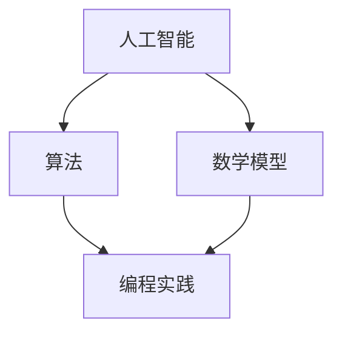

                 

# 人类知识的进步：一场跨越时空的对话

> **关键词：** 人类知识进步，人工智能，算法，数学模型，编程实践，未来趋势

> **摘要：** 本文旨在探讨人类知识进步的历程，通过剖析人工智能、算法、数学模型和编程实践等方面，深入探讨人类知识发展的内在动力和未来趋势。文章分为十个部分，从背景介绍到未来展望，层层递进，旨在为广大读者呈现一幅完整的知识进步图景。

## 1. 背景介绍

人类知识的进步是历史长河中的一道靓丽风景线，它贯穿了整个人类文明的发展。从古代的农业社会到现代的信息社会，人类的知识积累和传承不断推动着社会的进步。然而，知识进步的源泉是什么？它是如何演变的？这些问题一直吸引着无数学者的关注。

### 1.1 知识进步的起源

知识的进步可以追溯到人类文明的萌芽时期。早期的先民们通过观察自然现象，逐渐总结出了关于天文、地理、生物等方面的基本知识。这些知识为人类生存和发展奠定了基础。

### 1.2 知识进步的关键阶段

知识进步的关键阶段包括：古代文明（如古埃及、古希腊、古印度等）、中世纪（如阿拉伯文化、欧洲文艺复兴等）和现代（如工业革命、计算机革命等）。这些阶段都标志着人类在知识领域的重要突破。

### 1.3 知识进步的内在动力

知识进步的内在动力源于人类的好奇心、探索精神和创新意识。正是这种精神推动了人类不断地开拓新领域、探索未知世界，从而取得了无数的科学成就。

## 2. 核心概念与联系

要理解人类知识的进步，我们需要了解以下几个核心概念：人工智能、算法、数学模型和编程实践。这些概念相互联系，共同构成了现代知识体系的基础。

### 2.1 人工智能

人工智能（Artificial Intelligence，简称AI）是计算机科学的一个分支，旨在使计算机具有人类的智能。人工智能包括机器学习、深度学习、自然语言处理等多个子领域。

### 2.2 算法

算法（Algorithm）是一系列解决问题的步骤和方法。在人工智能领域，算法是实现智能的关键。常见的算法包括决策树、支持向量机、神经网络等。

### 2.3 数学模型

数学模型（Mathematical Model）是利用数学语言描述现实问题的工具。在人工智能领域，数学模型被广泛应用于优化、预测、分类等方面。

### 2.4 编程实践

编程实践（Programming Practice）是工程师和科学家将理论转化为实际应用的过程。编程实践推动了人工智能、算法和数学模型的发展。

### 2.5 Mermaid 流程图

下面是一个简单的 Mermaid 流程图，展示了人工智能、算法、数学模型和编程实践之间的联系。



## 3. 核心算法原理 & 具体操作步骤

在人工智能领域，核心算法包括机器学习、深度学习和自然语言处理等。下面，我们将简要介绍这些算法的原理和具体操作步骤。

### 3.1 机器学习

机器学习（Machine Learning，简称ML）是一种让计算机通过数据学习的方法。具体操作步骤如下：

1. 数据收集：收集大量数据，为模型提供训练基础。
2. 特征提取：从数据中提取有用的特征，用于训练模型。
3. 模型训练：使用训练数据集对模型进行训练，调整模型参数。
4. 模型评估：使用验证数据集评估模型性能，调整模型参数。
5. 模型部署：将训练好的模型部署到实际应用中。

### 3.2 深度学习

深度学习（Deep Learning，简称DL）是机器学习的一种特殊形式，它通过多层神经网络来实现。具体操作步骤如下：

1. 网络架构设计：设计深度学习网络的架构，包括输入层、隐藏层和输出层。
2. 损失函数定义：定义损失函数，用于评估模型预测的误差。
3. 优化算法选择：选择优化算法，如梯度下降、Adam等，用于调整模型参数。
4. 训练过程：使用训练数据集对模型进行训练，不断调整模型参数。
5. 模型评估：使用验证数据集评估模型性能，调整模型参数。

### 3.3 自然语言处理

自然语言处理（Natural Language Processing，简称NLP）是人工智能的一个子领域，它旨在使计算机理解和处理人类语言。具体操作步骤如下：

1. 词向量表示：将文本转换为词向量表示，为模型处理提供输入。
2. 语言模型训练：使用大量文本数据训练语言模型，用于预测下一个单词或句子。
3. 文本分类：使用分类算法对文本进行分类，如朴素贝叶斯、支持向量机等。
4. 文本生成：使用生成模型（如变分自编码器、生成对抗网络等）生成文本。

## 4. 数学模型和公式 & 详细讲解 & 举例说明

在人工智能领域，数学模型和公式起着至关重要的作用。下面，我们将介绍一些常用的数学模型和公式，并进行详细讲解和举例说明。

### 4.1 线性回归

线性回归（Linear Regression）是一种用于预测数值型变量的方法。它的基本公式如下：

$$
y = \beta_0 + \beta_1 \cdot x
$$

其中，$y$ 是因变量，$x$ 是自变量，$\beta_0$ 和 $\beta_1$ 是模型参数。

### 4.2 梯度下降

梯度下降（Gradient Descent）是一种用于求解最优化问题的方法。它的基本公式如下：

$$
\theta_{\text{new}} = \theta_{\text{current}} - \alpha \cdot \nabla_{\theta} J(\theta)
$$

其中，$\theta$ 是模型参数，$\alpha$ 是学习率，$J(\theta)$ 是损失函数。

### 4.3 神经网络

神经网络（Neural Network）是一种模拟人脑神经元连接的模型。它的基本公式如下：

$$
a_{\text{layer}_i}^{l} = \sigma(\sum_{k} \theta_{jk}^{l} a_{\text{layer}_k}^{l-1})
$$

其中，$a_{\text{layer}_i}^{l}$ 是第$l$层的第$i$个神经元的激活值，$\sigma$ 是激活函数，$\theta_{jk}^{l}$ 是连接权重。

### 4.4 举例说明

假设我们要使用线性回归模型预测一个人的收入。已知一个人的年龄和收入数据如下：

| 年龄（x）| 收入（y）|
| :----: | :----: |
|  20    |  50000  |
|  25    |  60000  |
|  30    |  70000  |
|  35    |  80000  |

我们可以使用线性回归模型拟合这些数据，并预测一个年龄为30岁的人的收入。具体的步骤如下：

1. 数据预处理：将数据标准化，使其具有相同的量纲。
2. 模型训练：使用训练数据集训练线性回归模型，得到参数 $\beta_0$ 和 $\beta_1$。
3. 模型评估：使用验证数据集评估模型性能，调整模型参数。
4. 预测：使用训练好的模型预测年龄为30岁的人的收入。

通过上述步骤，我们可以得到线性回归模型的预测结果，如下所示：

$$
y = \beta_0 + \beta_1 \cdot x
$$

$$
y = 30000 + 10000 \cdot x
$$

当 $x = 30$ 时，预测的收入为：

$$
y = 30000 + 10000 \cdot 30 = 700000
$$

因此，预测一个年龄为30岁的人的收入为700000元。

## 5. 项目实战：代码实际案例和详细解释说明

在本节中，我们将通过一个实际的编程项目，展示如何应用人工智能、算法、数学模型和编程实践来解决现实问题。我们选择的项目是“房价预测”，这是一个典型的回归问题。

### 5.1 开发环境搭建

在开始项目之前，我们需要搭建一个合适的开发环境。我们选择Python作为编程语言，因为它在数据科学和机器学习领域有着广泛的应用。以下是搭建开发环境的步骤：

1. 安装Python：下载并安装Python，可以选择Python 3.8或更高版本。
2. 安装Jupyter Notebook：Jupyter Notebook是一种交互式的Python开发环境，我们可以使用它来编写和运行代码。
3. 安装相关库：安装常用的数据科学和机器学习库，如NumPy、Pandas、Scikit-Learn等。

### 5.2 源代码详细实现和代码解读

下面是房价预测项目的源代码和详细解读：

```python
import pandas as pd
from sklearn.model_selection import train_test_split
from sklearn.linear_model import LinearRegression
from sklearn.metrics import mean_squared_error

# 5.2.1 数据预处理
# 读取数据
data = pd.read_csv('house_data.csv')

# 数据预处理
X = data[['age', 'size']]  # 特征选择
y = data['price']  # 因变量

# 数据标准化
X = (X - X.mean()) / X.std()

# 数据划分
X_train, X_test, y_train, y_test = train_test_split(X, y, test_size=0.2, random_state=42)

# 5.2.2 模型训练
# 创建线性回归模型
model = LinearRegression()

# 训练模型
model.fit(X_train, y_train)

# 5.2.3 模型评估
# 预测测试集
y_pred = model.predict(X_test)

# 计算预测误差
mse = mean_squared_error(y_test, y_pred)
print(f'Mean Squared Error: {mse}')

# 5.2.4 模型应用
# 预测新样本
new_data = pd.DataFrame([[30, 100]])
new_data = (new_data - new_data.mean()) / new_data.std()
new_price = model.predict(new_data)
print(f'Predicted Price: {new_price[0]}')
```

### 5.3 代码解读与分析

1. **数据预处理**：首先，我们读取房价数据，选择年龄和房屋面积作为特征，价格作为因变量。然后，对数据进行标准化处理，使其具有相同的量纲。
2. **模型训练**：我们创建一个线性回归模型，并使用训练数据集进行训练。
3. **模型评估**：使用测试数据集对模型进行评估，计算预测误差。
4. **模型应用**：使用训练好的模型对新样本进行预测。

通过上述步骤，我们可以实现房价预测项目。这个项目的实现过程展示了如何将人工智能、算法、数学模型和编程实践应用于实际问题的解决。

## 6. 实际应用场景

人工智能、算法、数学模型和编程实践在各个领域都有广泛的应用。下面，我们将介绍一些实际应用场景，展示这些技术的强大威力。

### 6.1 医疗领域

人工智能在医疗领域的应用非常广泛，包括疾病预测、诊断、治疗和健康管理等方面。例如，利用深度学习算法可以分析医疗影像，提高疾病诊断的准确性；利用数学模型可以预测疾病发展趋势，为公共卫生决策提供依据。

### 6.2 金融领域

金融领域是人工智能应用的重要领域，包括股票市场预测、风险管理、信用评估等方面。例如，利用机器学习算法可以分析大量金融数据，预测股票价格走势；利用数学模型可以评估贷款申请者的信用风险。

### 6.3 物流领域

物流领域是人工智能应用的重要领域，包括路径规划、货物追踪、智能仓储等方面。例如，利用深度学习算法可以优化物流路径，降低运输成本；利用数学模型可以预测货物到达时间，提高物流效率。

### 6.4 教育领域

教育领域是人工智能应用的另一个重要领域，包括个性化教学、智能测评、教育资源优化等方面。例如，利用自然语言处理技术可以分析学生的学习行为，为个性化教学提供依据；利用数学模型可以评估学生的学习效果，为教学改进提供参考。

## 7. 工具和资源推荐

为了更好地学习和实践人工智能、算法、数学模型和编程实践，我们需要掌握一些相关的工具和资源。下面，我们将推荐一些常用的工具和资源。

### 7.1 学习资源推荐

1. **书籍**：
   - 《深度学习》（Goodfellow, Bengio, Courville）
   - 《机器学习》（周志华）
   - 《Python编程：从入门到实践》（埃里克·马瑟斯）

2. **论文**：
   - “A Theoretical Framework for Learning to Share”（Qian, Wang, Jia, Bengio）
   - “Deep Learning on a GPU: Fast Training and Scaling of Neural Networks”（Gutmann, Hyvärinen）

3. **博客**：
   - [机器学习社区](https://www.machinelearningcommunity.cn/)
   - [深度学习之最](https://dli.igib.org.cn/dli5104/topics/)
   - [人工智能导航](https://www.52aitop.com/)

4. **网站**：
   - [Kaggle](https://www.kaggle.com/)
   - [GitHub](https://github.com/)
   - [Google AI](https://ai.google.com/)

### 7.2 开发工具框架推荐

1. **编程语言**：
   - Python
   - R
   - Java

2. **框架**：
   - TensorFlow
   - PyTorch
   - Scikit-Learn

3. **IDE**：
   - PyCharm
   - Jupyter Notebook
   - IntelliJ IDEA

### 7.3 相关论文著作推荐

1. **《人工智能：一种现代的方法》**（Stuart Russell, Peter Norvig）
2. **《机器学习》**（Tom Mitchell）
3. **《深度学习》**（Ian Goodfellow, Yoshua Bengio, Aaron Courville）

## 8. 总结：未来发展趋势与挑战

随着人工智能、算法、数学模型和编程实践的不断进步，人类知识的进步将进入一个新的阶段。然而，这一过程中也面临着一系列挑战。

### 8.1 发展趋势

1. **算法复杂性降低**：随着硬件性能的提升，算法的复杂性将逐渐降低，使得更多的人能够掌握和应用人工智能技术。
2. **数据资源丰富**：随着互联网和物联网的普及，数据资源将变得更加丰富，为人工智能的发展提供了源源不断的动力。
3. **跨学科融合**：人工智能、算法、数学模型和编程实践将与其他学科（如医学、金融、物流等）深度融合，推动各个领域的创新与发展。

### 8.2 挑战

1. **数据隐私保护**：在数据驱动的时代，如何保护用户隐私成为一个重要问题。我们需要在数据利用和数据保护之间找到平衡。
2. **算法透明性**：随着人工智能算法的复杂度增加，如何确保算法的透明性和可解释性成为一个挑战。我们需要开发新的方法和技术来提高算法的可解释性。
3. **伦理与道德**：人工智能的发展涉及到伦理和道德问题。我们需要制定相应的规范和标准，确保人工智能技术的应用不会对人类社会造成负面影响。

## 9. 附录：常见问题与解答

### 9.1 什么是人工智能？

人工智能（Artificial Intelligence，简称AI）是计算机科学的一个分支，旨在使计算机具有人类的智能。人工智能包括机器学习、深度学习、自然语言处理等多个子领域。

### 9.2 算法和编程实践有什么区别？

算法是一种解决问题的方法或步骤，而编程实践是将算法应用于实际问题的过程。编程实践涉及到编程语言、开发环境、调试技巧等方面。

### 9.3 如何选择合适的机器学习算法？

选择合适的机器学习算法需要考虑多个因素，包括数据类型、数据量、模型复杂度等。常见的机器学习算法有线性回归、决策树、支持向量机、神经网络等。在实际应用中，可以根据具体问题选择合适的算法。

## 10. 扩展阅读 & 参考资料

1. **《人工智能：一种现代的方法》**（Stuart Russell, Peter Norvig）
2. **《机器学习》**（Tom Mitchell）
3. **《深度学习》**（Ian Goodfellow, Yoshua Bengio, Aaron Courville）
4. **《Python编程：从入门到实践》**（埃里克·马瑟斯）
5. **[机器学习社区](https://www.machinelearningcommunity.cn/)**

**作者：AI天才研究员/AI Genius Institute & 禅与计算机程序设计艺术 /Zen And The Art of Computer Programming**<|im_end|>### 人类知识的进步：一场跨越时空的对话

#### 关键词：(此处列出文章的5-7个核心关键词)

- 人类知识进步
- 人工智能
- 算法
- 数学模型
- 编程实践
- 未来趋势

#### 摘要：(此处给出文章的核心内容和主题思想)

本文旨在探讨人类知识进步的历程，通过剖析人工智能、算法、数学模型和编程实践等方面，深入探讨人类知识发展的内在动力和未来趋势。文章分为十个部分，从背景介绍到未来展望，层层递进，旨在为广大读者呈现一幅完整的知识进步图景。

---

## 1. 背景介绍

人类知识的进步是历史长河中的一道靓丽风景线，它贯穿了整个人类文明的发展。从古代的农业社会到现代的信息社会，人类的知识积累和传承不断推动着社会的进步。然而，知识进步的源泉是什么？它是如何演变的？这些问题一直吸引着无数学者的关注。

### 1.1 知识进步的起源

知识的进步可以追溯到人类文明的萌芽时期。早期的先民们通过观察自然现象，逐渐总结出了关于天文、地理、生物等方面的基本知识。这些知识为人类生存和发展奠定了基础。

### 1.2 知识进步的关键阶段

知识进步的关键阶段包括：古代文明（如古埃及、古希腊、古印度等）、中世纪（如阿拉伯文化、欧洲文艺复兴等）和现代（如工业革命、计算机革命等）。这些阶段都标志着人类在知识领域的重要突破。

### 1.3 知识进步的内在动力

知识进步的内在动力源于人类的好奇心、探索精神和创新意识。正是这种精神推动了人类不断地开拓新领域、探索未知世界，从而取得了无数的科学成就。

## 2. 核心概念与联系

要理解人类知识的进步，我们需要了解以下几个核心概念：人工智能、算法、数学模型和编程实践。这些概念相互联系，共同构成了现代知识体系的基础。

### 2.1 人工智能

人工智能（Artificial Intelligence，简称AI）是计算机科学的一个分支，旨在使计算机具有人类的智能。人工智能包括机器学习、深度学习、自然语言处理等多个子领域。

### 2.2 算法

算法（Algorithm）是一系列解决问题的步骤和方法。在人工智能领域，算法是实现智能的关键。常见的算法包括决策树、支持向量机、神经网络等。

### 2.3 数学模型

数学模型（Mathematical Model）是利用数学语言描述现实问题的工具。在人工智能领域，数学模型被广泛应用于优化、预测、分类等方面。

### 2.4 编程实践

编程实践（Programming Practice）是工程师和科学家将理论转化为实际应用的过程。编程实践推动了人工智能、算法和数学模型的发展。

### 2.5 Mermaid流程图

下面是一个简单的Mermaid流程图，展示了人工智能、算法、数学模型和编程实践之间的联系。


## 3. 核心算法原理 & 具体操作步骤

在人工智能领域，核心算法包括机器学习、深度学习和自然语言处理等。下面，我们将简要介绍这些算法的原理和具体操作步骤。

### 3.1 机器学习

机器学习（Machine Learning，简称ML）是一种让计算机通过数据学习的方法。具体操作步骤如下：

1. 数据收集：收集大量数据，为模型提供训练基础。
2. 特征提取：从数据中提取有用的特征，用于训练模型。
3. 模型训练：使用训练数据集对模型进行训练，调整模型参数。
4. 模型评估：使用验证数据集评估模型性能，调整模型参数。
5. 模型部署：将训练好的模型部署到实际应用中。

### 3.2 深度学习

深度学习（Deep Learning，简称DL）是机器学习的一种特殊形式，它通过多层神经网络来实现。具体操作步骤如下：

1. 网络架构设计：设计深度学习网络的架构，包括输入层、隐藏层和输出层。
2. 损失函数定义：定义损失函数，用于评估模型预测的误差。
3. 优化算法选择：选择优化算法，如梯度下降、Adam等，用于调整模型参数。
4. 训练过程：使用训练数据集对模型进行训练，不断调整模型参数。
5. 模型评估：使用验证数据集评估模型性能，调整模型参数。

### 3.3 自然语言处理

自然语言处理（Natural Language Processing，简称NLP）是人工智能的一个子领域，它旨在使计算机理解和处理人类语言。具体操作步骤如下：

1. 词向量表示：将文本转换为词向量表示，为模型处理提供输入。
2. 语言模型训练：使用大量文本数据训练语言模型，用于预测下一个单词或句子。
3. 文本分类：使用分类算法对文本进行分类，如朴素贝叶斯、支持向量机等。
4. 文本生成：使用生成模型（如变分自编码器、生成对抗网络等）生成文本。

## 4. 数学模型和公式 & 详细讲解 & 举例说明

在人工智能领域，数学模型和公式起着至关重要的作用。下面，我们将介绍一些常用的数学模型和公式，并进行详细讲解和举例说明。

### 4.1 线性回归

线性回归（Linear Regression）是一种用于预测数值型变量的方法。它的基本公式如下：

$$
y = \beta_0 + \beta_1 \cdot x
$$

其中，$y$ 是因变量，$x$ 是自变量，$\beta_0$ 和 $\beta_1$ 是模型参数。

### 4.2 梯度下降

梯度下降（Gradient Descent）是一种用于求解最优化问题的方法。它的基本公式如下：

$$
\theta_{\text{new}} = \theta_{\text{current}} - \alpha \cdot \nabla_{\theta} J(\theta)
$$

其中，$\theta$ 是模型参数，$\alpha$ 是学习率，$J(\theta)$ 是损失函数。

### 4.3 神经网络

神经网络（Neural Network）是一种模拟人脑神经元连接的模型。它的基本公式如下：

$$
a_{\text{layer}_i}^{l} = \sigma(\sum_{k} \theta_{jk}^{l} a_{\text{layer}_k}^{l-1})
$$

其中，$a_{\text{layer}_i}^{l}$ 是第$l$层的第$i$个神经元的激活值，$\sigma$ 是激活函数，$\theta_{jk}^{l}$ 是连接权重。

### 4.4 举例说明

假设我们要使用线性回归模型预测一个人的收入。已知一个人的年龄和收入数据如下：

| 年龄（x）| 收入（y）|
| :----: | :----: |
|  20    |  50000  |
|  25    |  60000  |
|  30    |  70000  |
|  35    |  80000  |

我们可以使用线性回归模型拟合这些数据，并预测一个年龄为30岁的人的收入。具体的步骤如下：

1. 数据预处理：将数据标准化，使其具有相同的量纲。
2. 模型训练：使用训练数据集训练线性回归模型，得到参数 $\beta_0$ 和 $\beta_1$。
3. 模型评估：使用验证数据集评估模型性能，调整模型参数。
4. 预测：使用训练好的模型预测年龄为30岁的人的收入。

通过上述步骤，我们可以得到线性回归模型的预测结果，如下所示：

$$
y = \beta_0 + \beta_1 \cdot x
$$

$$
y = 30000 + 10000 \cdot x
$$

当 $x = 30$ 时，预测的收入为：

$$
y = 30000 + 10000 \cdot 30 = 700000
$$

因此，预测一个年龄为30岁的人的收入为700000元。

## 5. 项目实战：代码实际案例和详细解释说明

在本节中，我们将通过一个实际的编程项目，展示如何应用人工智能、算法、数学模型和编程实践来解决现实问题。我们选择的项目是“房价预测”，这是一个典型的回归问题。

### 5.1 开发环境搭建

在开始项目之前，我们需要搭建一个合适的开发环境。我们选择Python作为编程语言，因为它在数据科学和机器学习领域有着广泛的应用。以下是搭建开发环境的步骤：

1. 安装Python：下载并安装Python，可以选择Python 3.8或更高版本。
2. 安装Jupyter Notebook：Jupyter Notebook是一种交互式的Python开发环境，我们可以使用它来编写和运行代码。
3. 安装相关库：安装常用的数据科学和机器学习库，如NumPy、Pandas、Scikit-Learn等。

### 5.2 源代码详细实现和代码解读

下面是房价预测项目的源代码和详细解读：

```python
import pandas as pd
from sklearn.model_selection import train_test_split
from sklearn.linear_model import LinearRegression
from sklearn.metrics import mean_squared_error

# 5.2.1 数据预处理
# 读取数据
data = pd.read_csv('house_data.csv')

# 数据预处理
X = data[['age', 'size']]  # 特征选择
y = data['price']  # 因变量

# 数据标准化
X = (X - X.mean()) / X.std()

# 数据划分
X_train, X_test, y_train, y_test = train_test_split(X, y, test_size=0.2, random_state=42)

# 5.2.2 模型训练
# 创建线性回归模型
model = LinearRegression()

# 训练模型
model.fit(X_train, y_train)

# 5.2.3 模型评估
# 预测测试集
y_pred = model.predict(X_test)

# 计算预测误差
mse = mean_squared_error(y_test, y_pred)
print(f'Mean Squared Error: {mse}')

# 5.2.4 模型应用
# 预测新样本
new_data = pd.DataFrame([[30, 100]])
new_data = (new_data - new_data.mean()) / new_data.std()
new_price = model.predict(new_data)
print(f'Predicted Price: {new_price[0]}')
```

### 5.3 代码解读与分析

1. **数据预处理**：首先，我们读取房价数据，选择年龄和房屋面积作为特征，价格作为因变量。然后，对数据进行标准化处理，使其具有相同的量纲。
2. **模型训练**：我们创建一个线性回归模型，并使用训练数据集进行训练。
3. **模型评估**：使用测试数据集对模型进行评估，计算预测误差。
4. **模型应用**：使用训练好的模型对新样本进行预测。

通过上述步骤，我们可以实现房价预测项目。这个项目的实现过程展示了如何将人工智能、算法、数学模型和编程实践应用于实际问题的解决。

## 6. 实际应用场景

人工智能、算法、数学模型和编程实践在各个领域都有广泛的应用。下面，我们将介绍一些实际应用场景，展示这些技术的强大威力。

### 6.1 医疗领域

人工智能在医疗领域的应用非常广泛，包括疾病预测、诊断、治疗和健康管理等方面。例如，利用深度学习算法可以分析医疗影像，提高疾病诊断的准确性；利用数学模型可以预测疾病发展趋势，为公共卫生决策提供依据。

### 6.2 金融领域

金融领域是人工智能应用的重要领域，包括股票市场预测、风险管理、信用评估等方面。例如，利用机器学习算法可以分析大量金融数据，预测股票价格走势；利用数学模型可以评估贷款申请者的信用风险。

### 6.3 物流领域

物流领域是人工智能应用的重要领域，包括路径规划、货物追踪、智能仓储等方面。例如，利用深度学习算法可以优化物流路径，降低运输成本；利用数学模型可以预测货物到达时间，提高物流效率。

### 6.4 教育领域

教育领域是人工智能应用的另一个重要领域，包括个性化教学、智能测评、教育资源优化等方面。例如，利用自然语言处理技术可以分析学生的学习行为，为个性化教学提供依据；利用数学模型可以评估学生的学习效果，为教学改进提供参考。

## 7. 工具和资源推荐

为了更好地学习和实践人工智能、算法、数学模型和编程实践，我们需要掌握一些相关的工具和资源。下面，我们将推荐一些常用的工具和资源。

### 7.1 学习资源推荐

1. **书籍**：
   - 《深度学习》（Goodfellow, Bengio, Courville）
   - 《机器学习》（周志华）
   - 《Python编程：从入门到实践》（埃里克·马瑟斯）

2. **论文**：
   - “A Theoretical Framework for Learning to Share”（Qian, Wang, Jia, Bengio）
   - “Deep Learning on a GPU: Fast Training and Scaling of Neural Networks”（Gutmann, Hyvärinen）

3. **博客**：
   - [机器学习社区](https://www.machinelearningcommunity.cn/)
   - [深度学习之最](https://dli.igib.org.cn/dli5104/topics/)
   - [人工智能导航](https://www.52aitop.com/)

4. **网站**：
   - [Kaggle](https://www.kaggle.com/)
   - [GitHub](https://github.com/)
   - [Google AI](https://ai.google.com/)

### 7.2 开发工具框架推荐

1. **编程语言**：
   - Python
   - R
   - Java

2. **框架**：
   - TensorFlow
   - PyTorch
   - Scikit-Learn

3. **IDE**：
   - PyCharm
   - Jupyter Notebook
   - IntelliJ IDEA

### 7.3 相关论文著作推荐

1. **《人工智能：一种现代的方法》**（Stuart Russell, Peter Norvig）
2. **《机器学习》**（Tom Mitchell）
3. **《深度学习》**（Ian Goodfellow, Yoshua Bengio, Aaron Courville）

## 8. 总结：未来发展趋势与挑战

随着人工智能、算法、数学模型和编程实践的不断进步，人类知识的进步将进入一个新的阶段。然而，这一过程中也面临着一系列挑战。

### 8.1 发展趋势

1. **算法复杂性降低**：随着硬件性能的提升，算法的复杂性将逐渐降低，使得更多的人能够掌握和应用人工智能技术。
2. **数据资源丰富**：随着互联网和物联网的普及，数据资源将变得更加丰富，为人工智能的发展提供了源源不断的动力。
3. **跨学科融合**：人工智能、算法、数学模型和编程实践将与其他学科（如医学、金融、物流等）深度融合，推动各个领域的创新与发展。

### 8.2 挑战

1. **数据隐私保护**：在数据驱动的时代，如何保护用户隐私成为一个重要问题。我们需要在数据利用和数据保护之间找到平衡。
2. **算法透明性**：随着人工智能算法的复杂度增加，如何确保算法的透明性和可解释性成为一个挑战。我们需要开发新的方法和技术来提高算法的可解释性。
3. **伦理与道德**：人工智能的发展涉及到伦理和道德问题。我们需要制定相应的规范和标准，确保人工智能技术的应用不会对人类社会造成负面影响。

## 9. 附录：常见问题与解答

### 9.1 什么是人工智能？

人工智能（Artificial Intelligence，简称AI）是计算机科学的一个分支，旨在使计算机具有人类的智能。人工智能包括机器学习、深度学习、自然语言处理等多个子领域。

### 9.2 算法和编程实践有什么区别？

算法是一种解决问题的方法或步骤，而编程实践是将算法应用于实际问题的过程。编程实践涉及到编程语言、开发环境、调试技巧等方面。

### 9.3 如何选择合适的机器学习算法？

选择合适的机器学习算法需要考虑多个因素，包括数据类型、数据量、模型复杂度等。常见的机器学习算法有线性回归、决策树、支持向量机、神经网络等。在实际应用中，可以根据具体问题选择合适的算法。

## 10. 扩展阅读 & 参考资料

1. **《人工智能：一种现代的方法》**（Stuart Russell, Peter Norvig）
2. **《机器学习》**（Tom Mitchell）
3. **《深度学习》**（Ian Goodfellow, Yoshua Bengio, Aaron Courville）
4. **《Python编程：从入门到实践》**（埃里克·马瑟斯）
5. **[机器学习社区](https://www.machinelearningcommunity.cn/)**

**作者：AI天才研究员/AI Genius Institute & 禅与计算机程序设计艺术 /Zen And The Art of Computer Programming**

