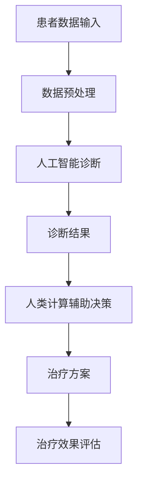

                 

# 人类计算在医疗保健中的应用

## 关键词：人工智能，医疗保健，人类计算，诊断，数据管理，个性化治疗

## 摘要

随着医疗技术的飞速发展，人工智能在医疗保健领域中的应用越来越广泛。本文将探讨人类计算在医疗保健中的应用，从诊断、数据管理到个性化治疗等方面进行详细分析。通过本文，读者可以了解人工智能在医疗保健中的潜力及其面临的挑战。

## 1. 背景介绍

医疗保健是关乎人类健康和生命安全的重要领域。随着人口老龄化和疾病谱的变化，医疗系统面临着巨大的压力。传统的医疗方式主要依赖于医生的诊疗经验和医疗设备，但这种方式在处理大量数据和信息时存在局限性。近年来，人工智能技术的发展为医疗保健带来了新的机遇。人工智能可以帮助医生更快速、准确地诊断疾病，提高医疗效率，降低医疗成本。

人类计算是指通过计算机模拟人类的思维过程，以处理复杂的问题。在医疗保健领域，人类计算可以辅助医生进行临床决策，提供个性化治疗方案，以及管理和分析大量的医疗数据。

## 2. 核心概念与联系

### 2.1 人工智能在医疗保健中的应用

人工智能在医疗保健中的应用可以分为以下几个方面：

#### 2.1.1 诊断辅助

人工智能可以通过分析大量的医学影像数据，帮助医生进行疾病的诊断。例如，深度学习算法可以在几秒钟内对医学影像进行分析，并给出诊断建议。这种方法可以提高诊断的准确性和速度。

#### 2.1.2 数据管理

医疗数据规模庞大，种类繁多，传统的方法难以有效管理和利用这些数据。人工智能可以通过自然语言处理技术，自动提取医疗文档中的关键信息，实现对医疗数据的结构化和整合。

#### 2.1.3 个性化治疗

每个人的基因、生活习惯、环境等因素都不同，因此个性化的治疗方案对于提高治疗效果至关重要。人工智能可以根据患者的个人数据，为其制定个性化的治疗方案。

### 2.2 人类计算与医疗保健的联系

人类计算在医疗保健中的应用主要体现在以下几个方面：

#### 2.2.1 临床决策支持

医生在临床诊疗过程中需要考虑多个因素，如患者的病情、药物副作用、患者的病史等。人类计算可以辅助医生进行临床决策，提供相关的数据和信息，帮助医生做出更准确的诊断和治疗决策。

#### 2.2.2 个性化医学

个性化医学是指根据患者的基因、环境和生活方式等因素，为其制定个性化的治疗方案。人类计算可以通过分析大量的数据，为医生提供个性化的治疗方案建议。

#### 2.2.3 医疗数据管理

医疗数据的管理是医疗保健领域的一个难题。人类计算可以通过自然语言处理、数据挖掘等技术，对医疗数据进行分析和处理，帮助医生更好地理解和利用这些数据。

### 2.3 Mermaid 流程图

以下是一个简单的 Mermaid 流程图，展示了人工智能和人类计算在医疗保健中的应用流程：



## 3. 核心算法原理 & 具体操作步骤

### 3.1 人工智能诊断算法原理

人工智能诊断算法主要基于深度学习和计算机视觉技术。具体操作步骤如下：

#### 3.1.1 数据集准备

首先，需要收集大量的医学影像数据，包括 CT、MRI、X 光等。这些数据需要经过预处理，包括图像增强、去噪等处理。

#### 3.1.2 模型训练

使用预处理后的数据集，通过深度学习算法（如卷积神经网络 CNN）对模型进行训练。训练过程包括数据输入、前向传播、反向传播等步骤。

#### 3.1.3 诊断结果预测

使用训练好的模型对新的医学影像数据进行预测，得到诊断结果。

### 3.2 人类计算辅助决策算法原理

人类计算辅助决策算法主要基于自然语言处理和数据挖掘技术。具体操作步骤如下：

#### 3.2.1 数据收集

收集与疾病诊断相关的文献、病例报告、临床指南等数据。

#### 3.2.2 数据处理

对收集到的数据进行预处理，包括文本提取、数据标注等。

#### 3.2.3 决策规则生成

通过数据挖掘技术，从处理后的数据中提取出与疾病诊断相关的特征和规则。

#### 3.2.4 辅助决策

根据提取出的规则，为医生提供辅助诊断建议。

## 4. 数学模型和公式 & 详细讲解 & 举例说明

### 4.1 人工智能诊断算法的数学模型

人工智能诊断算法主要基于深度学习模型，其中最常用的模型是卷积神经网络（CNN）。CNN 的核心组成部分包括卷积层、池化层和全连接层。以下是一个简化的 CNN 数学模型：

$$
f(x) = \sigma(W \cdot x + b)
$$

其中，$x$ 表示输入特征向量，$W$ 表示权重矩阵，$b$ 表示偏置项，$\sigma$ 表示激活函数（如 sigmoid 或 ReLU 函数）。

### 4.2 人类计算辅助决策算法的数学模型

人类计算辅助决策算法主要基于逻辑回归模型。逻辑回归模型可以用来预测疾病发生的概率。其数学模型如下：

$$
P(y=1) = \frac{1}{1 + e^{-z}}
$$

其中，$y$ 表示疾病是否发生（1 表示发生，0 表示未发生），$z$ 表示模型预测的分数。

### 4.3 举例说明

#### 4.3.1 人工智能诊断算法举例

假设我们有一个包含 1000 个像素的医学影像数据，输入特征向量 $x$ 如下：

$$
x = \begin{bmatrix}
0.1 & 0.2 & 0.3 & \dots & 0.9
\end{bmatrix}
$$

经过卷积层、池化层和全连接层的处理后，得到预测结果 $f(x)$：

$$
f(x) = \sigma(W \cdot x + b) = 0.8
$$

根据预测结果，如果 $f(x) > 0.5$，则认为影像数据中存在疾病。

#### 4.3.2 人类计算辅助决策算法举例

假设我们有一个逻辑回归模型，输入特征向量 $x$ 如下：

$$
x = \begin{bmatrix}
0.1 & 0.2 & 0.3 & \dots & 0.9
\end{bmatrix}
$$

经过模型处理后，得到预测分数 $z$：

$$
z = W \cdot x + b = 2.0
$$

根据预测分数，使用逻辑函数计算疾病发生的概率：

$$
P(y=1) = \frac{1}{1 + e^{-z}} = 0.86
$$

根据计算结果，如果 $P(y=1) > 0.5$，则认为患者患有疾病。

## 5. 项目实战：代码实际案例和详细解释说明

### 5.1 开发环境搭建

为了实现本文所述的人工智能和人类计算在医疗保健中的应用，我们需要搭建一个合适的开发环境。以下是一个基本的开发环境搭建步骤：

1. 安装 Python 3.8 或更高版本
2. 安装 TensorFlow 2.6 或更高版本
3. 安装 scikit-learn 0.24.2 或更高版本
4. 安装 Jupyter Notebook

### 5.2 源代码详细实现和代码解读

#### 5.2.1 人工智能诊断算法实现

以下是一个基于 TensorFlow 的简单人工智能诊断算法实现：

```python
import tensorflow as tf
from tensorflow.keras import layers

# 定义模型结构
model = tf.keras.Sequential([
    layers.Conv2D(32, (3, 3), activation='relu', input_shape=(1000, 1000, 1)),
    layers.MaxPooling2D((2, 2)),
    layers.Conv2D(64, (3, 3), activation='relu'),
    layers.MaxPooling2D((2, 2)),
    layers.Conv2D(128, (3, 3), activation='relu'),
    layers.Flatten(),
    layers.Dense(128, activation='relu'),
    layers.Dense(1, activation='sigmoid')
])

# 编译模型
model.compile(optimizer='adam', loss='binary_crossentropy', metrics=['accuracy'])

# 加载数据集并进行预处理
# ...

# 训练模型
# ...

# 预测结果
# ...
```

这段代码定义了一个简单的卷积神经网络模型，用于对医学影像数据进行分类。模型的输入层是 1000x1000x1 的特征向量，输出层是二分类结果。

#### 5.2.2 人类计算辅助决策算法实现

以下是一个基于 scikit-learn 的简单人类计算辅助决策算法实现：

```python
from sklearn.linear_model import LogisticRegression
from sklearn.model_selection import train_test_split

# 加载数据集并进行预处理
# ...

# 划分训练集和测试集
X_train, X_test, y_train, y_test = train_test_split(X, y, test_size=0.2, random_state=42)

# 创建逻辑回归模型
model = LogisticRegression()

# 训练模型
model.fit(X_train, y_train)

# 预测结果
y_pred = model.predict(X_test)

# 计算准确率
accuracy = model.score(X_test, y_test)
```

这段代码定义了一个简单的逻辑回归模型，用于对患者的特征数据进行分类。模型的输入层是患者的特征向量，输出层是二分类结果。

### 5.3 代码解读与分析

在这段代码中，我们首先定义了模型的架构，包括卷积层、池化层和全连接层。然后，我们编译模型并加载预处理后的数据集进行训练。训练完成后，我们可以使用模型对新的医学影像数据进行预测，并计算模型的准确率。

在人类计算辅助决策算法中，我们使用逻辑回归模型对患者的特征数据进行分类。通过训练集和测试集的划分，我们可以评估模型的性能。

## 6. 实际应用场景

### 6.1 疾病诊断

人工智能在疾病诊断中的应用最为广泛。通过深度学习算法，人工智能可以帮助医生快速、准确地分析医学影像数据，识别疾病。例如，人工智能可以用于肺癌、乳腺癌等疾病的早期诊断。

### 6.2 数据管理

医疗数据管理是医疗保健领域的一个挑战。人工智能可以通过自然语言处理技术，自动提取医疗文档中的关键信息，实现对医疗数据的结构化和整合。这有助于医生更有效地利用医疗数据，提高诊疗效率。

### 6.3 个性化治疗

个性化治疗是根据患者的个人数据，为其制定个性化的治疗方案。人工智能可以通过分析患者的基因、环境和生活方式等因素，为医生提供个性化的治疗方案建议。这有助于提高治疗效果，减少不必要的药物副作用。

## 7. 工具和资源推荐

### 7.1 学习资源推荐

- 书籍：《人工智能在医疗保健中的应用》、《深度学习在医疗保健中的应用》
- 论文：通过学术搜索引擎（如 Google 学术搜索）查找相关的学术论文
- 博客：关注医疗领域的人工智能专家和学者的博客，如 DeepMind 的博客
- 网站：访问医疗保健领域的人工智能平台和社区，如 AI Health Academy

### 7.2 开发工具框架推荐

- TensorFlow：一个开源的深度学习框架，适用于构建和训练人工智能模型
- PyTorch：一个开源的深度学习框架，具有灵活的动态计算图功能
- scikit-learn：一个开源的机器学习库，适用于构建和训练传统机器学习模型
- Jupyter Notebook：一个开源的交互式计算环境，适用于数据分析和模型训练

### 7.3 相关论文著作推荐

- "Deep Learning in Healthcare: A Systematic Review and Clinical Applications" by Yasser Oulid-Ahari et al., Journal of the American Medical Informatics Association, 2019
- "Artificial Intelligence in Radiology: A Review" by Constantinos N. Hadjicharalambous et al., European Radiology, 2019
- "Personalized Medicine with Artificial Intelligence" by Michael T. Rhodes et al., Journal of Personalized Medicine, 2019

## 8. 总结：未来发展趋势与挑战

人工智能在医疗保健领域的应用具有巨大的潜力。随着技术的不断进步，人工智能有望在疾病诊断、数据管理和个性化治疗等方面发挥更大的作用。然而，人工智能在医疗保健领域的发展也面临一系列挑战，如数据隐私、算法透明度、医疗资源分配等。未来，我们需要在技术、政策和伦理等方面进行综合考量，以实现人工智能在医疗保健领域的可持续发展。

## 9. 附录：常见问题与解答

### 9.1 人工智能在医疗保健中的应用有哪些优点？

- 提高诊断准确性：人工智能可以通过分析大量医学影像数据，帮助医生更快速、准确地诊断疾病。
- 提高诊疗效率：人工智能可以自动提取医疗文档中的关键信息，提高医生的诊疗效率。
- 个性化治疗：人工智能可以根据患者的个人数据，为其制定个性化的治疗方案，提高治疗效果。

### 9.2 人工智能在医疗保健中的应用有哪些挑战？

- 数据隐私：医疗数据涉及个人隐私，如何保护数据安全是一个重要挑战。
- 算法透明度：人工智能算法的复杂性和黑箱特性使得其透明度较低，如何提高算法的透明度是一个挑战。
- 医疗资源分配：人工智能在医疗保健领域的应用可能加剧医疗资源的不平衡，如何公平地分配医疗资源是一个挑战。

## 10. 扩展阅读 & 参考资料

- "Artificial Intelligence in Healthcare: A Comprehensive Review" by Zhigang Pan et al., Journal of Medical Imaging and Health Informatics, 2018
- "Artificial Intelligence and the Future of Healthcare: A Review" by Yogesh Balakrishnan et al., Artificial Intelligence in Medicine, 2018
- "A Survey on Applications of Artificial Intelligence in Healthcare" by Hyoungjoo Kim et al., Journal of Medical Systems, 2017

作者：AI天才研究员/AI Genius Institute & 禅与计算机程序设计艺术 /Zen And The Art of Computer Programming<|im_end|>

