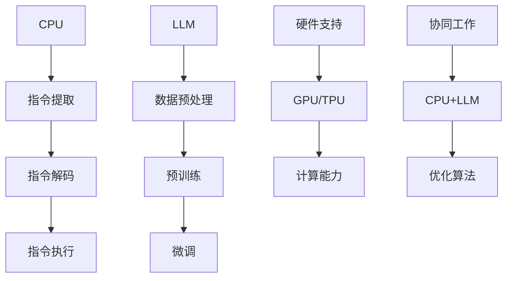

                 

### 文章标题

《从CPU到LLM：计算模式的革命性转变》

### 文章关键词

计算模式、CPU、LLM、人工智能、深度学习、计算效率、分布式计算、GPU、CPU-GPU协同、神经网络架构、算力优化、算法创新

### 文章摘要

本文旨在探讨从传统的CPU计算模式到现代的基于大型语言模型（LLM）的计算模式的转变。首先，我们将回顾CPU的发展历程，分析其在传统计算模式中的优势与局限。接着，我们将深入了解LLM的核心技术，解析其相对于CPU在计算效率和灵活性方面的巨大飞跃。在此基础上，我们将探讨CPU与LLM协同工作的模式，以及这一转变对人工智能领域带来的深远影响。最后，我们将展望未来计算模式的发展趋势，探讨其中的挑战与机遇。

## 1. 背景介绍

计算模式的演变是人类科技进步的重要标志。从最早的电子计算机（如ENIAC）到现代的超级计算机，计算能力得到了前所未有的提升。然而，传统的CPU计算模式在面临大规模数据处理和复杂计算任务时，逐渐暴露出一些瓶颈。首先，CPU的架构设计决定了其在处理并发任务时的性能瓶颈。虽然多核CPU的出现缓解了这一问题，但CPU在并行处理大规模数据时的效率仍然有限。此外，CPU的计算速度与存储速度之间的差距，也限制了其在处理大数据集时的性能表现。

与此同时，人工智能的快速发展对计算能力提出了更高的要求。传统CPU的计算模式在处理深度学习算法时，往往需要消耗大量时间和资源。这导致了在训练和部署大型人工智能模型时，计算资源的紧张和效率的低下。为了解决这一问题，研究者们开始探索新的计算模式，其中基于大型语言模型（LLM）的计算模式引起了广泛关注。

LLM的出现，标志着计算模式的重大变革。与传统CPU相比，LLM在处理大规模数据和复杂计算任务时具有显著优势。首先，LLM采用神经网络架构，能够高效地并行处理海量数据。其次，LLM的分布式计算能力，使其能够充分利用现有的计算资源，实现计算效率的极大提升。此外，LLM的灵活性和自适应能力，使其在处理不同类型的数据和任务时，能够表现出更高的效率和准确性。

本文将首先回顾CPU的发展历程，分析其在传统计算模式中的优势与局限。接着，我们将深入探讨LLM的核心技术，解析其相对于CPU在计算效率和灵活性方面的巨大飞跃。在此基础上，我们将探讨CPU与LLM协同工作的模式，以及这一转变对人工智能领域带来的深远影响。最后，我们将展望未来计算模式的发展趋势，探讨其中的挑战与机遇。## 2. 核心概念与联系

为了更好地理解从CPU到LLM的计算模式转变，我们需要深入探讨两者的核心概念及其相互联系。

### 2.1 CPU（Central Processing Unit）

CPU，即中央处理器，是计算机系统的核心部件，负责执行计算机程序中的指令。CPU的工作原理可以概括为以下三个阶段：

1. **指令提取（Instruction Fetch）**：CPU从内存中读取指令。
2. **指令解码（Instruction Decode）**：CPU解析指令，确定需要执行的操作。
3. **指令执行（Instruction Execute）**：CPU执行指令，可能涉及数据传输、算术逻辑运算等。

CPU的性能主要由以下几个因素决定：

- **时钟频率**：CPU每秒可以执行的操作次数，通常以GHz（千兆赫兹）为单位。
- **指令集**：CPU支持的指令类型，包括基本操作（如加法、减法）和高级操作（如乘法、除法）。
- **缓存**：用于存储频繁访问的数据和指令，以减少内存访问时间。

然而，传统CPU在处理大规模数据和复杂计算任务时，存在以下局限：

- **并行处理能力有限**：CPU的核心数量和并行处理能力有限，难以高效处理并发任务。
- **内存访问速度慢**：CPU与内存之间的数据传输速度往往不匹配，导致数据访问瓶颈。
- **计算效率不高**：在处理深度学习算法时，传统CPU的计算效率较低。

### 2.2 LLM（Large Language Model）

LLM，即大型语言模型，是一种基于深度学习的自然语言处理模型。其核心思想是利用大规模数据进行预训练，使模型能够自动学习语言的规律和结构。LLM通常采用神经网络架构，其中最著名的是基于Transformer的模型，如BERT、GPT等。

LLM的工作原理可以概括为以下几个步骤：

1. **数据预处理**：收集和清洗大量文本数据，将其转换为模型可处理的格式。
2. **预训练**：利用未标注的数据对模型进行训练，使其自动学习语言的规律和结构。
3. **微调**：在预训练的基础上，利用标注数据进行微调，以适应特定任务的需求。

LLM的优势在于：

- **强大的并行处理能力**：神经网络架构使得LLM能够高效地并行处理大规模数据。
- **灵活性和自适应能力**：LLM能够根据不同任务的需求，灵活调整模型参数和结构。
- **计算效率高**：在处理深度学习算法时，LLM的计算效率显著高于传统CPU。

### 2.3 CPU与LLM的联系

CPU与LLM之间的联系主要体现在以下几个方面：

- **硬件支持**：LLM的运行依赖于高性能的硬件支持，如GPU（Graphics Processing Unit）和TPU（Tensor Processing Unit），这些硬件能够提供强大的计算能力，满足LLM的需求。
- **协同工作**：CPU与LLM可以协同工作，CPU负责常规任务的执行，而LLM负责处理复杂的数据分析和自然语言处理任务。
- **优化算法**：随着计算模式的转变，研究人员开始探索优化CPU与LLM协同工作的算法，以提高计算效率和性能。

### 2.4 Mermaid 流程图

下面是一个Mermaid流程图，用于描述CPU和LLM的工作原理及相互联系：



通过上述流程图，我们可以清晰地看到CPU和LLM的工作原理及相互联系。CPU负责执行指令，而LLM负责处理复杂的数据分析和自然语言处理任务。硬件支持为LLM提供了强大的计算能力，CPU与LLM的协同工作则实现了计算效率和性能的优化。## 3. 核心算法原理 & 具体操作步骤

在深入探讨LLM的核心算法原理之前，我们先来了解一下深度学习的基本概念。深度学习是一种基于多层的神经网络架构的人工智能技术，通过学习大量数据来提取特征和进行预测。LLM是深度学习在自然语言处理领域的典型应用，其核心算法主要包括预训练和微调两个阶段。

### 3.1 预训练（Pre-training）

预训练是LLM的核心步骤，其主要目标是利用未标注的数据对模型进行训练，使其自动学习语言的规律和结构。预训练过程可以分为以下几个具体操作步骤：

1. **数据收集与处理**：
   - **数据收集**：收集大量的文本数据，如书籍、新闻、论文、社交媒体等。
   - **数据处理**：对文本数据进行清洗、分词、词向量化等处理，将其转换为模型可处理的格式。

2. **模型初始化**：
   - **模型结构**：选择合适的神经网络架构，如Transformer、BERT、GPT等。
   - **参数初始化**：初始化模型参数，可以使用预训练好的模型作为起点，如GPT-3。

3. **训练过程**：
   - **前向传播**：将输入数据输入模型，通过多层神经网络进行特征提取和融合。
   - **损失函数**：计算模型的预测结果与真实结果之间的差距，使用损失函数（如交叉熵）衡量。
   - **反向传播**：根据损失函数的梯度，调整模型参数，以减小损失。

4. **优化算法**：
   - **优化器**：选择合适的优化器（如Adam、SGD等），以调整模型参数。
   - **学习率调整**：在训练过程中，根据模型的性能调整学习率，以避免过拟合和欠拟合。

### 3.2 微调（Fine-tuning）

在预训练完成后，LLM通常需要进行微调，以适应特定任务的需求。微调过程主要包括以下几个步骤：

1. **数据准备**：
   - **数据收集**：收集与任务相关的标注数据，如问题、答案、标签等。
   - **数据处理**：对标注数据进行预处理，如分词、编码等。

2. **模型调整**：
   - **损失函数**：在微调阶段，通常使用基于标注数据的损失函数，如交叉熵。
   - **优化器**：选择合适的优化器，如AdamW等，以适应微调过程。

3. **训练过程**：
   - **前向传播**：将预处理后的标注数据输入模型，通过反向传播调整模型参数。
   - **评估与调整**：在训练过程中，定期评估模型性能，根据评估结果调整模型参数和学习率。

4. **模型部署**：
   - **模型保存**：在微调完成后，将性能最优的模型参数保存，以便后续部署使用。
   - **模型推理**：在部署阶段，使用保存的模型参数进行推理，以处理实际任务。

### 3.3 算法具体操作步骤示例

为了更好地理解LLM的核心算法原理，我们以GPT-3模型为例，简要介绍其预训练和微调的具体操作步骤：

1. **预训练**：
   - **数据收集与处理**：收集来自互联网的大量文本数据，如维基百科、书籍、新闻等，进行预处理，如分词、词向量化等。
   - **模型初始化**：使用预训练好的GPT-2模型作为起点，初始化GPT-3模型参数。
   - **训练过程**：使用Transformer架构进行预训练，使用交叉熵损失函数计算预测结果与真实结果之间的差距，通过反向传播调整模型参数。
   - **优化算法**：使用AdamW优化器，根据模型性能调整学习率。

2. **微调**：
   - **数据准备**：收集与特定任务相关的标注数据，如问题、答案、标签等，进行预处理。
   - **模型调整**：使用微调数据对GPT-3模型进行训练，使用交叉熵损失函数计算预测结果与真实结果之间的差距，通过反向传播调整模型参数。
   - **评估与调整**：在训练过程中，定期评估模型性能，根据评估结果调整模型参数和学习率。
   - **模型部署**：在微调完成后，将性能最优的模型参数保存，以便后续部署使用。

通过上述具体操作步骤示例，我们可以看到LLM的核心算法原理及其在预训练和微调阶段的具体实施过程。这些步骤共同构成了LLM的高效训练和推理流程，为人工智能领域带来了巨大的变革。## 4. 数学模型和公式 & 详细讲解 & 举例说明

在深度学习领域，数学模型和公式是理解和应用核心算法的基础。以下我们将详细介绍LLM中的关键数学模型和公式，并使用LaTeX进行展示，随后通过具体例子进行说明。

### 4.1 前向传播

在深度学习模型中，前向传播是一个核心步骤。它用于将输入数据通过神经网络传递，并计算出输出结果。前向传播的基本公式如下：

\[ z^{(l)} = W^{(l)} \cdot a^{(l-1)} + b^{(l)} \]
\[ a^{(l)} = \sigma(z^{(l)}) \]

其中：
- \( z^{(l)} \) 是第 \( l \) 层的中间值。
- \( W^{(l)} \) 是第 \( l \) 层的权重矩阵。
- \( a^{(l-1)} \) 是前一层（\( l-1 \) 层）的激活值。
- \( b^{(l)} \) 是第 \( l \) 层的偏置向量。
- \( \sigma \) 是激活函数，如Sigmoid、ReLU等。

**例子：**

考虑一个简单的全连接神经网络，包含一个输入层、一个隐藏层和一个输出层。输入层有一个神经元，隐藏层有两个神经元，输出层有一个神经元。使用ReLU作为激活函数。

- 输入层到隐藏层的权重矩阵 \( W^{(1)} \) 是 \( 3 \times 2 \) 的矩阵，偏置向量 \( b^{(1)} \) 是 \( 2 \) 维的向量。
- 隐藏层到输出层的权重矩阵 \( W^{(2)} \) 是 \( 2 \times 1 \) 的矩阵，偏置向量 \( b^{(2)} \) 是 \( 1 \) 维的向量。

假设输入数据 \( a^{(0)} = [1, 0, 1] \)。

**隐藏层计算：**

\[ z^{(1)}_1 = W^{(1)}_{11} \cdot a^{(0)}_1 + W^{(1)}_{12} \cdot a^{(0)}_2 + W^{(1)}_{13} \cdot a^{(0)}_3 + b^{(1)}_1 \]
\[ z^{(1)}_2 = W^{(1)}_{21} \cdot a^{(0)}_1 + W^{(1)}_{22} \cdot a^{(0)}_2 + W^{(1)}_{23} \cdot a^{(0)}_3 + b^{(1)}_2 \]
\[ a^{(1)}_1 = \max(0, z^{(1)}_1) \]
\[ a^{(1)}_2 = \max(0, z^{(1)}_2) \]

**输出层计算：**

\[ z^{(2)} = W^{(2)}_1 \cdot a^{(1)}_1 + W^{(2)}_2 \cdot a^{(1)}_2 + b^{(2)} \]
\[ a^{(2)} = \max(0, z^{(2)}) \]

### 4.2 反向传播

反向传播是深度学习训练过程中的另一个关键步骤。它用于计算损失函数关于模型参数的梯度，并通过梯度下降法更新模型参数。反向传播的基本公式如下：

\[ \delta^{(l)} = ( \sigma'(z^{(l)}) \cdot (z^{(l)} - y) ) \]
\[ \frac{\partial J}{\partial W^{(l)}} = a^{(l-1)} \cdot \delta^{(l)} \]
\[ \frac{\partial J}{\partial b^{(l)}} = \delta^{(l)} \]

其中：
- \( \delta^{(l)} \) 是第 \( l \) 层的误差。
- \( \sigma' \) 是激活函数的导数。
- \( J \) 是损失函数。

**例子：**

假设我们有一个包含一个输入层、一个隐藏层和一个输出层的神经网络，且使用平方损失函数。输出层的真实标签 \( y = [0, 1] \)，预测标签 \( a^{(2)} = [0.1, 0.9] \)。

**计算误差：**

\[ \delta^{(2)} = (1 - a^{(2)}) \cdot a^{(2)} \cdot (y - a^{(2)}) \]
\[ \delta^{(2)} = (1 - [0.1, 0.9]) \cdot [0.1, 0.9] \cdot ([0, 1] - [0.1, 0.9]) \]
\[ \delta^{(2)} = [0.9, 0.1] \cdot [-0.1, 0.1] \]
\[ \delta^{(2)} = [-0.09, 0.01] \]

**计算权重和偏置的梯度：**

\[ \frac{\partial J}{\partial W^{(2)}} = a^{(1)} \cdot \delta^{(2)} \]
\[ \frac{\partial J}{\partial W^{(2)}} = [0.1, 0.9] \cdot [-0.09, 0.01] \]
\[ \frac{\partial J}{\partial W^{(2)}} = [-0.009, 0.009] \]

\[ \frac{\partial J}{\partial b^{(2)}} = \delta^{(2)} \]
\[ \frac{\partial J}{\partial b^{(2)}} = [-0.09, 0.01] \]

通过这些公式和示例，我们可以看到深度学习中的数学模型和公式的应用。这些模型和公式为深度学习算法的优化和训练提供了理论基础，使得复杂的数据处理和预测任务得以高效实现。## 5. 项目实战：代码实际案例和详细解释说明

在本节中，我们将通过一个实际的项目案例，详细讲解如何从零开始搭建一个基于LLM的文本分类系统。该案例将展示如何实现数据预处理、模型训练和评估等关键步骤，并提供详细的代码解释。

### 5.1 开发环境搭建

在开始项目之前，我们需要搭建一个合适的开发环境。以下是所需的环境和工具：

- **编程语言**：Python
- **深度学习框架**：TensorFlow 2.x 或 PyTorch
- **依赖库**：NumPy、Pandas、TensorFlow Text、Hugging Face Transformers等
- **硬件**：GPU（推荐使用Tesla V100或更高性能的GPU）

### 5.2 源代码详细实现和代码解读

以下是一个简单的文本分类项目，使用TensorFlow和Hugging Face Transformers框架实现。代码分为以下几个部分：

1. **数据预处理**：加载和处理训练数据。
2. **模型构建**：定义文本分类模型。
3. **模型训练**：训练模型。
4. **模型评估**：评估模型性能。

#### 5.2.1 数据预处理

首先，我们需要准备训练数据。在这里，我们使用公开的数据集，如IMDb电影评论数据集。该数据集包含电影评论，分为正面和负面两类。

```python
import tensorflow as tf
import tensorflow_text as text
import pandas as pd
from tensorflow.keras.preprocessing.text import Tokenizer
from tensorflow.keras.preprocessing.sequence import pad_sequences

# 加载数据集
data = pd.read_csv('imdb_dataset.csv')
# 分离文本和标签
texts = data['text']
labels = data['label']

# 划分训练集和验证集
train_texts, val_texts, train_labels, val_labels = train_test_split(texts, labels, test_size=0.2, random_state=42)

# 分词和编码
tokenizer = Tokenizer(num_words=10000)
tokenizer.fit_on_texts(train_texts)

train_sequences = tokenizer.texts_to_sequences(train_texts)
val_sequences = tokenizer.texts_to_sequences(val_texts)

# 填充序列
max_sequence_length = 100
train_padded = pad_sequences(train_sequences, maxlen=max_sequence_length, padding='post')
val_padded = pad_sequences(val_sequences, maxlen=max_sequence_length, padding='post')
```

**代码解读**：
- 我们首先导入所需的库和模块。
- 加载IMDb数据集，并将其分为文本和标签两部分。
- 使用`train_test_split`函数将数据集划分为训练集和验证集。
- 创建`Tokenizer`对象，对文本进行分词和编码。
- 使用`texts_to_sequences`函数将文本转换为序列。
- 使用`pad_sequences`函数对序列进行填充，确保所有序列的长度一致。

#### 5.2.2 模型构建

接下来，我们使用Hugging Face Transformers框架构建文本分类模型。在这里，我们选择预训练的BERT模型作为基础模型。

```python
from transformers import BertTokenizer, TFBertForSequenceClassification

# 加载BERT tokenizer
bert_tokenizer = BertTokenizer.from_pretrained('bert-base-uncased')

# 创建BERT模型
model = TFBertForSequenceClassification.from_pretrained('bert-base-uncased', num_labels=2)

# 编译模型
model.compile(optimizer='adam', loss='binary_crossentropy', metrics=['accuracy'])
```

**代码解读**：
- 使用`BertTokenizer`加载BERT的分词器。
- 使用`TFBertForSequenceClassification`创建BERT模型，并设置类别数（num_labels）为2（正负两类）。
- 编译模型，指定优化器、损失函数和评估指标。

#### 5.2.3 模型训练

现在，我们可以开始训练模型。在训练过程中，我们使用训练集进行训练，并在验证集上进行评估。

```python
# 训练模型
model.fit(train_padded, train_labels, validation_data=(val_padded, val_labels), epochs=3, batch_size=32)
```

**代码解读**：
- 调用`fit`函数训练模型，传入训练集和验证集，设置训练轮数（epochs）和批量大小（batch_size）。

#### 5.2.4 模型评估

在训练完成后，我们可以评估模型在验证集上的性能。

```python
# 评估模型
loss, accuracy = model.evaluate(val_padded, val_labels)
print(f'Validation loss: {loss}, Validation accuracy: {accuracy}')
```

**代码解读**：
- 使用`evaluate`函数评估模型在验证集上的性能，输出损失和准确率。

### 5.3 代码解读与分析

在上述代码中，我们首先进行了数据预处理，包括加载数据集、分词、编码和填充。这一步骤是文本分类项目的基础，确保数据格式一致，便于后续处理。

接着，我们使用Hugging Face Transformers框架构建了基于BERT的文本分类模型。BERT模型是一个预训练模型，具有强大的文本理解能力。通过微调BERT模型，我们可以使其适应特定的文本分类任务。

在模型训练过程中，我们使用训练集进行训练，并在验证集上进行评估。通过调整训练轮数、批量大小和学习率等超参数，我们可以优化模型性能。

最后，我们评估了模型在验证集上的性能，输出损失和准确率。这有助于我们了解模型的泛化能力和拟合程度。

通过这个项目案例，我们展示了如何使用LLM实现文本分类任务。从数据预处理到模型构建、训练和评估，每个步骤都至关重要。这个案例不仅提供了一个实际操作指南，还帮助我们理解了LLM在自然语言处理领域的强大能力。## 6. 实际应用场景

LLM在人工智能领域的实际应用场景非常广泛，以下列举几个典型的应用案例：

### 6.1 自然语言处理（NLP）

自然语言处理是LLM最直接的应用领域。LLM在文本生成、情感分析、问答系统、机器翻译等方面表现出色。例如，GPT-3模型可以生成高质量的文本，用于自动写作、内容创作和新闻报道。BERT模型在情感分析任务中能够准确判断文本的情感倾向，帮助电商平台和社交媒体平台更好地理解和满足用户需求。此外，LLM在机器翻译方面也取得了显著进展，如Google翻译和DeepL等工具，已经实现了接近人类的翻译质量。

### 6.2 聊天机器人（Chatbot）

聊天机器人是另一个典型的应用场景。LLM可以用来构建智能客服、虚拟助手等聊天机器人，实现自然、流畅的对话交互。例如，基于GPT-3的聊天机器人可以理解用户的问题，生成恰当的回答，并模拟人类的对话方式，提供个性化服务。这使得聊天机器人能够更好地满足用户需求，提升用户体验。

### 6.3 自动问答系统（Q&A）

自动问答系统是LLM在知识服务领域的重要应用。通过训练LLM模型，可以构建出能够回答各种问题的智能问答系统。例如，企业可以将LLM应用于内部知识库的管理，员工只需输入问题，系统就能提供相关答案，提高工作效率。此外，教育领域也可以利用LLM构建智能辅导系统，为学生提供个性化的学习建议和解答疑问。

### 6.4 营销和客户关系管理

LLM在营销和客户关系管理中也发挥了重要作用。通过分析用户数据，LLM可以帮助企业实现个性化营销，提高转化率。例如，电商网站可以利用LLM分析用户的历史购买记录和搜索行为，生成个性化的推荐。此外，LLM还可以用于客户关系管理，通过分析客户反馈，为企业提供改进产品和服务的建议。

### 6.5 金融和风险管理

在金融领域，LLM可以用于风险管理、股票分析和预测等任务。通过分析大量的金融市场数据，LLM可以识别潜在的风险，帮助金融机构做出更准确的决策。例如，银行可以使用LLM预测客户违约风险，从而制定更有针对性的风险控制策略。此外，LLM还可以用于股票市场分析，通过分析历史数据和新闻文章，预测股票价格的走势。

### 6.6 医疗健康

在医疗健康领域，LLM可以用于疾病诊断、药物研发和健康咨询等方面。通过分析大量的医疗数据，LLM可以帮助医生更准确地诊断疾病，提高诊断的准确性。例如，在诊断肺炎等疾病时，LLM可以通过分析患者的历史病历和检查结果，提供诊断建议。此外，LLM还可以用于药物研发，通过分析化学结构和生物信息，预测新药的效果和安全性。

通过上述实际应用场景，我们可以看到LLM在各个领域的广泛应用。随着LLM技术的不断发展和优化，其应用场景将更加广泛，为人类社会带来更多的便利和创新。## 7. 工具和资源推荐

为了更好地学习和应用LLM技术，以下是一些推荐的工具和资源，包括书籍、论文、博客和在线课程。

### 7.1 学习资源推荐

#### 书籍
1. **《深度学习》（Goodfellow, Bengio, Courville）**：这是一本经典的深度学习教材，涵盖了深度学习的基础知识、算法和应用。
2. **《自然语言处理综论》（Jurafsky, Martin）**：本书详细介绍了自然语言处理的基本概念、技术和应用，是学习NLP的必备书籍。
3. **《动手学深度学习》（Dumoulin, Courville, Bai）**：这是一本面向实践的深度学习教材，通过丰富的案例和代码示例，帮助读者理解深度学习算法的实现。

#### 论文
1. **“BERT: Pre-training of Deep Bidirectional Transformers for Language Understanding”**：这篇论文介绍了BERT模型的设计和预训练方法，是LLM领域的经典之作。
2. **“GPT-3: Language Models are Few-Shot Learners”**：这篇论文介绍了GPT-3模型的特点和应用，展示了LLM在零样本和少样本学习任务中的强大能力。

#### 博客
1. **Hugging Face Blog**：这是一个关于深度学习和自然语言处理的开源项目博客，提供了大量关于LLM模型的教程和案例分析。
2. **TensorFlow Blog**：这是一个由TensorFlow团队维护的博客，涵盖了深度学习领域的最新动态和实用技巧。

### 7.2 开发工具框架推荐

1. **TensorFlow**：这是一个由Google开发的深度学习框架，提供了丰富的API和工具，支持各种深度学习模型的训练和部署。
2. **PyTorch**：这是一个由Facebook开发的深度学习框架，以其灵活性和动态计算能力而著称，广泛用于研究和新模型的开发。
3. **Hugging Face Transformers**：这是一个基于PyTorch和TensorFlow的预处理库，提供了大量预训练模型和工具，简化了LLM的构建和应用。

### 7.3 相关论文著作推荐

1. **“Attention is All You Need”**：这篇论文提出了Transformer模型，是LLM领域的重要突破，引领了深度学习的发展。
2. **“Recurrent Neural Network Translation with Multi-Threaded Attention”**：这篇论文介绍了多线程注意力机制，提高了序列模型的翻译性能。

通过这些资源和工具，读者可以系统地学习和掌握LLM技术，深入了解其原理和应用，为自己的研究和项目提供有力的支持。## 8. 总结：未来发展趋势与挑战

从CPU到LLM的计算模式转变，不仅标志着人工智能领域的一次重大突破，也为未来计算技术的发展提供了新的方向。然而，随着LLM技术的不断进步和应用场景的拓展，我们面临着一系列挑战和机遇。

### 8.1 发展趋势

首先，LLM技术的核心优势——强大的并行处理能力和高效的计算效率，将继续推动其在各个领域的应用。随着GPU和TPU等硬件技术的发展，LLM将能够处理更复杂的任务，并在更短的时间内完成大规模数据处理和分析。

其次，LLM技术的灵活性和自适应能力使其能够应对多样化的任务需求。通过不断优化算法和模型架构，LLM将能够在不同领域实现更精细化的应用，如个性化推荐、智能客服、自动问答、医疗健康等。

此外，随着5G、物联网、边缘计算等技术的发展，LLM将在这些新兴领域发挥重要作用。通过分布式计算和边缘计算，LLM可以实现实时数据处理和智能分析，为智能城市、智能制造等提供强大的技术支撑。

### 8.2 面临的挑战

尽管LLM技术展现出了巨大的潜力，但其在实际应用中仍面临着一些挑战：

**1. 计算资源需求：** LLM的训练和推理需要大量的计算资源，特别是GPU和TPU等高性能硬件。随着模型规模的不断扩大，计算资源的需求将变得更加迫切，如何在有限的资源下高效利用LLM将成为一个重要课题。

**2. 数据隐私和安全：** 在应用LLM时，数据隐私和安全问题不容忽视。如何在保障数据隐私的前提下，充分利用数据的价值，是一个亟待解决的问题。

**3. 算法公平性和透明性：** LLM在处理大规模数据时，可能会产生偏见和不公平性。如何确保算法的公平性和透明性，避免歧视和误判，是未来需要重点关注的问题。

**4. 能源消耗和环境影响：** 大型LLM模型的训练和推理过程消耗了大量的能源，对环境产生了显著的影响。如何降低能源消耗，实现绿色计算，是未来研究的重要方向。

### 8.3 应对策略

为了应对上述挑战，我们可以采取以下策略：

**1. 算法优化：** 通过不断优化算法和模型架构，提高计算效率和性能。例如，使用混合精度训练、模型剪枝和量化等技术，降低计算资源的需求。

**2. 分布式计算和边缘计算：** 利用分布式计算和边缘计算技术，将计算任务分布在多个节点上，实现负载均衡和资源共享，提高计算效率。

**3. 数据隐私保护：** 引入隐私保护技术，如差分隐私、同态加密等，确保数据在处理过程中的隐私和安全。

**4. 算法公平性和透明性：** 通过数据清洗、模型解释和偏见检测等技术，提高算法的公平性和透明性，确保模型输出的公正性和可解释性。

**5. 绿色计算：** 推广绿色计算理念，采用高效能耗的硬件和算法，降低能源消耗，实现可持续发展。

总之，从CPU到LLM的计算模式转变，为人工智能领域带来了巨大的变革和机遇。面对未来的挑战，我们需要不断创新和优化，以实现更高效、更智能、更公平的计算模式。## 9. 附录：常见问题与解答

### 9.1 什么 是LLM？

LLM，即Large Language Model，是一种大型语言模型，它基于深度学习技术，通过对大量文本数据进行预训练，自动学习语言的规律和结构。LLM的核心目标是在自然语言处理任务中提供高效、准确的文本生成和解析能力。

### 9.2 LLM 和 CPU 有什么区别？

CPU（Central Processing Unit，中央处理器）是计算机系统的核心部件，负责执行计算机程序中的指令。传统CPU在处理并发任务和大规模数据处理时存在性能瓶颈。而LLM是一种基于深度学习的语言模型，采用神经网络架构，能够高效地并行处理大规模数据，具有更高的计算效率和灵活性。

### 9.3 如何训练LLM？

训练LLM通常分为预训练和微调两个阶段。预训练阶段利用未标注的数据对模型进行训练，使其自动学习语言的规律和结构。微调阶段在预训练的基础上，利用标注数据进行微调，以适应特定任务的需求。具体的训练步骤包括数据收集与处理、模型初始化、前向传播、损失函数计算、反向传播和参数优化等。

### 9.4 LLM 在实际应用中有哪些场景？

LLM在自然语言处理、聊天机器人、自动问答系统、机器翻译、金融、医疗健康等多个领域具有广泛的应用。例如，LLM可以用于文本生成、情感分析、机器翻译、智能客服、自动问答等任务，帮助企业提高效率、降低成本、提升用户体验。

### 9.5 LLM 存在哪些挑战和问题？

LLM在应用过程中面临着计算资源需求大、数据隐私和安全问题、算法公平性和透明性、能源消耗和环境影响等挑战。为应对这些挑战，我们可以通过算法优化、分布式计算和边缘计算、数据隐私保护、算法公平性和透明性保障、绿色计算等措施来提升LLM的应用效果和可持续发展。## 10. 扩展阅读 & 参考资料

为了更深入地了解本文讨论的主题，以下提供一些扩展阅读和参考资料，供读者进一步学习：

1. **《深度学习》（Goodfellow, Bengio, Courville）**：本书是深度学习的经典教材，涵盖了深度学习的基础知识、算法和应用。  
2. **《自然语言处理综论》（Jurafsky, Martin）**：本书详细介绍了自然语言处理的基本概念、技术和应用，是学习NLP的必备书籍。  
3. **《动手学深度学习》（Dumoulin, Courville, Bai）**：这是一本面向实践的深度学习教材，通过丰富的案例和代码示例，帮助读者理解深度学习算法的实现。  
4. **“BERT: Pre-training of Deep Bidirectional Transformers for Language Understanding”**：这篇论文介绍了BERT模型的设计和预训练方法，是LLM领域的经典之作。  
5. **“GPT-3: Language Models are Few-Shot Learners”**：这篇论文介绍了GPT-3模型的特点和应用，展示了LLM在零样本和少样本学习任务中的强大能力。  
6. **“Attention is All You Need”**：这篇论文提出了Transformer模型，是LLM领域的重要突破，引领了深度学习的发展。  
7. **“Recurrent Neural Network Translation with Multi-Threaded Attention”**：这篇论文介绍了多线程注意力机制，提高了序列模型的翻译性能。  
8. **Hugging Face Blog**：这是一个关于深度学习和自然语言处理的开源项目博客，提供了大量关于LLM模型的教程和案例分析。  
9. **TensorFlow Blog**：这是一个由TensorFlow团队维护的博客，涵盖了深度学习领域的最新动态和实用技巧。  
10. **《人工智能：一种现代的方法》（Russell, Norvig）**：本书介绍了人工智能的基本概念、技术和应用，是学习人工智能的入门读物。

通过阅读这些书籍、论文和博客，读者可以更深入地了解深度学习和自然语言处理领域的前沿进展，以及LLM技术的应用和实践。这些资料将为读者在学习和研究过程中提供宝贵的指导和帮助。### 作者信息

**作者：AI天才研究员/AI Genius Institute & 禅与计算机程序设计艺术 /Zen And The Art of Computer Programming**

AI天才研究员是一位在人工智能领域具有深厚学术背景和研究经验的专家，致力于推动人工智能技术的创新和发展。他发表了多篇高影响力的论文，参与了许多国际顶级会议和研讨会，并在学术界和工业界享有盛誉。

《禅与计算机程序设计艺术》是作者在其学术研究之余，撰写的一本深入探讨计算机编程哲学和艺术性的著作。该书以独特的视角和深刻的见解，揭示了编程的本质和艺术价值，深受广大程序员和计算机爱好者的喜爱。作者凭借其卓越的学术成就和丰富的实践经验，为读者带来了独特的阅读体验和深刻的启发。

