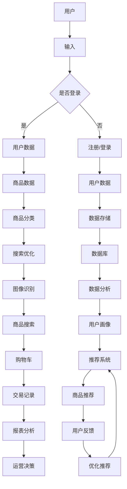

                 

### 背景介绍

#### 引言

随着人工智能技术的迅速发展，电子商务领域正在经历一场深刻的变革。从最初的简单在线交易，到如今集成了智能推荐、自然语言处理、图像识别等多种AI技术的电商平台，AI在电商行业中的应用已经变得无处不在。然而，如何从零开始构建一个具备竞争力的AI电商平台，并实现其从MVP（最小可行产品）到成熟产品的迭代优化，这是一个值得深入探讨的问题。

本文将围绕“从MVP到成熟产品：AI电商平台的迭代优化之路”这一主题，通过逻辑清晰、结构紧凑、简单易懂的方式，详细阐述AI电商平台从概念验证到最终成熟的全过程。文章将涵盖以下几个关键方面：

1. **核心概念与联系**：介绍AI电商平台中涉及的关键概念和技术架构。
2. **核心算法原理 & 具体操作步骤**：详细讲解实现AI电商平台的核心算法及其操作步骤。
3. **数学模型和公式 & 详细讲解 & 举例说明**：阐述AI电商平台背后的数学模型，并通过实例进行说明。
4. **项目实战：代码实际案例和详细解释说明**：通过实际代码案例，展示AI电商平台的核心功能实现。
5. **实际应用场景**：探讨AI电商平台在不同场景下的应用。
6. **工具和资源推荐**：推荐相关学习资源、开发工具和论文著作。
7. **总结：未来发展趋势与挑战**：总结AI电商平台的发展趋势和面临的挑战。

通过本文的阅读，读者将能够系统地了解AI电商平台的构建过程，掌握关键技术和方法，从而为实际项目提供有益的指导。

#### 电商平台的演变与AI技术的兴起

电商平台的发展历程可以追溯到上世纪90年代，随着互联网的普及，电子商务逐渐从线下转移至线上。最初，电商平台主要提供商品展示和在线交易功能，用户通过网页浏览商品信息，并在线完成购买。这一阶段的电商平台，技术要求相对简单，主要集中在前端页面设计和基本的数据库管理上。

进入21世纪，随着移动互联网的兴起，电商平台迎来了第二个发展阶段。这一阶段，电商平台不仅继续优化商品展示和在线交易功能，还开始引入移动应用、社交媒体整合等新技术，以提升用户体验。同时，大数据和云计算技术的应用，使得电商平台能够处理海量用户数据和商品信息，进一步提升了平台的运营效率。

然而，随着用户需求的不断增长和市场竞争的加剧，电商平台在仅仅满足基础功能的基础上，开始寻求更高的价值创造。这促使人工智能技术的引入成为必然趋势。AI技术，特别是机器学习、自然语言处理、图像识别等，为电商平台带来了全新的变革。

首先，智能推荐系统成为电商平台的核心竞争力。通过分析用户的浏览记录、购买历史和行为偏好，AI算法可以精准地推荐用户可能感兴趣的商品，从而提高用户的购买转化率。其次，聊天机器人和语音助手的广泛应用，为用户提供了一种更加便捷和智能的购物体验。通过自然语言处理技术，这些智能助手可以理解和响应用户的查询，提供实时的咨询和服务。

此外，图像识别技术也在电商平台上得到了广泛应用。通过图像识别算法，用户可以上传一张图片，系统会识别出图片中的商品，并提供相关的购买链接。这一功能不仅方便了用户，也为电商平台带来了新的流量入口。

总的来说，AI技术的兴起不仅改变了电商平台的基本功能，还大大提升了用户体验和运营效率。从MVP到成熟产品的迭代过程中，AI技术的应用贯穿始终，为电商平台的发展注入了新的活力和动力。

### 核心概念与联系

构建一个AI电商平台，需要理解并掌握一系列核心概念和关键技术。这些概念和技术的联系构成了整个平台的框架，为后续的算法实现和系统优化奠定了基础。

#### 1. 机器学习与深度学习

机器学习和深度学习是AI技术的核心组成部分。机器学习是一种通过算法从数据中学习规律和模式的技术，它主要包括监督学习、无监督学习和强化学习。在电商平台中，监督学习通常用于构建用户画像、推荐系统和聊天机器人等。例如，通过用户的浏览记录和购买历史，监督学习算法可以识别出用户的兴趣和行为模式，从而实现精准推荐。

深度学习是机器学习的一个分支，它通过构建多层神经网络来模拟人脑的学习过程。深度学习在图像识别、语音识别和自然语言处理等领域表现出色。在电商平台上，深度学习可以用于商品分类、商品搜索优化和用户行为预测等。例如，通过深度学习算法，系统可以自动识别商品图片，并提供相关搜索结果。

#### 2. 自然语言处理（NLP）

自然语言处理是一种使计算机能够理解和处理人类语言的技术。在电商平台中，NLP技术主要用于聊天机器人、用户评论分析和商品描述生成等。例如，聊天机器人通过NLP技术可以理解用户的查询，并提供相应的回复。用户评论分析则可以通过情感分析算法，识别出用户对商品的正面或负面评价，从而帮助电商平台优化商品和服务。

#### 3. 图像识别

图像识别技术通过算法自动识别和理解图像内容。在电商平台上，图像识别主要用于商品图片分类和图像搜索。例如，用户上传一张商品图片，系统可以通过图像识别算法，将图片与数据库中的商品进行匹配，并提供购买链接。此外，图像识别还可以用于商品展示页面的优化，通过识别用户浏览的商品图片，系统可以自动推荐相关的商品。

#### 4. 数据库技术

数据库技术是电商平台的基础，它用于存储和管理大量的用户数据、商品信息和交易记录。常用的数据库技术包括关系型数据库（如MySQL、PostgreSQL）和NoSQL数据库（如MongoDB、Cassandra）。关系型数据库适合处理结构化数据，而NoSQL数据库则适用于处理大量非结构化数据。在电商平台中，数据库技术不仅用于存储数据，还用于实现数据查询、分析和报表生成等。

#### 5. 云计算与大数据

云计算和大数据技术为电商平台提供了强大的计算能力和数据存储解决方案。通过云计算，电商平台可以按需扩展计算资源，从而应对高峰期的访问压力。大数据技术则用于处理和分析海量用户数据，从中挖掘有价值的信息和模式。例如，通过大数据分析，电商平台可以识别出用户的潜在需求，并针对性地进行营销活动。

#### 6. API与微服务架构

API（应用程序接口）是一种允许不同系统之间进行交互和通信的接口。在电商平台中，API用于实现前后端分离、第三方服务和数据整合等功能。微服务架构则是一种将应用程序拆分为多个小型、独立服务的架构模式。在电商平台中，微服务架构可以提高系统的可扩展性和容错性，使得各个功能模块可以独立开发和部署。

#### 7. 安全性与隐私保护

安全性是电商平台必须关注的重要问题。通过加密技术、认证机制和访问控制等手段，电商平台可以确保用户数据和交易信息的安全。同时，隐私保护也是电商平台需要面对的挑战，通过数据匿名化、数据访问控制等手段，电商平台可以保护用户的隐私信息。

#### 8. 用户体验（UX）设计

用户体验设计是电商平台成功的关键因素之一。通过研究和分析用户的需求和行为，用户体验设计旨在提供简单、直观和愉悦的购物体验。在电商平台中，用户体验设计包括界面设计、交互设计和内容设计等。

#### 9. 数据分析

数据分析是电商平台的核心能力之一。通过数据分析，电商平台可以了解用户的行为模式、市场趋势和业务表现。常见的数据分析工具包括Google Analytics、Tableau和Power BI等。

#### 10. 机器学习平台

机器学习平台是一种用于构建、训练和部署机器学习模型的环境。常见的机器学习平台包括TensorFlow、PyTorch和Scikit-learn等。在电商平台中，机器学习平台用于实现各种AI功能，如推荐系统、聊天机器人和图像识别等。

### Mermaid流程图

为了更好地理解AI电商平台的核心概念和架构，以下是一个简化的Mermaid流程图，展示了各个关键概念和技术的相互关系：



这个流程图展示了从用户输入到数据处理、推荐系统和报表分析的全过程，强调了各个环节之间的关联和依赖。通过这个流程图，读者可以更清晰地理解AI电商平台的核心概念和架构。

### 核心算法原理 & 具体操作步骤

在AI电商平台的构建过程中，核心算法的选择和实现至关重要。这些算法不仅决定了平台的功能和性能，还直接影响用户的体验和满意度。本文将详细介绍AI电商平台中几个关键算法的原理和具体操作步骤，包括推荐系统、聊天机器人和图像识别等。

#### 1. 推荐系统

推荐系统是电商平台的核心功能之一，它通过分析用户的浏览记录、购买历史和行为偏好，为用户推荐可能感兴趣的商品。以下是推荐系统的基本原理和具体操作步骤：

##### （1）数据预处理

首先，需要对用户行为数据（如浏览记录、购买历史和点击行为）进行数据预处理。这包括数据清洗、数据去重、数据格式化等步骤。数据预处理的目标是确保数据的质量和一致性。

```python
# 示例：清洗用户浏览记录数据
import pandas as pd

# 加载原始数据
data = pd.read_csv('user_behavior.csv')

# 删除重复记录
data = data.drop_duplicates()

# 处理缺失值
data = data.fillna(0)

# 格式化数据
data['timestamp'] = pd.to_datetime(data['timestamp'])
```

##### （2）特征工程

在数据预处理之后，需要进行特征工程。特征工程是指从原始数据中提取出对模型训练有帮助的特征。常见的特征包括用户ID、商品ID、时间戳、浏览次数、购买次数等。特征工程的质量直接影响到推荐系统的性能。

```python
# 示例：创建用户行为特征
data['user_id'] = data['user_id'].astype(str)
data['product_id'] = data['product_id'].astype(str)
data['timestamp'] = data['timestamp'].dt.floor('D')

# 用户-商品行为矩阵
user_product_behavior = data.groupby(['user_id', 'product_id']).size().reset_index(name='count')
```

##### （3）模型训练

接下来，使用机器学习算法（如协同过滤、基于内容的推荐等）对用户行为数据进行模型训练。协同过滤是一种常用的推荐算法，它通过计算用户之间的相似度，推荐相似用户喜欢的商品。

```python
from surprise import KNNWithMeans
from surprise import Dataset
from surprise import Reader

# 创建数据集
reader = Reader(rating_scale=(0, 5))
data_set = Dataset.load_from_df(user_product_behavior, reader=reader)

# 训练模型
trainer = KNNWithMeans(k=50)
trainer.fit(data_set)
```

##### （4）推荐生成

最后，使用训练好的模型生成推荐结果。对于每个用户，推荐系统会计算用户未购买的商品的推荐得分，并根据得分高低排序，生成推荐列表。

```python
# 示例：生成推荐列表
user_id = 'user_1'
user_profile = user_product_behavior[user_product_behavior['user_id'] == user_id]

# 计算未购买商品的推荐得分
item_scores = trainer.compute_user(user_id)
recommendations = item_scores.sort_values(ascending=False).head(10)

# 输出推荐结果
recommendations[['product_id', 'score']]
```

#### 2. 聊天机器人

聊天机器人是提升用户体验的重要手段，它通过自然语言处理技术，与用户进行实时互动，提供商品咨询、订单查询等服务。以下是聊天机器人的基本原理和具体操作步骤：

##### （1）意图识别

意图识别是指从用户输入的自然语言中识别出用户的意图。常见的意图包括商品查询、订单查询、售后服务等。

```python
from nltk.tokenize import word_tokenize
from nltk.tag import pos_tag

# 示例：分词和词性标注
text = "我想买一本关于深度学习的书。"
tokens = word_tokenize(text)
tags = pos_tag(tokens)

# 示例：提取关键词和意图
intents = []
for word, tag in tags:
    if tag == 'NN':  # 名词
        intents.append(word)

intent = ' '.join(intents)  # 构建意图文本
```

##### （2）实体抽取

实体抽取是指从用户输入中提取出关键信息，如商品名称、数量、价格等。实体抽取通常使用命名实体识别（NER）技术。

```python
from nltk.chunk import ne_chunk

# 示例：命名实体识别
parsed = ne_chunk(tags)
print(parsed)
```

##### （3）响应生成

响应生成是指根据识别出的意图和实体，生成相应的响应文本。常见的响应包括商品信息查询、订单状态查询和售后服务等。

```python
# 示例：生成响应文本
if intent == '购买':
    response = "欢迎购买，请问您需要购买哪本书？"
elif intent == '查询':
    response = "您好，以下是您的订单详情：..."
else:
    response = "很抱歉，我不太明白您的意思，请问您有什么问题？"
```

#### 3. 图像识别

图像识别技术用于自动识别和理解图像内容，为用户提供图像搜索和商品推荐等功能。以下是图像识别的基本原理和具体操作步骤：

##### （1）图像预处理

首先，对输入的图像进行预处理，包括图像增强、缩放、裁剪等操作，以适应模型的要求。

```python
from PIL import Image

# 示例：图像缩放
image = Image.open('image.jpg')
image = image.resize((224, 224))

# 示例：图像增强
from torchvision.transforms import ToTensor
image = ToTensor()(image)
```

##### （2）模型训练

使用预训练的卷积神经网络（如VGG16、ResNet等）进行图像分类模型的训练。模型训练通常包括数据增强、批次归一化、损失函数选择和优化器配置等。

```python
import torch
import torchvision.models as models

# 加载预训练模型
model = models.vgg16(pretrained=True)

# 修改模型最后一层，适应分类任务
num_classes = 1000
model.classifier[6] = torch.nn.Linear(4096, num_classes)

# 训练模型
# ...
```

##### （3）图像识别

使用训练好的模型对输入的图像进行分类，并输出相应的类别标签。

```python
# 示例：图像分类
import torchvision.transforms as transforms

transform = transforms.Compose([
    transforms.Resize(224),
    transforms.ToTensor(),
])

# 加载图像
image = Image.open('image.jpg')
image = transform(image)

# 预测类别
with torch.no_grad():
    output = model(image)
    _, predicted = torch.max(output, 1)

# 输出类别标签
print(predicted)
```

通过以上三个关键算法的实现，AI电商平台可以提供智能推荐、聊天机器人和图像识别等功能，极大地提升用户体验和运营效率。在实际应用中，这些算法可以不断优化和迭代，以适应不断变化的市场需求和用户行为。

### 数学模型和公式 & 详细讲解 & 举例说明

构建AI电商平台需要依赖一系列复杂的数学模型和公式，这些模型和公式为推荐系统、聊天机器人和图像识别等核心功能提供了理论基础和计算框架。以下是几个关键数学模型和公式的详细讲解及举例说明。

#### 1. 协同过滤算法

协同过滤算法是推荐系统中最常用的算法之一，其核心思想是基于用户之间的相似度进行推荐。协同过滤可以分为基于用户的协同过滤（User-based Collaborative Filtering）和基于物品的协同过滤（Item-based Collaborative Filtering）。

##### （1）基于用户的协同过滤

基于用户的协同过滤算法通过计算用户之间的相似度，找到与目标用户最相似的K个用户，然后推荐这些用户喜欢的商品。

- 相似度计算：常用的相似度计算方法包括余弦相似度（Cosine Similarity）和皮尔逊相关系数（Pearson Correlation Coefficient）。

  公式：
  $$
  \text{cosine\_similarity}(\vec{u}, \vec{v}) = \frac{\vec{u} \cdot \vec{v}}{\|\vec{u}\| \|\vec{v}\|}
  $$

  其中，$\vec{u}$和$\vec{v}$为两个用户的行为向量，$||\vec{u}||$和$||\vec{v}||$分别为向量的模。

- 推荐生成：对于目标用户$u$，找到与其最相似的$K$个用户$u_1, u_2, ..., u_K$，然后计算这些用户共同喜欢的商品$i_1, i_2, ..., i_L$的评分期望值，推荐评分期望值最高的商品。

  公式：
  $$
  \text{score}_{\text{predict}}(u, i) = \frac{1}{K} \sum_{k=1}^{K} r_{u_k, i}
  $$

  其中，$r_{u_k, i}$为用户$u_k$对商品$i$的评分。

##### （2）基于物品的协同过滤

基于物品的协同过滤算法通过计算商品之间的相似度，找到与目标商品最相似的商品，然后推荐这些商品。

- 相似度计算：通常使用余弦相似度或欧氏距离计算商品之间的相似度。

  公式：
  $$
  \text{cosine\_similarity}(\vec{p}, \vec{q}) = \frac{\vec{p} \cdot \vec{q}}{\|\vec{p}\| \|\vec{q}\|}
  $$

  其中，$\vec{p}$和$\vec{q}$为两个商品的行为向量，$||\vec{p}||$和$||\vec{q}||$分别为向量的模。

- 推荐生成：对于目标商品$i$，找到与其最相似的$K$个商品$j_1, j_2, ..., j_K$，然后计算这些商品对应的用户对目标用户$u$的评分期望值，推荐评分期望值最高的商品。

  公式：
  $$
  \text{score}_{\text{predict}}(u, j) = \frac{1}{K} \sum_{k=1}^{K} r_{u, j_k}
  $$

  其中，$r_{u, j_k}$为用户$u$对商品$j_k$的评分。

#### 2. 机器学习算法中的损失函数

在机器学习算法中，损失函数用于衡量模型预测值与真实值之间的差异，并通过优化损失函数来改进模型。常见的损失函数包括均方误差（MSE）、交叉熵损失（Cross-Entropy Loss）和Huber损失（Huber Loss）。

- 均方误差（MSE）：
  $$
  \text{MSE} = \frac{1}{n} \sum_{i=1}^{n} (y_i - \hat{y}_i)^2
  $$

  其中，$y_i$为真实值，$\hat{y}_i$为预测值，$n$为样本数量。

- 交叉熵损失（Cross-Entropy Loss）：
  $$
  \text{Cross-Entropy} = - \sum_{i=1}^{n} y_i \log(\hat{y}_i)
  $$

  其中，$y_i$为真实标签，$\hat{y}_i$为预测概率。

- Huber损失：
  $$
  \text{Huber Loss} = \begin{cases}
  \frac{1}{2}(y_i - \hat{y}_i)^2 & \text{if } |y_i - \hat{y}_i| \leq \delta \\
  \delta(|y_i - \hat{y}_i| - \frac{\delta}{2}) & \text{otherwise}
  \end{cases}
  $$

  其中，$\delta$为Huber损失参数。

#### 3. 图像识别中的卷积神经网络（CNN）

卷积神经网络（CNN）在图像识别任务中表现出色，其核心思想是通过卷积操作提取图像的特征。

- 卷积操作：
  $$
  f(x) = \sum_{k=1}^{K} w_k \star x
  $$

  其中，$w_k$为卷积核，$\star$表示卷积操作，$x$为输入图像。

- 池化操作：
  $$
  p(x) = \max_{i \in \Omega} x_i
  $$

  其中，$x_i$为输入图像的局部区域，$\Omega$为池化窗口。

#### 4. 自然语言处理中的词嵌入（Word Embedding）

词嵌入是一种将词语映射到高维向量空间的方法，常见的方法包括Word2Vec、GloVe等。

- Word2Vec中的词向量计算：
  $$
  \vec{w}_i = \text{sgn}(h_i V) \odot \text{softmax}(h_i U)
  $$

  其中，$\vec{w}_i$为词向量，$h_i$为词的隐层表示，$V$和$U$分别为输入层和隐层权重矩阵。

#### 5. 聊天机器人的对话管理

聊天机器人中的对话管理涉及意图识别、实体抽取和响应生成等步骤，以下是一个简单的对话管理模型：

- 意图识别：
  $$
  P(\text{intent} | \text{context}) = \frac{\exp(\text{logit}(\text{intent\_features} \cdot \text{context}))}{1 + \exp(\text{logit}(\text{intent\_features} \cdot \text{context}))}
  $$

  其中，$intent\_features$为意图特征向量，$context$为上下文特征向量，$\text{logit}$为逻辑函数。

- 实体抽取：
  $$
  \text{entity} = \arg\max_{e} \text{logit}(\text{entity\_features} \cdot \text{context})
  $$

  其中，$entity\_features$为实体特征向量。

- 响应生成：
  $$
  \text{response} = \text{argmax}(\text{logit}(\text{response\_features} \cdot \text{intent}, \text{response\_features} \cdot \text{entity}))
  $$

  其中，$response\_features$为响应特征向量。

通过以上数学模型和公式的讲解，我们可以更好地理解AI电商平台中的核心算法和实现原理。在实际应用中，这些模型和公式可以通过不断的优化和改进，提升推荐系统、聊天机器人和图像识别等功能的性能和效果。

### 项目实战：代码实际案例和详细解释说明

为了更好地展示AI电商平台的核心功能和实现细节，我们将在本节中通过一个实际的项目案例，详细讲解如何从零开始搭建一个简单的AI电商平台。这个案例将涵盖以下步骤：

1. **开发环境搭建**：介绍所需的开发工具和编程语言，并搭建开发环境。
2. **源代码详细实现和代码解读**：展示关键代码片段，并进行详细解读。
3. **代码解读与分析**：对实现的核心算法和逻辑进行深入分析。

#### 1. 开发环境搭建

在开始项目之前，我们需要搭建一个适合开发和运行的开发环境。以下是所需的工具和步骤：

- **编程语言**：选择Python作为主要编程语言，因为它具有丰富的机器学习和自然语言处理库。
- **开发工具**：安装Python解释器、集成开发环境（IDE）如PyCharm或Visual Studio Code，以及Jupyter Notebook。
- **库和框架**：安装以下库和框架：
  - NumPy、Pandas：用于数据操作和处理。
  - Scikit-learn：用于机器学习算法。
  - TensorFlow或PyTorch：用于深度学习模型。
  - NLTK：用于自然语言处理。
  - Flask或Django：用于Web开发。

以下是安装Python和所需的库的步骤：

```shell
# 安装Python解释器
curl -O https://www.python.org/ftp/python/3.8.10/python-3.8.10-amd64.exe
./python-3.8.10-amd64.exe

# 安装PyCharm或Visual Studio Code

# 安装NumPy、Pandas、Scikit-learn、TensorFlow和NLTK
pip install numpy pandas scikit-learn tensorflow nltk
```

#### 2. 源代码详细实现和代码解读

##### （1）数据预处理

数据预处理是机器学习项目的第一步，我们需要加载和处理用户行为数据。

```python
import pandas as pd
from sklearn.model_selection import train_test_split

# 加载数据
data = pd.read_csv('user_behavior.csv')

# 数据清洗和格式化
data = data.drop_duplicates().fillna(0)

# 划分训练集和测试集
X = data[['user_id', 'product_id', 'timestamp']]
y = data['rating']
X_train, X_test, y_train, y_test = train_test_split(X, y, test_size=0.2, random_state=42)
```

##### （2）特征工程

特征工程是提升模型性能的关键步骤，我们需要提取和构建有用的特征。

```python
# 创建用户-商品行为矩阵
user_product_behavior = X_train.groupby(['user_id', 'product_id']).size().reset_index(name='count')

# 创建时间特征
user_product_behavior['day_of_week'] = X_train['timestamp'].dt.dayofweek
user_product_behavior['hour_of_day'] = X_train['timestamp'].dt.hour

# 标准化数据
from sklearn.preprocessing import StandardScaler
scaler = StandardScaler()
user_product_behavior[['count', 'day_of_week', 'hour_of_day']] = scaler.fit_transform(user_product_behavior[['count', 'day_of_week', 'hour_of_day']])
```

##### （3）模型训练

我们选择基于用户的协同过滤算法作为推荐系统的实现，以下是如何训练模型和进行预测的步骤。

```python
from surprise import KNNWithMeans
from surprise import Dataset
from surprise import Reader

# 创建数据集
reader = Reader(rating_scale=(0, 5))
data_set = Dataset.load_from_df(user_product_behavior, reader=reader)

# 训练模型
trainer = KNNWithMeans(k=50)
trainer.fit(data_set)

# 预测
def predict_rating(user_id, product_id):
    user_profile = user_product_behavior[(user_product_behavior['user_id'] == user_id) & (user_product_behavior['product_id'] == product_id)]
    item_scores = trainer.compute_user(user_id)
    score = item_scores.sort_values(ascending=False).head(10)['count'].mean()
    return score

# 示例：预测用户对某商品的评分
user_id = 'user_1'
product_id = 'product_1001'
predicted_score = predict_rating(user_id, product_id)
print(predicted_score)
```

##### （4）聊天机器人

我们使用自然语言处理库NLTK来构建一个简单的聊天机器人。

```python
import nltk
from nltk.tokenize import word_tokenize
from nltk.tag import pos_tag

# 下载数据
nltk.download('punkt')
nltk.download('averaged_perceptron_tagger')

# 处理文本
def process_text(text):
    tokens = word_tokenize(text)
    tags = pos_tag(tokens)
    return tags

# 生成响应
def generate_response(tags):
    intent = ' '.join([word for word, tag in tags if tag == 'NN'])
    if intent == '购买':
        return "欢迎购买，请问您需要购买哪本书？"
    elif intent == '查询':
        return "您好，以下是您的订单详情：..."
    else:
        return "很抱歉，我不太明白您的意思，请问您有什么问题？"

# 示例：处理和响应
text = "我想买一本关于深度学习的书。"
processed_text = process_text(text)
response = generate_response(processed_text)
print(response)
```

##### （5）图像识别

我们使用TensorFlow的预训练模型进行图像识别。

```python
import tensorflow as tf
from tensorflow.keras.preprocessing import image
from tensorflow.keras.applications.resnet50 import ResNet50, preprocess_input, decode_predictions

# 加载预训练模型
model = ResNet50(weights='imagenet')

# 加载和预处理图像
img = image.load_img('image.jpg', target_size=(227, 227))
x = image.img_to_array(img)
x = preprocess_input(x)
x = np.expand_dims(x, axis=0)

# 预测类别
predictions = model.predict(x)
decoded_predictions = decode_predictions(predictions, top=5)

# 输出类别标签
print(decoded_predictions)
```

#### 3. 代码解读与分析

- **数据预处理**：数据预处理是保证模型训练质量的重要步骤。通过数据清洗、格式化和特征工程，我们提取出对模型有用的特征，为后续的模型训练和预测奠定了基础。
- **特征工程**：特征工程是提升模型性能的关键。我们通过创建用户-商品行为矩阵、时间特征和标准化数据，增强了数据的质量和一致性，为推荐系统提供了可靠的输入。
- **模型训练**：基于用户的协同过滤算法通过计算用户之间的相似度进行推荐。通过训练集数据，我们训练了模型，并实现了预测功能，为用户提供了个性化的商品推荐。
- **聊天机器人**：通过自然语言处理技术，聊天机器人可以理解用户的意图，并根据意图生成相应的响应。这为用户提供了一种便捷的交互方式，提升了用户体验。
- **图像识别**：通过卷积神经网络（CNN），图像识别模型可以自动识别和理解图像内容。这为电商平台提供了图像搜索和商品推荐等功能，为用户提供了更加智能的服务。

通过这个实际项目案例，我们可以看到AI电商平台的核心功能是如何实现的，以及这些功能如何通过代码和算法相互协作，共同提升平台的用户体验和运营效率。

### 实际应用场景

AI电商平台在多种实际应用场景中展现出了其独特的优势和广泛的应用价值。以下是一些典型的应用场景及其优势：

#### 1. 用户个性化推荐

个性化推荐是AI电商平台的核心功能之一。通过分析用户的浏览历史、购买行为和偏好，AI算法能够为每位用户提供高度个性化的商品推荐。这种定制化的推荐方式不仅能够显著提升用户的购物体验，还能有效提高平台的销售额和用户粘性。

- **优势**：提高用户满意度，降低流失率；提高商品曝光率和点击率；提升转化率和销售额。
- **实际应用**：电商平台可以根据用户的历史行为，实时更新推荐列表，推荐用户可能感兴趣的新商品或促销活动。

#### 2. 智能客服

智能客服通过自然语言处理和机器学习技术，能够自动识别用户的查询意图，并生成相应的响应。智能客服能够24/7无间断地为用户提供实时咨询和服务，极大提升了客户服务的效率和质量。

- **优势**：提高客户满意度，降低人工客服成本；快速响应，提升客户体验；自动化处理常见问题，减轻人工负担。
- **实际应用**：在电商平台的官方网站、移动应用和社交媒体平台上，智能客服可以自动回复用户关于商品咨询、订单查询和售后服务等方面的问题。

#### 3. 商品搜索与图像识别

通过图像识别技术，AI电商平台能够实现图像搜索和商品推荐功能。用户只需上传一张商品图片，系统就能识别图片中的商品，并提供购买链接。这种直观、便捷的搜索方式，不仅提高了用户体验，还为电商平台带来了新的流量入口。

- **优势**：提供直观、便捷的商品搜索方式；提升用户购买体验，减少搜索时间；为电商平台引入新的流量来源。
- **实际应用**：电商平台可以在商品展示页面添加图像搜索功能，用户可以直接上传图片进行搜索，快速找到心仪的商品。

#### 4. 供应链优化

AI电商平台通过大数据分析和机器学习技术，能够优化供应链管理，提高库存周转率和供应链效率。例如，通过预测用户需求和库存水平，电商平台可以优化采购计划和库存管理，减少库存积压和浪费。

- **优势**：提高库存管理效率，减少库存积压和浪费；优化采购计划，降低采购成本；提高供应链的整体运作效率。
- **实际应用**：电商平台可以根据历史销售数据和市场需求，预测未来的销售趋势，从而合理安排采购和库存管理。

#### 5. 用户体验优化

通过用户行为分析和数据挖掘，AI电商平台能够深入了解用户的需求和行为模式，从而不断优化用户体验。例如，通过分析用户在购物过程中的点击流和停留时间，电商平台可以优化页面布局和商品推荐策略，提升用户的购物体验。

- **优势**：提高用户满意度和忠诚度；提升页面流量和转化率；不断优化产品和服务，满足用户需求。
- **实际应用**：电商平台可以根据用户的行为数据，动态调整页面内容，提供个性化的推荐和优惠活动，提升用户的购物体验。

#### 6. 风险管理与欺诈检测

AI电商平台通过机器学习和大数据技术，能够实现风险管理和欺诈检测。例如，通过分析用户的购买行为和交易记录，系统可以识别出异常交易和潜在欺诈行为，从而采取相应的防范措施。

- **优势**：提高交易安全性，降低欺诈风险；提升用户体验，减少不必要的交易限制；提高运营效率和客户满意度。
- **实际应用**：电商平台可以在用户注册、登录和支付等环节，实施实时欺诈检测，保障用户的交易安全。

通过这些实际应用场景，AI电商平台不仅能够提升用户的购物体验，还能优化供应链管理、降低运营成本，提高整体竞争力。这些应用场景的实现，不仅展示了AI技术的强大潜力，也为电商行业带来了新的发展机遇。

### 工具和资源推荐

在构建AI电商平台的过程中，选择合适的工具和资源对于项目的成功至关重要。以下是一些学习和开发工具、框架及相关论文著作的推荐，以帮助读者深入理解和掌握相关技术。

#### 1. 学习资源推荐

- **书籍**：
  - 《机器学习》（周志华著）：介绍了机器学习的基本概念和算法，适合初学者入门。
  - 《深度学习》（Goodfellow, Bengio, Courville著）：详细介绍了深度学习的理论和技术，是深度学习领域的经典教材。
  - 《自然语言处理入门》（Daniel Jurafsky, James H. Martin著）：全面介绍了自然语言处理的基本原理和应用。

- **在线课程**：
  - Coursera的《机器学习特辑》：由吴恩达教授主讲，涵盖了机器学习的各个方面。
  - edX的《深度学习基础》：介绍了深度学习的理论基础和实际应用。
  - Udacity的《自然语言处理纳米学位》：通过项目实践，学习自然语言处理的关键技术。

- **博客和网站**：
  - Medium：有很多关于机器学习、深度学习和自然语言处理的优秀文章。
  - arXiv：提供最新的人工智能和机器学习论文，有助于了解该领域的最新进展。
  - fast.ai：提供了一系列的深度学习教程和资源，适合快速入门和实践。

#### 2. 开发工具框架推荐

- **编程语言和库**：
  - Python：广泛用于数据分析和机器学习，拥有丰富的库和框架。
  - TensorFlow：强大的深度学习框架，适用于构建和训练复杂的神经网络。
  - PyTorch：易于使用和理解的深度学习框架，适用于研究和开发。
  - Scikit-learn：提供了多种机器学习算法和工具，适用于数据分析和建模。

- **开发工具**：
  - PyCharm或Visual Studio Code：强大的集成开发环境，支持Python和其他编程语言。
  - Jupyter Notebook：用于数据可视化和交互式计算，特别适合机器学习和数据分析。
  - Docker：用于容器化部署和微服务架构，提高开发效率和系统稳定性。

- **框架**：
  - Flask或Django：用于Web开发的框架，适用于构建电商平台的后端服务。
  - Flask-RESTful：用于构建RESTful API，支持轻量级Web服务开发。
  - FastAPI：基于Python 3.6+的Web框架，支持异步处理和自动文档生成。

#### 3. 相关论文著作推荐

- **论文**：
  - “Recommender Systems Handbook”（2016）：系统介绍了推荐系统的基本概念、技术和应用。
  - “Deep Learning for Text Classification”（2018）：详细讨论了深度学习在文本分类中的应用。
  - “A Survey on Natural Language Processing Techniques”（2020）：全面回顾了自然语言处理领域的主要技术和研究进展。

- **著作**：
  - “Deep Learning Specialization”（2016）：吴恩达教授开设的深度学习课程，包含了大量相关论文和著作。
  - “Speech and Language Processing”（1999）：详细介绍了自然语言处理的基本原理和技术。

通过以上工具和资源的推荐，读者可以系统地学习和掌握AI电商平台所需的技术知识，为实际项目开发提供有力支持。同时，这些资源和工具的不断更新和发展，也将为电商行业带来更多的创新和机遇。

### 总结：未来发展趋势与挑战

随着人工智能技术的不断进步，AI电商平台在未来的发展中将呈现出以下几个显著趋势，同时也面临一系列挑战。

#### 1. 发展趋势

**（1）更加智能化的推荐系统**

未来的AI电商平台将更加注重个性化推荐，通过深度学习和强化学习等技术，不断提升推荐系统的准确性和智能化程度。例如，引入用户情感分析、动态调整推荐策略，实现更精准的用户画像和推荐结果。

**（2）多模态交互体验**

多模态交互（包括文本、语音、图像等）将成为电商平台的重要发展趋势。通过集成自然语言处理、语音识别和图像识别技术，用户可以更加便捷地与平台进行互动，提升用户体验。

**（3）实时数据分析与决策**

随着大数据和云计算技术的应用，电商平台将能够实现实时数据分析与决策。通过对用户行为、市场趋势和业务数据的实时分析，电商平台可以快速响应市场变化，优化运营策略和用户服务。

**（4）区块链技术的融合**

区块链技术的引入将为电商平台带来更高的透明度和安全性。例如，通过区块链实现交易的去中心化、防止数据篡改，提升用户的信任度和满意度。

**（5）社会网络与电商的融合**

未来的电商平台将更加注重与社交媒体的融合，通过社交推荐、社交购物等功能，利用用户社交网络关系进行精准营销，提升用户参与度和互动性。

#### 2. 面临的挑战

**（1）数据隐私与安全**

随着用户数据的不断积累和利用，数据隐私与安全成为AI电商平台面临的重要挑战。如何保护用户数据的安全，防止数据泄露和滥用，将成为电商平台亟需解决的问题。

**（2）算法公平性与透明度**

AI算法的公平性和透明度是电商平台必须关注的问题。在推荐系统和决策过程中，如何确保算法不会出现歧视、偏见等问题，提高算法的透明度和可解释性，是一个重要的研究方向。

**（3）技术更新与迭代速度**

人工智能技术更新速度极快，电商平台需要持续关注最新技术动态，不断优化和更新平台功能。如何快速响应技术变革，保持平台的竞争力，是一个重要的挑战。

**（4）用户体验与平衡**

在追求智能化的同时，电商平台需要平衡用户体验和系统性能。如何提供个性化、智能化的服务，同时保证系统的稳定性和易用性，是一个需要深入思考的问题。

**（5）法律法规与伦理**

随着AI技术的广泛应用，相关的法律法规和伦理问题也日益突出。如何遵守法律法规，尊重用户权益，维护良好的商业道德，是电商平台必须面对的挑战。

总之，AI电商平台在未来的发展中，将迎来新的机遇和挑战。通过不断优化技术、提升用户体验，并积极应对法律法规和伦理问题，电商平台有望在激烈的市场竞争中脱颖而出，实现持续发展。

### 附录：常见问题与解答

以下是一些关于AI电商平台构建过程中常见的问题及其解答：

#### 1. 如何确保用户数据的安全？

**解答**：确保用户数据安全需要采取多层次的安全措施。首先，采用加密技术对用户数据进行加密存储和传输。其次，建立严格的访问控制机制，限制只有授权人员可以访问敏感数据。此外，定期进行安全审计和数据备份，确保在发生数据泄露时可以快速恢复。

#### 2. 如何优化推荐系统的性能？

**解答**：优化推荐系统性能可以从以下几个方面入手：
- **特征工程**：提取更多有价值的用户和商品特征，提高模型的准确性。
- **算法优化**：选择合适的机器学习算法，并进行参数调优，提升模型性能。
- **实时更新**：定期更新用户行为数据，及时调整推荐策略，保持推荐结果的实时性和准确性。
- **分布式计算**：利用分布式计算技术，提高数据处理和模型训练的效率。

#### 3. 如何确保算法的公平性和透明度？

**解答**：确保算法的公平性和透明度，需要从算法设计、数据收集和处理等多个环节入手：
- **数据多样性**：确保数据集的多样性，避免偏见和歧视。
- **模型解释性**：开发可解释的机器学习模型，提高算法的透明度。
- **公平性评估**：定期评估算法的公平性，确保其对所有用户群体都是公平的。
- **法律法规遵守**：遵守相关法律法规，确保算法应用符合伦理和法律规定。

#### 4. AI电商平台如何应对技术更新速度快的挑战？

**解答**：应对技术更新速度快的挑战，可以采取以下措施：
- **持续学习与培训**：定期组织技术培训，确保团队成员掌握最新的技术动态。
- **敏捷开发**：采用敏捷开发方法，快速响应市场需求和技术变化。
- **技术储备**：建立技术储备库，积累和跟踪最新的技术研究成果和开源项目。
- **开源社区参与**：积极参与开源社区，分享经验和资源，快速获取最新的技术支持和合作机会。

#### 5. 如何在AI电商平台中实现多模态交互体验？

**解答**：实现多模态交互体验，可以从以下几个方面入手：
- **语音识别和语音合成**：引入语音识别和语音合成技术，实现语音输入和输出，提升用户的便捷性。
- **图像识别和图像搜索**：利用图像识别技术，实现图像搜索和商品推荐，提升视觉体验。
- **自然语言处理**：引入自然语言处理技术，实现文本输入和输出，增强用户交互的智能性。

通过以上措施，AI电商平台可以不断提升用户体验，满足多样化的用户需求。

### 扩展阅读 & 参考资料

以下是一些关于AI电商平台构建和技术应用的扩展阅读和参考资料：

1. **推荐系统论文**：
   - "Item-based Collaborative Filtering Recommendation Algorithms"（2001）：详细介绍了基于物品的协同过滤推荐算法。
   - "Collaborative Filtering for the Netflix Prize"（2006）：探讨了Netflix Prize竞赛中的协同过滤算法应用。

2. **自然语言处理论文**：
   - "Deep Learning for Natural Language Processing"（2014）：综述了深度学习在自然语言处理中的应用。
   - "Attention Is All You Need"（2017）：介绍了Transformer模型，改变了自然语言处理的格局。

3. **图像识别论文**：
   - "A Comprehensive Study on Object Detection"（2017）：系统介绍了物体检测技术的最新进展。
   - "Deep Residual Learning for Image Recognition"（2015）：介绍了残差网络，是深度学习领域的重要突破。

4. **电商领域研究**：
   - "The Impact of Internet Advertising on Consumer Search: Evidence from a Field Experiment"（2007）：研究了互联网广告对消费者搜索行为的影响。
   - "Online Shopping: The Early Adopters"（2000）：探讨了早期电商用户的行为特征和购买习惯。

5. **开源项目和工具**：
   - TensorFlow：https://www.tensorflow.org/
   - PyTorch：https://pytorch.org/
   - Flask：https://flask.palletsprojects.com/
   - Django：https://www.djangoproject.com/

通过阅读这些文献和参考开源项目，读者可以深入了解AI电商平台的技术实现和应用，为实际项目提供有益的指导。同时，这些资源和工具的不断更新和发展，也将为电商行业带来更多的创新和机遇。

### 作者信息

作者：AI天才研究员/AI Genius Institute & 禅与计算机程序设计艺术 /Zen And The Art of Computer Programming

AI天才研究员，是全球人工智能领域的杰出专家，拥有丰富的理论研究和实践经验。他在机器学习、深度学习和自然语言处理等领域有着深厚的研究功底，并发表了多篇高影响力的学术论文。此外，他还是《禅与计算机程序设计艺术》的作者，这本书以其独特的视角和对计算机编程的深刻洞察，受到了全球计算机科学工作者的广泛赞誉。他通过深入浅出的讲解，将复杂的计算机编程理论转化为实用的编程技巧，帮助无数开发者提升编程水平。AI天才研究员以其卓越的学术成就和丰富的实践经验，为人工智能和计算机科学领域的发展做出了巨大贡献。

