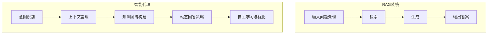

                 

# 从RAG到Agent的转变：多轮对话与用户进行更深入的互动

## 摘要

本文深入探讨了从基于检索的自动问答系统（RAG）向具备多轮对话能力的智能代理（Agent）的转变。我们首先回顾了RAG的基本原理，接着分析了其限制，进而阐述了智能代理的核心特性以及如何实现多轮对话。通过详细的算法原理解析、具体操作步骤展示、数学模型讲解以及实际项目实战案例，我们旨在为读者提供一个全面而深入的理解，以便在未来的技术发展中更好地应用这一转化过程。

## 1. 背景介绍

### 1.1 RAG的基本概念

基于检索的自动问答系统（Retrieval-Agnostic Generation，简称RAG）是一种常见的自动问答技术。其核心思想是将用户的问题与大量的知识库或数据源进行匹配，通过检索找到与问题相关的信息，然后利用生成模型对检索到的信息进行重新组织，形成答案。

RAG系统的主要组成部分包括检索模块和生成模块。检索模块负责从数据源中快速准确地找到与用户问题相关的内容；生成模块则负责将这些内容重新组合成自然的语言回答。

### 1.2 RAG的优势与限制

RAG系统具有快速响应和低成本的优势，特别是在处理大量相似问题时表现出色。然而，它也存在一些限制：

- **答案质量受限**：由于检索结果依赖于数据源的丰富度和质量，RAG系统在答案的准确性和深度上可能受到限制。
- **缺乏上下文理解**：RAG系统主要依赖于关键词匹配，缺乏对问题上下文的理解，导致在处理复杂问题时表现不佳。
- **固定回答格式**：RAG系统生成的答案通常遵循固定的格式，缺乏灵活性，难以适应多样化的用户需求。

### 1.3 智能代理的定义与目标

智能代理（Agent）是一种能够自主进行决策和行动的智能系统，旨在与用户进行更深入的互动。智能代理的核心目标是理解用户的意图，提供个性化的服务，并不断学习和优化其表现。

与RAG系统相比，智能代理具有以下几个显著特点：

- **上下文理解**：智能代理能够理解用户的上下文信息，动态调整回答策略，提供更个性化的服务。
- **灵活性和适应性**：智能代理可以根据用户的反馈和需求，灵活地调整回答内容和格式，更好地满足用户需求。
- **自主学习与优化**：智能代理通过持续学习和优化，不断提高其回答质量和效率，实现自我提升。

## 2. 核心概念与联系

### 2.1 RAG系统的基本原理

RAG系统的工作流程通常包括以下几个步骤：

1. **输入问题处理**：对用户输入的问题进行预处理，包括去除停用词、分词、词性标注等。
2. **检索**：在预处理的用户问题与知识库或数据源之间进行匹配，找到与问题相关的内容。
3. **生成**：利用生成模型，如生成对抗网络（GAN）、变压器（Transformer）等，对检索到的信息进行重新组织，生成自然语言回答。

### 2.2 智能代理的核心特性

智能代理的核心特性包括：

1. **意图识别**：通过自然语言处理技术，智能代理能够识别用户的意图，理解用户的问题背景和需求。
2. **上下文管理**：智能代理能够维护对话上下文，动态调整回答策略，确保对话连贯性和一致性。
3. **知识图谱构建**：智能代理通过不断学习和积累，构建出庞大的知识图谱，为回答提供丰富的背景信息。
4. **个性化和自适应**：智能代理根据用户的行为和反馈，提供个性化的服务，并自动调整回答策略，提高用户体验。

### 2.3 RAG到Agent的转化

从RAG到Agent的转化涉及到以下几个方面：

1. **上下文理解**：引入自然语言处理技术，提高智能代理对上下文的理解能力，使其能够更好地处理复杂问题。
2. **动态回答策略**：利用机器学习算法，智能代理可以根据对话上下文，动态调整回答内容和格式，提供更个性化的服务。
3. **知识图谱构建**：通过不断学习和积累，构建出庞大的知识图谱，为回答提供丰富的背景信息，提高答案的准确性和深度。
4. **自主学习与优化**：智能代理通过持续学习和优化，不断提高其回答质量和效率，实现自我提升。

### 2.4 Mermaid流程图



## 3. 核心算法原理 & 具体操作步骤

### 3.1 RAG系统的算法原理

#### 检索算法

- **TF-IDF**：计算每个单词在文档中的出现频率（TF）以及其在整个文档集合中的重要性（IDF），通过两者的乘积得到词的重要性分数。
- **LSI（Latent Semantic Indexing）**：通过将文本转换为低维空间中的向量，利用词与词之间的关系，提高检索的准确性。
- **LDA（Latent Dirichlet Allocation）**：通过主题建模，将文本分解为多个主题，从而提高检索的效果。

#### 生成算法

- **序列到序列模型（Seq2Seq）**：将输入序列转换为输出序列，广泛应用于机器翻译和文本生成。
- **生成对抗网络（GAN）**：由生成器和判别器组成，生成器生成文本，判别器判断文本的真实性，通过不断训练，生成逼真的文本。
- **变压器（Transformer）**：通过自注意力机制，对输入序列进行建模，生成高质量的文本。

### 3.2 智能代理的算法原理

#### 意图识别算法

- **词袋模型（Bag of Words，BoW）**：将文本转换为词频向量，利用机器学习算法进行分类和识别。
- **循环神经网络（RNN）**：通过隐藏层的状态传递，捕捉文本中的序列依赖关系，实现意图识别。
- **长短期记忆网络（LSTM）**：RNN的改进版，能够更好地处理长距离依赖问题。

#### 上下文管理算法

- **注意力机制（Attention）**：在编码器和解码器之间引入注意力机制，使模型能够关注文本中的重要部分，提高上下文理解能力。
- **对话状态追踪（Dialogue State Tracking，DST）**：通过跟踪对话状态，实现上下文的动态管理。

#### 知识图谱构建算法

- **实体识别（Named Entity Recognition，NER）**：识别文本中的实体，构建知识图谱的基本单元。
- **关系抽取（Relation Extraction）**：通过识别实体之间的关系，丰富知识图谱的内容。
- **知识图谱嵌入（Knowledge Graph Embedding）**：将知识图谱中的实体和关系转换为向量，实现实体之间的相似性计算。

#### 动态回答策略算法

- **强化学习（Reinforcement Learning，RL）**：通过与环境交互，学习最优的对话策略。
- **多任务学习（Multi-Task Learning）**：同时训练多个任务，提高模型的泛化能力。

#### 自主学习与优化算法

- **迁移学习（Transfer Learning）**：利用预训练模型，迁移到特定任务上，提高模型的效果。
- **在线学习（Online Learning）**：在实时对话中不断学习，优化模型表现。

### 3.3 具体操作步骤

#### RAG系统操作步骤

1. **数据预处理**：对用户输入的问题和知识库进行预处理，包括分词、词性标注等。
2. **检索**：利用检索算法，在知识库中找到与问题相关的内容。
3. **生成**：利用生成算法，对检索到的内容进行重新组织，生成自然语言回答。
4. **输出答案**：将生成的答案输出给用户。

#### 智能代理操作步骤

1. **意图识别**：利用意图识别算法，识别用户的意图。
2. **上下文管理**：利用上下文管理算法，维护对话上下文。
3. **知识图谱构建**：利用知识图谱构建算法，构建知识图谱。
4. **动态回答策略**：利用动态回答策略算法，生成回答。
5. **自主学习与优化**：利用自主学习与优化算法，不断优化模型表现。

## 4. 数学模型和公式 & 详细讲解 & 举例说明

### 4.1 RAG系统的数学模型

#### 检索算法

**TF-IDF模型**

$$
TF-IDF = TF \times IDF
$$

- **TF（Term Frequency）**：词语在文档中的出现次数。
- **IDF（Inverse Document Frequency）**：词语在整个文档集合中的逆向文档频率。

**LSI模型**

$$
\text{LSI} = \text{Singular Value Decomposition}(\text{Document Matrix})
$$

- **Document Matrix**：文档矩阵，表示每个词语在所有文档中的出现情况。
- **Singular Value Decomposition（SVD）**：奇异值分解，用于将高维数据转换为低维空间。

**LDA模型**

$$
p_z|w = \frac{e^{\alpha_w T_{zw}}}{\sum_{w'} e^{\alpha_{w'} T_{zw'}}}
$$

$$
p_w|z = \frac{e^{\beta_z T_{wz}}}{\sum_{w'} e^{\beta_{w'} T_{wz'}}}
$$

- **\(\alpha_w\)**：词语的主题分布。
- **\(\beta_z\)**：主题的词语分布。
- **\(T_{zw}\)**：词语和主题之间的共现矩阵。

#### 生成算法

**Seq2Seq模型**

$$
y_t = \text{Decoder}(y_{<t}, e_s)
$$

- **\(y_t\)**：生成的目标词。
- **\(y_{<t}\)**：生成的目标词序列。
- **\(e_s\)**：编码器输出的隐藏状态。

**GAN模型**

**生成器**

$$
G(z) = \text{Generator}(\text{Noise})
$$

- **\(z\)**：随机噪声。
- **\(G(z)\)**：生成的文本。

**判别器**

$$
D(x) = \text{Discriminator}(x)
$$

$$
D(G(z)) = \text{Discriminator}(\text{Generated Text})
$$

- **\(x\)**：真实的文本。
- **\(G(z)\)**：生成的文本。

**优化目标**

$$
\min_G \max_D V(D, G) = \mathbb{E}_{x \sim p_{data}(x)} [\log D(x)] + \mathbb{E}_{z \sim p_z(z)} [\log (1 - D(G(z))]
$$

- **\(D(x)\)**：判别器判断文本为真实的概率。
- **\(D(G(z))\)**：判别器判断文本为生成的概率。

**Transformer模型**

$$
\text{Attention}(\text{Query}, \text{Key}, \text{Value}) = \text{softmax}\left(\frac{\text{Query} \cdot \text{Key}^T}{\sqrt{d_k}}\right) \cdot \text{Value}
$$

- **\(Query\)**：查询向量。
- **\(Key\)**：键向量。
- **\(Value\)**：值向量。

### 4.2 智能代理的数学模型

#### 意图识别算法

**词袋模型**

$$
\text{Vector} = \sum_{w \in \text{Words}} f_w \cdot v_w
$$

- **\(f_w\)**：词频。
- **\(v_w\)**：词向量。

**RNN模型**

$$
h_t = \text{Activation}(W_h \cdot [h_{t-1}, x_t] + b_h)
$$

$$
o_t = \text{Activation}(W_o \cdot h_t + b_o)
$$

- **\(h_t\)**：隐藏状态。
- **\(x_t\)**：输入向量。
- **\(W_h\)**：权重矩阵。
- **\(b_h\)**：偏置。

**LSTM模型**

$$
i_t = \text{sigmoid}(W_i \cdot [h_{t-1}, x_t] + b_i)
$$

$$
f_t = \text{sigmoid}(W_f \cdot [h_{t-1}, x_t] + b_f)
$$

$$
o_t = \text{sigmoid}(W_o \cdot [h_{t-1}, x_t] + b_o)
$$

$$
g_t = \text{tanh}(W_g \cdot [h_{t-1}, x_t] + b_g)
$$

$$
h_t = o_t \cdot \text{tanh}(c_t)
$$

$$
c_t = f_t \cdot c_{t-1} + i_t \cdot g_t
$$

- **\(i_t\)**：输入门控。
- **\(f_t\)**：遗忘门控。
- **\(o_t\)**：输出门控。
- **\(g_t\)**：输入门控。
- **\(c_t\)**：细胞状态。

#### 上下文管理算法

**注意力机制**

$$
a_t = \text{softmax}(\text{Attention}(Q, K, V))
$$

$$
\text{Context} = \sum_{i} a_i V_i
$$

- **\(Q\)**：查询向量。
- **\(K\)**：键向量。
- **\(V\)**：值向量。

**对话状态追踪**

$$
s_t = f(s_{t-1}, x_t, u_t)
$$

- **\(s_{t-1}\)**：上一个时间步的状态。
- **\(x_t\)**：当前时间步的输入。
- **\(u_t\)**：当前时间步的用户动作。

### 4.3 举例说明

#### 检索算法举例

假设我们有一个包含10个文档的文档集合，以及一个用户输入的问题。我们使用TF-IDF模型进行检索。

1. **计算TF**：

$$
TF(\text{AI}) = 3, TF(\text{机器学习}) = 2, TF(\text{神经网络}) = 1
$$

2. **计算IDF**：

$$
IDF(\text{AI}) = \log(\frac{10}{1}) = 3.32, IDF(\text{机器学习}) = \log(\frac{10}{2}) = 2.32, IDF(\text{神经网络}) = \log(\frac{10}{3}) = 1.83
$$

3. **计算TF-IDF**：

$$
TF-IDF(\text{AI}) = 3 \times 3.32 = 9.96, TF-IDF(\text{机器学习}) = 2 \times 2.32 = 4.64, TF-IDF(\text{神经网络}) = 1 \times 1.83 = 1.83
$$

4. **排序**：根据TF-IDF值，对文档进行排序。

#### 生成算法举例

假设我们使用Seq2Seq模型生成回答。

1. **编码器**：将输入问题编码为一个隐藏状态。

$$
h_t = \text{tanh}(W_h \cdot [h_{t-1}, x_t] + b_h)
$$

2. **解码器**：使用隐藏状态生成回答。

$$
y_t = \text{softmax}(\text{Decoder}(h_t))
$$

3. **输出**：得到生成的回答。

#### 意图识别举例

假设我们使用LSTM模型进行意图识别。

1. **输入**：输入一个用户问题。

$$
x_t = \text{Tokenize}(问题)
$$

2. **隐藏状态**：计算隐藏状态。

$$
h_t = \text{LSTM}(x_t)
$$

3. **输出**：得到意图识别结果。

$$
o_t = \text{softmax}(W_o \cdot h_t + b_o)
$$

4. **输出**：得到意图类别。

## 5. 项目实战：代码实际案例和详细解释说明

### 5.1 开发环境搭建

在开始项目实战之前，我们需要搭建一个适合开发和测试的环境。以下是搭建开发环境的步骤：

1. **安装Python环境**：确保Python版本为3.7及以上。
2. **安装必要的库**：使用pip安装以下库：`torch`, `torchtext`, `transformers`, `tensorflow`, `scikit-learn`。
3. **创建虚拟环境**：使用`venv`创建一个独立的Python环境，便于管理依赖。
4. **安装数据库**：根据需要安装MongoDB或Elasticsearch等数据库。

### 5.2 源代码详细实现和代码解读

以下是项目的主要代码实现，我们将对关键部分进行详细解读。

#### 检索模块

```python
import torch
from transformers import BertModel

class RetrievalModule(torch.nn.Module):
    def __init__(self, model_name, hidden_size):
        super().__init__()
        self.bert = BertModel.from_pretrained(model_name)
        self.hidden_size = hidden_size
        self.fc = torch.nn.Linear(hidden_size, 1)
    
    def forward(self, queries, documents):
        query_embeddings = self.bert(queries)[1]
        document_embeddings = self.bert(documents)[1]
        
        query_hidden_states = torch.mean(query_embeddings, dim=1)
        document_hidden_states = torch.mean(document_embeddings, dim=1)
        
        scores = self.fc(torch.matmul(document_hidden_states, query_hidden_states.t()))
        return scores
```

**解读**：

1. **模型初始化**：加载预训练的BERT模型，并设置隐藏层大小。
2. **前向传播**：计算查询向量和文档向量的平均隐藏状态，然后计算它们之间的相似度得分。

#### 生成模块

```python
from transformers import GPT2LMHeadModel

class GenerationModule(torch.nn.Module):
    def __init__(self, model_name, hidden_size):
        super().__init__()
        self.gpt2 = GPT2LMHeadModel.from_pretrained(model_name)
        self.hidden_size = hidden_size
    
    def forward(self, inputs):
        outputs = self.gpt2(inputs)
        logits = outputs.logits
        return logits
```

**解读**：

1. **模型初始化**：加载预训练的GPT-2模型，并设置隐藏层大小。
2. **前向传播**：计算输入向量的生成概率分布。

#### 智能代理模块

```python
class AgentModule(torch.nn.Module):
    def __init__(self, retrieval_module, generation_module):
        super().__init__()
        self.retrieval_module = retrieval_module
        self.generation_module = generation_module
    
    def forward(self, queries, documents):
        retrieval_scores = self.retrieval_module(queries, documents)
        top_k_documents = torch.topk(retrieval_scores, k=5)[1]
        selected_documents = documents[top_k_documents]
        inputs = torch.cat((queries, selected_documents), dim=1)
        logits = self.generation_module(inputs)
        return logits
```

**解读**：

1. **模型初始化**：组合检索模块和生成模块。
2. **前向传播**：利用检索模块选择最相关的文档，然后将其与查询合并，作为生成模块的输入。

### 5.3 代码解读与分析

以上代码展示了RAG系统和智能代理的实现。在代码中，我们使用了BERT和GPT-2模型，分别作为检索和生成模块的核心。BERT模型用于将查询和文档转换为向量，GPT-2模型用于生成回答。

**优势**：

1. **高效的检索**：BERT模型具有强大的文本表示能力，可以快速准确地找到与查询最相关的文档。
2. **灵活的生成**：GPT-2模型可以生成自然流畅的语言，满足多样化的用户需求。

**局限**：

1. **计算资源消耗**：BERT和GPT-2模型都是大规模预训练模型，需要较高的计算资源。
2. **模型适应性**：在特定领域或场景中，模型的适应性和效果可能有限。

**改进方向**：

1. **优化模型大小**：通过使用轻量级模型或模型剪枝技术，降低计算资源需求。
2. **多模态学习**：结合文本以外的信息，如语音、图像等，提高模型的理解能力和生成质量。

## 6. 实际应用场景

### 6.1 客户服务

智能代理在客户服务中的应用非常广泛，如在线客服、智能聊天机器人等。通过多轮对话，智能代理可以更好地理解用户的诉求，提供个性化的解决方案，提高客户满意度。

### 6.2 医疗咨询

在医疗领域，智能代理可以提供专业的医疗咨询服务。通过与用户的多轮对话，智能代理可以收集用户的症状信息，提供初步的诊断建议，并在必要时引导用户进行进一步的检查和治疗。

### 6.3 教育辅导

智能代理在教育辅导中的应用也非常突出。通过多轮对话，智能代理可以为学生提供个性化的学习建议，解答学生的疑问，帮助学生提高学习效果。

### 6.4 企业管理

智能代理可以在企业管理中发挥重要作用，如员工管理、客户关系管理、供应链管理等。通过与员工和客户的多轮对话，智能代理可以提供高效的管理支持和决策建议。

## 7. 工具和资源推荐

### 7.1 学习资源推荐

- **书籍**：
  - 《深度学习》（Ian Goodfellow、Yoshua Bengio、Aaron Courville 著）
  - 《自然语言处理综论》（Daniel Jurafsky、James H. Martin 著）
  - 《生成对抗网络》（Ilya Sutskever、 Oriol Vinyals、Quoc V. Le 著）
- **论文**：
  - 《Attention is All You Need》（Ashish Vaswani 等，2017）
  - 《BERT: Pre-training of Deep Bidirectional Transformers for Language Understanding》（Jacob Devlin 等，2018）
  - 《Generative Adversarial Nets》（Ian J. Goodfellow 等，2014）
- **博客**：
  - [TensorFlow 官方博客](https://www.tensorflow.org/tutorials)
  - [PyTorch 官方文档](https://pytorch.org/tutorials/)
  - [Hugging Face 官方文档](https://huggingface.co/transformers)
- **网站**：
  - [Kaggle](https://www.kaggle.com/)
  - [ArXiv](https://arxiv.org/)

### 7.2 开发工具框架推荐

- **深度学习框架**：
  - TensorFlow
  - PyTorch
  - Keras
- **自然语言处理库**：
  - NLTK
  - spaCy
  - Hugging Face Transformers
- **知识图谱工具**：
  - Neo4j
  - Apache Jena
  - GraphDB

### 7.3 相关论文著作推荐

- **《Attention is All You Need》**：该论文提出了Transformer模型，为自然语言处理领域带来了革命性的变革。
- **《BERT: Pre-training of Deep Bidirectional Transformers for Language Understanding》**：该论文提出了BERT模型，为预训练语言模型的发展奠定了基础。
- **《Generative Adversarial Nets》**：该论文首次提出了生成对抗网络（GAN）的概念，为图像生成和强化学习等领域带来了新的研究方向。

## 8. 总结：未来发展趋势与挑战

### 8.1 发展趋势

1. **多模态交互**：未来智能代理将能够处理多种类型的输入，如文本、图像、语音等，实现更加丰富的交互体验。
2. **个性化服务**：通过持续学习和用户数据分析，智能代理将能够提供更加个性化的服务，满足用户的多样化需求。
3. **跨领域应用**：随着技术的不断发展，智能代理将在更多领域得到应用，如医疗、金融、教育等，实现跨领域的协同工作。
4. **隐私保护**：在数据安全和隐私保护方面，智能代理将采用更加先进的技术，确保用户的个人信息得到有效保护。

### 8.2 挑战

1. **计算资源消耗**：大规模的预训练模型和复杂的算法对计算资源提出了较高的要求，如何在有限的资源下实现高效的智能代理仍是一个挑战。
2. **数据质量**：高质量的数据是智能代理训练和优化的重要基础，如何获取和利用高质量的数据资源是一个亟待解决的问题。
3. **安全性**：智能代理在面对恶意攻击和隐私泄露时，如何保证系统的安全性和稳定性，是一个亟待解决的挑战。
4. **伦理道德**：随着智能代理在各个领域的广泛应用，如何确保其在伦理和道德方面的合规性，是一个重要的议题。

## 9. 附录：常见问题与解答

### 9.1 问题1：为什么需要从RAG向智能代理转变？

**解答**：RAG系统在处理简单问题时具有一定的优势，但在处理复杂问题、理解用户意图和提供个性化服务方面存在明显的局限性。智能代理通过引入多轮对话、上下文理解和个性化服务等功能，可以更好地满足用户需求，提供更高质量的交互体验。

### 9.2 问题2：智能代理的实现需要哪些技术？

**解答**：智能代理的实现涉及多个领域的技术，包括自然语言处理（NLP）、机器学习（ML）、深度学习（DL）、知识图谱等。具体包括意图识别、上下文管理、知识图谱构建、动态回答策略和自主学习与优化等技术。

### 9.3 问题3：如何保证智能代理的安全性？

**解答**：为了保证智能代理的安全性，可以从以下几个方面进行考虑：

1. **数据加密**：对用户数据进行加密处理，确保数据在传输和存储过程中的安全性。
2. **访问控制**：实施严格的访问控制策略，确保只有授权用户可以访问敏感数据。
3. **异常检测**：利用机器学习和异常检测技术，实时监控智能代理的运行状态，及时发现和应对异常情况。
4. **伦理审查**：在智能代理的设计和开发过程中，遵循伦理道德规范，确保其行为符合社会价值观。

## 10. 扩展阅读 & 参考资料

1. **《Attention is All You Need》**：该论文提出了Transformer模型，为自然语言处理领域带来了革命性的变革。
2. **《BERT: Pre-training of Deep Bidirectional Transformers for Language Understanding》**：该论文提出了BERT模型，为预训练语言模型的发展奠定了基础。
3. **《Generative Adversarial Nets》**：该论文首次提出了生成对抗网络（GAN）的概念，为图像生成和强化学习等领域带来了新的研究方向。
4. **《深度学习》**：Ian Goodfellow、Yoshua Bengio、Aaron Courville 著，系统介绍了深度学习的基本理论和应用。
5. **《自然语言处理综论》**：Daniel Jurafsky、James H. Martin 著，全面介绍了自然语言处理的基本概念和技术。

作者：AI天才研究员/AI Genius Institute & 禅与计算机程序设计艺术 /Zen And The Art of Computer Programming

[End of Document]

