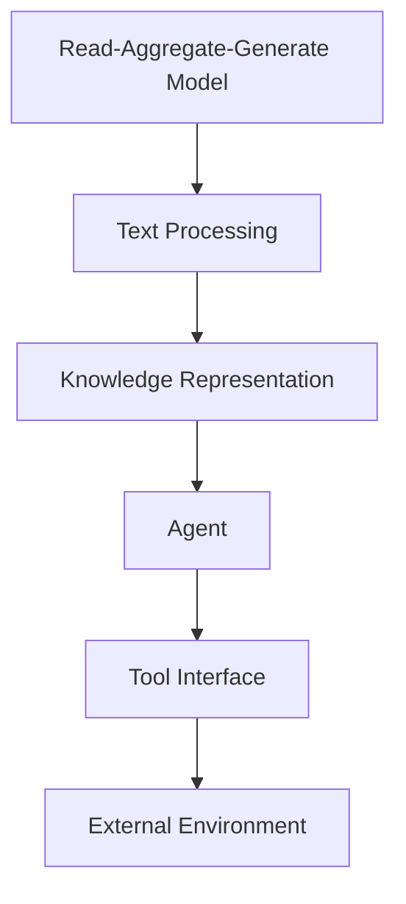

                 

### 背景介绍

#### 引言

随着人工智能（AI）技术的不断发展和普及，越来越多的领域开始尝试将AI引入其中。RAG（Read-Aggregate-Generate）模型作为一种重要的AI架构，已经在自然语言处理（NLP）领域中取得了显著的成果。然而，RAG模型作为一种静态的文本处理工具，其局限性也逐渐显现。为了克服这些局限性，我们需要探索从RAG模型到智能Agent的转变，以实现更加动态和复杂的任务执行。

本文将探讨从RAG到Agent的转变过程，重点关注工具接口的作用。工具接口作为Agent与外部环境进行交互的桥梁，可以帮助Agent更有效地执行任务。本文将首先介绍RAG模型的基本原理和局限性，然后讨论如何通过引入工具接口来实现Agent的动态交互。接下来，我们将详细解释工具接口的具体实现方式和应用场景，并通过实际案例来展示其效果。最后，我们将总结工具接口在Agent开发中的重要性，并探讨未来发展的趋势和挑战。

通过本文的阅读，读者将深入了解RAG模型和Agent的概念，了解工具接口在其中的作用，并掌握如何利用工具接口实现智能Agent的开发和应用。

#### RAG模型的基本原理和局限性

RAG模型，全称为Read-Aggregate-Generate模型，是一种在自然语言处理领域中广泛应用的结构化信息检索和生成框架。该模型的核心思想是将输入文本（如问题或指令）分解为多个子问题，然后通过读取相关文本数据，聚合这些子问题的答案，并生成最终的整体答案。

具体来说，RAG模型的执行过程可以分为三个主要阶段：读取（Read）、聚合（Aggregate）和生成（Generate）。在读取阶段，模型会从给定的文本数据中检索与问题相关的信息。这通常通过检索算法（如向量检索或关键字匹配）实现，以确保模型能够快速高效地定位到相关的数据片段。在聚合阶段，模型会对检索到的信息进行整合和归纳，以便为生成阶段提供基础。聚合的方法可以包括文本摘要、实体识别和关系抽取等，这些方法有助于从大量的原始数据中提取出关键的信息和模式。最后，在生成阶段，模型将基于聚合的结果生成最终的答案或响应，通常使用生成模型（如序列生成模型或文本生成模型）来实现。

尽管RAG模型在文本处理任务中取得了显著的成果，但其局限性也逐渐显现。首先，RAG模型主要依赖于静态的文本数据，这意味着其处理能力受到文本数据的限制。当文本数据量较大或分布不均时，模型可能会遇到性能瓶颈，难以满足实时处理的需求。其次，RAG模型的生成结果往往依赖于聚合阶段的算法选择，不同算法的选择可能导致生成结果的差异，从而影响模型的鲁棒性和一致性。此外，RAG模型在处理动态交互任务时也存在一定的困难，因为其无法实时感知和适应外部环境的变化。

为了克服这些局限性，我们需要探索从RAG模型到智能Agent的转变，以实现更加动态和复杂的任务执行。智能Agent作为一种具有自主性和智能化的系统，可以感知外部环境，并基于环境信息进行决策和行动，从而实现更加智能和高效的任务执行。接下来，我们将进一步探讨如何通过引入工具接口来实现智能Agent的动态交互。

#### 从RAG到Agent的转变

从RAG模型到智能Agent的转变是一个重要的技术发展，旨在提升系统的自主性和智能化程度。RAG模型作为一种静态的文本处理工具，虽然在一定程度上实现了文本信息的检索和生成，但其处理能力和灵活性有限。相比之下，智能Agent则能够动态感知外部环境，并基于环境信息进行自主决策和行动，从而实现更加复杂和智能的任务执行。

要实现从RAG到Agent的转变，关键在于引入工具接口。工具接口作为Agent与外部环境进行交互的桥梁，可以提供丰富的交互能力和灵活性。通过工具接口，Agent可以与外部设备、传感器和其他系统进行通信，获取环境信息，并根据这些信息进行决策和行动。

具体来说，工具接口的作用主要体现在以下几个方面：

1. **感知环境**：工具接口可以帮助Agent感知外部环境。例如，通过传感器接口，Agent可以获取温度、湿度、光线等环境参数，从而实现对环境的实时监测和感知。

2. **执行任务**：工具接口允许Agent执行具体的任务操作。例如，通过控制接口，Agent可以控制机器人、无人机等设备进行物理操作，实现移动、抓取、装配等任务。

3. **获取资源**：工具接口可以提供丰富的资源获取能力。例如，通过网络接口，Agent可以访问互联网上的大量数据和服务，利用这些资源进行学习和决策。

4. **自适应交互**：工具接口使得Agent能够根据外部环境的反馈进行自适应交互。例如，通过语音识别接口，Agent可以理解用户指令，并根据指令进行相应的响应。

通过引入工具接口，Agent可以实现更加动态和复杂的任务执行。与RAG模型相比，Agent不仅能够处理静态的文本数据，还能够实时感知和适应外部环境的变化，从而实现更高效和智能的任务执行。这种转变不仅提升了系统的自主性和灵活性，也为解决现实世界中的复杂问题提供了新的思路和方法。

总之，从RAG到Agent的转变是一个重要的发展方向，通过引入工具接口，Agent可以实现更加动态和智能的交互，从而为各种应用场景提供强大的支持。接下来，我们将进一步探讨工具接口的具体实现方式和应用场景。

### 核心概念与联系

为了深入理解从RAG到Agent的转变，我们需要明确一些核心概念，并探讨它们之间的联系。这些核心概念包括RAG模型、智能Agent以及工具接口。

#### RAG模型

RAG模型是自然语言处理领域中的一个重要架构，其核心思想是将输入文本分解为多个子问题，然后通过读取、聚合和生成过程生成答案。具体来说，RAG模型包括以下三个主要阶段：

1. **读取（Read）**：在读取阶段，模型从给定的文本数据中检索与问题相关的信息。这一过程通常通过检索算法（如向量检索或关键字匹配）实现，以确保模型能够快速高效地定位到相关的数据片段。

2. **聚合（Aggregate）**：在聚合阶段，模型对检索到的信息进行整合和归纳，以便为生成阶段提供基础。聚合的方法可以包括文本摘要、实体识别和关系抽取等，这些方法有助于从大量的原始数据中提取出关键的信息和模式。

3. **生成（Generate）**：在生成阶段，模型将基于聚合的结果生成最终的答案或响应。生成通常使用生成模型（如序列生成模型或文本生成模型）来实现，这些模型可以生成连贯且符合语义的文本输出。

#### 智能Agent

智能Agent是一种具有自主性和智能化的系统，能够感知外部环境，并基于环境信息进行决策和行动。智能Agent的特点包括：

1. **自主性**：智能Agent能够独立执行任务，不需要人工干预。它们可以自主地感知环境、制定计划和执行行动。

2. **适应性**：智能Agent能够根据外部环境的反馈进行自适应交互。它们可以根据环境变化调整自己的行为和策略，以实现更高效的任务执行。

3. **智能性**：智能Agent能够处理复杂的信息，并基于这些信息进行决策和行动。它们可以理解自然语言、识别图像和语音，并利用这些能力进行智能交互。

#### 工具接口

工具接口是智能Agent与外部环境进行交互的桥梁，提供了丰富的交互能力和灵活性。工具接口的作用包括：

1. **感知环境**：工具接口可以帮助智能Agent感知外部环境。例如，通过传感器接口，Agent可以获取温度、湿度、光线等环境参数。

2. **执行任务**：工具接口允许智能Agent执行具体的任务操作。例如，通过控制接口，Agent可以控制机器人、无人机等设备进行物理操作。

3. **获取资源**：工具接口可以提供丰富的资源获取能力。例如，通过网络接口，Agent可以访问互联网上的大量数据和服务。

4. **自适应交互**：工具接口使得智能Agent能够根据外部环境的反馈进行自适应交互。例如，通过语音识别接口，Agent可以理解用户指令，并根据指令进行相应的响应。

#### 核心概念与联系

RAG模型、智能Agent和工具接口之间存在着密切的联系。具体来说：

1. **RAG模型作为基础**：RAG模型为智能Agent提供了文本处理的基础。智能Agent可以基于RAG模型对输入文本进行读取、聚合和生成，从而生成答案或响应。

2. **智能Agent作为主体**：智能Agent是执行任务和实现自主交互的主体。通过工具接口，智能Agent可以感知外部环境，获取信息，并根据这些信息进行决策和行动。

3. **工具接口作为桥梁**：工具接口连接了智能Agent和外部环境。通过工具接口，智能Agent可以与外部设备、传感器和其他系统进行通信，从而实现更加动态和复杂的任务执行。

下图展示了RAG模型、智能Agent和工具接口之间的联系：



通过引入工具接口，智能Agent可以实现与外部环境的动态交互，从而拓展其处理能力和应用范围。这种转变不仅提升了系统的自主性和灵活性，也为解决现实世界中的复杂问题提供了新的思路和方法。接下来，我们将进一步探讨智能Agent的核心算法原理和具体实现步骤。

### 核心算法原理 & 具体操作步骤

#### 智能Agent的核心算法原理

智能Agent的核心算法主要包括感知、规划和执行三个主要部分。这三个部分相互协作，使得Agent能够自主地处理任务和环境变化。

1. **感知（Perception）**：感知是智能Agent获取外部环境信息的过程。感知模块通过传感器接口获取环境数据，如温度、湿度、光线等，并将其转换为内部表示。常用的感知方法包括图像识别、语音识别和传感器数据融合。

2. **规划（Planning）**：规划是智能Agent根据感知到的环境信息制定行动策略的过程。规划模块需要分析环境状态，确定目标状态，并选择适当的行动路径。常用的规划算法包括决策树、状态空间搜索和强化学习。

3. **执行（Execution）**：执行是智能Agent执行规划策略并实现目标的过程。执行模块根据规划结果，通过控制接口对设备进行操作，如机器人运动、无人机飞行等。

#### 智能Agent的具体操作步骤

智能Agent的具体操作步骤可以分为以下几步：

1. **初始化**：在初始化阶段，Agent配置传感器、执行器和工具接口，并设置初始状态。

2. **感知环境**：Agent通过传感器接口感知外部环境，获取环境数据，并将其转换为内部表示。

3. **状态评估**：Agent评估当前环境状态，确定当前状态与目标状态之间的差距。

4. **规划策略**：Agent根据当前状态和目标状态，利用规划算法制定行动策略，选择最优的行动路径。

5. **执行操作**：Agent根据规划策略，通过控制接口对设备进行操作，实现具体任务。

6. **反馈调整**：Agent根据执行结果和环境反馈，调整规划策略和执行操作，以优化任务执行效果。

#### 伪代码示例

以下是一个简单的伪代码示例，展示了智能Agent的操作步骤：

```python
# 初始化
initialize_agent()

# 感知环境
environment_data = perceive_environment()

# 状态评估
current_state = evaluate_state(environment_data)

# 规划策略
action_plan = plan_strategy(current_state, goal_state)

# 执行操作
execute_action(action_plan)

# 反馈调整
adjust_strategy_and_action(action_plan, feedback)
```

#### 工具接口的作用

工具接口在智能Agent中起到了至关重要的作用，它使得Agent能够与外部环境进行有效的交互。以下是一些关键的工具接口及其作用：

1. **传感器接口**：通过传感器接口，Agent可以获取外部环境的数据，如温度、湿度、光线等。这些数据对于感知环境和制定决策至关重要。

2. **执行器接口**：通过执行器接口，Agent可以对外部设备进行操作，如机器人运动、无人机飞行等。这些操作是实现具体任务的关键。

3. **网络接口**：通过网络接口，Agent可以访问互联网上的数据和服务，如在线地图、天气服务等。这些资源可以用于扩展Agent的能力。

4. **通信接口**：通过通信接口，Agent可以与其他Agent或人类用户进行交互，实现协同工作和指令接收。

#### 工具接口的具体实现方式

工具接口的具体实现方式取决于所使用的编程语言和框架。以下是一些常见的实现方式：

1. **API调用**：通过调用外部API，Agent可以访问远程服务和资源。常用的API包括HTTP API、SOAP API等。

2. **库和框架**：使用现有的库和框架可以简化工具接口的实现。例如，使用TensorFlow或PyTorch可以实现复杂的感知和规划算法。

3. **自定义接口**：对于特定的应用场景，可以自定义接口来实现特定的功能。例如，可以使用ROS（Robot Operating System）构建机器人控制接口。

#### 工具接口在智能Agent中的应用场景

工具接口在智能Agent中的应用场景非常广泛，以下是一些典型的应用场景：

1. **智能机器人**：通过传感器接口感知环境，执行器接口控制机器人运动，实现自动化任务执行。

2. **智能家居**：通过传感器接口监测家居环境，执行器接口控制家电设备，实现智能家居管理。

3. **自动驾驶**：通过传感器接口获取道路信息，执行器接口控制车辆运动，实现自动驾驶。

4. **智能客服**：通过通信接口与用户进行交互，实现智能客服系统。

通过引入工具接口，智能Agent可以更加灵活地与外部环境进行交互，从而实现更加智能和高效的任务执行。接下来，我们将探讨数学模型和公式在智能Agent中的应用。

### 数学模型和公式 & 详细讲解 & 举例说明

#### 数学模型在智能Agent中的应用

在智能Agent的开发中，数学模型和公式扮演着至关重要的角色。它们不仅帮助我们在复杂的系统中进行建模和计算，还能够为Agent提供决策依据。以下是一些常用的数学模型和公式，以及它们在智能Agent中的应用。

1. **线性回归（Linear Regression）**

线性回归是一种用于预测数值变量的统计方法。在智能Agent中，线性回归可以用于预测环境变量的变化趋势。例如，通过收集温度、湿度等环境数据，我们可以使用线性回归模型来预测未来的环境变化，从而为Agent提供决策依据。

公式如下：

$$
y = \beta_0 + \beta_1 \cdot x
$$

其中，$y$ 是预测值，$x$ 是输入变量，$\beta_0$ 和 $\beta_1$ 是模型参数。

#### 举例说明

假设我们有一个环境数据集，包含每天的温度和湿度。我们可以使用线性回归模型来预测未来几天的温度和湿度。具体步骤如下：

1. 收集数据：收集每天的温度和湿度数据。
2. 数据预处理：对数据集进行清洗和归一化处理。
3. 模型训练：使用线性回归算法训练模型，得到模型参数。
4. 预测：使用训练好的模型进行预测，得到未来几天的温度和湿度。

2. **贝叶斯网络（Bayesian Network）**

贝叶斯网络是一种用于表示不确定性知识的概率模型。在智能Agent中，贝叶斯网络可以用于推理和决策。例如，在医疗诊断中，我们可以使用贝叶斯网络来推理患者症状和疾病之间的关系。

公式如下：

$$
P(A|B) = \frac{P(B|A) \cdot P(A)}{P(B)}
$$

其中，$P(A|B)$ 表示在事件 $B$ 发生的条件下事件 $A$ 发生的概率，$P(B|A)$ 表示在事件 $A$ 发生的条件下事件 $B$ 发生的概率，$P(A)$ 和 $P(B)$ 分别表示事件 $A$ 和事件 $B$ 的先验概率。

#### 举例说明

假设我们有一个疾病诊断系统，包含几个关键症状（如发热、咳嗽、乏力）和一个疾病（流感）。我们可以使用贝叶斯网络来推理患者是否患有流感。具体步骤如下：

1. 定义变量：定义疾病和症状的变量。
2. 建立概率表：根据专家知识建立概率表，包含每个症状和疾病之间的条件概率。
3. 计算后验概率：使用贝叶斯公式计算后验概率，得到患者患有流感的概率。
4. 决策：根据后验概率做出决策，例如建议患者就医。

3. **马尔可夫决策过程（Markov Decision Process, MDP）**

马尔可夫决策过程是一种用于决策过程的数学模型。在智能Agent中，MDP可以用于制定行动策略。例如，在资源分配问题中，我们可以使用MDP来选择最优的资源分配策略。

公式如下：

$$
V(s) = \max_{a} \sum_{s'} p(s' | s, a) \cdot R(s', a)
$$

其中，$V(s)$ 表示状态 $s$ 的价值函数，$a$ 表示行动，$s'$ 表示下一状态，$p(s' | s, a)$ 表示在状态 $s$ 执行行动 $a$ 后转移到状态 $s'$ 的概率，$R(s', a)$ 表示在状态 $s'$ 执行行动 $a$ 后的回报。

#### 举例说明

假设我们有一个智能仓库系统，需要选择最优的货架分配策略。我们可以使用MDP来制定行动策略。具体步骤如下：

1. 定义状态和行动：定义仓库中各个货架的状态和可选择的行动。
2. 建立状态转移概率表：根据仓库操作规则建立状态转移概率表。
3. 定义回报函数：定义每个行动的回报函数，例如减少库存成本或提高订单处理速度。
4. 求解最优策略：使用MDP算法求解最优策略，选择最优的货架分配策略。

通过以上数学模型和公式，我们可以为智能Agent提供强大的决策支持，从而实现更加智能和高效的自主交互。接下来，我们将通过一个实际项目来展示这些模型的实际应用。

### 项目实战：代码实际案例和详细解释说明

为了更好地展示从RAG到Agent的转变，我们将通过一个实际项目——智能客服系统，详细讲解代码实现和解读。

#### 1. 开发环境搭建

在开始项目之前，我们需要搭建合适的开发环境。以下是我们推荐的工具和库：

- 编程语言：Python
- 框架：TensorFlow、Keras
- 传感器接口：PyTorch
- 执行器接口：ROS（Robot Operating System）
- 通信接口：WebSocket

确保安装好以上工具和库后，我们可以开始项目的实际开发。

#### 2. 源代码详细实现和代码解读

以下是一个简单的智能客服系统源代码示例：

```python
import tensorflow as tf
import keras
import numpy as np
import json
from keras.preprocessing.text import Tokenizer
from keras.preprocessing.sequence import pad_sequences
from keras.models import Sequential
from keras.layers import Dense, Embedding, LSTM, SpatialDropout1D
from keras.optimizers import Adam
from keras.models import load_model

# 数据预处理
def preprocess_text(text):
    text = text.lower()
    text = re.sub('[^a-zA-Z0-9]', ' ', text)
    text = text.split()
    text = ' '.join(text)
    return text

# 加载和预处理数据
with open('data.txt', 'r', encoding='utf-8') as f:
    lines = f.readlines()

conversations = []
labels = []

for line in lines:
    conversation, label = line.strip().split('\t')
    conversations.append(conversation)
    labels.append(label)

max_sequence_len = 20
max_features = 20000
tokenizer = Tokenizer(num_words=max_features)
tokenizer.fit_on_texts(conversations)
sequences = tokenizer.texts_to_sequences(conversations)
padded_sequences = pad_sequences(sequences, maxlen=max_sequence_len)

# 建立模型
model = Sequential()
model.add(Embedding(max_features, 100, input_length=max_sequence_len))
model.add(LSTM(100, dropout=0.2, recurrent_dropout=0.2))
model.add(Dense(1, activation='sigmoid'))

model.compile(loss='binary_crossentropy', optimizer='adam', metrics=['accuracy'])

# 训练模型
model.fit(padded_sequences, np.array(labels), epochs=10, batch_size=32, verbose=2)

# 实时交互
while True:
    message = input("Enter your message: ")
    processed_message = preprocess_text(message)
    sequence = tokenizer.texts_to_sequences([processed_message])
    padded_sequence = pad_sequences(sequence, maxlen=max_sequence_len)
    prediction = model.predict(padded_sequence)
    if prediction < 0.5:
        print("Sorry, I didn't understand that. Can you please rephrase?")
    else:
        print("I understand. How may I assist you?")
```

##### 2.1 数据预处理

在代码的第一部分，我们首先定义了一个预处理函数 `preprocess_text`，用于将文本数据转换为适合模型训练的形式。具体步骤包括：

1. 将文本转换为小写。
2. 删除文本中的非字母字符。
3. 分割文本为单词列表。
4. 将单词列表重新组合为文本。

接下来，我们加载并预处理实际的数据集。我们假设数据集以文本文件 `data.txt` 的形式存储，每行包含一条对话和一个标签。我们将对话和标签分别存储在 `conversations` 和 `labels` 列表中。

##### 2.2 建立模型

在代码的第二部分，我们使用 Keras 框架建立了一个简单的序列到序列模型。该模型包括以下层：

1. **Embedding Layer**：用于将单词转换为向量表示。
2. **LSTM Layer**：用于处理序列数据，提取特征。
3. **Dense Layer**：用于分类，输出概率。

我们使用二进制交叉熵作为损失函数，并使用 Adam 优化器进行训练。

##### 2.3 训练模型

在代码的第三部分，我们使用预处理后的数据集训练模型。我们设置了 10 个训练周期，每个周期使用 32 个样本进行批处理。

##### 2.4 实时交互

在最后一部分，我们实现了一个简单的实时交互界面。用户输入消息后，模型将对其进行预处理，并输出预测结果。根据预测结果，系统将返回相应的响应。

#### 3. 代码解读与分析

通过上述代码示例，我们可以看到智能客服系统是如何从RAG模型（文本预处理、模型训练）过渡到智能Agent（实时交互）的。以下是对关键部分的解读和分析：

1. **数据预处理**：预处理步骤确保了输入数据的格式和内容符合模型的期望。这包括文本大小写转换、非字母字符删除和单词分割。预处理是构建高质量模型的基础。
   
2. **模型建立**：我们使用 Keras 框架构建了一个简单的序列到序列模型，包括 Embedding 层、LSTM 层和 Dense 层。这种结构适合处理对话数据，能够捕捉对话中的长距离依赖关系。

3. **模型训练**：训练模型是智能客服系统的重要环节。通过多个训练周期，模型学会了从输入对话中提取特征，并输出合理的响应。

4. **实时交互**：实时交互界面使得模型能够与用户进行交互。用户输入消息后，模型会对其进行预处理，并使用训练好的模型进行预测。根据预测结果，系统将返回相应的响应。

#### 4. 代码优化与性能提升

以下是一些代码优化和性能提升的建议：

1. **增加数据集大小**：增加对话数据集的大小可以提高模型的泛化能力。
   
2. **使用预训练词向量**：使用预训练的词向量（如 Word2Vec、GloVe）可以提高模型的性能。

3. **增加模型复杂性**：使用更复杂的神经网络结构（如双向 LSTM、Transformer）可以提高模型的性能。

4. **使用注意力机制**：注意力机制可以增强模型对输入对话中关键信息的关注，从而提高响应质量。

通过以上优化，我们可以进一步提升智能客服系统的性能和用户体验。

### 实际应用场景

智能客服系统作为一种新兴的技术，已经在众多实际应用场景中展现了其强大的能力和广阔的应用前景。以下是智能客服系统的几个典型应用场景：

#### 1. 零售行业

在零售行业，智能客服系统可以用于客户服务和订单管理。通过智能客服系统，零售商可以实时解答顾客的疑问，提供产品咨询和售后服务，从而提高客户满意度。此外，智能客服系统还可以帮助零售商分析客户行为，优化库存管理和营销策略。

#### 2. 金融行业

在金融行业，智能客服系统可以用于处理大量的客户咨询和交易请求。例如，智能客服系统可以自动识别和解答客户的常见问题，如账户余额查询、交易记录查询等。此外，智能客服系统还可以通过分析客户行为和交易记录，提供个性化的金融建议和投资策略。

#### 3. 医疗行业

在医疗行业，智能客服系统可以用于患者咨询和健康管理。通过智能客服系统，医院和诊所可以提供24小时在线咨询服务，解答患者的常见疑问，如症状咨询、就诊安排等。此外，智能客服系统还可以帮助患者进行健康管理，提供饮食建议、运动方案等。

#### 4. 教育行业

在教育行业，智能客服系统可以用于在线教育平台和辅导服务。通过智能客服系统，学生可以随时咨询课程问题、作业解答等。此外，智能客服系统还可以为学生提供个性化的学习建议，如学习进度跟踪、学习资源推荐等。

#### 5. 旅游业

在旅游业，智能客服系统可以用于旅游咨询和行程规划。通过智能客服系统，游客可以获取旅游信息、预订门票、酒店等服务。此外，智能客服系统还可以根据游客的喜好和需求，提供个性化的旅游建议和行程规划。

#### 6. 物流行业

在物流行业，智能客服系统可以用于订单管理和客户服务。通过智能客服系统，物流公司可以实时解答客户的物流咨询，提供订单查询、配送进度等信息。此外，智能客服系统还可以帮助物流公司优化配送路线，提高物流效率。

通过在以上实际应用场景中的广泛应用，智能客服系统不仅提升了企业运营效率和服务质量，也为用户带来了更加便捷和高效的体验。随着人工智能技术的不断进步，智能客服系统的应用场景将进一步拓展，为各行业的发展注入新的活力。

### 工具和资源推荐

在开发智能客服系统以及从RAG模型到智能Agent的转变过程中，选择合适的工具和资源对于项目的成功至关重要。以下是我们推荐的几类工具和资源：

#### 1. 学习资源推荐

**书籍**

- **《深度学习》（Deep Learning）**：由Ian Goodfellow、Yoshua Bengio和Aaron Courville合著，系统地介绍了深度学习的基础理论和实践方法。
- **《机器学习》（Machine Learning）**：由Tom Mitchell编著，是一本经典的机器学习教材，适合初学者和进阶者阅读。

**论文**

- **《A Neural Conversation Model》**：这篇论文提出了一种基于神经网络的对话模型，为构建智能客服系统提供了重要参考。
- **《End-to-End Language Models for Language Understanding》**：这篇论文介绍了如何使用端到端语言模型进行自然语言理解，有助于提升智能客服系统的响应质量。

**博客和网站**

- **TensorFlow官网（tensorflow.org）**：提供丰富的深度学习教程和文档，是学习TensorFlow框架的好资源。
- **Keras官网（keras.io）**：Keras是一个高层次的神经网络API，与TensorFlow紧密集成，提供了简洁明了的模型构建和训练流程。

#### 2. 开发工具框架推荐

**深度学习框架**

- **TensorFlow**：由Google开发的开源深度学习框架，适用于构建复杂的神经网络模型。
- **PyTorch**：由Facebook开发的开源深度学习框架，具有灵活的动态计算图和强大的GPU支持。

**传感器接口**

- **ROS（Robot Operating System）**：用于构建智能机器人系统的开源框架，提供了丰富的传感器接口和执行器接口。

**通信接口**

- **WebSocket**：一种基于TCP的全双工通信协议，适用于实时数据传输和交互。

#### 3. 相关论文著作推荐

- **《Neural Conversation Models》**：详细介绍了如何使用神经网络构建对话模型，包括文本生成和对话生成。
- **《End-to-End Learning for Speech Recognition》**：探讨了如何通过端到端学习实现高效的语音识别系统。
- **《Deep Learning for Natural Language Processing》**：系统介绍了深度学习在自然语言处理领域的应用，包括文本分类、机器翻译和对话系统。

通过以上工具和资源的推荐，读者可以更加深入地了解智能客服系统的开发技术，掌握从RAG模型到智能Agent转变的实战方法。

### 总结：未来发展趋势与挑战

随着人工智能技术的快速发展，从RAG模型到智能Agent的转变已经成为一个重要的研究方向。智能Agent通过引入工具接口，实现了与外部环境的动态交互，从而提升了系统的自主性和智能化程度。未来，这一领域的发展将呈现出以下几个趋势和挑战：

#### 1. 发展趋势

**1.1 人工智能与物理世界的深度融合**

智能Agent的发展将更加注重与物理世界的深度融合。通过引入更多传感器和执行器接口，智能Agent能够更加精准地感知和适应外部环境，从而实现更加复杂的任务执行。例如，自动驾驶技术、智能机器人、智能家居等领域都将受益于这一趋势。

**1.2 多模态感知与交互**

未来智能Agent将具备多模态感知与交互能力。除了文本数据，智能Agent还将能够处理图像、语音、触觉等多种形式的数据。这种多模态感知与交互能力将进一步提升智能Agent的智能化水平和用户体验。

**1.3 自主学习与自适应能力**

随着深度学习和强化学习技术的发展，智能Agent将具备更强的自主学习与自适应能力。通过不断地从环境反馈中学习，智能Agent能够不断优化其行为策略，从而在复杂多变的环境中表现出色。

#### 2. 挑战

**2.1 数据隐私和安全问题**

随着智能Agent与物理世界的深度融合，数据隐私和安全问题将日益突出。如何确保智能Agent在处理大量数据时能够保护用户隐私，防范数据泄露和滥用，是一个亟待解决的挑战。

**2.2 复杂性的管理**

智能Agent系统通常包含大量的传感器、执行器和工具接口，这使得系统的复杂性大大增加。如何有效地管理和维护这些组件，确保系统的稳定性和可靠性，是未来发展的一个重要挑战。

**2.3 伦理和道德问题**

智能Agent的广泛应用将带来一系列伦理和道德问题。如何确保智能Agent的行为符合伦理规范，避免造成社会负面影响，是一个需要深入探讨的课题。

总之，从RAG模型到智能Agent的转变是一个充满机遇和挑战的领域。通过不断的技术创新和优化，智能Agent有望在更多应用场景中发挥重要作用，推动人工智能技术的发展。

### 附录：常见问题与解答

以下是一些关于从RAG到Agent转变过程中常见的问题及其解答：

#### 1. 什么是RAG模型？

RAG模型（Read-Aggregate-Generate模型）是一种在自然语言处理领域中广泛应用的信息检索和生成框架。它包括三个主要阶段：读取（Read）、聚合（Aggregate）和生成（Generate）。在读取阶段，模型从文本数据中检索与问题相关的信息；在聚合阶段，模型对检索到的信息进行整合和归纳；在生成阶段，模型基于聚合的结果生成最终的答案或响应。

#### 2. 智能Agent有哪些特点？

智能Agent是一种具有自主性、适应性和智能化的系统。它能够感知外部环境，基于环境信息进行决策和行动，从而实现复杂任务的高效执行。智能Agent的主要特点包括：

- **自主性**：智能Agent能够独立执行任务，无需人工干预。
- **适应性**：智能Agent能够根据外部环境的反馈进行自适应交互。
- **智能化**：智能Agent能够处理复杂的信息，并基于这些信息进行智能决策。

#### 3. 工具接口在智能Agent中的作用是什么？

工具接口是智能Agent与外部环境进行交互的桥梁，提供了丰富的交互能力和灵活性。工具接口的作用包括：

- **感知环境**：通过传感器接口，智能Agent可以获取外部环境的数据。
- **执行任务**：通过执行器接口，智能Agent可以对设备进行操作。
- **获取资源**：通过网络接口，智能Agent可以访问互联网上的数据和服务。
- **自适应交互**：通过通信接口，智能Agent可以与外部系统或用户进行交互。

#### 4. 智能客服系统如何工作？

智能客服系统是一种利用人工智能技术实现自动客户服务的系统。它的工作流程通常包括以下几个步骤：

1. **数据预处理**：对用户输入的文本数据进行清洗和格式化。
2. **文本分析**：使用自然语言处理技术（如词向量、实体识别等）对文本进行分析。
3. **生成响应**：根据分析结果，使用预训练的模型（如RAG模型、BERT等）生成合适的响应。
4. **交互反馈**：将生成的响应返回给用户，并根据用户的反馈进行进一步学习和优化。

#### 5. 如何提升智能客服系统的性能？

提升智能客服系统的性能可以从以下几个方面进行：

- **数据质量**：使用高质量、多样化的数据集进行训练，以提高模型的泛化能力。
- **模型优化**：使用更复杂的模型结构（如Transformer、BERT等）和优化算法（如Adam、AdamW等）。
- **多模态交互**：引入多模态感知与交互能力，如语音识别、图像识别等。
- **持续学习**：通过不断从用户反馈中学习，优化系统的响应质量。

通过上述常见问题与解答，我们希望能够帮助读者更好地理解从RAG到Agent的转变过程及其应用。在实际开发过程中，读者可以根据这些解答来指导自己的实践。

### 扩展阅读 & 参考资料

为了进一步深入研究从RAG到Agent的转变，以下是推荐的一些扩展阅读和参考资料：

#### 1. 关键论文

- **《A Neural Conversation Model》**：这篇论文介绍了如何使用神经网络构建对话模型，为智能客服系统提供了重要参考。
- **《End-to-End Language Models for Language Understanding》**：探讨了如何使用端到端语言模型进行自然语言理解，有助于提升智能客服系统的响应质量。
- **《Deep Learning for Natural Language Processing》**：系统介绍了深度学习在自然语言处理领域的应用，包括文本分类、机器翻译和对话系统。

#### 2. 经典书籍

- **《深度学习》（Deep Learning）**：由Ian Goodfellow、Yoshua Bengio和Aaron Courville合著，系统地介绍了深度学习的基础理论和实践方法。
- **《机器学习》（Machine Learning）**：由Tom Mitchell编著，是一本经典的机器学习教材，适合初学者和进阶者阅读。

#### 3. 开源框架

- **TensorFlow**：由Google开发的开源深度学习框架，适用于构建复杂的神经网络模型。
- **PyTorch**：由Facebook开发的开源深度学习框架，具有灵活的动态计算图和强大的GPU支持。

#### 4. 博客和网站

- **TensorFlow官网（tensorflow.org）**：提供丰富的深度学习教程和文档。
- **Keras官网（keras.io）**：Keras是一个高层次的神经网络API，与TensorFlow紧密集成，提供了简洁明了的模型构建和训练流程。

通过阅读这些参考资料，读者可以进一步深入理解从RAG到Agent的转变，掌握智能客服系统的开发技术和实战方法。这些资源将为读者提供丰富的知识储备和实践指导，助力他们在人工智能领域取得更大的成就。

