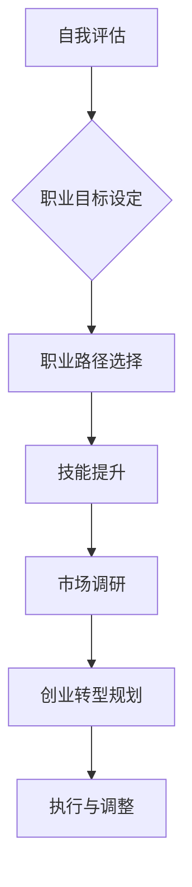

                 

# 从全职工作到副业创业的过渡

> **关键词：** 职业规划、创业转型、时间管理、技能提升、市场调研、风险管理

> **摘要：** 本文旨在为那些考虑从全职工作转向副业创业的职场人士提供一套系统化的转型策略。我们将探讨如何评估自身条件、规划创业方向、管理时间和资源，以及如何降低创业风险，确保顺利过渡。

## 1. 背景介绍

在当今快速变化的社会和经济环境中，越来越多的职场人士开始思考如何实现职业发展。许多人发现，全职工作虽然稳定，但在某些方面可能限制了他们的成长空间。对于有创业梦想的人来说，副业创业提供了一个实现个人价值和财务自由的途径。然而，从全职工作过渡到副业创业并非易事，需要系统规划和充分准备。

本文将分为以下几个部分：

- **背景介绍**：解释为何越来越多的人考虑从全职工作转向副业创业。
- **核心概念与联系**：阐述职业规划和创业转型的关键概念。
- **核心算法原理 & 具体操作步骤**：提供具体的职业规划步骤。
- **数学模型和公式 & 详细讲解 & 举例说明**：用模型和公式来支持决策过程。
- **项目实战：代码实际案例和详细解释说明**：通过具体案例展示转型过程。
- **实际应用场景**：讨论创业转型的多种场景。
- **工具和资源推荐**：推荐有用的工具和资源。
- **总结：未来发展趋势与挑战**：探讨行业趋势和面临的挑战。
- **附录：常见问题与解答**：回答读者可能遇到的问题。
- **扩展阅读 & 参考资料**：提供进一步学习的资源。

通过这篇文章，读者将能够了解从全职工作到副业创业的过渡过程，并学会如何做出明智的职业决策。

## 2. 核心概念与联系

在探讨从全职工作到副业创业的过渡之前，我们需要了解几个关键概念：职业规划、创业转型、时间管理、技能提升和市场调研。

### 职业规划

职业规划是指为了实现个人职业目标而进行的系统思考和计划。它包括自我评估、目标设定、职业路径选择和持续学习。对于考虑创业的职场人士来说，职业规划至关重要，因为它可以帮助你明确自己的兴趣、能力和职业目标，从而为创业做好准备。

### 创业转型

创业转型指的是从稳定的全职工作转向具有不确定性的创业活动。这个过程通常需要重新评估自己的资源、能力和市场需求。创业转型不仅仅是放弃全职工作，更是一个涉及心理、财务和实际操作的全面转变。

### 时间管理

时间管理是确保创业转型成功的关键因素之一。有效的时间管理可以帮助你在有限的时间内完成更多任务，减少焦虑和压力。时间管理技巧包括优先级设定、任务分解、时间分配和避免拖延。

### 技能提升

创业成功往往依赖于特定技能，如市场营销、财务管理、客户管理和产品开发。在转型之前，提升这些技能将大大增加创业的成功率。

### 市场调研

市场调研是了解目标市场、客户需求和竞争对手的重要步骤。通过市场调研，你可以确定你的创业想法是否可行，以及如何定位和推广你的产品或服务。

### Mermaid 流程图

下面是一个简化的职业规划与创业转型的 Mermaid 流程图：



这个流程图展示了从职业规划到创业转型的关键步骤。每个步骤都是后续步骤的基础，需要仔细规划和执行。

### 总结

通过理解这些核心概念，你可以更好地准备自己的创业转型。在接下来的章节中，我们将深入探讨每个步骤的具体操作方法和策略。

## 3. 核心算法原理 & 具体操作步骤

在了解了职业规划和创业转型的核心概念后，接下来我们将讨论具体的操作步骤，帮助职场人士有效地从全职工作过渡到副业创业。

### 自我评估

自我评估是职业规划的起点。它要求你深入思考自己的兴趣、优势、价值观和职业目标。以下是一套简单的自我评估方法：

1. **兴趣与激情**：列出你感兴趣的事物和领域。思考哪些活动让你感到兴奋和有动力。
2. **优势与技能**：识别你的专业技能、工作经验和个人能力。这包括硬技能（如编程、市场营销）和软技能（如沟通、团队合作）。
3. **价值观与目标**：明确你的价值观和职业目标。这些因素将指导你的职业选择和创业方向。

**步骤1：兴趣与激情**

- **方法**：通过写日记、参加兴趣小组或尝试不同类型的活动来探索自己的兴趣。
- **工具**：使用兴趣量表（如霍兰德职业兴趣量表）来帮助你更好地理解自己的兴趣。

**步骤2：优势与技能**

- **方法**：回顾你的过去工作经验，识别你在工作中表现突出的方面。
- **工具**：技能评估工具（如 LinkedIn 的技能评估）可以帮助你识别和提升自己的技能。

**步骤3：价值观与目标**

- **方法**：思考你的长期职业目标，以及你愿意为之付出的努力和牺牲。
- **工具**：价值观评估工具（如“重要事件”方法）可以帮助你识别自己的价值观。

### 职业目标设定

一旦完成了自我评估，接下来就是设定明确的职业目标。以下是一套目标设定的方法：

1. **长期目标**：设定5年或10年的长期职业目标。这将是你的职业生涯发展方向。
2. **中期目标**：设定2-3年的中期目标，以实现长期目标。
3. **短期目标**：设定1年内的短期目标，以衡量你的进展。

**步骤1：长期目标**

- **方法**：想象你的理想职业状态，并设定一个明确的长期目标。
- **工具**：愿景板（Vision Board）可以帮助你可视化你的长期目标。

**步骤2：中期目标**

- **方法**：将长期目标分解为可实现的阶段，设定中期目标。
- **工具**：SMART 目标设定方法（Specific、Measurable、Achievable、Relevant、Time-bound）可以帮助你确保目标的明确性和可实现性。

**步骤3：短期目标**

- **方法**：将中期目标进一步分解为1年内的具体行动步骤。
- **工具**：甘特图（Gantt Chart）可以帮助你规划和管理时间，确保短期目标的实现。

### 职业路径选择

在设定了职业目标后，接下来就是选择合适的职业路径。以下是一套职业路径选择的方法：

1. **探索不同的职业路径**：了解不同行业和职业领域的现状和趋势。
2. **评估市场需求**：确定哪个职业路径与你的兴趣、优势和市场需求相匹配。
3. **制定职业规划**：根据你的目标和市场需求，制定一个具体的职业规划。

**步骤1：探索不同的职业路径**

- **方法**：通过阅读行业报告、参加行业会议和与行业人士交流，了解不同职业路径的信息。
- **工具**：行业报告分析工具可以帮助你深入了解各个行业的现状和趋势。

**步骤2：评估市场需求**

- **方法**：通过市场调研，了解市场需求和趋势。
- **工具**：问卷调查和市场分析工具可以帮助你评估市场需求。

**步骤3：制定职业规划**

- **方法**：根据你的兴趣、优势和市场需求，选择一个合适的职业路径，并制定一个详细的职业规划。
- **工具**：职业规划工具（如职业规划软件）可以帮助你制定和跟踪职业规划。

### 技能提升

在职业路径选择后，技能提升将成为你的重点。以下是一套技能提升的方法：

1. **识别所需技能**：确定你在所选职业路径上需要提升的技能。
2. **制定学习计划**：制定一个具体的学习计划，包括学习资源、学习时间和学习目标。
3. **持续学习与实践**：不断学习和实践，以提升你的技能。

**步骤1：识别所需技能**

- **方法**：通过阅读行业报告、参加培训课程和与行业人士交流，了解所选职业路径所需的技能。
- **工具**：技能识别工具（如技能评估问卷）可以帮助你识别所需技能。

**步骤2：制定学习计划**

- **方法**：制定一个详细的学习计划，包括学习资源、学习时间和学习目标。
- **工具**：学习计划工具（如学习计划软件）可以帮助你制定和跟踪学习计划。

**步骤3：持续学习与实践**

- **方法**：通过参加在线课程、阅读专业书籍和实际操作来持续提升你的技能。
- **工具**：在线学习平台（如 Coursera、Udemy）和专业书籍可以帮助你进行持续学习。

### 市场调研

在职业规划和技能提升的基础上，市场调研将是确保你创业想法可行性的关键步骤。以下是一套市场调研的方法：

1. **确定目标市场**：明确你的目标市场和客户群体。
2. **收集市场信息**：通过问卷调查、访谈和观察来收集市场信息。
3. **分析市场数据**：分析收集到的市场数据，了解市场趋势和竞争状况。

**步骤1：确定目标市场**

- **方法**：通过市场调研，了解你的潜在客户是谁，他们的需求和痛点是什么。
- **工具**：市场调研工具（如问卷调查软件）可以帮助你确定目标市场。

**步骤2：收集市场信息**

- **方法**：通过问卷调查、访谈和观察来收集市场信息。
- **工具**：问卷调查软件（如 SurveyMonkey）和访谈工具（如 Zoom）可以帮助你收集市场信息。

**步骤3：分析市场数据**

- **方法**：使用数据分析工具（如 Excel、Tableau）来分析收集到的市场数据。
- **工具**：数据分析工具（如 Excel、Tableau）可以帮助你分析市场数据。

### 总结

通过以上步骤，你可以有效地进行职业规划，并准备好从全职工作过渡到副业创业。在接下来的章节中，我们将继续讨论如何将职业规划转化为实际的创业行动。

## 4. 数学模型和公式 & 详细讲解 & 举例说明

在职业规划和创业转型的过程中，数学模型和公式可以帮助我们量化决策，评估风险，并制定更有效的战略。以下是几个常用的数学模型和公式，以及它们的详细解释和实际应用。

### 风险评估模型

风险评估是创业过程中必不可少的一环。以下是一个简单但实用的风险评估模型：

**公式**：
\[ R = \frac{P \times L}{C} \]

- \( R \)：风险值
- \( P \)：潜在损失的概率
- \( L \)：潜在损失的金额
- \( C \)：成本

**详细解释**：
这个公式可以帮助你计算某个决策的风险值。例如，假设你想投资一个新的创业项目，但你对市场的需求不确定。你可以估计市场需求的潜在损失概率（\( P \)），潜在损失的金额（\( L \)），以及项目的成本（\( C \)）。通过计算风险值（\( R \)），你可以决定是否继续投资。

**举例说明**：
假设你估计市场需求的不确定性为 \( 20\% \)，潜在损失金额为 \( 100,000 \) 美元，而项目的成本为 \( 50,000 \) 美元。则：
\[ R = \frac{0.2 \times 100,000}{50,000} = 0.4 \]

这意味着你的风险值为 \( 0.4 \)。根据这个结果，你可以决定是否调整投资策略，或者采取额外的风险缓解措施。

### 投资回报率（ROI）模型

投资回报率是衡量投资效益的重要指标。以下是一个简单的投资回报率模型：

**公式**：
\[ ROI = \frac{净收益}{投资成本} \times 100\% \]

- \( ROI \)：投资回报率
- \( 净收益 \)：投资产生的总收益减去总成本
- \( 投资成本 \)：初始投资金额

**详细解释**：
投资回报率反映了你的投资收益相对于投资成本的比率。一个高ROI表明投资效益好，而一个低ROI则表明投资效益不佳。

**举例说明**：
假设你投资 \( 10,000 \) 美元于一个创业项目，该项目产生了 \( 15,000 \) 美元的净收益。则：
\[ ROI = \frac{15,000}{10,000} \times 100\% = 150\% \]

这意味着你的投资回报率为 \( 150\% \)，表明该投资非常有效。

### 资金时间价值模型

资金时间价值模型可以帮助你评估不同时间点的资金价值。以下是一个简单的资金时间价值模型：

**公式**：
\[ PV = FV / (1 + r)^n \]

- \( PV \)：现值
- \( FV \)：未来值
- \( r \)：折现率
- \( n \)：时间期数

**详细解释**：
这个公式用于计算未来值的现值。折现率反映了资金的时间价值，即相同金额的钱在未来的时间点价值更低。通过计算现值，你可以比较不同时间点的资金价值。

**举例说明**：
假设你将在两年后获得 \( 10,000 \) 美元的收益，折现率为 \( 5\% \)。则：
\[ PV = \frac{10,000}{(1 + 0.05)^2} = \frac{10,000}{1.1025} \approx 9,037 \]

这意味着 \( 10,000 \) 美元的未来值在今天的价值为 \( 9,037 \) 美元。

### 总结

通过以上数学模型和公式，我们可以更科学地评估创业风险、计算投资回报率，以及评估不同时间点的资金价值。这些工具可以帮助你在职业规划和创业转型过程中做出更明智的决策。

## 5. 项目实战：代码实际案例和详细解释说明

为了更好地理解从全职工作到副业创业的过渡，我们可以通过一个具体的代码实战案例来展示整个过程。在这个案例中，我们将创建一个简单的在线商店，这个项目将涵盖从市场调研、开发环境搭建到源代码实现和代码解读的各个方面。

### 5.1 开发环境搭建

在开始编写代码之前，我们需要搭建一个适合开发的环境。以下是搭建开发环境的基本步骤：

**步骤1：选择开发语言和框架**

我们选择使用 Python 语言和 Django 框架来开发在线商店。Python 是一种易于学习和使用的编程语言，而 Django 是一个高级的 Web 开发框架，具有强大的功能，适合快速开发 Web 应用程序。

**步骤2：安装 Python 和 Django**

在计算机上安装 Python 和 Django。你可以使用 `pip` 命令来安装 Django：

```shell
pip install django
```

**步骤3：创建 Django 项目**

使用 Django 命令创建一个新的项目：

```shell
django-admin startproject online_store
```

**步骤4：创建 Django 应用**

在项目目录下创建一个应用：

```shell
cd online_store
python manage.py startapp catalog
```

### 5.2 源代码详细实现和代码解读

#### 5.2.1 产品模型（Product Model）

首先，我们需要创建一个产品模型来存储在线商店的商品信息。在 `catalog/models.py` 中添加以下代码：

```python
from django.db import models

class Product(models.Model):
    name = models.CharField(max_length=200)
    description = models.TextField()
    price = models.DecimalField(max_digits=6, decimal_places=2)
    in_stock = models.IntegerField()

    def __str__(self):
        return self.name
```

这段代码定义了一个名为 `Product` 的模型，它包含以下字段：
- `name`：商品名称，字符类型，最大长度为 200 个字符。
- `description`：商品描述，文本类型。
- `price`：商品价格，十进制类型，最大数字为 6 位，小数位数为 2。
- `in_stock`：库存数量，整数类型。

#### 5.2.2 视图函数（View Functions）

接下来，我们需要创建视图函数来处理 Web 请求。在 `catalog/views.py` 中添加以下代码：

```python
from django.shortcuts import render
from .models import Product

def product_list(request):
    products = Product.objects.all()
    return render(request, 'catalog/product_list.html', {'products': products})

def product_detail(request, product_id):
    product = Product.objects.get(id=product_id)
    return render(request, 'catalog/product_detail.html', {'product': product})
```

这段代码定义了两个视图函数：
- `product_list`：返回所有产品的列表。
- `product_detail`：返回特定产品的详细信息。

#### 5.2.3 模板文件（Template Files）

接下来，我们需要创建模板文件来渲染 HTML 页面。在 `catalog/templates/catalog` 目录下创建以下文件：

- `product_list.html`：
```html



  <h2>商品列表</h2>
  <ul>
    
      <li>
        <h3><a href="">{{ product.name }}</a></h3>
        <p>{{ product.price }}</p>
      </li>
    
  </ul>

```

- `product_detail.html`：
```html



  <h2>{{ product.name }}</h2>
  <p>{{ product.description }}</p>
  <p>价格：{{ product.price }}</p>
  <p>库存：{{ product.in_stock }}</p>

```

这两个模板文件使用了 Django 的模板继承机制，从而确保了页面的整体一致性。`product_list.html` 渲染了一个商品列表，而 `product_detail.html` 渲染了一个特定商品的信息。

### 5.3 代码解读与分析

#### 5.3.1 数据模型分析

在代码中，我们创建了一个名为 `Product` 的数据模型，用于存储商品信息。这个模型包含四个字段：`name`（商品名称）、`description`（商品描述）、`price`（商品价格）和 `in_stock`（库存数量）。这些字段都是 Django 的内置数据类型，具有合适的默认设置和验证机制。

#### 5.3.2 视图函数分析

`product_list` 视图函数返回所有产品的列表。它首先从 `Product` 模型中获取所有产品，然后将它们传递给模板文件。在模板中，我们遍历每个产品并显示其名称和价格。

`product_detail` 视图函数返回特定产品的详细信息。它通过 `product_id` 参数获取产品，并将其传递给模板文件。在模板中，我们显示产品的名称、描述、价格和库存数量。

#### 5.3.3 模板文件分析

`product_list.html` 模板文件继承了 `base_generic.html` 模板文件，从而确保了页面的整体布局一致。它使用 Django 的模板标签 `` 来遍历产品列表，并使用 `` 标签生成产品详细页面的 URL。

`product_detail.html` 模板文件也继承了 `base_generic.html` 模板文件，并使用 Django 的模板标签 `` 来定义内容区域。它显示产品的名称、描述、价格和库存数量，并提供一个返回商品列表的链接。

通过这个实战案例，我们可以看到从全职工作到副业创业的过渡是如何通过项目开发和实现来实现的。通过使用 Django 框架和 Python 语言，我们可以快速构建一个功能齐全的在线商店，为创业打下坚实的基础。

## 6. 实际应用场景

从全职工作到副业创业的过渡不仅是一个理论上的过程，它在实际中也展示了多样化的应用场景。以下是一些具体的实际案例，展示了这一过程在不同行业和职业中的体现。

### 案例一：软件工程师的转型

李明是一位在一家知名科技公司工作的软件工程师。在多年的全职工作经验中，他积累了丰富的编程和软件开发经验。然而，他逐渐感到自己对创新和创业的激情，希望有一天能够创办自己的公司。经过深思熟虑，李明开始将自己的业余时间投入到开发一个基于人工智能的智能助手应用程序中。在市场调研和产品开发的初期，他利用自己积累的人脉资源，找到了几位志同道合的合作伙伴。经过一年的努力，这个应用程序取得了成功，李明也成功转型为一名创业者。

### 案例二：市场营销专家的创业之路

张丽是一位在一家跨国公司工作的市场营销专家。她对数字营销和社交媒体运营有着浓厚的兴趣。在工作中，她逐渐意识到，自己的知识和技能可以为那些需要专业营销服务的中小企业带来价值。于是，她开始将自己的业余时间用于开发一个数字营销平台，帮助小型企业提升在线品牌知名度。在初期，张丽通过参加行业会议和网络研讨会来拓展自己的市场人脉，并使用社交媒体平台进行推广。经过半年的努力，她的平台逐渐获得了客户的认可，并开始实现盈利。

### 案例三：IT咨询顾问的副业拓展

王强是一位在一家大型IT咨询公司工作的顾问。他对企业级解决方案有着深入的了解。在全职工作的同时，他注意到许多初创公司缺乏专业的IT咨询支持。于是，王强决定将自己的业余时间用于为企业提供定制化的IT咨询服务。他通过在线平台和行业论坛发布自己的专业文章，扩大影响力，并逐步建立起自己的客户群体。随着客户需求的增加，王强最终决定全职投入副业，并成立了一家独立的IT咨询公司。

### 案例四：自由职业者的多元化发展

赵敏是一位自由职业者，主要从事网站开发和网页设计。她通过多年的工作经验，积累了丰富的技能和广泛的人脉。为了实现职业多元化，她开始尝试将自己的技能应用于更多领域。例如，她开始为客户提供社交媒体管理服务，帮助企业提升在线品牌影响力。此外，赵敏还参与了多个开源项目，通过贡献代码和分享经验，进一步提升了自己的技术水平和行业知名度。

这些案例展示了从全职工作到副业创业的过渡在各个行业和职业中的实际应用。无论是软件开发、市场营销、IT咨询还是自由职业，只要具备足够的职业素养和创业精神，职场人士都可以找到适合自己的转型路径。

### 总结

从这些案例中，我们可以看到，成功的转型并非一蹴而就，而是需要精心策划、持续努力和不断的自我提升。无论是通过市场调研、技能提升，还是通过有效的资源管理和风险控制，职场人士都可以实现从全职工作到副业创业的顺利过渡。

## 7. 工具和资源推荐

在从全职工作到副业创业的过渡过程中，使用合适的工具和资源可以帮助你更高效地完成任务、提升技能和拓展业务。以下是几个值得推荐的工具和资源。

### 7.1 学习资源推荐

**书籍：**
- 《创业维艰》（The Hard Thing About Hard Things）：作者本·霍洛维茨（Ben Horowitz）分享了他在创业过程中的宝贵经验和教训，适合有志于创业的人士阅读。
- 《精益创业》（The Lean Startup）：作者埃里克·莱斯（Eric Ries）提出了精益创业的方法论，帮助创业者快速迭代和验证商业模型。

**论文：**
- “The Lean Startup” by Eric Ries：埃里克·莱斯在其论文中详细阐述了精益创业的理念和实践。
- “The Innovator's Dilemma” by Clayton Christensen：克莱顿·克里斯坦森提出了创新者的困境理论，解释了为什么大企业难以创新。

**博客：**
- Paul Graham 的 essays：保罗·格雷厄姆是 Y Combinator 的创始人之一，他的博客分享了关于创业的深刻见解。
- Tim Ferriss 的 blog：蒂姆·费里斯是一位知名创业家和作家，他的博客提供了关于个人发展和创业的实用建议。

**网站：**
- AngelList：一个连接创业者与投资者的平台，可以帮助你找到投资人和合作伙伴。
- Coursera、Udemy：在线课程平台，提供各种职业技能和创业相关的课程。

### 7.2 开发工具框架推荐

**编程语言和框架：**
- Python：易于学习且功能强大的编程语言，适用于各种应用开发。
- Django：一个高级的 Python Web 开发框架，适合快速构建 Web 应用程序。
- React：一个用于构建用户界面的 JavaScript 库，适合前端开发。

**数据库：**
- PostgreSQL：一个高性能、开源的关系型数据库，适合大型应用。
- MongoDB：一个灵活、高性能的 NoSQL 数据库，适合处理大量非结构化数据。

**开发环境：**
- Visual Studio Code：一个开源的代码编辑器，支持多种编程语言。
- Docker：一个容器化平台，可以帮助你轻松地构建、部署和管理应用。

**项目管理工具：**
- Trello：一个简单但功能强大的项目管理工具，适合团队协作。
- JIRA：一个专业的项目管理工具，提供详细的任务跟踪和报告功能。

**协作工具：**
- Slack：一个团队沟通工具，支持文本、语音和视频通信。
- GitHub：一个代码托管平台，支持版本控制和协作开发。

通过这些工具和资源，你可以更有效地进行职业规划、项目开发和管理，为从全职工作到副业创业的过渡提供强有力的支持。

## 8. 总结：未来发展趋势与挑战

随着全球经济的不断发展和技术的快速进步，从全职工作到副业创业的过渡呈现出若干重要趋势，同时也伴随着一系列挑战。

### 发展趋势

1. **数字化转型的加速**：随着大数据、云计算、人工智能等技术的普及，越来越多的行业正在经历数字化转型。这为创业者提供了新的机遇，通过创新的技术解决方案可以快速切入市场。

2. **灵活工作模式的普及**：远程工作和远程团队管理越来越受欢迎，这为职场人士提供了更多自由和灵活性。同时，灵活工作模式也使得创业者在时间和资源管理上更加灵活。

3. **市场细分和专业化**：消费者需求的多样化和个性化推动了市场细分。创业者可以更专注于特定的细分市场，提供高度专业化的产品和服务，从而在竞争激烈的市场中脱颖而出。

4. **可持续发展的重要性**：企业和社会对可持续发展的关注度日益增加，创业者可以通过提供环保、节能和社会责任相关的产品和服务来满足这一需求，并赢得消费者的认可。

### 挑战

1. **市场不确定性和风险**：创业过程中，市场的不确定性和风险是不可避免的。创业者需要具备良好的风险识别和管理能力，以应对市场变化和竞争压力。

2. **资金和资源限制**：初创企业在资金和资源上往往面临限制，需要通过创新和高效的运营模式来最大化利用有限的资源。

3. **人才招聘和团队建设**：在创业初期，寻找合适的人才和建立高效的团队是一项挑战。创业者需要具备吸引和留住人才的能力，以支持企业的发展。

4. **法律和合规问题**：在创业过程中，遵守相关法律法规和确保合规运营是关键。创业者需要了解和遵循当地的法律规定，避免因违规而导致的法律风险。

### 建议

1. **持续学习和自我提升**：保持对行业动态和技术趋势的关注，不断学习和提升自己的技能，以适应不断变化的市场环境。

2. **市场调研和用户反馈**：在创业初期，进行充分的市场调研，了解用户需求和竞争对手情况，并持续收集用户反馈，以优化产品和服务。

3. **灵活调整战略**：面对市场变化和挑战，创业者需要具备灵活调整战略的能力，及时调整发展方向和运营策略。

4. **建立稳定的合作伙伴关系**：与行业内的合作伙伴建立稳定的合作关系，可以共享资源、分担风险，共同推动企业发展。

通过以上措施，创业者可以更好地应对从全职工作到副业创业的过渡过程中的各种挑战，实现创业梦想。

## 9. 附录：常见问题与解答

### 问题1：如何评估我的创业想法是否可行？

**解答**：首先，进行市场调研，了解目标市场的需求、竞争状况和潜在客户。其次，创建一个最小可行产品（MVP），验证你的创业想法是否能够解决用户的问题。最后，制定一个详细的商业计划，包括市场定位、产品特点、营销策略和财务预测。

### 问题2：如何管理创业过程中的时间？

**解答**：使用时间管理工具，如 Trello 或 Asana，制定任务清单和时间表。设定优先级，确保最重要的任务首先完成。避免拖延，通过定期检查和调整计划来保持进度。

### 问题3：创业初期如何筹集资金？

**解答**：可以考虑以下途径：
- 自筹资金：使用个人储蓄或向家人和朋友借款。
- 天使投资者：寻找愿意投资初创企业的个人投资者。
- 风险投资：通过风险投资公司获得资金，但可能涉及股权出让。
- 政府和机构资助：申请政府提供的创业资助和补贴。

### 问题4：如何在竞争激烈的市场中脱颖而出？

**解答**：专注于提供独特的价值，无论是通过技术创新、优质服务还是卓越的客户体验。持续关注市场需求和用户反馈，快速迭代和改进产品。同时，通过有效的营销策略，提高品牌知名度和用户粘性。

### 问题5：如何处理创业过程中的压力和挫折？

**解答**：首先，保持积极的心态，认识到创业过程中的挫折是正常的。其次，与家人和朋友保持良好的沟通，寻求支持和鼓励。此外，定期进行身心放松和锻炼，保持健康的生活习惯，以提高抗压能力。

## 10. 扩展阅读 & 参考资料

在探索从全职工作到副业创业的过渡过程中，以下书籍、论文、博客和网站提供了深入的见解和实用的指导：

### 书籍
- **《创业维艰》（The Hard Thing About Hard Things）**：作者本·霍洛维茨
- **《精益创业》（The Lean Startup）**：作者埃里克·莱斯
- **《创新者的窘境》（The Innovator's Dilemma）**：作者克莱顿·克里斯坦森
- **《创业真规则》（The Startup Playbook）**：作者阿尔·弗里德曼

### 论文
- **“The Lean Startup” by Eric Ries**
- **“Disruptive Innovation” by Clayton M. Christensen**

### 博客
- **Paul Graham's essays**
- **Tim Ferriss's blog**
- **Sara Horowitz's blog (Craftside)**

### 网站
- **AngelList**
- **Coursera**
- **Udemy**
- **GitHub**

通过这些资源，你可以深入了解创业理论和实践，为你的创业之路提供宝贵的参考和指导。

