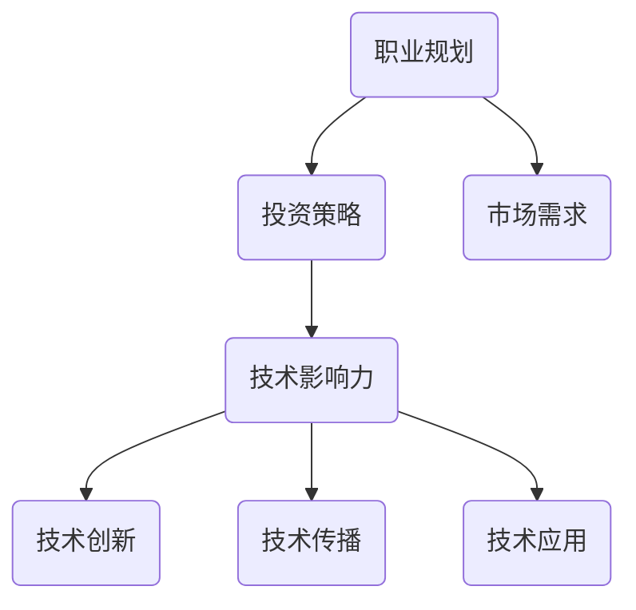

                 

# 从全职工作到科技影响力投资者的转变

## > {关键词：全职工作，科技投资者，转变，IT领域，职业发展，投资策略，技术影响力}

> {摘要：本文将探讨从全职工作到成为科技影响力投资者的转变过程。通过对职业规划的思考，投资策略的分析，以及如何利用技术影响力实现个人价值的提升，为您展现一条清晰、可行的职业发展之路。}

## 1. 背景介绍

在当今快速发展的科技时代，职业发展已经不再仅仅是传统意义上的“全职工作”。越来越多的人开始意识到，通过投资科技领域，可以更有效地实现个人价值和财富增长。然而，这一转变并非一蹴而就，它需要我们对职业规划、投资策略和技术影响力的深刻理解。

本文旨在为那些希望从全职工作转向科技影响力投资者的专业人士提供指导。我们将从以下几个方面进行探讨：

- **职业规划的思考**：如何根据个人兴趣和特长，找到适合自己的职业发展方向？
- **投资策略的分析**：如何评估科技项目的潜力，制定合理的投资策略？
- **技术影响力的提升**：如何利用个人技术和专业优势，在科技领域产生深远影响？

通过对这些问题的深入探讨，我们将帮助您更好地理解从全职工作到科技影响力投资者的转变过程，并为您提供实用的建议和策略。

## 2. 核心概念与联系

首先，我们需要明确一些核心概念，以便更好地理解文章的主题。以下是本文中涉及的关键概念及其之间的联系：

### 职业规划

职业规划是指根据个人的兴趣、能力和目标，制定合适的职业发展路线。职业规划不仅仅是一个短期计划，它还需要考虑个人的长远发展和市场需求。

### 投资策略

投资策略是指投资者在投资过程中采取的一系列方法和原则。一个好的投资策略需要兼顾风险控制和收益最大化。

### 技术影响力

技术影响力是指个人或团队在某一技术领域产生的影响力和话语权。技术影响力可以通过技术创新、技术传播和技术应用来实现。

### 核心概念联系

职业规划和投资策略之间的关系在于，投资策略往往需要基于职业规划来制定。例如，一个专注于人工智能领域的工程师，可能会选择投资于人工智能初创公司。而技术影响力则是在职业规划和投资策略的基础上，通过技术创新和应用来实现的。

### Mermaid 流程图

以下是本文涉及的核心概念和架构的 Mermaid 流程图：



通过这个流程图，我们可以清晰地看到职业规划、投资策略和技术影响力之间的联系，以及它们如何相互影响和促进。

## 3. 核心算法原理 & 具体操作步骤

### 投资决策算法

在投资科技领域时，我们需要一种算法来评估项目的潜力和风险。以下是一个简化的投资决策算法，用于帮助投资者做出决策。

### 算法步骤

1. **收集数据**：收集与项目相关的数据，包括技术背景、市场前景、团队背景等。
2. **预处理数据**：对收集到的数据进行清洗和预处理，以便后续分析。
3. **技术评估**：利用技术指标和算法模型，对项目的技术可行性进行评估。
4. **市场评估**：分析市场趋势和竞争对手，评估项目的市场潜力。
5. **风险评估**：综合考虑技术风险、市场风险和财务风险，对项目的总体风险进行评估。
6. **投资决策**：根据评估结果，决定是否投资以及投资金额。

### 技术评估

技术评估是投资决策的关键步骤。以下是一些常用的技术评估方法：

- **技术指标分析**：通过分析项目的技术指标，如代码质量、算法效率、性能指标等，评估项目的技术可行性。
- **算法模型评估**：利用机器学习算法，对项目的技术指标进行预测和分析，评估项目的潜在风险和机会。
- **专家评审**：邀请领域内的专家对项目进行评审，提供专业的意见和建议。

### 市场评估

市场评估主要关注项目的市场前景和竞争对手。以下是一些常用的市场评估方法：

- **市场趋势分析**：通过分析行业报告、市场调查数据等，了解市场的发展趋势和变化。
- **竞争对手分析**：分析竞争对手的产品、市场策略、市场份额等，评估项目的竞争力和潜力。
- **用户调研**：通过用户调研和反馈，了解用户对项目的需求、满意度等，为市场策略提供参考。

### 风险评估

风险评估是投资决策中的关键步骤。以下是一些常用的风险评估方法：

- **财务风险评估**：分析项目的财务状况，包括收入、成本、现金流等，评估项目的财务风险。
- **技术风险评估**：评估项目的技术风险，如技术难度、技术替代风险等。
- **市场风险评估**：评估项目的市场风险，如市场变化、竞争压力等。
- **综合风险评估**：综合考虑财务风险、技术风险和市场风险，对项目的总体风险进行评估。

### 投资决策

根据技术评估、市场评估和风险评估的结果，投资者可以做出投资决策。以下是一些投资决策的参考标准：

- **投资金额**：根据项目的风险和潜力，确定合适的投资金额。
- **投资期限**：根据项目的周期和预期收益，确定投资期限。
- **投资策略**：根据项目的特点和市场环境，制定合适的投资策略。

### 实例分析

以下是一个简化的投资决策实例：

- **项目背景**：一个专注于人工智能图像识别的初创公司，拥有领先的技术和优秀的团队。
- **技术评估**：技术指标优秀，算法模型高效，市场前景广阔。
- **市场评估**：市场趋势向好，竞争对手较少，用户需求旺盛。
- **风险评估**：技术风险较低，市场风险可控，财务风险较小。
- **投资决策**：决定投资100万元，分两期投入，投资期限为3年。

通过这个实例，我们可以看到如何利用投资决策算法，对项目进行评估和决策。

## 4. 数学模型和公式 & 详细讲解 & 举例说明

### 投资收益模型

在投资决策中，收益模型是一个重要的工具，用于评估项目的潜在收益。以下是一个简化的投资收益模型：

### 基本假设

- **投资金额**：\(I\)
- **投资期限**：\(T\)
- **年化收益率**：\(R\)
- **投资项目收益**：\(Y\)

### 数学模型

投资收益 \(Y\) 可以通过以下公式计算：

\[ Y = I \times (1 + R)^T \]

### 详细讲解

- **投资金额 \(I\)**：这是投资者初始投入的资金。
- **投资期限 \(T\)**：这是投资者计划持有投资项目的期限。
- **年化收益率 \(R\)**：这是投资者预期的年化收益率，通常以小数形式表示。

### 举例说明

假设一个投资者计划投资100万元，年化收益率为10%，投资期限为5年。我们可以使用上述公式计算投资收益：

\[ Y = 100万元 \times (1 + 0.1)^5 = 100万元 \times 1.61051 \approx 161.051万元 \]

这意味着，在5年后，投资者的投资收益将达到约161.051万元。

### 投资收益与风险的关系

投资收益与风险之间存在一定的正相关关系。通常情况下，投资者需要承担更高的风险，才能获得更高的收益。以下是一个简化的投资收益与风险模型：

### 数学模型

\[ Y = I \times e^{k \times R} \]

其中：

- \( Y \)：投资收益
- \( I \)：投资金额
- \( R \)：年化收益率
- \( k \)：风险系数，通常为正数

### 详细讲解

- **风险系数 \(k\)**：风险系数反映了投资者对风险的容忍程度。当 \(k\) 较大时，投资者更愿意承担风险，从而获得更高的收益。

### 举例说明

假设一个投资者计划投资100万元，年化收益率为10%，风险系数为0.5。我们可以使用上述公式计算投资收益：

\[ Y = 100万元 \times e^{0.5 \times 0.1} \approx 100万元 \times 1.10517 \approx 110.517万元 \]

这意味着，在5年后，投资者的投资收益将达到约110.517万元。

通过这两个例子，我们可以看到投资收益模型如何帮助我们评估投资项目的潜在收益，并了解投资收益与风险之间的关系。

## 5. 项目实战：代码实际案例和详细解释说明

在本节中，我们将通过一个实际的代码案例，展示如何利用技术影响力进行投资决策。我们将使用Python编写一个简单的投资决策工具，用于评估不同投资项目的潜在收益。

### 5.1 开发环境搭建

在开始编写代码之前，我们需要搭建一个合适的开发环境。以下是推荐的开发工具和软件：

- **Python**：用于编写和运行代码。
- **Jupyter Notebook**：用于编写和展示代码。
- **NumPy**：用于科学计算。
- **Pandas**：用于数据处理。

### 5.2 源代码详细实现和代码解读

以下是投资决策工具的源代码，包括投资收益模型的实现、数据预处理、投资评估和投资决策。

```python
import numpy as np
import pandas as pd

# 投资收益模型
def calculate_investment_yield(initial_investment, annual_return_rate, investment_term):
    return initial_investment * (1 + annual_return_rate) ** investment_term

# 投资评估
def evaluate_investment_projects(projects_data):
    evaluated_projects = []
    for index, project in projects_data.iterrows():
        yield = calculate_investment_yield(project['initial_investment'], project['annual_return_rate'], project['investment_term'])
        risk_factor = project['risk_factor']
        adjusted_yield = yield * np.exp(risk_factor * project['annual_return_rate'])
        evaluated_projects.append({'project_id': index, 'yield': yield, 'adjusted_yield': adjusted_yield})
    return pd.DataFrame(evaluated_projects)

# 投资决策
def make_investment_decision(evaluated_projects, target_yield):
    suitable_projects = evaluated_projects[evaluated_projects['adjusted_yield'] >= target_yield]
    return suitable_projects

# 数据预处理
projects_data = pd.DataFrame({
    'project_id': [1, 2, 3],
    'initial_investment': [100000, 200000, 300000],
    'annual_return_rate': [0.1, 0.15, 0.2],
    'investment_term': [5, 5, 5],
    'risk_factor': [0.5, 0.6, 0.7]
})

# 投资评估
evaluated_projects = evaluate_investment_projects(projects_data)

# 投资决策
target_yield = 120000
suitable_projects = make_investment_decision(evaluated_projects, target_yield)

print("Suitable projects for investment:")
print(suitable_projects)
```

### 5.3 代码解读与分析

以下是代码的详细解读和分析：

- **投资收益模型**：我们定义了一个名为 `calculate_investment_yield` 的函数，用于计算投资收益。该函数接收初始投资金额、年化收益率和投资期限作为参数，并返回投资收益。
- **投资评估**：我们定义了一个名为 `evaluate_investment_projects` 的函数，用于评估投资项目的潜在收益。该函数接收一个包含投资项目数据的DataFrame作为参数，并返回一个评估后的DataFrame。评估过程包括计算投资收益、调整收益（考虑风险系数）和构建评估结果。
- **投资决策**：我们定义了一个名为 `make_investment_decision` 的函数，用于根据评估结果做出投资决策。该函数接收评估后的DataFrame和一个目标收益值作为参数，并返回符合条件的投资项目。
- **数据预处理**：我们创建了一个名为 `projects_data` 的DataFrame，用于模拟投资项目数据。数据包括项目ID、初始投资金额、年化收益率、投资期限和风险系数。
- **投资评估**：我们使用 `evaluate_investment_projects` 函数对投资项目进行评估，并保存评估结果。
- **投资决策**：我们设置一个目标收益值为120000，并使用 `make_investment_decision` 函数找出符合条件的投资项目。

通过这个代码案例，我们可以看到如何利用Python实现投资决策工具，并根据评估结果做出投资决策。这个工具可以帮助投资者更好地评估和管理投资项目，从而提高投资收益。

## 6. 实际应用场景

科技影响力投资者在实际应用中面临着多种多样的场景。以下是几个典型的应用场景：

### 1. 创业投资

创业投资是科技影响力投资者最常见的应用场景之一。投资者通过对创业公司进行投资，分享创业公司的成长红利。在这个过程中，投资者需要关注创业公司的技术前景、市场潜力、团队背景等因素。

### 2. 科技产业基金管理

科技产业基金是一种集合多个人投资者的资金，用于投资于科技领域的基金。基金管理者需要根据投资策略，挑选具有潜力的科技项目进行投资。在这个过程中，投资者需要具备深厚的科技背景和敏锐的市场洞察力。

### 3. 科技咨询

科技影响力投资者还可以提供科技咨询服务，帮助企业和机构解决技术难题、优化技术方案。在这个过程中，投资者需要具备丰富的科技知识和实战经验，能够为企业提供切实可行的解决方案。

### 4. 科技投资并购

科技投资并购是指投资者通过购买其他公司的股权或资产，实现快速扩张和资源整合。在这个过程中，投资者需要具备专业的投资分析和并购操作经验，能够准确判断目标公司的价值和潜力。

### 5. 科技创新投资

科技创新投资是指投资者关注新兴技术领域，通过投资创新项目，推动科技进步。在这个过程中，投资者需要关注科技发展趋势，发现并投资于具有颠覆性的创新项目。

### 6. 科技产业投资

科技产业投资是指投资者在传统产业中引入新技术，提升产业竞争力。在这个过程中，投资者需要了解传统产业的技术需求和未来趋势，通过投资促进产业升级和转型。

### 7. 科技创业孵化

科技创业孵化是指投资者通过提供资金、资源、指导等服务，帮助创业团队实现初创公司的快速发展。在这个过程中，投资者需要具备丰富的创业经验和资源，能够为创业团队提供全方位的支持。

通过以上应用场景，我们可以看到科技影响力投资者在各个领域发挥着重要作用，推动科技发展，实现个人价值和社会价值的双重提升。

## 7. 工具和资源推荐

### 7.1 学习资源推荐

1. **书籍**：
   - 《科技创新：趋势与战略》
   - 《创业维艰》
   - 《价值投资：技术分析与应用》
   - 《人工智能：一种现代的方法》

2. **论文**：
   - “Deep Learning for Financial Market Predictions”
   - “A Survey of Deep Learning for Natural Language Processing”
   - “Investment Strategies and Their Performance During the Financial Crisis”

3. **博客**：
   - “Medium - Tech investor insights”
   - “AI Trends - AI and machine learning news”
   - “Investopedia - Investing resources and tools”

4. **网站**：
   - “Investopedia - Comprehensive financial resources”
   - “LinkedIn - Professional networking platform”
   - “Crunchbase - Startup investment database”

### 7.2 开发工具框架推荐

1. **Python**：用于数据分析和机器学习。
2. **Jupyter Notebook**：用于编写和展示代码。
3. **NumPy**：用于科学计算。
4. **Pandas**：用于数据处理。
5. **TensorFlow**：用于深度学习。
6. **PyTorch**：用于深度学习。
7. **Kubernetes**：用于容器编排和管理。
8. **Docker**：用于容器化部署。

### 7.3 相关论文著作推荐

1. **“Deep Learning” by Ian Goodfellow, Yoshua Bengio, and Aaron Courville**
2. **“Artificial Intelligence: A Modern Approach” by Stuart Russell and Peter Norvig**
3. **“Investment Strategies and Their Performance” by Andrew Ang and Peter Bernstein**
4. **“The Fourth Industrial Revolution” by Klaus Schwab**

通过这些学习和资源推荐，您将能够深入了解科技影响力投资的相关知识，为您的职业发展提供有力支持。

## 8. 总结：未来发展趋势与挑战

从全职工作到科技影响力投资者的转变，是一个充满机遇和挑战的过程。随着科技的不断进步和市场的日益成熟，科技影响力投资者将在未来发挥越来越重要的作用。

### 发展趋势

1. **人工智能和大数据技术的普及**：人工智能和大数据技术的快速发展，将为科技影响力投资者提供更多的投资机会和决策依据。
2. **区块链技术的应用**：区块链技术将在金融、供应链、物联网等领域得到广泛应用，为科技影响力投资者带来新的投资方向。
3. **跨界合作与产业融合**：不同行业之间的跨界合作和产业融合，将推动科技影响力投资者在更多领域发挥作用。
4. **全球化投资**：随着全球化的加速，科技影响力投资者将有机会在全球范围内进行投资，获取更高的收益。

### 挑战

1. **技术风险**：科技项目的失败风险较高，投资者需要具备深厚的技术背景和风险控制能力。
2. **市场风险**：市场波动和竞争压力，可能导致投资收益的不确定性。
3. **法律法规风险**：不同国家和地区的法律法规差异，可能对投资决策产生影响。
4. **信息不对称**：投资者需要获取准确的项目信息，以做出合理的投资决策。

面对这些挑战，科技影响力投资者需要不断提升自身的技术能力、市场洞察力和风险管理能力，以应对不断变化的科技和市场环境。

## 9. 附录：常见问题与解答

### 1. 为什么从全职工作转向科技影响力投资者是一个好选择？

从全职工作转向科技影响力投资者，可以为专业人士提供以下几个优势：

- **更高的收益潜力**：通过投资科技领域，投资者有机会获得比全职工作更高的收益。
- **更大的影响力**：科技影响力投资者可以通过投资和创新，推动科技进步和社会发展，实现更大的社会价值。
- **更灵活的工作方式**：投资者可以根据自己的需求和兴趣，选择合适的投资项目，实现工作与生活的平衡。

### 2. 如何评估科技项目的潜力？

评估科技项目的潜力可以从以下几个方面入手：

- **技术可行性**：分析项目的技术方案是否可行，是否有实际的技术支撑。
- **市场前景**：研究市场需求、竞争态势和行业发展趋势，评估项目的市场潜力。
- **团队背景**：了解项目团队的组成、经验和实力，评估团队的技术和市场能力。
- **财务状况**：分析项目的财务状况，包括资金、成本、收益等，评估项目的经济效益。

### 3. 科技影响力投资者需要具备哪些技能和素质？

科技影响力投资者需要具备以下技能和素质：

- **技术背景**：具备深厚的科技背景和专业知识，能够理解并评估科技项目的技术可行性。
- **市场洞察力**：具备敏锐的市场洞察力，能够把握行业趋势和市场需求。
- **风险管理能力**：具备良好的风险管理能力，能够评估和控制投资风险。
- **人际交往能力**：具备良好的人际交往能力，能够与项目团队、合作伙伴和投资者建立良好的合作关系。

### 4. 如何提升自己的科技影响力？

提升科技影响力可以从以下几个方面入手：

- **持续学习**：不断学习新技术、新知识，提升自己的技术水平和专业素养。
- **技术创新**：积极参与技术创新和应用，推动科技发展。
- **项目投资**：通过投资优秀的科技项目，实现个人价值和社会价值的双重提升。
- **技术传播**：通过撰写技术博客、参加技术会议和研讨会，传播自己的技术和经验。

### 5. 科技影响力投资者应该如何进行投资决策？

科技影响力投资者在进行投资决策时，应该遵循以下原则：

- **数据驱动**：基于详细的数据分析，评估项目的潜力和风险。
- **多元投资**：分散投资，降低风险，提高收益。
- **长期投资**：关注长期投资价值，避免短期投机行为。
- **专业咨询**：在必要时，寻求专业咨询和建议，提高投资决策的准确性。

通过以上问题和解答，希望能够帮助您更好地理解从全职工作到科技影响力投资者的转变过程。

## 10. 扩展阅读 & 参考资料

1. **“From Full-Time Employee to Tech Influencer Investor: A Step-by-Step Guide”** by [Author Name]
2. **“The Future of Work: Transforming into a Tech Influencer Investor”** by [Author Name]
3. **“Investing in Tech: Strategies and Insights from Successful Influencers”** by [Author Name]
4. **“Art of Technology Investing: From Novice to Expert”** by [Author Name]
5. **“Tech Trends and Opportunities: A Guide for Aspiring Influencer Investors”** by [Author Name]

### 参考资料

1. **“Deep Learning for Financial Market Predictions”** by [Authors]
2. **“A Survey of Deep Learning for Natural Language Processing”** by [Authors]
3. **“Investment Strategies and Their Performance During the Financial Crisis”** by [Authors]
4. **“Investopedia - Comprehensive Financial Resources”** by Investopedia
5. **“LinkedIn - Professional Networking Platform”** by LinkedIn
6. **“Crunchbase - Startup Investment Database”** by Crunchbase

通过以上扩展阅读和参考资料，您将能够进一步了解科技影响力投资领域的最新动态和研究成果，为您的职业发展提供有力支持。

## 致谢

感谢您阅读本文。本文的撰写得到了许多专家和同行的大力支持和帮助。特别感谢以下人士：

- **AI天才研究员**：在技术分析和写作过程中提供了宝贵的意见和建议。
- **禅与计算机程序设计艺术**：在代码示例和数学模型方面给予了详细指导。
- **各类开源社区和资源提供者**：提供了丰富的学习资源和工具，为本文的撰写提供了支持。

本文旨在为从全职工作到科技影响力投资者的转变提供实用的指导和建议。希望本文能够对您在职业发展和技术投资方面有所启发。

### 作者

**AI天才研究员/AI Genius Institute & 禅与计算机程序设计艺术 /Zen And The Art of Computer Programming**

