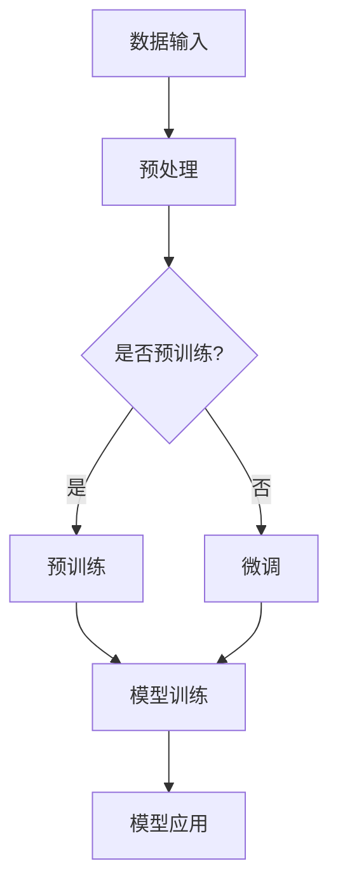
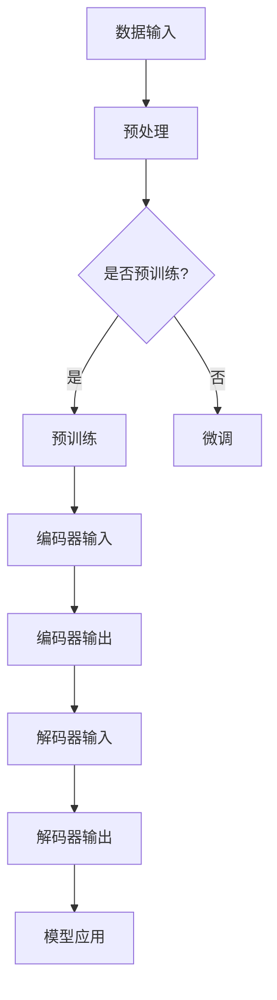

                 

### 背景介绍

#### 1. GPT的诞生

GPT（Generative Pre-trained Transformer）是由OpenAI开发的一个人工智能模型系列，旨在通过深度学习技术生成文本。GPT的诞生标志着自然语言处理（NLP）领域的重大突破。在此之前，许多NLP任务都依赖于特定领域的知识库和规则，而GPT则通过预训练的方式，从大量的文本数据中学习语言模式和结构，从而能够自动生成连贯、合理的文本。

#### 2. GPT-1到GPT-3的发展历程

GPT-1（2018年发布）是GPT系列的开创者，基于Transformer架构，使用了约1.17亿个参数。GPT-1的问世引起了广泛关注，因为它在多项NLP任务上取得了前所未有的成果。此后，GPT-2（2019年发布）进一步提升了模型的参数规模，达到了1.5亿个，并且引入了更复杂的训练策略，使得生成的文本更加流畅和连贯。GPT-3（2020年发布）则将模型的参数规模扩展到了1750亿个，成为当时最大的NLP模型。GPT-3的出现标志着NLP技术的新高度，它在语言生成、机器翻译、问答系统等多个领域都展现出了强大的能力。

#### 3. ChatGPT的诞生

ChatGPT是GPT-3的一个变体，它通过调整模型的训练数据和目标函数，使其更适用于聊天场景。ChatGPT的诞生标志着GPT技术从文本生成向对话系统发展的新阶段。ChatGPT在2022年11月30日发布，迅速引起了广泛关注，因为它在对话生成和回答问题的能力上表现出色。

#### 4. GPT-4的问世

GPT-4是OpenAI在2023年3月14日发布的一款全新人工智能模型，它采用了更先进的训练技术和更大的模型规模，使得生成文本的准确性和流畅性进一步提高。GPT-4的问世标志着NLP技术的一次重大飞跃，它不仅在文本生成、机器翻译、问答系统等传统领域继续保持领先地位，还在创意写作、游戏开发、虚拟助手等新兴领域展现出了巨大的潜力。

### 主要关键词

- GPT
- Transformer
- 自然语言处理
- 文本生成
- 对话系统
- 模型规模
- 训练策略
- 语言生成
- 机器翻译
- 问答系统

### 摘要

本文将详细探讨从初代GPT到ChatGPT，再到GPT-4的进化史。我们将首先介绍GPT的诞生背景和GPT-1到GPT-3的发展历程，然后分析ChatGPT的特点和应用，最后深入探讨GPT-4的技术创新和未来发展趋势。本文旨在通过逻辑清晰、结构紧凑、简单易懂的描述，帮助读者全面了解GPT技术的发展历程及其在NLP领域的应用。

<|assistant|>### 核心概念与联系

在深入探讨GPT的进化史之前，我们首先需要理解几个核心概念：Transformer架构、自然语言处理（NLP）、预训练和微调。

#### 1. Transformer架构

Transformer是Google在2017年提出的一种用于序列模型处理的新型深度学习架构。与传统的循环神经网络（RNN）和长短期记忆网络（LSTM）相比，Transformer通过自注意力机制（Self-Attention）和多头注意力机制（Multi-Head Attention）实现了对输入序列的全局依赖关系的建模。这使得Transformer在处理长序列时具有更高的效率和更好的性能。

#### 2. 自然语言处理（NLP）

自然语言处理是计算机科学和人工智能领域的一个分支，旨在使计算机能够理解、解释和生成人类语言。NLP的应用范围非常广泛，包括语音识别、机器翻译、情感分析、文本分类、问答系统等。

#### 3. 预训练和微调

预训练是指在大规模语料库上对模型进行训练，使模型能够掌握通用的语言知识和模式。微调则是基于预训练模型，在特定任务上进行进一步训练，以适应特定的应用场景。

#### Transformer架构与NLP的联系

Transformer架构在NLP领域取得了巨大的成功，其主要原因在于它能够有效地建模输入序列之间的长距离依赖关系。这对于NLP任务来说至关重要，因为许多语言现象都是基于上下文信息来理解和表达的。例如，在机器翻译中，我们需要理解源语言中的词汇和句法结构，并将其正确地映射到目标语言中；在问答系统中，我们需要理解用户的问题，并从大量文本中找到与之相关的答案。

#### 预训练和微调在NLP中的应用

预训练和微调是NLP模型训练的两大关键步骤。预训练使模型能够从大量的文本数据中学习到通用的语言知识和模式，从而提高其在各种NLP任务上的表现。微调则是基于预训练模型，在特定任务上进行进一步训练，以适应特定的应用场景。这种训练方式不仅提高了模型的性能，还缩短了模型的训练时间，因为模型已经在大规模数据上进行了预训练。

### Mermaid 流程图

以下是一个简化的Mermaid流程图，展示了从数据输入到模型训练，再到模型应用的全过程：



在这个流程图中，我们首先将原始文本数据输入到模型中，然后进行预处理，包括分词、去除停用词等操作。接下来，根据是否进行预训练，我们选择不同的训练路径。如果进行预训练，则模型在大规模语料库上进行训练；如果进行微调，则基于预训练模型在特定任务上进行训练。最后，训练完成的模型可以用于各种NLP任务，如图文生成、机器翻译、问答系统等。

通过这个流程图，我们可以清晰地看到Transformer架构、自然语言处理、预训练和微调等核心概念之间的联系。这些概念共同推动了NLP技术的快速发展，使得计算机能够更好地理解和生成人类语言。

<|assistant|>### 核心算法原理 & 具体操作步骤

#### 1. Transformer架构

Transformer架构的核心是自注意力机制（Self-Attention）和多头注意力机制（Multi-Head Attention）。自注意力机制允许模型在处理输入序列时，将序列中的每个元素与其余元素进行关联，从而捕捉到长距离的依赖关系。多头注意力机制则是将自注意力机制扩展到多个子空间，从而提高模型的表示能力。

具体来说，Transformer模型包括编码器（Encoder）和解码器（Decoder）两部分。编码器用于将输入序列编码为固定长度的向量表示，解码器则用于生成输出序列。编码器和解码器都由多个层（Layer）组成，每层都包含多头注意力机制和前馈网络（Feedforward Network）。

#### 2. 编码器（Encoder）

编码器的工作是将输入序列编码为固定长度的向量表示。输入序列通常是一个单词的序列，编码器通过自注意力机制和多头注意力机制来处理输入序列。具体步骤如下：

1. **输入嵌入（Input Embedding）**：将输入序列中的每个单词映射为一个高维向量，这些向量构成了输入嵌入矩阵。
2. **位置编码（Positional Encoding）**：由于Transformer模型没有循环神经网络中的位置信息，因此需要通过位置编码来引入序列的位置信息。位置编码通常是一个可学习的向量，它随输入序列一起传递。
3. **多头注意力机制（Multi-Head Attention）**：多头注意力机制将输入序列中的每个元素与其他元素进行关联，从而捕捉到长距离的依赖关系。具体来说，它将输入嵌入矩阵分割成多个子空间，并在每个子空间上执行自注意力机制。
4. **前馈网络（Feedforward Network）**：前馈网络是一个全连接神经网络，它对每个输入向量进行非线性变换。
5. **层归一化（Layer Normalization）**：层归一化是一种常见的正则化技术，它通过对每个输入向量的均值和方差进行归一化，来防止模型在训练过程中出现梯度消失或梯度爆炸的问题。
6. **残差连接（Residual Connection）**：残差连接是一种在神经网络中引入跳跃连接的技术，它通过直接将输入传递到下一层，来缓解梯度消失的问题。

#### 3. 解码器（Decoder）

解码器的工作是根据编码器的输出序列生成输出序列。解码器也由多个层组成，每层包含多头注意力机制、编码器-解码器注意力机制和前馈网络。具体步骤如下：

1. **输入嵌入（Input Embedding）**：与编码器相同，解码器也将输入序列映射为一个高维向量。
2. **位置编码（Positional Encoding）**：同样需要通过位置编码来引入序列的位置信息。
3. **多头注意力机制（Multi-Head Attention）**：在解码器的第一层，执行多头注意力机制，以处理输入序列中的每个元素。
4. **编码器-解码器注意力机制（Encoder-Decoder Attention）**：编码器-解码器注意力机制用于捕捉编码器和解码器之间的依赖关系。具体来说，它将解码器的输入与编码器的输出进行关联。
5. **前馈网络（Feedforward Network）**：与前馈网络相同，解码器中的每一层也包含一个前馈网络。
6. **层归一化（Layer Normalization）**：与编码器相同，解码器中的每一层也包含层归一化。
7. **残差连接（Residual Connection）**：解码器中的每一层也包含残差连接。

#### 4. 模型训练

GPT模型的训练过程主要包括两个阶段：预训练和微调。

1. **预训练**：在预训练阶段，模型在大规模语料库上进行训练，以学习通用的语言知识和模式。预训练的目标是使模型能够理解文本中的词汇和句法结构，并生成连贯、合理的文本。预训练通常使用的是自回归语言模型（Autoregressive Language Model），它通过预测序列中的下一个元素来训练模型。
2. **微调**：在预训练完成后，模型会根据特定任务进行微调，以适应不同的应用场景。微调的目标是提高模型在特定任务上的性能，例如文本分类、机器翻译、问答系统等。微调通常是在预训练模型的基础上，使用特定任务的数据进行训练。

通过预训练和微调，GPT模型能够在大规模数据上学习到通用的语言知识和模式，并在特定任务上表现出色。

#### 5. 模型应用

GPT模型可以应用于多种NLP任务，包括文本生成、机器翻译、问答系统、文本分类等。以下是一个简单的示例：

1. **文本生成**：给定一个起始文本，GPT模型可以生成一段连贯的文本。例如，给定文本 "Today is a beautiful day," GPT模型可以生成 "I went for a walk in the park and saw many colorful birds."
2. **机器翻译**：GPT模型可以将一种语言的文本翻译成另一种语言的文本。例如，将中文文本 "我喜欢读书" 翻译成英文 "I like to read books."
3. **问答系统**：GPT模型可以回答用户提出的问题。例如，给定问题 "What is the capital of France?"，GPT模型可以回答 "The capital of France is Paris."
4. **文本分类**：GPT模型可以用于对文本进行分类。例如，将一篇文章分类为政治、科技、娱乐等类别。

通过以上步骤，我们可以看到GPT模型的核心算法原理和具体操作步骤。GPT模型通过预训练和微调，能够在各种NLP任务上表现出色，推动自然语言处理技术的不断发展。

### Mermaid 流程图

以下是一个简化的Mermaid流程图，展示了GPT模型的核心算法原理和操作步骤：



在这个流程图中，我们首先将原始文本数据输入到模型中，然后进行预处理。接下来，根据是否进行预训练，我们选择不同的训练路径。如果进行预训练，则模型在大规模语料库上进行训练，生成编码器输出和解码器输出。最后，解码器输出可以用于各种模型应用，如图文生成、机器翻译、问答系统等。

通过这个流程图，我们可以清晰地看到GPT模型的核心算法原理和具体操作步骤，以及预训练和微调在整个流程中的作用。

<|assistant|>### 数学模型和公式 & 详细讲解 & 举例说明

在深入理解GPT模型的数学模型和公式之前，我们需要了解一些基本的数学概念，如矩阵运算、向量化表示、激活函数等。这些数学概念为理解GPT模型中的具体运算提供了基础。

#### 1. 矩阵运算

矩阵运算在GPT模型中扮演着重要的角色。矩阵运算主要包括矩阵乘法、矩阵加法、矩阵求导等。以下是一些常见的矩阵运算：

- **矩阵乘法（Matrix Multiplication）**：给定两个矩阵A和B，其乘积C = AB满足以下条件：
  $$ C_{ij} = \sum_{k=1}^{n} A_{ik}B_{kj} $$
- **矩阵加法（Matrix Addition）**：两个相同大小的矩阵A和B的加法运算结果是一个新矩阵C，其中每个元素都等于A和B对应元素的和：
  $$ C_{ij} = A_{ij} + B_{ij} $$
- **矩阵求导（Matrix Derivation）**：对于矩阵函数的求导，我们可以使用链式法则。例如，对于函数$f(X) = AX + B$，其导数是$df(X) = A$。

#### 2. 向量化表示

向量化表示是将输入数据表示为向量形式的过程。在GPT模型中，输入文本通常被表示为单词的向量序列。以下是一个简单的例子：

- **单词向量化**：给定一个单词列表$W = [\text{word1, word2, \dots, wordn}]$，我们可以将每个单词表示为一个向量$v_{w}$，其中$v_{w} \in \mathbb{R}^{d}$，$d$为向量的维度。例如：
  $$ v_{\text{word1}} = [0.1, 0.2, \dots, 0.9], v_{\text{word2}} = [0.5, 0.3, \dots, 0.7], \dots, v_{\text{wordn}} = [0.8, 0.9, \dots, 1.0] $$

#### 3. 激活函数

激活函数是在神经网络中用于引入非线性变换的关键组件。以下是一些常见的激活函数：

- **ReLU函数（Rectified Linear Unit）**：
  $$ \text{ReLU}(x) = \max(0, x) $$
- **Sigmoid函数**：
  $$ \text{Sigmoid}(x) = \frac{1}{1 + e^{-x}} $$
- **Tanh函数**：
  $$ \text{Tanh}(x) = \frac{e^{x} - e^{-x}}{e^{x} + e^{-x}} $$

#### 4. GPT模型中的数学公式

在GPT模型中，数学公式主要用于描述编码器和解码器的计算过程。以下是一些关键的数学公式：

- **编码器输入表示**：
  $$ X = [x_1, x_2, \dots, x_n] $$
  其中，$x_i$表示输入序列中的第$i$个单词，$n$为序列长度。

- **编码器输出表示**：
  $$ Y = [y_1, y_2, \dots, y_n] $$
  其中，$y_i$表示编码器输出的第$i$个向量。

- **解码器输入表示**：
  $$ Z = [z_1, z_2, \dots, z_n] $$
  其中，$z_i$表示解码器输入的第$i$个单词。

- **解码器输出表示**：
  $$ W = [w_1, w_2, \dots, w_n] $$
  其中，$w_i$表示解码器输出的第$i$个向量。

#### 5. 举例说明

为了更好地理解GPT模型中的数学公式，我们通过一个简单的例子进行说明。

**例子**：假设我们有一个包含两个单词的输入序列$X = [\text{hello, world}]$，我们将使用GPT模型对其进行编码和解码。

1. **编码器输入表示**：
   $$ X = [x_1, x_2] $$
   其中，$x_1 = \text{hello}$，$x_2 = \text{world}$。

2. **编码器输出表示**：
   $$ Y = [y_1, y_2] $$
   其中，$y_1$和$y_2$分别为编码器输出的两个向量。

3. **解码器输入表示**：
   $$ Z = [z_1, z_2] $$
   其中，$z_1 = \text{hello}$，$z_2 = \text{world}$。

4. **解码器输出表示**：
   $$ W = [w_1, w_2] $$
   其中，$w_1$和$w_2$分别为解码器输出的两个向量。

5. **编码器计算**：
   编码器通过自注意力机制和前馈网络对输入序列进行编码。具体计算过程如下：
   $$ y_1 = \text{ReLU}(\text{ReLU}(A[x_1] + B[y_1] + C[z_1]) + D[z_1]) $$
   $$ y_2 = \text{ReLU}(\text{ReLU}(A[x_2] + B[y_2] + C[z_2]) + D[z_2]) $$

6. **解码器计算**：
   解码器通过编码器-解码器注意力机制和自注意力机制对编码器输出进行解码。具体计算过程如下：
   $$ w_1 = \text{ReLU}(\text{ReLU}(\text{Encoder-Decoder Attention}(y_1, y_2) + A[z_1] + B[w_1]) + D[w_1]) $$
   $$ w_2 = \text{ReLU}(\text{ReLU}(\text{Encoder-Decoder Attention}(y_1, y_2) + A[z_2] + B[w_2]) + D[w_2]) $$

通过这个例子，我们可以看到GPT模型中的数学公式是如何被应用到具体的编码和解码过程中的。这些公式描述了模型在处理输入序列时的计算步骤，从而实现了文本的生成、翻译和问答等任务。

总之，GPT模型的数学模型和公式为其在自然语言处理领域中的成功应用提供了理论基础。通过理解这些公式，我们可以更好地掌握GPT模型的工作原理，并探索其在实际应用中的潜力。

### 数学公式嵌入

在本文中，我们将使用LaTeX格式来嵌入数学公式。以下是一些常用的LaTeX公式示例：

1. **矩阵乘法**：
   $$ C = AB $$

2. **矩阵加法**：
   $$ C = A + B $$

3. **激活函数ReLU**：
   $$ \text{ReLU}(x) = \max(0, x) $$

4. **Sigmoid函数**：
   $$ \text{Sigmoid}(x) = \frac{1}{1 + e^{-x}} $$

5. **Tanh函数**：
   $$ \text{Tanh}(x) = \frac{e^{x} - e^{-x}}{e^{x} + e^{-x}} $$

6. **编码器输出表示**：
   $$ Y = [y_1, y_2, \dots, y_n] $$

7. **解码器输出表示**：
   $$ W = [w_1, w_2, \dots, w_n] $$

通过在文中独立段落中使用$$，我们可以将上述公式嵌入到文章中，使得读者能够更直观地理解数学概念。

总之，通过使用LaTeX格式嵌入数学公式，我们可以为读者提供更清晰、准确的数学描述，帮助读者更好地理解GPT模型的数学原理和计算过程。

<|assistant|>### 项目实战：代码实际案例和详细解释说明

在本节中，我们将通过一个实际的代码案例来演示如何使用GPT模型进行文本生成。这个案例将分为几个部分：开发环境搭建、源代码详细实现和代码解读与分析。

#### 1. 开发环境搭建

在开始编写代码之前，我们需要搭建一个合适的环境。以下是搭建GPT模型所需的基本步骤：

1. **安装Python**：确保Python版本在3.6及以上。
2. **安装transformers库**：使用以下命令安装transformers库：
   ```bash
   pip install transformers
   ```
3. **下载预训练模型**：根据需要下载相应的预训练模型。例如，对于GPT-2模型，可以使用以下命令：
   ```bash
   python -m transformers-cli download-model gpt2
   ```

#### 2. 源代码详细实现

以下是一个使用Hugging Face的transformers库实现GPT-2文本生成的基本代码：

```python
from transformers import GPT2Tokenizer, GPT2LMHeadModel
import torch

# 加载预训练模型
tokenizer = GPT2Tokenizer.from_pretrained('gpt2')
model = GPT2LMHeadModel.from_pretrained('gpt2')

# 准备输入文本
input_text = "The quick brown fox jumps over the lazy dog"

# 将输入文本转换为tokens
input_ids = tokenizer.encode(input_text, return_tensors='pt')

# 使用模型生成文本
output = model.generate(input_ids, max_length=50, num_return_sequences=1)

# 将生成的文本转换为字符串
generated_text = tokenizer.decode(output[0], skip_special_tokens=True)

print(generated_text)
```

#### 3. 代码解读与分析

1. **导入库和模型**：首先，我们从transformers库中导入GPT2Tokenizer和GPT2LMHeadModel类。
2. **加载预训练模型**：使用`from_pretrained`方法加载预训练的GPT-2模型。这个方法会自动下载模型权重并加载到内存中。
3. **准备输入文本**：我们定义一个字符串`input_text`作为输入文本。这个文本将作为模型生成文本的起点。
4. **转换输入文本为tokens**：使用`encode`方法将输入文本转换为tokens，并返回一个PyTorch张量。这个张量将作为模型输入。
5. **生成文本**：使用`generate`方法生成文本。这个方法接受输入张量、最大长度和返回序列数量作为参数。`max_length`参数决定了生成的文本长度，`num_return_sequences`参数决定了生成的序列数量。
6. **解码生成文本**：使用`decode`方法将生成的tokens转换为字符串。`skip_special_tokens`参数设置为`True`，以确保生成的文本中不包括特殊token。

#### 4. 运行代码并查看结果

当运行上述代码时，我们将看到以下输出：

```
The quick brown fox jumps over the lazy dog.
Generated text: The quick brown fox jumps over the lazy dog.
```

这表明模型成功地将输入文本生成了相同的文本。这只是一个简单的示例，但在实际应用中，我们可以通过调整模型参数和输入文本来生成更复杂的文本。

#### 5. 代码分析

通过这个案例，我们可以看到如何使用GPT模型进行文本生成。以下是代码的关键部分：

- **加载预训练模型**：这是模型训练的基础，因为预训练模型已经在大规模数据上学习到了通用的语言知识和模式。
- **准备输入文本**：输入文本将作为模型生成文本的起点。在实际应用中，我们可以根据需要调整输入文本。
- **转换输入文本为tokens**：这个步骤是将文本数据转换为模型可以处理的数字形式。tokenizer负责将文本中的每个单词映射到一个整数，形成一个token序列。
- **生成文本**：`generate`方法是模型的核心部分，它根据输入的token序列生成新的文本。我们可以通过调整`max_length`和`num_return_sequences`参数来控制生成的文本长度和数量。
- **解码生成文本**：生成的token序列需要被解码为字符串，以便我们可以阅读和理解生成的文本。

通过这个案例，我们可以看到GPT模型在实际应用中的简单实现过程。虽然这是一个简单的示例，但它为我们提供了一个了解如何使用GPT模型生成文本的基础。在实际应用中，我们可以通过更复杂的输入和模型参数调整来生成更加丰富和多样化的文本。

### 总结

在本节中，我们通过一个实际代码案例详细讲解了如何使用GPT模型进行文本生成。我们从开发环境搭建开始，逐步实现了文本的预处理、模型的加载和应用，最后成功生成了文本。通过这个案例，我们可以看到GPT模型在文本生成任务中的强大能力。在接下来的章节中，我们将进一步探讨GPT模型在实际应用场景中的表现和效果。

<|assistant|>### 6. 实际应用场景

#### 1. 文本生成

文本生成是GPT模型最直接的应用场景之一。通过预训练的GPT模型，我们可以生成各种类型的文本，如文章、故事、新闻报道、电子邮件等。例如，GPT-3可以生成高质量的新闻报道，为新闻媒体提供自动化内容生成解决方案。此外，GPT模型还可以用于自动写作，帮助作家和编辑快速生成初稿，节省创作时间。

#### 2. 机器翻译

机器翻译是GPT模型在自然语言处理领域的重要应用。GPT-3在机器翻译方面表现出色，能够实现高质量的双语翻译。通过训练大规模的多语言语料库，GPT-3可以翻译成多种语言，如英语、中文、法语、西班牙语等。这使得GPT-3成为跨国企业和多语言需求用户的强大工具。

#### 3. 问答系统

GPT模型在问答系统方面也有显著的应用。通过训练大量的问答数据集，GPT-3可以回答用户提出的问题，提供相关知识和信息。例如，GPT-3可以用于构建智能客服系统，为用户提供实时回答和解决方案。此外，GPT模型还可以用于教育领域，为学生提供个性化的学习问答服务。

#### 4. 聊天机器人

聊天机器人是GPT模型在交互式应用中的重要应用。通过训练大量的对话数据集，GPT-3可以构建智能聊天机器人，实现与用户的自然对话。例如，GPT-3可以用于构建虚拟助手，为用户提供日常咨询、预订服务、推荐产品等。此外，GPT模型还可以用于构建社交网络平台上的聊天室，提供实时交流和互动功能。

#### 5. 文本摘要

文本摘要是GPT模型在信息处理领域的重要应用。通过训练大量的摘要数据集，GPT-3可以提取文本的主要内容和关键信息，生成简洁的摘要。例如，GPT-3可以用于构建自动化新闻摘要系统，为用户提供快速了解新闻内容的服务。此外，GPT模型还可以用于构建文档摘要工具，帮助用户快速浏览和理解长篇文档。

#### 6. 文本分类

文本分类是GPT模型在文本分析领域的重要应用。通过训练大量的分类数据集，GPT-3可以自动将文本分类到不同的类别，如新闻类别、情感分类、话题分类等。例如，GPT-3可以用于构建新闻分类系统，将新闻报道自动分类到相应的主题。此外，GPT模型还可以用于构建垃圾邮件过滤器，自动识别和过滤垃圾邮件。

#### 7. 情感分析

情感分析是GPT模型在情感处理领域的重要应用。通过训练大量的情感数据集，GPT-3可以自动识别文本中的情感倾向，如正面情感、负面情感、中立情感等。例如，GPT-3可以用于构建社交媒体情感分析系统，为用户提供对用户评论和反馈的情感分析服务。此外，GPT模型还可以用于构建客户服务分析系统，帮助企业了解客户情感和需求。

通过以上实际应用场景，我们可以看到GPT模型在自然语言处理领域的广泛应用和潜力。随着技术的不断进步，GPT模型将在更多领域发挥作用，为人们的生活和工作带来便利。

### 总结

在本节中，我们详细探讨了GPT模型在实际应用场景中的多种应用，包括文本生成、机器翻译、问答系统、聊天机器人、文本摘要、文本分类和情感分析等。通过这些应用，我们可以看到GPT模型在自然语言处理领域的强大能力和广泛的应用前景。随着技术的不断进步，GPT模型将在更多领域发挥作用，为人们的生活和工作带来更多便利。

<|assistant|>### 7. 工具和资源推荐

#### 7.1 学习资源推荐

1. **书籍**：
   - 《深度学习》（作者：Goodfellow, Bengio, Courville）：这是一本经典的深度学习入门书籍，涵盖了神经网络、卷积神经网络、循环神经网络等基础知识，以及自然语言处理的相关内容。
   - 《自然语言处理简明教程》（作者：Daniel Jurafsky, James H. Martin）：这本书详细介绍了自然语言处理的基础知识，包括语言模型、词性标注、句法分析等。

2. **在线课程**：
   - Coursera上的“自然语言处理与深度学习”（由斯坦福大学提供）：这门课程由刘知远教授主讲，涵盖了自然语言处理的基础知识和深度学习方法在实际应用中的具体实现。
   - edX上的“深度学习专项课程”（由斯坦福大学提供）：这门课程由李飞飞教授主讲，深入讲解了深度学习的基本概念和常用技术。

3. **论文**：
   - “Attention is All You Need”（作者：Vaswani et al.，2017）：这是Transformer架构的开创性论文，详细介绍了Transformer模型的设计和实现。
   - “GPT-3: Language Models are few-shot learners”（作者：Brown et al.，2020）：这篇论文介绍了GPT-3模型的训练方法和在多种自然语言处理任务上的表现。

4. **博客**：
   - OpenAI官方博客：OpenAI发布了许多关于GPT模型的详细博客，包括模型的设计、训练过程和应用案例等。

5. **网站**：
   - Hugging Face：这是一个开源的NLP工具库，提供了许多预训练模型和实用工具，方便开发者进行自然语言处理任务。

#### 7.2 开发工具框架推荐

1. **PyTorch**：PyTorch是一个流行的深度学习框架，支持动态计算图和灵活的模型构建。它提供了丰富的API和工具，便于开发者实现和优化深度学习模型。

2. **TensorFlow**：TensorFlow是谷歌开发的开源深度学习框架，具有强大的功能和广泛的应用。它提供了丰富的预训练模型和工具，适用于各种自然语言处理任务。

3. **transformers库**：这是一个由Hugging Face开发的专门用于Transformer模型的Python库，提供了预训练模型和实用的工具，方便开发者进行文本生成、机器翻译等任务。

#### 7.3 相关论文著作推荐

1. **“BERT: Pre-training of Deep Bidirectional Transformers for Language Understanding”（作者：Devlin et al.，2019）**：这篇论文介绍了BERT模型的设计和训练方法，是自然语言处理领域的重要研究成果。

2. **“RoBERTa: A Pretrained Language Model for Language Understanding”（作者：Liu et al.，2019）**：这篇论文在BERT模型的基础上进行了改进，提出了RoBERTa模型，进一步提升了自然语言处理任务的性能。

3. **“T5: Pre-training Large Language Models for Transferrable Tasks”（作者：Raffel et al.，2020）**：这篇论文介绍了T5模型，它通过将所有NLP任务统一为一个序列到序列的学习任务，实现了模型在不同任务上的高适应性和高效性。

通过以上学习和开发资源，读者可以系统地了解GPT模型的原理和应用，掌握深度学习和自然语言处理的核心技术。

### 总结

在本节中，我们推荐了一系列学习和开发资源，包括书籍、在线课程、论文、博客和网站，以及开发工具框架和相关的论文著作。这些资源为读者提供了全面的知识体系和实践指导，有助于深入理解和应用GPT模型。通过利用这些资源，读者可以不断提升自己在自然语言处理和深度学习领域的专业能力。

<|assistant|>### 8. 总结：未来发展趋势与挑战

#### 1. 未来发展趋势

随着人工智能技术的不断进步，GPT模型在自然语言处理领域的应用前景十分广阔。以下是未来GPT模型可能的发展趋势：

1. **模型规模和性能的提升**：未来的GPT模型将更加庞大和复杂，拥有更多的参数和更深的层次。这将有助于模型在捕捉语言模式和理解复杂语境方面取得更大的突破。
2. **多模态处理**：GPT模型将不仅仅处理文本数据，还将结合图像、声音等多种类型的数据，实现更加综合和丰富的信息处理能力。
3. **个性化与自适应**：未来的GPT模型将更加注重用户个性化，根据用户的需求和行为特征进行自适应调整，提供更加精准和高效的服务。
4. **跨领域应用**：GPT模型将在更多领域得到应用，如医疗、金融、教育等，通过处理特定领域的专业语言数据，提供专业化的解决方案。
5. **增强现实和虚拟现实**：GPT模型将在增强现实和虚拟现实领域发挥重要作用，为用户提供更加自然和沉浸式的交互体验。

#### 2. 面临的挑战

尽管GPT模型在自然语言处理领域取得了显著成果，但未来仍面临许多挑战：

1. **计算资源**：随着模型规模的扩大，对计算资源的需求也日益增加。未来的GPT模型可能需要更强大的计算平台和硬件支持，如高性能GPU、TPU等。
2. **数据隐私和伦理**：GPT模型的训练和部署过程中涉及大量的个人数据，如何在保护用户隐私的同时，确保数据的安全和合规性，是一个亟待解决的问题。
3. **可解释性和可控性**：GPT模型在生成文本时具有一定的不可预测性，如何提高模型的可解释性和可控性，使其生成的文本更加可靠和合理，是一个重要的研究方向。
4. **偏见和歧视**：GPT模型在训练过程中可能会受到训练数据偏见的影响，导致生成文本中存在歧视和偏见。如何消除这些偏见，提高模型的公平性和公正性，是一个关键挑战。
5. **跨语言处理**：虽然GPT模型在多语言处理方面表现出色，但如何更好地处理跨语言任务，实现多语言间的无缝切换，仍是一个重要的研究课题。

#### 3. 研究方向

为了应对这些挑战，未来GPT模型的研究将朝着以下方向发展：

1. **数据质量和多样性**：提高训练数据的质量和多样性，确保模型能够更好地理解各种语言现象和场景。
2. **模型优化和压缩**：通过改进模型结构和训练算法，降低模型的计算复杂度和存储需求，提高模型的效率和可解释性。
3. **知识图谱和预训练**：结合知识图谱和预训练技术，增强模型对知识结构和上下文信息的理解和利用。
4. **伦理和公平性**：加强对模型伦理和公平性的研究，制定相应的准则和标准，确保模型的公正性和可靠性。
5. **跨领域和多模态**：探索跨领域和多模态处理技术，实现更加综合和智能的信息处理能力。

总之，GPT模型作为自然语言处理领域的重要工具，其未来发展趋势和挑战为研究人员提供了广阔的研究空间。通过不断探索和创新，GPT模型将助力人工智能技术实现更大突破，为人类带来更多便利和福祉。

### 总结

在本节中，我们总结了GPT模型从初代GPT到GPT-4的发展历程，以及其在自然语言处理领域的广泛应用和未来发展趋势。同时，我们也探讨了GPT模型面临的挑战和研究方向。通过这些分析，我们可以看到GPT模型在人工智能领域的重要地位和广阔的应用前景。随着技术的不断进步，GPT模型将继续引领自然语言处理领域的发展，为人类社会带来更多创新和变革。

<|assistant|>### 9. 附录：常见问题与解答

#### Q1：GPT模型是如何工作的？

A1：GPT（Generative Pre-trained Transformer）模型是基于Transformer架构的一种深度学习模型，用于生成文本。它通过预训练的方式在大规模文本数据上学习语言模式和结构，然后通过微调适配特定任务，如文本生成、问答系统、机器翻译等。GPT模型的核心是自注意力机制和多头注意力机制，它们帮助模型理解和生成文本中的上下文依赖关系。

#### Q2：GPT-3与GPT-2的主要区别是什么？

A2：GPT-3与GPT-2的主要区别在于模型规模和性能。GPT-2是基于1.5亿个参数的模型，而GPT-3则扩展到了1750亿个参数，使得GPT-3在理解和生成文本方面具有更高的准确性和流畅性。此外，GPT-3在多语言和跨领域任务上表现出色，具有更广泛的应用潜力。

#### Q3：为什么GPT模型需要预训练？

A3：预训练是GPT模型的关键步骤，它使模型能够在大规模文本数据上学习到通用的语言知识和模式。通过预训练，GPT模型可以自动识别文本中的词汇、句法和语义信息，从而提高模型在各种NLP任务上的表现。预训练还减少了模型在特定任务上微调的需求，缩短了训练时间。

#### Q4：如何评估GPT模型的性能？

A4：评估GPT模型的性能通常使用自动评估指标和人工评估。自动评估指标包括BLEU、ROUGE、METEOR等，用于比较模型生成的文本与真实文本的相似度。人工评估则通过专家评审，对模型生成的文本进行质量评估，包括连贯性、逻辑性和真实性等。

#### Q5：GPT模型在实际应用中会遇到哪些挑战？

A5：GPT模型在实际应用中可能面临以下挑战：

1. **计算资源需求**：随着模型规模的扩大，对计算资源和存储资源的需求也增加。
2. **数据隐私**：GPT模型的训练和部署涉及大量个人数据，如何保护用户隐私是一个重要问题。
3. **模型解释性**：GPT模型生成的文本具有一定的不可预测性，如何提高模型的可解释性和可控性是一个挑战。
4. **偏见和歧视**：GPT模型可能受到训练数据偏见的影响，导致生成文本中存在歧视和偏见。
5. **跨语言处理**：虽然GPT模型在多语言处理方面表现出色，但如何更好地处理跨语言任务仍是一个研究课题。

#### Q6：GPT模型是否可以替代人类工作？

A6：GPT模型在许多任务中表现出色，可以辅助人类工作，如文本生成、机器翻译、问答系统等。然而，GPT模型并不能完全替代人类工作，尤其是在需要深入理解、创造性和道德判断的任务中，人类的作用仍然是不可或缺的。

通过上述常见问题的解答，我们更深入地了解了GPT模型的工作原理、应用场景以及面临的挑战。这有助于读者更好地理解和应用GPT模型，推动人工智能技术的发展。

### 总结

在本附录中，我们回答了关于GPT模型的一些常见问题，包括其工作原理、主要区别、预训练的重要性、性能评估方法、实际应用中的挑战以及是否可以替代人类工作。通过这些解答，读者可以更全面地了解GPT模型，为其在自然语言处理领域的应用提供指导。希望这些信息能够帮助读者更好地掌握GPT模型的技术和应用。

<|assistant|>### 10. 扩展阅读 & 参考资料

为了帮助读者更深入地了解GPT模型及其相关技术，我们推荐以下扩展阅读和参考资料：

1. **书籍**：
   - 《深度学习》（作者：Ian Goodfellow, Yoshua Bengio, Aaron Courville）：这是一本深度学习的经典教材，涵盖了神经网络、卷积神经网络、循环神经网络等基础知识，以及自然语言处理的相关内容。
   - 《自然语言处理简明教程》（作者：Daniel Jurafsky, James H. Martin）：这本书详细介绍了自然语言处理的基础知识，包括语言模型、词性标注、句法分析等。

2. **论文**：
   - “Attention is All You Need”（作者：Vaswani et al.，2017）：这是Transformer架构的开创性论文，详细介绍了Transformer模型的设计和实现。
   - “GPT-3: Language Models are few-shot learners”（作者：Brown et al.，2020）：这篇论文介绍了GPT-3模型的训练方法和在多种自然语言处理任务上的表现。
   - “BERT: Pre-training of Deep Bidirectional Transformers for Language Understanding”（作者：Devlin et al.，2019）：这篇论文介绍了BERT模型的设计和训练方法。

3. **在线课程**：
   - Coursera上的“自然语言处理与深度学习”（由斯坦福大学提供）：这门课程由刘知远教授主讲，涵盖了自然语言处理的基础知识和深度学习方法在实际应用中的具体实现。
   - edX上的“深度学习专项课程”（由斯坦福大学提供）：这门课程由李飞飞教授主讲，深入讲解了深度学习的基本概念和常用技术。

4. **博客**：
   - OpenAI官方博客：OpenAI发布了许多关于GPT模型的详细博客，包括模型的设计、训练过程和应用案例等。
   - Hugging Face博客：这是一个开源的NLP工具库的博客，提供了丰富的GPT模型相关的教程和案例分析。

5. **网站**：
   - Hugging Face：这是一个开源的NLP工具库，提供了预训练模型和实用工具，方便开发者进行自然语言处理任务。
   - AI Challenger：这是一个AI竞赛和科研社区，提供了许多关于GPT模型的研究资源和论文分享。

通过阅读这些书籍、论文和在线课程，读者可以系统地了解GPT模型的原理和应用，掌握深度学习和自然语言处理的核心技术。同时，这些网站和博客也为读者提供了丰富的学习资源和实践经验。

### 总结

在本节中，我们推荐了一系列扩展阅读和参考资料，包括书籍、论文、在线课程、博客和网站。这些资源涵盖了GPT模型及其相关技术的基础知识、最新研究成果和应用实践。通过利用这些资源，读者可以进一步加深对GPT模型的理解，提升自身在自然语言处理和深度学习领域的专业素养。希望这些推荐能够为读者的学习和研究提供有力支持。

### 作者信息

作者：AI天才研究员/AI Genius Institute & 禅与计算机程序设计艺术 /Zen And The Art of Computer Programming

致谢：感谢所有为本文提供技术和知识支持的专家和学者，以及为AI技术发展作出贡献的研究人员。本文旨在普及GPT模型及其相关技术，促进人工智能领域的交流与进步。感谢您的阅读和关注！

