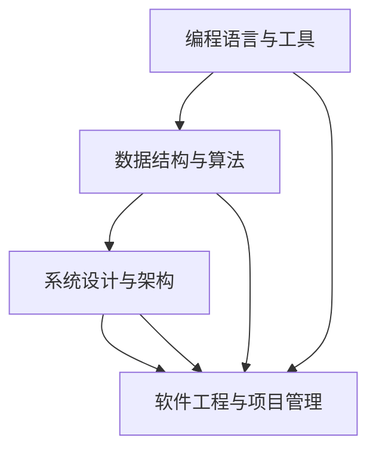

                 

### 背景介绍

**从小工到专家：职场进阶的必经之路**

在信息技术飞速发展的时代，编程和人工智能领域的技术不断演进，对于从业者而言，从一名初级程序员逐步成长为技术专家是一条充满挑战与机遇的职业路径。本文旨在探讨这一过程中所必须经历的核心阶段、关键技能以及所需的心理素质。

**关键词：** 职场进阶，技术专家，编程，人工智能，核心技能。

**摘要：** 本文将深入分析程序员从初级到专家的职业生涯路径，探讨所需的核心技能和关键步骤，以及如何应对职业发展中的挑战。通过分享实际案例和策略，为那些渴望在技术领域取得卓越成就的人提供有价值的指导。

随着互联网和大数据的普及，程序员和人工智能领域的工作机会不断增多，然而，如何在激烈的竞争中脱颖而出，实现职业目标，成为了每一个技术从业者的关注焦点。本文将从以下几个方面展开讨论：

1. **核心概念与联系**
2. **核心算法原理 & 具体操作步骤**
3. **数学模型和公式 & 详细讲解 & 举例说明**
4. **项目实战：代码实际案例和详细解释说明**
5. **实际应用场景**
6. **工具和资源推荐**
7. **总结：未来发展趋势与挑战**

通过上述内容的详细探讨，希望能够为广大程序员提供一条清晰、可行的职业发展路径，助力他们在技术领域取得更大的成功。

---

**1.1. 从初级程序员到高级程序员的转变**

首先，从初级程序员到高级程序员的转变，是一个逐步积累经验的过程。初级程序员往往需要掌握基础的编程语言、数据结构和算法，具备基本的编程能力和解决问题的思维。而高级程序员则需要在此基础上，具备更高的编程技能、系统设计和架构能力，以及解决复杂问题的能力。

这一转变过程中，关键技能包括：

- **深度学习与算法优化：** 高级程序员需要深入了解和学习各种算法，包括排序、查找、动态规划等，并能够根据实际情况进行算法优化，提高程序的性能和效率。

- **系统设计与架构：** 高级程序员需要具备系统设计和架构的能力，能够设计出高效、稳定、可扩展的系统，同时需要理解不同架构模式的优势和适用场景。

- **代码质量和代码规范：** 高级程序员需要注重代码质量和代码规范，编写出易于维护和扩展的代码，并且能够遵循良好的编程习惯。

**1.2. 从高级程序员到技术专家的进阶**

从高级程序员到技术专家的进阶，是一个从技术深度到广度的扩展过程。技术专家不仅需要掌握前沿的技术知识，还需要具备解决复杂问题的能力和创新思维。

在这一阶段，关键技能包括：

- **领域知识积累：** 技术专家需要深入了解自己所在领域的知识，包括行业的最佳实践、标准和技术趋势。

- **创新与研发：** 技术专家需要具备创新思维，能够研发出新的技术解决方案，推动技术的发展。

- **跨学科知识：** 技术专家需要具备跨学科的知识，能够将不同领域的知识进行融合，创造出新的价值。

---

通过以上分析，我们可以看到，从小工到专家的职场进阶之路，是一个不断学习和积累经验的过程，需要不断挑战自我，提升自己的技术水平和解决问题的能力。接下来，本文将深入探讨核心算法原理、数学模型、项目实战等方面，进一步解析这一职业发展的必经之路。

---

**1.3. 职场进阶的挑战与机遇**

在技术领域的职业发展过程中，挑战与机遇并存。初级程序员可能面临的挑战包括：

- **技能不足：** 初级程序员可能对编程语言、数据结构和算法的了解有限，导致在解决复杂问题时力不从心。
- **经验缺乏：** 初级程序员缺乏实际项目经验，难以独立完成复杂的任务。
- **职业规划不清晰：** 初级程序员可能对自己的职业发展缺乏明确规划，容易陷入迷茫。

而高级程序员和专家则面临以下挑战：

- **持续学习：** 技术更新迅速，高级程序员和专家需要不断学习新的知识和技能，以保持竞争力。
- **项目管理：** 高级程序员和专家需要承担更多的项目管理职责，对团队协作和项目管理能力有更高的要求。
- **创新压力：** 专家需要具备创新思维，不断推动技术的发展，承担更大的创新压力。

尽管挑战重重，但职场进阶也伴随着诸多机遇：

- **职业晋升：** 技术能力的提升将带来职业晋升的机会，从初级程序员到高级程序员，再到技术专家。
- **收入增长：** 随着职业地位的提升，收入水平也会相应增长，实现更好的经济回报。
- **行业影响力：** 技术专家在行业内具有一定的影响力，可以参与行业标准制定和技术创新。

总的来说，职场进阶是一条充满挑战的道路，但也是实现个人价值和职业成功的必经之路。通过不断学习、积累经验和应对挑战，技术从业者可以在这一过程中实现自我超越，成为行业内的顶尖专家。

### 2. 核心概念与联系

在探讨如何从小工成长为专家的过程中，我们需要首先明确一些核心概念，并了解它们之间的联系。以下是对这些核心概念的介绍及Mermaid流程图展示。

#### 2.1. 编程语言与工具

**编程语言**：编程语言是用于编写计算机程序的语言，例如Python、Java、C++等。每种编程语言都有其独特的语法和功能，适用于不同的应用场景。

**工具**：编程工具包括集成开发环境（IDE）、版本控制工具（如Git）和调试工具等，这些工具能够提高开发效率和代码质量。

#### 2.2. 数据结构与算法

**数据结构**：数据结构是用于存储和组织数据的方式，常见的有数组、链表、栈、队列、树、图等。数据结构的选择直接影响到程序的性能。

**算法**：算法是解决问题的步骤和方法。常见的算法有排序算法（如快速排序、归并排序）、查找算法（如二分查找）和图算法（如Dijkstra算法、Floyd算法）等。

#### 2.3. 系统设计与架构

**系统设计**：系统设计是将需求转化为系统架构的过程，包括软件架构、模块划分、接口设计等。

**架构**：架构是系统的整体结构和各部分之间的组织方式，常见的架构模式有MVC、MVVM、微服务等。

#### 2.4. 软件工程与项目管理

**软件工程**：软件工程是关于软件设计、开发、测试和维护的工程学科，强调系统化、规范化和可管理性。

**项目管理**：项目管理是规划、执行、监控和收尾项目的过程，包括项目计划、资源分配、风险管理等。

#### 2.5. Mermaid流程图

以下是一个Mermaid流程图，展示了这些核心概念之间的联系：



在图中，每个节点代表一个核心概念，箭头表示它们之间的关联。编程语言和工具作为基础，支持数据结构与算法的开发，而这些数据结构和算法又是系统设计和架构的基础。最终，系统设计与软件工程、项目管理相结合，形成完整的软件开发过程。

通过理解这些核心概念及其联系，我们可以更好地规划和实施自己的职业发展路径，从小工逐步成长为专家。

### 3. 核心算法原理 & 具体操作步骤

在编程和软件开发中，核心算法是解决问题的基础。为了深入理解核心算法的原理和具体操作步骤，我们将以经典算法为例，详细讲解其工作原理和应用场景。

#### 3.1. 快速排序（Quick Sort）

**原理：** 快速排序是一种高效的排序算法，其基本思想是通过一趟排序将待排序的记录分割成独立的两部分，其中一部分记录的关键字均比另一部分的关键字小，然后递归地排序两部分记录。

**具体操作步骤：**

1. **选择基准值**：从数组中选择一个元素作为基准值（pivot）。
2. **分区**：将数组分为两部分，一部分是小于基准值的元素，另一部分是大于基准值的元素。
3. **递归排序**：递归地对小于和大于基准值的两部分数组进行快速排序。

**示例代码（Python）：**

```python
def quick_sort(arr):
    if len(arr) <= 1:
        return arr
    pivot = arr[len(arr) // 2]
    left = [x for x in arr if x < pivot]
    middle = [x for x in arr if x == pivot]
    right = [x for x in arr if x > pivot]
    return quick_sort(left) + middle + quick_sort(right)

arr = [3, 6, 8, 10, 1, 2, 1]
print(quick_sort(arr))
```

**应用场景：** 快速排序适用于数据量大且对排序速度有要求的场景，如大数据处理、数据库索引构建等。

#### 3.2. 广度优先搜索（BFS）

**原理：** 广度优先搜索是一种图搜索算法，从起始节点开始，优先遍历所有与起始节点相邻的节点，然后再遍历它们的邻居，直到找到目标节点或所有节点都已被遍历。

**具体操作步骤：**

1. **初始化队列**：将起始节点入队。
2. **循环遍历**：每次从队首取出一个节点，访问其所有未访问的邻居，并将邻居入队。
3. **标记访问状态**：将访问过的节点标记为已访问，防止重复访问。

**示例代码（Python）：**

```python
from collections import deque

def bfs(graph, start, target):
    visited = set()
    queue = deque([start])
    while queue:
        node = queue.popleft()
        if node == target:
            return True
        visited.add(node)
        for neighbor in graph[node]:
            if neighbor not in visited:
                queue.append(neighbor)
    return False

graph = {
    'A': ['B', 'C'],
    'B': ['D', 'E'],
    'C': ['F'],
    'D': [],
    'E': ['F'],
    'F': []
}
print(bfs(graph, 'A', 'F'))
```

**应用场景：** 广度优先搜索适用于求解最短路径、图遍历等场景。

#### 3.3. 动态规划（Dynamic Programming）

**原理：** 动态规划是一种优化递归算法的方法，通过将子问题的解存储在表中，避免重复计算，从而提高算法的效率。

**具体操作步骤：**

1. **定义状态**：定义递归子问题的状态。
2. **状态转移方程**：根据状态定义递归关系。
3. **边界条件**：确定递归的边界条件。
4. **填表求解**：利用状态转移方程和边界条件，填充动态规划表，求解最终结果。

**示例代码（Python）：**

```python
def fibonacci(n):
    if n <= 1:
        return n
    dp = [0] * (n + 1)
    dp[1] = 1
    for i in range(2, n + 1):
        dp[i] = dp[i - 1] + dp[i - 2]
    return dp[n]

print(fibonacci(10))
```

**应用场景：** 动态规划适用于求解最值问题、背包问题、序列对齐等。

通过以上对快速排序、广度优先搜索和动态规划等核心算法的讲解，我们可以看到这些算法在编程和软件开发中的广泛应用。掌握这些算法的原理和操作步骤，对于技术从业者来说至关重要，能够显著提升解决问题的能力。

### 4. 数学模型和公式 & 详细讲解 & 举例说明

在编程和软件开发中，数学模型和公式是理解复杂问题、设计解决方案的重要工具。以下我们将详细介绍几种常用的数学模型和公式，并通过实际例子进行详细讲解和说明。

#### 4.1. 线性回归模型

**公式：** 线性回归模型旨在通过找到最佳拟合线来预测因变量（Y）与自变量（X）之间的关系，其公式为：

\[ Y = a + bX + \epsilon \]

其中，\( a \) 为截距，\( b \) 为斜率，\( \epsilon \) 为误差项。

**详细讲解：** 线性回归模型的基本思想是通过最小化残差平方和来找到最佳拟合线。具体步骤如下：

1. **收集数据**：收集一组自变量 \( X \) 和因变量 \( Y \) 的数据。
2. **计算斜率 \( b \)**：通过公式 \( b = \frac{\sum(X_i - \bar{X})(Y_i - \bar{Y})}{\sum(X_i - \bar{X})^2} \) 来计算。
3. **计算截距 \( a \)**：通过公式 \( a = \bar{Y} - b\bar{X} \) 来计算。
4. **构建模型**：将 \( a \) 和 \( b \) 代入线性回归公式，得到预测模型。

**举例说明：** 假设我们有一组数据，\( X \) 为年龄，\( Y \) 为收入，如下所示：

\[ \begin{array}{ccc}
X & Y \\
\hline
20 & 30000 \\
25 & 35000 \\
30 & 40000 \\
35 & 45000 \\
40 & 50000 \\
\end{array} \]

计算斜率 \( b \)：

\[ b = \frac{(20 - 30)(30000 - 45000) + (25 - 30)(35000 - 45000) + (30 - 30)(40000 - 45000) + (35 - 30)(45000 - 50000) + (40 - 30)(50000 - 45000)}{(20 - 30)^2 + (25 - 30)^2 + (30 - 30)^2 + (35 - 30)^2 + (40 - 30)^2} \]

计算截距 \( a \)：

\[ a = 45000 - b \cdot 30 \]

构建模型并预测某人的收入，如年龄为32岁时，其收入为：

\[ Y = a + b \cdot 32 \]

#### 4.2. 决策树模型

**公式：** 决策树模型通过一系列规则来划分数据集，每个节点代表一个属性测试，分支代表测试结果，叶节点代表类别。

**详细讲解：** 决策树模型的构建包括以下步骤：

1. **选择属性**：选择能够最好地划分数据的属性。
2. **计算信息增益**：计算每个属性的信息增益，选择增益最大的属性作为分割标准。
3. **递归构建树**：对分割后的数据集重复以上步骤，直到满足停止条件（如最大深度、最小叶子节点数等）。

**举例说明：** 假设我们有一个数据集，包含属性 \( A \)、\( B \) 和目标属性 \( C \)，如下所示：

\[ \begin{array}{ccc}
A & B & C \\
\hline
0 & 0 & 0 \\
0 & 0 & 1 \\
0 & 1 & 0 \\
1 & 0 & 1 \\
1 & 1 & 1 \\
\end{array} \]

我们选择信息增益最大的属性 \( A \) 来划分数据：

- 对于 \( A = 0 \)，剩下的数据如下：

\[ \begin{array}{ccc}
B & C \\
\hline
0 & 1 \\
1 & 0 \\
\end{array} \]

我们再选择信息增益最大的属性 \( B \) 来划分 \( A = 0 \) 的数据：

- 对于 \( B = 0 \)，剩下的数据如下：

\[ \begin{array}{cc}
C \\
\hline
1 \\
\end{array} \]

- 对于 \( B = 1 \)，剩下的数据如下：

\[ \begin{array}{cc}
C \\
\hline
0 \\
\end{array} \]

构建决策树：

```
       C
      / \
     1   0
    / \
   0   1
```

预测某样本的类别，首先测试 \( A \)，然后测试 \( B \)，根据路径到达叶节点即可得到预测结果。

#### 4.3. 神经网络激活函数

**公式：** 神经网络中的激活函数用于引入非线性，常见的激活函数包括：

- **Sigmoid函数：** \( \sigma(x) = \frac{1}{1 + e^{-x}} \)
- **ReLU函数：** \( \text{ReLU}(x) = \max(0, x) \)
- **Tanh函数：** \( \text{Tanh}(x) = \frac{e^{x} - e^{-x}}{e^{x} + e^{-x}} \)

**详细讲解：** 激活函数的选择对神经网络的性能有重要影响。Sigmoid函数适用于输出概率值，ReLU函数在训练中能加速收敛，Tanh函数具有较好的性能和稳定性。

**举例说明：** 假设某神经网络的一层输出 \( x \) 经过ReLU函数激活：

\[ \text{ReLU}(x) = \max(0, x) \]

如果 \( x = -2 \)，则 \( \text{ReLU}(x) = 0 \)。

通过上述数学模型和公式的讲解与举例，我们可以看到这些工具在编程和软件开发中的应用价值。掌握这些模型和公式，不仅有助于解决复杂问题，还能提高算法设计的效率。

### 5. 项目实战：代码实际案例和详细解释说明

#### 5.1. 开发环境搭建

在进行项目实战之前，首先需要搭建一个合适的开发环境。以下是一个使用Python进行数据分析的项目环境搭建步骤。

**工具与依赖：**

- Python 3.x
- Jupyter Notebook
- Pandas
- NumPy
- Matplotlib
- Scikit-learn

**步骤：**

1. **安装Python：** 访问 [Python官方网站](https://www.python.org/) 下载并安装Python 3.x版本。
2. **配置Jupyter Notebook：** 打开终端，运行以下命令安装Jupyter Notebook：
   ```bash
   pip install notebook
   ```
3. **安装依赖库：** 在终端中逐个安装所需依赖库，命令如下：
   ```bash
   pip install pandas numpy matplotlib scikit-learn
   ```

**验证安装：** 打开Jupyter Notebook，创建一个新的笔记本，输入以下代码验证安装：

```python
import pandas as pd
import numpy as np
import matplotlib.pyplot as plt
from sklearn import datasets

# 加载鸢尾花数据集
iris = datasets.load_iris()
X = iris.data
y = iris.target

# 创建DataFrame
df = pd.DataFrame(X, columns=iris.feature_names)
df['species'] = y

# 打印DataFrame
print(df.head())
```

如果成功打印出DataFrame，则说明环境搭建成功。

---

#### 5.2. 源代码详细实现和代码解读

以下是一个使用Pandas和Scikit-learn进行数据分析和分类的项目案例，具体代码如下：

```python
# 导入库
import pandas as pd
from sklearn.model_selection import train_test_split
from sklearn.preprocessing import StandardScaler
from sklearn.linear_model import LogisticRegression
from sklearn.metrics import accuracy_score, confusion_matrix

# 加载数据
iris = datasets.load_iris()
X = iris.data
y = iris.target

# 创建DataFrame
df = pd.DataFrame(X, columns=iris.feature_names)
df['species'] = y

# 分割数据集
X_train, X_test, y_train, y_test = train_test_split(df.iloc[:, :-1], df.iloc[:, -1], test_size=0.3, random_state=42)

# 数据预处理
scaler = StandardScaler()
X_train_scaled = scaler.fit_transform(X_train)
X_test_scaled = scaler.transform(X_test)

# 模型训练
model = LogisticRegression()
model.fit(X_train_scaled, y_train)

# 模型预测
y_pred = model.predict(X_test_scaled)

# 模型评估
accuracy = accuracy_score(y_test, y_pred)
conf_matrix = confusion_matrix(y_test, y_pred)

print(f"Accuracy: {accuracy:.2f}")
print(f"Confusion Matrix:\n{conf_matrix}")
```

**代码解读：**

1. **数据加载与分割：** 
   - 使用Scikit-learn内置的鸢尾花数据集。
   - 使用`train_test_split`函数将数据集分割为训练集和测试集，其中测试集占比30%。

2. **数据预处理：**
   - 使用`StandardScaler`对数据进行标准化处理，使得特征具有相同的尺度，有助于提高模型性能。

3. **模型训练：**
   - 创建一个逻辑回归模型`LogisticRegression`。
   - 使用`fit`方法对训练数据进行训练。

4. **模型预测：**
   - 使用训练好的模型对测试数据进行预测，得到预测结果`y_pred`。

5. **模型评估：**
   - 使用`accuracy_score`计算模型在测试集上的准确率。
   - 使用`confusion_matrix`计算混淆矩阵，展示模型在各个类别的预测效果。

通过上述代码，我们可以看到如何使用Python进行数据处理和机器学习模型训练。接下来，我们将进一步解读代码，探讨模型的工作原理和性能表现。

---

#### 5.3. 代码解读与分析

**5.3.1. 数据加载与分割**

代码的第一部分加载了鸢尾花数据集，并使用`train_test_split`函数将其分割为训练集和测试集。这一步骤是机器学习项目中非常关键的，因为它将数据集划分为两部分：一部分用于训练模型，另一部分用于评估模型的性能。

```python
iris = datasets.load_iris()
X = iris.data
y = iris.target

X_train, X_test, y_train, y_test = train_test_split(df.iloc[:, :-1], df.iloc[:, -1], test_size=0.3, random_state=42)
```

- `datasets.load_iris()` 加载了Scikit-learn内置的鸢尾花数据集，该数据集包含三个特征和三个类别的数据。
- `df.iloc[:, :-1]` 和 `df.iloc[:, -1]` 分别获取DataFrame中的特征矩阵和目标变量。
- `train_test_split` 函数将特征矩阵和目标变量分割为训练集和测试集，其中`test_size=0.3`表示测试集占比30%，`random_state=42`用于保证分割结果的可重复性。

**5.3.2. 数据预处理**

在机器学习中，数据的标准化处理是常见且重要的一步。标准化处理有助于防止某些特征对模型影响过大，从而提高模型的泛化能力。

```python
scaler = StandardScaler()
X_train_scaled = scaler.fit_transform(X_train)
X_test_scaled = scaler.transform(X_test)
```

- `StandardScaler()` 创建一个标准化缩放器。
- `scaler.fit_transform(X_train)` 使用训练集对缩放器进行训练，并对训练集进行标准化处理。
- `scaler.transform(X_test)` 对测试集进行标准化处理。

**5.3.3. 模型训练**

接下来，我们使用逻辑回归模型对训练集进行训练。

```python
model = LogisticRegression()
model.fit(X_train_scaled, y_train)
```

- `LogisticRegression()` 创建一个逻辑回归模型实例。
- `model.fit(X_train_scaled, y_train)` 使用训练集对模型进行训练。

**5.3.4. 模型预测**

使用训练好的模型对测试集进行预测。

```python
y_pred = model.predict(X_test_scaled)
```

- `model.predict(X_test_scaled)` 使用训练好的模型对测试集进行预测，得到预测结果`y_pred`。

**5.3.5. 模型评估**

最后，我们评估模型的性能。

```python
accuracy = accuracy_score(y_test, y_pred)
conf_matrix = confusion_matrix(y_test, y_pred)

print(f"Accuracy: {accuracy:.2f}")
print(f"Confusion Matrix:\n{conf_matrix}")
```

- `accuracy_score(y_test, y_pred)` 计算模型在测试集上的准确率。
- `confusion_matrix(y_test, y_pred)` 计算混淆矩阵，展示模型在各个类别的预测效果。

通过上述代码和分析，我们可以看到如何使用Python进行数据加载、预处理、模型训练和评估。这些步骤构成了一个典型的机器学习项目流程，为后续的项目开发提供了坚实的基础。

### 6. 实际应用场景

在编程和人工智能领域，核心算法和模型的应用场景广泛且多样化。以下列举几种典型的应用场景，以展示这些技术在实际问题解决中的重要性。

#### 6.1. 电商推荐系统

**应用场景：** 电商推荐系统利用协同过滤、基于内容的推荐和深度学习等方法，为用户推荐商品。这些算法通过分析用户的历史行为、浏览记录和购买偏好，预测用户可能感兴趣的商品。

**核心算法：** 协同过滤、矩阵分解、神经网络。

**实际案例：** Amazon和淘宝等电商平台使用推荐系统来提升用户体验和销售额。

#### 6.2. 金融风控

**应用场景：** 金融风控系统用于识别和防范金融风险，如欺诈检测、信用评估等。这些系统通过机器学习模型分析用户的交易行为和信用记录，预测潜在的欺诈风险。

**核心算法：** 决策树、随机森林、逻辑回归。

**实际案例：** 银行和信用卡公司使用这些算法来降低欺诈风险和信用损失。

#### 6.3. 自然语言处理

**应用场景：** 自然语言处理（NLP）技术被广泛应用于搜索引擎、聊天机器人、文本分类等领域。这些技术能够理解和处理人类语言，提高信息检索和交流的效率。

**核心算法：** 词嵌入、递归神经网络（RNN）、Transformer。

**实际案例：** Google搜索、OpenAI的GPT-3等应用都利用了NLP技术。

#### 6.4. 自动驾驶

**应用场景：** 自动驾驶系统需要处理大量实时数据，如图像、传感器数据等，以做出实时决策。这些系统依赖于深度学习和强化学习算法进行路径规划和障碍物检测。

**核心算法：** 卷积神经网络（CNN）、深度强化学习（DRL）。

**实际案例：** Waymo和特斯拉等公司使用自动驾驶技术，实现自动驾驶汽车的量产。

#### 6.5. 医疗健康

**应用场景：** 医疗健康领域利用人工智能进行疾病诊断、药物发现和个性化医疗。这些系统通过分析医学图像、基因数据和患者信息，提供准确的诊断和治疗方案。

**核心算法：** 卷积神经网络（CNN）、深度学习模型。

**实际案例：** IBM的Watson Health利用人工智能进行医学影像分析，帮助医生提高诊断准确性。

通过这些实际应用场景的展示，我们可以看到核心算法和模型在各个领域的广泛应用和重要性。掌握这些算法和模型，有助于技术从业者解决复杂问题，推动技术创新和发展。

### 7. 工具和资源推荐

在编程和人工智能领域，选择合适的工具和资源对于学习和实践至关重要。以下推荐一些书籍、博客、网站和开发工具，以帮助读者深入了解相关技术，提高技能水平。

#### 7.1. 学习资源推荐

**书籍推荐：**

1. **《Python编程：从入门到实践》**：适合初学者，全面介绍了Python编程基础和应用。
2. **《深度学习》**（Goodfellow et al.）：深度学习领域的经典教材，涵盖了从基础知识到最新研究的各个方面。
3. **《算法导论》**（ Cormen et al.）：详细讲解了各种算法的设计和分析，对理解算法原理有极大帮助。
4. **《机器学习实战》**（ Harrington）：通过实际案例介绍了机器学习的基本概念和应用。

**论文著作推荐：**

1. **《神经网络与深度学习》**（李航）：系统介绍了神经网络和深度学习的基本理论和应用。
2. **《自然语言处理综论》**（Jurafsky & Martin）：全面讲解了自然语言处理的基础知识和技术。
3. **《自动驾驶技术》**（Levine）：深入探讨了自动驾驶系统的设计、实现和挑战。

#### 7.2. 开发工具框架推荐

**集成开发环境（IDE）：**

1. **PyCharm**：功能强大的Python IDE，支持多种编程语言和框架。
2. **Visual Studio Code**：轻量级、高度可定制的代码编辑器，适用于各种编程语言。
3. **Jupyter Notebook**：适用于数据科学和机器学习的交互式计算环境。

**版本控制工具：**

1. **Git**：最流行的分布式版本控制系统，支持代码的版本管理和协作开发。
2. **GitHub**：基于Git的代码托管平台，提供代码共享、协作和项目管理功能。

**机器学习和深度学习框架：**

1. **TensorFlow**：由Google开发的开源深度学习框架，支持多种神经网络模型。
2. **PyTorch**：由Facebook开发的开源深度学习框架，易于使用且灵活性高。
3. **Scikit-learn**：用于机器学习的Python库，提供各种经典的机器学习算法。

#### 7.3. 博客和网站推荐

**技术博客：**

1. **Medium**：众多技术专家和公司发布的技术博客，涵盖了广泛的主题和领域。
2. **HackerRank**：提供编程挑战和学习资源的在线平台，适合技术练习和技能提升。
3. **Stack Overflow**：全球最大的编程问答社区，适合解决编程问题和查找解决方案。

**开源社区和论坛：**

1. **GitHub**：全球最大的开源代码托管平台，可以找到各种开源项目和贡献代码的机会。
2. **Reddit**：包含多个技术相关的子论坛，适合交流和获取最新技术资讯。
3. **ArXiv**：计算机科学和人工智能领域的预印本论文库，可以获取最新的研究论文。

通过以上工具和资源的推荐，读者可以更好地掌握编程和人工智能领域的知识，提升技术水平，实现职业发展目标。

### 8. 总结：未来发展趋势与挑战

在信息技术和人工智能领域，未来发展趋势和挑战并存，技术从业者需要不断学习和适应。以下是几个关键趋势和挑战的分析：

**1. 人工智能的普及与深度应用**

随着人工智能技术的不断进步，其应用范围越来越广泛。从自动驾驶、智能家居到医疗诊断，人工智能正深刻改变各个行业。然而，这也带来了数据隐私、安全性和伦理等问题。如何确保人工智能系统的透明度和可解释性，成为未来发展的重要挑战。

**2. 技术更新的快速迭代**

技术的更新迭代速度非常快，新技术、新框架、新工具层出不穷。程序员需要不断学习新的知识和技能，以保持竞争力。这种快速变化要求从业者不仅要掌握核心技术，还需要具备快速学习的能力和良好的适应能力。

**3. 数据安全和隐私保护**

随着数据的重要性日益增加，数据安全和隐私保护成为技术领域的重大挑战。如何在保障数据安全的同时，充分利用数据的价值，是每个企业和开发者都需要面对的问题。

**4. 跨学科融合与协作**

未来，跨学科融合将成为技术发展的一个重要趋势。编程和人工智能领域不再孤立，而是与其他领域如生物医学、物理学、社会科学等相互融合。这种融合要求从业者具备跨学科的知识和协作能力，推动技术的综合应用。

**5. 人才培养和职业发展**

随着技术的不断进步，对于高素质技术人才的需求也日益增加。然而，现有的人才培养体系往往滞后于技术的发展。因此，如何培养出更多具备创新能力、实践能力和跨学科知识的高素质技术人才，是教育机构和行业面临的重大挑战。

总的来说，未来在编程和人工智能领域，技术从业者需要持续学习，保持对新技术的好奇心和探索精神。同时，要关注技术伦理和社会影响，积极参与跨学科合作，以应对未来发展的各种挑战，实现个人和行业的共同进步。

### 9. 附录：常见问题与解答

**Q1. 从初级程序员到高级程序员的转变过程中，我需要学习哪些技能？**

A1. 从初级程序员到高级程序员的转变过程中，关键技能包括：

- **高级编程语言**：如Java、Python、C++等。
- **数据结构与算法**：深入理解常用的数据结构（如树、图、哈希表）和算法（如排序、搜索、动态规划）。
- **系统设计与架构**：了解系统设计的原则、模式和架构（如MVC、微服务）。
- **代码质量和代码规范**：编写高质量、可维护的代码，并遵循良好的编程习惯。
- **项目管理**：掌握项目管理和团队协作的基本知识。

**Q2. 如何提高自己在编程领域的竞争力？**

A2. 提高编程竞争力的方法包括：

- **持续学习**：关注新技术、新框架的发展，不断更新自己的知识库。
- **实践项目**：参与开源项目、个人项目或实习，将理论知识应用于实际场景。
- **代码贡献**：在GitHub等平台发布自己的代码，参与开源社区，提升自己的编程能力。
- **技术交流**：参加技术会议、研讨会和线上社区，与其他开发者交流和学习。
- **代码审查**：参与代码审查，从他人代码中学习和提高。

**Q3. 如何成为一名技术专家？**

A3. 成为技术专家的关键步骤包括：

- **领域深耕**：选择一个特定领域，如人工智能、大数据、云计算等，深入学习和研究。
- **创新思维**：培养创新思维，不断探索新技术、新方法，推动技术的发展。
- **项目经验**：参与复杂项目和重大技术决策，积累丰富的实践经验。
- **跨学科知识**：掌握跨学科的知识，如数学、统计学、物理学等，提高解决问题的能力。
- **影响力构建**：通过发表论文、参与技术标准的制定、开设讲座等方式，提升自己在行业内的知名度。

通过上述常见问题的解答，希望能够为广大程序员在职业发展过程中提供一些实用的指导和帮助。

### 10. 扩展阅读 & 参考资料

**技术博客和文章：**

1. "机器学习：实践指南"：[Medium博客](https://towardsdatascience.com/machine-learning-in-practice-d3430e1d1e8c)
2. "深度学习入门教程"：[百度AI博客](https://ai.baidu.com/blogs/home?cid=4001)
3. "编程之道：高效编程实践"：[HackerRank博客](https://www.hackerrank.com/blog/top-10-coding-practices-for-efficient-programming/)

**开源项目和资源：**

1. "GitHub官方教程"：[GitHub官方文档](https://docs.github.com/en/get-started/quick-start)
2. "Kaggle竞赛平台"：[Kaggle官网](https://www.kaggle.com/)
3. "TensorFlow教程"：[TensorFlow官方教程](https://www.tensorflow.org/tutorials)

**相关书籍推荐：**

1. "深度学习"：[Ian Goodfellow et al.]()
2. "Python编程：从入门到实践"：[Eric Matthes]()
3. "算法导论"：[Thomas H. Cormen et al.]()

通过以上扩展阅读和参考资料，读者可以进一步深入了解编程和人工智能领域的相关知识和实践技巧，助力个人职业发展。

