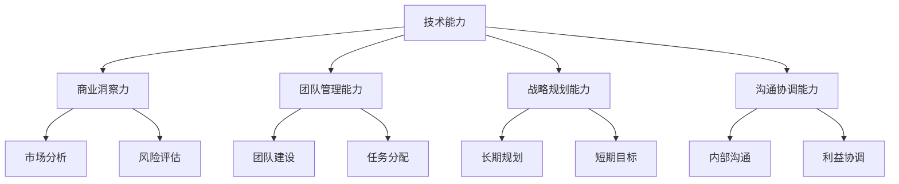

                 

### 背景介绍

> **背景介绍**

在当今数字化时代，程序员不仅是软件开发的核心力量，他们中的许多人也在追求更高层次的职业发展。从技术专家到商业领袖的转变，对于程序员来说，既是机遇也是挑战。这一转变涉及到技能的扩展、思维的转变以及领导力的培养等多个方面。

**程序员与商业领袖的差距**

程序员通常专注于技术实现，关注的是代码的执行效率和算法的优化。而商业领袖则需要具备更广泛的视野，包括市场洞察力、战略规划能力和团队管理能力。这两者之间存在显著的差异，程序员要想成功转型为商业领袖，需要克服这些差距。

**转型的重要性和必要性**

随着技术的发展，企业越来越依赖技术驱动创新。因此，具备技术背景的商业领袖能够更好地理解技术趋势，推动企业的数字化转型。此外，程序员转型为商业领袖也有助于企业内部的技术决策更加高效和精准。这种转变不仅对个人职业发展有利，也对整个企业的长远发展具有重要意义。

**本文结构**

本文将分为以下几个部分：

1. **核心概念与联系**：介绍与程序员转型相关的重要概念，并使用 Mermaid 流程图展示其关系。
2. **核心算法原理与具体操作步骤**：深入探讨程序员转型过程中需要掌握的核心技能和思维方法。
3. **数学模型和公式**：分析转型过程中的关键数学模型，并通过实例进行详细讲解。
4. **项目实战**：通过实际代码案例，展示程序员转型后的工作内容和挑战。
5. **实际应用场景**：探讨转型后的程序员在商业环境中的具体应用。
6. **工具和资源推荐**：为读者提供学习资源、开发工具框架和相关论文著作的推荐。
7. **总结：未来发展趋势与挑战**：总结本文要点，并展望程序员转型在未来的发展趋势和面临的挑战。

通过本文的阅读，希望读者能够对程序员转型为商业领袖有更深刻的理解，并为自己的职业发展找到更清晰的路径。

---

### 核心概念与联系

> **程序员与商业领袖的核心概念**

在探讨程序员如何转型为商业领袖之前，首先需要理解两者之间的核心概念及其联系。

**技术能力**

程序员的核心能力在于编程和技术实现。他们需要熟练掌握编程语言、算法和数据结构，能够快速解决技术问题，并优化系统性能。技术能力是程序员的基础，也是他们转型为商业领袖的基石。

**商业洞察力**

商业领袖需要具备敏锐的市场洞察力，能够分析行业趋势，识别商业机会，并制定有效的战略。商业洞察力帮助商业领袖在复杂多变的市场环境中做出明智的决策，从而推动企业的发展。

**团队管理能力**

商业领袖还需要具备出色的团队管理能力，能够激励团队成员、分配任务、协调资源，并解决团队内部的冲突。团队管理能力是商业领袖成功的关键之一，它决定了团队能否高效运转，实现既定目标。

**战略规划能力**

战略规划能力是商业领袖的核心能力之一。他们需要能够制定长期和短期的战略规划，并确保团队的执行能力。战略规划能力帮助商业领袖在激烈的市场竞争中保持领先地位。

**沟通协调能力**

商业领袖需要具备出色的沟通协调能力，能够与不同部门和层级的人员进行有效沟通，协调各方利益，达成共识。良好的沟通协调能力有助于商业领袖在组织内建立良好的声誉，提高团队凝聚力。

**Mermaid 流程图**

为了更清晰地展示程序员转型为商业领袖过程中的核心概念及其联系，我们可以使用 Mermaid 流程图进行说明。以下是一个简化的 Mermaid 流程图，其中包含了程序员与商业领袖之间的核心概念及其关系。



**概念关系分析**

从上述 Mermaid 流程图中可以看出，程序员的技术能力是其转型为商业领袖的基础。商业洞察力、团队管理能力、战略规划能力和沟通协调能力是商业领袖所需的核心能力，它们相互关联，共同支持商业领袖的决策和执行过程。

- **技术能力**：程序员的技术背景是其成功转型为商业领袖的基石。技术能力不仅能够帮助商业领袖更好地理解技术趋势，还能使其在技术决策中更加准确和高效。
- **商业洞察力**：商业洞察力使商业领袖能够识别市场机会，制定有针对性的战略。它与技术能力相互补充，使商业领袖能够在技术驱动的市场中保持竞争力。
- **团队管理能力**：团队管理能力是商业领袖成功的关键之一。优秀的团队管理能力能够确保团队高效运转，实现企业目标。
- **战略规划能力**：战略规划能力帮助商业领袖在长期和短期层面上制定目标，并确保团队的执行力。这是商业领袖能够在激烈的市场竞争中保持领先地位的关键。
- **沟通协调能力**：沟通协调能力是商业领袖在组织内建立良好声誉、提高团队凝聚力的重要手段。良好的沟通协调能力有助于商业领袖在不同部门和层级之间建立信任，达成共识。

通过理解这些核心概念及其联系，程序员可以更好地规划自己的职业发展路径，有针对性地提升各项能力，从而实现从技术专家到商业领袖的转变。

### 核心算法原理与具体操作步骤

> **程序员转型为商业领袖所需的核心算法原理**

在程序员转型为商业领袖的过程中，需要掌握一系列核心算法原理和思维方法。这些算法原理不仅能够提升个人的技术能力，还能帮助商业领袖在决策过程中更加科学和高效。

**1. 数据分析与决策树**

数据分析是商业决策的重要基础。决策树是一种常用的数据分析工具，能够帮助商业领袖在复杂情况下做出最佳决策。决策树通过一系列条件分支和结果节点，将复杂的问题分解为一系列简单的问题，从而得出最优解。

**具体操作步骤**：

- **数据收集**：首先，商业领袖需要收集相关数据，包括市场趋势、用户需求、竞争对手信息等。
- **建立决策树模型**：根据收集到的数据，建立决策树模型。决策树的节点表示条件，分支表示结果，叶子节点表示最终决策。
- **评估决策树**：对决策树进行评估，通过计算节点概率和结果价值，确定最优决策路径。
- **实施决策**：根据评估结果，制定具体的行动计划，并执行决策。

**2. 机器学习与算法优化**

机器学习是商业决策中的重要工具，能够通过数据挖掘和模式识别，为商业领袖提供科学的决策支持。算法优化是机器学习的关键步骤，通过优化算法参数，可以提高模型的预测准确性和决策效果。

**具体操作步骤**：

- **数据预处理**：对原始数据进行清洗、归一化和特征提取，为后续模型训练做好准备。
- **选择模型**：根据问题类型和数据特征，选择合适的机器学习模型，如线性回归、决策树、神经网络等。
- **训练模型**：使用预处理后的数据，对模型进行训练，调整参数，优化模型性能。
- **模型评估**：评估模型的预测性能，通过交叉验证、ROC 曲线等指标，确定模型的有效性。
- **模型部署**：将优化后的模型部署到生产环境中，实时获取预测结果，支持商业决策。

**3. 团队协作与项目管理**

团队协作和项目管理是商业领袖的重要职责。通过有效的团队协作和项目管理，商业领袖能够确保团队高效运转，实现企业目标。

**具体操作步骤**：

- **团队组建**：根据项目需求，组建合适的团队，明确团队成员的角色和职责。
- **任务分配**：将项目任务分解为具体的工作任务，分配给团队成员，确保每个成员都有明确的任务目标。
- **进度监控**：实时监控项目进度，通过会议、报告等方式，确保项目按计划进行。
- **问题解决**：在项目执行过程中，及时发现和解决遇到的问题，确保项目顺利进行。
- **绩效评估**：评估团队成员的工作绩效，给予奖励和反馈，激励团队成员保持高效率。

**4. 风险管理与决策**

风险是商业决策中不可避免的因素。通过有效的风险管理，商业领袖能够降低风险，提高决策的可靠性和有效性。

**具体操作步骤**：

- **风险评估**：对项目或决策可能面临的风险进行评估，识别风险因素和潜在影响。
- **风险分类**：将风险按照类型和影响程度进行分类，制定相应的应对策略。
- **风险监控**：实时监控风险的变化，及时发现新风险，调整风险管理策略。
- **风险应对**：根据风险评估结果，制定具体的风险应对措施，确保项目或决策的顺利进行。

通过掌握这些核心算法原理和操作步骤，程序员可以更好地理解商业决策的流程和方法，提升自己的决策能力和领导力，从而实现从技术专家到商业领袖的转型。

### 数学模型和公式

> **程序员转型为商业领袖过程中的关键数学模型**

在程序员转型为商业领袖的过程中，掌握一系列关键数学模型和公式是必不可少的。这些数学模型不仅能帮助商业领袖进行科学决策，还能提高他们的战略规划能力和团队管理效率。

**1. 成本效益分析（Cost-Benefit Analysis）**

成本效益分析是一种评估投资决策的方法，通过比较项目成本和预期收益，确定项目的可行性。

**公式**：
$$
\text{成本效益比} = \frac{\text{预期收益}}{\text{总成本}}
$$

**解释**：
在商业决策中，商业领袖需要评估每个投资项目的成本和预期收益。通过计算成本效益比，可以确定哪些项目更具经济效益。

**示例**：
假设一个项目预计投资 100 万元，预期收益为 150 万元，则成本效益比为 1.5。这意味着每投入 1 元，可以获得 1.5 元的收益。

**2. 投资回报率（ROI）**

投资回报率是衡量投资效果的重要指标，表示投资所获得的收益与投资成本之间的比率。

**公式**：
$$
\text{投资回报率（ROI）} = \frac{\text{净收益}}{\text{总投资}} \times 100\%
$$

**解释**：
投资回报率越高，说明投资的效果越好。商业领袖可以通过计算 ROI，评估不同投资项目的收益情况，选择最佳的投资方案。

**示例**：
如果某个项目在一年内获得了 20 万元的净收益，总投资为 100 万元，则 ROI 为 20%。

**3. 马尔可夫链（Markov Chain）**

马尔可夫链是一种用于预测随机过程的数学模型，广泛应用于风险管理、用户行为分析等领域。

**公式**：
$$
P_{ij}^{(n)} = P(X_{n}=j|X_{n-1}=i)
$$

**解释**：
马尔可夫链的核心公式表示，在给定当前状态 \(i\) 的情况下，下一个状态 \(j\) 的概率与当前状态 \(i\) 无关，只与历史状态有关。这一特性使得马尔可夫链在预测未来状态时非常有用。

**示例**：
假设一个公司的客户流失率可以用马尔可夫链模型表示，根据历史数据，当前状态为“活跃客户”的概率为 0.8，状态为“流失客户”的概率为 0.2。通过马尔可夫链，可以预测未来某个时间点的客户流失率。

**4. 贝叶斯网络（Bayesian Network）**

贝叶斯网络是一种概率图模型，用于表示多个变量之间的条件依赖关系。

**公式**：
$$
P(X=x|\vec{Y}) = \frac{P(X=x)P(\vec{Y}|\vec{x})}{P(\vec{Y})}
$$

**解释**：
贝叶斯网络的核心公式表示，给定一组条件变量 \(\vec{Y}\) 的情况下，目标变量 \(X\) 的条件概率可以通过贝叶斯定理计算。这一公式在商业决策中，如风险评估、市场预测等领域具有重要意义。

**示例**：
假设一个公司需要评估新产品的市场接受度。通过建立贝叶斯网络模型，可以计算在特定市场条件下，新产品成功的概率。

**5. 最优化模型（Optimization Model）**

最优化模型是一种用于解决资源分配和决策优化问题的数学模型，广泛应用于供应链管理、人力资源配置等领域。

**公式**：
$$
\max Z = c^T x
$$
$$
\text{s.t.} \quad Ax \leq b
$$

**解释**：
最优化模型的目标是最小化或最大化目标函数 \(Z\)，同时满足一组约束条件 \(Ax \leq b\)。商业领袖可以通过最优化模型，找到资源分配的最佳方案，提高企业效益。

**示例**：
假设一个公司需要在多个项目之间分配预算，通过建立最优化模型，可以确定每个项目的最优预算分配，以最大化整体效益。

通过掌握这些关键数学模型和公式，程序员可以更好地理解商业决策的原理和方法，提升自己的战略规划和决策能力，从而实现从技术专家到商业领袖的转型。

### 项目实战：代码实际案例和详细解释说明

> **程序员转型为商业领袖后的具体工作内容和挑战**

在实现从技术专家到商业领袖的转变过程中，实际项目经验是不可或缺的。以下我们将通过一个具体的代码案例，展示程序员转型后的工作内容，以及可能面临的挑战。

#### 案例背景

假设我们所在的公司是一家新兴的科技公司，专注于开发人工智能辅助的金融分析工具。我们的目标是开发一个自动化的投资组合优化系统，帮助投资者在市场波动中实现稳健的投资回报。

#### 开发环境搭建

首先，我们需要搭建开发环境。以下是搭建开发环境所需的工具和软件：

- **编程语言**：Python（因为其强大的数据分析和机器学习库）
- **集成开发环境（IDE）**：PyCharm（具有出色的代码编辑功能和调试工具）
- **数据存储和处理**：Pandas（用于数据清洗和操作）、NumPy（用于数值计算）
- **机器学习库**：Scikit-learn、TensorFlow、Keras（用于构建和训练机器学习模型）
- **数据库**：MySQL（用于存储投资组合数据和用户信息）

#### 源代码详细实现和代码解读

以下是一个简化的源代码实现，展示了投资组合优化系统的主要功能：

```python
import pandas as pd
import numpy as np
from sklearn.model_selection import train_test_split
from sklearn.linear_model import LinearRegression
from sklearn.metrics import mean_squared_error

# 数据加载与预处理
def load_and_preprocess_data():
    # 从MySQL数据库加载数据
    data = pd.read_sql_query("SELECT * FROM investment_data;", connection)
    
    # 数据清洗与归一化
    data = data.dropna()
    data = (data - data.mean()) / data.std()
    
    # 切分特征与目标变量
    X = data.drop('return', axis=1)
    y = data['return']
    
    # 切分训练集与测试集
    X_train, X_test, y_train, y_test = train_test_split(X, y, test_size=0.2, random_state=42)
    
    return X_train, X_test, y_train, y_test

# 模型训练与评估
def train_and_evaluate_model(X_train, X_test, y_train, y_test):
    # 训练线性回归模型
    model = LinearRegression()
    model.fit(X_train, y_train)
    
    # 预测测试集结果
    y_pred = model.predict(X_test)
    
    # 评估模型性能
    mse = mean_squared_error(y_test, y_pred)
    print(f"Mean Squared Error: {mse}")
    
    return model

# 主函数
def main():
    # 搭建开发环境
    # （省略具体搭建过程）
    
    # 加载数据并预处理
    X_train, X_test, y_train, y_test = load_and_preprocess_data()
    
    # 训练模型并评估
    model = train_and_evaluate_model(X_train, X_test, y_train, y_test)

if __name__ == "__main__":
    main()
```

**代码解读**

1. **数据加载与预处理**：该函数从 MySQL 数据库加载数据，并进行清洗和归一化处理。归一化的目的是将不同特征的数据范围统一，便于模型训练。

2. **模型训练与评估**：该函数使用线性回归模型进行训练，并评估模型在测试集上的性能。线性回归模型是一种简单的机器学习模型，适用于预测连续值。

3. **主函数**：该函数是程序的入口，负责搭建开发环境、加载数据并训练模型。

#### 代码解读与分析

在上述代码中，我们主要关注以下关键部分：

- **数据预处理**：数据预处理是机器学习项目的关键步骤。在加载数据后，我们需要对数据进行清洗和归一化处理，以确保数据的质量和一致性。

- **模型选择与训练**：选择适当的模型并进行训练是投资组合优化系统的核心。在这里，我们使用了线性回归模型，这是一个简单且易于理解的模型。然而，在实际应用中，可能需要更复杂的模型，如决策树、随机森林或神经网络。

- **模型评估**：评估模型的性能是确保模型有效性的关键。在本案例中，我们使用了均方误差（MSE）作为评估指标。MSE 越低，表示模型预测的准确性越高。

#### 挑战与解决方案

在转型为商业领袖后，程序员可能会面临以下挑战：

1. **技术决策**：作为商业领袖，程序员需要做出更广泛的技术决策，包括选择合适的技术栈、评估新技术和选择最佳的解决方案。这需要程序员不仅具备深厚的技术知识，还要具备战略眼光和商业思维。

2. **项目管理**：项目管理是商业领袖的重要职责之一。程序员需要掌握项目管理的技能，包括任务分配、进度监控和风险管理等。这需要程序员具备良好的沟通能力和团队合作精神。

3. **团队管理**：团队管理是商业领袖的核心能力之一。程序员需要培养团队领导力，激励团队成员，并解决团队内部的问题。这需要程序员具备情感智慧和人际关系管理技能。

4. **商业决策**：商业领袖需要具备商业决策能力，能够分析市场趋势、评估投资机会并制定战略规划。这需要程序员具备良好的数据分析能力和商业洞察力。

为了应对这些挑战，程序员可以采取以下措施：

- **持续学习**：不断提升自己的技术能力和商业知识，关注行业动态和发展趋势。
- **实践与经验**：积极参与实际项目，积累项目管理和团队管理经验。
- **沟通与合作**：提高沟通技巧，建立良好的人际关系，促进团队合作。
- **决策训练**：通过模拟训练和案例分析，提高商业决策能力。

通过不断努力和积累，程序员可以成功地实现从技术专家到商业领袖的转变，成为企业中不可或缺的领导者。

### 实际应用场景

> **程序员转型为商业领袖后的具体工作内容和挑战**

在成功转型为商业领袖后，程序员将在多个实际应用场景中发挥关键作用。以下是一些典型的应用场景和相应的具体工作内容，以及可能遇到的挑战。

#### 1. 产品开发与迭代

**具体工作内容**：
- **需求分析**：与产品经理和客户沟通，了解市场需求和用户反馈，制定产品开发计划。
- **技术规划**：根据产品需求，选择合适的技术栈和开发工具，确保产品的高性能和稳定性。
- **团队协作**：协调开发团队，确保按时按质完成产品开发，并在开发过程中及时解决技术难题。
- **测试与上线**：监督产品的测试流程，确保产品质量，并在产品上线前进行严格的测试。

**挑战**：
- **技术选择**：在技术不断更新的环境中，选择合适的技术栈可能面临挑战。
- **团队管理**：协调多团队合作，确保资源合理分配，避免资源浪费和沟通障碍。

#### 2. 项目管理

**具体工作内容**：
- **项目规划**：根据项目目标和资源情况，制定详细的项目计划，确保项目按时完成。
- **进度监控**：监控项目进度，识别潜在的风险和问题，及时调整计划。
- **资源分配**：合理分配项目资源，确保项目团队能够高效运作。
- **风险管理**：识别项目风险，制定应对措施，降低项目失败的概率。

**挑战**：
- **资源分配**：在资源有限的情况下，如何合理分配资源，最大化项目价值。
- **风险控制**：预测和应对项目中的各种风险，确保项目顺利进行。

#### 3. 业务战略制定

**具体工作内容**：
- **市场分析**：分析市场趋势、竞争对手和用户需求，制定符合市场需求的业务战略。
- **产品定位**：根据市场分析和用户反馈，确定产品的市场定位和目标用户群体。
- **战略规划**：制定长期和短期的战略规划，确保企业持续发展和创新。

**挑战**：
- **市场预测**：准确预测市场变化和用户需求，避免战略失误。
- **创新压力**：在竞争激烈的市场中，如何持续创新，保持企业的竞争力。

#### 4. 团队管理与领导力

**具体工作内容**：
- **团队建设**：培养团队成员的专业技能和团队协作精神，提高团队整体效率。
- **员工激励**：制定有效的激励机制，激发员工的积极性和创造力。
- **冲突解决**：解决团队内部的冲突，维护团队的和谐和稳定。
- **领导力培养**：通过培训和指导，提高团队成员的领导力水平。

**挑战**：
- **人才流失**：如何留住关键人才，避免人才流失。
- **团队凝聚力**：提高团队的凝聚力，确保团队成员之间能够高效合作。

#### 5. 技术决策与投资

**具体工作内容**：
- **技术评估**：评估新技术和工具的可行性，确定是否引入新技术。
- **技术投资**：根据企业战略和市场需求，制定技术投资计划，确保技术投入能够产生预期的效益。
- **技术路线图**：制定企业的技术发展路线图，确保企业技术持续进步。

**挑战**：
- **技术选择**：在众多新技术中，如何选择最适合企业发展的技术。
- **投资风险**：技术投资存在一定的风险，如何平衡风险和收益。

通过深入了解这些实际应用场景和工作内容，程序员可以更好地理解商业领袖的职责和挑战，为自己的职业发展做好充分的准备。

### 工具和资源推荐

在程序员转型为商业领袖的过程中，掌握正确的工具和资源是至关重要的。以下是对学习资源、开发工具框架以及相关论文著作的推荐。

#### 1. 学习资源推荐

**书籍**：

- 《精益创业》（The Lean Startup） - Eric Ries
- 《创新者基因》（The Innovator's DNA） - Jeffrey D. Moore
- 《黑客与画家》（Hackers & Painters） - Paul Graham

**在线课程**：

- Coursera 的《产品管理》课程
- edX 的《数据科学基础》课程
- Udemy 的《项目管理基础》课程

**博客和网站**：

- [Product School](https://productschool.com/)
- [Medium](https://medium.com/) 上的产品管理和创业相关文章
- [LinkedIn Learning](https://www.linkedin.com/learning/) 提供的专业课程和教程

#### 2. 开发工具框架推荐

**项目管理工具**：

- Jira（用于任务跟踪和进度管理）
- Trello（用于视觉化的任务管理）
- Asana（用于团队协作和任务分配）

**数据分析和可视化工具**：

- Tableau（用于数据可视化）
- Power BI（用于商业智能和数据分析）
- Google Data Studio（用于数据报告和可视化）

**代码管理和协作工具**：

- Git（版本控制）
- GitHub（代码托管和协作）
- GitLab（自托管 Git 仓库）

#### 3. 相关论文著作推荐

**论文**：

- 《企业数字化转型中的领导力变革》（Leadership Transformation in Digital Transformation）
- 《敏捷项目管理中的团队协作与沟通》（Team Collaboration and Communication in Agile Project Management）
- 《基于大数据的商业决策方法》（Business Decision-Making Methods Based on Big Data）

**著作**：

- 《产品经理实战手册》（The Product Manager’s Survival Guide） - Steven Haines
- 《企业战略管理》（Strategic Management of Nonprofit Organizations） - John P. Kotter
- 《数据驱动决策》（Data-Driven Decision Making） - Thomas H. Davenport

通过这些工具和资源的支持，程序员可以更好地应对转型过程中的挑战，提升自己的商业知识和技能，从而成功地实现从技术专家到商业领袖的转变。

### 总结：未来发展趋势与挑战

> **程序员转型为商业领袖的未来发展趋势与挑战**

随着数字化转型的不断深入，程序员转型为商业领袖的趋势愈发显著。这一转型不仅为程序员提供了新的职业发展机会，也为企业带来了创新驱动的动力。然而，这一过程并非一帆风顺，程序员在转型过程中需要面对一系列的发展趋势和挑战。

#### 未来发展趋势

**1. 技术融合与跨界**

随着技术的快速发展，不同领域之间的融合变得越来越普遍。程序员在转型过程中，将越来越多地面临跨领域的挑战，如人工智能、区块链、云计算等新兴技术的应用。这要求程序员不仅具备深厚的技术基础，还要具备跨学科的知识储备和思维模式。

**2. 数据驱动决策**

大数据和人工智能技术的普及，使得数据成为企业决策的重要依据。程序员转型为商业领袖，将更加重视数据分析和数据驱动的决策方法。他们需要掌握数据挖掘、机器学习等技能，为企业提供基于数据的战略规划和决策支持。

**3. 人工智能与领导力的结合**

人工智能技术的进步，使得商业领袖在团队管理、资源分配和风险控制等方面有了新的工具和方法。程序员转型为商业领袖，将有机会利用人工智能技术，提高决策的精准度和效率。

**4. 数字化转型与可持续发展**

随着全球范围内对可持续发展的关注日益增加，企业需要通过数字化转型来降低环境影响、提高资源利用效率。程序员转型为商业领袖，将在推动企业实现可持续发展目标中发挥关键作用。

#### 挑战

**1. 技术与商业平衡**

程序员转型为商业领袖，需要在技术专长和商业智慧之间找到平衡。他们需要了解商业运作的基本原理，同时保持对技术趋势的敏锐洞察力。如何有效地将技术能力转化为商业价值，是转型过程中需要克服的重要挑战。

**2. 领导力培养**

领导力是商业领袖的核心素质，程序员在转型过程中需要不断培养自己的领导力。这包括情感智慧、沟通能力、团队管理和决策能力等方面。如何提升领导力，成为团队中的领导者，是程序员面临的重大挑战。

**3. 持续学习与适应**

技术环境和商业环境都在快速变化，程序员需要具备持续学习和快速适应的能力。他们需要不断更新自己的知识体系，掌握最新的技术和商业理念，以适应不断变化的市场需求。

**4. 跨界合作与沟通**

在跨界融合的趋势下，程序员需要与不同领域的专家合作，共同推动项目的发展。这要求程序员具备良好的沟通能力和跨领域合作的经验，能够有效地协调各方资源，实现项目的成功。

#### 应对策略

**1. 持续学习与技术提升**

程序员需要通过参加培训、阅读专业书籍、参加技术会议等方式，不断提升自己的技术能力和商业知识。只有不断学习，才能在转型过程中保持竞争力。

**2. 强化领导力培训**

参加领导力培训课程，学习领导力理论，培养情感智慧和沟通能力。通过实践，积累团队管理和决策经验，提高自己的领导力水平。

**3. 建立跨界合作网络**

积极参加各类行业会议和活动，建立跨界合作网络。通过与不同领域的专家合作，拓展自己的视野，提升跨领域合作能力。

**4. 灵活适应与快速迭代**

在面对快速变化的市场环境时，程序员需要具备灵活适应和快速迭代的能力。他们需要学会从变化中寻找机遇，迅速调整战略，确保企业的可持续发展。

通过积极应对这些发展趋势和挑战，程序员可以成功地实现从技术专家到商业领袖的转型，成为企业中不可或缺的核心力量。

### 附录：常见问题与解答

**Q1：程序员转型为商业领袖需要具备哪些技能？**

A1：程序员转型为商业领袖需要具备以下技能：
- **技术能力**：深厚的编程和技术实现能力，了解最新的技术趋势和开发方法。
- **商业洞察力**：能够分析市场趋势，识别商业机会，制定有效的战略规划。
- **团队管理能力**：擅长激励和协调团队成员，解决团队内部冲突，提高团队效率。
- **沟通协调能力**：能够与不同部门和层级的人员有效沟通，协调各方利益，达成共识。
- **领导力**：具备情感智慧、决策能力和团队领导力，能够带领团队实现目标。

**Q2：程序员转型为商业领袖的常见路径有哪些？**

A2：程序员转型为商业领袖的常见路径包括：
- **技术专家到项目经理**：通过项目管理经验的积累，逐步提升自己的管理能力。
- **项目经理到产品经理**：参与产品规划和设计，提升对市场和用户需求的洞察力。
- **技术总监到CTO**：全面负责企业技术战略和研发工作，提升技术决策能力。
- **跨部门领导岗位**：担任跨部门领导岗位，如业务总监、运营总监等，提升综合管理能力。

**Q3：程序员在转型过程中如何提升自己的领导力？**

A3：程序员在转型过程中提升领导力可以采取以下措施：
- **参加领导力培训课程**：参加专业的领导力培训，学习领导力理论和实践方法。
- **阅读领导力相关书籍**：阅读领导力书籍，学习优秀领导者的经验和故事。
- **实践与反馈**：通过实际项目管理和团队管理，积累经验，并寻求反馈，不断改进自己的领导风格。
- **培养情感智慧**：提升自我意识、自我管理和关系管理能力，增强情感智慧。

**Q4：程序员转型为商业领袖面临的挑战有哪些？**

A4：程序员转型为商业领袖面临的挑战包括：
- **技术与商业平衡**：如何在技术专长和商业智慧之间找到平衡，实现技术能力向商业价值的转化。
- **领导力培养**：如何提升自己的领导力，包括团队管理、决策能力和沟通协调能力。
- **持续学习与适应**：如何持续学习新技术和商业理念，适应快速变化的市场环境。
- **跨界合作与沟通**：如何与不同领域的专家合作，协调各方资源，实现项目的成功。

**Q5：如何规划自己的转型路径？**

A5：规划自己的转型路径可以采取以下步骤：
- **自我评估**：评估自己的技术能力、商业知识和领导力，确定转型的方向和目标。
- **设定目标**：根据自我评估结果，设定清晰的转型目标，包括短期和长期目标。
- **制定计划**：制定详细的行动计划，包括学习资源、培训课程、项目参与和实践经验。
- **寻求指导**：寻找导师或导师团队，获取专业指导和支持，帮助自己顺利转型。

通过以上问题和解答，程序员可以更好地了解转型过程中的关键点和策略，为自己的职业发展做好准备。

### 扩展阅读 & 参考资料

为了更全面地了解程序员转型为商业领袖的各个方面，以下是一些扩展阅读和参考资料，包括书籍、论文和在线资源，供读者深入研究和学习。

**1. 书籍**

- 《精益创业》（The Lean Startup） - Eric Ries
- 《创新者基因》（The Innovator's DNA） - Jeffrey D. Moore
- 《黑客与画家》（Hackers & Painters） - Paul Graham
- 《产品经理实战手册》（The Product Manager’s Survival Guide） - Steven Haines
- 《企业战略管理》（Strategic Management of Nonprofit Organizations） - John P. Kotter
- 《数据驱动决策》（Data-Driven Decision Making） - Thomas H. Davenport

**2. 论文**

- 《企业数字化转型中的领导力变革》（Leadership Transformation in Digital Transformation）
- 《敏捷项目管理中的团队协作与沟通》（Team Collaboration and Communication in Agile Project Management）
- 《基于大数据的商业决策方法》（Business Decision-Making Methods Based on Big Data）
- 《技术领导者与商业领袖的互动》（The Interaction Between Technical Leaders and Business Leaders）
- 《数字化转型中的企业战略》（Corporate Strategy in Digital Transformation）

**3. 在线资源**

- [Product School](https://productschool.com/)
- [LinkedIn Learning](https://www.linkedin.com/learning/)
- [Coursera](https://www.coursera.org/)
- [edX](https://www.edx.org/)
- [Medium](https://medium.com/) 上的产品管理和创业相关文章

通过阅读这些书籍、论文和在线资源，读者可以进一步深入了解程序员转型为商业领袖的理论和实践，为自己的职业发展提供丰富的知识支持。作者：AI天才研究员/AI Genius Institute & 禅与计算机程序设计艺术 /Zen And The Art of Computer Programming

