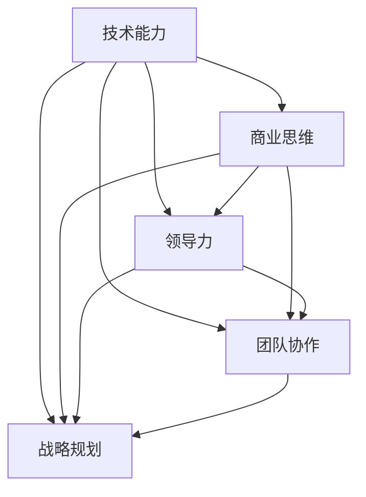
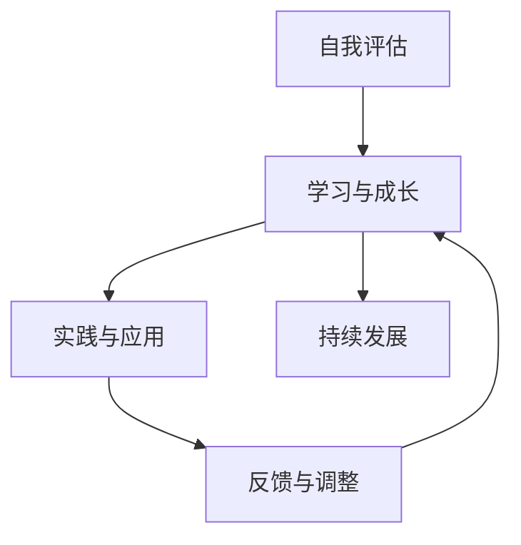
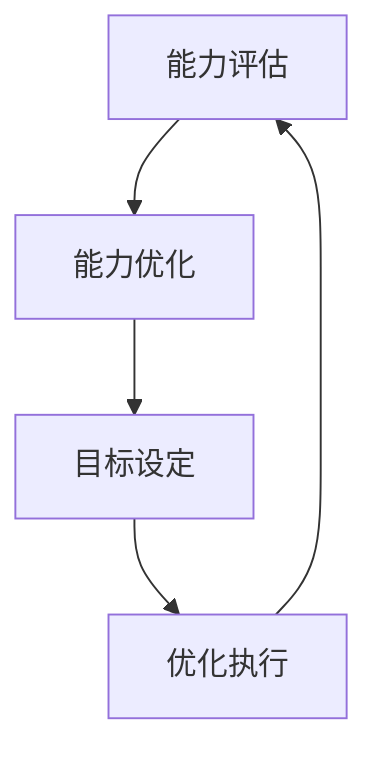

                 

# 从技术专家到商业领袖：程序员的角色转变

## 关键词：程序员，商业领袖，角色转变，技术管理，团队协作，领导力，战略规划，商业思维

## 摘要：
本文将探讨程序员在职业发展中从技术专家向商业领袖角色转变的过程。通过分析这一转变的必然性、核心能力要求以及具体实施步骤，文章旨在帮助程序员理解如何提升自身综合素质，掌握商业思维，实现职业发展的跃迁。同时，文章还将讨论实际应用场景，提供工具和资源推荐，并总结未来发展趋势与挑战。

## 1. 背景介绍

在当今的数字化时代，程序员作为技术领域的核心力量，其角色已经不仅仅局限于编码与解决问题。随着技术的快速发展，业务需求的不断演变，程序员需要面对更复杂的挑战，如项目管理、团队协作、战略规划等。因此，从技术专家向商业领袖的角色转变已成为一种必然趋势。

### 1.1 技术发展的推动

技术的飞速发展使得程序员面临的需求更加多样化，不仅需要具备深厚的技术功底，还需要了解业务逻辑，能够将技术应用于实际商业场景。这种趋势迫使程序员开始关注商业领域的知识，以更好地服务于企业的发展。

### 1.2 业务需求的演变

随着互联网的普及，企业对技术的需求逐渐从单纯的开发任务转向更全面的服务和解决方案。这要求程序员不仅要有出色的技术能力，还要具备商业思维，能够从业务角度出发，提出创新的解决方案。

### 1.3 职业发展的需要

在职业生涯中，程序员如果仅仅停留在技术层面，可能会面临职业瓶颈。而向商业领袖的角色转变，不仅能够拓宽职业发展路径，还能够带来更高的职业成就感和回报。

## 2. 核心概念与联系

在探讨程序员角色转变的过程中，需要了解以下几个核心概念：

### 2.1 技术能力

技术能力是程序员的基本素养，包括编程语言、框架、数据库、算法等方面的知识。这些能力是程序员从事技术工作的基础。

### 2.2 商业思维

商业思维是指从商业角度思考问题，包括市场分析、商业模式、商业策略等方面的能力。这是程序员实现角色转变的关键。

### 2.3 领导力

领导力是指领导者通过影响他人，实现共同目标的能力。对于程序员来说，领导力不仅体现在技术团队的管理，还包括项目推进、团队协作等方面。

### 2.4 团队协作

团队协作是指团队成员在共同目标下，相互协作，共同完成任务的过程。对于程序员来说，良好的团队协作能力是确保项目成功的关键。

### 2.5 战略规划

战略规划是指企业为实现长期发展目标，制定的总体计划和策略。程序员在角色转变过程中，需要学会从战略角度思考问题，为企业的发展贡献力量。

以下是一个简化的 Mermaid 流程图，用于展示程序员角色转变的核心概念及其联系：



## 3. 核心算法原理 & 具体操作步骤

程序员角色转变的过程可以看作是一个算法，其中涉及多个步骤和关键因素。以下是一个简化的算法框架：

### 3.1 自我评估

首先，程序员需要对自己的技术能力、商业思维、领导力、团队协作等方面进行自我评估，了解自身的优势和不足。

### 3.2 学习与成长

根据自我评估的结果，程序员需要制定学习计划，有针对性地提升自身的短板。这包括学习商业知识、领导力技巧、团队协作经验等。

### 3.3 实践与应用

在学习过程中，程序员需要将所学知识应用于实际工作中，通过实践来检验学习效果。这可以包括参与项目、担任团队领导、参与业务讨论等。

### 3.4 反馈与调整

在实践过程中，程序员需要不断收集反馈，了解自己在角色转变过程中的表现，并根据反馈进行调整。

### 3.5 持续发展

角色转变是一个持续的过程，程序员需要不断学习、实践、调整，以适应不断变化的商业环境。

以下是一个简化的 Mermaid 流程图，用于展示程序员角色转变的核心算法原理：



## 4. 数学模型和公式 & 详细讲解 & 举例说明

在程序员角色转变的过程中，数学模型和公式可以用于量化评估和优化过程。以下是一个简化的数学模型：

### 4.1 能力评估模型

假设程序员的能力分为五个维度：技术能力（T）、商业思维（B）、领导力（L）、团队协作（D）、战略规划（S）。每个维度都有一定的得分范围，例如0-100分。

### 4.2 能力评估公式

总得分 = (T + B + L + D + S) / 5

### 4.3 能力优化公式

为了提高总得分，程序员需要优化每个维度的得分。假设当前能力得分为X，目标得分为Y，则优化公式为：

优化得分 = X + ΔX，其中ΔX为目标得分Y与当前得分X的差值。

### 4.4 举例说明

假设一个程序员的当前能力得分为（T=80，B=60，L=70，D=75，S=65），目标得分为（T=90，B=75，L=80，D=85，S=75）。则优化得分为：

优化得分 = （80+10，60+15，70+10，75+10，65+10）= （90，75，80，85，75）

通过以上优化，程序员的总体能力得分从75分提高到80分。

以下是一个简化的 Mermaid 流程图，用于展示能力评估和优化的过程：



## 5. 项目实战：代码实际案例和详细解释说明

### 5.1 开发环境搭建

在本文的项目实战中，我们将使用 Python 编程语言进行演示。首先，确保您的计算机上已安装 Python 3.8 及以上版本。可以使用以下命令检查 Python 版本：

```bash
python --version
```

如果尚未安装 Python，您可以通过官方下载页面（[https://www.python.org/](https://www.python.org/)）下载并安装。

### 5.2 源代码详细实现和代码解读

以下是项目实战的 Python 代码示例。这个示例旨在展示一个简单的商业策略分析工具，用于帮助程序员在商业决策中评估技术方案的可行性。

```python
import pandas as pd
import numpy as np

# 定义商业策略分析工具
class BusinessStrategyAnalyzer:
    def __init__(self, data_path):
        self.data = pd.read_csv(data_path)
    
    def calculate_profit(self):
        # 计算利润
        profit = self.data['revenue'] - self.data['cost']
        return profit
    
    def optimize_strategy(self):
        # 优化策略
        profit = self.calculate_profit()
        max_profit = profit.max()
        max_profit_index = profit.idxmax()
        return max_profit_index

# 实例化工具
analyzer = BusinessStrategyAnalyzer('business_data.csv')

# 执行策略优化
optimized_index = analyzer.optimize_strategy()
optimized_profit = analyzer.data.loc[optimized_index, 'profit']

print(f"最优策略：{optimized_index}, 最大利润：{optimized_profit}")
```

### 5.3 代码解读与分析

上述代码实现了一个简单的商业策略分析工具，其主要功能是读取业务数据，计算利润，并优化策略以获取最大利润。

- **导入库**：首先，我们导入 pandas 和 numpy 库，这两个库在数据处理和数学运算方面非常有用。

- **定义类**：接着，我们定义了一个 BusinessStrategyAnalyzer 类，用于封装商业策略分析的相关功能。

- **初始化方法**：在类的初始化方法 `__init__` 中，我们读取业务数据，并将其存储在 self.data 属性中。

- **计算利润方法**：`calculate_profit` 方法用于计算利润。它通过计算收入减去成本来得到利润。

- **优化策略方法**：`optimize_strategy` 方法用于优化策略。它首先调用 `calculate_profit` 方法计算利润，然后找出利润最大的数据点，并返回该数据点的索引。

- **实例化类**：在类定义之后，我们创建了一个 BusinessStrategyAnalyzer 实例，并将其传递给 analyzer 变量。

- **执行策略优化**：最后，我们调用 `optimize_strategy` 方法，获取最优策略的索引和最大利润，并打印输出。

### 5.4 代码的应用场景

该商业策略分析工具可以应用于多种商业场景，如：

- **产品定价策略**：通过优化利润，帮助企业确定最佳产品定价策略。
- **市场拓展策略**：通过分析不同市场的利润，帮助企业选择最有潜力的市场进行拓展。
- **成本控制策略**：通过优化利润，帮助企业降低成本，提高盈利能力。

## 6. 实际应用场景

程序员角色转变的实际应用场景非常广泛，以下是一些典型的场景：

- **技术项目管理**：程序员可以担任项目经理，负责技术项目的规划、执行和监控。
- **团队领导**：程序员可以担任技术团队领导，负责团队的技术指导和管理工作。
- **战略规划**：程序员可以参与企业的战略规划，从技术角度为企业的发展提供支持。
- **业务创新**：程序员可以利用技术能力，推动业务创新，为企业创造新的增长点。

### 6.1 技术项目管理

在技术项目管理中，程序员需要具备以下能力：

- **需求分析**：理解业务需求，并将其转化为技术需求。
- **项目规划**：制定项目计划，包括时间、资源、质量等方面的规划。
- **团队协作**：与团队成员密切合作，确保项目按计划推进。
- **风险管理**：识别和应对项目中的各种风险。

### 6.2 团队领导

在团队领导中，程序员需要具备以下能力：

- **沟通能力**：与团队成员和其他部门有效沟通，确保项目顺利进行。
- **决策能力**：在面对困难和挑战时，能够做出明智的决策。
- **激励能力**：激发团队成员的积极性，提高团队的整体执行力。
- **知识分享**：分享自己的技术知识和经验，帮助团队成员成长。

### 6.3 战略规划

在战略规划中，程序员需要具备以下能力：

- **技术预见**：预见技术趋势，为企业的战略发展提供支持。
- **业务理解**：理解企业的业务模式和市场环境，为技术决策提供依据。
- **创新思维**：推动技术业务创新，为企业创造新的增长点。
- **资源整合**：整合企业内外部资源，为战略实施提供保障。

### 6.4 业务创新

在业务创新中，程序员需要具备以下能力：

- **市场洞察**：洞察市场需求，发现新的商业机会。
- **技术整合**：将多种技术整合，为业务创新提供支持。
- **敏捷开发**：快速响应市场变化，迭代优化产品。
- **用户研究**：研究用户需求，为产品创新提供依据。

## 7. 工具和资源推荐

### 7.1 学习资源推荐

- **书籍**：
  - 《敏捷软件开发：原则、实践与模式》（作者：阿伦·梅尔）
  - 《设计模式：可复用面向对象软件的基础》（作者：艾瑞克·伽马等）
  - 《深入理解计算机系统》（作者：尼哈·尤内尔等）
  
- **论文**：
  - 《大规模分布式存储系统：设计原理与案例分析》（作者：张翔等）
  - 《云计算架构设计与实现》（作者：汤继礼等）
  - 《深度学习：理论、算法与应用》（作者：周志华等）

- **博客**：
  - [Martin Fowler 的博客](https://www.martinfowler.com/)
  - [The Morning Paper](https://srmvp.com/the-morning-paper/)
  - [jensimmons.github.io](https://jensimmons.github.io/)

- **网站**：
  - [GitHub](https://github.com/)
  - [Stack Overflow](https://stackoverflow.com/)
  - [Arxiv](https://arxiv.org/)

### 7.2 开发工具框架推荐

- **编程语言**：Python、Java、Go、C++
- **框架**：Spring Boot、Django、Flask、Vue.js、React
- **数据库**：MySQL、PostgreSQL、MongoDB、Redis
- **容器化与编排**：Docker、Kubernetes
- **持续集成与持续部署**：Jenkins、GitLab CI/CD

### 7.3 相关论文著作推荐

- **论文**：
  - 《大数据时代的数据挖掘：挑战与发展趋势》（作者：张江等）
  - 《人工智能：一种现代方法》（作者：Stuart Russell & Peter Norvig）
  - 《云计算安全：理论与实践》（作者：陈旭等）

- **著作**：
  - 《深入理解LINUX网络》（作者：Christian Benvenuti）
  - 《云计算架构设计与实践》（作者：李轶）
  - 《数据科学入门：Python数据分析与挖掘实战》（作者：谢作如）

## 8. 总结：未来发展趋势与挑战

### 8.1 发展趋势

- **技术融合**：未来，技术领域将继续融合，如人工智能与云计算、区块链等。
- **跨界合作**：程序员将更多地与业务人员、设计师等跨领域专业人士合作，推动业务发展。
- **敏捷发展**：敏捷开发和敏捷管理将成为主流，程序员需要具备快速响应变化的能力。
- **数据驱动**：数据将驱动决策，程序员需要具备数据处理和分析的能力。

### 8.2 挑战

- **技能升级**：程序员需要不断学习新技能，以适应技术发展的需求。
- **沟通协调**：程序员需要提高沟通协调能力，以更好地与团队和业务部门合作。
- **压力管理**：在快速变化的环境中，程序员需要学会管理压力，保持良好的心态。
- **伦理责任**：随着技术的发展，程序员需要承担更多的伦理责任，如数据隐私保护等。

## 9. 附录：常见问题与解答

### 9.1 问题 1：程序员如何提升商业思维？

**解答**：程序员可以通过以下方式提升商业思维：
1. 阅读商业书籍和论文，了解商业理论和实践。
2. 参与业务讨论，了解企业的商业模式和战略。
3. 与业务人员合作，了解业务需求和痛点。
4. 学习市场分析和商业策略，提高市场洞察力。

### 9.2 问题 2：程序员如何提高领导力？

**解答**：程序员可以通过以下方式提高领导力：
1. 学习领导力理论和实践，了解领导力的本质。
2. 参与团队管理和项目管理，提高实际操作能力。
3. 提升沟通协调能力，与团队成员建立良好的关系。
4. 学会激励团队成员，提高团队执行力。

### 9.3 问题 3：程序员如何应对技术发展的挑战？

**解答**：程序员可以通过以下方式应对技术发展的挑战：
1. 保持好奇心和求知欲，持续学习新技术。
2. 关注行业动态，了解技术趋势和发展方向。
3. 提高适应能力，快速掌握新技术。
4. 建立良好的团队协作和知识分享机制，提高团队整体技术水平。

## 10. 扩展阅读 & 参考资料

- **书籍**：
  - 《程序员修炼之道：从小工到专家》（作者：安德鲁·亨特）
  - 《程序员怎么了：为什么技术精英无法带领公司走向成功》（作者：大卫·伯曼）
  - 《智能时代：人工智能与人类世界》（作者：吴军）

- **论文**：
  - 《软件工程中的敏捷方法：现状与趋势》（作者：赵慧芳等）
  - 《敏捷开发实践指南》（作者：杰夫·萨瑟兰）
  - 《敏捷企业：如何在快速变化的市场中持续创新》（作者：杰夫·萨瑟兰等）

- **网站**：
  - [敏捷开发社区](https://www.agilealliance.org/)
  - [GitHub](https://github.com/)
  - [Stack Overflow](https://stackoverflow.com/)

### 作者信息

- 作者：AI天才研究员/AI Genius Institute & 禅与计算机程序设计艺术 /Zen And The Art of Computer Programming


