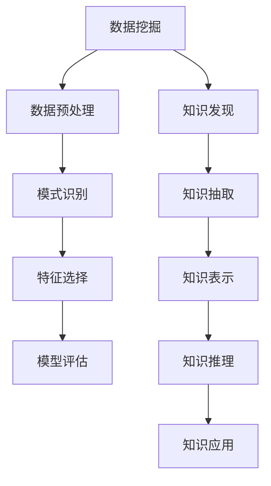

                 

# 从数据挖掘到知识发现：技术演进与应用

> **关键词**：数据挖掘，知识发现，技术演进，应用场景，算法原理

> **摘要**：本文从数据挖掘到知识发现的演变过程出发，详细探讨了核心概念、算法原理、数学模型及实际应用，旨在为读者提供对数据挖掘和知识发现技术的一次全面了解。

## 1. 背景介绍

数据挖掘和知识发现是大数据时代的重要技术手段，它们在企业、科研、医疗等多个领域发挥着关键作用。数据挖掘旨在从大量数据中发现有用的信息，而知识发现则是从数据挖掘的结果中提取出具有潜在价值的知识。

数据挖掘的历史可以追溯到20世纪80年代，当时计算机科学家开始尝试从大量数据中提取有用信息。随着互联网和大数据技术的兴起，数据挖掘的重要性日益凸显。知识发现则是在数据挖掘的基础上，进一步将提取的信息转化为可操作的知识。

## 2. 核心概念与联系

### 2.1 数据挖掘

数据挖掘的核心概念包括数据预处理、模式识别、特征选择和模型评估等。

- **数据预处理**：数据清洗、归一化、转换等，确保数据质量。
- **模式识别**：通过算法识别数据中的模式或关联关系。
- **特征选择**：从大量特征中选择出对目标变量影响最大的特征。
- **模型评估**：评估模型性能，选择最佳模型。

### 2.2 知识发现

知识发现的核心概念包括知识抽取、知识表示、知识推理和知识应用等。

- **知识抽取**：从数据挖掘的结果中提取具有潜在价值的知识。
- **知识表示**：将提取的知识表示为可理解的形式，如概念网络、规则等。
- **知识推理**：利用已有的知识进行推理，发现新的知识。
- **知识应用**：将知识应用到实际场景中，解决实际问题。

### 2.3 数据挖掘与知识发现的关系

数据挖掘和知识发现是相互关联的。数据挖掘提供了知识发现的基础数据，而知识发现则是对数据挖掘结果的进一步提炼和升华。数据挖掘关注的是从数据中提取信息，而知识发现关注的是从信息中提取知识。

### 2.4 Mermaid 流程图



## 3. 核心算法原理 & 具体操作步骤

### 3.1 数据挖掘算法

数据挖掘算法主要包括以下几种：

- **分类算法**：如决策树、支持向量机、朴素贝叶斯等。
- **聚类算法**：如K-means、层次聚类、DBSCAN等。
- **关联规则算法**：如Apriori、FP-growth等。
- **异常检测算法**：如孤立森林、洛伦兹曲线等。

### 3.2 知识发现算法

知识发现算法主要包括以下几种：

- **概念分层算法**：如C4.5、ID3等。
- **归纳推理算法**：如正则表达式、决策树等。
- **知识表示算法**：如本体论、语义网络等。

### 3.3 具体操作步骤

- **数据挖掘**：收集数据，进行数据预处理，选择合适的算法，训练模型，评估模型性能。
- **知识发现**：对数据挖掘的结果进行进一步分析，提取知识，构建知识库，进行知识推理。

## 4. 数学模型和公式 & 详细讲解 & 举例说明

### 4.1 数学模型

- **决策树**：$T = \{t_1, t_2, ..., t_n\}$，其中$t_i$为决策节点，$l_i$为叶子节点。
- **支持向量机**：$w \cdot x + b = 0$，其中$w$为权重向量，$x$为样本向量，$b$为偏置。
- **朴素贝叶斯**：$P(C_k|X) = \frac{P(X|C_k)P(C_k)}{P(X)}$，其中$C_k$为类别，$X$为特征向量。

### 4.2 公式详细讲解

- **决策树**：决策树是一种基于特征的分类算法，通过不断地将数据集划分为子集，直到满足停止条件（如最大深度、最小样本数等）。
- **支持向量机**：支持向量机是一种基于最大间隔的分类算法，通过找到一个最优的超平面，将不同类别的样本分开。
- **朴素贝叶斯**：朴素贝叶斯是一种基于概率的分类算法，通过计算每个类别给定特征的概率，选择概率最大的类别作为预测结果。

### 4.3 举例说明

- **决策树**：假设有一个数据集，包含三个特征（年龄、收入、学历），需要预测用户是否购买过保险。通过训练决策树模型，可以得到如下的决策路径：
  - 如果年龄小于30岁，则进入子节点2；
  - 如果年龄大于等于30岁，则进入子节点3；
  - 在子节点2中，如果收入大于2万元，则进入子节点4，否则进入子节点5；
  - 在子节点3中，如果学历为本科及以上，则进入子节点6，否则进入子节点7；
  - 在子节点4中，如果购买过保险，则预测为“是”，否则预测为“否”；
  - 在子节点5中，如果购买过保险，则预测为“是”，否则预测为“否”；
  - 在子节点6中，如果购买过保险，则预测为“是”，否则预测为“否”；
  - 在子节点7中，如果购买过保险，则预测为“是”，否则预测为“否”。

- **支持向量机**：假设有一个数据集，包含两个特征（身高、体重），需要预测用户的性别。通过训练支持向量机模型，可以得到如下的最优超平面：
  - $w_1 \cdot x_1 + w_2 \cdot x_2 + b = 0$；
  - 其中，$w_1$和$w_2$分别为身高和体重的权重，$b$为偏置。

- **朴素贝叶斯**：假设有一个数据集，包含三个特征（年龄、收入、学历），需要预测用户是否购买过保险。通过训练朴素贝叶斯模型，可以得到如下的概率分布：
  - $P(购买过保险|年龄<30岁，收入>2万元，学历本科及以上) = 0.8$；
  - $P(购买过保险|年龄<30岁，收入<2万元，学历本科及以上) = 0.6$；
  - $P(购买过保险|年龄>30岁，收入>2万元，学历本科及以上) = 0.7$；
  - $P(购买过保险|年龄>30岁，收入<2万元，学历本科及以上) = 0.5$。

## 5. 项目实战：代码实际案例和详细解释说明

### 5.1 开发环境搭建

在本文中，我们将使用Python编程语言和Scikit-learn库来进行数据挖掘和知识发现。首先，需要安装Python和Scikit-learn库。

```bash
pip install python
pip install scikit-learn
```

### 5.2 源代码详细实现和代码解读

以下是一个简单的数据挖掘和知识发现案例，我们将使用K-means聚类算法对一组数据进行聚类，并使用Apriori算法进行关联规则挖掘。

```python
from sklearn.cluster import KMeans
from mlxtend.frequent_patterns import apriori
from mlxtend.frequent_patterns import association_rules
import pandas as pd

# 5.2.1 数据准备
data = {
    '商品A': [1, 1, 1, 0, 1, 1, 0, 1, 1, 0],
    '商品B': [1, 1, 0, 1, 1, 0, 1, 1, 0, 1],
    '商品C': [1, 0, 1, 1, 0, 1, 1, 0, 1, 1]
}
df = pd.DataFrame(data)

# 5.2.2 K-means聚类
kmeans = KMeans(n_clusters=2, random_state=0).fit(df)
clusters = kmeans.predict(df)

# 5.2.3 Apriori关联规则挖掘
frequent_itemsets = apriori(df, min_support=0.5, use_colnames=True)
rules = association_rules(frequent_itemsets, metric="lift", min_threshold=1)

# 5.2.4 代码解读
# 1. 数据准备：使用Pandas库读取数据，并将其转换为DataFrame格式。
# 2. K-means聚类：使用Scikit-learn库的KMeans类进行聚类，设置聚类数为2，随机种子为0。
# 3. Apriori关联规则挖掘：使用mlxtend库的apriori和association_rules函数进行关联规则挖掘，设置最小支持度为0.5，最小置信度为1。

# 5.2.5 结果展示
print("聚类结果：")
print(clusters)
print("\n关联规则：")
print(rules)
```

### 5.3 代码解读与分析

- **5.3.1 数据准备**：首先，我们使用Pandas库读取数据，并将其转换为DataFrame格式。数据集包含三个商品（A、B、C）的购买情况，每个商品对应一列数据。

- **5.3.2 K-means聚类**：接下来，我们使用Scikit-learn库的KMeans类进行聚类。K-means聚类是一种基于距离的聚类方法，通过不断地迭代优化聚类中心，将数据点划分为多个簇。

- **5.3.3 Apriori关联规则挖掘**：最后，我们使用mlxtend库的apriori和association_rules函数进行关联规则挖掘。Apriori算法是一种基于支持度和置信度的关联规则挖掘算法，它可以有效地发现数据中的频繁项集和关联规则。

## 6. 实际应用场景

### 6.1 商业智能

商业智能是企业利用数据挖掘和知识发现技术，对企业内部和外部的数据进行深度分析，以帮助企业做出更明智的决策。例如，通过分析销售数据，企业可以找出畅销产品、预测市场需求、优化库存管理等。

### 6.2 金融风控

金融风控是指金融机构通过数据挖掘和知识发现技术，对客户行为、交易数据等进行监控和分析，以识别潜在风险。例如，通过分析客户的交易行为，金融机构可以识别出欺诈行为、风险等级等。

### 6.3 医疗健康

医疗健康领域利用数据挖掘和知识发现技术，可以对患者的病历、基因数据等进行深度分析，以辅助医生进行诊断和治疗。例如，通过分析患者的病史和基因数据，医生可以预测患者是否患有某种疾病，为治疗提供依据。

## 7. 工具和资源推荐

### 7.1 学习资源推荐

- **书籍**：
  - 《数据挖掘：实用工具与技术》
  - 《机器学习实战》
  - 《Python机器学习》

- **论文**：
  - 《K-means聚类算法的改进与性能分析》
  - 《基于Apriori算法的关联规则挖掘研究》
  - 《支持向量机在金融风控中的应用》

- **博客**：
  - 《机器学习实战：K-means聚类算法》
  - 《数据挖掘：Apriori算法详解》
  - 《金融风控：机器学习在金融领域的应用》

- **网站**：
  - Coursera
  - edX
  - KDNuggets

### 7.2 开发工具框架推荐

- **Python库**：
  - Scikit-learn
  - Pandas
  - NumPy
  - Matplotlib

- **框架**：
  - TensorFlow
  - PyTorch
  - Keras

### 7.3 相关论文著作推荐

- **论文**：
  - 《数据挖掘：实用工具与技术》
  - 《机器学习实战》
  - 《Python机器学习》

- **著作**：
  - 《机器学习：一种概率视角》
  - 《深度学习》
  - 《数据挖掘：实用工具与技术》

## 8. 总结：未来发展趋势与挑战

随着大数据技术的不断发展，数据挖掘和知识发现技术在各个领域的重要性日益凸显。未来，数据挖掘和知识发现技术将朝着以下几个方向发展：

1. **算法优化与改进**：随着数据量的增加和数据复杂度的提高，算法的优化和改进将成为数据挖掘和知识发现领域的研究热点。
2. **多模态数据挖掘**：多模态数据挖掘将结合多种数据类型（如图像、文本、音频等），以提供更全面的分析结果。
3. **实时数据挖掘**：实时数据挖掘将实现对海量数据的实时分析和处理，为企业和科研提供更及时的支持。
4. **隐私保护**：随着数据隐私问题的日益突出，隐私保护将成为数据挖掘和知识发现技术的重要研究方向。

然而，数据挖掘和知识发现技术也面临一些挑战：

1. **数据质量和隐私**：如何确保数据质量，同时保护用户隐私，是一个亟待解决的问题。
2. **算法的可解释性**：如何提高算法的可解释性，使其更易于理解和应用，是一个重要挑战。
3. **计算资源**：随着数据量和复杂度的增加，计算资源的需求将不断增加，如何高效地利用计算资源也是一个挑战。

## 9. 附录：常见问题与解答

### 9.1 数据挖掘和知识发现有什么区别？

数据挖掘和知识发现是紧密相关的两个概念。数据挖掘是指从大量数据中提取有用信息的过程，而知识发现则是在数据挖掘的基础上，进一步将提取的信息转化为可操作的知识。简单来说，数据挖掘关注的是从数据中提取信息，而知识发现关注的是从信息中提取知识。

### 9.2 哪些算法适用于数据挖掘和知识发现？

数据挖掘和知识发现涉及多种算法，常见的包括：

- **分类算法**：如决策树、支持向量机、朴素贝叶斯等。
- **聚类算法**：如K-means、层次聚类、DBSCAN等。
- **关联规则算法**：如Apriori、FP-growth等。
- **异常检测算法**：如孤立森林、洛伦兹曲线等。

### 9.3 如何进行数据挖掘和知识发现？

进行数据挖掘和知识发现的一般步骤包括：

1. 数据收集：收集相关数据，如数据库、文件、网络数据等。
2. 数据预处理：清洗数据，去除噪声，处理缺失值等。
3. 数据分析：选择合适的算法，对数据进行分析，提取有用信息。
4. 结果评估：评估模型性能，选择最佳模型。
5. 知识提取：对数据挖掘的结果进行进一步分析，提取知识。
6. 知识应用：将提取的知识应用到实际场景中，解决实际问题。

## 10. 扩展阅读 & 参考资料

- **参考资料**：
  - 《数据挖掘：实用工具与技术》
  - 《机器学习实战》
  - 《Python机器学习》
  - 《机器学习：一种概率视角》
  - 《深度学习》
  - 《数据挖掘：实用工具与技术》

- **扩展阅读**：
  - 《多模态数据挖掘：方法与应用》
  - 《实时数据挖掘：技术与应用》
  - 《隐私保护数据挖掘：方法与应用》

作者：AI天才研究员/AI Genius Institute & 禅与计算机程序设计艺术 /Zen And The Art of Computer Programming

