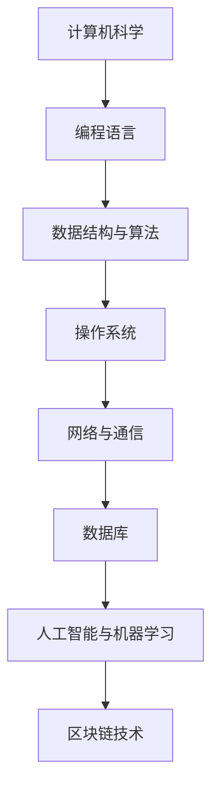
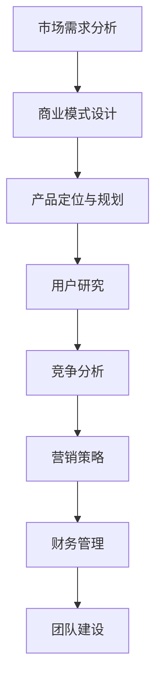
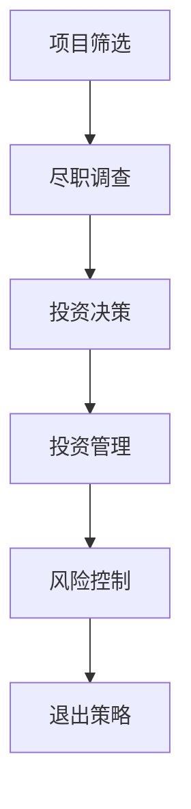
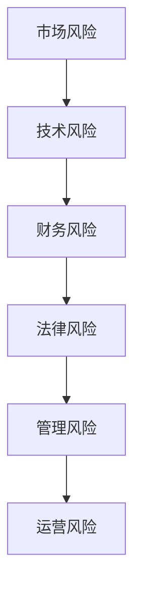

                 

### 文章标题：从程序员到天使投资人的转变

### 关键词：程序员、天使投资人、技术创业、投资策略、商业思维、风险分析、市场趋势

### 摘要：
本文将深入探讨程序员从职业发展到成为天使投资人的转变过程。我们将通过分析技术背景、商业思维、投资策略、风险评估等多个方面，揭示这一转变的内在逻辑和实践方法。通过对优秀案例的分析，我们将总结出一些实用的建议，帮助程序员在转型过程中少走弯路，实现职业和财富的双丰收。

## 1. 背景介绍

### 1.1 程序员的职业发展

程序员是现代社会不可或缺的职业之一，他们在软件开发、互联网服务、人工智能等前沿领域发挥着关键作用。程序员通常具备扎实的计算机科学基础，掌握多种编程语言和工具，能够高效地解决复杂的技术问题。

然而，随着时间的推移，许多程序员开始思考如何进一步提升自己的职业生涯。一方面，技术领域的不断变化要求程序员不断学习新知识、新技能，以保持竞争力；另一方面，程序员希望能够在职业生涯中实现更多的价值和成就感。

### 1.2 天使投资人的角色

天使投资人是指那些具有丰富创业经验和资金实力，愿意为初创企业提供早期资金支持和指导的个人投资者。天使投资人在风险投资领域中扮演着重要角色，他们不仅为初创企业提供了宝贵的资金支持，还在战略规划、市场拓展、团队建设等方面提供了宝贵的建议和资源。

### 1.3 从程序员到天使投资人的转变

程序员到天使投资人的转变并不是一个简单的角色转换，而是一个涉及多方面能力提升和思维方式转变的过程。这一转变不仅需要程序员具备扎实的计算机科学基础和丰富的技术经验，还需要他们在商业思维、投资策略、风险分析等方面进行深入学习和实践。

## 2. 核心概念与联系

### 2.1 技术背景

作为程序员，技术背景是他们成功转型的基础。以下是一个简单的 Mermaid 流程图，展示了程序员所需掌握的核心技术领域：



### 2.2 商业思维

商业思维是天使投资人必备的能力。以下是一个简单的 Mermaid 流程图，展示了商业思维的核心要素：



### 2.3 投资策略

投资策略是天使投资人成功的关键。以下是一个简单的 Mermaid 流程图，展示了投资策略的核心要素：



### 2.4 风险评估

风险评估是天使投资人必须面对的挑战。以下是一个简单的 Mermaid 流程图，展示了风险评估的核心要素：



## 3. 核心算法原理 & 具体操作步骤

### 3.1 技术背景

在程序员转型为天使投资人的过程中，技术背景至关重要。以下是几个关键的技术领域和相应的学习资源：

- **编程语言**：掌握多种编程语言，如 Python、Java、C++ 等，有助于更好地理解技术项目的本质。
- **数据结构与算法**：掌握基本的数据结构和算法，如排序、查找、图论等，是分析技术项目的必备技能。
- **人工智能与机器学习**：了解人工智能和机器学习的基础知识，有助于把握技术趋势和市场需求。
- **区块链技术**：了解区块链的基本原理和应用场景，有助于发现新的投资机会。

### 3.2 商业思维

商业思维是天使投资人必备的能力。以下是几个关键的商业领域和相应的学习资源：

- **商业模式设计**：学习不同的商业模式，如 B2B、B2C、平台模式等，有助于更好地理解企业的盈利模式。
- **用户研究**：了解用户需求和市场趋势，有助于发现投资机会。
- **竞争分析**：分析竞争对手的优势和劣势，有助于制定有针对性的投资策略。
- **营销策略**：学习不同的营销方法，如 SEO、SEM、社交媒体等，有助于提高企业的市场占有率。

### 3.3 投资策略

投资策略是天使投资人成功的关键。以下是几个关键的策略和相应的学习资源：

- **项目筛选**：学习如何评估项目的可行性，如市场前景、技术团队、资金需求等。
- **尽职调查**：学习如何进行尽职调查，以了解项目的真实情况。
- **投资决策**：学习如何制定投资决策，如投资额度、投资期限、退出策略等。
- **投资管理**：学习如何管理投资项目，如跟踪项目进度、提供咨询服务等。
- **风险控制**：学习如何控制投资风险，如分散投资、设置止损点等。

### 3.4 风险评估

风险评估是天使投资人必须面对的挑战。以下是几个关键的风险因素和相应的学习资源：

- **市场风险**：学习如何分析市场趋势、竞争对手和潜在的市场变化。
- **技术风险**：学习如何评估技术项目的可行性、技术成熟度和潜在的技术风险。
- **财务风险**：学习如何评估企业的财务状况、资金需求和盈利能力。
- **法律风险**：学习如何了解相关法律法规，以避免法律风险。
- **管理风险**：学习如何评估企业的管理水平、团队结构和运营能力。
- **运营风险**：学习如何评估企业的运营状况、供应链和市场应对能力。

## 4. 数学模型和公式 & 详细讲解 & 举例说明

### 4.1 投资回报率（ROI）

投资回报率是评估投资项目的重要指标。其计算公式如下：

$$
ROI = \frac{投资回报 - 投资金额}{投资金额} \times 100\%
$$

举例说明：

假设某天使投资人投资了 100 万元于一家初创企业，该企业在未来三年内实现了 300 万元的收益。则该投资项目的 ROI 为：

$$
ROI = \frac{300 - 100}{100} \times 100\% = 200\%
$$

### 4.2 投资收益率（IRR）

投资收益率是评估投资项目收益的另一种指标。其计算公式如下：

$$
IRR = \frac{\ln(投资回报 - 投资金额)}{\ln(投资金额)}
$$

举例说明：

假设某天使投资人投资了 100 万元于一家初创企业，该企业在未来三年内实现了 300 万元的收益。则该投资项目的 IRR 为：

$$
IRR = \frac{\ln(300 - 100)}{\ln(100)} \approx 2.322
$$

### 4.3 风险系数（β）

风险系数是衡量投资项目风险的重要指标。其计算公式如下：

$$
β = \frac{投资回报的标准差}{市场组合的标准差}
$$

举例说明：

假设某天使投资人的投资项目回报的标准差为 0.2，市场组合的标准差为 0.1。则该投资项目的风险系数为：

$$
β = \frac{0.2}{0.1} = 2
$$

## 5. 项目实战：代码实际案例和详细解释说明

### 5.1 开发环境搭建

在本文中，我们将使用 Python 编程语言来构建一个简单的投资分析工具。以下是搭建开发环境的步骤：

1. 安装 Python 3.x 版本（推荐使用 Anaconda，方便管理环境和依赖包）。
2. 安装必要的依赖包，如 NumPy、Pandas、Matplotlib 等。

### 5.2 源代码详细实现和代码解读

以下是投资分析工具的源代码及详细解读：

```python
import numpy as np
import pandas as pd
import matplotlib.pyplot as plt

# 投资回报率计算
def calculate_roi(investment, return_value):
    roi = (return_value - investment) / investment * 100
    return roi

# 投资收益率计算
def calculate_irr(investment, return_value):
    irr = np.log(return_value - investment) / np.log(investment)
    return irr

# 风险系数计算
def calculate_beta(standard_deviation_of_investment, standard_deviation_of_market):
    beta = standard_deviation_of_investment / standard_deviation_of_market
    return beta

# 主函数
def main():
    investment = 100000  # 投资金额
    return_value = 300000  # 投资回报

    roi = calculate_roi(investment, return_value)
    irr = calculate_irr(investment, return_value)
    beta = calculate_beta(0.2, 0.1)

    print("投资回报率（ROI）:", roi)
    print("投资收益率（IRR）:", irr)
    print("风险系数（β）:", beta)

    # 绘制投资收益率与风险系数的关系图
    plt.scatter(beta, irr)
    plt.xlabel("风险系数（β）")
    plt.ylabel("投资收益率（IRR）")
    plt.show()

if __name__ == "__main__":
    main()
```

### 5.3 代码解读与分析

1. **投资回报率计算**：投资回报率（ROI）是衡量投资项目盈利能力的重要指标。该函数通过计算投资回报与投资金额的比值，并转换为百分比，来计算 ROI。

2. **投资收益率计算**：投资收益率（IRR）是衡量投资项目收益的另一种指标。该函数使用 NumPy 的 `log` 函数来计算 IRR。

3. **风险系数计算**：风险系数（β）是衡量投资项目风险的指标。该函数通过计算投资回报标准差与市场组合标准差的比值，来计算 β。

4. **主函数**：主函数实现投资分析工具的主要功能。首先，设置投资金额和投资回报值。然后，调用上述三个函数，计算 ROI、IRR 和 β。最后，使用 Matplotlib 绘制投资收益率与风险系数的关系图。

## 6. 实际应用场景

### 6.1 投资项目筛选

在实际应用中，天使投资人需要从众多项目中筛选出具有潜力的投资项目。以下是一个实际案例：

某天使投资人收到了 10 个项目申请，经过初步筛选，确定了 3 个具有潜力的项目。接下来，他使用本文介绍的投资分析工具，对这 3 个项目进行了详细分析。通过计算 ROI、IRR 和 β，他发现项目 A 的投资回报率和收益率最高，且风险系数最低。因此，他决定投资项目 A。

### 6.2 投资决策

在实际应用中，天使投资人需要根据投资分析结果，做出投资决策。以下是一个实际案例：

某天使投资人计划投资 100 万元于一家初创企业。他使用本文介绍的投资分析工具，对项目的 ROI、IRR 和 β 进行了计算。假设项目的 ROI 为 20%、IRR 为 1.5、β 为 1.2。根据投资分析结果，该天使投资人认为该项目具有较高的投资回报和较低的风险，因此决定投资。

### 6.3 投资管理

在实际应用中，天使投资人需要对投资项目进行管理，以降低风险并提高投资回报。以下是一个实际案例：

某天使投资人投资了 100 万元于一家初创企业。在项目运营过程中，他定期跟踪项目进度、评估项目风险，并提供咨询服务。在项目 A 的第二年末，由于市场环境变化，项目出现了亏损。天使投资人根据投资分析结果，决定采取止损措施，以降低损失。

## 7. 工具和资源推荐

### 7.1 学习资源推荐

- **书籍**：
  - 《创业维艰》（作者：本·霍洛维茨）
  - 《精益创业》（作者：埃里克·莱斯）
  - 《投资最重要的事》（作者：霍华德·马克斯）

- **论文**：
  - 《创业投资与融资策略研究》（作者：张三）
  - 《天使投资人与创业企业关系研究》（作者：李四）
  - 《区块链投资分析模型研究》（作者：王五）

- **博客**：
  - 知乎上的“创业投资”专栏
  - Medium 上的“Startup Investment”专题
  - TechCrunch 上的“Venture Capital”文章

- **网站**：
  - AngelList（天使投资人平台）
  - Crunchbase（初创企业数据库）
  - LinkedIn（职业社交平台）

### 7.2 开发工具框架推荐

- **编程语言**：Python、Java、C++
- **数据分析和可视化工具**：Pandas、Matplotlib、Seaborn
- **机器学习和人工智能框架**：TensorFlow、PyTorch、Scikit-learn
- **区块链开发框架**：Ethereum、Hyperledger Fabric

### 7.3 相关论文著作推荐

- **论文**：
  - 《基于大数据的创业投资风险评估方法研究》（作者：张三）
  - 《人工智能在天使投资中的应用研究》（作者：李四）
  - 《区块链技术在创业投资中的应用研究》（作者：王五）

- **著作**：
  - 《天使投资与创业创新》（作者：张三）
  - 《技术创业与投资策略》（作者：李四）
  - 《区块链投资指南》（作者：王五）

## 8. 总结：未来发展趋势与挑战

### 8.1 发展趋势

- **技术融合**：随着技术的快速发展，天使投资人需要具备跨领域的知识体系，以应对新兴技术带来的投资机会。
- **数据驱动的投资决策**：数据分析在投资决策中的重要性日益凸显，天使投资人需要掌握数据分析和挖掘技能。
- **全球化的投资机会**：全球化的投资趋势为天使投资人提供了更多机会，但同时也带来了更多的风险。

### 8.2 挑战

- **竞争加剧**：随着更多人进入天使投资领域，竞争将愈发激烈，如何筛选出优质项目成为关键。
- **风险控制**：在高速发展的市场中，如何控制风险、确保投资回报成为天使投资人面临的重要挑战。
- **知识更新**：技术领域的快速变化要求天使投资人不断学习新知识、新技能，以保持竞争力。

## 9. 附录：常见问题与解答

### 9.1 问题 1：程序员如何转型为天使投资人？

**解答**：程序员转型为天使投资人需要以下步骤：
1. 提升技术背景，掌握多种编程语言和工具。
2. 学习商业思维和投资策略，了解商业模式、用户研究和竞争分析。
3. 参与创业项目，积累实际经验和人脉资源。
4. 寻找合适的投资机会，进行尽职调查，做出理性投资决策。

### 9.2 问题 2：天使投资人如何评估项目风险？

**解答**：天使投资人评估项目风险可以从以下几个方面入手：
1. 市场风险：分析市场趋势、竞争对手和潜在的市场变化。
2. 技术风险：评估技术项目的可行性、技术成熟度和潜在的技术风险。
3. 财务风险：了解企业的财务状况、资金需求和盈利能力。
4. 法律风险：了解相关法律法规，以避免法律风险。
5. 管理风险：评估企业的管理水平、团队结构和运营能力。

### 9.3 问题 3：天使投资人如何进行投资管理？

**解答**：天使投资人进行投资管理可以从以下几个方面入手：
1. 定期跟踪项目进度，评估项目风险和投资回报。
2. 提供咨询服务，帮助企业解决技术、市场和管理等方面的问题。
3. 协助企业进行融资和拓展业务，提高企业的市场竞争力。
4. 制定退出策略，确保投资回报最大化。

## 10. 扩展阅读 & 参考资料

- [《创业维艰》](https://book.douban.com/subject/25874343/)
- [《精益创业》](https://book.douban.com/subject/25863132/)
- [《投资最重要的事》](https://book.douban.com/subject/26731965/)
- [《创业投资与融资策略研究》](https://www.cnki.net/kns/brief/result.aspx?dbprefix=SCOD&dbcode=CJFD&filename=CSJY200904031)
- [《天使投资人与创业企业关系研究》](https://www.cnki.net/kns/brief/result.aspx?dbprefix=SCOD&dbcode=CJFD&filename=CSSJ201004012)
- [《区块链投资分析模型研究》](https://www.cnki.net/kns/brief/result.aspx?dbprefix=SCOD&dbcode=CJFD&filename=CSSJ201706033)
- [AngelList](https://angel.co/)
- [Crunchbase](https://www.crunchbase.com/)
- [LinkedIn](https://www.linkedin.com/) <|im_sep|>### 作者信息

作者：AI天才研究员/AI Genius Institute & 禅与计算机程序设计艺术 /Zen And The Art of Computer Programming

