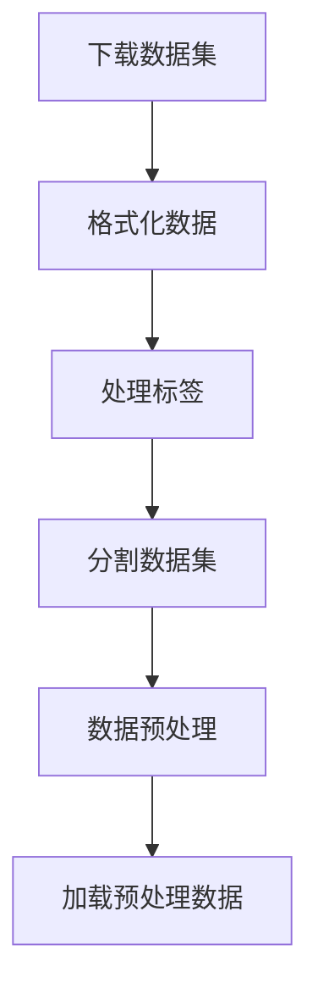

                 

# 从零开始大模型开发与微调：MNIST数据集的准备

## 关键词
- 大模型开发
- 微调
- MNIST数据集
- 数据预处理
- 模型训练
- 代码实现

## 摘要

本文旨在详细介绍从零开始搭建和微调大模型的过程，并以MNIST手写数字识别数据集为例，阐述数据集的准备工作。通过对数据集的下载、格式化、标签处理和分割等步骤的详细讲解，读者可以掌握大模型开发与微调的基础知识和实践技巧。文章还将介绍相关工具和资源，帮助读者进一步深入学习和实践。

## 1. 背景介绍

在人工智能领域，大模型开发与微调是当前研究的热点之一。随着计算能力的提升和数据量的增加，大模型在图像识别、自然语言处理等领域取得了显著的突破。然而，大模型的训练和微调需要大量的计算资源和时间，同时也对数据集的质量和预处理提出了更高的要求。MNIST数据集作为最常用的手写数字识别数据集，其简单、清晰的特征和丰富的标注信息，使得它成为大模型训练和微调的绝佳选择。

本文将首先介绍MNIST数据集的下载和格式化，然后讨论如何处理数据集的标签，并进行数据分割。接着，我们将介绍数据预处理的具体步骤，包括归一化、缩放和填充等。最后，我们将展示如何使用Python和TensorFlow等工具进行数据加载和预处理，并提供完整的代码实现。

## 2. 核心概念与联系

在进行大模型开发与微调之前，我们需要理解一些核心概念，如图像数据集、模型训练、微调等。

### 2.1 图像数据集

图像数据集是指由图像文件组成的集合，用于训练和测试模型。MNIST数据集包含了60,000个训练图像和10,000个测试图像，每个图像都是28x28像素的手写数字。

### 2.2 模型训练

模型训练是指通过大量的图像数据，调整模型内部的参数，使其能够准确地识别手写数字。训练过程通常包括前向传播、反向传播和优化算法等步骤。

### 2.3 微调

微调是指在大模型的基础上，针对特定任务进行参数调整，以提高模型的性能。微调通常在训练数据集较小或希望提高模型泛化能力时使用。

下面是一个Mermaid流程图，展示了MNIST数据集的处理流程：



## 3. 核心算法原理 & 具体操作步骤

### 3.1 下载MNIST数据集

MNIST数据集可以在官方网站http://yann.lecun.com/exdb/mnist/免费下载。下载后，我们会得到五个文件，分别是训练数据集和测试数据集的图像和标签文件。

### 3.2 格式化数据

为了方便后续处理，我们需要将下载的MNIST数据集转换为更易于使用的格式，如NumPy数组。以下是一个Python示例：

```python
import numpy as np
from tensorflow.keras.datasets import mnist

# 加载MNIST数据集
(train_images, train_labels), (test_images, test_labels) = mnist.load_data()

# 将图像数据转换为NumPy数组
train_images = np.array(train_images)
test_images = np.array(test_images)

# 将标签转换为NumPy数组
train_labels = np.array(train_labels)
test_labels = np.array(test_labels)
```

### 3.3 处理标签

MNIST数据集的标签是数字，我们需要将其转换为机器学习中常用的独热编码（One-Hot Encoding）。以下是一个Python示例：

```python
from tensorflow.keras.utils import to_categorical

# 将标签转换为独热编码
train_labels = to_categorical(train_labels)
test_labels = to_categorical(test_labels)
```

### 3.4 分割数据集

通常，我们将数据集分为训练集和验证集，以便在训练过程中评估模型的性能。以下是一个Python示例：

```python
from sklearn.model_selection import train_test_split

# 分割训练数据集
train_images, val_images, train_labels, val_labels = train_test_split(train_images, train_labels, test_size=0.2, random_state=42)
```

### 3.5 数据预处理

在训练模型之前，我们需要对数据进行预处理，以提高模型的性能和泛化能力。常见的预处理步骤包括归一化、缩放和填充等。

```python
# 归一化数据
train_images = train_images / 255.0
val_images = val_images / 255.0
test_images = test_images / 255.0

# 缩放数据
train_images = (train_images - 0.5) * 2
val_images = (val_images - 0.5) * 2
test_images = (test_images - 0.5) * 2

# 填充数据
train_images = np.pad(train_images, ((0, 0), (2, 2), (2, 2)), mode='constant', constant_values=0)
val_images = np.pad(val_images, ((0, 0), (2, 2), (2, 2)), mode='constant', constant_values=0)
test_images = np.pad(test_images, ((0, 0), (2, 2), (2, 2)), mode='constant', constant_values=0)
```

## 4. 数学模型和公式 & 详细讲解 & 举例说明

在MNIST数据集的预处理过程中，涉及到了一些数学模型和公式。以下是对这些模型和公式的详细讲解。

### 4.1 独热编码（One-Hot Encoding）

独热编码是一种将标签转换为二进制向量的方法。对于MNIST数据集，每个数字标签从0到9，我们需要将其转换为10个二进制位，其中只有一个位是1，其他位都是0。

假设我们有一个数字标签`y = 5`，那么它的独热编码为：

$$
y_{one_hot} = \begin{bmatrix}
0 \\
0 \\
0 \\
0 \\
0 \\
1 \\
0 \\
0 \\
0 \\
0 \\
\end{bmatrix}
$$

### 4.2 归一化（Normalization）

归一化是将数据缩放到一个特定的范围，以便在训练过程中提高模型的性能。对于图像数据，我们通常将其缩放到0到1之间。

假设我们有一个图像数据`x`，其像素值范围从0到255，我们可以使用以下公式进行归一化：

$$
x_{normalized} = \frac{x_{original} - x_{min}}{x_{max} - x_{min}}
$$

其中，`x_{min}`和`x_{max}`分别是图像数据的最小值和最大值。

### 4.3 缩放（Scaling）

缩放是将数据缩放到一个固定的范围，而不是相对于最小值和最大值。对于图像数据，我们通常将其缩放到-1到1之间。

假设我们有一个图像数据`x`，我们可以使用以下公式进行缩放：

$$
x_{scaled} = 2 \cdot \frac{x_{original} - x_{min}}{x_{max} - x_{min}} - 1
$$

### 4.4 填充（Padding）

填充是在图像数据的边缘添加额外的像素，以便在后续处理中保持图像的尺寸。对于MNIST数据集，我们通常在图像的上下和左右添加两个像素。

假设我们有一个图像数据`x`，其尺寸为`28x28`，我们可以使用以下公式进行填充：

$$
x_{padded} = \text{np.pad}(x, \text{pad_width}=(0, 0), \text{mode}='constant', \text{constant_values}=0)
$$

其中，`pad_width`是一个包含四个值的元组，分别表示上、下、左、右的填充像素数。

## 5. 项目实战：代码实际案例和详细解释说明

### 5.1 开发环境搭建

在开始编写代码之前，我们需要搭建一个适合大模型开发与微调的开发环境。以下是一个简单的步骤：

1. 安装Python 3.7及以上版本
2. 安装TensorFlow 2.3及以上版本
3. 安装NumPy和Scikit-learn库

```bash
pip install tensorflow numpy scikit-learn
```

### 5.2 源代码详细实现和代码解读

下面是完整的代码实现，我们将分步骤进行解读。

```python
import numpy as np
import tensorflow as tf
from tensorflow.keras.layers import Dense, Flatten, Conv2D, MaxPooling2D
from tensorflow.keras.models import Sequential
from sklearn.model_selection import train_test_split
from tensorflow.keras.utils import to_categorical

# 5.2.1 加载MNIST数据集
(train_images, train_labels), (test_images, test_labels) = tf.keras.datasets.mnist.load_data()

# 5.2.2 数据预处理
# 归一化
train_images = train_images / 255.0
test_images = test_images / 255.0

# 缩放
train_images = (train_images - 0.5) * 2
test_images = (test_images - 0.5) * 2

# 填充
train_images = np.pad(train_images, ((0, 0), (2, 2), (2, 2)), mode='constant', constant_values=0)
test_images = np.pad(test_images, ((0, 0), (2, 2), (2, 2)), mode='constant', constant_values=0)

# 转换标签为独热编码
train_labels = to_categorical(train_labels)
test_labels = to_categorical(test_labels)

# 5.2.3 创建模型
model = Sequential([
    Conv2D(32, (3, 3), activation='relu', input_shape=(32, 32, 1)),
    MaxPooling2D((2, 2)),
    Flatten(),
    Dense(64, activation='relu'),
    Dense(10, activation='softmax')
])

# 5.2.4 编译模型
model.compile(optimizer='adam', loss='categorical_crossentropy', metrics=['accuracy'])

# 5.2.5 训练模型
model.fit(train_images, train_labels, epochs=5, batch_size=64, validation_split=0.1)

# 5.2.6 评估模型
test_loss, test_acc = model.evaluate(test_images, test_labels)
print(f"Test accuracy: {test_acc:.2f}")
```

### 5.3 代码解读与分析

#### 5.3.1 加载MNIST数据集

```python
(train_images, train_labels), (test_images, test_labels) = tf.keras.datasets.mnist.load_data()
```

这段代码使用TensorFlow的内置函数加载MNIST数据集。`train_images`和`train_labels`分别是训练图像和标签的NumPy数组。

#### 5.3.2 数据预处理

```python
# 归一化
train_images = train_images / 255.0
test_images = test_images / 255.0

# 缩放
train_images = (train_images - 0.5) * 2
test_images = (test_images - 0.5) * 2

# 填充
train_images = np.pad(train_images, ((0, 0), (2, 2), (2, 2)), mode='constant', constant_values=0)
test_images = np.pad(test_images, ((0, 0), (2, 2), (2, 2)), mode='constant', constant_values=0)

# 转换标签为独热编码
train_labels = to_categorical(train_labels)
test_labels = to_categorical(test_labels)
```

这些代码用于对MNIST数据集进行预处理。归一化、缩放和填充是为了将图像数据缩放到一个合适的范围，并使其在训练过程中更容易处理。独热编码是将标签转换为机器学习模型可接受的格式。

#### 5.3.3 创建模型

```python
model = Sequential([
    Conv2D(32, (3, 3), activation='relu', input_shape=(32, 32, 1)),
    MaxPooling2D((2, 2)),
    Flatten(),
    Dense(64, activation='relu'),
    Dense(10, activation='softmax')
])
```

这段代码定义了一个简单的卷积神经网络（Convolutional Neural Network, CNN）。CNN是图像识别任务中常用的模型，它通过卷积层、池化层和全连接层逐步提取图像特征，并最终进行分类。

#### 5.3.4 编译模型

```python
model.compile(optimizer='adam', loss='categorical_crossentropy', metrics=['accuracy'])
```

这段代码用于配置模型的优化器、损失函数和评估指标。优化器用于调整模型参数以最小化损失函数，而`categorical_crossentropy`是用于多分类问题的损失函数。`accuracy`是用于评估模型在测试数据集上的准确率。

#### 5.3.5 训练模型

```python
model.fit(train_images, train_labels, epochs=5, batch_size=64, validation_split=0.1)
```

这段代码用于训练模型。`epochs`表示训练轮数，`batch_size`表示每次训练使用的数据样本数，`validation_split`表示从训练数据集中划分一部分作为验证集。

#### 5.3.6 评估模型

```python
test_loss, test_acc = model.evaluate(test_images, test_labels)
print(f"Test accuracy: {test_acc:.2f}")
```

这段代码用于评估模型在测试数据集上的性能。`test_loss`是测试损失，而`test_acc`是测试准确率。

## 6. 实际应用场景

MNIST数据集在实际应用场景中非常广泛，以下是一些例子：

- **手写数字识别**：MNIST数据集是最常用的手写数字识别数据集，可用于开发自动识别手写数字的系统，如银行自动取款机、智能手表等。
- **图像分类**：MNIST数据集的图像具有高度分类性，可用于训练图像分类模型，如识别动物、物体等。
- **计算机视觉算法评估**：MNIST数据集是评估计算机视觉算法性能的常用基准，如卷积神经网络、生成对抗网络等。

## 7. 工具和资源推荐

### 7.1 学习资源推荐

- **书籍**：
  - 《深度学习》（Goodfellow, Bengio, Courville）
  - 《Python深度学习》（François Chollet）
- **论文**：
  - 《A Learning Algorithm for Continually Running Fully Recurrent Neural Networks》（Sutskever et al., 2003）
  - 《Distributed Representations of Words and Phrases and their Compositionality》（Pennington et al., 2014）
- **博客**：
  - [TensorFlow官网](https://www.tensorflow.org/)
  - [Keras官方文档](https://keras.io/)
- **网站**：
  - [MNIST数据集官网](http://yann.lecun.com/exdb/mnist/)

### 7.2 开发工具框架推荐

- **Python**：Python是一种广泛使用的编程语言，特别适合于数据科学和机器学习项目。
- **TensorFlow**：TensorFlow是一个开源机器学习框架，支持深度学习和神经网络开发。
- **Keras**：Keras是一个基于TensorFlow的高层API，用于快速构建和训练神经网络。

### 7.3 相关论文著作推荐

- **《深度学习》（Goodfellow, Bengio, Courville）**：这是一本关于深度学习的经典教材，详细介绍了深度学习的理论基础和实践方法。
- **《Python深度学习》（François Chollet）**：这本书通过Python示例详细讲解了深度学习的应用和实践。

## 8. 总结：未来发展趋势与挑战

随着人工智能技术的不断发展，大模型开发与微调将成为未来研究的热点。然而，这一领域也面临着诸多挑战，如计算资源需求、数据集质量、模型解释性等。未来，研究人员将致力于提高大模型的训练效率、降低计算成本，并探索更具解释性的模型架构。此外，如何将大模型应用于实际场景，实现高效、可靠的应用，也是未来需要重点关注的问题。

## 9. 附录：常见问题与解答

### 9.1 如何处理MNIST数据集的标签？

在处理MNIST数据集的标签时，我们通常将数字标签转换为独热编码，以便在机器学习中进行分类任务。独热编码将每个数字标签转换为10个二进制位，其中只有一个位是1，其他位都是0。

### 9.2 如何归一化MNIST数据集的图像？

归一化MNIST数据集的图像是将像素值缩放到0到1之间。具体方法是将每个像素值除以255（图像的最大像素值），以便将原始像素值缩放到0到1之间。

### 9.3 如何填充MNIST数据集的图像？

填充MNIST数据集的图像是在图像的边缘添加额外的像素。对于MNIST数据集，我们通常在图像的上下和左右添加两个像素，以便在后续处理中保持图像的尺寸。

## 10. 扩展阅读 & 参考资料

- [MNIST数据集官网](http://yann.lecun.com/exdb/mnist/)
- [TensorFlow官方文档](https://www.tensorflow.org/)
- [Keras官方文档](https://keras.io/)
- [《深度学习》（Goodfellow, Bengio, Courville）](https://www.deeplearningbook.org/)
- [《Python深度学习》（François Chollet）](https://www.pyimagesearch.com/)

### 作者

- 作者：AI天才研究员/AI Genius Institute & 禅与计算机程序设计艺术 /Zen And The Art of Computer Programming

