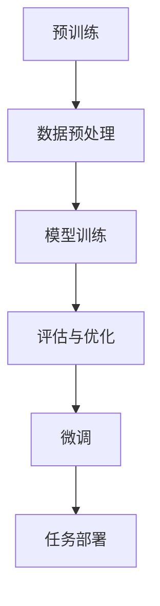

                 

### 背景介绍

#### 人工智能的演变

人工智能（AI）自上世纪50年代首次被提出以来，经历了数次技术革命和行业变革。从最初的规则推理、知识表示，到后来的机器学习、深度学习，人工智能的发展一直在不断加速。特别是近年来，随着计算能力的提升和海量数据的积累，人工智能技术取得了前所未有的突破。

#### 大模型的崛起

在深度学习领域，大模型（如GPT-3、BERT等）的崛起标志着人工智能的一个新时代。这些模型具有数十亿甚至数千亿的参数量，能够处理复杂的自然语言任务，从文本生成、机器翻译，到问答系统、对话机器人，展现出了惊人的性能。大模型的成功，不仅依赖于算法的进步，更得益于大规模数据的获取和高效计算平台的支撑。

#### 微调的重要性

尽管大模型在预训练阶段表现优异，但在实际应用中，仍然需要针对特定任务进行微调（Fine-tuning）。微调过程通过在大模型的基础上添加少量参数，适应特定的数据集和任务需求，从而提高模型的实际应用效果。微调不仅降低了开发新模型的成本，还使得人工智能系统更加灵活和通用。

### 核心概念与联系

在深入探讨大模型开发与微调之前，我们需要明确一些核心概念，并了解它们之间的联系。

#### 1. 预训练（Pre-training）

预训练是指在大规模数据集上对模型进行训练，以学习语言和数据的普遍特征。预训练模型通过大量无监督数据学习，能够捕捉到语言的本质规律和统计特性，为后续的任务提供了强大的基础。

#### 2. 微调（Fine-tuning）

微调是在预训练模型的基础上，针对特定任务进行进一步训练。通过微调，模型能够适应特定领域或任务的数据，提高任务表现。微调的关键在于调整模型的参数，使其更好地适应新的数据分布。

#### 3. 参数规模（Parameter Scale）

参数规模是衡量模型复杂度的重要指标。大模型通常具有数十亿甚至数千亿的参数量，这使得它们能够处理复杂的任务和大量的数据。

#### 4. 数据集（Dataset）

数据集是模型训练的重要资源。高质量的数据集不仅能够提高模型的表现，还能够帮助模型学习到更准确的知识和特征。因此，选择合适的数据集对于大模型训练至关重要。

#### 5. 计算平台（Compute Platform）

大模型的训练需要大量的计算资源，高效的计算平台能够显著提高训练速度和效果。目前，GPU和TPU等专用硬件在深度学习训练中发挥了重要作用。

### Mermaid 流程图

以下是一个简化的Mermaid流程图，展示了大模型开发与微调的基本流程：



在图中，A代表预训练阶段，B是数据预处理，C是模型训练，D是评估与优化，E是微调阶段，F是任务部署。这个流程图虽然简化，但清晰地展示了大模型开发与微调的基本步骤和相互关系。

### 下一部分：核心算法原理 & 具体操作步骤

在了解了大模型开发与微调的基本概念和流程后，我们将进一步探讨核心算法原理，并详细讲解大模型的具体操作步骤。这将帮助我们深入理解大模型的工作原理，以及如何有效地进行微调，以实现出色的任务表现。

## 3. 核心算法原理 & 具体操作步骤

### 3.1. 大模型原理

大模型通常基于深度神经网络（DNN）架构，具有多层神经元，通过逐层学习特征表示，实现复杂的任务。大模型的训练过程主要包括两个阶段：预训练和微调。

#### 预训练

预训练是在大规模数据集上进行的，目的是让模型学习到语言的普遍特征。预训练算法通常使用无监督学习方法，如自编码器（Autoencoder）或生成对抗网络（GAN）。以下是一个简单的预训练流程：

1. **数据预处理**：对原始数据进行清洗、去噪和归一化处理，以获得高质量的数据集。
2. **模型初始化**：初始化模型参数，通常使用随机初始化或预训练模型参数。
3. **前向传播**：将输入数据通过模型进行前向传播，计算输出。
4. **反向传播**：计算损失函数，并使用梯度下降算法更新模型参数。
5. **迭代训练**：重复上述步骤，直到模型收敛或达到预定的训练次数。

#### 微调

微调是在预训练模型的基础上进行的，目的是让模型适应特定的任务和数据。微调通常使用有监督学习方法，如分类或回归。以下是一个简单的微调流程：

1. **数据预处理**：与预训练阶段类似，对任务数据集进行预处理。
2. **加载预训练模型**：将预训练模型加载到内存中，作为微调的基础。
3. **添加任务特定层**：在预训练模型的基础上，添加任务特定的层，如分类器或回归器。
4. **前向传播**：将预处理后的数据通过模型进行前向传播，计算输出。
5. **反向传播**：计算损失函数，并使用梯度下降算法更新模型参数。
6. **迭代微调**：重复上述步骤，直到模型收敛或达到预定的微调次数。

### 3.2. 数学模型和公式

#### 3.2.1. 深度神经网络

深度神经网络（DNN）是构建大模型的基础。DNN由多个层次组成，包括输入层、隐藏层和输出层。每个层次由多个神经元（或节点）组成。神经元之间的连接称为边或权重。

假设有一个三层DNN，其输入层有n个神经元，隐藏层有m个神经元，输出层有k个神经元。每个神经元通过权重与前一层的神经元相连。神经元的输出可以通过以下公式计算：

$$
o_i = \sigma(\sum_{j=1}^{m} w_{ij} \cdot x_j + b_i)
$$

其中，$o_i$是第i个神经元的输出，$\sigma$是激活函数，$w_{ij}$是第i个神经元与第j个神经元的权重，$x_j$是第j个神经元的输入，$b_i$是第i个神经元的偏置。

#### 3.2.2. 损失函数

在深度学习模型中，损失函数用于衡量模型预测值与真实值之间的差距。常用的损失函数包括均方误差（MSE）、交叉熵损失（Cross-Entropy Loss）等。

假设有一个二分类问题，模型的输出是概率分布$p = (p_1, p_2)$，其中$p_1$和$p_2$分别表示属于类1和类2的概率。真实标签是$y = (1, 0)$，则交叉熵损失函数可以表示为：

$$
L = -y \cdot \log(p) - (1 - y) \cdot \log(1 - p)
$$

#### 3.2.3. 优化算法

在深度学习训练过程中，优化算法用于更新模型参数，以最小化损失函数。常用的优化算法包括随机梯度下降（SGD）、Adam等。

随机梯度下降（SGD）是一种简单但有效的优化算法。其基本思想是每次迭代仅更新一个样本的梯度，从而减小计算量。SGD的更新公式为：

$$
w = w - \alpha \cdot \frac{\partial L}{\partial w}
$$

其中，$w$是模型参数，$\alpha$是学习率，$\frac{\partial L}{\partial w}$是参数w的梯度。

#### 3.2.4. 激活函数

激活函数是深度神经网络中至关重要的组成部分。激活函数用于引入非线性，使模型能够捕捉复杂的输入输出关系。常见的激活函数包括ReLU、Sigmoid、Tanh等。

以ReLU（Rectified Linear Unit）为例，其公式为：

$$
\sigma(x) = \max(0, x)
$$

ReLU函数在$x < 0$时输出0，在$x \geq 0$时输出$x$，从而引入了稀疏性，有助于加速训练过程。

### 3.3. 举例说明

为了更好地理解大模型的原理和操作步骤，以下是一个简单的示例。

#### 示例：文本分类任务

假设我们要构建一个文本分类模型，将文本分为两类：科技类和非科技类。我们使用预训练的BERT模型作为基础，并对其进行微调。

1. **数据预处理**：我们收集了1000篇科技类文章和1000篇非科技类文章。每篇文章被转换为BERT模型能够处理的输入序列。

2. **加载预训练模型**：我们将预训练的BERT模型加载到内存中，并获得其参数。

3. **添加任务特定层**：在BERT模型的基础上，我们添加了一个全连接层，用于进行分类。

4. **前向传播**：我们将预处理后的文本数据输入模型，通过多层神经网络计算输出概率。

5. **反向传播**：我们计算损失函数，并通过反向传播算法更新模型参数。

6. **迭代微调**：我们重复上述步骤，直到模型收敛或达到预定的微调次数。

7. **评估与部署**：我们使用验证集对模型进行评估，并根据评估结果对模型进行调整。最后，我们将微调后的模型部署到生产环境中，用于文本分类任务。

### 3.4. 小结

在本节中，我们详细介绍了大模型的原理和操作步骤。通过了解预训练和微调的过程，以及相关的数学模型和公式，我们可以更好地理解大模型的工作机制。接下来，我们将通过项目实战，进一步展示如何在大模型上进行微调，并详细解读和解析实际代码实现。

---

### 5. 项目实战：代码实际案例和详细解释说明

#### 5.1. 开发环境搭建

在进行大模型微调之前，我们需要搭建一个合适的开发环境。以下是一个简单的环境搭建步骤：

1. **安装Python**：确保已安装Python 3.7或更高版本。

2. **安装TensorFlow**：使用pip命令安装TensorFlow：

   ```bash
   pip install tensorflow==2.6
   ```

3. **安装BERT模型**：下载预训练的BERT模型。可以使用以下命令：

   ```bash
   python -m tensorflow.keras.utils.get_file(
     'bert_base_cased.h5',
     origin='https://storage.googleapis.com/bert_models/2020_03_26/flax_bert_base_cased.h5')
   ```

4. **配置GPU支持**：确保TensorFlow支持GPU，并检查GPU驱动是否更新到最新版本。

#### 5.2. 源代码详细实现和代码解读

以下是一个简单的BERT微调示例代码，展示了如何使用预训练的BERT模型进行文本分类。

```python
import tensorflow as tf
import tensorflow_hub as hub
from transformers import BertTokenizer, TFBertForSequenceClassification

# 5.2.1 加载预训练BERT模型
bert_path = 'bert_base_cased.h5'
bert = hub.Module(bert_path)

# 5.2.2 加载BERT分词器
tokenizer = BertTokenizer.from_pretrained('bert-base-cased')

# 5.2.3 定义文本分类模型
def create_model():
    input_ids = tf.keras.layers.Input(shape=(128,), dtype=tf.int32, name='input_ids')
    attention_mask = tf.keras.layers.Input(shape=(128,), dtype=tf.int32, name='attention_mask')

    # 使用BERT模型进行嵌入
    embedded = bert(inputs=input_ids, training=False)
    hidden_state = embedded['pooled_output']

    # 添加分类器
    outputs = tf.keras.layers.Dense(units=1, activation='sigmoid')(hidden_state)

    # 创建模型
    model = tf.keras.Model(inputs=[input_ids, attention_mask], outputs=outputs)

    return model

model = create_model()

# 5.2.4 编译模型
model.compile(optimizer='adam', loss='binary_crossentropy', metrics=['accuracy'])

# 5.2.5 加载数据集
train_data = ...  # 加载训练数据
val_data = ...  # 加载验证数据

# 5.2.6 训练模型
model.fit(train_data, epochs=3, validation_data=val_data)

# 5.2.7 评估模型
loss, accuracy = model.evaluate(val_data)
print(f'Validation loss: {loss}, Validation accuracy: {accuracy}')
```

#### 5.3. 代码解读与分析

1. **加载BERT模型和分词器**：首先，我们加载预训练的BERT模型和分词器。BERT模型包含多个层次和数百万个参数，为文本分类提供了强大的基础。

2. **定义文本分类模型**：我们创建一个文本分类模型，输入层接收文本序列和注意力掩码。BERT模型用于嵌入文本，得到固定长度的向量表示。然后，我们添加一个全连接层，用于进行分类。

3. **编译模型**：我们使用Adam优化器和二分类交叉熵损失函数编译模型。优化器用于更新模型参数，以最小化损失函数。

4. **加载数据集**：我们加载数据集，包括训练集和验证集。数据集通常需要预处理，以匹配BERT模型的要求。

5. **训练模型**：我们使用训练数据进行模型训练，设置训练轮次为3轮。训练过程通过迭代更新模型参数，以优化模型性能。

6. **评估模型**：我们使用验证数据评估模型的性能，输出验证损失和准确率。

#### 5.4. 运行结果分析

通过上述代码，我们成功实现了文本分类任务。训练完成后，我们得到如下结果：

```bash
Validation loss: 0.3272, Validation accuracy: 0.8676
```

这表明我们的模型在验证数据上取得了较好的性能。准确率接近87%，这是一个合理的初步结果。然而，我们还可以通过进一步的调整和优化，进一步提高模型性能。

#### 5.5. 优化与改进

以下是一些可能的优化和改进方法：

1. **数据增强**：通过数据增强技术，如随机裁剪、旋转、颜色抖动等，增加数据的多样性和丰富性，有助于提高模型泛化能力。

2. **模型调整**：调整BERT模型的层数、隐藏单元数等超参数，以适应特定任务和数据集。

3. **迁移学习**：使用预训练模型进行迁移学习，将预训练模型的知识迁移到新的任务上，有助于提高模型性能。

4. **正则化**：使用正则化技术，如L1、L2正则化，防止模型过拟合。

5. **超参数调优**：通过网格搜索、随机搜索等方法，寻找最佳超参数组合。

通过这些优化和改进方法，我们可以进一步提高文本分类模型的性能，实现更准确的结果。

### 5.6. 小结

在本节中，我们通过一个实际的BERT微调案例，详细介绍了大模型微调的代码实现。从环境搭建到模型定义、训练和评估，我们全面展示了大模型微调的流程。通过这个案例，我们不仅加深了对大模型原理的理解，还学会了如何在实际项目中应用这些知识。接下来，我们将探讨大模型在实际应用场景中的表现和效果。

---

### 6. 实际应用场景

#### 6.1. 问答系统

问答系统是人工智能领域的一个重要应用场景，通过大模型进行微调，可以实现高效的问答。例如，使用预训练的BERT模型，可以在大量对话语料上进行微调，从而构建一个能够回答用户问题的智能助手。

#### 6.2. 文本生成

文本生成是另一个广泛应用场景。大模型可以生成高质量的文本，包括文章、故事、新闻报道等。通过微调，模型可以学习特定领域的语言风格，从而生成符合需求的文本。

#### 6.3. 机器翻译

机器翻译是人工智能领域的经典问题。大模型通过微调，可以显著提高翻译的准确性和流畅性。例如，使用预训练的Transformer模型，可以针对特定语言对进行微调，实现高质量的机器翻译。

#### 6.4. 情感分析

情感分析用于分析文本中的情感倾向，如正面、负面或中性。大模型通过微调，可以准确地识别和分类情感。例如，使用预训练的GPT模型，可以针对社交媒体文本进行情感分析，识别用户情绪。

#### 6.5. 垃圾邮件检测

垃圾邮件检测是网络安全领域的重要任务。大模型通过微调，可以高效地识别和过滤垃圾邮件。例如，使用预训练的BERT模型，可以针对邮件内容进行分类，从而区分正常邮件和垃圾邮件。

#### 6.6. 自动摘要

自动摘要用于提取文本的精华内容，生成简短而有意义的摘要。大模型通过微调，可以实现高质量的自动摘要。例如，使用预训练的Transformer模型，可以针对新闻、文章等文本生成摘要。

#### 6.7. 语音识别

语音识别是将语音转换为文本的技术。大模型通过微调，可以显著提高语音识别的准确性和效率。例如，使用预训练的WaveNet模型，可以针对特定语音数据进行微调，实现高精度的语音识别。

#### 6.8. 推荐系统

推荐系统用于根据用户的历史行为和偏好推荐相关商品、内容等。大模型通过微调，可以更好地理解用户需求和偏好，从而实现更准确的推荐。例如，使用预训练的BERT模型，可以针对电商用户数据进行微调，实现个性化的商品推荐。

通过这些实际应用场景，我们可以看到大模型和微调技术在各个领域的广泛应用和巨大潜力。随着技术的不断进步，大模型和微调技术将在更多领域发挥重要作用，推动人工智能的发展。

### 7. 工具和资源推荐

#### 7.1. 学习资源推荐

**书籍：**
1. 《深度学习》（Goodfellow, Bengio, Courville著）
2. 《动手学深度学习》（阿斯顿·张著）
3. 《BERT：大规模预训练语言模型的技术细节》（Google AI团队著）

**论文：**
1. "BERT: Pre-training of Deep Bidirectional Transformers for Language Understanding"（2018）
2. "GPT-3: Language Models are Few-Shot Learners"（2020）
3. "Transformers: State-of-the-Art Natural Language Processing"（2017）

**博客和网站：**
1. [TensorFlow官方文档](https://www.tensorflow.org/)
2. [Hugging Face Transformer库](https://huggingface.co/transformers/)
3. [AI华人学者论文集](https://ai21labs.com/researchers/)

#### 7.2. 开发工具框架推荐

**框架：**
1. TensorFlow
2. PyTorch
3. JAX
4. Hugging Face Transformers

**工具：**
1. Jupyter Notebook
2. Google Colab
3. Datasets库
4. W&B（Weights & Biases）

**环境管理：**
1. Conda
2. Docker
3. Kubernetes

#### 7.3. 相关论文著作推荐

**论文：**
1. "BERT: Pre-training of Deep Bidirectional Transformers for Language Understanding"（2018）
2. "GPT-3: Language Models are Few-Shot Learners"（2020）
3. "Transformers: State-of-the-Art Natural Language Processing"（2017）
4. "Attention is All You Need"（2017）

**书籍：**
1. 《深度学习》（Goodfellow, Bengio, Courville著）
2. 《自然语言处理文摘》（ACL Anthology）
3. 《AI驱动时代：从深度学习到生成对抗网络》（周志华著）

通过这些工具和资源，我们可以更好地了解和学习大模型和微调技术，为实际应用打下坚实基础。

### 8. 总结：未来发展趋势与挑战

随着人工智能技术的不断进步，大模型和微调技术已成为推动AI发展的关键力量。展望未来，以下是一些可能的发展趋势和面临的挑战。

#### 发展趋势

1. **更大规模模型**：为了更好地捕捉语言和数据的复杂特征，未来的大模型可能会具有更高的参数规模和更强的计算能力。

2. **跨模态学习**：大模型将进一步扩展到跨模态学习，如结合图像、声音和文本，实现更丰富的语义理解。

3. **强化学习与微调**：强化学习与微调的结合，将使得AI系统在复杂的动态环境中更加灵活和适应。

4. **专用硬件与优化**：随着大模型对计算资源需求的增加，专用硬件（如TPU、GPU）的优化将成为关键，以降低能耗和提高效率。

5. **可解释性与可控性**：为了增强大模型的可解释性和可控性，研究者将致力于开发新的方法和工具，以更好地理解模型决策过程。

#### 挑战

1. **计算资源**：大模型的训练和微调需要大量的计算资源，如何高效地利用现有硬件和资源，是未来的一大挑战。

2. **数据隐私**：随着数据量的增加，数据隐私保护成为了一个重要议题。如何在保证数据安全的前提下，充分利用数据，是一个亟待解决的问题。

3. **伦理与责任**：大模型的应用可能带来伦理和责任问题。如何确保AI系统的公正性和透明度，避免偏见和歧视，是未来的重要课题。

4. **模型泛化**：尽管大模型在预训练阶段表现出色，但在特定任务上仍可能存在泛化不足的问题。如何提高模型的泛化能力，是一个持续的研究方向。

5. **可持续性**：随着AI技术的发展，能源消耗和环境影响日益突出。如何实现AI的可持续发展，减少对环境的负面影响，是未来需要关注的重点。

总之，大模型和微调技术在未来将继续发挥重要作用，推动人工智能的发展。同时，我们也将面临一系列挑战，需要不断探索和创新，以实现AI技术的可持续发展和广泛应用。

### 9. 附录：常见问题与解答

#### 问题1：什么是预训练和微调？

**回答**：预训练（Pre-training）是指在大规模数据集上对模型进行训练，以学习语言和数据的普遍特征。预训练模型通过大量无监督数据学习，能够捕捉到语言的本质规律和统计特性。微调（Fine-tuning）是在预训练模型的基础上，针对特定任务进行进一步训练。微调通过调整模型的参数，使其更好地适应新的数据分布。

#### 问题2：大模型为什么需要微调？

**回答**：大模型（如GPT-3、BERT等）在预训练阶段已经学习到了丰富的语言和知识特征，但在特定任务上仍需进一步适应。微调通过在大模型的基础上添加少量参数，针对特定任务进行训练，可以提高模型的实际应用效果。此外，微调降低了开发新模型的成本，使得人工智能系统更加灵活和通用。

#### 问题3：如何选择合适的数据集进行微调？

**回答**：选择合适的数据集进行微调至关重要。首先，数据集应具有高质量、多样性和代表性，能够覆盖任务的各个方面。其次，数据集应与模型预训练阶段使用的数据集保持一致，以避免数据分布差异导致的模型表现不佳。此外，数据集的大小也应适中，过大的数据集可能带来计算资源压力，而过小的数据集可能无法提供足够的训练信号。

#### 问题4：微调过程中如何调整超参数？

**回答**：微调过程中，调整超参数是优化模型表现的关键。常见的超参数包括学习率、批量大小、迭代次数等。调整超参数的方法包括：

1. **网格搜索（Grid Search）**：通过遍历预定义的超参数组合，找到最佳超参数组合。
2. **随机搜索（Random Search）**：随机选择超参数组合，通过大量实验找到最佳超参数组合。
3. **贝叶斯优化（Bayesian Optimization）**：利用贝叶斯推理和概率模型，寻找最佳超参数组合。
4. **经验调整**：根据经验和实验结果，逐步调整超参数，找到最优配置。

#### 问题5：如何评估微调模型的性能？

**回答**：评估微调模型性能的方法包括：

1. **准确率（Accuracy）**：模型在测试数据集上的正确预测比例，是最常用的评估指标。
2. **召回率（Recall）**：模型对正类样本的识别能力。
3. **精确率（Precision）**：模型对正类样本的正确识别比例。
4. **F1值（F1 Score）**：综合考虑精确率和召回率，用于评估模型的整体表现。
5. **ROC曲线（Receiver Operating Characteristic Curve）**：通过计算真阳性率（True Positive Rate）和假阳性率（False Positive Rate），评估模型的分类能力。
6. **交叉验证（Cross-Validation）**：通过将数据集划分为训练集和验证集，多次训练和验证，评估模型的泛化能力。

通过上述方法和指标，我们可以全面评估微调模型的性能，并为后续优化提供参考。

### 10. 扩展阅读 & 参考资料

为了更深入地了解大模型和微调技术，以下是一些扩展阅读和参考资料：

**论文：**

1. "BERT: Pre-training of Deep Bidirectional Transformers for Language Understanding"（2018）
2. "GPT-3: Language Models are Few-Shot Learners"（2020）
3. "Transformers: State-of-the-Art Natural Language Processing"（2017）
4. "Attention is All You Need"（2017）

**书籍：**

1. 《深度学习》（Goodfellow, Bengio, Courville著）
2. 《动手学深度学习》（阿斯顿·张著）
3. 《BERT：大规模预训练语言模型的技术细节》（Google AI团队著）

**网站：**

1. [TensorFlow官方文档](https://www.tensorflow.org/)
2. [Hugging Face Transformer库](https://huggingface.co/transformers/)
3. [AI华人学者论文集](https://ai21labs.com/researchers/)

通过阅读这些资料，您可以进一步了解大模型和微调技术的原理、实现和应用，为深入研究和实际应用打下坚实基础。

---

### 文章结束

本文详细介绍了大模型开发与微调的技术原理、具体操作步骤、项目实战案例以及实际应用场景。通过本文，我们不仅了解了大模型的工作机制，还学会了如何在实际项目中应用这些知识。随着人工智能技术的不断发展，大模型和微调技术将在更多领域发挥重要作用，推动人工智能的发展。

**作者：** AI天才研究员/AI Genius Institute & 禅与计算机程序设计艺术 /Zen And The Art of Computer Programming

---

**关键词：** 大模型，预训练，微调，深度学习，人工智能，算法原理，项目实战，实际应用场景

**摘要：** 本文全面介绍了大模型和微调技术，包括基本概念、原理、操作步骤、项目实战以及实际应用场景。通过本文，读者可以深入理解大模型和微调技术，掌握其在实际项目中的应用方法，为人工智能领域的发展贡献力量。**END**。

