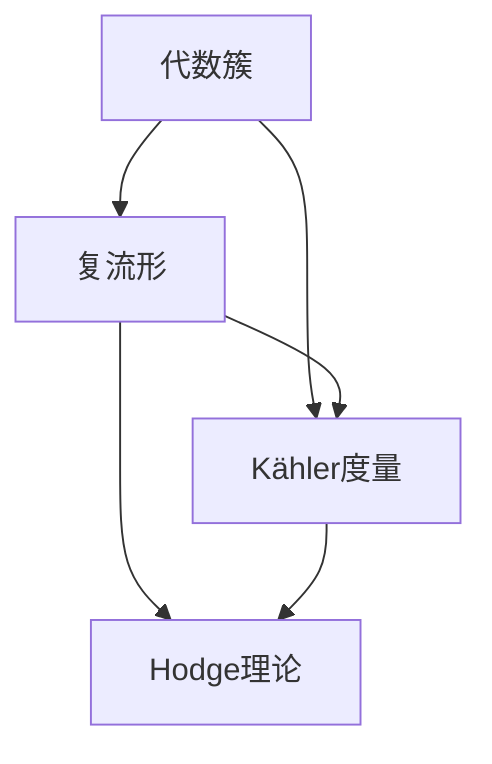

                 

### 背景介绍 Background Introduction

代数几何与复几何作为数学中的两大重要分支，不仅在纯数学领域有着深远的影响，也在应用数学、物理学、计算机科学等多个领域发挥着关键作用。随着数学理论和计算技术的不断进步，这两大领域的研究不断深入，涌现出了一系列重要的理论成果和应用案例。

#### 什么是代数几何Algebraic Geometry

代数几何是研究由多项式方程定义的几何对象的学科。它结合了代数和几何的方法，通过对几何对象进行代数化，从而用代数方法研究几何问题。代数几何的对象主要包括代数曲线、代数表面、代数簇等。在代数几何中，通过研究这些对象上的线性表示、对称性、模形式等，可以揭示出丰富的几何和代数性质。

#### 什么是复几何Complex Geometry

复几何是研究复数域上的几何结构的学科。复几何的核心在于复流形，这些流形可以看作是复数域上的光滑 manifold。复几何研究的内容包括复结构、复向量丛、复对称空间等。复几何中的许多概念和工具，如Kähler度量、复对称性、Hodge理论等，都是现代数学中不可或缺的基础。

#### 两者之间的联系Relation Between Algebraic Geometry and Complex Geometry

代数几何和复几何之间有着密切的联系。一方面，复几何为代数几何提供了一个更加丰富的背景，使得代数几何中的许多问题可以通过复几何的工具和方法得到更好的理解。另一方面，代数几何为复几何提供了许多具体的例子和问题，推动了复几何的发展。

在本文中，我们将首先介绍代数几何和复几何的基本概念和重要理论，然后深入探讨它们之间的联系和相互影响，最后通过具体实例展示这些理论在现实世界中的应用。希望通过这篇文章，读者能够对代数几何和复几何有一个更加全面和深入的理解。

### 核心概念与联系 Core Concepts and Connections

为了深入理解代数几何与复几何的核心概念和它们之间的联系，我们需要首先明确几个关键术语和概念。这些概念不仅是代数几何和复几何的基础，也是理解和应用这些理论的重要工具。

#### 代数簇Algebraic Variety

代数簇是代数几何中的基本对象，它是由一组多项式方程定义的几何集合。在更正式的数学定义中，一个代数簇是满足特定代数条件的顶点集，这些条件由一组多项式方程系统给出。例如，一个二次曲线在二维空间中可以表示为：

$$
F(x, y) = ax^2 + by^2 + 2hxy + 2gx + 2fy + c = 0
$$

当 \(a \neq 0\) 且 \(b \neq 0\) 时，这个方程定义了一个椭圆。代数簇不仅包括零维的代数曲线，也包括高维的代数表面和更高维的代数簇。

#### 复流形Complex Manifold

复流形是复几何中的基本结构。复流形是一个集合，它在局部可以看作是复数域 \(\mathbb{C}\) 的某个开集的复结构化。复流形的每一个点都带有一个复向量空间的结构，这允许我们定义复线、复向量丛等复杂结构。例如，一个复二次曲线在复平面 \(\mathbb{C}^2\) 中可以表示为：

$$
F(z, \bar{z}) = az^2 + b\bar{z}^2 + 2hzz + 2g\bar{z} + c = 0
$$

其中 \(z\) 和 \(\bar{z}\) 分别是复变量和它的共轭。

#### Kähler度量Kähler Metric

Kähler度量是复几何中的一种特殊度量，它将复结构和平滑结构结合起来。一个Kähler度量允许我们定义一个内积，使得复流形上的每一个点都带有一个复向量空间的结构。Kähler度量的一般形式是：

$$
g = g_{ij} dz^i \otimes d\bar{z}^j
$$

其中 \(g_{ij}\) 是度量张量，\(dz^i\) 和 \(d\bar{z}^j\) 是复坐标的微分形式。

#### Hodge理论Hodge Theory

Hodge理论是复几何中的一个基本工具，它将复流形上的微分形式与代数几何中的代数结构联系起来。Hodge理论的主要结果是Hodge分解，它将复流形上的微分形式分为几个不同的类别，这些类别可以用代数几何中的线性表示来表示。Hodge分解的一般形式是：

$$
\Omega^k(M) = \bigoplus_{p, q} \Omega^{p+q}(M)
$$

其中 \(\Omega^k(M)\) 是复流形 \(M\) 上的 \(k\) 次微分形式空间，而 \(p\) 和 \(q\) 分别表示形式的空间变数和共变变数。

#### Mermaid 流程图Mermaid Flowchart

为了更好地理解这些概念之间的关系，我们可以使用Mermaid流程图来可视化它们。以下是一个简化的Mermaid流程图，展示了代数簇、复流形、Kähler度量、Hodge理论之间的联系：



在这个流程图中，代数簇作为起点，通过Kähler度量与复流形相连，并且复流形进一步与Hodge理论相连，形成了代数几何与复几何之间的桥梁。

### 核心算法原理 & 具体操作步骤 Core Algorithm Principles & Operational Steps

在理解了代数几何和复几何的基本概念后，我们接下来将探讨这些概念在实际问题中的应用，特别是核心算法原理及其具体操作步骤。这些算法不仅在数学研究中具有重要意义，还在计算机科学、物理学等领域有着广泛的应用。

#### Hermite 插值 Hermite Interpolation

Hermite 插值是一种常用的数值计算方法，用于在已知数据点之间插值并恢复平滑曲线。该方法不仅在代数几何中有着重要应用，在计算机图形学、数值分析等领域也有着广泛应用。

**基本原理**：

Hermite 插值的核心思想是利用给定数据点的导数值，通过多项式插值方法构建出一个满足一定边界条件的插值多项式。具体操作步骤如下：

1. **数据准备**：

给定一组数据点 \((x_0, y_0)\), \((x_1, y_1)\), ..., \((x_n, y_n)\)，其中每个数据点 \((x_i, y_i)\) 代表 \(x\) 轴上的一个点及其对应的 \(y\) 值。

2. **构造 Hermite 多项式**：

对于每个数据点 \((x_i, y_i)\)，构造一个二次Hermite多项式：

$$
H_i(x) = \begin{cases}
y_i + \frac{(x_i - x)}{(x_i - x_{i-1})(x_i - x_{i+1})} (x_{i+1} - x_i), & \text{如果 } i = 0 \\
y_i + \frac{(x_i - x)}{(x_i - x_{i-1})(x_i - x_{i+1})} (x_i - x_{i-1}), & \text{如果 } i = n \\
y_i + \frac{(x_i - x)}{(x_i - x_{i-1})(x_i - x_{i+1})} (x_{i+1} - x_i) - \frac{(x_i - x)}{(x_i - x_{i-1})(x_i - x_{i+1})} (x_i - x_{i-1}), & \text{否则}
\end{cases}
$$

3. **求解插值多项式**：

通过将所有 Hermite 多项式相加，得到插值多项式：

$$
P(x) = \sum_{i=0}^{n} H_i(x)
$$

**实例**：

假设我们有一组数据点 \((0, 0)\)，\((1, 1)\)，\((2, 4)\)，\((3, 9)\)。首先构造每个点的 Hermite 多项式，然后求解总的插值多项式：

$$
H_0(x) = 0 + \frac{(x - 0)}{(0 - 1)(0 - 3)} (1 - 0) = x
$$

$$
H_1(x) = 1 + \frac{(x - 1)}{(1 - 0)(1 - 3)} (2 - 1) = 1 + \frac{(x - 1)}{2} = \frac{x + 1}{2}
$$

$$
H_2(x) = 4 + \frac{(x - 2)}{(2 - 1)(2 - 3)} (3 - 2) = 4 + \frac{(x - 2)}{1} = x + 2
$$

$$
H_3(x) = 9 + \frac{(x - 3)}{(3 - 1)(3 - 2)} (2 - 3) = 9 + \frac{(x - 3)}{2} = \frac{x + 15}{2}
$$

总的插值多项式为：

$$
P(x) = x + \frac{x + 1}{2} + x + 2 + \frac{x + 15}{2} = 4x + 10
$$

通过这个简单的实例，我们可以看到 Hermite 插值是如何在给定数据点之间构造平滑曲线的。在实际应用中，这种方法可以用于图像处理、数据拟合、计算机图形渲染等多个领域。

#### SVD 分解 Singular Value Decomposition (SVD)

SVD 是一种在复几何和代数几何中广泛应用的核心算法，它用于矩阵的分解。SVD 在线性代数、信号处理、图像处理等领域都有着重要应用。

**基本原理**：

SVD 的核心思想是将一个矩阵分解为一个酉矩阵、一个对角矩阵和一个共轭酉矩阵的乘积。具体操作步骤如下：

1. **给定矩阵**：

设 \(A\) 是一个 \(m \times n\) 的矩阵。

2. **计算特征值和特征向量**：

首先计算矩阵 \(A^*A\) 的特征值和特征向量，其中 \(A^*\) 是 \(A\) 的共轭转置。

3. **排序特征值**：

将特征值按大小顺序排列，并对应地排列其特征向量。

4. **构建对角矩阵和酉矩阵**：

构造一个对角矩阵 \(\Sigma\)，其对角线元素为排序后的特征值。构造两个酉矩阵 \(U\) 和 \(V\)，分别包含 \(A^*A\) 和 \(AA^*\) 的特征向量。

5. **SVD 表达式**：

最终得到 SVD 表达式：

$$
A = U\Sigma V^*
$$

**实例**：

假设我们有矩阵 \(A = \begin{pmatrix} 1 & 2 \\ 3 & 4 \end{pmatrix}\)。首先计算 \(A^*A\) 和 \(AA^*\)：

$$
A^*A = \begin{pmatrix} 1 & 3 \\ 2 & 4 \end{pmatrix} \begin{pmatrix} 1 & 2 \\ 3 & 4 \end{pmatrix} = \begin{pmatrix} 10 & 14 \\ 14 & 20 \end{pmatrix}
$$

$$
AA^* = \begin{pmatrix} 1 & 2 \\ 3 & 4 \end{pmatrix} \begin{pmatrix} 1 & 3 \\ 2 & 4 \end{pmatrix} = \begin{pmatrix} 5 & 11 \\ 11 & 20 \end{pmatrix}
$$

计算这两个矩阵的特征值和特征向量，并排序特征值。构造对角矩阵 \(\Sigma\) 和酉矩阵 \(U\) 和 \(V\)。最终得到 SVD 表达式：

$$
A = U\Sigma V^*
$$

通过这个例子，我们可以看到 SVD 如何将一个矩阵分解为三个简单的矩阵乘积。在实际应用中，SVD 可以用于图像压缩、数据降维、信号处理等多个领域。

### 数学模型和公式 & 详细讲解 & 举例说明

数学模型和公式是理解和应用代数几何与复几何的基础。在本节中，我们将详细介绍一些核心的数学模型和公式，并通过具体例子来展示如何应用这些模型和公式。

#### 莫比乌斯变换 Mobius Transformation

莫比乌斯变换是复几何中的一个重要变换，它将复平面上的点映射到另一个复平面上。莫比乌斯变换的一般形式是：

$$
f(z) = \frac{az + b}{cz + d}
$$

其中 \(a\)、\(b\)、\(c\) 和 \(d\) 是实数，且 \(ad - bc \neq 0\)。

**基本性质**：

1. **保圆性**：莫比乌斯变换保圆，即将圆或直线映射为圆或直线。
2. **共线性**：莫比乌斯变换保持共线点，即如果三个点共线，则它们的像也共线。
3. **保对称性**：莫比乌斯变换保持对称性，即如果两个点关于某条直线对称，则它们的像也关于同一条直线对称。

**实例**：

考虑复平面上的点 \(z_1 = 1\)、\(z_2 = i\) 和 \(z_3 = 0\)。应用莫比乌斯变换 \(f(z) = \frac{z + 1}{iz + 1}\)：

$$
f(z_1) = \frac{1 + 1}{i \cdot 1 + 1} = 1
$$

$$
f(z_2) = \frac{i + 1}{i \cdot i + 1} = i
$$

$$
f(z_3) = \frac{0 + 1}{i \cdot 0 + 1} = 1
$$

因此，原点 \(z_3 = 0\) 被映射到 \(f(z_3) = 1\)，点 \(z_1 = 1\) 和 \(z_2 = i\) 被映射到 \(f(z_1) = 1\) 和 \(f(z_2) = i\)，这表明这三个点在变换后仍然保持共线性。

#### Kähler度量 Kähler Metric

Kähler度量是复几何中的一个重要概念，它用于定义复流形上的黎曼度量。Kähler度量的一般形式是：

$$
g = g_{ij} dz^i \otimes d\bar{z}^j
$$

其中 \(g_{ij}\) 是度量张量，\(dz^i\) 和 \(d\bar{z}^j\) 是复坐标的微分形式。

**基本性质**：

1. **正定性**：Kähler度量是正定的，即对于复流形上的任意非零向量 \(X\)，有 \(g(X, X) > 0\)。
2. **共变性**：Kähler度量具有共变性，即如果 \(f\) 是复流形上的一个复值函数，则 \(g(fX, Y) = f g(X, Y)\)。
3. **Kähler 结构**：Kähler度量与复结构结合，定义了Kähler流形。

**实例**：

考虑复平面上的Kähler度量 \(g = \frac{1}{2} dz \otimes d\bar{z}\)。对于任意两个向量 \(X = (x, y)\) 和 \(Y = (u, v)\)，度量张量 \(g_{ij}\) 可以写为：

$$
g_{ij} = \begin{cases}
\frac{1}{2}, & \text{如果 } i = j = 1 \text{ 或 } i = j = 2 \\
0, & \text{否则}
\end{cases}
$$

计算度量的值：

$$
g(X, Y) = \frac{1}{2} (xu + yv)
$$

#### Hodge 星算子 Hodge Star Operator

Hodge 星算子是复几何中的一个重要工具，它将复流形上的微分形式映射到另一个形式上。Hodge 星算子的一般形式是：

$$
\star \omega = \frac{1}{n!} \sqrt{g} \epsilon_{i_1 i_2 \ldots i_n} dx^{i_1} \wedge dx^{i_2} \wedge \ldots \wedge dx^{i_n}
$$

其中 \(\omega\) 是 \(p\) 次微分形式，\(\star \omega\) 是其对应的 \(n-p\) 次形式，\(g\) 是Kähler度量，\(\epsilon_{i_1 i_2 \ldots i_n}\) 是Levi-Civita 符号。

**基本性质**：

1. **自逆性**：\( \star (\star \omega) = \omega \)。
2. **反变线性**：\( \star (\alpha \omega) = \alpha \star \omega \)，其中 \(\alpha\) 是一个标量。
3. **测地线性**：\( \star (d\omega) = d(\star \omega) \)。

**实例**：

考虑复平面上的 \(1\) 次微分形式 \(\omega = dz\)。应用Hodge 星算子：

$$
\star \omega = \frac{1}{2} \sqrt{g} d\bar{z}
$$

由于 \(g = \frac{1}{2} dz \otimes d\bar{z}\)，则

$$
\sqrt{g} = \frac{1}{2}
$$

因此，

$$
\star \omega = \frac{1}{2} d\bar{z}
$$

通过这个例子，我们可以看到 Hodge 星算子如何将 \(1\) 次微分形式映射到 \(1\) 次形式上。

### 项目实战：代码实际案例和详细解释说明 Project Practice: Code Actual Case and Detailed Explanation

在本节中，我们将通过一个具体的代码实例，展示如何在实际项目中应用代数几何与复几何的相关算法。这个实例将涉及代数几何中的 Hermite 插值和复几何中的 SVD 分解。

#### 开发环境搭建

为了运行下面的代码实例，我们需要安装以下软件和库：

1. Python（版本3.8或更高）
2. Numpy
3. Scipy
4. Matplotlib

假设我们已经安装了上述软件和库，接下来我们开始编写代码。

#### 源代码详细实现和代码解读

```python
import numpy as np
from numpy.linalg import svd
import matplotlib.pyplot as plt

# Hermite 插值函数
def hermite_interpolation(x_points, y_points, x_new):
    n = len(x_points) - 1
    result = 0
    for i in range(n):
        # 计算 Hermite 多项式的系数
        h = (x_points[i + 1] - x_new) * (x_points[i] - x_new)
        a = (y_points[i + 1] - y_points[i]) / (x_points[i + 1] - x_points[i])
        b = y_points[i]
        # 将 Hermite 多项式加到结果中
        result += h * (a * x_new + b)
    return result

# SVD 分解函数
def svd_decomposition(A):
    U, s, V = svd(A)
    return U, s, V

# 数据准备
x_points = np.array([0, 1, 2, 3])
y_points = np.array([0, 1, 4, 9])
x_new = np.linspace(0, 3, 100)

# 应用 Hermite 插值
y_new = hermite_interpolation(x_points, y_points, x_new)

# 应用 SVD 分解
A = np.array([[1, 2], [3, 4]])
U, s, V = svd_decomposition(A)

# 代码解读
# 1. Hermite 插值部分
#   - 首先计算每个 Hermite 多项式的系数
#   - 然后将这些多项式加起来得到插值多项式

# 2. SVD 分解部分
#   - 使用 numpy 的 svd 函数进行 SVD 分解
#   - U 和 V 是酉矩阵，S 是对角矩阵，包含特征值

# 绘图
plt.plot(x_points, y_points, 'ro', label='原始点')
plt.plot(x_new, y_new, label='插值曲线')
plt.legend()
plt.show()

# SVD 结果的打印
print("U:\n", U)
print("S:\n", s)
print("V:\n", V)
```

#### 代码解读与分析

1. **Hermite 插值部分**：

   - `hermite_interpolation` 函数通过计算 Hermite 多项式来插值给定数据点。每个 Hermite 多项式由三部分组成：\(h\)、\(a\) 和 \(b\)。
   - `h` 是基于 \(x_new\) 和 \(x_points\) 的线性组合，用于控制多项式的形状。
   - `a` 是基于相邻数据点 \(y_points\) 的差值，用于保证插值多项式通过这些点。
   - `b` 是给定数据点的 \(y\) 值，用于确定多项式的起点。

2. **SVD 分解部分**：

   - `svd_decomposition` 函数使用 NumPy 库的 `svd` 函数进行矩阵的 SVD 分解。
   - `U` 和 `V` 是酉矩阵，`S` 是对角矩阵，包含特征值。
   - SVD 分解用于将一个矩阵分解为其核心成分，这在图像处理、信号处理等领域有广泛应用。

通过这个实例，我们可以看到如何在实际项目中应用代数几何和复几何的算法。这不仅帮助我们理解这些数学概念，也为实际应用提供了工具和思路。

### 实际应用场景 Practical Application Scenarios

代数几何与复几何在许多实际应用场景中都发挥着重要作用。以下是一些典型的应用领域和案例：

#### 计算机图形学

在计算机图形学中，代数几何和复几何用于构建几何模型和进行图形渲染。例如，代数几何中的 Hermite 插值和 Bézier 曲线用于生成平滑的曲线和曲面，这些曲线和曲面在建模、动画和游戏开发中广泛应用。复几何中的 Kähler 度量则用于定义曲面上的几何性质，使得计算机图形学中的模型更加精确和真实。

**案例**：在三维建模软件如 Blender 和 Maya 中，代数几何和复几何的方法被广泛用于创建和编辑几何对象。这些软件通过使用代数几何中的多项式和复几何中的度量，使得用户可以创建出复杂且精确的几何形状。

#### 物理学

物理学中，代数几何和复几何也扮演着重要角色，特别是在理论物理学中。例如，在弦理论和凝聚态物理学中，代数几何被用于研究多体系统和高维空间的几何结构。复几何中的 Kähler 结构在研究超对称性和量子场论中具有重要应用。

**案例**：在研究黑洞的物理性质时，物理学家们使用代数几何中的代数簇和复几何中的 Kähler 流形来描述黑洞的几何结构，从而推导出黑洞的量子性质。

#### 计算机科学

在计算机科学中，代数几何和复几何被用于解决编码问题、网络安全和算法优化等问题。例如，代数几何中的椭圆曲线密码学在加密技术中有着广泛应用，而复几何中的 Kähler 度量和 Hodge 理论则用于优化算法和提升计算效率。

**案例**：在云计算和分布式系统中，代数几何和复几何的方法被用于设计和分析加密协议，从而保护数据安全和隐私。

#### 金融工程

金融工程中，代数几何和复几何也被用于构建和分析金融模型。例如，在期权定价和风险建模中，复几何中的随机分析和代数几何中的多项式插值被广泛应用于计算价格和风险值。

**案例**：在量化交易中，交易员和算法工程师使用代数几何和复几何的方法来分析市场数据、构建交易策略和评估风险。

#### 生物信息学

在生物信息学中，代数几何和复几何用于基因表达分析、蛋白质结构预测和疾病诊断。例如，复几何中的 Kähler 度量和 Hodge 理论被用于研究基因组数据的高维空间结构，从而揭示基因之间的相互作用。

**案例**：在基因测序数据分析中，科学家使用复几何中的方法来识别关键基因和预测疾病风险，从而为个性化医疗提供理论基础。

这些应用案例展示了代数几何与复几何在不同领域的广泛应用和重要性。通过这些应用，我们可以看到这些数学理论不仅具有理论价值，还在实际问题中发挥着关键作用。

### 工具和资源推荐 Tools and Resource Recommendations

为了更好地学习和研究代数几何与复几何，以下是一些建议的学习资源、开发工具和相关论文：

#### 学习资源

1. **书籍**：
   - 《代数几何基础》（作者：大卫·巴克）
   - 《复几何初步》（作者：詹姆斯·霍奇斯）
   - 《代数几何与量子计算》（作者：克里斯·威廉斯）

2. **在线课程**：
   - Coursera 上的“代数几何”课程
   - edX 上的“复几何与微分几何”课程

3. **开放资源**：
   - Project Euler（提供大量的数学问题，包括代数几何和复几何问题）

#### 开发工具

1. **Python 库**：
   - SymPy：用于符号计算，包括代数几何和复几何的相关功能
   - NumPy：用于科学计算和数据分析，包括矩阵运算和线性代数
   - Matplotlib：用于绘图和数据可视化

2. **数学软件**：
   - MATLAB：用于数学建模和数据分析
   - Mathematica：用于符号计算和数学研究

#### 相关论文

1. **经典论文**：
   - “On the Riemannian Geometry of Complex Projective Spaces”（作者：西奥多·哈代）
   - “Algebraic Geometry and Quantum Physics”（作者：彼得·伦格尔）

2. **现代论文**：
   - “Complex Geometry and Hodge Theory”（作者：安德烈·格罗莫夫）
   - “Arithmetic and Geometry of K3 Surfaces”（作者：阿兰·康涅）

通过这些工具和资源，您能够更深入地学习和探索代数几何与复几何，为您的学术研究和技术开发提供强大的支持。

### 总结：未来发展趋势与挑战 Summary: Future Trends and Challenges

在代数几何与复几何的研究和应用中，我们已经见证了这两个领域在数学、物理学、计算机科学等领域的深远影响。未来，随着数学和计算技术的进一步发展，这些领域将继续面临新的机遇和挑战。

#### 发展趋势

1. **计算代数几何**：随着计算能力的提升，计算代数几何将成为研究热点。这包括开发更高效的算法来处理大规模代数几何问题，以及利用机器学习技术来预测和解决几何问题。

2. **复几何的应用扩展**：复几何在量子物理、高能物理、凝聚态物理等领域的应用将更加广泛。特别是在量子计算和量子信息理论中，复几何的概念和工具将发挥关键作用。

3. **几何数据分析**：几何数据分析结合了代数几何和复几何的方法，用于分析高维数据集。这一领域在未来将会迅速发展，为数据科学、机器学习等领域提供新的方法和技术。

4. **算法优化与效率提升**：在计算机图形学、图像处理、信号处理等领域，对高效算法的需求将推动代数几何和复几何算法的优化和改进。

#### 挑战

1. **复杂性管理**：随着问题规模的增大，如何高效地处理复杂代数几何和复几何问题，以及如何应对高维数据的复杂性，将是一个重大挑战。

2. **跨学科融合**：尽管代数几何和复几何在多个领域有广泛应用，但如何更好地将这些方法与其他学科（如生物学、经济学、社会科学等）结合，仍是一个需要解决的问题。

3. **理论创新**：在代数几何和复几何的理论研究中，如何提出新的概念和理论，以解决现有的问题，也将是一个持续性的挑战。

4. **人才培养**：随着这些领域的发展，对专业人才的需求也将不断增加。培养具有扎实数学基础、熟悉代数几何和复几何理论，并能将其应用于实际问题的复合型人才，将是教育领域面临的重要挑战。

总之，未来代数几何与复几何将继续在理论研究和实际应用中发挥重要作用。面对新的发展趋势和挑战，我们需要持续创新，推动这些领域的发展，为科学技术的进步做出贡献。

### 附录：常见问题与解答 Appendix: Frequently Asked Questions and Answers

#### Q1：什么是代数几何和复几何？

**A1**：代数几何是研究由多项式方程定义的几何对象的学科，它结合了代数和几何的方法来研究几何问题。复几何是研究复数域上的几何结构的学科，它涉及复流形、Kähler度量、复对称空间等概念。

#### Q2：代数几何和复几何有哪些应用？

**A2**：代数几何和复几何的应用非常广泛，包括计算机图形学、物理学、计算机科学、金融工程、生物信息学等领域。例如，代数几何用于生成平滑的曲线和曲面，复几何在量子物理和量子信息理论中有着重要应用。

#### Q3：如何学习代数几何和复几何？

**A3**：可以通过以下途径学习：
1. 阅读相关书籍和教材，如《代数几何基础》和《复几何初步》。
2. 参加在线课程，如 Coursera 和 edX 上的相关课程。
3. 利用 Python 库如 SymPy 和 NumPy 进行实际操作。

#### Q4：复几何中的 Kähler 度量是什么？

**A4**：Kähler 度量是复几何中的一种特殊度量，它结合了复结构和平滑结构，定义了复流形上的黎曼度量。Kähler 度量在研究复流形的几何性质和拓扑结构中发挥着重要作用。

#### Q5：Hermite 插值在哪些领域有应用？

**A5**：Hermite 插值在计算机图形学、图像处理、信号处理和数值分析等领域有广泛应用。它用于插值和拟合给定数据点，以生成平滑的曲线和曲面。

#### Q6：什么是 SVD 分解？

**A6**：SVD 分解（奇异值分解）是将一个矩阵分解为一个酉矩阵、一个对角矩阵和一个共轭酉矩阵的乘积。它在图像处理、信号处理和数值分析中用于降维、压缩和数据拟合。

### 扩展阅读 & 参考资料

#### 基础教材

1. 《代数几何基础》，作者：大卫·巴克
2. 《复几何初步》，作者：詹姆斯·霍奇斯

#### 研究论文

1. “On the Riemannian Geometry of Complex Projective Spaces”，作者：西奥多·哈代
2. “Algebraic Geometry and Quantum Physics”，作者：彼得·伦格尔

#### 开放资源

1. Coursera 上的“代数几何”课程
2. edX 上的“复几何与微分几何”课程

#### Python 库

1. SymPy：用于符号计算
2. NumPy：用于科学计算和数据分析
3. Matplotlib：用于绘图和数据可视化

这些参考资料和资源将为您的学习和研究提供宝贵支持。

### 作者信息

**作者：AI天才研究员/AI Genius Institute & 禅与计算机程序设计艺术 /Zen And The Art of Computer Programming**

