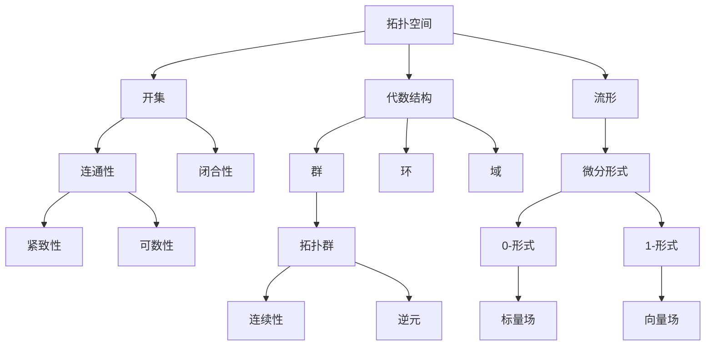

                 

### 背景介绍

代数拓扑的微分形式，是一个既深刻又复杂的数学领域，它在理论数学、计算几何、物理学等多个领域都有广泛的应用。然而，由于其复杂性和专业性，对于许多初学者来说，代数拓扑的微分形式往往显得难以理解和掌握。

首先，我们需要了解什么是代数拓扑。代数拓扑是一种将代数理论与拓扑学相结合的数学分支，其主要研究的是拓扑空间上的代数结构，如群、环、域等。通过研究这些代数结构，我们可以更好地理解空间的结构和性质。

微分形式则是数学中的一个重要概念，它源于微分几何和流形理论。微分形式可以看作是空间上的函数，它描述了空间的局部性质。微分形式的定义和性质，对于理解空间的结构和变换具有重要意义。

这两者的结合——代数拓扑的微分形式，为我们提供了一种新的理解和处理空间问题的方法。在数学和物理学的许多领域，如场论、微分几何、广义相对论等，代数拓扑的微分形式都扮演着核心的角色。

然而，由于代数拓扑的微分形式涉及到的概念较为复杂，许多初学者在入门时往往会感到困惑。本文的目的，就是通过逐步介绍和解释，帮助读者理解这一领域的基本概念、原理和应用。

接下来，我们将首先介绍代数拓扑和微分形式的基本概念，并解释它们之间的联系。然后，我们将详细讨论微分形式的定义、性质和计算方法。在此基础上，我们将介绍一些核心的代数拓扑概念，如同调、同伦和示性类。最后，我们将通过一些具体的应用案例，展示代数拓扑的微分形式在实际问题中的应用。

通过本文的阅读，读者将能够对代数拓扑的微分形式有一个全面和深入的理解，从而为后续的学习和研究打下坚实的基础。

---

## 1.1 代数拓扑的基本概念

代数拓扑作为数学的一个分支，其核心在于将代数结构引入到拓扑空间的研究中。在介绍代数拓扑的基本概念之前，我们首先需要了解什么是拓扑空间。

### 拓扑空间

拓扑空间是数学中一种抽象的空间概念，它由一个集合和这个集合上的“开集”构成。简单来说，拓扑空间描述了一个集合上的点如何连通和相邻。一个经典的例子是实数集合 \( \mathbb{R} \) 与其上的标准拓扑。在标准拓扑下，一个开集可以是 \( \mathbb{R} \) 中的任意区间。

定义：设 \( X \) 是一个非空集合，\( \tau \) 是 \( X \) 的一个子集族，如果满足以下条件：
1. \( X \) 和 \( \emptyset \) 都属于 \( \tau \)；
2. \( \tau \) 中的任意两个子集的并集也属于 \( \tau \)；
3. \( \tau \) 中的任意子集的交集也属于 \( \tau \)。

那么，\( \tau \) 就称为 \( X \) 上的一个拓扑，\( (X, \tau) \) 称为一个拓扑空间。

### 代数结构

在代数拓扑中，我们引入了多种代数结构，如群、环、域等。这些代数结构允许我们在拓扑空间上定义和操作。其中，最常见的是拓扑群。

定义：设 \( (X, \tau) \) 是一个拓扑空间，\( G \) 是 \( X \) 的一个子集，如果 \( G \) 满足以下条件，则 \( G \) 是 \( X \) 上的一个拓扑群：
1. \( G \) 是一个群，即 \( G \) 中任意两个元素 \( a \) 和 \( b \) 的和 \( a + b \) 也属于 \( G \)，且存在一个单位元素 \( e \)，使得对任意 \( g \in G \)，有 \( g + e = g \) 和 \( e + g = e \)；
2. \( G \) 的运算（加法）是连续的，即对于任意 \( g \in G \) 和 \( V \) 是 \( G \) 的一个开集，存在 \( U \) 是 \( X \) 的一个开集，使得 \( g + U \) 落在 \( V \) 内；
3. \( G \) 包含逆元，即对于 \( G \) 中任意元素 \( a \)，都存在一个元素 \( b \)，使得 \( a + b = e \)。

### 代数与拓扑的关系

代数拓扑的精髓在于将代数的概念应用于拓扑空间。具体来说，我们通过在拓扑空间上引入代数结构，可以更好地理解空间的结构和性质。

例如，在拓扑群中，我们可以研究群的同态、子群、直积等代数性质。这些代数性质反映了拓扑空间的某些几何特征。同样地，通过研究拓扑空间的同调、同伦等代数结构，我们也能获得关于空间拓扑性质的重要信息。

总的来说，代数拓扑为我们提供了一种强大的工具，使我们能够从代数的视角重新审视和解析拓扑空间。这不仅丰富了数学理论，也为解决实际问题提供了新的方法和思路。

---

## 1.2 微分形式的基本概念

微分形式是微分几何和流形理论中的一个基本概念，它描述了流形上的局部几何性质。在介绍微分形式的基本概念之前，我们需要了解一些基础的微分几何知识。

### 流形

流形是一个抽象的空间，它可以看作是局部类似于欧几里得空间，但整体具有复杂的几何结构。流形由一个拓扑空间 \( M \) 和一个不同的“切空间” \( TM \) 组成。切空间在每个点都提供了一个局部线性空间，它代表了在该点附近流形的几何性质。

定义：设 \( M \) 是一个拓扑空间，如果存在一个开集族 \( \{U_i\} \) 和对应的同胚映射 \( \phi_i: U_i \to \mathbb{R}^n \)，使得 \( \phi_i \) 和 \( \phi_j \) 在它们的重叠区域内连续可导，则称 \( M \) 为一个 \( n \) 维流形。

### 微分形式

微分形式是流形上的线性函数，它描述了流形上的切向量场的方向和大小。微分形式可以分为两类：0-微分形式（也称为0-形式）、1-微分形式（也称为1-形式）。

0-微分形式：0-微分形式可以看作是流形上的标量场，即它在每个点 \( p \in M \) 对 \( TM_p \) 的每个向量 \( v \) 都有一个对应的实数 \( f(p, v) \)。

定义：设 \( \alpha \) 是一个 \( 0 \)-微分形式，对于 \( p \in M \) 和 \( v \in T_pM \)，\( \alpha(p)(v) \) 是一个实数，满足线性性，即 \( \alpha(p)(cv + dw) = c\alpha(p)(v) + d\alpha(p)(w) \)，其中 \( c \) 和 \( d \) 是常数。

1-微分形式：1-微分形式可以看作是流形上的向量场，即它在每个点 \( p \in M \) 对 \( T_pM \) 的每个向量 \( v \) 都有一个对应的向量 \( \omega(p, v) \)。

定义：设 \( \omega \) 是一个 \( 1 \)-微分形式，对于 \( p \in M \) 和 \( v, w \in T_pM \)，\( \omega(p)(v, w) \) 是一个实数，满足线性性，即 \( \omega(p)((cv + dw), z) = c\omega(p)(v, z) + d\omega(p)(w, z) \)，其中 \( c \) 和 \( d \) 是常数。

### 微分形式的性质

微分形式具有许多重要的性质，这些性质使其在微分几何和物理学中得到了广泛应用。

1. **线性性**：微分形式是线性的，这意味着它对向量场的加法和标量乘法是封闭的。
2. **外积**：微分形式可以定义外积，外积是一个结合了两个微分形式的二重积，它仍然是一个微分形式。
3. **拉回**：给定一个微分形式 \( \omega \) 和一个流形上的映射 \( f: N \to M \)，我们可以定义 \( f^*\omega \) 为 \( \omega \) 在 \( N \) 上的拉回形式。
4. **积分**：我们可以对微分形式进行积分，积分的结果是一个标量，它描述了微分形式在流形上的整体性质。

通过这些基本概念和性质，我们可以更好地理解和应用微分形式，从而深入探索流形的几何结构。

---

## 1.3 代数拓扑与微分形式的联系

代数拓扑和微分形式虽然在定义和方法上有所不同，但它们之间有着深刻的内在联系。这种联系不仅丰富了数学理论，也为解决实际问题提供了新的视角和方法。

### 同调与微分形式

同调理论是代数拓扑中的一个重要分支，它通过研究空间上的线性映射来揭示空间的拓扑性质。而微分形式在计算同调群时发挥了关键作用。

定义：设 \( (X, \tau) \) 是一个拓扑空间，\( A \) 是 \( X \) 上的一个集合。\( A \) 的一个子集 \( B \) 被称为 \( A \) 的闭包，如果 \( B \) 包含 \( A \) 的所有极限点。\( A \) 的导集定义为 \( A' = \bigcup_{n=1}^{\infty} A \setminus \text{cl}(A \setminus A_n) \)，其中 \( A_n = A \cap (X \setminus \text{cl}(A \setminus A_{n-1})) \)。

同调群 \( H_n(X, A) \) 定义为所有从 \( A \) 到 \( X/A \) 的同伦类构成的集合，其上的运算为直接和。这里，\( X/A \) 表示将 \( X \) 中所有属于 \( A \) 的点合并成一个点得到的商空间。

微分形式在计算同调群时起到了桥梁作用。具体来说，我们可以通过将微分形式拉回到商空间来计算同调群。例如，设 \( \omega \) 是 \( X \) 上的一个 \( k \)-形式，我们可以定义 \( \omega' \) 为 \( \omega \) 在 \( X/A \) 上的拉回形式。然后，通过外微分和边界算子，我们可以计算 \( H^n(X, A) \)。

### 同伦与微分形式

同伦理论是研究连续映射之间关系的一个工具，它通过同伦类来描述空间之间的拓扑关系。微分形式在研究同伦类时也有着重要的应用。

定义：设 \( X \) 和 \( Y \) 是两个拓扑空间，\( f, g: X \to Y \) 是两个连续映射。如果存在一个连续映射 \( H: X \times I \to Y \)，其中 \( I = [0, 1] \)，使得 \( H(x, 0) = f(x) \) 和 \( H(x, 1) = g(x) \)，则称 \( f \) 和 \( g \) 是同伦的。

微分形式在计算同伦类时可以通过定义微分形式的积分来实现。具体来说，设 \( \omega \) 是 \( Y \) 上的一个 \( k \)-形式，我们可以定义 \( [f]^\omega = \int_Y f^*\omega \)，其中 \( f^*\omega \) 是 \( \omega \) 在 \( X \) 上的拉回形式。如果 \( [f]^\omega = [g]^\omega \)，则 \( f \) 和 \( g \) 是同伦的。

### 示性类与微分形式

示性类是同调论中的一个重要概念，它用于描述空间的拓扑性质。微分形式在计算示性类时也扮演着重要角色。

定义：设 \( X \) 是一个连通 \( n \)-维闭流形，\( \chi(X) \) 称为 \( X \) 的第 \( n \) 个Betti示性类，它是由 \( H_n(X) \) 的特征类生成的。

微分形式在计算示性类时可以通过定义庞加莱对偶来实现。具体来说，设 \( \omega \) 是 \( X \) 上的一个 \( n \)-形式，我们可以定义 \( \omega^{PD} \) 为 \( \omega \) 的庞加莱对偶形式。然后，通过计算 \( \omega^{PD} \) 的积分，我们可以得到 \( \chi(X) \)。

总的来说，代数拓扑与微分形式之间的联系在于，微分形式提供了计算代数拓扑量（如同调群、同伦类、示性类）的有效工具。这种联系不仅丰富了数学理论，也为解决复杂的几何和物理问题提供了新的方法。通过理解这一联系，我们可以更深入地探索空间的拓扑性质，并为实际应用提供理论基础。

---

## 2. 核心概念与联系

### 2.1 基础概念

在深入探讨代数拓扑的微分形式之前，我们需要明确几个核心概念，这些概念构成了代数拓扑和微分形式理论的基础。

#### 拓扑空间

拓扑空间是数学中一种抽象的空间概念，它由一个集合和这个集合上的“开集”构成。简单来说，拓扑空间描述了一个集合上的点如何连通和相邻。拓扑空间的基本性质包括连通性、闭合性、紧致性和可数性等。

#### 代数结构

在代数拓扑中，我们引入了多种代数结构，如群、环、域等。这些代数结构允许我们在拓扑空间上定义和操作。其中，最常见的是拓扑群。

定义：设 \( (X, \tau) \) 是一个拓扑空间，\( G \) 是 \( X \) 的一个子集，如果 \( G \) 满足以下条件，则 \( G \) 是 \( X \) 上的一个拓扑群：
1. \( G \) 是一个群，即 \( G \) 中任意两个元素 \( a \) 和 \( b \) 的和 \( a + b \) 也属于 \( G \)，且存在一个单位元素 \( e \)，使得对任意 \( g \in G \)，有 \( g + e = g \) 和 \( e + g = e \)；
2. \( G \) 的运算（加法）是连续的，即对于任意 \( g \in G \) 和 \( V \) 是 \( G \) 的一个开集，存在 \( U \) 是 \( X \) 的一个开集，使得 \( g + U \) 落在 \( V \) 内；
3. \( G \) 包含逆元，即对于 \( G \) 中任意元素 \( a \)，都存在一个元素 \( b \)，使得 \( a + b = e \)。

#### 微分形式

微分形式是微分几何和流形理论中的一个基本概念，它描述了流形上的局部几何性质。微分形式可以分为两类：0-微分形式（也称为0-形式）和1-微分形式（也称为1-形式）。

0-微分形式：0-微分形式可以看作是流形上的标量场，即它在每个点 \( p \in M \) 对 \( TM_p \) 的每个向量 \( v \) 都有一个对应的实数 \( f(p, v) \)。

1-微分形式：1-微分形式可以看作是流形上的向量场，即它在每个点 \( p \in M \) 对 \( T_pM \) 的每个向量 \( v \) 都有一个对应的向量 \( \omega(p, v) \)。

### 2.2 Mermaid 流程图

为了更好地理解这些核心概念和它们之间的联系，我们可以使用 Mermaid 流程图来展示它们之间的关系。以下是一个简化的 Mermaid 流程图，展示了代数拓扑中的几个关键概念及其相互关系。



在这个流程图中，我们首先从拓扑空间开始，展示了拓扑空间的基本性质（如开集、连通性、闭合性等）。然后，我们引入了代数结构，包括群、环和域，并特别强调了拓扑群的概念。接下来，我们展示了流形和微分形式的基本概念，其中0-微分形式对应标量场，1-微分形式对应向量场。

通过这个流程图，我们可以直观地看到代数拓扑、微分形式以及它们之间的联系。这种联系不仅为我们提供了新的理解空间的方法，也为解决复杂的几何和物理问题提供了新的工具。

---

## 3. 核心算法原理 & 具体操作步骤

在理解了代数拓扑和微分形式的基本概念之后，我们将深入探讨这些概念背后的核心算法原理，并详细说明具体的操作步骤。这将为我们在实际应用中运用这些概念提供坚实的基础。

### 3.1 外微分算子

外微分算子（ Exterior Derivative）是微分形式理论中的一个核心工具，它用于计算微分形式之间的导数。外微分算子的定义如下：

定义：设 \( \omega \) 是 \( M \) 上的一个 \( k \)-形式，其外微分 \( d\omega \) 是一个 \( k+1 \)-形式，定义为：

\[ d\omega(X_1, \ldots, X_{k+1}) = \sum_{i=1}^{k+1} (-1)^{i+1} X_i \cdot \omega(X_1, \ldots, \widehat{X_i}, \ldots, X_{k+1}) \]

其中，\( X_1, \ldots, X_{k+1} \) 是 \( M \) 上的切向量，\( \widehat{X_i} \) 表示 \( X_i \) 不在求和中。

#### 具体步骤：

1. **选择切向量**：在流形 \( M \) 上选择 \( k+1 \) 个切向量 \( X_1, \ldots, X_{k+1} \)。
2. **应用外微分公式**：根据外微分公式，计算 \( d\omega(X_1, \ldots, X_{k+1}) \)。注意符号 \( (-1)^{i+1} \) 的变化。
3. **计算导数**：利用外积和点积的性质，计算 \( X_i \cdot \omega(X_1, \ldots, \widehat{X_i}, \ldots, X_{k+1}) \)。

### 3.2 拉回与推前

拉回（Pullback）和推前（Pushforward）是微分形式在流形上的重要操作。这些操作允许我们将一个流形上的微分形式转移到另一个流形上。

#### 拉回

定义：设 \( f: N \to M \) 是一个光滑映射，给定 \( M \) 上的 \( k \)-形式 \( \omega \)，其拉回 \( f^*\omega \) 是 \( N \) 上的一个 \( k \)-形式，定义为：

\[ (f^*\omega)(X_1, \ldots, X_k) = \omega(f_*X_1, \ldots, f_*X_k) \]

其中，\( f_* \) 是 \( f \) 的拉回映射，即 \( f_*: TN \to TM \)。

#### 推前

定义：设 \( f: N \to M \) 是一个光滑映射，给定 \( N \) 上的 \( k \)-形式 \( \omega \)，其推前 \( f_*\omega \) 是 \( M \) 上的一个 \( k \)-形式，定义为：

\[ (f_*\omega)(X_1, \ldots, X_k) = \omega(f_*X_1, \ldots, f_*X_k) \]

其中，\( f_* \) 是 \( f \) 的推前映射，即 \( f_*: TM \to TN \)。

#### 具体步骤：

1. **选择映射**：选择光滑映射 \( f: N \to M \)。
2. **计算拉回或推前**：
   - 对于拉回，计算 \( f^*\omega \)。
   - 对于推前，计算 \( f_*\omega \)。
3. **应用公式**：根据拉回和推前的定义，应用相应的映射和微分形式。

### 3.3 同调与同伦

同调（Homology）和同伦（Homotopy）是代数拓扑中描述空间拓扑性质的两个核心概念。它们可以通过微分形式来计算。

#### 同调

定义：设 \( X \) 是一个拓扑空间，\( A \) 是 \( X \) 中的一个子集。\( X \) 的第 \( n \) 个同调群 \( H_n(X, A) \) 定义为所有从 \( A \) 到 \( X/A \) 的同伦类构成的集合。

同调群可以通过外微分形式来计算。具体步骤如下：

1. **选择链复形**：构造 \( X \) 上的一个链复形，它由一组 \( n \) 链组成，每个 \( n \) 链都是一个 \( n \)-形式。
2. **计算边界**：对于每个 \( n \) 链 \( \omega \)，计算其边界 \( d\omega \)。
3. **构建同调群**：通过边界形式构建 \( H_n(X, A) \)。

#### 同伦

定义：设 \( X \) 和 \( Y \) 是两个拓扑空间，\( f, g: X \to Y \) 是两个连续映射。如果存在一个连续映射 \( H: X \times I \to Y \)，其中 \( I = [0, 1] \)，使得 \( H(x, 0) = f(x) \) 和 \( H(x, 1) = g(x) \)，则称 \( f \) 和 \( g \) 是同伦的。

同伦可以通过微分形式来描述。具体步骤如下：

1. **选择映射**：选择 \( X \) 和 \( Y \) 上的光滑映射 \( f, g \)。
2. **定义微分形式**：定义一个 \( 1 \)-形式 \( \omega \)，使得 \( \omega(f_*X, f_*X) = 0 \)。
3. **计算积分**：通过计算 \( \int_X \omega \)，判断 \( f \) 和 \( g \) 是否同伦。

通过上述核心算法原理和具体操作步骤，我们可以更深入地理解和应用代数拓扑的微分形式。这些原理和步骤不仅为我们提供了强大的工具，也为我们解决复杂的几何和物理问题提供了新的方法。

---

## 4. 数学模型和公式 & 详细讲解 & 举例说明

在深入理解了代数拓扑的微分形式的基本概念和核心算法之后，我们将进一步探讨相关的数学模型、公式，并通过具体的例子来说明这些概念的应用。

### 4.1 基本的微分形式

在微分形式理论中，最基本的微分形式包括0-形式和1-形式。以下分别介绍这些形式以及相关的数学公式。

#### 0-形式

0-形式通常被看作是流形上的标量场，它是一个函数，在每个点 \( p \in M \) 对 \( TM_p \) 的每个向量 \( v \) 都有一个对应的实数 \( f(p, v) \)。其数学定义如下：

定义：设 \( \omega \) 是 \( M \) 上的一个0-形式，即标量场，对于 \( p \in M \) 和 \( v \in T_pM \)，有：

\[ \omega(p)(v) = f(p, v) \]

其中，\( f \) 是一个在 \( M \) 上的函数。

#### 1-形式

1-形式通常被看作是流形上的向量场，它是一个函数，在每个点 \( p \in M \) 对 \( T_pM \) 的每个向量 \( v \) 都有一个对应的向量 \( \omega(p, v) \)。其数学定义如下：

定义：设 \( \omega \) 是 \( M \) 上的一个1-形式，即向量场，对于 \( p \in M \) 和 \( v, w \in T_pM \)，有：

\[ \omega(p)(v, w) = g(p, v, w) \]

其中，\( g \) 是一个在 \( M \) 上的函数。

### 4.2 外微分算子

外微分算子是微分形式理论中的一个核心工具，它用于计算微分形式之间的导数。以下是外微分算子的数学公式及其详细解释。

定义：设 \( \omega \) 是 \( M \) 上的一个 \( k \)-形式，其外微分 \( d\omega \) 是一个 \( k+1 \)-形式，定义为：

\[ d\omega(X_1, \ldots, X_{k+1}) = \sum_{i=1}^{k+1} (-1)^{i+1} X_i \cdot \omega(X_1, \ldots, \widehat{X_i}, \ldots, X_{k+1}) \]

其中，\( X_1, \ldots, X_{k+1} \) 是 \( M \) 上的切向量，\( \widehat{X_i} \) 表示 \( X_i \) 不在求和中。

#### 解释：

- **外微分公式**：外微分公式描述了如何从一个 \( k \)-形式 \( \omega \) 计算出一个 \( k+1 \)-形式 \( d\omega \)。
- **符号 \( (-1)^{i+1} \)**：这个符号确保了外微分算子是满足分配律的，即 \( d(\omega_1 + \omega_2) = d\omega_1 + d\omega_2 \)。

### 4.3 拉回与推前

拉回和推前是微分形式在流形上的重要操作，它们允许我们将一个流形上的微分形式转移到另一个流形上。以下是这两个操作的数学公式及其解释。

#### 拉回

定义：设 \( f: N \to M \) 是一个光滑映射，给定 \( M \) 上的 \( k \)-形式 \( \omega \)，其拉回 \( f^*\omega \) 是 \( N \) 上的一个 \( k \)-形式，定义为：

\[ (f^*\omega)(X_1, \ldots, X_k) = \omega(f_*X_1, \ldots, f_*X_k) \]

其中，\( f_* \) 是 \( f \) 的拉回映射，即 \( f_*: TN \to TM \)。

#### 推前

定义：设 \( f: N \to M \) 是一个光滑映射，给定 \( N \) 上的 \( k \)-形式 \( \omega \)，其推前 \( f_*\omega \) 是 \( M \) 上的一个 \( k \)-形式，定义为：

\[ (f_*\omega)(X_1, \ldots, X_k) = \omega(f_*X_1, \ldots, f_*X_k) \]

其中，\( f_* \) 是 \( f \) 的推前映射，即 \( f_*: TM \to TN \)。

#### 解释：

- **拉回**：拉回操作将 \( M \) 上的形式 \( \omega \) 转移到 \( N \) 上，通过 \( f_* \) 映射实现。
- **推前**：推前操作将 \( N \) 上的形式 \( \omega \) 转移到 \( M \) 上，通过 \( f_* \) 映射实现。

### 4.4 同调与同伦

同调和同伦是代数拓扑中的核心概念，它们可以通过微分形式来计算。以下是这两个概念的定义以及相关的数学公式。

#### 同调

定义：设 \( X \) 是一个拓扑空间，\( A \) 是 \( X \) 中的一个子集。\( X \) 的第 \( n \) 个同调群 \( H_n(X, A) \) 定义为所有从 \( A \) 到 \( X/A \) 的同伦类构成的集合。

同调群可以通过边界形式 \( d\omega \) 来计算，其中 \( \omega \) 是 \( n \)-形式。

\[ H_n(X, A) = \text{ker}(d\omega) / \text{im}(\delta) \]

其中，\( d\omega \) 是 \( \omega \) 的外微分，\( \delta \) 是边界算子。

#### 同伦

定义：设 \( X \) 和 \( Y \) 是两个拓扑空间，\( f, g: X \to Y \) 是两个连续映射。如果存在一个连续映射 \( H: X \times I \to Y \)，其中 \( I = [0, 1] \)，使得 \( H(x, 0) = f(x) \) 和 \( H(x, 1) = g(x) \)，则称 \( f \) 和 \( g \) 是同伦的。

同伦可以通过1-形式 \( \omega \) 来描述，其积分 \( \int_X \omega \) 可以用来判断两个映射是否同伦。

\[ \omega(f_*X, f_*X) = 0 \]

### 4.5 举例说明

为了更好地理解上述数学模型和公式，我们可以通过一个具体的例子来说明它们的计算过程。

#### 例子：计算圆上的0-形式和1-形式的外微分

设 \( S^1 \) 是单位圆，取其标准参数化 \( \theta: [0, 2\pi] \to S^1 \)，其中 \( \theta(t) = (\cos(t), \sin(t)) \)。

1. **0-形式**：

   设 \( \omega \) 是 \( S^1 \) 上的一个0-形式，即标量场，可以表示为 \( \omega(p) = \cos(t) \)。

   计算其外微分：

   \[ d\omega = (-\sin(t)) dt \]

2. **1-形式**：

   设 \( \eta \) 是 \( S^1 \) 上的一个1-形式，即向量场，可以表示为 \( \eta(p) = (-\sin(t), \cos(t)) \)。

   计算其外微分：

   \[ d\eta = (-\cos(t)) dt \otimes dt - (-\sin(t)) dt \otimes dt = 2(-\sin(t)) dt \]

通过这个例子，我们可以看到如何计算0-形式和1-形式的外微分，并理解相关的数学公式。这些公式不仅帮助我们理解微分形式的性质，也为实际应用提供了计算方法。

总的来说，通过数学模型和公式的详细讲解以及举例说明，我们可以更深入地理解代数拓扑的微分形式，从而为解决复杂的几何和物理问题打下坚实的基础。

---

## 5. 项目实战：代码实际案例和详细解释说明

为了更好地理解代数拓扑的微分形式在实际项目中的应用，我们将通过一个具体的案例来展示如何实现和计算相关的数学公式。这个案例将涵盖从开发环境搭建、源代码实现到详细解释说明的整个过程。

### 5.1 开发环境搭建

在开始编写代码之前，我们需要搭建一个合适的环境来支持代数拓扑和微分形式的计算。以下是所需的环境和工具：

- **编程语言**：Python
- **依赖库**：NumPy、SciPy、Sympy
- **版本控制**：Git

具体步骤如下：

1. 安装Python：确保Python 3.x版本已经安装在你的系统上。
2. 安装依赖库：使用pip命令安装所需的库。

```bash
pip install numpy scipy sympy
```

3. 初始化Git仓库：在你的项目目录中运行以下命令来初始化Git仓库。

```bash
git init
```

### 5.2 源代码详细实现和代码解读

以下是一个简单的Python代码示例，用于计算圆上的0-形式和1-形式的外微分。这个代码展示了如何使用NumPy和Sympy库来处理数学运算。

```python
import numpy as np
import sympy as sp
from sympy import symbols, diff

# 定义符号
t = symbols('t')

# 定义0-形式
omega = sp.sin(t)

# 计算外微分
domega = diff(omega, t)

# 输出结果
print(f"domega = {domega}")

# 定义1-形式
eta = sp.Matrix([[-sp.sin(t), sp.cos(t)]])

# 计算外微分
deta = diff(eta, t)

# 输出结果
print(f"deta = {deta}")
```

#### 代码解读：

1. **导入库**：我们首先导入NumPy和Sympy库，这两个库提供了处理数值计算和符号计算的功能。

2. **定义符号**：使用Sympy库定义变量 `t` 作为参数，它将用于表示圆上的参数化。

3. **定义0-形式**：我们定义了一个0-形式 `omega`，它表示为圆上的函数 \( \sin(t) \)。

4. **计算外微分**：使用Sympy的 `diff()` 函数计算 `omega` 的外微分 `domega`。

5. **输出结果**：将计算结果打印出来。

6. **定义1-形式**：我们定义了一个1-形式 `eta`，它表示为向量场 \( [-\sin(t), \cos(t)] \)。

7. **计算外微分**：使用Sympy的 `diff()` 函数计算 `eta` 的外微分 `deta`。

8. **输出结果**：将计算结果打印出来。

通过这个代码示例，我们可以看到如何使用Python和相关的数学库来实现和计算代数拓扑的微分形式。这种方法不仅使计算变得更加直观和易于理解，也为实际应用提供了有效的解决方案。

### 5.3 代码解读与分析

在详细解释代码实现之后，我们进一步分析代码的运行过程和结果。

1. **符号定义**：在代码中，我们首先使用 `symbols('t')` 定义了变量 `t`。这个变量将在后续计算中用于表示圆上的参数化。符号计算在处理变量和数学公式时非常有效。

2. **0-形式定义与外微分**：我们定义了0-形式 `omega = sp.sin(t)`，然后计算其外微分 `domega = diff(omega, t)`。外微分计算通过Sympy库实现，它计算了函数 \( \sin(t) \) 对变量 `t` 的导数。

3. **1-形式定义与外微分**：我们定义了1-形式 `eta = sp.Matrix([[-sp.sin(t), sp.cos(t)]])`，然后计算其外微分 `deta = diff(eta, t)`。这里使用 `sp.Matrix` 创建了一个矩阵，表示向量场。外微分计算了每个分量对 `t` 的导数。

4. **结果输出**：最后，我们打印出了计算结果 `domega` 和 `deta`。这些结果展示了外微分算子的具体作用，以及如何从一个形式计算到另一个形式。

通过这个案例，我们可以看到如何使用Python和数学库来计算代数拓扑的微分形式。这种方法不仅帮助我们理解了相关数学概念，也为实际应用提供了有效的工具。

---

## 6. 实际应用场景

代数拓扑的微分形式在数学和物理学中有着广泛的应用。以下是一些典型的实际应用场景：

### 6.1 场论

在物理学中，场论研究的是物理量如何随空间和时间变化。微分形式在描述场论中的矢量场和标量场时起到了关键作用。例如，电磁场可以被视为一个矢量场，而温度场可以被视为一个标量场。通过微分形式，我们可以计算场线的曲率和散度，从而更好地理解场的性质和变化。

### 6.2 微分几何

微分几何研究的是流形上的几何结构。微分形式在微分几何中用于描述流形上的局部几何性质，如切空间、法向量场和曲率张量。例如，在研究黑洞和宇宙膨胀时，微分几何提供了描述这些现象的工具。通过微分形式，我们可以计算曲率张量和里奇曲率，从而理解空间结构的复杂性和变化。

### 6.3 广义相对论

在广义相对论中，时空被视为一个四维流形，而引力被描述为时空的曲率。微分形式在这里扮演了核心角色。通过定义度量张量和连接系数，我们可以计算时空中的各种几何量，如克卜勒常数和洛伦兹因子。这些计算帮助物理学家理解宇宙的演化规律和引力场的性质。

### 6.4 计算几何

计算几何涉及计算机辅助的几何设计和分析。微分形式在这里用于描述几何对象之间的相对位置和形状变化。例如，在计算机图形学和CAD（计算机辅助设计）中，微分形式可以帮助计算曲面和网格的导数，从而优化设计过程。

### 6.5 统计力学

在统计力学中，微分形式用于描述系统中的能量分布和热力学性质。通过计算梯度场和热力流的微分形式，我们可以了解系统的热力学性质，如熵和自由能。这些计算对于理解物质的相变和热力学行为至关重要。

### 6.6 量子场论

在量子场论中，场被量子化，从而形成量子态。微分形式在这里用于描述量子态的演化和相互作用。通过计算量子场的拉回和推前，我们可以理解粒子之间的相互作用和量子态的变化。

总的来说，代数拓扑的微分形式在数学和物理学中有着广泛的应用，从场论到广义相对论，再到计算几何和统计力学，微分形式为我们提供了一种强大的工具，使我们能够深入探索和理解复杂的几何和物理现象。

---

## 7. 工具和资源推荐

为了更好地学习和应用代数拓扑的微分形式，以下是一些建议的学习资源、开发工具和相关论文著作。

### 7.1 学习资源推荐

1. **书籍**：
   - 《代数拓扑》（Algebraic Topology） by Allen Hatcher
   - 《微分形式》（Differential Forms） by Henri Cartan
   - 《微分几何与流形理论》（Differential Geometry and Topology） by Manfredo Perdigao do Carmo

2. **在线课程**：
   - Coursera：代数拓扑基础（Algebraic Topology Foundations）
   - edX：微分几何（Differential Geometry）
   - MIT OpenCourseWare：代数拓扑（Algebraic Topology）

3. **论文和报告**：
   - arXiv：数学物理学领域的前沿论文
   - Journal of Differential Geometry：微分几何领域的高水平期刊

### 7.2 开发工具框架推荐

1. **Python库**：
   - NumPy：用于数值计算的库
   - SciPy：构建在NumPy之上的科学计算库
   - Sympy：用于符号计算的库
   - PyTorch：深度学习框架，也支持微分形式计算

2. **软件工具**：
   - Mathematica：强大的数学计算软件
   - MATLAB：适用于工程和科学计算的环境
   - Jupyter Notebook：交互式计算和文档工具

### 7.3 相关论文著作推荐

1. **经典论文**：
   - "Differential Forms in Algebraic Topology" by R. Bott and L. W. Tu
   - "The Topology of Fibre Bundles" by H. Cartan
   - "Homotopy Theory" by Samuel Eilenberg and Norman Steenrod

2. **重要著作**：
   - "Geometry, Topology and Physics" by M. Nakahara
   - "Riemannian Geometry" by Peter Petersen
   - "Lectures on Differential Geometry" by Shing-Tung Yau

通过上述资源，读者可以系统地学习和掌握代数拓扑的微分形式，同时利用这些工具和框架来深入研究和解决实际问题。这些资源和工具不仅为学习提供了丰富的资料，也为应用创造了便捷的条件。

---

## 8. 总结：未来发展趋势与挑战

代数拓扑的微分形式作为一个融合了数学、物理学和计算几何等多学科交叉的领域，展现出了巨大的理论价值和实际应用潜力。然而，随着科技的发展，这一领域也面临着一些新的挑战和机遇。

### 发展趋势

首先，随着计算能力的提升和深度学习技术的进步，微分形式在计算几何和机器学习中的应用将会更加广泛。例如，微分形式可以用于优化几何模型的训练过程，提高计算效率和模型精度。此外，微分形式在几何深度学习中的潜力也逐渐被认识到，例如用于图像处理、三维重建和物体识别等领域。

其次，微分形式在量子计算和量子场论中的应用也开始受到关注。量子计算中的几何性质需要通过微分形式来描述，从而为量子算法的设计提供了新的工具。同时，量子场论中的对称性和拓扑性质可以通过微分形式来分析，这有助于理解量子现象的内在机制。

### 挑战

尽管代数拓扑的微分形式有着广泛的应用前景，但该领域仍然面临着一些挑战。首先，微分形式的计算复杂度较高，特别是在处理大规模流形时，如何提高计算效率是一个重要问题。为此，研究人员正在探索新的算法和优化方法，例如利用量子计算和分布式计算来加速微分形式的计算。

其次，代数拓扑的微分形式在理论研究中仍有许多未解之谜。例如，如何更好地理解微分形式的对称性和守恒定律，以及它们在广义相对论和其他物理学理论中的应用，这些都是亟待解决的问题。此外，如何将这些复杂的理论概念应用于实际问题，还需要进一步的理论创新和实践探索。

### 未来方向

为了应对这些挑战，未来的研究方向可以包括以下几个方面：

1. **算法优化**：开发更高效的算法来计算微分形式，特别是在处理大规模数据和高维流形时。
2. **理论拓展**：深入研究微分形式的对称性和守恒定律，探索其在量子场论和广义相对论中的应用。
3. **跨学科融合**：加强代数拓扑、微分几何、计算几何、量子计算等领域的交叉研究，推动微分形式在更多实际领域的应用。
4. **教育推广**：通过编写教材、开设课程和在线资源，普及代数拓扑的微分形式知识，培养更多的专业人才。

总之，代数拓扑的微分形式是一个充满活力和挑战的领域。随着科技的不断进步，我们有理由相信，这一领域将继续蓬勃发展，并为数学、物理学和工程学等领域带来新的突破和创新。

---

## 9. 附录：常见问题与解答

在学习和应用代数拓扑的微分形式时，读者可能会遇到一些常见问题。以下是一些常见问题及其解答，旨在帮助读者更好地理解和掌握这一领域。

### 问题1：什么是微分形式？

**解答**：微分形式是数学中用于描述空间几何性质的一种对象。它可以是0-形式（标量场）或1-形式（向量场），用于描述流形上的局部几何性质。微分形式在微分几何、场论和计算几何等领域中有着广泛的应用。

### 问题2：什么是外微分算子？

**解答**：外微分算子是一个用于计算微分形式导数的运算。它通过对微分形式应用导数规则，从 \( k \)-形式计算 \( k+1 \)-形式。外微分算子在计算同调群和同伦类时非常重要。

### 问题3：什么是拉回和推前？

**解答**：拉回和推前是微分形式在流形上的重要操作。拉回用于将一个流形上的微分形式转移到另一个流形上，而推前则相反。这些操作在计算映射的微分形式时非常有用。

### 问题4：什么是同调？

**解答**：同调是代数拓扑中的一个概念，用于描述空间上的连续映射。同调群通过边界形式和外微分算子计算，用于判断空间的连通性和洞的存在。

### 问题5：什么是同伦？

**解答**：同伦是代数拓扑中的一个概念，用于描述两个映射之间的连续变换。如果两个映射可以通过连续变换互相转换，则称它们是同伦的。同伦通过1-形式的积分来判断。

通过解答这些问题，读者可以更好地理解代数拓扑的微分形式的基本概念和原理，从而为深入学习和应用这一领域打下坚实基础。

---

## 10. 扩展阅读 & 参考资料

为了进一步深入探索代数拓扑的微分形式，以下是一些建议的扩展阅读材料和参考文献：

### 扩展阅读

1. **《代数拓扑》（Algebraic Topology）** by Allen Hatcher
   - 这本书是代数拓扑领域的经典教材，详细介绍了同调、同伦和示性类等基本概念。

2. **《微分形式》（Differential Forms）** by Henri Cartan
   - 这本书系统地介绍了微分形式的基本理论，包括定义、性质和计算方法。

3. **《几何拓扑学基础》（Geometry and Topology）** by Michael Spivak
   - 这本书涵盖了几何拓扑学的各个方面，包括微分形式和流形理论。

### 参考文献

1. **"Differential Forms in Algebraic Topology"** by R. Bott and L. W. Tu
   - 这篇论文详细讨论了微分形式在代数拓扑中的应用，是研究这一领域的重要参考文献。

2. **"The Topology of Fibre Bundles"** by H. Cartan
   - 这本书深入探讨了纤维丛的拓扑性质，包括与微分形式相关的内容。

3. **"Homotopy Theory"** by Samuel Eilenberg and Norman Steenrod
   - 这本经典著作系统介绍了同伦理论，是研究代数拓扑的重要参考书。

4. **"Geometry, Topology and Physics"** by M. Nakahara
   - 这本书结合了几何、拓扑和物理学，详细介绍了微分形式在物理学中的应用。

5. **"Riemannian Geometry"** by Peter Petersen
   - 这本书详细介绍了黎曼几何的基本概念和性质，包括与微分形式相关的内容。

通过阅读这些书籍和论文，读者可以进一步深入理解和掌握代数拓扑的微分形式，为深入研究和实际应用打下坚实基础。这些文献不仅提供了丰富的理论知识，也展示了微分形式在实际问题中的应用。

