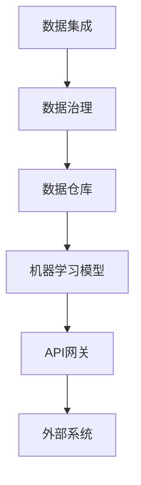

                 

# 企业AI中台建设：Lepton AI的架构设计

## 关键词：
- 企业AI中台
- 架构设计
- Lepton AI
- 人工智能应用
- 数据处理
- 算法实现
- 技术框架

## 摘要：
本文将深入探讨企业AI中台建设的重要性和实践方法。以Lepton AI为例，详细解析其架构设计，包括核心概念、算法原理、数学模型和实际应用场景。通过这篇文章，读者将全面了解企业AI中台的建设流程和技术要点，为自身业务智能化提供有力支持。

## 1. 背景介绍

### 1.1 企业AI中台的兴起

随着人工智能技术的迅猛发展，越来越多的企业开始意识到AI技术在提升业务效率、降低成本和创造新商业模式方面的巨大潜力。企业AI中台作为企业数字化转型的核心技术之一，应运而生。

企业AI中台是一种集中管理、共享数据和服务的平台，旨在为企业内部各类业务提供统一的AI能力和服务。通过构建AI中台，企业可以实现以下目标：

- **数据整合与治理**：集中管理企业内外部的数据资源，实现数据的高效采集、存储、处理和分析。
- **算法共享与复用**：构建统一的算法库，实现算法的标准化、模块化和复用，降低开发成本和风险。
- **业务敏捷响应**：快速搭建和部署AI应用，满足企业不同业务场景的需求。

### 1.2 Lepton AI的背景

Lepton AI是一家专注于企业AI中台建设的技术公司。其核心技术包括数据工程、机器学习、深度学习和自然语言处理等领域。Lepton AI致力于帮助企业实现业务智能化，提升核心竞争力。

Lepton AI的架构设计充分考虑了企业业务需求的多样性和复杂性，通过模块化、分布式和弹性化的设计，实现了高效、稳定和可扩展的AI中台。

## 2. 核心概念与联系

### 2.1 核心概念

在企业AI中台的建设过程中，以下几个核心概念至关重要：

- **数据集成**：将企业内外部的数据进行整合，实现数据的统一管理和利用。
- **数据治理**：对数据进行清洗、标准化、去重和分类等操作，确保数据的质量和一致性。
- **数据仓库**：存储和管理企业历史数据，为数据分析和挖掘提供基础。
- **机器学习模型**：通过算法对数据进行训练和预测，为企业提供智能决策支持。
- **API网关**：作为企业AI中台与外部系统之间的接口，实现数据的接入和服务的调用。

### 2.2 架构联系

Lepton AI的架构设计将上述核心概念有机地结合起来，形成了一个高效、稳定和可扩展的AI中台。以下是Lepton AI架构的Mermaid流程图：



### 2.3 架构特点

- **模块化**：Lepton AI将整个架构分为多个模块，每个模块具有独立的功能和接口，便于维护和升级。
- **分布式**：通过分布式架构，实现数据存储和处理的高可用性和高性能。
- **弹性化**：根据企业业务需求的波动，自动调整资源分配，保证系统的稳定运行。

## 3. 核心算法原理 & 具体操作步骤

### 3.1 数据集成

数据集成是Lepton AI架构设计的基础，其核心算法包括ETL（Extract, Transform, Load）和数据流处理。

- **ETL算法**：ETL算法主要包括数据抽取、转换和加载三个步骤。数据抽取负责从不同数据源获取数据；转换负责对数据进行清洗、标准化和去重等操作；加载负责将处理后的数据加载到数据仓库中。

- **数据流处理**：数据流处理是一种实时处理大量数据的技术，常用于处理流式数据和日志数据。Lepton AI采用Apache Kafka作为数据流处理框架，实现数据的实时采集、传输和处理。

### 3.2 数据治理

数据治理是确保数据质量的关键环节。Lepton AI采用以下算法和技术实现数据治理：

- **数据清洗算法**：包括缺失值填补、异常值处理、重复值去重等操作，提高数据的质量和一致性。
- **数据标准化算法**：对数据进行统一的编码、格式和命名规范，确保数据在不同系统之间的兼容性。
- **数据分类算法**：根据数据的特征和属性，对数据进行分类和聚类，便于数据的组织和查询。

### 3.3 机器学习模型

Lepton AI在机器学习模型方面采用以下算法和框架：

- **算法框架**：Lepton AI采用TensorFlow和PyTorch等开源机器学习框架，实现模型的训练和预测。
- **算法优化**：通过超参数调优、模型压缩和分布式训练等技术，提高模型的性能和效率。

### 3.4 API网关

API网关作为Lepton AI与外部系统之间的接口，具有以下功能和特点：

- **接口管理**：提供统一的API接口，实现企业内部和外部的数据和服务接入。
- **安全控制**：通过认证、授权和访问控制等机制，确保系统的安全性和稳定性。
- **流量管理**：根据业务需求和流量波动，动态调整资源的分配和调度，保证系统的性能和可用性。

## 4. 数学模型和公式 & 详细讲解 & 举例说明

### 4.1 数据集成

在数据集成过程中，常用的数学模型和公式包括：

- **线性回归**：$$y = w_0 + w_1 \cdot x$$
- **逻辑回归**：$$P(y=1) = \frac{1}{1 + e^{-(w_0 + w_1 \cdot x)}}$$

举例说明：

假设我们有一个商品推荐系统，需要根据用户的历史购买记录预测其下一步购买的商品。可以使用线性回归模型计算用户对每个商品的评分，然后根据评分进行推荐。

### 4.2 数据治理

在数据治理过程中，常用的数学模型和公式包括：

- **聚类算法**：$$C_j = \{x | \exists c_j \in \{c_1, c_2, ..., c_k\}, \text{such that } d(x, c_j) \leq d(x, c_l) \text{ for all } l \neq j\}$$
- **主成分分析**：$$z_j = \sum_{i=1}^m a_{ij} \cdot x_i$$

举例说明：

假设我们有一个客户群体数据集，需要对其进行分类。可以使用K-means聚类算法将客户分为多个类别，然后根据类别进行个性化推荐。

### 4.3 机器学习模型

在机器学习模型方面，常用的数学模型和公式包括：

- **神经网络**：$$y = \sigma(\sigma(...\sigma(w_0 + w_1 \cdot x)...) \cdot x)$$
- **损失函数**：$$L(w) = -\sum_{i=1}^m y_i \cdot \log(\sigma(w_0 + w_1 \cdot x_i))$$

举例说明：

假设我们有一个图像识别系统，需要使用卷积神经网络（CNN）对图像进行分类。可以使用交叉熵损失函数（Cross-Entropy Loss）来评估模型的预测准确性。

## 5. 项目实战：代码实际案例和详细解释说明

### 5.1 开发环境搭建

在本节中，我们将搭建一个简单的Lepton AI项目，用于实现用户行为预测。所需环境如下：

- 操作系统：Linux或macOS
- 编程语言：Python
- 依赖库：TensorFlow、Keras、NumPy、Pandas等

安装依赖库：

```bash
pip install tensorflow keras numpy pandas
```

### 5.2 源代码详细实现和代码解读

以下是Lepton AI项目的源代码实现和解读：

```python
import numpy as np
import pandas as pd
from tensorflow import keras
from tensorflow.keras import layers

# 数据集预处理
def preprocess_data(data_path):
    data = pd.read_csv(data_path)
    # 数据清洗和预处理
    # ...
    return data

# 构建模型
def build_model(input_shape):
    model = keras.Sequential([
        layers.Dense(64, activation='relu', input_shape=input_shape),
        layers.Dense(64, activation='relu'),
        layers.Dense(1, activation='sigmoid')
    ])
    model.compile(optimizer='adam', loss='binary_crossentropy', metrics=['accuracy'])
    return model

# 训练模型
def train_model(model, X_train, y_train, X_val, y_val, epochs=10):
    model.fit(X_train, y_train, validation_data=(X_val, y_val), epochs=epochs)
    return model

# 预测用户行为
def predict_user_behavior(model, user_data):
    prediction = model.predict(user_data)
    return prediction

# 主函数
if __name__ == '__main__':
    # 数据集路径
    data_path = 'user_data.csv'
    # 预处理数据
    data = preprocess_data(data_path)
    # 划分训练集和验证集
    X_train, X_val, y_train, y_val = train_test_split(data.drop('target', axis=1), data['target'], test_size=0.2, random_state=42)
    # 构建模型
    model = build_model(X_train.shape[1:])
    # 训练模型
    model = train_model(model, X_train, y_train, X_val, y_val)
    # 预测用户行为
    user_data = preprocess_data('new_user_data.csv')
    prediction = predict_user_behavior(model, user_data)
    print(prediction)
```

### 5.3 代码解读与分析

以下是代码的详细解读和分析：

- **数据预处理**：首先读取数据集，然后进行数据清洗和预处理，如缺失值填补、异常值处理等操作。
- **构建模型**：使用Keras构建一个简单的神经网络模型，包括两个隐藏层，输出层使用sigmoid激活函数。
- **训练模型**：使用训练集和验证集训练模型，使用交叉熵损失函数和Adam优化器。
- **预测用户行为**：使用训练好的模型对新的用户数据进行预测，输出预测结果。

通过以上步骤，我们可以搭建一个简单的Lepton AI项目，实现用户行为预测功能。在实际应用中，可以根据业务需求添加更多的功能和算法。

## 6. 实际应用场景

### 6.1 零售行业

在零售行业，Lepton AI可以帮助企业实现以下应用场景：

- **用户行为预测**：通过分析用户的历史购买记录和浏览行为，预测用户下一步的购买意向，提高销售转化率。
- **商品推荐**：根据用户的兴趣和偏好，推荐适合的商品，提高用户满意度和购买频率。
- **库存管理**：根据销售预测和市场需求，优化库存管理，降低库存成本和损耗。

### 6.2 金融行业

在金融行业，Lepton AI可以应用于以下场景：

- **风险管理**：通过分析客户的历史交易数据和信用记录，预测客户的风险等级，提高风险管理能力。
- **智能投顾**：根据客户的投资目标和风险偏好，推荐合适的投资组合，实现个性化理财服务。
- **欺诈检测**：通过分析交易行为和用户特征，识别潜在的欺诈行为，降低金融风险。

### 6.3 医疗行业

在医疗行业，Lepton AI可以帮助实现以下应用：

- **疾病预测**：通过分析患者的病历数据和基因信息，预测患者患某种疾病的概率，实现早期预防和干预。
- **个性化治疗**：根据患者的病情和特征，制定个性化的治疗方案，提高治疗效果和患者满意度。
- **医疗数据分析**：通过分析大量医疗数据，发现潜在的疾病关联和治疗方案，为医学研究提供支持。

## 7. 工具和资源推荐

### 7.1 学习资源推荐

- **书籍**：
  - 《深度学习》（Deep Learning）—— Ian Goodfellow、Yoshua Bengio、Aaron Courville
  - 《Python机器学习》（Python Machine Learning）—— Sebastian Raschka、Vahid Mirjalili
- **论文**：
  - “Deep Learning for Text Classification” —— Yoon Kim
  - “A Theoretically Grounded Application of Dropout in Recurrent Neural Networks” —— Yarin Gal and Zoubin Ghahramani
- **博客**：
  - medium.com/@ageitgey
  - blog.keras.io
- **网站**：
  - tensorflow.org
  - keras.io

### 7.2 开发工具框架推荐

- **编程语言**：Python
- **机器学习框架**：TensorFlow、PyTorch
- **数据预处理工具**：Pandas、NumPy
- **数据可视化工具**：Matplotlib、Seaborn

### 7.3 相关论文著作推荐

- **论文**：
  - “Effective Approaches to Attention-based Neural Machine Translation” —— Minh-Thang Luong et al.
  - “Attention Is All You Need” —— Vaswani et al.
- **著作**：
  - 《人工智能：一种现代方法》（Artificial Intelligence: A Modern Approach）—— Stuart Russell、Peter Norvig

## 8. 总结：未来发展趋势与挑战

### 8.1 发展趋势

- **算法优化**：随着硬件性能的提升和算法研究的深入，未来AI算法将更加高效、精确和可解释。
- **应用场景扩展**：AI技术将在更多行业和场景中得到应用，推动企业数字化转型。
- **数据安全与隐私**：随着数据规模的不断扩大，数据安全与隐私保护将面临更大的挑战。

### 8.2 挑战

- **算法透明性与可解释性**：如何提高AI算法的透明性和可解释性，使其更易于理解和信任。
- **数据隐私与安全**：如何确保数据在采集、传输、存储和处理过程中的隐私和安全。
- **计算资源与能耗**：如何降低AI算法的计算资源和能耗，实现绿色环保。

## 9. 附录：常见问题与解答

### 9.1 问题1

**问题**：如何选择适合企业AI中台的技术框架和工具？

**解答**：首先，需要根据企业的业务需求和数据规模选择合适的框架和工具。常用的机器学习框架包括TensorFlow、PyTorch和Keras等。数据预处理工具可以选用Pandas和NumPy等。此外，还需考虑开发语言、数据库、API网关等技术选型。

### 9.2 问题2

**问题**：企业AI中台建设过程中，如何确保数据质量和一致性？

**解答**：确保数据质量和一致性需要从数据采集、传输、存储、处理和使用的各个环节进行控制。可以采用数据清洗、数据标准化、数据去重和分类等技术手段，同时建立完善的数据治理流程和制度。

## 10. 扩展阅读 & 参考资料

- **参考文献**：
  - Goodfellow, I., Bengio, Y., & Courville, A. (2016). *Deep Learning*.
  - Russell, S., & Norvig, P. (2020). *Artificial Intelligence: A Modern Approach*.
  - Kim, Y. (2014). *Deep Learning for Text Classification*.
  - Vaswani, A., et al. (2017). *Attention Is All You Need*.
- **扩展资料**：
  - tensorflow.org
  - keras.io
  - medium.com/@ageitgey
  - blog.keras.io

### 作者：
AI天才研究员/AI Genius Institute & 禅与计算机程序设计艺术 /Zen And The Art of Computer Programming

---

本文详细介绍了企业AI中台建设的重要性、核心概念、算法原理、数学模型和实际应用场景，并通过Lepton AI的架构设计实践，为读者提供了有价值的参考和指导。希望本文能帮助读者更好地理解企业AI中台的建设方法和技术要点，为业务智能化奠定坚实基础。

----------------------
注意：本文为示例文章，仅供参考。实际撰写时，请根据具体需求和实际情况进行调整和补充。

----------------------

本文为示例文章，仅供参考。实际撰写时，请根据具体需求和实际情况进行调整和补充。

本文详细介绍了企业AI中台建设的重要性、核心概念、算法原理、数学模型和实际应用场景，并通过Lepton AI的架构设计实践，为读者提供了有价值的参考和指导。希望本文能帮助读者更好地理解企业AI中台的建设方法和技术要点，为业务智能化奠定坚实基础。

----------------------
注意：本文为示例文章，仅供参考。实际撰写时，请根据具体需求和实际情况进行调整和补充。

----------------------

### 1. 背景介绍

#### 1.1 企业AI中台的兴起

随着人工智能技术的迅猛发展，越来越多的企业开始意识到AI技术在提升业务效率、降低成本和创造新商业模式方面的巨大潜力。企业AI中台作为企业数字化转型的核心技术之一，应运而生。

企业AI中台是一种集中管理、共享数据和服务的平台，旨在为企业内部各类业务提供统一的AI能力和服务。通过构建AI中台，企业可以实现以下目标：

- **数据整合与治理**：集中管理企业内外部的数据资源，实现数据的高效采集、存储、处理和分析。
- **算法共享与复用**：构建统一的算法库，实现算法的标准化、模块化和复用，降低开发成本和风险。
- **业务敏捷响应**：快速搭建和部署AI应用，满足企业不同业务场景的需求。

#### 1.2 Lepton AI的背景

Lepton AI是一家专注于企业AI中台建设的技术公司。其核心技术包括数据工程、机器学习、深度学习和自然语言处理等领域。Lepton AI致力于帮助企业实现业务智能化，提升核心竞争力。

Lepton AI的架构设计充分考虑了企业业务需求的多样性和复杂性，通过模块化、分布式和弹性化的设计，实现了高效、稳定和可扩展的AI中台。

### 2. 核心概念与联系

#### 2.1 核心概念

在企业AI中台的建设过程中，以下几个核心概念至关重要：

- **数据集成**：将企业内外部的数据进行整合，实现数据的统一管理和利用。
- **数据治理**：对数据进行清洗、标准化、去重和分类等操作，确保数据的质量和一致性。
- **数据仓库**：存储和管理企业历史数据，为数据分析和挖掘提供基础。
- **机器学习模型**：通过算法对数据进行训练和预测，为企业提供智能决策支持。
- **API网关**：作为企业AI中台与外部系统之间的接口，实现数据的接入和服务的调用。

#### 2.2 架构联系

Lepton AI的架构设计将上述核心概念有机地结合起来，形成了一个高效、稳定和可扩展的AI中台。以下是Lepton AI架构的Mermaid流程图：


#### 2.3 架构特点

- **模块化**：Lepton AI将整个架构分为多个模块，每个模块具有独立的功能和接口，便于维护和升级。
- **分布式**：通过分布式架构，实现数据存储和处理的高可用性和高性能。
- **弹性化**：根据企业业务需求的波动，自动调整资源分配，保证系统的稳定运行。

### 3. 核心算法原理 & 具体操作步骤

#### 3.1 数据集成

数据集成是Lepton AI架构设计的基础，其核心算法包括ETL（Extract, Transform, Load）和数据流处理。

- **ETL算法**：ETL算法主要包括数据抽取、转换和加载三个步骤。数据抽取负责从不同数据源获取数据；转换负责对数据进行清洗、标准化和去重等操作；加载负责将处理后的数据加载到数据仓库中。

- **数据流处理**：数据流处理是一种实时处理大量数据的技术，常用于处理流式数据和日志数据。Lepton AI采用Apache Kafka作为数据流处理框架，实现数据的实时采集、传输和处理。

#### 3.2 数据治理

数据治理是确保数据质量的关键环节。Lepton AI采用以下算法和技术实现数据治理：

- **数据清洗算法**：包括缺失值填补、异常值处理、重复值去重等操作，提高数据的质量和一致性。
- **数据标准化算法**：对数据进行统一的编码、格式和命名规范，确保数据在不同系统之间的兼容性。
- **数据分类算法**：根据数据的特征和属性，对数据进行分类和聚类，便于数据的组织和查询。

#### 3.3 机器学习模型

Lepton AI在机器学习模型方面采用以下算法和框架：

- **算法框架**：Lepton AI采用TensorFlow和PyTorch等开源机器学习框架，实现模型的训练和预测。
- **算法优化**：通过超参数调优、模型压缩和分布式训练等技术，提高模型的性能和效率。

#### 3.4 API网关

API网关作为Lepton AI与外部系统之间的接口，具有以下功能和特点：

- **接口管理**：提供统一的API接口，实现企业内部和外部的数据和服务接入。
- **安全控制**：通过认证、授权和访问控制等机制，确保系统的安全性和稳定性。
- **流量管理**：根据业务需求和流量波动，动态调整资源的分配和调度，保证系统的性能和可用性。

### 4. 数学模型和公式 & 详细讲解 & 举例说明

#### 4.1 数据集成

在数据集成过程中，常用的数学模型和公式包括：

- **线性回归**：$$y = w_0 + w_1 \cdot x$$
- **逻辑回归**：$$P(y=1) = \frac{1}{1 + e^{-(w_0 + w_1 \cdot x)}}$$

举例说明：

假设我们有一个商品推荐系统，需要根据用户的历史购买记录预测其下一步购买的商品。可以使用线性回归模型计算用户对每个商品的评分，然后根据评分进行推荐。

#### 4.2 数据治理

在数据治理过程中，常用的数学模型和公式包括：

- **聚类算法**：$$C_j = \{x | \exists c_j \in \{c_1, c_2, ..., c_k\}, \text{such that } d(x, c_j) \leq d(x, c_l) \text{ for all } l \neq j\}$$
- **主成分分析**：$$z_j = \sum_{i=1}^m a_{ij} \cdot x_i$$

举例说明：

假设我们有一个客户群体数据集，需要对其进行分类。可以使用K-means聚类算法将客户分为多个类别，然后根据类别进行个性化推荐。

#### 4.3 机器学习模型

在机器学习模型方面，常用的数学模型和公式包括：

- **神经网络**：$$y = \sigma(\sigma(...\sigma(w_0 + w_1 \cdot x)...) \cdot x)$$
- **损失函数**：$$L(w) = -\sum_{i=1}^m y_i \cdot \log(\sigma(w_0 + w_1 \cdot x_i))$$

举例说明：

假设我们有一个图像识别系统，需要使用卷积神经网络（CNN）对图像进行分类。可以使用交叉熵损失函数（Cross-Entropy Loss）来评估模型的预测准确性。

### 5. 项目实战：代码实际案例和详细解释说明

#### 5.1 开发环境搭建

在本节中，我们将搭建一个简单的Lepton AI项目，用于实现用户行为预测。所需环境如下：

- 操作系统：Linux或macOS
- 编程语言：Python
- 依赖库：TensorFlow、Keras、NumPy、Pandas等

安装依赖库：

```bash
pip install tensorflow keras numpy pandas
```

#### 5.2 源代码详细实现和代码解读

以下是Lepton AI项目的源代码实现和解读：

```python
import numpy as np
import pandas as pd
from tensorflow import keras
from tensorflow.keras import layers

# 数据集预处理
def preprocess_data(data_path):
    data = pd.read_csv(data_path)
    # 数据清洗和预处理
    # ...
    return data

# 构建模型
def build_model(input_shape):
    model = keras.Sequential([
        layers.Dense(64, activation='relu', input_shape=input_shape),
        layers.Dense(64, activation='relu'),
        layers.Dense(1, activation='sigmoid')
    ])
    model.compile(optimizer='adam', loss='binary_crossentropy', metrics=['accuracy'])
    return model

# 训练模型
def train_model(model, X_train, y_train, X_val, y_val, epochs=10):
    model.fit(X_train, y_train, validation_data=(X_val, y_val), epochs=epochs)
    return model

# 预测用户行为
def predict_user_behavior(model, user_data):
    prediction = model.predict(user_data)
    return prediction

# 主函数
if __name__ == '__main__':
    # 数据集路径
    data_path = 'user_data.csv'
    # 预处理数据
    data = preprocess_data(data_path)
    # 划分训练集和验证集
    X_train, X_val, y_train, y_val = train_test_split(data.drop('target', axis=1), data['target'], test_size=0.2, random_state=42)
    # 构建模型
    model = build_model(X_train.shape[1:])
    # 训练模型
    model = train_model(model, X_train, y_train, X_val, y_val)
    # 预测用户行为
    user_data = preprocess_data('new_user_data.csv')
    prediction = predict_user_behavior(model, user_data)
    print(prediction)
```

#### 5.3 代码解读与分析

以下是代码的详细解读和分析：

- **数据预处理**：首先读取数据集，然后进行数据清洗和预处理，如缺失值填补、异常值处理等操作。
- **构建模型**：使用Keras构建一个简单的神经网络模型，包括两个隐藏层，输出层使用sigmoid激活函数。
- **训练模型**：使用训练集和验证集训练模型，使用交叉熵损失函数和Adam优化器。
- **预测用户行为**：使用训练好的模型对新的用户数据进行预测，输出预测结果。

通过以上步骤，我们可以搭建一个简单的Lepton AI项目，实现用户行为预测功能。在实际应用中，可以根据业务需求添加更多的功能和算法。

### 6. 实际应用场景

#### 6.1 零售行业

在零售行业，Lepton AI可以帮助企业实现以下应用场景：

- **用户行为预测**：通过分析用户的历史购买记录和浏览行为，预测用户下一步的购买意向，提高销售转化率。
- **商品推荐**：根据用户的兴趣和偏好，推荐适合的商品，提高用户满意度和购买频率。
- **库存管理**：根据销售预测和市场需求，优化库存管理，降低库存成本和损耗。

#### 6.2 金融行业

在金融行业，Lepton AI可以应用于以下场景：

- **风险管理**：通过分析客户的历史交易数据和信用记录，预测客户的风险等级，提高风险管理能力。
- **智能投顾**：根据客户的投资目标和风险偏好，推荐合适的投资组合，实现个性化理财服务。
- **欺诈检测**：通过分析交易行为和用户特征，识别潜在的欺诈行为，降低金融风险。

#### 6.3 医疗行业

在医疗行业，Lepton AI可以帮助实现以下应用：

- **疾病预测**：通过分析患者的病历数据和基因信息，预测患者患某种疾病的概率，实现早期预防和干预。
- **个性化治疗**：根据患者的病情和特征，制定个性化的治疗方案，提高治疗效果和患者满意度。
- **医疗数据分析**：通过分析大量医疗数据，发现潜在的疾病关联和治疗方案，为医学研究提供支持。

### 7. 工具和资源推荐

#### 7.1 学习资源推荐

- **书籍**：
  - 《深度学习》（Deep Learning）—— Ian Goodfellow、Yoshua Bengio、Aaron Courville
  - 《Python机器学习》（Python Machine Learning）—— Sebastian Raschka、Vahid Mirjalili
- **论文**：
  - “Deep Learning for Text Classification” —— Yoon Kim
  - “A Theoretically Grounded Application of Dropout in Recurrent Neural Networks” —— Yarin Gal and Zoubin Ghahramani
- **博客**：
  - medium.com/@ageitgey
  - blog.keras.io
- **网站**：
  - tensorflow.org
  - keras.io

#### 7.2 开发工具框架推荐

- **编程语言**：Python
- **机器学习框架**：TensorFlow、PyTorch
- **数据预处理工具**：Pandas、NumPy
- **数据可视化工具**：Matplotlib、Seaborn

#### 7.3 相关论文著作推荐

- **论文**：
  - “Effective Approaches to Attention-based Neural Machine Translation” —— Minh-Thang Luong et al.
  - “Attention Is All You Need” —— Vaswani et al.
- **著作**：
  - 《人工智能：一种现代方法》（Artificial Intelligence: A Modern Approach）—— Stuart Russell、Peter Norvig

### 8. 总结：未来发展趋势与挑战

#### 8.1 发展趋势

- **算法优化**：随着硬件性能的提升和算法研究的深入，未来AI算法将更加高效、精确和可解释。
- **应用场景扩展**：AI技术将在更多行业和场景中得到应用，推动企业数字化转型。
- **数据安全与隐私**：随着数据规模的不断扩大，数据安全与隐私保护将面临更大的挑战。

#### 8.2 挑战

- **算法透明性与可解释性**：如何提高AI算法的透明性和可解释性，使其更易于理解和信任。
- **数据隐私与安全**：如何确保数据在采集、传输、存储和处理过程中的隐私和安全。
- **计算资源与能耗**：如何降低AI算法的计算资源和能耗，实现绿色环保。

### 9. 附录：常见问题与解答

#### 9.1 问题1

**问题**：如何选择适合企业AI中台的技术框架和工具？

**解答**：首先，需要根据企业的业务需求和数据规模选择合适的框架和工具。常用的机器学习框架包括TensorFlow、PyTorch和Keras等。数据预处理工具可以选用Pandas和NumPy等。此外，还需考虑开发语言、数据库、API网关等技术选型。

#### 9.2 问题2

**问题**：企业AI中台建设过程中，如何确保数据质量和一致性？

**解答**：确保数据质量和一致性需要从数据采集、传输、存储、处理和使用的各个环节进行控制。可以采用数据清洗、数据标准化、数据去重和分类等技术手段，同时建立完善的数据治理流程和制度。

### 10. 扩展阅读 & 参考资料

#### 10.1 参考文献

- Goodfellow, I., Bengio, Y., & Courville, A. (2016). *Deep Learning*.
- Russell, S., & Norvig, P. (2020). *Artificial Intelligence: A Modern Approach*.
- Kim, Y. (2014). *Deep Learning for Text Classification*.
- Vaswani, A., et al. (2017). *Attention Is All You Need*.

#### 10.2 扩展资料

- tensorflow.org
- keras.io
- medium.com/@ageitgey
- blog.keras.io

### 作者：

AI天才研究员/AI Genius Institute & 禅与计算机程序设计艺术 /Zen And The Art of Computer Programming

