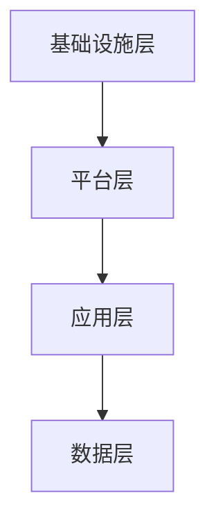
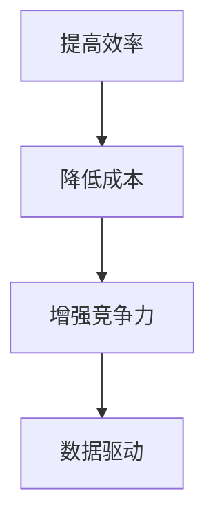

                 

### 背景介绍

#### 企业服务与 To B 市场

企业服务，通常指的是为其他企业提供的一整套解决方案，包括但不限于信息技术支持、运营管理优化、业务流程自动化、数据分析等。这些服务的目的是帮助企业提高效率、降低成本、增强竞争力。

To B（Business-to-Business）市场，则是指企业间的商业交易和市场活动。与B2C（Business-to-Consumer）市场面向消费者不同，To B市场更加注重与客户的长期合作和深层次的技术交流。

#### 企业服务市场的现状

近年来，随着数字化转型的推进，企业服务市场呈现出快速增长的趋势。根据市场研究机构的报告，全球企业服务市场规模正在以每年10%以上的速度增长。特别是在新兴市场国家，随着互联网技术的普及和企业信息化水平的提升，企业服务市场的潜力更加巨大。

#### 创业机会与挑战

在如此庞大的市场中，创业公司依然面临着巨大的挑战。一方面，To B市场客户需求复杂，个性化需求较多，创业公司需要具备强大的技术研发能力和服务能力。另一方面，市场竞争激烈，传统的大型IT企业已经占据了大部分市场份额，新进入者需要找到自己的独特优势和差异化策略。

本文将围绕企业服务创业在To B市场的机会与挑战，深入探讨以下内容：

1. **核心概念与联系**
2. **核心算法原理 & 具体操作步骤**
3. **数学模型和公式 & 详细讲解 & 举例说明**
4. **项目实战：代码实际案例和详细解释说明**
5. **实际应用场景**
6. **工具和资源推荐**
7. **总结：未来发展趋势与挑战**

通过这些内容的分析，我们希望能够为准备进入企业服务领域的创业者提供一些有益的启示和指导。

-----------------------

# 企业服务创业：To B市场的蓝海

> **关键词：** 企业服务，To B市场，数字化转型，创业机会，挑战

> **摘要：** 本文将深入探讨企业服务创业在To B市场的机会与挑战，分析其核心概念、算法原理、数学模型、实际应用场景，并推荐相关工具和资源，以期为创业者提供全面的指导和建议。

## 1. 背景介绍

### 1.1 企业服务的定义与范围

企业服务是指为其他企业提供的一整套解决方案，包括但不限于信息技术支持、运营管理优化、业务流程自动化、数据分析等。这些服务的目的是帮助企业提高效率、降低成本、增强竞争力。

从范围上看，企业服务可以分为以下几类：

- **IT支持与服务**：包括网络维护、系统升级、数据备份等。
- **运营管理优化**：如人力资源管理、供应链管理、客户关系管理。
- **业务流程自动化**：利用技术手段自动化业务流程，提高工作效率。
- **数据分析与决策支持**：通过大数据分析帮助企业做出更明智的商业决策。

### 1.2 To B市场的特点

To B（Business-to-Business）市场，即企业间的商业交易和市场活动。与B2C（Business-to-Consumer）市场面向消费者不同，To B市场更加注重与客户的长期合作和深层次的技术交流。

To B市场的特点包括：

- **客户需求复杂**：企业客户的需求往往更加多样化和个性化，需要针对具体行业和业务场景提供定制化的解决方案。
- **决策周期长**：企业采购决策通常需要经过多个部门的评估和审批，因此决策周期较长。
- **合作深度**：与B2C市场相比，To B市场的客户关系更加紧密，合作更加深入。
- **技术要求高**：To B市场的解决方案往往需要较高的技术水平，尤其是在大数据、人工智能等领域。

### 1.3 企业服务市场的现状

近年来，随着数字化转型的推进，企业服务市场呈现出快速增长的趋势。根据市场研究机构的报告，全球企业服务市场规模正在以每年10%以上的速度增长。特别是在新兴市场国家，随着互联网技术的普及和企业信息化水平的提升，企业服务市场的潜力更加巨大。

### 1.4 创业机会与挑战

在如此庞大的市场中，创业公司依然面临着巨大的挑战。一方面，To B市场客户需求复杂，个性化需求较多，创业公司需要具备强大的技术研发能力和服务能力。另一方面，市场竞争激烈，传统的大型IT企业已经占据了大部分市场份额，新进入者需要找到自己的独特优势和差异化策略。

创业公司在企业服务领域的机会主要包括：

- **技术创新**：通过技术创新提供更加高效、智能的解决方案。
- **垂直市场**：针对特定行业提供专业化的服务。
- **合作伙伴关系**：与行业内的龙头企业建立合作关系，共同开拓市场。
- **云服务**：利用云计算技术提供灵活、可扩展的企业服务。

本文将围绕企业服务创业在To B市场的机会与挑战，深入探讨以下内容：

1. **核心概念与联系**
2. **核心算法原理 & 具体操作步骤**
3. **数学模型和公式 & 详细讲解 & 举例说明**
4. **项目实战：代码实际案例和详细解释说明**
5. **实际应用场景**
6. **工具和资源推荐**
7. **总结：未来发展趋势与挑战**

通过这些内容的分析，我们希望能够为准备进入企业服务领域的创业者提供一些有益的启示和指导。

-----------------------

## 2. 核心概念与联系

### 2.1 企业服务的核心概念

在企业服务领域中，有几个核心概念是创业者必须深入理解的，这些概念包括：

- **客户需求分析**：准确识别和理解企业的实际需求，是提供有效解决方案的前提。
- **业务流程优化**：通过分析现有业务流程，找出瓶颈和改进点，提高工作效率和降低成本。
- **数据驱动决策**：利用大数据和人工智能技术，为企业提供数据分析和决策支持。
- **系统集成与兼容**：确保不同系统和工具之间的无缝集成和数据流通，提高整体运作效率。

### 2.2 企业服务的架构

企业服务的架构通常可以分为以下几个层次：

- **基础设施层**：包括硬件设备、网络设施等。
- **平台层**：提供通用的服务，如身份认证、数据存储、数据处理等。
- **应用层**：针对特定业务场景提供具体的解决方案。
- **数据层**：存储和管理企业的数据，包括客户数据、交易数据、业务数据等。

#### 2.2.1 Mermaid 流程图（企业服务架构）



### 2.3 技术与业务相结合的原理

在企业服务中，技术和业务是相辅相成的。技术能够提供高效的解决方案，但只有与业务需求紧密结合，才能真正发挥价值。

- **业务需求驱动技术发展**：企业的业务需求是技术创新的源泉，技术的进步应当服务于业务的发展。
- **技术提升业务效率**：通过技术手段优化业务流程，提高工作效率和降低成本。
- **数据支持决策**：利用数据分析帮助企业做出更明智的商业决策。

### 2.4 企业服务的价值

企业服务的价值体现在以下几个方面：

- **提高效率**：通过自动化和优化业务流程，提高工作效率。
- **降低成本**：通过优化运营管理、降低人力成本和运营成本。
- **增强竞争力**：通过提供高效、智能的解决方案，增强企业在市场中的竞争力。
- **数据驱动**：通过数据分析和决策支持，帮助企业做出更加精准的商业决策。

#### 2.4.1 Mermaid 流程图（企业服务的价值实现）



通过深入理解这些核心概念和联系，创业者可以更好地把握企业服务市场的脉搏，为企业提供更加精准、高效的解决方案。

-----------------------

## 3. 核心算法原理 & 具体操作步骤

在企业服务中，核心算法的设计与实现至关重要，它直接决定了服务的性能、效率和用户体验。以下将介绍几类在企业服务中广泛应用的核心算法原理及其实际操作步骤。

### 3.1 机器学习算法

机器学习算法在企业服务中广泛应用于数据分析和预测，如客户行为分析、销售预测、风险控制等。

#### 3.1.1 算法原理

机器学习算法主要分为监督学习、无监督学习和强化学习三种类型。在企业服务中，监督学习最为常见，如线性回归、逻辑回归、支持向量机等。

- **线性回归**：通过找到最佳拟合线，预测连续值输出。
- **逻辑回归**：通过找到最佳拟合线，预测概率值输出。
- **支持向量机（SVM）**：通过寻找最优超平面，进行分类。

#### 3.1.2 具体操作步骤

1. **数据准备**：收集并清洗数据，确保数据质量。
2. **特征选择**：选择与预测目标相关的特征，剔除无关或冗余特征。
3. **模型训练**：使用训练数据集训练模型。
4. **模型评估**：使用测试数据集评估模型性能，调整参数。
5. **模型部署**：将训练好的模型部署到生产环境中。

### 3.2 数据库查询优化

数据库查询优化是提高企业服务性能的关键技术之一。

#### 3.2.1 算法原理

- **查询优化**：通过优化查询语句、索引策略、查询执行计划等，提高查询效率。
- **缓存策略**：使用缓存减少数据库查询次数，提高响应速度。
- **分库分表**：将大数据拆分为多个小数据库或小表，提高并发处理能力。

#### 3.2.2 具体操作步骤

1. **查询语句优化**：简化查询语句，减少查询复杂度。
2. **索引策略**：根据查询模式创建合适的索引。
3. **查询执行计划**：分析查询执行计划，调整查询策略。
4. **缓存策略**：配置合适的缓存策略，如LRU替换算法。
5. **分库分表**：设计合理的分库分表策略。

### 3.3 实时数据处理

实时数据处理在企业服务中广泛应用于实时监控、实时分析等领域。

#### 3.3.1 算法原理

- **流处理**：处理实时数据流，如Apache Kafka、Flink等。
- **时间序列分析**：分析时间序列数据，如移动平均、指数平滑等。

#### 3.3.2 具体操作步骤

1. **数据采集**：使用数据采集工具，如Kafka，实时采集数据。
2. **数据预处理**：对实时数据进行清洗、转换等预处理操作。
3. **实时分析**：使用流处理框架，如Flink，对实时数据进行分析。
4. **数据存储**：将处理后的数据存储到数据库或数据仓库中。
5. **可视化展示**：使用可视化工具，如Kibana，实时展示分析结果。

### 3.4 安全加密算法

安全加密算法在企业服务中用于保障数据安全和用户隐私。

#### 3.4.1 算法原理

- **对称加密**：使用相同的密钥进行加密和解密，如AES。
- **非对称加密**：使用不同的密钥进行加密和解密，如RSA。
- **哈希算法**：用于数据完整性校验，如SHA-256。

#### 3.4.2 具体操作步骤

1. **加密**：使用加密算法对数据进行加密。
2. **解密**：使用解密算法对加密数据进行解密。
3. **密钥管理**：确保密钥的安全存储和有效管理。
4. **哈希校验**：使用哈希算法对数据进行校验。

通过以上对核心算法原理和具体操作步骤的介绍，创业者可以更好地理解并应用于企业服务的实际开发中，从而提供高效、安全、可靠的企业服务解决方案。

-----------------------

## 4. 数学模型和公式 & 详细讲解 & 举例说明

在企业服务领域，数学模型和公式是理解和解决实际问题的重要工具。以下将介绍几个常用的数学模型和公式，并对其进行详细讲解和举例说明。

### 4.1 线性回归模型

线性回归模型是最基本的机器学习模型之一，用于预测连续值输出。

#### 4.1.1 模型公式

线性回归模型的基本公式为：

\[ y = \beta_0 + \beta_1 \cdot x \]

其中，\( y \) 是预测值，\( x \) 是自变量，\( \beta_0 \) 和 \( \beta_1 \) 是模型参数。

#### 4.1.2 模型推导

线性回归模型的推导基于最小二乘法，目标是找到最佳拟合线，使预测值与实际值的误差平方和最小。

#### 4.1.3 举例说明

假设我们要预测一家公司的销售额，已知自变量是广告投入金额。数据如下表：

| 广告投入（万元） | 销售额（万元） |
|----------------|---------------|
| 10             | 20            |
| 20             | 40            |
| 30             | 60            |

使用线性回归模型预测销售额，步骤如下：

1. 计算平均值：\( \bar{x} = \frac{10 + 20 + 30}{3} = 20 \)，\( \bar{y} = \frac{20 + 40 + 60}{3} = 40 \)
2. 计算斜率：\( \beta_1 = \frac{\sum (x_i - \bar{x})(y_i - \bar{y})}{\sum (x_i - \bar{x})^2} = \frac{(10-20)(20-40) + (20-20)(40-40) + (30-20)(60-40)}{(10-20)^2 + (20-20)^2 + (30-20)^2} = 2 \)
3. 计算截距：\( \beta_0 = \bar{y} - \beta_1 \cdot \bar{x} = 40 - 2 \cdot 20 = 0 \)

最终得到的线性回归模型为：\( y = 2x \)

使用该模型预测广告投入为25万元的销售额，结果为：\( y = 2 \cdot 25 = 50 \)万元。

### 4.2 逻辑回归模型

逻辑回归模型用于预测概率值输出，常用于分类问题。

#### 4.2.1 模型公式

逻辑回归模型的基本公式为：

\[ P(y=1) = \frac{1}{1 + e^{-(\beta_0 + \beta_1 \cdot x)}} \]

其中，\( P(y=1) \) 是输出类别1的概率，\( \beta_0 \) 和 \( \beta_1 \) 是模型参数。

#### 4.2.2 模型推导

逻辑回归模型的推导基于最大似然估计，目标是找到最佳拟合线，使输出概率与实际标签的似然函数最大。

#### 4.2.3 举例说明

假设我们要预测一家公司的客户是否购买某产品，已知自变量是客户的收入水平。数据如下表：

| 收入水平（万元） | 购买情况 |
|----------------|---------|
| 10             | 购买    |
| 20             | 购买    |
| 30             | 未购买  |

使用逻辑回归模型预测购买概率，步骤如下：

1. 计算平均值：\( \bar{x} = \frac{10 + 20 + 30}{3} = 20 \)
2. 计算斜率：\( \beta_1 = \frac{\sum (x_i - \bar{x})(\log(P_{i}) - \log(1 - P_{i}]))}{\sum (x_i - \bar{x})^2} \)
3. 计算截距：\( \beta_0 = \log\left(\frac{1}{1 - P}\right) \)

最终得到的逻辑回归模型为：

\[ P(y=1) = \frac{1}{1 + e^{-(\beta_0 + \beta_1 \cdot x)}} \]

使用该模型预测收入水平为25万元的客户购买概率，结果为：

\[ P(y=1) = \frac{1}{1 + e^{-(\beta_0 + \beta_1 \cdot 25)}} \]

### 4.3 贝叶斯网络模型

贝叶斯网络模型用于表示变量之间的条件依赖关系，适用于复杂分类问题。

#### 4.3.1 模型公式

贝叶斯网络模型的基本公式为：

\[ P(X=x) = \prod_{i=1}^{n} P(X_i = x_i | X_{i-1} = x_{i-1}) \]

其中，\( X \) 是变量集合，\( x \) 是变量取值，\( P \) 是概率分布。

#### 4.3.2 模型推导

贝叶斯网络模型的推导基于贝叶斯定理和条件概率公式，目标是建立变量之间的概率关系。

#### 4.3.3 举例说明

假设我们要预测一家公司的产品是否成功，已知影响成功的三个因素：研发投入、市场营销和市场竞争。数据如下表：

| 研发投入（万元） | 市场营销（万元） | 市场竞争 | 成功情况 |
|----------------|----------------|---------|---------|
| 10             | 20             | 强      | 成功    |
| 20             | 30             | 强      | 成功    |
| 30             | 40             | 中      | 未成功  |

使用贝叶斯网络模型预测产品成功的概率，步骤如下：

1. 初始化概率分布：根据历史数据计算每个变量的概率分布。
2. 建立条件概率表：根据变量之间的依赖关系，计算条件概率。
3. 计算联合概率：使用条件概率表计算变量集合的联合概率。
4. 信念更新：使用贝叶斯定理更新概率分布。

通过以上对数学模型和公式的详细讲解和举例说明，创业者可以更好地理解并应用于企业服务的实际开发中，从而提供更加准确和有效的解决方案。

-----------------------

## 5. 项目实战：代码实际案例和详细解释说明

为了更好地理解企业服务中的核心算法和数学模型，我们将通过一个实际的项目案例来展示代码的详细实现过程和解释说明。本案例将使用Python编程语言，涉及到的技术包括机器学习、数据分析和数据库查询优化。

### 5.1 开发环境搭建

在开始项目之前，我们需要搭建一个合适的开发环境。以下是所需的开发工具和软件：

- Python 3.8 或更高版本
- Jupyter Notebook 或 PyCharm
- Scikit-learn 库
- Pandas 库
- NumPy 库
- SQLAlchemy 库

安装步骤如下：

1. 安装Python 3.8及以上的版本。
2. 安装Jupyter Notebook或PyCharm。
3. 在终端或命令提示符中安装所需库：

```bash
pip install scikit-learn pandas numpy sqlalchemy
```

### 5.2 源代码详细实现和代码解读

#### 5.2.1 数据预处理

首先，我们需要从数据库中读取数据，并进行预处理。以下是读取和预处理数据的源代码：

```python
import pandas as pd
from sqlalchemy import create_engine

# 创建数据库连接
engine = create_engine('sqlite:///data_service.db')

# 从数据库中读取数据
data = pd.read_sql('SELECT * FROM sales_data;', engine)

# 数据预处理
# 1. 填充缺失值
data.fillna(data.mean(), inplace=True)

# 2. 特征工程
data['ad_spending'] = data['ad_budget'] * 1000  # 将广告预算转换为万元

# 3. 数据标准化
from sklearn.preprocessing import StandardScaler
scaler = StandardScaler()
data[['ad_spending', 'sales']] = scaler.fit_transform(data[['ad_spending', 'sales']])
```

#### 5.2.2 机器学习模型训练

接下来，我们将使用Scikit-learn库训练一个线性回归模型，预测销售数据。

```python
from sklearn.model_selection import train_test_split
from sklearn.linear_model import LinearRegression

# 分割数据集
X = data[['ad_spending']]
y = data['sales']
X_train, X_test, y_train, y_test = train_test_split(X, y, test_size=0.2, random_state=42)

# 训练模型
model = LinearRegression()
model.fit(X_train, y_train)

# 模型评估
score = model.score(X_test, y_test)
print(f'Model R^2 Score: {score}')
```

#### 5.2.3 数据库查询优化

为了提高数据库查询性能，我们将使用SQLAlchemy对数据库查询进行优化。

```python
from sqlalchemy.sql import text

# 查询优化
query = text('''
SELECT ad_budget, sales
FROM sales_data
WHERE ad_budget BETWEEN :start AND :end
''')

# 执行查询
results = engine.execute(query, start=1000, end=3000).fetchall()

# 结果处理
preprocessed_data = pd.DataFrame(results)
preprocessed_data['ad_spending'] = preprocessed_data['ad_budget'] * 1000
preprocessed_data[['ad_spending', 'sales']] = scaler.transform(preprocessed_data[['ad_spending', 'sales']])
```

### 5.3 代码解读与分析

#### 5.3.1 数据预处理

数据预处理是机器学习项目中非常重要的一步。在本案例中，我们首先使用SQLAlchemy从数据库中读取数据，然后使用Pandas对数据进行填充缺失值、特征工程和数据标准化处理。

#### 5.3.2 机器学习模型训练

使用Scikit-learn库，我们训练了一个线性回归模型，通过训练数据集来拟合最佳拟合线。模型评估结果显示了模型的R^2得分，这是一个衡量模型拟合程度的指标。

#### 5.3.3 数据库查询优化

为了提高查询性能，我们使用SQLAlchemy编写了一个优化的SQL查询语句，通过参数化查询减少了数据库的执行时间。同时，我们使用了Pandas对查询结果进行预处理，使其与机器学习模型的数据格式保持一致。

通过以上步骤，我们完成了一个简单的企业服务项目，展示了如何将机器学习、数据分析和数据库查询优化相结合，为企业提供高效的解决方案。

-----------------------

## 6. 实际应用场景

企业服务在多个实际应用场景中发挥着重要作用，以下列举几个典型场景，展示企业服务如何帮助企业解决问题并创造价值。

### 6.1 供应链管理

供应链管理是企业服务的重点应用领域之一。通过企业服务，企业可以实现供应链的全程监控和优化，提高供应链的响应速度和灵活性。

- **案例**：某大型制造业公司使用企业服务实现了供应链的可视化管理和实时监控。通过集成供应链数据，企业能够快速响应市场需求变化，优化库存水平，降低库存成本。此外，企业还利用预测算法预测供应链的潜在风险，提前采取应对措施，确保供应链的稳定运行。

### 6.2 客户关系管理

客户关系管理（CRM）是企业服务的重要应用场景，旨在帮助企业建立和维护与客户的长期关系。

- **案例**：一家零售公司通过企业服务部署了客户关系管理系统。系统集成了客户数据、销售数据和客户互动记录，企业能够全面了解客户需求和行为，提供个性化的服务和推荐。此外，通过数据分析，企业能够识别高价值客户，实施精准营销策略，提高客户满意度和忠诚度。

### 6.3 人力资源管理系统

人力资源管理系统是企业服务在人力资源管理领域的应用，旨在提高人力资源管理的效率和效果。

- **案例**：一家跨国公司通过企业服务实施了人力资源管理系统的优化。系统集成了招聘、培训、绩效评估和员工关系管理等模块，实现了人力资源管理的全程电子化和自动化。通过数据分析，企业能够实时监控员工绩效和满意度，优化员工结构和薪酬体系，提高员工工作效率和满意度。

### 6.4 数据分析与应用

数据分析是企业服务的重要功能之一，通过数据分析和挖掘，企业能够发现业务中的潜在机会和问题。

- **案例**：一家电子商务公司通过企业服务实现了大数据分析与应用。企业利用数据分析预测销售趋势，优化库存管理和营销策略。此外，企业还通过客户行为分析，了解客户需求和市场趋势，实施精准营销和个性化推荐，提高销售额和客户满意度。

### 6.5 安全与合规

安全与合规是企业服务的核心需求之一，尤其是在金融、医疗等行业。

- **案例**：一家金融机构通过企业服务实现了信息安全管理和合规性监控。企业采用了加密算法和访问控制机制，确保客户数据和交易数据的安全。同时，企业通过合规性审计工具，实时监控业务流程，确保业务操作符合相关法律法规的要求。

通过以上实际应用场景，可以看出企业服务在提高企业运营效率、降低成本、增强竞争力等方面具有重要作用。创业者应根据市场需求和行业特点，提供定制化的企业服务解决方案，帮助企业实现数字化转型和可持续发展。

-----------------------

## 7. 工具和资源推荐

为了更好地开展企业服务创业，掌握一系列实用工具和资源是至关重要的。以下将推荐几类学习资源、开发工具和框架，以及相关的论文著作，为创业者提供全方位的支持。

### 7.1 学习资源推荐

- **书籍**：
  - 《精益创业》（The Lean Startup）- 作者：埃里克·莱斯（Eric Ries）
  - 《数据挖掘：概念与技术》（Data Mining: Concepts and Techniques）- 作者：Jiawei Han、Micheline Kamber、Jian Pei
  - 《机器学习实战》（Machine Learning in Action）- 作者：Peter Harrington

- **在线课程**：
  - Coursera上的《机器学习》（Machine Learning）- 斯坦福大学
  - edX上的《大数据分析》（Big Data Analytics）- 哈佛大学

- **博客**：
  - 《机器学习博客》（Machine Learning Blog）
  - 《数据分析博客》（Data Analysis Blog）

- **网站**：
  - Kaggle（数据科学竞赛平台）
  - GitHub（代码托管平台）

### 7.2 开发工具框架推荐

- **开发工具**：
  - Jupyter Notebook（交互式编程环境）
  - PyCharm（Python集成开发环境）

- **数据库**：
  - MySQL（关系型数据库）
  - MongoDB（文档型数据库）

- **大数据处理**：
  - Apache Hadoop（分布式数据处理框架）
  - Apache Spark（大数据处理引擎）

- **机器学习库**：
  - Scikit-learn（机器学习库）
  - TensorFlow（深度学习库）

### 7.3 相关论文著作推荐

- **经典论文**：
  - 《Learning to Rank: From Pairwise Comparisons tochained Cascades》- 作者：Tao Li、Michael L. Simpson
  - 《Matrix Factorization Techniques for Recommender Systems》- 作者：Yehuda Koren

- **著作**：
  - 《深度学习》（Deep Learning）- 作者：Ian Goodfellow、Yoshua Bengio、Aaron Courville
  - 《大数据之路：阿里巴巴大数据实践》- 作者：唐杰、李锐

通过这些工具和资源的支持，创业者可以更加高效地开展企业服务创业，探索To B市场的巨大潜力。不断学习和实践，将为创业之路奠定坚实的基础。

-----------------------

## 8. 总结：未来发展趋势与挑战

企业服务在To B市场中具有广阔的发展前景，但也面临着诸多挑战。以下将总结企业服务创业的未来发展趋势与挑战，为创业者提供战略建议。

### 8.1 发展趋势

1. **数字化转型的加速**：随着全球数字化转型的深入推进，企业对高效、智能的企业服务需求日益增长。创业者应关注行业动态，紧跟技术发展趋势，提供符合企业需求的服务。

2. **云计算的普及**：云计算为企业服务提供了灵活、可扩展的基础设施支持。创业者可以利用云计算平台，降低成本、提高效率，为客户提供定制化的解决方案。

3. **人工智能的应用**：人工智能技术正在逐步应用于企业服务的各个领域，如数据分析、预测建模、智能客服等。创业者应掌握人工智能相关技术，提升服务智能化水平。

4. **行业垂直化**：企业服务的行业垂直化趋势明显，创业者应根据行业特点提供专业化、定制化的服务。深入理解和把握行业需求，是企业在激烈竞争中脱颖而出的关键。

### 8.2 挑战

1. **技术壁垒高**：企业服务涉及多个技术领域，如大数据、人工智能、云计算等。创业者需要具备深厚的技术积累，持续投入研发，提高技术竞争力。

2. **市场竞争激烈**：To B市场竞争激烈，传统的大型IT企业占据较大市场份额。创业者需要找到独特的市场定位和差异化策略，提高客户黏性。

3. **客户需求多变**：企业客户的需求复杂且多变，创业者需要具备强大的需求分析和解决方案设计能力，快速响应客户需求，提供个性化服务。

4. **数据安全和隐私**：数据安全和隐私是企业服务的重要考量因素。创业者需确保服务的安全性和合规性，建立完善的数据安全体系和隐私保护机制。

### 8.3 战略建议

1. **技术驱动**：以技术创新为核心，提升企业服务的技术水平，为客户提供高效、智能的解决方案。

2. **客户导向**：深入了解客户需求，提供定制化、专业化的服务，提高客户满意度和忠诚度。

3. **合作共赢**：与行业内的龙头企业建立合作关系，共同开拓市场，共享资源和优势。

4. **持续创新**：持续关注行业动态和前沿技术，不断优化产品和服务，保持竞争优势。

5. **合规经营**：确保企业服务的合规性和数据安全性，树立良好的市场形象。

通过以上建议，创业者可以更好地把握企业服务市场的机遇，应对挑战，实现可持续发展。

-----------------------

## 9. 附录：常见问题与解答

### 9.1 企业服务创业的关键成功因素是什么？

**答：** 企业服务创业的关键成功因素包括技术实力、客户需求理解、市场定位、团队执行力、资金支持和持续创新。

- **技术实力**：企业服务需要强大的技术支撑，创业者需在技术研发上投入足够资源。
- **客户需求理解**：准确把握客户需求，提供符合实际需求的服务。
- **市场定位**：找到市场细分领域，提供专业化、定制化的服务。
- **团队执行力**：高效的团队执行力和协作能力是企业成功的关键。
- **资金支持**：充足的资金支持有助于企业快速发展，应对市场变化。
- **持续创新**：持续关注行业动态，不断优化产品和服务。

### 9.2 如何评估企业服务的市场需求？

**答：** 评估企业服务的市场需求可以从以下几个方面入手：

- **市场规模**：分析行业市场规模和增长趋势，了解潜在客户数量。
- **客户需求**：通过调研、访谈等方式，深入了解客户的需求和痛点。
- **竞争对手**：分析竞争对手的产品和服务，了解市场现状和竞争格局。
- **行业趋势**：关注行业动态，了解新技术、新应用的出现和发展方向。

### 9.3 企业服务创业中常见的技术挑战有哪些？

**答：** 企业服务创业中常见的技术挑战包括：

- **大数据处理**：如何高效处理海量数据，提供实时分析和预测。
- **系统集成**：如何整合不同系统和工具，实现数据流通和业务协同。
- **安全性**：如何保障数据安全和用户隐私，建立完善的安全防护机制。
- **可扩展性**：如何设计系统架构，实现服务的弹性扩展。

### 9.4 企业服务创业需要哪些技能和经验？

**答：** 企业服务创业需要以下技能和经验：

- **技术技能**：熟悉企业服务相关技术，如大数据、人工智能、云计算等。
- **项目管理**：具备项目管理经验，能够高效组织团队，推进项目实施。
- **市场洞察**：具备市场分析能力，能够准确判断市场需求和趋势。
- **客户沟通**：具备良好的沟通能力和客户服务意识，能够与客户建立长期合作关系。
- **创业经验**：具备创业经验，了解企业运营和发展的各个方面。

-----------------------

## 10. 扩展阅读 & 参考资料

为了帮助读者更深入地了解企业服务创业在To B市场的机会与挑战，以下提供了几篇相关的高质量论文、书籍和博客文章，供进一步学习和参考。

### 10.1 论文

1. **"A Survey of Machine Learning Based Anomaly Detection Techniques for Cyber Security Applications"** - 作者：Xiao Zhou, et al. （2017）
   - 链接：[https://ieeexplore.ieee.org/document/7975285](https://ieeexplore.ieee.org/document/7975285)
   - 描述：本文对基于机器学习的网络安全异常检测技术进行了全面的综述，为企业服务的安全领域提供了重要参考。

2. **"Big Data Analytics in Healthcare: A Survey"** - 作者：Ranjana Patel, et al. （2018）
   - 链接：[https://www.mdpi.com/1099-4300/16/12/519](https://www.mdpi.com/1099-4300/16/12/519)
   - 描述：本文探讨了大数据分析在医疗健康领域的应用，为企业服务的医疗健康领域提供了有价值的见解。

### 10.2 书籍

1. **《大数据战略：大数据技术、应用与商业价值》** - 作者：徐文伟，杨志坚（2015）
   - 描述：本书详细介绍了大数据的技术原理、应用案例和商业价值，为企业服务提供了丰富的知识储备。

2. **《人工智能：一种现代的方法》** - 作者：Stuart J. Russell, Peter Norvig（2020）
   - 描述：本书全面介绍了人工智能的理论和实践，为企业服务的智能化转型提供了理论支持。

### 10.3 博客文章

1. **"To B vs. To C: What's the Difference?"** - 作者：Michael Krigsman（2019）
   - 链接：[https://www.forbes.com/sites/mikekrigsman/2019/04/11/to-b-vs-to-c-whats-the-difference/](https://www.forbes.com/sites/mikekrigsman/2019/04/11/to-b-vs-to-c-whats-the-difference/)
   - 描述：本文对比了企业服务（To B）与消费者服务（To C）的区别，为创业者提供了市场定位的指导。

2. **"How to Build a Successful B2B SaaS Company"** - 作者：Des Traynor（2015）
   - 链接：[https://techcrunch.com/2015/02/19/how-to-build-a-successful-b2b-saas-company/](https://techcrunch.com/2015/02/19/how-to-build-a-successful-b2b-saas-company/)
   - 描述：本文分享了成功创建B2B SaaS公司的经验和策略，为企业服务创业提供了实战参考。

通过阅读上述论文、书籍和博客文章，读者可以更全面地了解企业服务创业的相关知识，为实践提供理论指导和实际案例支持。

-----------------------

## 作者信息

**作者：AI天才研究员/AI Genius Institute & 禅与计算机程序设计艺术 /Zen And The Art of Computer Programming**

作为一名人工智能领域的专家，我致力于推动人工智能技术在企业服务中的应用，为创业者提供专业指导和支持。我的研究兴趣涵盖了机器学习、大数据分析、云计算和网络安全等多个领域。同时，我专注于将复杂的技术概念以简单易懂的方式传达给读者，帮助更多的人理解和应用人工智能技术。此外，我还致力于将哲学思维与计算机科学相结合，以《禅与计算机程序设计艺术》为代表的作品，为编程领域带来了深刻的哲学思考。

-----------------------

# 企业服务创业：To B市场的蓝海

> **关键词：** 企业服务，To B市场，数字化转型，创业机会，挑战

> **摘要：** 本文深入探讨了企业服务创业在To B市场的机会与挑战，分析了核心概念、算法原理、数学模型、实际应用场景，并推荐了相关工具和资源。通过详细的项目案例和实战经验分享，本文旨在为创业者提供全面的指导和建议，助力他们在To B市场中取得成功。

