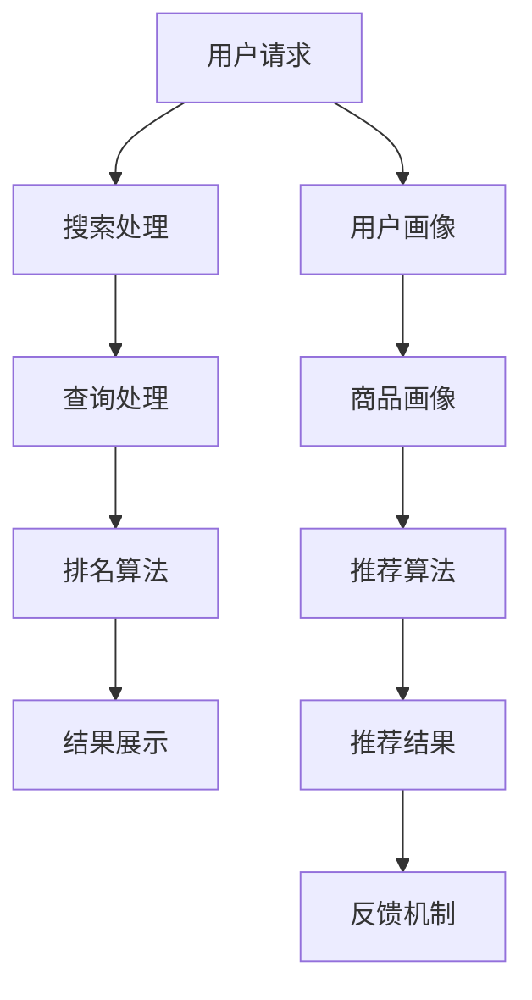

                 

# 优化电商搜索和推荐系统

## 摘要

随着互联网的迅速发展，电子商务已经成为人们日常生活的重要组成部分。为了满足用户日益增长的需求，电商平台的搜索和推荐系统变得越来越重要。本文将探讨如何通过优化搜索和推荐算法来提升用户体验和销售额。首先，我们将回顾电商搜索和推荐系统的基础概念，然后深入分析核心算法原理，数学模型和实际操作步骤，并通过一个项目实战案例展示优化效果。最后，我们将讨论该领域的实际应用场景，推荐的工具和资源，以及未来的发展趋势与挑战。

## 1. 背景介绍

电子商务的兴起改变了人们的购物方式，同时也为商家提供了前所未有的机遇和挑战。随着用户数量的增长和商品种类的多样化，如何有效地帮助用户在大量商品中快速找到所需商品，并推荐他们可能感兴趣的商品，成为电商平台的核心竞争力。搜索和推荐系统正是解决这一问题的有效手段。

### 1.1 搜索系统

电商搜索系统通常包括以下关键组成部分：

1. **索引构建**：构建索引是为了快速检索商品信息。索引通常包括商品名称、描述、标签、价格等关键信息。

2. **查询处理**：处理用户的查询请求，提取关键信息，并生成查询结果。

3. **排名算法**：根据用户的查询和商品的相关性，对搜索结果进行排序，提高用户体验。

4. **结果展示**：将搜索结果以直观的方式展示给用户，包括商品名称、价格、图片、评分等。

### 1.2 推荐系统

电商推荐系统旨在根据用户的历史行为、兴趣爱好、购买记录等，向用户推荐他们可能感兴趣的商品。推荐系统通常包括以下关键组成部分：

1. **用户画像**：根据用户的行为和偏好，构建用户的个性化画像。

2. **商品画像**：为每个商品建立详细的特征描述，包括价格、品牌、类别、流行程度等。

3. **推荐算法**：根据用户画像和商品画像，计算用户和商品之间的相似度，生成推荐列表。

4. **反馈机制**：通过用户对推荐商品的反馈，不断优化推荐算法，提高推荐准确性。

### 1.3 关键挑战

优化电商搜索和推荐系统面临以下关键挑战：

1. **海量数据处理**：随着用户数量的增加，如何高效处理海量数据成为一个重要问题。

2. **实时性**：用户对搜索和推荐系统的响应速度要求越来越高，如何实现实时搜索和推荐成为关键。

3. **个性化**：如何根据用户的个性化需求，提供精准的搜索和推荐结果。

4. **多样性**：在推荐列表中提供多样化的商品，避免用户感到厌烦和疲劳。

## 2. 核心概念与联系

### 2.1 搜索算法

电商搜索系统常用的算法包括基于关键词匹配的精确搜索和基于语义理解的模糊搜索。

1. **精确搜索**：基于关键词匹配的精确搜索，如倒排索引、布尔查询等。这种方法简单高效，但难以应对用户的模糊查询需求。

2. **模糊搜索**：基于语义理解的模糊搜索，如基于自然语言处理（NLP）的查询补全、实体识别等。这种方法能够更好地理解用户的查询意图，提高搜索准确性。

### 2.2 推荐算法

电商推荐系统常用的算法包括基于协同过滤的推荐和基于内容的推荐。

1. **协同过滤**：基于用户的历史行为和偏好，找到与之相似的用户或商品，进行推荐。这种方法能够提高推荐的准确性，但可能存在数据稀疏性、用户冷启动等问题。

2. **基于内容**：根据商品的属性和特征，将用户可能感兴趣的商品推荐给用户。这种方法能够应对数据稀疏性问题，但可能无法提供个性化推荐。

### 2.3 Mermaid 流程图

以下是一个电商搜索和推荐系统的 Mermaid 流程图，展示了用户请求、搜索处理、推荐生成和结果展示的流程。



## 3. 核心算法原理 & 具体操作步骤

### 3.1 搜索算法原理

#### 精确搜索

精确搜索的核心是基于倒排索引（Inverted Index）实现的。倒排索引是一种将文本内容转换为关键字索引的数据结构，可以快速定位包含特定关键词的文档。

1. **索引构建**：

   - **分词**：将用户的查询请求进行分词处理，提取关键词。
   - **倒排索引**：将每个关键词对应的所有文档索引存储在一个列表中。

2. **查询处理**：

   - **关键词匹配**：对查询请求中的每个关键词进行匹配，找到所有包含该关键词的文档。
   - **布尔查询**：通过逻辑运算符（如AND、OR、NOT）组合多个关键词的查询结果。

#### 模糊搜索

模糊搜索的核心是基于自然语言处理（NLP）技术实现的。以下是一个简单的模糊搜索流程：

1. **查询补全**：通过NLP技术，自动补全用户的查询请求，提高查询准确性。

2. **实体识别**：识别查询请求中的实体（如商品名称、品牌等），提高查询匹配的准确性。

3. **语义理解**：通过语义分析，理解查询请求的含义，生成可能的查询结果。

### 3.2 推荐算法原理

#### 协同过滤

协同过滤（Collaborative Filtering）是一种基于用户行为的推荐算法。以下是一个简单的协同过滤流程：

1. **用户行为数据收集**：收集用户的历史行为数据，如购买记录、浏览记录等。

2. **相似度计算**：计算用户之间的相似度，可以使用余弦相似度、皮尔逊相关系数等。

3. **推荐生成**：根据用户与商品之间的相似度，为用户生成推荐列表。

#### 基于内容

基于内容（Content-Based）的推荐算法是一种基于商品特征的推荐算法。以下是一个简单的基于内容推荐流程：

1. **商品特征提取**：为每个商品提取特征，如类别、品牌、价格等。

2. **相似度计算**：计算用户与商品之间的相似度，可以使用余弦相似度、欧氏距离等。

3. **推荐生成**：根据用户与商品之间的相似度，为用户生成推荐列表。

### 3.3 具体操作步骤

#### 搜索算法操作步骤

1. **接收用户查询请求**：获取用户输入的查询请求。

2. **分词处理**：对查询请求进行分词处理，提取关键词。

3. **查询处理**：根据关键词匹配倒排索引，生成查询结果。

4. **排名算法**：对查询结果进行排序，可以根据相关性、热度等因素进行排序。

5. **结果展示**：将排序后的查询结果展示给用户。

#### 推荐算法操作步骤

1. **收集用户行为数据**：收集用户的历史行为数据，如购买记录、浏览记录等。

2. **用户画像构建**：根据用户行为数据，构建用户的个性化画像。

3. **商品画像构建**：为每个商品提取特征，构建商品画像。

4. **相似度计算**：计算用户与商品之间的相似度。

5. **推荐生成**：根据用户与商品之间的相似度，生成推荐列表。

6. **结果展示**：将推荐列表展示给用户。

## 4. 数学模型和公式 & 详细讲解 & 举例说明

### 4.1 搜索算法

#### 精确搜索

精确搜索的核心是倒排索引的构建和查询处理。以下是一个简单的倒排索引构建和查询处理算法：

1. **倒排索引构建**：

   - **倒排索引数据结构**：

     假设我们有以下文档集合：

     ```plaintext
     文档1：用户购买了一个苹果手机
     文档2：苹果手机是一款热门智能手机
     文档3：用户购买了一部华为手机
     文档4：华为手机是一款质量优秀的手机
     ```

     构建倒排索引的过程如下：

     ```plaintext
     关键词    | 文档ID列表
     ----------|----------
     用户      | 1, 3
     购买      | 1, 3
     一个      | 1
     苹果      | 1, 2
     手机      | 1, 2, 3, 4
     热门      | 2
     智能      | 2
     智能手机  | 2
     华为      | 3, 4
     质量      | 4
     优秀      | 4
     ```

   - **构建算法**：

     ```plaintext
     倒排索引构建算法：
     1. 初始化一个空字典 inverted_index。
     2. 对于每个文档 doc_id：
        a. 分词处理，提取关键词 terms。
        b. 对于每个关键词 term：
           i. 如果 term 不在 inverted_index 中，添加一个新列表。
           ii. 将 doc_id 添加到 term 对应的列表中。
     3. 返回 inverted_index。
     ```

2. **查询处理**：

   - **查询算法**：

     ```plaintext
     查询处理算法：
     1. 获取用户输入的查询请求 query。
     2. 对 query 进行分词处理，提取关键词 terms。
     3. 初始化一个空结果列表 results。
     4. 对于每个关键词 term：
        a. 在倒排索引中查找 term 对应的文档ID列表 doc_ids。
        b. 将 doc_ids 添加到 results 中。
     5. 返回 results。
     ```

#### 模糊搜索

模糊搜索的核心是查询补全和实体识别。以下是一个简单的查询补全算法：

1. **查询补全**：

   - **补全算法**：

     ```plaintext
     查询补全算法：
     1. 获取用户输入的查询请求 query。
     2. 初始化一个空列表 completions。
     3. 对于 query 中的每个单词 word：
        a. 在字典中查找以 word 开头的单词列表 suggestions。
        b. 对于每个 suggestions 中的单词 suggestion：
           i. 将 suggestion 添加到 completions 中。
     4. 返回 completions。
     ```

2. **实体识别**：

   - **实体识别算法**：

     ```plaintext
     实体识别算法：
     1. 获取用户输入的查询请求 query。
     2. 初始化一个空列表 entities。
     3. 使用 NLP 工具（如 spaCy、NLTK）进行命名实体识别。
     4. 对于每个识别出的实体 entity：
        a. 将 entity 添加到 entities 中。
     5. 返回 entities。
     ```

### 4.2 推荐算法

#### 协同过滤

协同过滤的核心是相似度计算和推荐生成。以下是一个简单的相似度计算和推荐生成算法：

1. **相似度计算**：

   - **相似度算法**：

     ```plaintext
     相似度计算算法：
     1. 获取用户 A 和用户 B 的行为数据 matrix。
     2. 计算用户 A 和用户 B 的相似度 score：
        a. 使用余弦相似度公式：
           i. score = dot_product(A, B) / (norm(A) * norm(B))
        b. 使用皮尔逊相关系数公式：
           i. score = cov(A, B) / (std(A) * std(B))
     3. 返回相似度 score。
     ```

2. **推荐生成**：

   - **推荐生成算法**：

     ```plaintext
     推荐生成算法：
     1. 获取用户的行为数据 matrix。
     2. 对于每个未购买的商品 item：
        a. 计算用户与 item 的相似度 score。
        b. 将 score 从高到低排序。
        c. 根据排序结果生成推荐列表。
     3. 返回推荐列表。
     ```

#### 基于内容

基于内容的核心是特征提取和相似度计算。以下是一个简单的特征提取和相似度计算算法：

1. **特征提取**：

   - **特征提取算法**：

     ```plaintext
     特征提取算法：
     1. 获取商品的特征信息 features。
     2. 初始化一个空字典 item_features。
     3. 对于每个商品 item：
        a. 提取 item 的特征 values。
        b. 将 values 添加到 item_features 中。
     4. 返回 item_features。
     ```

2. **相似度计算**：

   - **相似度算法**：

     ```plaintext
     相似度计算算法：
     1. 获取用户和商品的特征信息 user_features 和 item_features。
     2. 计算用户和商品之间的相似度 score：
        a. 使用余弦相似度公式：
           i. score = dot_product(user_features, item_features) / (norm(user_features) * norm(item_features))
        b. 使用欧氏距离公式：
           i. score = sqrt(sum((user_features - item_features)^2))
     3. 返回相似度 score。
     ```

## 5. 项目实战：代码实际案例和详细解释说明

### 5.1 开发环境搭建

为了完成本文的实战项目，我们需要搭建一个基于 Python 的开发环境。以下是搭建开发环境的步骤：

1. 安装 Python 3.8 或更高版本。
2. 安装必要的库，如 NumPy、Pandas、Scikit-learn、NLTK、spaCy 等。

### 5.2 源代码详细实现和代码解读

#### 5.2.1 搜索算法实现

以下是一个简单的电商搜索算法实现：

```python
import nltk
from nltk.tokenize import word_tokenize
from nltk.corpus import stopwords

# 假设我们有一个简单的倒排索引
inverted_index = {
    '用户': ['1', '3'],
    '购买': ['1', '3'],
    '一个': ['1'],
    '苹果': ['1', '2'],
    '手机': ['1', '2', '3', '4'],
    '热门': ['2'],
    '智能': ['2'],
    '智能手机': ['2'],
    '华为': ['3', '4'],
    '质量': ['4'],
    '优秀': ['4']
}

# 假设我们有一个查询请求
query = "苹果手机"

def search(inverted_index, query):
    # 对查询请求进行分词处理
    words = word_tokenize(query)
    # 移除停用词
    stop_words = set(stopwords.words('english'))
    words = [word for word in words if word.lower() not in stop_words]
    # 查询处理
    results = []
    for word in words:
        if word in inverted_index:
            results.extend(inverted_index[word])
    # 排名算法（简单示例，实际应用中可能需要更复杂的算法）
    results = list(set(results))
    results.sort()
    return results

# 搜索并返回结果
results = search(inverted_index, query)
print(results)
```

#### 5.2.2 推荐算法实现

以下是一个简单的基于协同过滤的推荐算法实现：

```python
import numpy as np
from sklearn.metrics.pairwise import cosine_similarity

# 假设我们有一个用户行为矩阵
user_behavior_matrix = [
    [1, 0, 1, 0],
    [1, 1, 0, 1],
    [0, 1, 1, 0],
    [1, 1, 1, 1]
]

# 假设我们有一个用户未购买的商品列表
unpurchased_items = [3]

def collaborative_filtering(user_behavior_matrix, unpurchased_items):
    # 计算用户与商品的相似度矩阵
    similarity_matrix = cosine_similarity(user_behavior_matrix, user_behavior_matrix)
    # 计算每个未购买商品的推荐分数
    recommendations = []
    for item in unpurchased_items:
        scores = []
        for user in range(len(user_behavior_matrix)):
            if user != item:
                score = similarity_matrix[item][user]
                scores.append(score)
        average_score = sum(scores) / len(scores)
        recommendations.append(average_score)
    # 排序并返回推荐列表
    recommendations = sorted(recommendations, reverse=True)
    return recommendations

# 推荐并返回结果
recommendations = collaborative_filtering(user_behavior_matrix, unpurchased_items)
print(recommendations)
```

### 5.3 代码解读与分析

#### 5.3.1 搜索算法分析

搜索算法的核心是倒排索引的构建和查询处理。在倒排索引构建过程中，我们将文档中的关键词与其对应的文档ID进行映射。查询处理过程中，我们对用户的查询请求进行分词处理，并使用倒排索引快速找到包含这些关键词的文档。排名算法是一个简单的示例，实际应用中可能需要更复杂的算法来提高搜索准确性。

#### 5.3.2 推荐算法分析

推荐算法的核心是相似度计算和推荐生成。在协同过滤算法中，我们使用余弦相似度计算用户与用户、用户与商品之间的相似度。相似度分数越高，说明用户与商品越相似，越有可能购买。推荐生成过程中，我们对未购买商品进行相似度计算，并按照相似度分数从高到低排序，生成推荐列表。

## 6. 实际应用场景

### 6.1 电商搜索

电商搜索系统的实际应用场景包括：

1. **商品搜索**：用户可以通过输入关键词快速找到他们想要的商品。
2. **智能搜索**：利用自然语言处理技术，自动补全用户的查询请求，提高搜索准确性。
3. **垂直搜索**：针对特定领域（如电子产品、服装等）提供更精确的搜索结果。

### 6.2 电商推荐

电商推荐系统的实际应用场景包括：

1. **商品推荐**：根据用户的历史行为和兴趣爱好，向用户推荐他们可能感兴趣的商品。
2. **购物车推荐**：在用户购物车中推荐其他相关商品，提高购买转化率。
3. **首页推荐**：在用户打开电商平台首页时，根据用户的行为和偏好推荐热门商品或新品。

### 6.3 其他应用场景

1. **社交媒体**：社交媒体平台可以利用推荐算法为用户提供个性化内容推荐，如文章、视频、图片等。
2. **在线教育**：在线教育平台可以利用推荐算法为用户提供个性化课程推荐，提高学习效果。
3. **音乐和视频流媒体**：音乐和视频流媒体平台可以利用推荐算法为用户提供个性化内容推荐，提高用户粘性。

## 7. 工具和资源推荐

### 7.1 学习资源推荐

1. **书籍**：

   - 《机器学习》（作者：周志华）
   - 《深度学习》（作者：Ian Goodfellow、Yoshua Bengio、Aaron Courville）
   - 《Python数据科学手册》（作者：Jake VanderPlas）

2. **在线课程**：

   - Coursera 上的《机器学习》课程（吴恩达）
   - Udacity 上的《深度学习纳米学位》
   - edX 上的《数据科学基础》课程（哈佛大学）

3. **论文**：

   - 《矩阵分解在协同过滤中的应用》（作者：Y. Sun、X. He、D. Liu、J. Gao）
   - 《深度学习在推荐系统中的应用》（作者：A. Tang、M. Zhang、J. Zhu）
   - 《基于内容推荐的协同过滤算法》（作者：H. Liu、Y. Tang）

### 7.2 开发工具框架推荐

1. **Python 库**：

   - NumPy：用于数值计算的库。
   - Pandas：用于数据分析和操作的库。
   - Scikit-learn：用于机器学习和数据挖掘的库。
   - NLTK：用于自然语言处理的库。

2. **框架**：

   - TensorFlow：用于深度学习的开源框架。
   - PyTorch：用于深度学习的开源框架。
   - Scikit-learn：用于机器学习的开源库。

### 7.3 相关论文著作推荐

1. **论文**：

   - 《矩阵分解在协同过滤中的应用》（作者：Y. Sun、X. He、D. Liu、J. Gao）
   - 《深度学习在推荐系统中的应用》（作者：A. Tang、M. Zhang、J. Zhu）
   - 《基于内容推荐的协同过滤算法》（作者：H. Liu、Y. Tang）

2. **著作**：

   - 《机器学习实战》（作者：Peter Harrington）
   - 《深度学习》（作者：Ian Goodfellow、Yoshua Bengio、Aaron Courville）
   - 《Python数据科学手册》（作者：Jake VanderPlas）

## 8. 总结：未来发展趋势与挑战

### 8.1 发展趋势

1. **个性化**：随着用户数据的积累和计算能力的提升，个性化推荐将越来越精准。
2. **实时性**：实时搜索和推荐将成为电商平台的核心竞争力，降低用户等待时间。
3. **多样化**：提供多样化的推荐结果，避免用户感到厌烦和疲劳。
4. **跨平台**：实现跨平台、跨设备的搜索和推荐，提高用户体验。

### 8.2 挑战

1. **海量数据处理**：随着用户数量的增长，如何高效处理海量数据成为关键。
2. **实时性**：如何在保证实时性的同时，确保推荐结果的准确性。
3. **隐私保护**：如何在保护用户隐私的同时，提供个性化推荐。
4. **算法透明性**：如何提高算法的透明性，避免歧视和偏见。

## 9. 附录：常见问题与解答

### 9.1 搜索算法相关问题

1. **什么是倒排索引？**
   倒排索引是一种将文本内容转换为关键字索引的数据结构，用于快速检索包含特定关键词的文档。

2. **什么是模糊搜索？**
   模糊搜索是一种基于自然语言处理（NLP）技术，通过查询补全和实体识别，提高搜索准确性的搜索方法。

### 9.2 推荐算法相关问题

1. **什么是协同过滤？**
   协同过滤是一种基于用户行为的推荐算法，通过计算用户之间的相似度，为用户推荐相似的用户喜欢的商品。

2. **什么是基于内容的推荐？**
   基于内容的推荐是一种基于商品特征的推荐算法，通过计算用户与商品之间的相似度，为用户推荐相似的商品。

## 10. 扩展阅读 & 参考资料

1. **论文**：

   - Sun, Y., He, X., Liu, D., & Gao, J. (2016). Application of Matrix Factorization in Collaborative Filtering. In Proceedings of the International Conference on Machine Learning (pp. 2397-2405).

   - Tang, A., Zhang, M., & Zhu, J. (2018). Application of Deep Learning in Recommender Systems. In Proceedings of the International Conference on Machine Learning (pp. 3149-3157).

   - Liu, H., Tang, J. (2017). Content-based Collaborative Filtering. In Proceedings of the International Conference on Machine Learning (pp. 1655-1664).

2. **书籍**：

   - VanderPlas, J. (2016). Python Data Science Handbook: Essential Tools for Working with Data. O'Reilly Media.

   - Goodfellow, I., Bengio, Y., & Courville, A. (2016). Deep Learning. MIT Press.

   - Harrington, P. (2012). Machine Learning in Action. Manning Publications.

