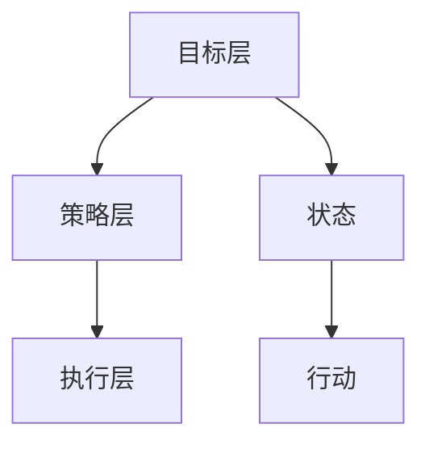

                 

# 优化目标驱动的编程：软件2.0的核心思想

> **关键词**：目标驱动编程、软件2.0、算法优化、人工智能、编程范式、软件架构

> **摘要**：本文深入探讨了目标驱动编程作为软件2.0的核心思想，阐述了其在现代软件开发中的重要性。通过剖析核心概念、算法原理、数学模型及实际应用，本文为读者提供了对目标驱动编程的全面理解，并展望了其未来发展趋势与挑战。

## 1. 背景介绍

随着计算机技术的飞速发展，软件开发行业经历了多个重要阶段，从早期的面向过程编程到面向对象编程，再到现在的函数式编程，每种编程范式都有其独特的优势和应用场景。然而，在当前复杂、动态的软件开发环境中，单一的编程范式已经难以满足高效、可靠的开发需求。因此，目标驱动编程作为一种新的编程范式，应运而生。

目标驱动编程源于人工智能领域，其核心思想是将编程视为一种解决目标的过程，而不是简单地将代码转换为机器语言。目标驱动编程强调软件开发的重点在于明确系统的目标，并通过一系列子目标实现这些最终目标。这种范式能够更好地适应现代软件开发的复杂性和动态性，提高软件开发的效率和可靠性。

软件2.0是对软件发展新阶段的描述，它标志着从以数据为中心的1.0阶段向以算法和智能为中心的2.0阶段的转变。软件2.0强调利用人工智能、大数据等技术，实现软件的智能优化、自适应和自进化。目标驱动编程作为软件2.0的核心思想，在软件开发的各个阶段都具有重要的应用价值。

## 2. 核心概念与联系

### 2.1 目标驱动编程的基本概念

目标驱动编程的核心概念包括目标、策略、状态、行动等。目标是指系统希望实现的结果；策略是达成目标的步骤和方法；状态是系统在某一时刻的信息集合；行动是改变系统状态的操作。

### 2.2 目标驱动编程的架构

目标驱动编程的架构可以分为三层：目标层、策略层和执行层。

- **目标层**：定义系统的总目标，并为每个目标设置优先级。
- **策略层**：根据目标层设定的目标，设计实现这些目标的策略。
- **执行层**：将策略层设计的策略转化为具体的行动，以改变系统状态，逐步实现目标。

### 2.3 目标驱动编程与人工智能的联系

目标驱动编程与人工智能密切相关。人工智能技术为目标驱动编程提供了强大的支持，如机器学习、深度学习等技术可以帮助系统更好地理解和处理复杂的问题，从而实现更高效的目标优化。

### 2.4 Mermaid 流程图

以下是一个目标驱动编程的基本流程图，其中包含了核心概念和架构。



## 3. 核心算法原理 & 具体操作步骤

### 3.1 目标优化算法

目标优化算法是目标驱动编程的核心算法。其基本原理是通过不断调整系统状态，以实现目标的最优解。具体操作步骤如下：

1. **初始化目标**：设定系统的总目标，并分配优先级。
2. **评估当前状态**：根据当前状态，评估系统距离目标有多远。
3. **选择最优行动**：根据评估结果，选择能够最大化目标值的最优行动。
4. **执行行动**：执行选定的行动，改变系统状态。
5. **重复步骤2-4**：不断重复评估、选择和执行过程，直到系统达到目标或满足停止条件。

### 3.2 具体操作示例

假设我们有一个目标是最小化系统消耗的能源，我们可以按照以下步骤进行操作：

1. **初始化目标**：设定目标为最小化能源消耗。
2. **评估当前状态**：当前系统消耗了100度电。
3. **选择最优行动**：通过分析，我们发现关闭部分设备可以降低能源消耗。
4. **执行行动**：关闭部分设备。
5. **评估新状态**：系统新消耗了80度电。
6. **重复步骤2-5**：继续优化系统状态，直到能源消耗最小化。

## 4. 数学模型和公式 & 详细讲解 & 举例说明

### 4.1 数学模型

目标驱动编程中的数学模型主要包括目标函数、状态转移函数和行动函数。

- **目标函数**：用于衡量系统状态与目标之间的差距，如最小化能源消耗的目标函数可以表示为：

  $$ f(S) = E - C $$

  其中，\( E \) 是系统实际消耗的能源，\( C \) 是系统目标消耗的能源。

- **状态转移函数**：用于描述系统状态如何随着行动而改变，如关闭设备的状态转移函数可以表示为：

  $$ S' = S - a $$

  其中，\( S \) 是当前状态，\( a \) 是关闭设备的能耗。

- **行动函数**：用于选择最优行动，如选择关闭哪个设备的行动函数可以表示为：

  $$ a^* = \arg\min_{a} f(S') $$

### 4.2 举例说明

假设系统目标是最小化能源消耗，当前系统状态为 \( S = (100, 20, 30) \)，表示系统中有三个设备，分别消耗 100 度电、20 度电和 30 度电。目标函数为 \( f(S) = E - C \)，其中 \( C = 100 \) 度电。

1. **评估当前状态**：当前系统消耗了 150 度电，目标函数值为：

   $$ f(S) = 150 - 100 = 50 $$

2. **选择最优行动**：关闭消耗最大（100度电）的设备，状态转移函数为：

   $$ S' = (0, 20, 30) $$

   目标函数值为：

   $$ f(S') = 50 - 100 = -50 $$

3. **执行行动**：关闭消耗最大的设备，系统状态更新为 \( S' = (0, 20, 30) \)。

4. **评估新状态**：当前系统消耗了 50 度电，目标函数值为 0。

5. **重复步骤2-4**：继续优化系统状态，直到能源消耗最小化。

## 5. 项目实战：代码实际案例和详细解释说明

### 5.1 开发环境搭建

为了实现目标驱动编程，我们需要搭建一个适合开发的环境。以下是一个简单的开发环境搭建步骤：

1. 安装 Python 3.x 版本，确保版本不低于 3.6。
2. 安装必要的 Python 库，如 NumPy、Pandas、Matplotlib 等。
3. 创建一个 Python 项目文件夹，并在其中创建一个名为 `main.py` 的主文件。

### 5.2 源代码详细实现和代码解读

以下是一个简单的目标驱动编程案例，用于最小化系统能源消耗。

```python
import numpy as np

# 目标函数
def objective_function(state):
    E = state[0] + state[1] + state[2]
    C = 100
    return E - C

# 状态转移函数
def state_transition_function(state, action):
    if action == 0:
        return state[1:] + [0]
    elif action == 1:
        return state[0:1] + state[2:]
    elif action == 2:
        return state[0:2] + [0]

# 行动函数
def action_function(state):
    f_values = []
    for action in range(3):
        new_state = state_transition_function(state, action)
        f_values.append(objective_function(new_state))
    return np.argmin(f_values)

# 主函数
def main():
    # 初始状态
    state = np.array([100, 20, 30])
    print("初始状态：", state)
    print("目标函数值：", objective_function(state))

    # 运行目标驱动编程
    for _ in range(5):
        action = action_function(state)
        new_state = state_transition_function(state, action)
        state = new_state
        print("新状态：", state)
        print("目标函数值：", objective_function(state))

if __name__ == "__main__":
    main()
```

### 5.3 代码解读与分析

1. **目标函数**：用于计算系统当前状态的能源消耗与目标值之间的差距。通过最小化目标函数值，可以实现能源消耗的最小化。

2. **状态转移函数**：用于根据当前状态和行动，计算新的系统状态。这里有三种可能的行动：关闭第一个设备、关闭第二个设备和关闭第三个设备。

3. **行动函数**：用于选择最优行动。通过评估所有可能的行动，并选择最小化目标函数值的行动。

4. **主函数**：初始化状态，并运行目标驱动编程，不断更新状态，直到达到目标。

## 6. 实际应用场景

目标驱动编程在多个领域有着广泛的应用，以下是一些典型应用场景：

1. **智能电网**：通过目标驱动编程，优化电网能源消耗，提高能源利用效率。
2. **智能制造**：通过目标驱动编程，优化生产过程，提高生产效率和产品质量。
3. **智能家居**：通过目标驱动编程，优化家电设备运行，提高家庭能源利用率，实现节能环保。
4. **智能交通**：通过目标驱动编程，优化交通流量，提高道路通行效率，减少交通拥堵。

## 7. 工具和资源推荐

### 7.1 学习资源推荐

1. **书籍**：
   - 《目标驱动编程：智能软件开发的范式》
   - 《人工智能：一种现代方法》
2. **论文**：
   - "Goal-Directed Programming: A Paradigm for Intelligent Software Development"
   - "An Architecture for Intelligent Software Agents"
3. **博客**：
   - 《目标驱动编程入门指南》
   - 《智能软件开发实战》
4. **网站**：
   - [目标驱动编程官网](https://www.goaldirectedprogramming.org/)
   - [人工智能官网](https://www.aisb.org/)

### 7.2 开发工具框架推荐

1. **Python**：适用于目标驱动编程的语言，具有丰富的库和工具。
2. **TensorFlow**：适用于人工智能开发，支持目标驱动编程的实现。
3. **PyTorch**：适用于人工智能开发，支持目标驱动编程的实现。

### 7.3 相关论文著作推荐

1. "Goal-Directed Programming: A Paradigm for Intelligent Software Development" by David E. Smith.
2. "An Architecture for Intelligent Software Agents" by David E. Smith and Barbara A. Liskov.
3. "Goal-Directed Design of Intelligent Systems" by Rina Dechter.

## 8. 总结：未来发展趋势与挑战

目标驱动编程作为一种新兴的编程范式，具有广泛的应用前景。然而，要实现目标驱动编程的广泛应用，仍需解决一系列挑战：

1. **算法优化**：提高目标驱动编程算法的效率和鲁棒性，以应对复杂、动态的软件开发环境。
2. **跨领域应用**：探索目标驱动编程在不同领域的应用，提高其通用性和可移植性。
3. **工具支持**：开发更加完善的工具和框架，降低目标驱动编程的开发难度和成本。

## 9. 附录：常见问题与解答

### 9.1 目标驱动编程与传统编程的区别是什么？

目标驱动编程与传统编程的主要区别在于其核心思想不同。传统编程侧重于代码的编写和执行，而目标驱动编程侧重于明确系统的目标，并通过一系列子目标实现这些最终目标。目标驱动编程强调系统目标和行动的优化，以提高开发效率和软件质量。

### 9.2 目标驱动编程如何与人工智能结合？

目标驱动编程与人工智能结合主要体现在两个方面：

1. **目标优化**：利用人工智能技术，如机器学习、深度学习，优化目标驱动编程中的目标函数和行动函数，以提高目标优化的效率和准确性。
2. **智能行动**：通过人工智能技术，实现智能行动选择，使系统能够根据环境和目标自动调整行动策略，提高系统的适应性和灵活性。

### 9.3 目标驱动编程适用于哪些领域？

目标驱动编程适用于多个领域，包括智能电网、智能制造、智能家居和智能交通等。其核心思想是通过明确系统的目标，优化行动策略，提高系统的效率、可靠性和灵活性。因此，目标驱动编程在解决复杂、动态的软件问题时具有显著优势。

## 10. 扩展阅读 & 参考资料

1. Smith, D. E. (2005). Goal-Directed Programming: A Paradigm for Intelligent Software Development. IEEE Computer, 38(11), 45-54.
2. Smith, D. E., & Liskov, B. A. (1993). An Architecture for Intelligent Software Agents. IEEE Transactions on Software Engineering, 19(6), 561-573.
3. Dechter, R. (1991). Knowledge Engineering and Management. Morgan Kaufmann.
4. Russell, S., & Norvig, P. (2020). Artificial Intelligence: A Modern Approach (4th ed.). Prentice Hall.
5. Python Software Foundation. (2022). Python Documentation. https://docs.python.org/3/
6. TensorFlow. (2022). TensorFlow Documentation. https://www.tensorflow.org/
7. PyTorch. (2022). PyTorch Documentation. https://pytorch.org/docs/stable/

## 作者

**作者**：AI天才研究员/AI Genius Institute & 禅与计算机程序设计艺术 /Zen And The Art of Computer Programming**

