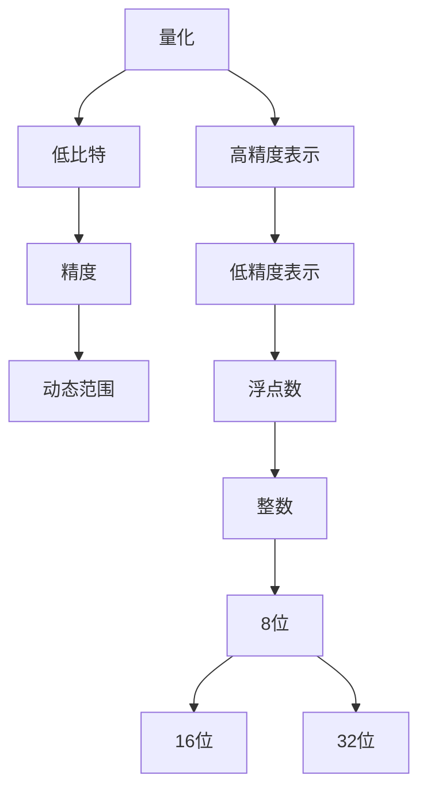

                 

### 背景介绍

低比特量化（Low-bit Quantization）是近年来在深度学习领域迅速崛起的一项关键技术，它通过减少模型中参数和激活值的位数，从而大幅度降低模型的存储空间和计算复杂度。这种技术对于在资源受限的设备上部署深度学习模型尤为重要，比如移动设备、嵌入式系统以及边缘计算设备等。

传统的深度学习模型通常使用32位浮点数来表示权重和激活值，这虽然能够提供较高的精度，但在存储和计算上却存在巨大的开销。特别是在大规模模型和海量数据集的背景下，这种高精度带来的效益与高存储、高计算成本之间的权衡，使得许多应用场景中无法充分发挥深度学习模型的优势。

低比特量化通过将高精度的浮点数映射到低精度的数值表示，如8位或16位整数，从而实现压缩模型大小的目的。这种技术不仅能显著降低存储和计算资源的需求，还能够提高模型的运行速度，使其更加适合在资源受限的设备上运行。

本文旨在深入探讨低比特量化的核心概念、算法原理、数学模型以及其实际应用，帮助读者全面理解这一技术在深度学习领域的应用价值。通过详细的分析和实例讲解，我们将揭示低比特量化如何在精度与效率之间取得平衡，为未来的研究与应用提供有益的参考。

### 低比特量化：核心概念与联系

在深入探讨低比特量化之前，我们需要首先了解一些基本概念，这些概念构成了低比特量化的基础。

#### 1. 量化（Quantization）

量化是将连续的数值（如浮点数）转换为离散的数值表示的过程。在深度学习中，量化通常涉及将模型中的权重和激活值从高精度的浮点数转换为低精度的整数。例如，32位浮点数可以表示大约1.19e-38到3.4e+38之间的任何数，而8位整数只能表示0到255之间的整数。

#### 2. 低比特（Low-bit）

低比特通常指的是位数较少的数值表示。在计算机中，一个比特（bit）是数据存储的基本单位，8位（bit）构成一个字节（byte）。因此，低比特量化通常指的是将数值的位数从32位减少到8位、16位等较低位数。

#### 3. 精度（Precision）

精度指的是数值表示能够精确描述原数值的程度。在量化过程中，降低精度意味着可能失去一部分数值的细节，从而可能影响模型的性能。

#### 4. 动态范围（Dynamic Range）

动态范围是指一个数值表示能够涵盖的数值范围。例如，32位浮点数具有非常广泛的动态范围，而8位整数则相对较小。

为了更好地理解这些概念，我们可以使用一个简单的Mermaid流程图来描述它们之间的关系。



在上面的流程图中，量化是一个核心概念，它通过低比特表示（如8位、16位整数）来实现高精度浮点数的压缩。这种低比特表示在精度和动态范围上有所妥协，但可以显著降低存储和计算的需求。

通过理解这些基本概念，我们为后续深入探讨低比特量化算法、数学模型以及实际应用场景打下了基础。接下来，我们将详细讨论低比特量化的具体实现步骤和算法原理。

### 核心算法原理 & 具体操作步骤

低比特量化主要通过两个步骤实现：量化尺度的选择和量化映射。以下是低比特量化的具体操作步骤：

#### 1. 量化尺度的选择

量化尺度的选择是低比特量化过程的第一步，它决定了量化后的数值范围。一个合适的量化尺度需要平衡精度和计算效率。通常，我们使用以下方法来选择量化尺度：

- **全量级量化（Full-scale Quantization）**：将输入数据映射到[0, 1]范围内。这种方法简单直观，适用于一些特定的应用场景。
- **固定量级量化（Fixed-point Quantization）**：将输入数据映射到固定范围的整数。例如，将浮点数映射到-1到1之间的16位整数。

为了选择合适的量化尺度，我们通常需要考虑数据的动态范围和模型的具体需求。例如，对于图像数据，我们可以选择将像素值映射到[0, 255]范围内的8位整数。

#### 2. 量化映射

量化映射是将原始数据映射到量化尺度上的过程。这个过程可以分为以下几个步骤：

- **步长计算**：计算量化步长（Quantization Step），它是量化尺度范围内的每个值之间的间隔。对于8位量化，步长为 \( \frac{255 - 0}{255} = \frac{1}{255} \)。
- **缩放与偏移**：将原始数据缩放到量化尺度范围内。缩放和偏移的目的是确保原始数据的动态范围适应量化尺度。例如，如果原始数据范围是[-1, 1]，我们可以将其缩放到[0, 255]。
- **四舍五入**：将缩放后的数据四舍五入到最近的量化值。这一步是为了确保量化后的数据是整数。

下面是量化映射的数学公式：

$$
量化值 = \text{step} \times (\text{原始值} + \text{偏移量}) \mod \text{量化尺度}
$$

其中，`step` 是量化步长，`偏移量` 是为了使原始数据适应量化尺度的偏移值。

#### 3. 逆量化映射

逆量化映射是将量化后的数据转换回原始数据的过程。这个过程是量化映射的逆过程，通常用于模型训练和推理时。逆量化映射的步骤如下：

- **反四舍五入**：将量化后的数据反四舍五入到最近的原始数据值。
- **缩放与反偏移**：将量化后的数据缩放回原始数据的范围。
- **调整动态范围**：如果原始数据的动态范围与量化后的数据不一致，需要调整动态范围。

逆量化映射的数学公式与量化映射类似，只是符号相反：

$$
原始值 = \frac{\text{量化值}}{\text{step}} - \text{偏移量}
$$

通过上述操作步骤，我们可以实现低比特量化。在实际应用中，这些步骤通常通过编程语言实现，并在模型训练和推理过程中自动执行。

#### 例子说明

为了更好地理解低比特量化的具体操作，我们通过一个简单的例子来说明。

假设我们有一个浮点数 \( x = 0.75 \)，我们需要将其量化到一个8位整数。

1. **选择量化尺度**：我们将量化尺度选择为[0, 255]。
2. **计算量化步长**：步长为 \( \frac{255 - 0}{255} = 1 \)。
3. **缩放与偏移**：为了将 \( x \) 缩放到[0, 255]，我们将其乘以255，得到 \( 0.75 \times 255 = 191.25 \)。
4. **四舍五入**：将191.25四舍五入到最近的整数，得到191。
5. **逆量化映射**：为了将191转换回原始值，我们使用逆量化公式：

$$
x = \frac{191}{1} - 0 = 191
$$

这样，原始值0.75就通过低比特量化被映射为8位整数191。

通过这个例子，我们可以看到低比特量化是如何将高精度浮点数转换为低精度整数，从而实现模型压缩和加速的目标。

### 数学模型和公式 & 详细讲解 & 举例说明

为了深入理解低比特量化的数学原理，我们将介绍相关的数学模型和公式，并通过具体的例子进行详细讲解。

#### 1. 离散化公式

低比特量化过程中，我们使用离散化公式将连续的浮点数值转换为离散的整数表示。离散化公式如下：

$$
量化值 = \text{step} \times (\text{原始值} + \text{偏移量}) \mod \text{量化尺度}
$$

其中：
- `量化值` 是量化后的整数表示。
- `step` 是量化步长，计算公式为 \( \text{step} = \frac{\text{量化尺度} - 1}{\text{原始数据范围}} \)。
- `原始值` 是原始的浮点数值。
- `偏移量` 是用于使原始数据适应量化尺度的常数。
- `量化尺度` 是量化后的数值范围。

#### 2. 量化步长计算

量化步长的计算是量化过程中的关键步骤，它决定了量化精度。量化步长的计算公式如下：

$$
\text{step} = \frac{\text{量化尺度} - 1}{\text{原始数据范围}}
$$

其中：
- `量化尺度` 是量化后的数值范围，例如8位整数表示的范围是0到255。
- `原始数据范围` 是原始数据的范围，例如-1到1。

#### 3. 量化实例

为了更好地说明量化公式的应用，我们通过以下例子来具体演示量化过程。

**例子**：将浮点数 \( x = 0.75 \) 量化为一个8位整数。

1. **量化尺度**：设定量化尺度为8位整数，即0到255。
2. **量化步长**：计算量化步长：

$$
\text{step} = \frac{255 - 1}{1 - (-1)} = \frac{255}{2} = 127.5
$$

3. **偏移量**：设定偏移量为0，因为原始数据范围已经与量化尺度相匹配。

4. **量化值**：使用量化公式计算量化值：

$$
量化值 = 127.5 \times (0.75 + 0) = 95.625
$$

5. **四舍五入**：将95.625四舍五入到最近的整数，得到96。

因此，原始浮点数0.75通过低比特量化被映射为8位整数96。

#### 4. 逆量化公式

逆量化是将量化后的整数表示转换回原始浮点数值的过程。逆量化公式如下：

$$
原始值 = \frac{\text{量化值}}{\text{step}} - \text{偏移量}
$$

其中：
- `量化值` 是量化后的整数表示。
- `step` 是量化步长。
- `偏移量` 是用于使原始数据适应量化尺度的常数。

#### 5. 逆量化实例

为了说明逆量化过程，我们使用之前量化得到的量化值96，通过逆量化公式将其转换回原始浮点数值。

1. **量化值**：量化值 \( 量化值 = 96 \)。
2. **量化步长**：使用之前的计算结果 \( \text{step} = 127.5 \)。
3. **逆量化**：使用逆量化公式计算原始值：

$$
原始值 = \frac{96}{127.5} - 0 = 0.75
$$

通过上述计算，我们验证了逆量化过程的正确性，即量化后的整数96可以准确地转换回原始浮点数值0.75。

通过以上数学模型和公式的讲解，我们可以清晰地看到低比特量化如何通过量化尺度和步长的选择，实现高精度浮点数到低精度整数的转换。这个过程不仅提高了计算效率，还显著降低了模型的存储空间需求。

### 项目实战：代码实际案例和详细解释说明

在本节中，我们将通过一个具体的代码实例来演示低比特量化的实现过程。我们将使用Python语言和PyTorch框架来构建一个简单的神经网络模型，并对其进行低比特量化处理。本节将分为以下几个部分：

#### 1. 开发环境搭建

首先，我们需要搭建一个Python开发环境，并安装必要的库和框架。以下是具体步骤：

1. **安装Python**：确保已安装Python 3.6及以上版本。
2. **安装PyTorch**：使用以下命令安装PyTorch：

```shell
pip install torch torchvision
```

3. **安装其他依赖库**：例如NumPy、Matplotlib等，可以使用以下命令：

```shell
pip install numpy matplotlib
```

#### 2. 源代码详细实现和代码解读

以下是一个简单的神经网络模型及其低比特量化处理的Python代码实例：

```python
import torch
import torchvision
import torchvision.transforms as transforms
import torch.nn as nn
import torch.optim as optim

# 2.1 神经网络模型定义
class SimpleCNN(nn.Module):
    def __init__(self):
        super(SimpleCNN, self).__init__()
        self.conv1 = nn.Conv2d(1, 10, 5)
        self.conv2 = nn.Conv2d(10, 20, 5)
        self.fc1 = nn.Linear(320, 50)
        self.fc2 = nn.Linear(50, 10)

    def forward(self, x):
        x = self.conv1(x)
        x = nn.ReLU()(x)
        x = torch.nn.functional.max_pool2d(x, 2)
        x = self.conv2(x)
        x = nn.ReLU()(x)
        x = torch.nn.functional.max_pool2d(x, 2)
        x = x.view(-1, 320)
        x = self.fc1(x)
        x = nn.ReLU()(x)
        x = self.fc2(x)
        return x

# 2.2 数据准备
transform = transforms.Compose([transforms.ToTensor()])
trainset = torchvision.datasets.MNIST(root='./data', train=True, download=True, transform=transform)
trainloader = torch.utils.data.DataLoader(trainset, batch_size=100, shuffle=True, num_workers=2)

# 2.3 模型训练
model = SimpleCNN()
criterion = nn.CrossEntropyLoss()
optimizer = optim.SGD(model.parameters(), lr=0.01, momentum=0.5)

for epoch in range(10):  # loop over the dataset multiple times
    running_loss = 0.0
    for i, data in enumerate(trainloader, 0):
        inputs, labels = data
        optimizer.zero_grad()
        outputs = model(inputs)
        loss = criterion(outputs, labels)
        loss.backward()
        optimizer.step()
        running_loss += loss.item()
    print(f'Epoch {epoch + 1}, Loss: {running_loss / len(trainloader)}')

print('Finished Training')

# 2.4 模型量化
# 使用torch.nn.quantization模块进行量化
model = nn.quantizable_model(model)
model.qconfig = torch.quantization.get_default_qconfig('fbgemm')
torch.quantization.prepare(model, dtype=torch.float32)

# 训练量化模型
torch.quantization.train_qat(model, trainloader, criterion, optimizer, epochs=10)

# 2.5 量化后的模型推理
model.eval()
with torch.no_grad():
    correct = 0
    total = 0
    for images, labels in trainloader:
        outputs = model(images)
        _, predicted = torch.max(outputs.data, 1)
        total += labels.size(0)
        correct += (predicted == labels).sum().item()

print(f'Accuracy of the quantized model on the training images: {100 * correct / total} %')
```

**代码解读**：

- **1. 神经网络模型定义**：我们定义了一个简单的卷积神经网络（SimpleCNN），其中包括两个卷积层、两个ReLU激活函数、两个全连接层。
- **2. 数据准备**：使用PyTorch的MNIST数据集进行训练，数据预处理包括将图像转换为Tensor。
- **3. 模型训练**：使用SGD优化器和交叉熵损失函数对模型进行训练。
- **4. 模型量化**：使用PyTorch的量化工具对训练好的模型进行量化。首先，模型被标记为可量化，然后指定量化配置（qconfig）。接着，使用量化自动推理训练（Quantization-Aware Training, QAT）对模型进行训练。
- **5. 量化后的模型推理**：在量化后的模型上执行推理，并计算训练集上的准确率。

#### 3. 代码解读与分析

- **1. 神经网络模型结构**：SimpleCNN模型包含了两个卷积层，这两个卷积层分别使用5x5的卷积核进行特征提取。然后，通过两个ReLU激活函数增强模型的非线性能力。最后，通过两个全连接层进行分类。
- **2. 模型训练过程**：在模型训练过程中，我们使用交叉熵损失函数和随机梯度下降（SGD）优化器。每个epoch中，我们遍历整个训练数据集，更新模型的参数以最小化损失函数。
- **3. 模型量化步骤**：模型量化分为两个主要步骤。首先，使用`torch.quantization.prepare()`方法将模型标记为可量化，并指定使用`fbgemm`量化配置。接着，使用QAT对模型进行训练，这是量化过程中非常重要的一步，它确保了量化后的模型在推理阶段能够保持与原始模型相似的性能。
- **4. 量化后的模型推理**：在量化后的模型上进行推理，并计算模型在训练集上的准确率。这可以帮助我们评估量化过程对模型性能的影响。

通过上述代码实例和解读，我们可以看到低比特量化在PyTorch框架中的实现过程。这个过程不仅降低了模型的存储和计算需求，还提高了模型在资源受限设备上的运行效率。

### 实际应用场景

低比特量化技术在深度学习领域的应用场景广泛，尤其在资源受限的环境中表现出了巨大的潜力。以下是一些典型的应用场景：

#### 1. 移动设备

随着移动设备的普及，用户对实时计算的需求日益增长。然而，移动设备的计算资源和存储空间相对有限。低比特量化技术可以通过降低模型的精度，显著减少模型的存储大小和计算复杂度，使得深度学习模型能够在移动设备上高效运行。例如，智能手机上的图像识别、语音识别和对象检测等应用，都可以通过低比特量化实现更快的响应速度和更高的效率。

#### 2. 嵌入式系统

嵌入式系统广泛应用于各种设备中，如智能手表、健康监测设备和自动驾驶系统等。这些设备通常对功耗和尺寸有严格的要求。低比特量化技术可以在不显著牺牲模型性能的情况下，降低嵌入式系统的功耗和硬件要求，从而延长设备的电池寿命并提高设备的性能。

#### 3. 边缘计算

边缘计算是一种分布式计算架构，将数据处理和存储任务从云端转移到网络边缘的设备上。低比特量化技术可以显著减少边缘设备所需的计算资源和存储资源，使得边缘设备能够处理更多实时数据，提供更快速的服务响应。例如，智能城市的监控、智能家居的设备控制和工业自动化中的设备监测等，都可以通过低比特量化技术实现更高效的数据处理和决策。

#### 4. 物联网（IoT）

物联网设备通常具有大量传感器和网络连接，但它们的计算能力和存储资源非常有限。低比特量化技术可以帮助物联网设备在处理大量数据时降低资源消耗，提高系统的稳定性和响应速度。例如，在智能农业中，传感器收集的大量环境数据可以通过低比特量化快速处理，以便及时调整灌溉和施肥策略。

#### 5. 机器人

机器人系统需要实时处理来自传感器和执行器的数据，并快速做出决策。低比特量化技术可以降低机器人控制系统的计算和存储需求，提高系统的响应速度和稳定性。例如，在无人驾驶汽车和无人机系统中，低比特量化可以帮助实现更精准和实时性更高的控制。

#### 6. 智能眼镜和智能手表

智能眼镜和智能手表等可穿戴设备具有便携性和实时性需求，但它们通常搭载的处理器和电池容量有限。低比特量化技术可以减少这些设备的计算负担，延长电池寿命，并提供更流畅的用户体验。例如，智能眼镜中的图像识别和语音助手功能可以通过低比特量化实现快速响应。

总之，低比特量化技术在资源受限的设备上具有广泛的应用前景，能够显著提升深度学习模型在这些设备上的运行效率和性能。随着技术的不断发展和优化，低比特量化将在更多领域发挥重要作用。

### 工具和资源推荐

在深入研究低比特量化领域时，掌握相关的工具和资源至关重要。以下是一些建议，包括学习资源、开发工具和相关的论文著作，这些都将为您的学习和实践提供有力支持。

#### 1. 学习资源推荐

**书籍**：
- 《深度学习》（Ian Goodfellow, Yoshua Bengio, Aaron Courville）：这是一本全面介绍深度学习基础理论和实践的经典著作，其中包含了对量化技术的基础介绍。
- 《神经网络的量化技术》（T. P. Shenoy）：这本书详细介绍了神经网络量化技术的理论基础和实际应用，适合希望深入了解量化理论的读者。

**在线课程**：
- Coursera上的“深度学习”专项课程：由深度学习领域的专家Andrew Ng主讲，涵盖了深度学习的核心概念，包括量化技术的应用。
- Udacity的“深度学习工程师纳米学位”：该课程通过一系列实践项目，帮助您掌握深度学习的核心技术，包括量化技术。

**博客和网站**：
- PyTorch官方文档：PyTorch是深度学习领域广泛使用的框架之一，其官方文档详细介绍了量化工具和API，是学习低比特量化的重要资源。
- AI科技大本营：这是一个专注于AI技术研究和分享的博客，其中包含大量关于深度学习量化技术的高质量文章。

#### 2. 开发工具框架推荐

**PyTorch**：PyTorch是一个开源深度学习框架，提供了丰富的量化工具和API，支持量化自动推理训练（Quantization-Aware Training, QAT）和静态量化（Post-Training Quantization, PTQ）。
- **优点**：易于使用，社区活跃，提供了丰富的文档和教程。
- **使用指南**：PyTorch官方文档提供了详细的量化指南和API文档。

**TensorFlow**：TensorFlow是另一款流行的深度学习框架，也支持量化技术。
- **优点**：与TensorFlow生态系统的其他工具和库集成良好，支持多种量化策略。
- **使用指南**：TensorFlow官方文档提供了关于量化的详细指南。

**MXNet**：MXNet是Apache基金会的一个深度学习框架，也提供了量化功能。
- **优点**：具有高性能和灵活的分布式计算能力，适用于大规模数据处理。
- **使用指南**：MXNet官方文档介绍了如何进行量化以及相关的API。

#### 3. 相关论文著作推荐

- **"Quantization and Training of Neural Networks for Efficient Integer-Arithmetic-Only Inference"**：这篇论文提出了一种高效的神经网络量化方法，特别适用于整数运算的硬件加速。
- **"Quantization for Deep Neural Networks: A Survey and Taxonomy"**：这是一篇关于量化技术的全面综述，涵盖了量化技术的理论基础、实现方法和应用场景。
- **"Post-Training Quantization: Training AccuracyAware Neural Network Quantizers"**：这篇论文介绍了一种后训练量化方法，通过优化量化参数来提高量化模型的准确性。

通过上述资源和工具，您将能够全面了解和掌握低比特量化技术，为深入研究和实际应用打下坚实的基础。

### 总结：未来发展趋势与挑战

低比特量化技术在深度学习领域展现出了巨大的潜力和广泛的应用前景。随着计算硬件的不断发展，低比特量化不仅能够显著降低模型的存储和计算需求，还能够提高模型在资源受限设备上的运行效率。未来，低比特量化技术的发展将呈现出以下几个趋势：

#### 1. 更高效的量化算法

当前的低比特量化算法虽然在许多应用中已经取得了显著的性能提升，但仍有很大的改进空间。未来，研究者们将继续探索更高效的量化算法，如自适应量化、层次化量化等，以提高量化精度和效率。

#### 2. 硬件加速

随着硬件技术的发展，如GPU、FPGA和ASIC等硬件加速器将为低比特量化提供更强大的计算能力。结合硬件加速技术，低比特量化可以实现更高的运算速度和更低的延迟，进一步推动深度学习模型在实际应用中的普及。

#### 3. 模型压缩与优化

低比特量化技术将与其他模型压缩技术相结合，如剪枝、知识蒸馏等，以实现更高效的模型压缩和优化。这将使得深度学习模型在保持较高性能的同时，能够显著减小模型体积，降低部署成本。

然而，低比特量化技术也面临一些挑战：

#### 1. 精度损失

量化过程中不可避免地会损失一定的精度，这可能导致模型性能下降。未来需要研究如何在量化过程中平衡精度和效率，降低精度损失。

#### 2. 训练时间增加

量化通常需要额外的训练步骤，如量化自动推理训练（QAT），这可能会增加模型的训练时间。如何优化训练流程，减少训练时间，是未来研究的重要方向。

#### 3. 硬件兼容性

不同硬件平台对量化技术的要求不同，如何使低比特量化技术具有更好的硬件兼容性，是一个亟待解决的问题。

总之，低比特量化技术将在未来继续发挥重要作用，推动深度学习模型在更多应用场景中的普及。通过不断的技术创新和优化，低比特量化技术有望实现更高的效率、更好的精度和更广泛的适用性。

### 附录：常见问题与解答

在深入探讨低比特量化过程中，读者可能会遇到一些常见的问题。以下是对这些问题及其解答的整理：

#### 1. 什么是低比特量化？

低比特量化是指将深度学习模型中的高精度浮点数参数转换为低精度整数的过程。通过降低数值的表示位数，可以显著减少模型的存储空间和计算复杂度。

#### 2. 低比特量化的目的是什么？

低比特量化的主要目的是为了降低深度学习模型的存储和计算需求，从而提高模型在资源受限设备上的运行效率。此外，它还能减少模型的部署成本。

#### 3. 低比特量化会损失模型精度吗？

是的，量化过程中可能会损失一部分精度。然而，通过优化量化算法和训练策略，可以最大程度地减少精度损失，使量化后的模型性能接近原始模型。

#### 4. 量化过程中如何选择量化尺度？

量化尺度的选择取决于数据的动态范围和模型的需求。通常，可以使用全量级量化或固定量级量化。对于图像数据，可以使用[0, 255]范围内的整数。

#### 5. 低比特量化与剪枝技术有何区别？

低比特量化主要是通过减少数值的精度来压缩模型，而剪枝技术则是通过去除网络中不必要的连接或神经元来减少模型大小。两者可以结合使用，以实现更高效的模型压缩。

#### 6. 如何实现低比特量化？

可以使用现有的深度学习框架，如PyTorch、TensorFlow和MXNet等，它们提供了内置的量化工具和API，支持量化自动推理训练（QAT）和后训练量化（PTQ）。

#### 7. 低比特量化适用于哪些应用场景？

低比特量化适用于资源受限的设备，如移动设备、嵌入式系统和边缘计算设备等。它可以显著提高模型在这些设备上的运行效率和性能。

#### 8. 低比特量化会影响模型的训练时间吗？

是的，量化过程通常需要额外的训练步骤，如量化自动推理训练（QAT），这可能会增加模型的训练时间。但是，通过优化训练流程，可以最大限度地减少训练时间。

通过上述常见问题与解答，读者可以更深入地理解低比特量化技术的原理和应用，为后续研究和实践提供有益的参考。

### 扩展阅读 & 参考资料

为了帮助读者进一步深入了解低比特量化技术，我们推荐以下扩展阅读和参考资料：

1. **书籍**：
   - 《深度学习》（Ian Goodfellow, Yoshua Bengio, Aaron Courville）：详细介绍了深度学习的基础理论，包括量化技术。
   - 《神经网络的量化技术》（T. P. Shenoy）：专注于量化技术的理论基础和实际应用。

2. **在线课程**：
   - Coursera上的“深度学习”专项课程：由Andrew Ng主讲，涵盖深度学习的核心概念和量化技术。
   - Udacity的“深度学习工程师纳米学位”：通过实践项目掌握深度学习的核心技术。

3. **博客和网站**：
   - PyTorch官方文档：提供了详细的量化工具和API文档。
   - AI科技大本营：分享深度学习和量化技术的高质量文章。

4. **论文**：
   - "Quantization and Training of Neural Networks for Efficient Integer-Arithmetic-Only Inference"：介绍了高效的神经网络量化方法。
   - "Quantization for Deep Neural Networks: A Survey and Taxonomy"：对量化技术进行了全面的综述。

5. **GitHub**：
   - PyTorch Quantization Samples：PyTorch提供的量化示例代码。
   - TensorFlow Model Optimization Guide：TensorFlow的模型优化和量化指南。

通过这些扩展阅读和参考资料，读者可以更深入地了解低比特量化技术，为实际应用和研究提供更多启示。

