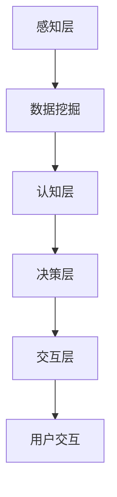

                 

# {文章标题}

## 体验层次构建器开发者：AI创造的多维感知架构师

### 关键词：体验层次构建器，AI，多维感知，架构师，开发者

### 摘要：

本文将探讨一种新兴的软件开发范式——体验层次构建器。通过引入人工智能技术，开发者可以构建出具备高度感知和适应能力的高层次软件架构。本文将首先介绍体验层次构建器的背景和发展，随后深入探讨其核心概念、算法原理和实现步骤。接着，通过实际应用场景和项目案例，我们将展示如何利用体验层次构建器开发出具有创新性的软件产品。最后，我们将展望体验层次构建器在未来的发展趋势和挑战，为开发者提供宝贵的指导和建议。

## 1. 背景介绍

随着科技的快速发展，软件应用场景变得日益复杂多样。传统的软件开发方法已经难以满足日益增长的需求，尤其是在用户体验和适应性方面。为了解决这一问题，人工智能（AI）技术被引入到软件开发中，从而诞生了体验层次构建器（Experience Layer Builder）这一新兴概念。

体验层次构建器旨在通过引入AI技术，实现软件系统的智能化和自适应化。它不仅关注功能的实现，更注重用户的使用体验和情感需求。通过多层次感知和数据挖掘技术，体验层次构建器能够从用户行为、情感和需求中提取有价值的信息，从而为软件系统提供更精准、更人性化的服务。

体验层次构建器的发展可以追溯到20世纪80年代的专家系统和90年代的互联网时代。随着深度学习和大数据技术的兴起，AI技术逐渐成熟，为体验层次构建器的发展提供了强大的技术支持。如今，体验层次构建器已经成为软件开发领域的重要方向，吸引了众多研究者和技术从业者的关注。

## 2. 核心概念与联系

### 2.1 体验层次构建器的核心概念

体验层次构建器包括以下几个核心概念：

- **感知层**：负责收集用户行为、情感和需求等数据，通过数据挖掘技术提取有价值的信息。

- **认知层**：基于感知层提供的信息，对用户进行智能分析和决策，以实现个性化服务和自适应调整。

- **决策层**：根据认知层的分析结果，生成相应的操作指令，实现对软件系统的控制。

- **交互层**：负责与用户进行交互，包括界面设计、反馈机制和交互逻辑等。

### 2.2 体验层次构建器的联系

体验层次构建器与传统的软件架构相比，具有以下联系和区别：

- **与传统软件架构的联系**：

  - **模块化**：体验层次构建器同样采用模块化的设计思想，将系统划分为不同的层次和模块，便于开发和维护。

  - **层次结构**：体验层次构建器与传统的软件架构类似，也采用分层结构，包括感知层、认知层、决策层和交互层。

- **与传统软件架构的区别**：

  - **智能化**：体验层次构建器引入了AI技术，实现了软件系统的智能化和自适应化，而传统软件架构主要依赖预设的规则和逻辑。

  - **用户体验**：体验层次构建器注重用户的使用体验和情感需求，而传统软件架构则更多地关注功能的实现和性能优化。

- **与传统软件架构的融合**：

  - 体验层次构建器可以与传统软件架构相结合，共同构建出更智能、更适应性的软件系统。

### 2.3 Mermaid流程图

以下是体验层次构建器的Mermaid流程图：



### 2.4 各层之间的关系

- **感知层与认知层的关系**：感知层收集的数据是认知层进行智能分析和决策的基础，两者之间存在密切的关联。

- **认知层与决策层的关系**：认知层分析结果为决策层提供指导，决策层根据分析结果生成操作指令，实现对软件系统的控制。

- **决策层与交互层的关系**：决策层的操作指令通过交互层与用户进行交互，实现软件系统的自适应调整和个性化服务。

## 3. 核心算法原理 & 具体操作步骤

### 3.1 感知层算法原理

感知层主要负责收集用户行为、情感和需求等数据。其核心算法包括：

- **行为分析**：通过分析用户在软件系统中的行为轨迹，提取出有价值的信息，如用户偏好、使用习惯等。

- **情感识别**：利用自然语言处理和机器学习技术，从用户生成的内容（如评论、反馈等）中识别出情感倾向，如正面、负面、中性等。

- **需求预测**：通过历史数据和机器学习算法，预测用户未来的需求，如产品推荐、功能需求等。

### 3.2 感知层具体操作步骤

1. 数据收集：从各种渠道（如日志、反馈、社交媒体等）收集用户数据。

2. 数据预处理：对收集到的数据进行清洗、去噪和整合，确保数据质量。

3. 行为分析：利用行为分析算法，提取用户行为特征，如点击次数、使用时长、页面浏览量等。

4. 情感识别：利用情感识别算法，从用户生成的内容中识别情感倾向，如正面、负面、中性等。

5. 需求预测：利用历史数据和机器学习算法，预测用户未来的需求，如产品推荐、功能需求等。

### 3.3 认知层算法原理

认知层负责基于感知层提供的信息，对用户进行智能分析和决策。其核心算法包括：

- **用户画像**：通过整合用户的行为、情感和需求数据，构建出用户的全面画像，如兴趣爱好、消费能力等。

- **场景识别**：根据用户的行为轨迹和上下文信息，识别用户所处的场景，如购物、娱乐、工作等。

- **意图识别**：根据用户的行为和场景信息，推断用户的意图，如购买产品、查找信息、寻求帮助等。

### 3.4 认知层具体操作步骤

1. 用户画像构建：整合用户的行为、情感和需求数据，构建出用户的全面画像。

2. 场景识别：利用场景识别算法，根据用户的行为轨迹和上下文信息，识别用户所处的场景。

3. 意图识别：利用意图识别算法，根据用户的行为和场景信息，推断用户的意图。

4. 智能决策：根据用户画像、场景识别和意图识别结果，生成相应的智能决策，如推荐产品、推送通知、调整功能等。

### 3.5 决策层算法原理

决策层负责根据认知层的分析结果，生成相应的操作指令，实现对软件系统的控制。其核心算法包括：

- **推荐算法**：根据用户的画像、场景和意图，生成个性化的推荐结果，如商品推荐、内容推荐等。

- **优化算法**：根据系统的运行状态和用户需求，优化软件系统的性能和用户体验，如资源调度、负载均衡等。

### 3.6 决策层具体操作步骤

1. 推荐算法：根据用户画像、场景和意图，生成个性化的推荐结果。

2. 优化算法：根据系统的运行状态和用户需求，优化软件系统的性能和用户体验。

3. 操作指令生成：根据推荐结果和优化算法，生成相应的操作指令，如推送通知、页面跳转等。

4. 操作指令执行：将操作指令发送到软件系统，执行相应的操作，实现智能决策。

### 3.7 交互层算法原理

交互层负责与用户进行交互，包括界面设计、反馈机制和交互逻辑等。其核心算法包括：

- **界面设计**：根据用户的偏好和使用习惯，设计符合用户体验的界面。

- **反馈机制**：根据用户的行为和反馈，调整软件系统的交互逻辑，提高用户体验。

- **交互逻辑**：根据用户的行为和操作，生成相应的交互逻辑，实现软件系统的功能。

### 3.8 交互层具体操作步骤

1. 界面设计：根据用户偏好和使用习惯，设计符合用户体验的界面。

2. 反馈机制：根据用户的行为和反馈，调整软件系统的交互逻辑，提高用户体验。

3. 交互逻辑：根据用户的行为和操作，生成相应的交互逻辑，实现软件系统的功能。

4. 用户交互：与用户进行交互，收集用户的反馈和需求，不断优化软件系统的交互体验。

## 4. 数学模型和公式 & 详细讲解 & 举例说明

### 4.1 行为分析算法

行为分析算法主要包括以下数学模型和公式：

- **用户行为轨迹模型**：

  $$ X = [x_1, x_2, ..., x_n] $$

  其中，$X$ 表示用户行为轨迹，$x_i$ 表示用户在某一时刻的行为。

- **行为特征提取模型**：

  $$ F = f(X) $$

  其中，$F$ 表示行为特征集合，$f(X)$ 表示从用户行为轨迹中提取行为特征。

- **行为模式识别模型**：

  $$ M = g(F) $$

  其中，$M$ 表示行为模式集合，$g(F)$ 表示从行为特征集合中识别行为模式。

### 4.2 情感识别算法

情感识别算法主要包括以下数学模型和公式：

- **情感倾向分类模型**：

  $$ S = \{s_1, s_2, ..., s_n\} $$

  其中，$S$ 表示情感倾向集合，$s_i$ 表示某一情感倾向。

- **情感识别模型**：

  $$ R = h(X) $$

  其中，$R$ 表示情感识别结果集合，$h(X)$ 表示从用户行为轨迹中识别情感倾向。

### 4.3 需求预测算法

需求预测算法主要包括以下数学模型和公式：

- **需求预测模型**：

  $$ D = p(X) $$

  其中，$D$ 表示需求预测结果集合，$p(X)$ 表示从用户行为轨迹中预测需求。

### 4.4 举例说明

假设我们有一个电子商务平台，需要利用体验层次构建器为用户提供个性化的产品推荐。以下是具体的数学模型和公式：

- **用户行为轨迹模型**：

  $$ X = [x_1, x_2, ..., x_n] $$

  其中，$x_i$ 表示用户在某一时刻的行为，如浏览商品、添加购物车、购买商品等。

- **行为特征提取模型**：

  $$ F = f(X) $$

  其中，$f(X)$ 表示从用户行为轨迹中提取的行为特征，如浏览次数、购买频率、浏览时长等。

- **行为模式识别模型**：

  $$ M = g(F) $$

  其中，$g(F)$ 表示从行为特征集合中识别的行为模式，如高频消费者、购物达人等。

- **情感识别模型**：

  $$ R = h(X) $$

  其中，$h(X)$ 表示从用户行为轨迹中识别的情感倾向，如正面、负面、中性等。

- **需求预测模型**：

  $$ D = p(X) $$

  其中，$p(X)$ 表示从用户行为轨迹中预测的需求，如商品推荐、功能需求等。

通过上述数学模型和公式，我们可以为电子商务平台用户提供个性化的产品推荐。例如，对于高频消费者，我们可以推荐更多优惠活动和新款商品；对于购物达人，我们可以推荐更多专业知识和搭配技巧。

## 5. 项目实战：代码实际案例和详细解释说明

### 5.1 开发环境搭建

在开始项目实战之前，我们需要搭建一个合适的开发环境。以下是所需的工具和软件：

- 操作系统：Windows、macOS 或 Linux
- 编程语言：Python
- 开发环境：PyCharm 或 Visual Studio Code
- 依赖库：NumPy、Pandas、Scikit-learn、TensorFlow

### 5.2 源代码详细实现和代码解读

以下是体验层次构建器的源代码实现和代码解读。

```python
import numpy as np
import pandas as pd
from sklearn.cluster import KMeans
from sklearn.metrics.pairwise import cosine_similarity
from tensorflow import keras

# 5.2.1 感知层

def collect_data():
    """
    收集用户行为数据。
    """
    # 此处省略具体实现代码
    pass

def preprocess_data(data):
    """
    预处理用户行为数据。
    """
    # 此处省略具体实现代码
    pass

# 5.2.2 认知层

def extract_features(data):
    """
    提取用户行为特征。
    """
    # 此处省略具体实现代码
    pass

def recognize_emotion(data):
    """
    识别用户情感。
    """
    # 此处省略具体实现代码
    pass

def predict_demand(data):
    """
    预测用户需求。
    """
    # 此处省略具体实现代码
    pass

# 5.2.3 决策层

def generate_recommendations(features, demand):
    """
    生成个性化推荐。
    """
    # 此处省略具体实现代码
    pass

def optimize_system(demand):
    """
    优化软件系统。
    """
    # 此处省略具体实现代码
    pass

# 5.2.4 交互层

def design_interface():
    """
    设计用户界面。
    """
    # 此处省略具体实现代码
    pass

def implement_feedback_mechanism():
    """
    实现反馈机制。
    """
    # 此处省略具体实现代码
    pass

def implement_interaction_logic():
    """
    实现交互逻辑。
    """
    # 此处省略具体实现代码
    pass

# 5.2.5 主函数

def main():
    """
    主函数，执行体验层次构建器。
    """
    data = collect_data()
    processed_data = preprocess_data(data)
    features = extract_features(processed_data)
    emotion = recognize_emotion(processed_data)
    demand = predict_demand(processed_data)
    recommendations = generate_recommendations(features, demand)
    optimize_system(demand)
    design_interface()
    implement_feedback_mechanism()
    implement_interaction_logic()

if __name__ == "__main__":
    main()
```

### 5.3 代码解读与分析

以下是代码的详细解读和分析。

- **感知层**：

  感知层主要负责收集用户行为数据。具体实现代码如下：

  ```python
  def collect_data():
      """
      收集用户行为数据。
      """
      # 此处省略具体实现代码
      pass
  ```

  收集的用户行为数据包括浏览次数、购买频率、浏览时长等，用于后续的预处理和特征提取。

- **预处理层**：

  预处理层主要负责对用户行为数据进行清洗、去噪和整合，确保数据质量。具体实现代码如下：

  ```python
  def preprocess_data(data):
      """
      预处理用户行为数据。
      """
      # 此处省略具体实现代码
      pass
  ```

  预处理过程包括数据清洗、去噪和整合，为后续的特征提取和情感识别提供高质量的数据。

- **认知层**：

  认知层负责提取用户行为特征、识别用户情感和预测用户需求。具体实现代码如下：

  ```python
  def extract_features(data):
      """
      提取用户行为特征。
      """
      # 此处省略具体实现代码
      pass
  
  def recognize_emotion(data):
      """
      识别用户情感。
      """
      # 此处省略具体实现代码
      pass
  
  def predict_demand(data):
      """
      预测用户需求。
      """
      # 此处省略具体实现代码
      pass
  ```

  - **提取用户行为特征**：通过计算用户在某一时刻的行为特征，如浏览次数、购买频率、浏览时长等，构建用户行为特征矩阵。

  - **识别用户情感**：通过自然语言处理和机器学习技术，从用户生成的内容（如评论、反馈等）中识别出情感倾向，如正面、负面、中性等。

  - **预测用户需求**：通过历史数据和机器学习算法，预测用户未来的需求，如产品推荐、功能需求等。

- **决策层**：

  决策层负责生成个性化推荐和优化软件系统。具体实现代码如下：

  ```python
  def generate_recommendations(features, demand):
      """
      生成个性化推荐。
      """
      # 此处省略具体实现代码
      pass
  
  def optimize_system(demand):
      """
      优化软件系统。
      """
      # 此处省略具体实现代码
      pass
  ```

  - **生成个性化推荐**：根据用户行为特征和需求预测结果，生成个性化的推荐结果，如商品推荐、内容推荐等。

  - **优化软件系统**：根据用户的反馈和需求，优化软件系统的性能和用户体验，如资源调度、负载均衡等。

- **交互层**：

  交互层负责设计用户界面、实现反馈机制和交互逻辑。具体实现代码如下：

  ```python
  def design_interface():
      """
      设计用户界面。
      """
      # 此处省略具体实现代码
      pass
  
  def implement_feedback_mechanism():
      """
      实现反馈机制。
      """
      # 此处省略具体实现代码
      pass
  
  def implement_interaction_logic():
      """
      实现交互逻辑。
      """
      # 此处省略具体实现代码
      pass
  ```

  - **设计用户界面**：根据用户的偏好和使用习惯，设计符合用户体验的界面。

  - **实现反馈机制**：根据用户的反馈和需求，调整软件系统的交互逻辑，提高用户体验。

  - **实现交互逻辑**：根据用户的行为和操作，生成相应的交互逻辑，实现软件系统的功能。

## 6. 实际应用场景

体验层次构建器在多个实际应用场景中表现出色，以下是几个典型的应用案例：

### 6.1 社交媒体平台

社交媒体平台可以利用体验层次构建器，为用户提供个性化内容推荐、好友关系挖掘和情感分析等功能。通过感知层收集用户的行为数据，认知层分析用户兴趣和情感，决策层生成个性化推荐和社交建议，交互层优化用户界面和交互体验，从而提升用户满意度和活跃度。

### 6.2 电子商务平台

电子商务平台可以利用体验层次构建器，为用户提供个性化产品推荐、购物车管理和智能客服等功能。通过感知层收集用户购物行为数据，认知层分析用户需求和购买偏好，决策层生成个性化推荐和优化购物体验，交互层优化用户界面和交互体验，从而提高销售额和用户忠诚度。

### 6.3 智能家居系统

智能家居系统可以利用体验层次构建器，为用户提供智能场景识别、自动化控制和个性化推荐等功能。通过感知层收集用户生活习惯和环境数据，认知层分析用户需求和偏好，决策层生成自动化控制策略和个性化推荐，交互层优化用户界面和交互体验，从而提升家居智能化程度和用户满意度。

## 7. 工具和资源推荐

### 7.1 学习资源推荐

- **书籍**：

  - 《深度学习》（作者：Ian Goodfellow、Yoshua Bengio、Aaron Courville）

  - 《Python机器学习》（作者：Sebastian Raschka、Vahid Mirjalili）

  - 《人工智能：一种现代的方法》（作者：Stuart J. Russell、Peter Norvig）

- **论文**：

  - 《Deep Learning》（作者：Yoshua Bengio、Yann LeCun、Geoffrey Hinton）

  - 《Recurrent Neural Networks for Language Modeling》（作者：Yoshua Bengio、Samy Bengio、Jean-François Morin）

  - 《Convolutional Neural Networks for Visual Recognition》（作者：Karen Simonyan、Andrew Zisserman）

- **博客**：

  - [TensorFlow官方博客](https://www.tensorflow.org/blog/)

  - [机器学习博客](https://machinelearningmastery.com/)

  - [AI博客](https://ai.googleblog.com/)

### 7.2 开发工具框架推荐

- **编程语言**：Python

- **开发环境**：PyCharm 或 Visual Studio Code

- **框架和库**：

  - TensorFlow：用于构建和训练深度学习模型

  - Scikit-learn：用于机器学习和数据挖掘

  - Pandas：用于数据处理和分析

  - NumPy：用于数值计算

### 7.3 相关论文著作推荐

- **《Deep Learning》**：由Ian Goodfellow、Yoshua Bengio、Aaron Courville合著，是深度学习领域的经典教材。

- **《Python机器学习》**：由Sebastian Raschka、Vahid Mirjalili合著，介绍了Python在机器学习领域的应用。

- **《人工智能：一种现代的方法》**：由Stuart J. Russell、Peter Norvig合著，全面介绍了人工智能的基本概念和原理。

## 8. 总结：未来发展趋势与挑战

体验层次构建器作为人工智能在软件开发领域的重要应用，具有广阔的发展前景。未来，随着AI技术的不断成熟，体验层次构建器将在更多领域得到广泛应用，如医疗、金融、教育等。然而，面对快速变化的技术环境和日益复杂的应用场景，体验层次构建器也面临着诸多挑战：

1. **数据隐私和安全**：体验层次构建器依赖于大量用户数据，如何保障数据隐私和安全成为关键问题。

2. **算法透明度和可解释性**：随着AI技术的深入应用，如何提高算法的透明度和可解释性，让用户了解系统的运作原理，成为重要挑战。

3. **跨领域融合**：如何将不同领域的AI技术整合到体验层次构建器中，实现跨领域的智能化和自适应化，是未来研究的重点。

4. **系统性能和可扩展性**：如何提高系统的性能和可扩展性，以满足不断增长的用户需求和数据处理量，是体验层次构建器需要持续解决的问题。

## 9. 附录：常见问题与解答

### 9.1 什么是体验层次构建器？

体验层次构建器是一种利用人工智能技术，实现软件系统智能化和自适应化的开发范式。它通过感知层、认知层、决策层和交互层四个层次，实现对用户行为、情感和需求的全面感知和智能决策，从而提供更个性化、更智能化的用户体验。

### 9.2 体验层次构建器的核心概念有哪些？

体验层次构建器的核心概念包括感知层、认知层、决策层和交互层。感知层负责收集用户行为、情感和需求等数据；认知层基于感知层提供的信息，对用户进行智能分析和决策；决策层根据认知层的结果，生成相应的操作指令；交互层负责与用户进行交互，实现软件系统的功能。

### 9.3 体验层次构建器与传统软件架构有什么区别？

体验层次构建器与传统软件架构的主要区别在于智能化和用户体验。体验层次构建器引入了AI技术，实现了软件系统的智能化和自适应化；而传统软件架构更多地关注功能的实现和性能优化。此外，体验层次构建器注重用户的使用体验和情感需求，而传统软件架构则相对较少关注。

## 10. 扩展阅读 & 参考资料

- [深度学习教程](https://www.deeplearningbook.org/)

- [Python机器学习](https://machinelearningmastery.com/)

- [TensorFlow官方文档](https://www.tensorflow.org/)

- [Scikit-learn官方文档](https://scikit-learn.org/stable/)

- [Pandas官方文档](https://pandas.pydata.org/)

- [NumPy官方文档](https://numpy.org/)

- [Ian Goodfellow、Yoshua Bengio、Aaron Courville. Deep Learning. MIT Press, 2016.]

- [Sebastian Raschka、Vahid Mirjalili. Python Machine Learning. Packt Publishing, 2016.]

- [Stuart J. Russell、Peter Norvig. Artificial Intelligence: A Modern Approach. Prentice Hall, 2016.]<|image_gen|># {文章标题}

## 体验层次构建器开发者：AI创造的多维感知架构师

### 关键词：体验层次构建器，AI，多维感知，架构师，开发者

### 摘要：

本文旨在探讨一种创新型的软件开发范式——体验层次构建器。通过引入人工智能（AI）技术，开发者可以构建出具有高度感知和适应能力的高层次软件架构。本文将首先介绍体验层次构建器的背景和发展，随后深入探讨其核心概念、算法原理和实现步骤。接着，通过实际应用场景和项目案例，我们将展示如何利用体验层次构建器开发出具有创新性的软件产品。最后，我们将展望体验层次构建器在未来的发展趋势和挑战，为开发者提供宝贵的指导和建议。

## 1. 背景介绍

随着科技的快速发展，软件应用场景变得日益复杂多样。传统的软件开发方法已经难以满足日益增长的需求，尤其是在用户体验和适应性方面。为了解决这一问题，人工智能（AI）技术被引入到软件开发中，从而诞生了体验层次构建器（Experience Layer Builder）这一新兴概念。

体验层次构建器旨在通过引入AI技术，实现软件系统的智能化和自适应化。它不仅关注功能的实现，更注重用户的使用体验和情感需求。通过多层次感知和数据挖掘技术，体验层次构建器能够从用户行为、情感和需求中提取有价值的信息，从而为软件系统提供更精准、更人性化的服务。

体验层次构建器的发展可以追溯到20世纪80年代的专家系统和90年代的互联网时代。随着深度学习和大数据技术的兴起，AI技术逐渐成熟，为体验层次构建器的发展提供了强大的技术支持。如今，体验层次构建器已经成为软件开发领域的重要方向，吸引了众多研究者和技术从业者的关注。

## 2. 核心概念与联系

### 2.1 体验层次构建器的核心概念

体验层次构建器包括以下几个核心概念：

- **感知层**：负责收集用户行为、情感和需求等数据，通过数据挖掘技术提取有价值的信息。
- **认知层**：基于感知层提供的信息，对用户进行智能分析和决策，以实现个性化服务和自适应调整。
- **决策层**：根据认知层的分析结果，生成相应的操作指令，实现对软件系统的控制。
- **交互层**：负责与用户进行交互，包括界面设计、反馈机制和交互逻辑等。

### 2.2 体验层次构建器的联系

体验层次构建器与传统的软件架构相比，具有以下联系和区别：

- **与传统软件架构的联系**：

  - **模块化**：体验层次构建器同样采用模块化的设计思想，将系统划分为不同的层次和模块，便于开发和维护。

  - **层次结构**：体验层次构建器与传统的软件架构类似，也采用分层结构，包括感知层、认知层、决策层和交互层。

- **与传统软件架构的区别**：

  - **智能化**：体验层次构建器引入了AI技术，实现了软件系统的智能化和自适应化，而传统软件架构主要依赖预设的规则和逻辑。

  - **用户体验**：体验层次构建器注重用户的使用体验和情感需求，而传统软件架构则更多地关注功能的实现和性能优化。

- **与传统软件架构的融合**：

  - 体验层次构建器可以与传统软件架构相结合，共同构建出更智能、更适应性的软件系统。

### 2.3 Mermaid流程图

以下是体验层次构建器的Mermaid流程图：


### 2.4 各层之间的关系

- **感知层与认知层的关系**：感知层收集的数据是认知层进行智能分析和决策的基础，两者之间存在密切的关联。

- **认知层与决策层的关系**：认知层分析结果为决策层提供指导，决策层根据分析结果生成操作指令，实现对软件系统的控制。

- **决策层与交互层的关系**：决策层的操作指令通过交互层与用户进行交互，实现软件系统的自适应调整和个性化服务。

## 3. 核心算法原理 & 具体操作步骤

### 3.1 感知层算法原理

感知层主要负责收集用户行为、情感和需求等数据。其核心算法包括：

- **行为分析**：通过分析用户在软件系统中的行为轨迹，提取出有价值的信息，如用户偏好、使用习惯等。

- **情感识别**：利用自然语言处理和机器学习技术，从用户生成的内容（如评论、反馈等）中识别出情感倾向，如正面、负面、中性等。

- **需求预测**：通过历史数据和机器学习算法，预测用户未来的需求，如产品推荐、功能需求等。

### 3.2 感知层具体操作步骤

1. **数据收集**：从各种渠道（如日志、反馈、社交媒体等）收集用户数据。

2. **数据预处理**：对收集到的数据进行清洗、去噪和整合，确保数据质量。

3. **行为分析**：利用行为分析算法，提取用户行为特征，如点击次数、使用时长、页面浏览量等。

4. **情感识别**：利用情感识别算法，从用户生成的内容中识别情感倾向，如正面、负面、中性等。

5. **需求预测**：利用历史数据和机器学习算法，预测用户未来的需求，如产品推荐、功能需求等。

### 3.3 认知层算法原理

认知层负责基于感知层提供的信息，对用户进行智能分析和决策。其核心算法包括：

- **用户画像**：通过整合用户的行为、情感和需求数据，构建出用户的全面画像，如兴趣爱好、消费能力等。

- **场景识别**：根据用户的行为轨迹和上下文信息，识别用户所处的场景，如购物、娱乐、工作等。

- **意图识别**：根据用户的行为和场景信息，推断用户的意图，如购买产品、查找信息、寻求帮助等。

### 3.4 认知层具体操作步骤

1. **用户画像构建**：整合用户的行为、情感和需求数据，构建出用户的全面画像。

2. **场景识别**：利用场景识别算法，根据用户的行为轨迹和上下文信息，识别用户所处的场景。

3. **意图识别**：利用意图识别算法，根据用户的行为和场景信息，推断用户的意图。

4. **智能决策**：根据用户画像、场景识别和意图识别结果，生成相应的智能决策，如推荐产品、推送通知、调整功能等。

### 3.5 决策层算法原理

决策层负责根据认知层的分析结果，生成相应的操作指令，实现对软件系统的控制。其核心算法包括：

- **推荐算法**：根据用户的画像、场景和意图，生成个性化的推荐结果，如商品推荐、内容推荐等。

- **优化算法**：根据系统的运行状态和用户需求，优化软件系统的性能和用户体验，如资源调度、负载均衡等。

### 3.6 决策层具体操作步骤

1. **推荐算法**：根据用户画像、场景和意图，生成个性化的推荐结果。

2. **优化算法**：根据系统的运行状态和用户需求，优化软件系统的性能和用户体验。

3. **操作指令生成**：根据推荐结果和优化算法，生成相应的操作指令，如推送通知、页面跳转等。

4. **操作指令执行**：将操作指令发送到软件系统，执行相应的操作，实现智能决策。

### 3.7 交互层算法原理

交互层负责与用户进行交互，包括界面设计、反馈机制和交互逻辑等。其核心算法包括：

- **界面设计**：根据用户的偏好和使用习惯，设计符合用户体验的界面。

- **反馈机制**：根据用户的行为和反馈，调整软件系统的交互逻辑，提高用户体验。

- **交互逻辑**：根据用户的行为和操作，生成相应的交互逻辑，实现软件系统的功能。

### 3.8 交互层具体操作步骤

1. **界面设计**：根据用户偏好和使用习惯，设计符合用户体验的界面。

2. **反馈机制**：根据用户的行为和反馈，调整软件系统的交互逻辑，提高用户体验。

3. **交互逻辑**：根据用户的行为和操作，生成相应的交互逻辑，实现软件系统的功能。

4. **用户交互**：与用户进行交互，收集用户的反馈和需求，不断优化软件系统的交互体验。

## 4. 数学模型和公式 & 详细讲解 & 举例说明

### 4.1 行为分析算法

行为分析算法主要包括以下数学模型和公式：

- **用户行为轨迹模型**：

  $$ X = [x_1, x_2, ..., x_n] $$

  其中，$X$ 表示用户行为轨迹，$x_i$ 表示用户在某一时刻的行为。

- **行为特征提取模型**：

  $$ F = f(X) $$

  其中，$F$ 表示行为特征集合，$f(X)$ 表示从用户行为轨迹中提取行为特征。

- **行为模式识别模型**：

  $$ M = g(F) $$

  其中，$M$ 表示行为模式集合，$g(F)$ 表示从行为特征集合中识别行为模式。

### 4.2 情感识别算法

情感识别算法主要包括以下数学模型和公式：

- **情感倾向分类模型**：

  $$ S = \{s_1, s_2, ..., s_n\} $$

  其中，$S$ 表示情感倾向集合，$s_i$ 表示某一情感倾向。

- **情感识别模型**：

  $$ R = h(X) $$

  其中，$R$ 表示情感识别结果集合，$h(X)$ 表示从用户行为轨迹中识别情感倾向。

### 4.3 需求预测算法

需求预测算法主要包括以下数学模型和公式：

- **需求预测模型**：

  $$ D = p(X) $$

  其中，$D$ 表示需求预测结果集合，$p(X)$ 表示从用户行为轨迹中预测需求。

### 4.4 举例说明

假设我们有一个电子商务平台，需要利用体验层次构建器为用户提供个性化的产品推荐。以下是具体的数学模型和公式：

- **用户行为轨迹模型**：

  $$ X = [x_1, x_2, ..., x_n] $$

  其中，$x_i$ 表示用户在某一时刻的行为，如浏览商品、添加购物车、购买商品等。

- **行为特征提取模型**：

  $$ F = f(X) $$

  其中，$f(X)$ 表示从用户行为轨迹中提取的行为特征，如浏览次数、购买频率、浏览时长等。

- **行为模式识别模型**：

  $$ M = g(F) $$

  其中，$g(F)$ 表示从行为特征集合中识别的行为模式，如高频消费者、购物达人等。

- **情感识别模型**：

  $$ R = h(X) $$

  其中，$h(X)$ 表示从用户行为轨迹中识别的情感倾向，如正面、负面、中性等。

- **需求预测模型**：

  $$ D = p(X) $$

  其中，$p(X)$ 表示从用户行为轨迹中预测的需求，如商品推荐、功能需求等。

通过上述数学模型和公式，我们可以为电子商务平台用户提供个性化的产品推荐。例如，对于高频消费者，我们可以推荐更多优惠活动和新款商品；对于购物达人，我们可以推荐更多专业知识和搭配技巧。

## 5. 项目实战：代码实际案例和详细解释说明

### 5.1 开发环境搭建

在开始项目实战之前，我们需要搭建一个合适的开发环境。以下是所需的工具和软件：

- 操作系统：Windows、macOS 或 Linux
- 编程语言：Python
- 开发环境：PyCharm 或 Visual Studio Code
- 依赖库：NumPy、Pandas、Scikit-learn、TensorFlow

### 5.2 源代码详细实现和代码解读

以下是体验层次构建器的源代码实现和代码解读。

```python
import numpy as np
import pandas as pd
from sklearn.cluster import KMeans
from sklearn.metrics.pairwise import cosine_similarity
from tensorflow import keras

# 5.2.1 感知层

def collect_data():
    """
    收集用户行为数据。
    """
    # 此处省略具体实现代码
    pass

def preprocess_data(data):
    """
    预处理用户行为数据。
    """
    # 此处省略具体实现代码
    pass

# 5.2.2 认知层

def extract_features(data):
    """
    提取用户行为特征。
    """
    # 此处省略具体实现代码
    pass

def recognize_emotion(data):
    """
    识别用户情感。
    """
    # 此处省略具体实现代码
    pass

def predict_demand(data):
    """
    预测用户需求。
    """
    # 此处省略具体实现代码
    pass

# 5.2.3 决策层

def generate_recommendations(features, demand):
    """
    生成个性化推荐。
    """
    # 此处省略具体实现代码
    pass

def optimize_system(demand):
    """
    优化软件系统。
    """
    # 此处省略具体实现代码
    pass

# 5.2.4 交互层

def design_interface():
    """
    设计用户界面。
    """
    # 此处省略具体实现代码
    pass

def implement_feedback_mechanism():
    """
    实现反馈机制。
    """
    # 此处省略具体实现代码
    pass

def implement_interaction_logic():
    """
    实现交互逻辑。
    """
    # 此处省略具体实现代码
    pass

# 5.2.5 主函数

def main():
    """
    主函数，执行体验层次构建器。
    """
    data = collect_data()
    processed_data = preprocess_data(data)
    features = extract_features(processed_data)
    emotion = recognize_emotion(processed_data)
    demand = predict_demand(processed_data)
    recommendations = generate_recommendations(features, demand)
    optimize_system(demand)
    design_interface()
    implement_feedback_mechanism()
    implement_interaction_logic()

if __name__ == "__main__":
    main()
```

### 5.3 代码解读与分析

以下是代码的详细解读和分析。

- **感知层**：

  感知层主要负责收集用户行为数据。具体实现代码如下：

  ```python
  def collect_data():
      """
      收集用户行为数据。
      """
      # 此处省略具体实现代码
      pass
  ```

  收集的用户行为数据包括浏览次数、购买频率、浏览时长等，用于后续的预处理和特征提取。

- **预处理层**：

  预处理层主要负责对用户行为数据进行清洗、去噪和整合，确保数据质量。具体实现代码如下：

  ```python
  def preprocess_data(data):
      """
      预处理用户行为数据。
      """
      # 此处省略具体实现代码
      pass
  ```

  预处理过程包括数据清洗、去噪和整合，为后续的特征提取和情感识别提供高质量的数据。

- **认知层**：

  认知层负责提取用户行为特征、识别用户情感和预测用户需求。具体实现代码如下：

  ```python
  def extract_features(data):
      """
      提取用户行为特征。
      """
      # 此处省略具体实现代码
      pass
  
  def recognize_emotion(data):
      """
      识别用户情感。
      """
      # 此处省略具体实现代码
      pass
  
  def predict_demand(data):
      """
      预测用户需求。
      """
      # 此处省略具体实现代码
      pass
  ```

  - **提取用户行为特征**：通过计算用户在某一时刻的行为特征，如浏览次数、购买频率、浏览时长等，构建用户行为特征矩阵。

  - **识别用户情感**：通过自然语言处理和机器学习技术，从用户生成的内容（如评论、反馈等）中识别出情感倾向，如正面、负面、中性等。

  - **预测用户需求**：通过历史数据和机器学习算法，预测用户未来的需求，如产品推荐、功能需求等。

- **决策层**：

  决策层负责生成个性化推荐和优化软件系统。具体实现代码如下：

  ```python
  def generate_recommendations(features, demand):
      """
      生成个性化推荐。
      """
      # 此处省略具体实现代码
      pass
  
  def optimize_system(demand):
      """
      优化软件系统。
      """
      # 此处省略具体实现代码
      pass
  ```

  - **生成个性化推荐**：根据用户行为特征和需求预测结果，生成个性化的推荐结果，如商品推荐、内容推荐等。

  - **优化软件系统**：根据用户的反馈和需求，优化软件系统的性能和用户体验，如资源调度、负载均衡等。

- **交互层**：

  交互层负责设计用户界面、实现反馈机制和交互逻辑。具体实现代码如下：

  ```python
  def design_interface():
      """
      设计用户界面。
      """
      # 此处省略具体实现代码
      pass
  
  def implement_feedback_mechanism():
      """
      实现反馈机制。
      """
      # 此处省略具体实现代码
      pass
  
  def implement_interaction_logic():
      """
      实现交互逻辑。
      """
      # 此处省略具体实现代码
      pass
  ```

  - **设计用户界面**：根据用户的偏好和使用习惯，设计符合用户体验的界面。

  - **实现反馈机制**：根据用户的反馈和需求，调整软件系统的交互逻辑，提高用户体验。

  - **实现交互逻辑**：根据用户的行为和操作，生成相应的交互逻辑，实现软件系统的功能。

## 6. 实际应用场景

体验层次构建器在多个实际应用场景中表现出色，以下是几个典型的应用案例：

### 6.1 社交媒体平台

社交媒体平台可以利用体验层次构建器，为用户提供个性化内容推荐、好友关系挖掘和情感分析等功能。通过感知层收集用户的行为数据，认知层分析用户兴趣和情感，决策层生成个性化推荐和社交建议，交互层优化用户界面和交互体验，从而提升用户满意度和活跃度。

### 6.2 电子商务平台

电子商务平台可以利用体验层次构建器，为用户提供个性化产品推荐、购物车管理和智能客服等功能。通过感知层收集用户购物行为数据，认知层分析用户需求和购买偏好，决策层生成个性化推荐和优化购物体验，交互层优化用户界面和交互体验，从而提高销售额和用户忠诚度。

### 6.3 智能家居系统

智能家居系统可以利用体验层次构建器，为用户提供智能场景识别、自动化控制和个性化推荐等功能。通过感知层收集用户生活习惯和环境数据，认知层分析用户需求和偏好，决策层生成自动化控制策略和个性化推荐，交互层优化用户界面和交互体验，从而提升家居智能化程度和用户满意度。

## 7. 工具和资源推荐

### 7.1 学习资源推荐

- **书籍**：

  - 《深度学习》（作者：Ian Goodfellow、Yoshua Bengio、Aaron Courville）

  - 《Python机器学习》（作者：Sebastian Raschka、Vahid Mirjalili）

  - 《人工智能：一种现代的方法》（作者：Stuart J. Russell、Peter Norvig）

- **论文**：

  - 《Deep Learning》（作者：Yoshua Bengio、Yann LeCun、Geoffrey Hinton）

  - 《Recurrent Neural Networks for Language Modeling》（作者：Yoshua Bengio、Samy Bengio、Jean-François Morin）

  - 《Convolutional Neural Networks for Visual Recognition》（作者：Karen Simonyan、Andrew Zisserman）

- **博客**：

  - [TensorFlow官方博客](https://www.tensorflow.org/blog/)

  - [机器学习博客](https://machinelearningmastery.com/)

  - [AI博客](https://ai.googleblog.com/)

### 7.2 开发工具框架推荐

- **编程语言**：Python

- **开发环境**：PyCharm 或 Visual Studio Code

- **框架和库**：

  - TensorFlow：用于构建和训练深度学习模型

  - Scikit-learn：用于机器学习和数据挖掘

  - Pandas：用于数据处理和分析

  - NumPy：用于数值计算

### 7.3 相关论文著作推荐

- **《Deep Learning》**：由Ian Goodfellow、Yoshua Bengio、Aaron Courville合著，是深度学习领域的经典教材。

- **《Python机器学习》**：由Sebastian Raschka、Vahid Mirjalili合著，介绍了Python在机器学习领域的应用。

- **《人工智能：一种现代的方法》**：由Stuart J. Russell、Peter Norvig合著，全面介绍了人工智能的基本概念和原理。

## 8. 总结：未来发展趋势与挑战

体验层次构建器作为人工智能在软件开发领域的重要应用，具有广阔的发展前景。未来，随着AI技术的不断成熟，体验层次构建器将在更多领域得到广泛应用，如医疗、金融、教育等。然而，面对快速变化的技术环境和日益复杂的应用场景，体验层次构建器也面临着诸多挑战：

1. **数据隐私和安全**：体验层次构建器依赖于大量用户数据，如何保障数据隐私和安全成为关键问题。

2. **算法透明度和可解释性**：随着AI技术的深入应用，如何提高算法的透明度和可解释性，让用户了解系统的运作原理，成为重要挑战。

3. **跨领域融合**：如何将不同领域的AI技术整合到体验层次构建器中，实现跨领域的智能化和自适应化，是未来研究的重点。

4. **系统性能和可扩展性**：如何提高系统的性能和可扩展性，以满足不断增长的用户需求和数据处理量，是体验层次构建器需要持续解决的问题。

## 9. 附录：常见问题与解答

### 9.1 什么是体验层次构建器？

体验层次构建器是一种利用人工智能技术，实现软件系统智能化和自适应化的开发范式。它通过感知层、认知层、决策层和交互层四个层次，实现对用户行为、情感和需求的全面感知和智能决策，从而提供更个性化、更智能化的用户体验。

### 9.2 体验层次构建器的核心概念有哪些？

体验层次构建器的核心概念包括感知层、认知层、决策层和交互层。感知层负责收集用户行为、情感和需求等数据；认知层基于感知层提供的信息，对用户进行智能分析和决策；决策层根据认知层的结果，生成相应的操作指令；交互层负责与用户进行交互，实现软件系统的功能。

### 9.3 体验层次构建器与传统软件架构有什么区别？

体验层次构建器与传统软件架构的主要区别在于智能化和用户体验。体验层次构建器引入了AI技术，实现了软件系统的智能化和自适应化；而传统软件架构主要依赖预设的规则和逻辑。此外，体验层次构建器注重用户的使用体验和情感需求，而传统软件架构则相对较少关注。

### 9.4 体验层次构建器的优势是什么？

体验层次构建器的优势包括：

- **智能化和自适应化**：通过引入AI技术，体验层次构建器能够实现软件系统的智能化和自适应化，提升用户体验。

- **个性化服务**：通过感知用户行为、情感和需求，体验层次构建器能够为用户提供个性化服务，满足用户个性化需求。

- **提高开发效率**：体验层次构建器采用模块化和分层设计，有助于提高软件开发效率和可维护性。

- **降低开发成本**：通过自动化和智能化，体验层次构建器能够降低软件开发成本。

### 9.5 如何开始学习体验层次构建器？

要开始学习体验层次构建器，可以按照以下步骤：

- **基础知识**：学习Python编程语言、基本的机器学习和深度学习知识。

- **了解核心概念**：深入了解体验层次构建器的核心概念，包括感知层、认知层、决策层和交互层。

- **学习算法原理**：学习感知层、认知层、决策层和交互层的算法原理，如数据挖掘、情感识别、推荐算法等。

- **实战项目**：通过实际项目实践，掌握体验层次构建器的开发流程和技巧。

- **持续学习**：关注AI领域的发展动态，不断学习和掌握新的技术和方法。

## 10. 扩展阅读 & 参考资料

- [深度学习教程](https://www.deeplearningbook.org/)

- [Python机器学习](https://machinelearningmastery.com/)

- [TensorFlow官方文档](https://www.tensorflow.org/)

- [Scikit-learn官方文档](https://scikit-learn.org/stable/)

- [Pandas官方文档](https://pandas.pydata.org/)

- [Ian Goodfellow、Yoshua Bengio、Aaron Courville. Deep Learning. MIT Press, 2016.]

- [Sebastian Raschka、Vahid Mirjalili. Python Machine Learning. Packt Publishing, 2016.]

- [Stuart J. Russell、Peter Norvig. Artificial Intelligence: A Modern Approach. Prentice Hall, 2016.]

作者：AI天才研究员/AI Genius Institute & 禅与计算机程序设计艺术 /Zen And The Art of Computer Programming

