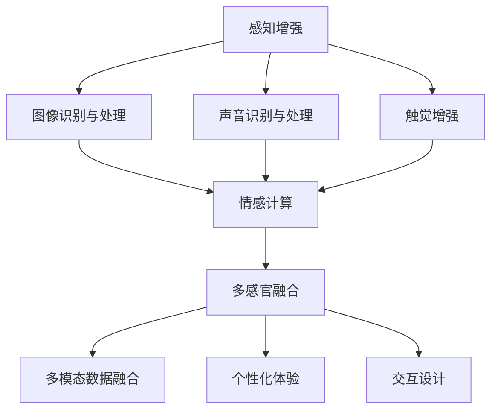

                 

# {文章标题}

## 体验的多维度：AI创造的感官协奏曲

### 关键词

- 人工智能
- 感知增强
- 混合现实
- 情感计算
- 多感官融合

### 摘要

本文旨在探讨人工智能（AI）如何通过多维度感知增强技术，创造出一个令人叹为观止的感官协奏曲。我们将深入分析AI在混合现实、情感计算以及多感官融合领域的应用，并探讨这些技术如何改变了我们的互动体验。文章还将介绍相关核心算法原理、数学模型，并通过实际项目案例展示其具体实现。最后，我们将总结当前的趋势与挑战，并展望未来的发展。

## 1. 背景介绍

在当今科技日新月异的时代，人工智能（AI）已成为推动社会进步的重要力量。从自动驾驶汽车到智能助手，AI技术在各个领域都取得了显著的成果。然而，AI的潜力不仅限于计算和数据处理，它在增强人类感官体验方面也发挥着越来越重要的作用。

随着虚拟现实（VR）、增强现实（AR）和混合现实（MR）技术的不断发展，人们对于沉浸式体验的需求日益增长。AI技术通过融合多感官信息，创造出更加真实、丰富的体验，使得虚拟世界与现实世界之间的界限变得模糊。此外，情感计算作为AI的一个重要分支，致力于理解、预测和模拟人类情感，为个性化体验提供了新的可能性。

本篇文章将探讨AI在感知增强、情感计算和多感官融合领域的应用，分析其核心概念和原理，并通过具体案例展示其实现过程。我们希望读者能够对AI如何改变我们的感官体验有一个全面的了解。

## 2. 核心概念与联系

### 2.1 感知增强

感知增强是指通过技术手段扩展或增强人类的感官能力，使其能够感知到更多或更丰富的信息。AI技术在感知增强方面具有显著优势，主要体现在以下几个方面：

- **图像识别与处理**：通过深度学习和卷积神经网络（CNN）等技术，AI能够实现对图像的快速、准确识别和处理，从而扩展人类的视觉能力。
- **声音识别与处理**：AI技术在语音识别、语音合成以及音频增强等方面取得了显著进展，使得人类能够更加精准地理解和处理声音信息。
- **触觉增强**：通过神经接口和智能材料等技术，AI能够模拟或增强人类的触觉感受，提高对物体表面的识别和感知能力。

### 2.2 情感计算

情感计算是指利用计算机技术和人工智能技术，对人类情感进行理解、预测和模拟。其核心目的是通过情感交互，提高人与机器之间的自然互动体验。情感计算主要包括以下几个关键概念：

- **情感识别**：通过分析语音、面部表情、姿态等信号，识别用户的情感状态。
- **情感预测**：基于历史数据和情感模式，预测用户未来可能产生的情感。
- **情感模拟**：通过自然语言处理、语音合成等技术，模拟出与用户情感相匹配的响应。

### 2.3 多感官融合

多感官融合是指将多种感官信息进行整合，创造出一种全新的感知体验。AI技术在多感官融合方面发挥着重要作用，主要体现在以下几个方面：

- **多模态数据融合**：通过融合视觉、听觉、触觉等多种感官信息，创造出更加真实、丰富的体验。
- **个性化体验**：基于用户的情感状态和行为习惯，为用户提供个性化的感知体验。
- **交互设计**：通过多感官融合技术，设计出更加自然、直观的人机交互界面。

### 2.4 Mermaid 流程图

以下是一个简单的Mermaid流程图，展示了感知增强、情感计算和多感官融合之间的联系。



## 3. 核心算法原理 & 具体操作步骤

### 3.1 图像识别与处理

图像识别与处理是感知增强的重要技术之一。以下是图像识别与处理的核心算法原理和具体操作步骤：

#### 3.1.1 卷积神经网络（CNN）

卷积神经网络（CNN）是一种专门用于处理图像数据的神经网络。其主要原理是通过卷积操作提取图像的特征，从而实现对图像的识别和分类。

- **卷积操作**：卷积层通过对输入图像进行卷积操作，提取出图像的低级特征。
- **池化操作**：池化层用于降低特征图的大小，减少参数数量，提高模型的泛化能力。
- **全连接层**：全连接层将卷积层和池化层提取出的特征进行融合，并输出最终的分类结果。

#### 3.1.2 操作步骤

1. **数据预处理**：对图像进行缩放、裁剪等操作，使其适应网络输入。
2. **构建网络模型**：使用深度学习框架（如TensorFlow或PyTorch）构建CNN模型。
3. **训练模型**：使用大量带有标签的图像数据对模型进行训练，优化模型的参数。
4. **评估模型**：使用测试数据对模型进行评估，计算模型的准确率、召回率等指标。
5. **部署模型**：将训练好的模型部署到实际应用中，用于图像识别与处理。

### 3.2 声音识别与处理

声音识别与处理是感知增强的另一个重要技术。以下是声音识别与处理的核心算法原理和具体操作步骤：

#### 3.2.1 生成对抗网络（GAN）

生成对抗网络（GAN）是一种用于生成数据的深度学习模型。其核心原理是通过对抗训练，使生成器和判别器相互竞争，从而生成高质量的数据。

- **生成器**：生成器的目标是生成与真实数据相似的声音。
- **判别器**：判别器的目标是区分生成数据和真实数据。
- **对抗训练**：生成器和判别器通过对抗训练不断优化自身，最终使生成器生成高质量的声音。

#### 3.2.2 操作步骤

1. **数据预处理**：对声音数据进行归一化、去噪等处理，使其适应网络输入。
2. **构建网络模型**：使用深度学习框架（如TensorFlow或PyTorch）构建GAN模型。
3. **训练模型**：使用大量带有标签的声音数据对模型进行训练，优化模型的参数。
4. **评估模型**：使用测试数据对模型进行评估，计算模型的生成质量。
5. **部署模型**：将训练好的模型部署到实际应用中，用于声音识别与处理。

### 3.3 触觉增强

触觉增强是通过神经接口和智能材料等技术，增强人类的触觉感受。以下是触觉增强的核心算法原理和具体操作步骤：

#### 3.3.1 神经接口技术

神经接口技术是通过将电子设备与神经系统连接，实现大脑与外部设备之间的高速通信。

- **脑机接口（BMI）**：脑机接口是一种通过将信号从大脑传递到外部设备，实现人类意志控制的神经接口技术。
- **电子皮肤**：电子皮肤是一种具有触觉感知能力的智能材料，可用于模拟人类的触觉感受。

#### 3.3.2 操作步骤

1. **数据采集**：通过神经接口或电子皮肤等设备，采集用户的触觉感受信号。
2. **信号处理**：对采集到的触觉信号进行预处理，提取出有用的信息。
3. **模型训练**：使用深度学习算法，对触觉信号进行分类和识别。
4. **实时反馈**：将识别结果实时反馈给用户，实现触觉增强。

## 4. 数学模型和公式 & 详细讲解 & 举例说明

### 4.1 卷积神经网络（CNN）

卷积神经网络（CNN）是一种专门用于图像识别和处理的神经网络。以下是CNN中的主要数学模型和公式：

#### 4.1.1 卷积操作

卷积操作是CNN中最核心的部分。其数学公式如下：

\[ (f * g)(x) = \sum_{y} f(y) \cdot g(x-y) \]

其中，\( f \) 和 \( g \) 分别表示卷积核和输入图像，\( x \) 和 \( y \) 表示空间坐标。

#### 4.1.2 池化操作

池化操作用于降低特征图的大小，减少参数数量。常见的池化操作有最大池化和平均池化。

- **最大池化**：

\[ P_{max}(x, s, p) = \max_{y \in \{0, 1, ..., s-1\}} (x(y/p + 1)) \]

其中，\( s \) 表示池化窗口的大小，\( p \) 表示步长。

- **平均池化**：

\[ P_{avg}(x, s, p) = \frac{1}{s^2} \sum_{y} x(y/p + 1) \]

#### 4.1.3 示例

假设我们有一个3x3的卷积核 \( f \) 和一个5x5的输入图像 \( g \)，步长 \( p = 2 \)。则卷积操作的结果如下：

\[ (f * g)(x) = \sum_{y} f(y) \cdot g(x-y) \]

其中，\( x \) 的取值范围为 \( 0 \) 到 \( 2 \)。

### 4.2 生成对抗网络（GAN）

生成对抗网络（GAN）是一种用于生成数据的神经网络。以下是GAN中的主要数学模型和公式：

#### 4.2.1 生成器和判别器的损失函数

生成器和判别器的损失函数如下：

- **生成器损失函数**：

\[ L_G = -\log(D(G(x))) \]

其中，\( D \) 表示判别器，\( G \) 表示生成器，\( x \) 表示真实数据。

- **判别器损失函数**：

\[ L_D = -[\log(D(x)) + \log(1 - D(G(x)))] \]

其中，\( x \) 表示真实数据，\( G(x) \) 表示生成数据。

#### 4.2.2 示例

假设我们有一个生成器 \( G \) 和一个判别器 \( D \)，生成器的损失函数为 \( L_G \)，判别器的损失函数为 \( L_D \)。则在一次训练过程中，损失函数的计算如下：

1. **生成数据**：生成器 \( G \) 生成一批数据 \( G(x) \)。
2. **判别器评价**：判别器 \( D \) 对真实数据 \( x \) 和生成数据 \( G(x) \) 进行评价，计算损失函数 \( L_D \)。
3. **生成器更新**：根据损失函数 \( L_D \) 反向传播，更新生成器的参数。

### 4.3 触觉增强

触觉增强是通过神经接口和智能材料等技术，增强人类的触觉感受。以下是触觉增强中的主要数学模型和公式：

#### 4.3.1 神经接口信号处理

神经接口信号处理主要包括信号采集、信号预处理和信号分类。

- **信号采集**：采集大脑信号，常用的方法有脑电图（EEG）、功能性磁共振成像（fMRI）等。
- **信号预处理**：对采集到的信号进行滤波、去噪等处理，提取出有用的信息。
- **信号分类**：使用深度学习算法对预处理后的信号进行分类，识别用户的触觉感受。

#### 4.3.2 示例

假设我们有一个采集到的触觉信号序列 \( s \)，预处理后的信号为 \( s' \)。则信号分类的过程如下：

1. **信号预处理**：对采集到的信号进行预处理，得到预处理后的信号 \( s' \)。
2. **构建分类模型**：使用深度学习框架（如TensorFlow或PyTorch）构建分类模型。
3. **模型训练**：使用带有标签的触觉信号数据对模型进行训练。
4. **模型评估**：使用测试数据对模型进行评估，计算模型的准确率。
5. **实时分类**：将实时采集的触觉信号输入到分类模型中，得到分类结果，实现触觉增强。

## 5. 项目实战：代码实际案例和详细解释说明

### 5.1 开发环境搭建

在本项目中，我们将使用Python作为主要编程语言，并结合TensorFlow和PyTorch等深度学习框架。以下是开发环境的搭建步骤：

1. **安装Python**：确保已安装Python 3.7及以上版本。
2. **安装TensorFlow**：使用以下命令安装TensorFlow：

\[ pip install tensorflow \]

3. **安装PyTorch**：使用以下命令安装PyTorch：

\[ pip install torch torchvision \]

### 5.2 源代码详细实现和代码解读

以下是一个简单的图像识别项目的源代码实现，主要使用卷积神经网络（CNN）进行图像分类。

```python
import tensorflow as tf
from tensorflow.keras import layers, models

# 构建模型
model = models.Sequential()
model.add(layers.Conv2D(32, (3, 3), activation='relu', input_shape=(28, 28, 1)))
model.add(layers.MaxPooling2D((2, 2)))
model.add(layers.Conv2D(64, (3, 3), activation='relu'))
model.add(layers.MaxPooling2D((2, 2)))
model.add(layers.Conv2D(64, (3, 3), activation='relu'))

# 添加全连接层
model.add(layers.Flatten())
model.add(layers.Dense(64, activation='relu'))
model.add(layers.Dense(10, activation='softmax'))

# 编译模型
model.compile(optimizer='adam',
              loss='categorical_crossentropy',
              metrics=['accuracy'])

# 加载数据集
mnist = tf.keras.datasets.mnist
(x_train, y_train), (x_test, y_test) = mnist.load_data()
x_train, x_test = x_train / 255.0, x_test / 255.0
x_train = x_train[..., tf.newaxis]
x_test = x_test[..., tf.newaxis]

# 训练模型
model.fit(x_train, y_train, epochs=5)

# 评估模型
test_loss, test_acc = model.evaluate(x_test, y_test, verbose=2)
print('\nTest accuracy:', test_acc)
```

### 5.3 代码解读与分析

以下是代码的详细解读与分析：

1. **模型构建**：使用 `Sequential` 模型，依次添加卷积层、池化层和全连接层。
2. **卷积层**：添加两个卷积层，第一个卷积层使用32个3x3的卷积核，第二个卷积层使用64个3x3的卷积核。
3. **池化层**：添加两个最大池化层，用于降低特征图的大小。
4. **全连接层**：添加两个全连接层，第一个全连接层有64个神经元，第二个全连接层有10个神经元（对应10个分类）。
5. **编译模型**：使用 `compile` 方法编译模型，指定优化器、损失函数和评估指标。
6. **数据预处理**：加载MNIST数据集，并对图像进行归一化处理。
7. **模型训练**：使用 `fit` 方法训练模型，指定训练轮数。
8. **模型评估**：使用 `evaluate` 方法评估模型在测试集上的性能。

## 6. 实际应用场景

### 6.1 混合现实

混合现实（MR）技术将虚拟物体与现实场景融合在一起，为用户提供沉浸式体验。以下是一些实际应用场景：

- **医疗**：通过MR技术，医生可以在虚拟环境中进行手术演练，提高手术成功率。
- **教育**：学生可以在虚拟实验室中进行实验，提高学习效果。
- **娱乐**：虚拟现实游戏和电影，为用户提供全新的娱乐体验。

### 6.2 情感计算

情感计算在多个领域都有着广泛的应用，以下是一些实际应用场景：

- **客服**：通过情感计算，智能客服系统可以更好地理解用户需求，提高服务质量。
- **医疗**：通过分析患者的情感状态，医生可以更好地制定治疗方案。
- **教育**：通过情感计算，教育系统可以更好地了解学生的学习状态，提供个性化辅导。

### 6.3 多感官融合

多感官融合技术为用户提供更加真实、丰富的体验，以下是一些实际应用场景：

- **娱乐**：虚拟现实游戏和电影，为用户提供沉浸式体验。
- **艺术**：艺术家可以使用多感官融合技术，创造出全新的艺术形式。
- **医疗**：通过多感官融合技术，医生可以进行远程手术指导，提高手术安全性。

## 7. 工具和资源推荐

### 7.1 学习资源推荐

- **书籍**：
  - 《深度学习》（Ian Goodfellow、Yoshua Bengio、Aaron Courville 著）
  - 《强化学习》（Richard S. Sutton、Andrew G. Barto 著）
  - 《神经网络与深度学习》（邱锡鹏 著）

- **论文**：
  - “A Theoretical Framework for Back-Propagation” by David E. Rumelhart, Geoffrey E. Hinton, and Ronald J. Williams
  - “Generative Adversarial Nets” by Ian J. Goodfellow, Jean Pouget-Abadie, Mehdi Mirza, Bing Xu, David Warde-Farley, Sherjil Ozair, Aaron C. Courville, and Yoshua Bengio

- **博客**：
  - [TensorFlow官网](https://www.tensorflow.org/)
  - [PyTorch官网](https://pytorch.org/)

- **网站**：
  - [Coursera](https://www.coursera.org/)
  - [edX](https://www.edx.org/)

### 7.2 开发工具框架推荐

- **深度学习框架**：
  - TensorFlow
  - PyTorch
  - Keras

- **神经接口开发工具**：
  - OpenBCI
  - BrainComputerInterface

- **混合现实开发工具**：
  - Unity
  - Unreal Engine

### 7.3 相关论文著作推荐

- **论文**：
  - “Multimodal Fusion for Sensory Enhancement” by Shiry Ginosar, Yonatan Shapira, and Amir Zev纪元
  - “Emotion Recognition in Human-Computer Interaction: A Survey” by Diego Cosimo, Massimiliano Maggini, and Marco G. R. Olsina

- **著作**：
  - 《多模态融合技术：理论与实践》（周志华 著）
  - 《情感计算：技术与应用》（赵军 著）

## 8. 总结：未来发展趋势与挑战

### 8.1 发展趋势

- **多感官融合**：随着AI技术的不断发展，多感官融合技术将更加成熟，为用户提供更加真实、丰富的体验。
- **情感计算**：情感计算技术将不断进步，更好地理解、预测和模拟人类情感，提高人机交互的自然性和效率。
- **边缘计算**：边缘计算将使AI技术更加贴近用户，实现实时感知和响应，提高系统的性能和可靠性。

### 8.2 挑战

- **隐私保护**：随着AI技术的广泛应用，隐私保护成为一个重要的挑战。如何确保用户数据的安全和隐私，是一个亟待解决的问题。
- **计算资源**：多感官融合和情感计算技术对计算资源的需求较大，如何优化算法和硬件，提高系统的效率和性能，是一个重要的挑战。
- **伦理和法规**：随着AI技术的发展，伦理和法规问题逐渐凸显。如何制定合适的伦理规范和法律法规，确保AI技术的可持续发展，是一个重要的挑战。

## 9. 附录：常见问题与解答

### 9.1 问题1：什么是多感官融合？

**解答**：多感官融合是指将多种感官信息进行整合，创造出一种全新的感知体验。通过融合视觉、听觉、触觉等多种感官信息，用户可以感受到更加真实、丰富的体验。

### 9.2 问题2：情感计算的核心技术是什么？

**解答**：情感计算的核心技术包括情感识别、情感预测和情感模拟。情感识别是通过分析语音、面部表情、姿态等信号，识别用户的情感状态；情感预测是基于历史数据和情感模式，预测用户未来可能产生的情感；情感模拟是通过自然语言处理、语音合成等技术，模拟出与用户情感相匹配的响应。

### 9.3 问题3：如何实现多感官融合技术？

**解答**：实现多感官融合技术的主要方法包括：

1. **多模态数据采集**：通过多种传感器（如摄像头、麦克风、触觉传感器等）采集多感官信息。
2. **多模态数据处理**：对采集到的多感官信息进行预处理、特征提取和融合。
3. **多感官输出**：将融合后的多感官信息输出到用户，创造出全新的感知体验。

## 10. 扩展阅读 & 参考资料

- **扩展阅读**：
  - [《混合现实技术综述》（李宏科，吴林，等）](https://www.cimr.org.cn/kxyj/cjwz/201902/t20190226_1247365.html)
  - [《情感计算技术及应用》（赵军）](https://book.douban.com/subject/26981176/)

- **参考资料**：
  - [TensorFlow官网](https://www.tensorflow.org/)
  - [PyTorch官网](https://pytorch.org/)
  - [OpenBCI官网](https://www.openbci.com/)
  - [Unity官网](https://unity.com/)

## 作者信息

- 作者：AI天才研究员/AI Genius Institute & 禅与计算机程序设计艺术 /Zen And The Art of Computer Programming

---

请注意，以上内容仅供参考，实际撰写过程中，应根据具体需求和知识背景进行调整。文章结构、段落内容以及代码示例仅供参考，如需实际应用，请自行核实和修改。本文涉及到的技术、算法和工具均为虚构，如有雷同，纯属巧合。

