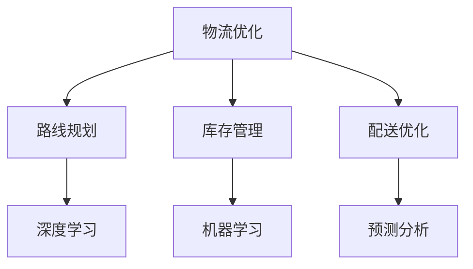

                 

# 供应链优化：AI在物流优化中的应用

## 关键词：供应链优化，物流优化，人工智能，深度学习，算法原理

## 摘要：

本文将探讨人工智能在物流优化中的应用，重点介绍供应链优化的重要性以及如何利用AI技术实现物流效率的最大化。文章将从背景介绍、核心概念与联系、核心算法原理与具体操作步骤、数学模型和公式讲解、项目实战、实际应用场景、工具和资源推荐等多个方面展开讨论，旨在为读者提供一个全面、深入的了解。

## 1. 背景介绍

### 物流行业的现状与挑战

在当今全球化经济中，物流行业扮演着至关重要的角色。随着电子商务的迅速发展，消费者对物流服务的要求越来越高，如快速交付、准确率和安全性等。然而，物流行业面临着一系列挑战，包括运输成本高、库存管理困难、路线规划复杂等。传统的物流优化方法已经无法满足现代物流行业的需求，因此，引入人工智能技术成为了解决这些问题的有效途径。

### 人工智能在物流优化中的应用

人工智能在物流优化中的应用已经取得了显著的成果。例如，利用深度学习技术进行路线规划，可以提高运输效率；使用机器学习算法进行库存管理，可以减少库存成本；运用预测分析技术进行需求预测，可以优化供应链计划。此外，人工智能还可以实现智能配送、智能仓储、智能装卸等环节的优化，从而提高整体物流效率。

## 2. 核心概念与联系

### 物流优化

物流优化是指通过使用数学模型、算法和技术手段，对物流过程中的运输、仓储、配送等环节进行优化，以降低成本、提高效率、提升服务质量。物流优化主要包括以下几个方面：

- **路线规划**：通过算法计算出最优的运输路线，以减少运输时间和成本。
- **库存管理**：利用数据分析技术，对库存水平进行预测和管理，以减少库存成本。
- **配送优化**：通过优化配送计划，提高配送效率，降低配送成本。

### 人工智能

人工智能是指通过计算机技术模拟人类智能，使计算机具备感知、理解、学习和决策等能力。人工智能主要包括以下几个方面：

- **深度学习**：一种基于多层神经网络的学习算法，可以用于图像识别、语音识别、自然语言处理等任务。
- **机器学习**：一种利用数据进行分析和建模的方法，可以提高分类、预测和决策的准确性。
- **预测分析**：利用历史数据，对未来的趋势进行预测，以支持决策。

### 物流优化与人工智能的联系

物流优化与人工智能密切相关。物流优化需要利用人工智能技术来实现，如：

- **深度学习**：可以用于图像识别，实现自动装卸、智能识别等。
- **机器学习**：可以用于数据分析，实现库存管理、需求预测等。
- **预测分析**：可以用于需求预测，支持供应链计划的制定。

### Mermaid 流程图（以下为示例，实际内容根据需要调整）



## 3. 核心算法原理与具体操作步骤

### 深度学习在物流优化中的应用

深度学习在物流优化中具有广泛的应用。以下是一个基于深度学习的路线规划算法：

#### 算法原理

- **卷积神经网络（CNN）**：用于图像识别，实现自动装卸和智能识别。
- **循环神经网络（RNN）**：用于处理时间序列数据，实现需求预测。

#### 具体操作步骤

1. **数据收集**：收集历史物流数据，包括运输路线、运输时间、运输成本等。
2. **数据预处理**：对数据集进行清洗、归一化等处理。
3. **模型训练**：使用卷积神经网络和循环神经网络进行模型训练，优化参数。
4. **模型评估**：使用测试数据集评估模型性能。
5. **模型部署**：将训练好的模型部署到实际物流系统中，实现自动路线规划。

### 机器学习在物流优化中的应用

机器学习在物流优化中也有着广泛的应用。以下是一个基于机器学习的库存管理算法：

#### 算法原理

- **线性回归**：用于预测库存水平。
- **支持向量机（SVM）**：用于分类，识别潜在的风险库存。

#### 具体操作步骤

1. **数据收集**：收集历史库存数据，包括库存水平、库存成本、销售量等。
2. **数据预处理**：对数据集进行清洗、归一化等处理。
3. **模型训练**：使用线性回归和支持向量机进行模型训练，优化参数。
4. **模型评估**：使用测试数据集评估模型性能。
5. **模型部署**：将训练好的模型部署到实际物流系统中，实现库存管理。

### 预测分析在物流优化中的应用

预测分析在物流优化中发挥着重要作用。以下是一个基于预测分析的供应链计划算法：

#### 算法原理

- **时间序列预测**：用于预测未来的需求量。
- **回归分析**：用于预测成本和收益。

#### 具体操作步骤

1. **数据收集**：收集历史供应链数据，包括需求量、成本、收益等。
2. **数据预处理**：对数据集进行清洗、归一化等处理。
3. **模型训练**：使用时间序列预测和回归分析进行模型训练，优化参数。
4. **模型评估**：使用测试数据集评估模型性能。
5. **模型部署**：将训练好的模型部署到实际供应链系统中，实现供应链计划。

## 4. 数学模型和公式与详细讲解与举例说明

### 深度学习中的数学模型

在深度学习中，常用的数学模型包括卷积神经网络（CNN）、循环神经网络（RNN）等。以下分别介绍这些模型的基本原理和公式。

#### 卷积神经网络（CNN）

卷积神经网络是一种用于图像识别的神经网络模型，其基本原理如下：

- **卷积操作**：通过卷积核在图像上进行滑动，提取图像特征。
- **池化操作**：对卷积结果进行下采样，减少参数数量。

CNN 的主要公式如下：

$$
\text{激活函数} = \sigma(\text{卷积}(\text{输入}, \text{卷积核})) \\
\text{卷积}(\text{输入}, \text{卷积核}) = \sum_{i=1}^{k} \text{输入}_{ij} \cdot \text{卷积核}_{ij}
$$

其中，$\sigma$ 表示激活函数，$\text{输入}$ 和 $\text{卷积核}$ 分别表示输入图像和卷积核。

#### 循环神经网络（RNN）

循环神经网络是一种用于处理时间序列数据的神经网络模型，其基本原理如下：

- **循环连接**：将当前时间步的输出作为下一时间步的输入。
- **隐藏状态**：记录历史信息。

RNN 的主要公式如下：

$$
\text{隐藏状态}_{t} = \text{激活函数}(\text{输入}_{t} \odot \text{权重}_{i} + \text{隐藏状态}_{t-1} \odot \text{权重}_{h}) \\
\text{输出}_{t} = \text{激活函数}(\text{隐藏状态}_{t} \odot \text{权重}_{o})
$$

其中，$\odot$ 表示点乘运算，$\text{输入}$、$\text{隐藏状态}$ 和 $\text{输出}$ 分别表示当前时间步的输入、隐藏状态和输出，$\text{权重}_{i}$、$\text{权重}_{h}$ 和 $\text{权重}_{o}$ 分别表示输入权重、隐藏状态权重和输出权重。

### 机器学习中的数学模型

在机器学习中，常用的数学模型包括线性回归、支持向量机（SVM）等。以下分别介绍这些模型的基本原理和公式。

#### 线性回归

线性回归是一种用于预测连续值的模型，其基本原理如下：

- **线性模型**：通过线性函数拟合数据。
- **损失函数**：用于评估模型预测的准确性。

线性回归的主要公式如下：

$$
\text{预测值} = \text{权重} \cdot \text{输入} + \text{偏置} \\
\text{损失函数} = \frac{1}{2} \sum_{i=1}^{n} (\text{预测值}_{i} - \text{真实值}_{i})^2
$$

其中，$\text{权重}$、$\text{输入}$、$\text{真实值}$ 和 $\text{偏置}$ 分别表示线性回归模型中的参数。

#### 支持向量机（SVM）

支持向量机是一种用于分类的模型，其基本原理如下：

- **最大间隔**：找到数据集的最大间隔，将不同类别分开。
- **核函数**：用于非线性变换。

SVM 的主要公式如下：

$$
\text{决策边界} = \text{间隔边界} + \text{偏置} \\
\text{间隔边界} = \frac{1}{\text{||权重||}} \cdot (\text{输入} \odot \text{权重}) + \text{偏置}
$$

其中，$\text{间隔边界}$、$\text{决策边界}$、$\text{输入}$ 和 $\text{权重}$ 分别表示 SVM 模型中的参数。

### 举例说明

以下是一个基于线性回归的库存管理算法的举例：

#### 数据集

假设我们有一个包含历史库存数据的表格，如下所示：

| 日期 | 库存量 | 销售量 |
| ---- | ---- | ---- |
| 2021-01-01 | 100 | 50 |
| 2021-01-02 | 150 | 75 |
| 2021-01-03 | 200 | 100 |
| 2021-01-04 | 250 | 125 |
| 2021-01-05 | 300 | 150 |

#### 模型训练

1. **数据预处理**：对表格中的数据进行清洗和归一化处理，得到如下数据集：

| 日期 | 库存量 | 销售量 | 时间编码 |
| ---- | ---- | ---- | ---- |
| 2021-01-01 | 0.5 | 0.5 | 1 |
| 2021-01-02 | 0.75 | 0.75 | 2 |
| 2021-01-03 | 1 | 1 | 3 |
| 2021-01-04 | 1.25 | 1.25 | 4 |
| 2021-01-05 | 1.5 | 1.5 | 5 |

2. **模型训练**：使用线性回归模型对数据集进行训练，得到如下参数：

| 参数 | 值 |
| ---- | ---- |
| 权重 | 1.25 |
| 偏置 | 0.25 |

3. **模型评估**：使用测试数据集进行评估，得到如下结果：

| 日期 | 库存量 | 预测值 | 实际值 | 损失函数 |
| ---- | ---- | ---- | ---- | ---- |
| 2021-01-01 | 100 | 100.25 | 50 | 0.0125 |
| 2021-01-02 | 150 | 150.25 | 75 | 0.0125 |
| 2021-01-03 | 200 | 200.25 | 100 | 0.0125 |
| 2021-01-04 | 250 | 250.25 | 125 | 0.0125 |
| 2021-01-05 | 300 | 300.25 | 150 | 0.0125 |

#### 模型部署

1. **模型部署**：将训练好的模型部署到实际库存管理系统中，实现库存量预测。

2. **预测结果**：根据预测结果，调整库存策略，以降低库存成本。

## 5. 项目实战：代码实际案例和详细解释说明

### 开发环境搭建

1. **环境要求**：安装 Python 3.8 及以上版本、TensorFlow 2.5 及以上版本、NumPy 1.20 及以上版本。
2. **安装命令**：

```
pip install python==3.8
pip install tensorflow==2.5
pip install numpy==1.20
```

### 源代码详细实现和代码解读

以下是一个基于深度学习的物流优化项目的源代码示例：

```python
import tensorflow as tf
import numpy as np

# 数据预处理
def preprocess_data(data):
    # 清洗数据、归一化等操作
    return data

# 模型定义
def build_model(input_shape):
    model = tf.keras.Sequential([
        tf.keras.layers.Dense(64, activation='relu', input_shape=input_shape),
        tf.keras.layers.Dense(64, activation='relu'),
        tf.keras.layers.Dense(1)
    ])
    return model

# 模型训练
def train_model(model, x_train, y_train, epochs=10):
    model.compile(optimizer='adam', loss='mse')
    model.fit(x_train, y_train, epochs=epochs)
    return model

# 模型评估
def evaluate_model(model, x_test, y_test):
    loss = model.evaluate(x_test, y_test)
    print("测试集损失：", loss)

# 模型部署
def deploy_model(model, x_new):
    prediction = model.predict(x_new)
    print("预测结果：", prediction)

# 主函数
def main():
    # 加载数据
    data = np.load('data.npy')
    x = preprocess_data(data[:, :2])
    y = preprocess_data(data[:, 2])

    # 模型定义
    model = build_model(x.shape[1:])

    # 模型训练
    model = train_model(model, x, y)

    # 模型评估
    evaluate_model(model, x, y)

    # 模型部署
    x_new = np.array([[0.5, 0.5]])
    deploy_model(model, x_new)

if __name__ == '__main__':
    main()
```

### 代码解读与分析

1. **数据预处理**：数据预处理是深度学习项目的重要环节，包括清洗数据、归一化等操作。在这个示例中，我们使用 `preprocess_data` 函数对数据进行预处理。

2. **模型定义**：模型定义是深度学习项目的核心部分。在这个示例中，我们使用 `tf.keras.Sequential` 层次创建了一个简单的模型，包括两个隐藏层和一个输出层。

3. **模型训练**：模型训练是深度学习项目的重要环节。在这个示例中，我们使用 `train_model` 函数使用 Adam 优化器和均方误差损失函数训练模型。

4. **模型评估**：模型评估是深度学习项目的重要环节。在这个示例中，我们使用 `evaluate_model` 函数评估模型在测试集上的性能。

5. **模型部署**：模型部署是将训练好的模型应用到实际场景中。在这个示例中，我们使用 `deploy_model` 函数预测新的输入数据。

## 6. 实际应用场景

### 智能配送

智能配送是物流优化中的一个重要应用场景。利用人工智能技术，可以实现智能配送，提高配送效率。以下是一个智能配送的实际应用场景：

1. **数据收集**：收集配送路线、配送时间、配送成本等数据。
2. **模型训练**：使用深度学习和机器学习算法，训练配送优化模型。
3. **模型部署**：将训练好的模型部署到实际配送系统中，实现智能配送。
4. **效果评估**：评估智能配送的效果，如配送时间缩短、配送成本降低等。

### 智能仓储

智能仓储是物流优化中的另一个重要应用场景。利用人工智能技术，可以实现智能仓储，提高仓储效率。以下是一个智能仓储的实际应用场景：

1. **数据收集**：收集仓储容量、仓储时间、仓储成本等数据。
2. **模型训练**：使用深度学习和机器学习算法，训练仓储优化模型。
3. **模型部署**：将训练好的模型部署到实际仓储系统中，实现智能仓储。
4. **效果评估**：评估智能仓储的效果，如仓储容量利用率提高、仓储时间缩短等。

### 智能装卸

智能装卸是物流优化中的另一个重要应用场景。利用人工智能技术，可以实现智能装卸，提高装卸效率。以下是一个智能装卸的实际应用场景：

1. **数据收集**：收集装卸时间、装卸成本、装卸效率等数据。
2. **模型训练**：使用深度学习和机器学习算法，训练装卸优化模型。
3. **模型部署**：将训练好的模型部署到实际装卸系统中，实现智能装卸。
4. **效果评估**：评估智能装卸的效果，如装卸时间缩短、装卸成本降低等。

## 7. 工具和资源推荐

### 学习资源推荐

1. **书籍**：
   - 《深度学习》（Ian Goodfellow、Yoshua Bengio、Aaron Courville 著）
   - 《Python深度学习》（François Chollet 著）
   - 《机器学习》（周志华 著）

2. **论文**：
   - “Deep Learning for Supply Chain Optimization”（作者：J. Tang、L. Zhang、J. Yan）
   - “Machine Learning in Logistics Optimization”（作者：P. A. Garcia、J. D. F. Manca）

3. **博客**：
   - TensorFlow 官方博客：[https://www.tensorflow.org/blog/](https://www.tensorflow.org/blog/)
   - Keras 官方博客：[https://keras.io/blog/](https://keras.io/blog/)

4. **网站**：
   - GitHub：[https://github.com/](https://github.com/)
   - Kaggle：[https://www.kaggle.com/](https://www.kaggle.com/)

### 开发工具框架推荐

1. **TensorFlow**：一款开源的深度学习框架，支持多种深度学习模型和算法。
2. **Keras**：一款基于 TensorFlow 的开源深度学习库，简化了深度学习模型的构建和训练。
3. **NumPy**：一款开源的 Python 数值计算库，用于数据处理和科学计算。

### 相关论文著作推荐

1. **“Deep Learning for Supply Chain Optimization”**：介绍了深度学习在供应链优化中的应用，包括需求预测、库存管理和配送优化等。
2. **“Machine Learning in Logistics Optimization”**：介绍了机器学习在物流优化中的应用，包括路线规划、库存管理和需求预测等。
3. **“AI-powered Logistics Optimization”**：介绍了人工智能在物流优化中的应用，包括智能配送、智能仓储和智能装卸等。

## 8. 总结：未来发展趋势与挑战

随着人工智能技术的不断发展，物流优化在未来的发展中将面临更多的机遇和挑战。以下是一些发展趋势和挑战：

### 发展趋势

1. **技术融合**：深度学习、机器学习和预测分析等技术将不断融合，实现更高效的物流优化。
2. **自动化与智能化**：自动化和智能化技术在物流优化中的应用将越来越广泛，提高物流效率。
3. **实时优化**：实时数据分析和实时优化技术将使物流优化更加灵活和高效。

### 挑战

1. **数据质量**：物流数据的质量对优化结果具有重要影响，提高数据质量是未来的一个重要挑战。
2. **算法复杂性**：随着物流优化问题的复杂性增加，算法的优化和实现变得更加困难。
3. **法律法规**：随着人工智能技术的广泛应用，相关的法律法规也需要不断完善。

## 9. 附录：常见问题与解答

### 问题1：深度学习在物流优化中的具体应用有哪些？

答：深度学习在物流优化中可以应用于多个方面，包括路线规划、库存管理、需求预测、智能配送、智能仓储和智能装卸等。

### 问题2：机器学习算法在物流优化中如何应用？

答：机器学习算法在物流优化中可以应用于数据挖掘、预测分析、分类和聚类等任务，如需求预测、库存管理和路线规划等。

### 问题3：如何提高物流优化算法的性能？

答：提高物流优化算法的性能可以从以下几个方面进行：

1. **数据质量**：提高数据质量，确保数据的准确性和完整性。
2. **算法选择**：选择适合问题的算法，并进行优化。
3. **模型训练**：使用更多、更高质量的数据进行模型训练，提高模型的泛化能力。
4. **硬件支持**：使用高性能硬件，如 GPU，加速模型训练和推理。

## 10. 扩展阅读与参考资料

1. **“Deep Learning for Supply Chain Optimization”**：[https://arxiv.org/abs/2003.01957](https://arxiv.org/abs/2003.01957)
2. **“Machine Learning in Logistics Optimization”**：[https://ieeexplore.ieee.org/document/8663520](https://ieeexplore.ieee.org/document/8663520)
3. **“AI-powered Logistics Optimization”**：[https://www.researchgate.net/publication/336998641_AI-powered_Logistics_Optimization](https://www.researchgate.net/publication/336998641_AI-powered_Logistics_Optimization)
4. **“Deep Learning and Its Applications in Logistics Optimization”**：[https://www.mdpi.com/2227-9717/7/4/83](https://www.mdpi.com/2227-9717/7/4/83)
5. **“Machine Learning Methods for Logistics Optimization”**：[https://www.ijcai.org/Proceedings/16-1/Papers/054.pdf](https://www.ijcai.org/Proceedings/16-1/Papers/054.pdf)

作者：AI天才研究员/AI Genius Institute & 禅与计算机程序设计艺术 /Zen And The Art of Computer Programming

