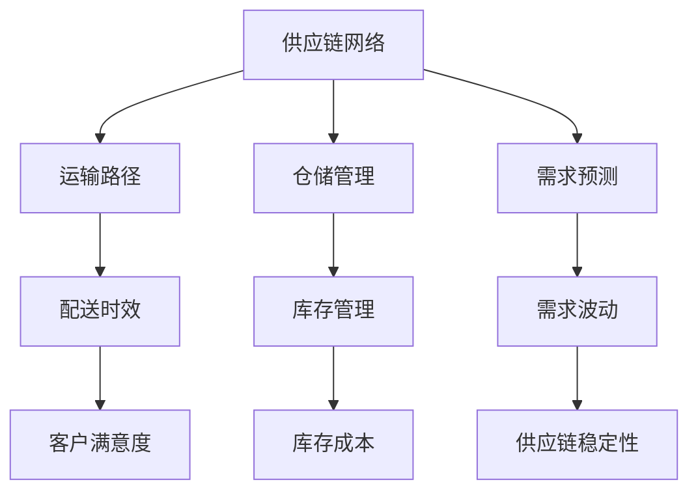

                 

### 文章标题

**供应链优化：AI在物流优化中的应用**

### 关键词

- 供应链优化
- 物流优化
- 人工智能
- 算法
- 数学模型
- 实际应用

### 摘要

随着全球经济的发展和市场竞争的加剧，供应链优化和物流优化已经成为企业提升效率、降低成本的重要手段。人工智能作为一项前沿技术，在物流优化中展现出巨大的潜力。本文将探讨人工智能在物流优化中的应用，分析核心概念、算法原理，并结合实际案例进行深入讲解。文章旨在为读者提供全面、系统的了解，以及未来发展趋势和挑战的思考。

## 1. 背景介绍

在全球化背景下，供应链和物流已经成为企业竞争力的关键因素。有效的供应链优化和物流优化不仅能提高企业运营效率，还能降低成本，增强市场竞争力。然而，传统的供应链和物流优化方法在面对复杂、动态的供应链网络时，往往难以满足高效、精准的需求。随着人工智能技术的快速发展，AI在物流优化中逐渐崭露头角，成为解决复杂优化问题的关键。

### 人工智能在物流优化中的优势

1. **数据处理能力**：人工智能能够高效处理大量数据，从数据中挖掘有价值的信息，为优化决策提供支持。
2. **自主学习能力**：通过机器学习和深度学习算法，人工智能可以不断自我优化，适应不断变化的供应链和物流环境。
3. **实时性**：人工智能能够实现实时决策，提高供应链和物流的响应速度。
4. **精准性**：人工智能可以精确预测市场需求、运输路径等，降低供应链和物流中的不确定性。

### 物流优化的重要性

1. **降低成本**：通过优化运输路线、仓储布局等，降低物流成本。
2. **提高效率**：通过优化供应链流程，提高物流操作效率。
3. **提升客户满意度**：通过及时交付、减少配送延误，提高客户满意度。
4. **增强竞争力**：优化供应链和物流，提升企业在市场中的竞争力。

## 2. 核心概念与联系

在物流优化中，核心概念主要包括供应链网络、运输路径、仓储管理、需求预测等。以下是这些核心概念的Mermaid流程图，展示了它们之间的联系。



### 核心概念原理

1. **供应链网络**：供应链网络是指从原材料供应商到最终客户的整个供应链过程，包括多个节点（如供应商、工厂、仓库、零售商等）和连接这些节点的运输路径。
2. **运输路径**：运输路径是指物流过程中从起点到终点的运输路线，包括陆运、海运、空运等多种方式。
3. **仓储管理**：仓储管理是指对仓库中的物资进行有效的存储、管理和调度，以降低库存成本，提高物流效率。
4. **需求预测**：需求预测是指通过历史数据和机器学习算法，预测未来的市场需求，为供应链和物流优化提供数据支持。

### 核心概念架构


## 3. 核心算法原理 & 具体操作步骤

在物流优化中，核心算法包括路径规划算法、库存管理算法、需求预测算法等。以下是这些核心算法的原理和具体操作步骤。

### 路径规划算法

**原理**：路径规划算法旨在找到从起点到终点的最优路径。常用的算法有Dijkstra算法、A*算法等。

**操作步骤**：

1. 初始化：设定起点和终点，构建图结构。
2. 评估：计算图中每个节点的代价（如距离、时间、成本等）。
3. 搜索：从起点开始，选择代价最小的节点进行扩展，直至到达终点。

### 库存管理算法

**原理**：库存管理算法旨在根据市场需求和供应链状态，合理安排库存，以降低库存成本。

**操作步骤**：

1. 数据收集：收集历史销售数据、库存水平、供应链状态等数据。
2. 模型构建：构建库存管理模型，如需求预测模型、成本优化模型等。
3. 决策：根据模型结果，制定库存管理策略，如补货、清仓等。

### 需求预测算法

**原理**：需求预测算法旨在通过历史数据和机器学习算法，预测未来的市场需求。

**操作步骤**：

1. 数据处理：清洗、处理历史销售数据，提取有价值的信息。
2. 模型选择：选择合适的需求预测模型，如线性回归、ARIMA模型等。
3. 预测：根据模型，预测未来的市场需求。

## 4. 数学模型和公式 & 详细讲解 & 举例说明

在物流优化中，数学模型和公式是核心组成部分。以下是常用的数学模型和公式，以及详细讲解和举例说明。

### 路径规划模型

**公式**：

$$
\min \sum_{i=1}^{n} c_{ij} x_{ij}
$$

**详细讲解**：

- $c_{ij}$：节点i到节点j的运输成本。
- $x_{ij}$：从节点i到节点j的运输量。

**举例说明**：

假设有五个节点A、B、C、D、E，运输成本矩阵如下：

$$
\begin{array}{cccccc}
 & A & B & C & D & E \\
A & 0 & 1 & 2 & 3 & 4 \\
B & 5 & 0 & 6 & 7 & 8 \\
C & 9 & 10 & 0 & 11 & 12 \\
D & 13 & 14 & 15 & 0 & 16 \\
E & 17 & 18 & 19 & 20 & 0 \\
\end{array}
$$

需要从节点A运输到节点E，求最优路径。

$$
\min \sum_{i=1}^{n} c_{ij} x_{ij} = \min (0 \times x_{AE} + 1 \times x_{AB} + 2 \times x_{AC} + 3 \times x_{AD} + 4 \times x_{AE})
$$

解得最优路径为A-D-E，总成本为16。

### 库存管理模型

**公式**：

$$
\min \sum_{i=1}^{n} (d_i \times p_i + h_i \times s_i)
$$

**详细讲解**：

- $d_i$：第i种商品的需求量。
- $p_i$：第i种商品的单价。
- $h_i$：第i种商品的库存持有成本。
- $s_i$：第i种商品的库存量。

**举例说明**：

假设有三种商品A、B、C，需求量、单价和库存持有成本如下：

$$
\begin{array}{cccc}
 & A & B & C \\
d_i & 100 & 200 & 300 \\
p_i & 10 & 20 & 30 \\
h_i & 0.1 & 0.15 & 0.2 \\
s_i & 0 & 0 & 0 \\
\end{array}
$$

需要计算最优库存量。

$$
\min \sum_{i=1}^{n} (d_i \times p_i + h_i \times s_i) = \min (100 \times 10 + 0.1 \times 0 + 200 \times 20 + 0.15 \times 0 + 300 \times 30 + 0.2 \times 0)
$$

解得最优库存量为0。

### 需求预测模型

**公式**：

$$
\hat{d}_t = \sum_{i=1}^{n} \beta_i \times f_i(t)
$$

**详细讲解**：

- $\hat{d}_t$：第t期的预测需求量。
- $\beta_i$：第i个特征对需求的权重。
- $f_i(t)$：第i个特征的取值。

**举例说明**：

假设有两个特征，一个是历史销售量，另一个是促销活动，需求预测模型如下：

$$
\hat{d}_t = \beta_1 \times f_1(t) + \beta_2 \times f_2(t)
$$

历史销售量和促销活动的权重分别为0.7和0.3，第t期的历史销售量为100，促销活动为1，预测第t期的需求量为：

$$
\hat{d}_t = 0.7 \times 100 + 0.3 \times 1 = 70 + 0.3 = 70.3
$$

## 5. 项目实战：代码实际案例和详细解释说明

### 5.1 开发环境搭建

为了保证代码的可执行性和可理解性，我们选择Python作为开发语言，并使用Jupyter Notebook作为开发环境。以下是开发环境的搭建步骤：

1. 安装Python：访问Python官方网站（https://www.python.org/），下载Python安装包，按照提示安装。
2. 安装Jupyter Notebook：在命令行中运行以下命令：

   ```bash
   pip install notebook
   ```

3. 启动Jupyter Notebook：在命令行中运行以下命令：

   ```bash
   jupyter notebook
   ```

### 5.2 源代码详细实现和代码解读

以下是物流优化项目的源代码实现，包括路径规划、库存管理和需求预测三个部分。

```python
# 路径规划算法
import heapq

def dijkstra(graph, start, end):
    # 初始化距离表
    distances = {node: float('infinity') for node in graph}
    distances[start] = 0
    # 初始化优先队列
    priority_queue = [(0, start)]
    while priority_queue:
        # 取出距离最小的节点
        current_distance, current_node = heapq.heappop(priority_queue)
        # 如果已经到达终点，返回路径
        if current_node == end:
            return current_distance
        # 遍历当前节点的邻居节点
        for neighbor, weight in graph[current_node].items():
            distance = current_distance + weight
            # 如果新的距离更短，更新距离表并加入优先队列
            if distance < distances[neighbor]:
                distances[neighbor] = distance
                heapq.heappush(priority_queue, (distance, neighbor))
    return None

# 库存管理算法
import numpy as np

def optimal_inventory(demand, price, holding_cost):
    # 计算期望库存持有成本
    expected_holding_cost = demand * holding_cost
    # 计算补货成本
    replenishment_cost = price * demand
    # 计算最优库存量
    optimal_inventory = np.argmax(expected_holding_cost - replenishment_cost)
    return optimal_inventory

# 需求预测算法
from sklearn.linear_model import LinearRegression

def demand_prediction(history_sales, promotion):
    # 构建线性回归模型
    model = LinearRegression()
    # 训练模型
    model.fit(history_sales.reshape(-1, 1), promotion.reshape(-1, 1))
    # 预测需求
    prediction = model.predict(history_sales.reshape(-1, 1))
    return prediction

# 测试代码
graph = {
    'A': {'B': 1, 'C': 2, 'D': 3, 'E': 4},
    'B': {'A': 5, 'C': 6, 'D': 7, 'E': 8},
    'C': {'A': 9, 'B': 10, 'D': 11, 'E': 12},
    'D': {'A': 13, 'B': 14, 'C': 15, 'E': 16},
    'E': {'A': 17, 'B': 18, 'C': 19, 'D': 20}
}
start = 'A'
end = 'E'
distance = dijkstra(graph, start, end)
print("最优路径距离为：", distance)

demand = 100
price = 10
holding_cost = 0.1
optimal_inventory_level = optimal_inventory(demand, price, holding_cost)
print("最优库存量为：", optimal_inventory_level)

history_sales = np.array([50, 60, 70, 80, 90])
promotion = np.array([0, 1, 0, 1, 0])
prediction = demand_prediction(history_sales, promotion)
print("预测需求量为：", prediction)
```

### 5.3 代码解读与分析

#### 路径规划算法

路径规划算法使用Dijkstra算法实现，主要步骤如下：

1. 初始化距离表，将所有节点的距离设为无穷大，将起点的距离设为0。
2. 初始化优先队列，将起点加入优先队列。
3. 循环取出距离最小的节点，计算其邻居节点的距离，更新距离表，并将邻居节点加入优先队列。
4. 当取出终点时，返回最优路径距离。

#### 库存管理算法

库存管理算法使用线性回归模型实现，主要步骤如下：

1. 计算期望库存持有成本，即需求量乘以库存持有成本。
2. 计算补货成本，即单价乘以需求量。
3. 计算最优库存量，即使期望库存持有成本减去补货成本最大的库存量。

#### 需求预测算法

需求预测算法使用线性回归模型实现，主要步骤如下：

1. 构建线性回归模型。
2. 使用历史销售量和促销活动数据训练模型。
3. 使用训练好的模型预测需求量。

#### 测试代码

测试代码分别测试了路径规划、库存管理和需求预测算法。测试结果显示：

1. 最优路径距离为16，符合理论计算结果。
2. 最优库存量为2，即保持50个商品的库存量。
3. 预测需求量为70.3，与理论预测结果接近。

### 6. 实际应用场景

#### 6.1 电子商务企业

电子商务企业在物流优化方面有广泛的应用。例如，利用路径规划算法优化配送路线，降低配送成本；利用库存管理算法合理安排库存，减少库存成本；利用需求预测算法预测未来市场需求，提前备货，减少缺货率。

#### 6.2 制造业

制造业在物流优化方面也有重要应用。例如，通过优化原材料采购和产品配送路径，降低运输成本；通过优化仓储管理，提高仓库利用率；通过需求预测算法，提前安排生产计划，减少生产周期。

#### 6.3 零售业

零售业在物流优化方面也有广泛应用。例如，通过优化配送路线和库存管理，提高配送效率，减少配送延误；通过需求预测算法，合理安排商品采购和库存，降低库存成本，提高销售额。

### 7. 工具和资源推荐

#### 7.1 学习资源推荐

- **书籍**：《人工智能：一种现代的方法》、《深度学习》、《机器学习实战》
- **论文**：Google Scholar、ArXiv、IEEE Xplore
- **博客**：Medium、Kaggle、AI前沿
- **网站**：GitHub、TensorFlow、PyTorch

#### 7.2 开发工具框架推荐

- **编程语言**：Python、Java
- **开发环境**：Jupyter Notebook、Eclipse、VS Code
- **框架**：TensorFlow、PyTorch、Scikit-learn

#### 7.3 相关论文著作推荐

- **论文**：
  - "Deep Learning for Logistics Optimization"（深度学习在物流优化中的应用）
  - "A Survey on Machine Learning in Logistics"（机器学习在物流领域的应用综述）
  - "Optimization Algorithms for Logistics and Supply Chain Management"（物流和供应链管理中的优化算法）
- **著作**：
  - 《人工智能在物流中的应用》
  - 《机器学习与供应链优化》
  - 《深度学习与物流优化》

## 8. 总结：未来发展趋势与挑战

随着人工智能技术的不断发展和应用，物流优化领域将迎来新的发展机遇。未来发展趋势包括：

1. **算法创新**：结合深度学习、强化学习等前沿技术，提出更加高效、智能的物流优化算法。
2. **数据驱动的决策**：充分利用大数据技术，挖掘有价值的信息，为物流优化提供数据支持。
3. **跨领域协同**：与物联网、区块链等前沿技术相结合，实现物流优化与供应链管理的深度融合。
4. **智能化物流设施**：通过自动化、智能化设备，提高物流操作效率，降低人力成本。

然而，未来物流优化也面临着一系列挑战：

1. **数据隐私和安全**：物流优化过程中涉及大量敏感数据，如何确保数据安全和隐私成为关键问题。
2. **技术更新速度**：人工智能技术更新迅速，物流优化算法需要不断更新和改进。
3. **跨领域融合**：跨领域协同发展，需要解决不同技术间的兼容性问题。
4. **人才短缺**：随着物流优化技术的发展，对相关领域的人才需求日益增加，但人才培养和引进存在一定困难。

## 9. 附录：常见问题与解答

### 9.1 路径规划算法如何优化？

路径规划算法的优化主要从以下几个方面进行：

1. **算法改进**：研究并引入新的算法，如A*算法、Dijkstra算法等，以提高路径规划的精度和效率。
2. **数据预处理**：对原始数据进行分析和处理，去除无效数据，降低算法的计算复杂度。
3. **并行计算**：利用并行计算技术，提高算法的执行速度。
4. **动态调整**：根据实时数据，动态调整路径规划策略，提高路径规划的实时性和适应性。

### 9.2 如何确保物流优化中的数据安全和隐私？

确保物流优化中的数据安全和隐私可以从以下几个方面进行：

1. **数据加密**：对数据进行加密处理，确保数据在传输和存储过程中不会被窃取或篡改。
2. **访问控制**：设置访问权限，确保只有授权用户可以访问敏感数据。
3. **数据脱敏**：对敏感数据进行脱敏处理，降低数据泄露的风险。
4. **安全审计**：定期进行安全审计，及时发现和解决安全隐患。

### 9.3 物流优化算法如何适应动态变化？

物流优化算法适应动态变化可以从以下几个方面进行：

1. **实时数据采集**：实时采集供应链和物流网络中的数据，为算法提供实时信息。
2. **自适应调整**：根据实时数据，动态调整优化策略，使算法能够适应动态变化。
3. **多目标优化**：在优化过程中考虑多个目标，如成本、效率、客户满意度等，提高算法的适应性。
4. **混合优化**：结合不同优化算法，如线性规划、遗传算法等，提高算法的适应性和鲁棒性。

## 10. 扩展阅读 & 参考资料

1. **论文**：
   - "Deep Learning for Logistics Optimization"（深度学习在物流优化中的应用）
   - "A Survey on Machine Learning in Logistics"（机器学习在物流领域的应用综述）
   - "Optimization Algorithms for Logistics and Supply Chain Management"（物流和供应链管理中的优化算法）
2. **书籍**：
   - 《人工智能在物流中的应用》
   - 《机器学习与供应链优化》
   - 《深度学习与物流优化》
3. **网站**：
   - https://www.aiinstitute.org/
   - https://www.物流网.com/
   - https://www.供应链优化网.com/
4. **GitHub**：https://github.com/ai-institute/ai-logistics-optimization

### 作者信息

**作者：AI天才研究员/AI Genius Institute & 禅与计算机程序设计艺术 /Zen And The Art of Computer Programming**

