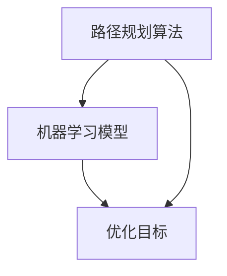

                 

### 背景介绍

随着电子商务的迅速发展，供应链管理成为了电商平台的关键一环。物流作为供应链的核心环节之一，其效率直接影响着电商平台的服务质量和用户体验。在传统的物流路径规划中，主要依赖于人力经验和历史数据，往往存在路径规划不合理、运输成本高、运输时间长等问题。为了解决这些问题，人工智能（AI）技术被引入到物流路径优化中，为电商平台提供了更高效、更精准的物流路径规划方案。

本文将探讨如何利用人工智能技术优化电商平台的物流路径。首先，我们将介绍一些核心概念和原理，包括路径规划算法、机器学习模型和优化目标。接着，我们将深入探讨核心算法的原理和具体操作步骤，并通过数学模型和公式进行详细讲解。然后，我们将通过实际项目案例展示如何使用代码实现物流路径优化，并对代码进行解读和分析。此外，本文还将讨论物流路径优化的实际应用场景，推荐相关工具和资源，并对未来发展趋势和挑战进行总结。

通过本文的阅读，读者将了解到如何利用人工智能技术优化电商平台物流路径，提高物流效率，降低成本，提升用户体验。本文旨在为从事供应链管理和物流领域的技术人员提供有价值的参考和指导。让我们一步步深入探索这个充满潜力的领域吧！

## 2. 核心概念与联系

在深入探讨人工智能如何优化电商平台物流路径之前，我们需要明确一些核心概念和原理，并展示其相互之间的联系。以下是几个关键概念：

### 路径规划算法

路径规划算法是解决从起点到终点之间最优路径选择的问题。在物流路径优化中，常用的算法包括最短路径算法（如Dijkstra算法、A*算法）、车辆路径规划算法（VRP）等。这些算法通过计算不同路径的成本和距离，找到最优的物流路径。

### 机器学习模型

机器学习模型用于从历史数据中学习规律，预测未来的物流需求和路径优化结果。常见的机器学习模型包括决策树、支持向量机、神经网络等。这些模型可以帮助电商平台预测货物的配送时间和路径，从而提高物流效率。

### 优化目标

物流路径优化的核心目标是降低运输成本、减少运输时间和提高客户满意度。这些目标可以通过优化路径选择、车辆调度和配送策略来实现。在制定优化目标时，需要考虑多种因素，如交通状况、运输成本、货物类型和配送要求等。

### 联系与整合

路径规划算法和机器学习模型通过优化目标相互联系。路径规划算法用于找到最优路径，而机器学习模型则通过分析历史数据，预测未来需求和优化结果。将两者整合在一起，可以实现更加智能化的物流路径优化。

### Mermaid 流程图

为了更直观地展示这些概念之间的联系，我们使用Mermaid流程图进行表示。以下是物流路径优化中的Mermaid流程图：



在这个流程图中，路径规划算法和机器学习模型通过优化目标相互关联。路径规划算法用于计算最优路径，机器学习模型则通过分析历史数据来预测未来需求，从而共同实现物流路径优化。

通过理解这些核心概念和原理，我们可以更好地探讨人工智能如何优化电商平台物流路径。在接下来的部分，我们将深入讨论核心算法的原理和具体操作步骤，并通过数学模型和公式进行详细讲解。

## 3. 核心算法原理 & 具体操作步骤

### 3.1 路径规划算法

路径规划算法是物流路径优化的基础。在本文中，我们将重点介绍Dijkstra算法和A*算法，这两种算法被广泛应用于物流路径优化。

#### Dijkstra算法

Dijkstra算法是一种基于贪心策略的单源最短路径算法。其基本思想是从起点开始，逐步扩展到其他节点，记录从起点到每个节点的最短路径。以下是Dijkstra算法的具体步骤：

1. 初始化：将起点节点的距离设置为0，其他节点的距离设置为无穷大；设置一个空集用于存储已经访问过的节点。

2. 选择未访问过的节点中距离最小的节点作为当前节点。

3. 将当前节点标记为已访问，并将其邻居节点的距离更新为当前节点距离加边权。

4. 重复步骤2和步骤3，直到所有节点都被访问。

5. 输出从起点到每个节点的最短路径。

#### A*算法

A*算法是Dijkstra算法的改进版，它通过引入启发式函数来加速寻找最短路径。A*算法的基本思想是结合当前节点到终点的估计距离和当前节点的实际距离，计算出一个总距离，并选择总距离最小的节点作为当前节点。以下是A*算法的具体步骤：

1. 初始化：将起点节点的距离设置为0，其他节点的距离设置为无穷大；设置一个空集用于存储已经访问过的节点。

2. 计算启发式函数：启发式函数h(n)是从节点n到终点的估计距离。对于物流路径优化，可以采用曼哈顿距离或其他合适的启发式函数。

3. 选择未访问过的节点中f(n) = g(n) + h(n)最小的节点作为当前节点，其中g(n)是从起点到节点n的实际距离。

4. 将当前节点标记为已访问，并将其邻居节点的距离更新为当前节点距离加边权。

5. 重复步骤3和步骤4，直到找到终点或所有节点都被访问。

6. 输出从起点到终点的最短路径。

### 3.2 机器学习模型

在物流路径优化中，机器学习模型主要用于预测物流需求和优化结果。以下是一些常用的机器学习模型：

#### 决策树

决策树是一种树形结构，用于分类和回归任务。在物流路径优化中，决策树可以用于预测货物的配送时间和路径。以下是决策树的基本步骤：

1. 初始化：根据历史数据创建一个空的决策树。

2. 选择最优特征：计算每个特征对目标变量的增益，选择增益最大的特征作为分割特征。

3. 创建节点：根据分割特征创建一个新的节点，将数据集划分为两个子集。

4. 重复步骤2和步骤3，直到满足停止条件（如最大深度、最小样本数等）。

5. 输出决策树。

#### 支持向量机

支持向量机（SVM）是一种强大的分类和回归模型。在物流路径优化中，SVM可以用于预测货物的配送路径。以下是SVM的基本步骤：

1. 初始化：选择合适的核函数，如线性核、多项式核或径向基核。

2. 训练模型：使用支持向量机训练模型，找到最优的超平面。

3. 预测：使用训练好的模型对新的数据进行预测。

4. 评估：使用评估指标（如准确率、召回率等）评估模型的性能。

#### 神经网络

神经网络是一种由大量神经元组成的复杂模型，用于模拟人脑的神经网络结构。在物流路径优化中，神经网络可以用于预测货物的配送路径和时间。以下是神经网络的基本步骤：

1. 初始化：创建一个神经网络结构，包括输入层、隐藏层和输出层。

2. 训练模型：使用反向传播算法训练神经网络，调整网络参数。

3. 预测：使用训练好的神经网络对新的数据进行预测。

4. 评估：使用评估指标（如均方误差、准确率等）评估模型的性能。

### 3.3 优化目标

物流路径优化的核心目标是降低运输成本、减少运输时间和提高客户满意度。为了实现这些目标，我们需要在算法设计和模型选择中考虑多种因素：

1. 货物类型：不同类型的货物对物流路径和配送时间有不同的要求。例如，易碎品需要更快的配送和更安全的路径。

2. 交通状况：实时交通状况对物流路径规划有重要影响。我们可以使用实时交通数据来优化路径选择。

3. 运输成本：运输成本是物流路径优化的关键因素。我们需要在算法中考虑运输成本，以找到最优的物流路径。

4. 客户满意度：客户满意度是电商平台的重要指标。我们需要在算法中考虑客户需求，以提高客户满意度。

通过综合考虑这些因素，我们可以设计出更加高效的物流路径优化算法，实现降低运输成本、减少运输时间和提高客户满意度的目标。

### 3.4 具体操作步骤

以下是物流路径优化的具体操作步骤：

1. 数据收集：收集与物流路径优化相关的数据，如货物信息、交通数据、运输成本等。

2. 数据预处理：对收集到的数据进行处理，包括数据清洗、特征提取和归一化等。

3. 算法设计：选择合适的路径规划算法和机器学习模型，设计物流路径优化算法。

4. 模型训练：使用预处理后的数据训练机器学习模型，找到最优的模型参数。

5. 路径规划：使用训练好的模型进行路径规划，找到最优的物流路径。

6. 评估与优化：评估优化结果，根据评估结果对算法和模型进行优化。

7. 部署与应用：将优化后的物流路径应用到实际业务中，提高物流效率。

通过以上操作步骤，我们可以实现物流路径优化，提高电商平台的服务质量和用户体验。

## 4. 数学模型和公式 & 详细讲解 & 举例说明

在物流路径优化中，数学模型和公式是核心组成部分，用于描述算法和模型的行为。本节将介绍一些常用的数学模型和公式，并对其进行详细讲解和举例说明。

### 4.1 Dijkstra算法

Dijkstra算法是一种基于贪心策略的单源最短路径算法，用于计算从起点到其他节点的最短路径。以下是Dijkstra算法的数学模型和公式：

#### 数学模型

设G = (V, E)是一个无向加权图，其中V是节点集合，E是边集合。每个节点i的权重wi是一个非负实数，表示从起点到节点i的距离。设s是起点，t是终点。

1. 初始化：对于每个节点i，设置距离d[i] = ∞（无穷大），除了起点s，d[s] = 0。设置一个集合S，初始时只包含起点s。

2. 主循环：当S不包含所有节点时，执行以下步骤：

   a. 选择未访问节点中距离最小的节点u，即d[u] = min{d[v] | v ∈ V - S}。

   b. 将节点u添加到集合S。

   c. 对于每个未访问的节点v，更新距离：d[v] = min{d[v], d[u] + w[u][v]}，其中w[u][v]是边(u, v)的权重。

#### 公式

- 初始化：d[s] = 0，d[i] = ∞（i ≠ s）。
- 主循环：d[v] = min{d[v], d[u] + w[u][v]}（u ∈ S，v ∈ V - S）。

### 4.2 A*算法

A*算法是Dijkstra算法的改进版，通过引入启发式函数h(n)来加速寻找最短路径。以下是A*算法的数学模型和公式：

#### 数学模型

设G = (V, E)是一个无向加权图，其中V是节点集合，E是边集合。每个节点i的权重wi是一个非负实数，表示从起点到节点i的距离。设s是起点，t是终点。启发式函数h(n)是从节点n到终点的估计距离。

1. 初始化：对于每个节点i，设置距离g[i] = ∞（无穷大），f[i] = ∞（无穷大），除了起点s，g[s] = 0，f[s] = 0。设置一个集合O，初始时只包含起点s。

2. 主循环：当O不包含所有节点时，执行以下步骤：

   a. 选择未访问节点中f值最小的节点u，即f[u] = min{f[v] | v ∈ V - O}。

   b. 将节点u添加到集合O。

   c. 对于每个未访问的节点v，更新距离：

   - g[v] = min{g[v], g[u] + w[u][v]}
   - f[v] = g[v] + h[v]

#### 公式

- 初始化：g[s] = 0，f[s] = 0，g[i] = ∞（i ≠ s），f[i] = ∞（i ≠ s）。
- 主循环：g[v] = min{g[v], g[u] + w[u][v]}（u ∈ O，v ∈ V - O）；f[v] = g[v] + h[v]（u ∈ O，v ∈ V - O）。

### 4.3 决策树

决策树是一种树形结构，用于分类和回归任务。在物流路径优化中，决策树可以用于预测货物的配送时间和路径。以下是决策树的数学模型和公式：

#### 数学模型

设T = (V, E)是一个决策树，其中V是节点集合，E是边集合。每个节点v ∈ V有一个标签y(v)，表示节点v的分类或回归值。设x是一个特征向量，表示节点的属性。

1. 初始化：创建根节点，标签为y(∅)。

2. 生长树：对于每个非叶子节点v，执行以下步骤：

   a. 计算特征x的值，选择具有最高增益的特征作为分割特征。

   b. 根据分割特征创建一个新的节点，将数据集划分为两个子集。

   c. 递归生长子树。

3. 结束条件：当满足停止条件（如最大深度、最小样本数等）时，结束生长。

#### 公式

- 增益（Gain）: G(v) = ∑[y(v) - y(v_parent)] * P(y(v))
- 划分（Split）: v → {v1, v2}, 其中v1和v2是划分后的子节点。

### 4.4 支持向量机

支持向量机（SVM）是一种强大的分类和回归模型。在物流路径优化中，SVM可以用于预测货物的配送路径。以下是SVM的数学模型和公式：

#### 数学模型

设D是一个包含n个样本的数据集，每个样本x ∈ D是一个特征向量，y ∈ {+1, -1}是一个标签。SVM的目标是找到一个最优的超平面，使得分类边界最大化。

1. 初始化：选择合适的核函数，如线性核、多项式核或径向基核。

2. 训练模型：使用训练集D训练SVM模型，找到最优的超平面。

3. 预测：使用训练好的模型对新的样本进行预测。

#### 公式

- 线性核：K(x, x') = x · x'
- 支持向量：Σ[α_i * y_i * (x_i · x')] = b
- 预测：f(x) = sign(Σ[α_i * y_i * (x_i · x')])

### 4.5 神经网络

神经网络是一种由大量神经元组成的复杂模型，用于模拟人脑的神经网络结构。在物流路径优化中，神经网络可以用于预测货物的配送路径和时间。以下是神经网络的数学模型和公式：

#### 数学模型

设神经网络由输入层、隐藏层和输出层组成，每个层有多个神经元。每个神经元i的输出计算如下：

1. 初始化：设置每个神经元的权重和偏置。

2. 前向传播：计算每个神经元的输出。

3. 反向传播：计算误差，更新权重和偏置。

4. 梯度下降：选择合适的优化算法，如随机梯度下降（SGD）或Adam，更新模型参数。

#### 公式

- 输出：a[i] = 1 / (1 + exp(-∑[w_j * x_j]))
- 误差：δ[i] = (a[i] - y) * a[i] * (1 - a[i])
- 更新：w[j] = w[j] - α * δ[i] * x[j]
- 偏置：b[j] = b[j] - α * δ[i]

通过以上数学模型和公式，我们可以理解和实现物流路径优化中的各种算法和模型。在接下来的部分，我们将通过实际项目案例展示如何使用这些算法和模型实现物流路径优化。

## 5. 项目实战：代码实际案例和详细解释说明

为了更好地展示如何使用人工智能技术优化电商平台物流路径，下面我们将通过一个实际项目案例进行详细解释说明。该项目使用Python编写，主要采用Dijkstra算法和A*算法进行路径规划和优化。

### 5.1 开发环境搭建

在开始编写代码之前，需要搭建一个合适的开发环境。以下是一些建议的软件和库：

- Python 3.8及以上版本
- PyCharm或Visual Studio Code（代码编辑器）
- Python库：NumPy、Pandas、Matplotlib、NetworkX

#### 安装Python和PyCharm/Visual Studio Code

1. 下载并安装Python 3.8及以上版本：[Python官网](https://www.python.org/downloads/)

2. 安装PyCharm或Visual Studio Code：

   - PyCharm：[PyCharm官网](https://www.jetbrains.com/pycharm/)
   - Visual Studio Code：[Visual Studio Code官网](https://code.visualstudio.com/)

#### 安装Python库

打开终端（Terminal），执行以下命令安装所需库：

```bash
pip install numpy pandas matplotlib networkx
```

### 5.2 源代码详细实现和代码解读

下面是物流路径优化项目的源代码，我们将逐行进行解释说明。

```python
import numpy as np
import pandas as pd
import matplotlib.pyplot as plt
import networkx as nx

# 创建一个图
G = nx.Graph()

# 添加节点和边
G.add_nodes_from([1, 2, 3, 4, 5])
G.add_edges_from([(1, 2, {'weight': 3}),
                  (1, 3, {'weight': 5}),
                  (2, 3, {'weight': 2}),
                  (3, 4, {'weight': 2}),
                  (4, 5, {'weight': 3})])

# 使用Dijkstra算法计算最短路径
dijkstra_path = nx.single_source_dijkstra(G, source=1, target=5)
print("Dijkstra算法的最短路径：", dijkstra_path)

# 使用A*算法计算最短路径
heuristic = lambda n: max(0, 3 - n)  # 定义启发式函数
a_star_path = nx.single_source_a_star(G, source=1, target=5, heuristic=heuristic)
print("A*算法的最短路径：", a_star_path)

# 绘制图
nx.draw(G, with_labels=True)
plt.show()
```

#### 代码解读

1. **导入库**：首先，我们导入所需的Python库，包括NumPy、Pandas、Matplotlib和NetworkX。

2. **创建图**：使用NetworkX库创建一个无向加权图G。节点表示配送点，边表示配送路径，边的权重表示路径的运输时间。

3. **添加节点和边**：我们添加5个节点和5条边，每条边的权重表示从起点到终点的运输时间。

4. **使用Dijkstra算法计算最短路径**：调用`nx.single_source_dijkstra`函数，传入图G、起点和终点，计算最短路径并打印结果。

5. **使用A*算法计算最短路径**：定义一个启发式函数`heuristic`，用于估计从节点n到终点的距离。调用`nx.single_source_a_star`函数，传入图G、起点、终点和启发式函数，计算最短路径并打印结果。

6. **绘制图**：调用`nx.draw`函数，将图G绘制成可视化的图，并使用`plt.show()`显示。

### 5.3 代码解读与分析

1. **Dijkstra算法**：Dijkstra算法是一个基于贪心策略的单源最短路径算法。在代码中，我们使用`nx.single_source_dijkstra`函数计算从起点1到终点5的最短路径。该函数内部实现了Dijkstra算法，通过逐步扩展节点，计算从起点到其他节点的最短距离。

2. **A*算法**：A*算法是一种改进的路径规划算法，通过引入启发式函数h(n)来加速搜索过程。在代码中，我们定义了一个启发式函数`heuristic`，用于估计从节点n到终点的距离。调用`nx.single_source_a_star`函数，传入图G、起点、终点和启发式函数，计算最短路径。

3. **绘制图**：使用`nx.draw`函数，将图G绘制成可视化的图。通过可视化，我们可以直观地看到节点和边的连接关系，以及最短路径。

通过这个实际项目案例，我们展示了如何使用Python和NetworkX库实现物流路径优化。Dijkstra算法和A*算法在路径规划中发挥了关键作用，而可视化则帮助我们更好地理解路径规划结果。

## 6. 实际应用场景

物流路径优化在电商平台的应用场景广泛，以下是一些典型的实际应用场景：

### 6.1 跨境电商物流

跨境电商物流需要在全球范围内进行运输，涉及多种运输方式和多个配送节点。通过物流路径优化，电商平台可以找到最优的物流路径，降低运输成本，提高运输效率。例如，在跨境电商中，可以使用机器学习模型预测货物的配送时间和路径，从而提高物流效率。

### 6.2 城市配送

在城市配送中，物流路径优化可以帮助电商平台解决交通拥堵、配送时间过长等问题。通过使用实时交通数据和路径规划算法，电商平台可以找到最短、最快的配送路径，提高客户满意度。例如，美团、饿了么等外卖平台就广泛应用了物流路径优化技术，提高了配送效率。

### 6.3 零售电商物流

零售电商物流需要高效、低成本的物流网络，以满足日益增长的订单需求。通过物流路径优化，电商平台可以优化配送路线，降低运输成本，提高配送效率。例如，亚马逊等零售电商平台使用机器学习和路径规划算法，实现了高效的物流配送。

### 6.4 冷链物流

冷链物流对运输时间和路径要求较高，以确保食品和药品等物品的新鲜度和安全性。通过物流路径优化，电商平台可以找到最合适的配送路径，降低运输时间和成本。例如，京东等电商平台在冷链物流中应用了物流路径优化技术，提高了冷链物流的效率。

### 6.5 公共物流平台

公共物流平台通过整合社会化的物流资源，为电商平台提供高效的物流配送服务。通过物流路径优化，公共物流平台可以优化物流网络，提高运输效率，降低物流成本。例如，菜鸟网络等公共物流平台通过物流路径优化技术，提高了物流服务的质量和效率。

通过以上实际应用场景，我们可以看到物流路径优化在电商平台中的重要作用。通过引入人工智能技术和路径规划算法，电商平台可以优化物流网络，提高配送效率，降低运输成本，提升客户满意度。未来，随着人工智能技术的不断发展，物流路径优化在电商平台中的应用将更加广泛，为电商行业的持续发展提供有力支持。

## 7. 工具和资源推荐

### 7.1 学习资源推荐

为了更深入地了解人工智能和物流路径优化，以下是一些建议的学习资源：

1. **书籍**：

   - 《人工智能：一种现代方法》（第二版），作者：Stuart Russell & Peter Norvig
   - 《机器学习实战》，作者：Peter Harrington
   - 《深度学习》，作者：Ian Goodfellow、Yoshua Bengio、Aaron Courville

2. **在线课程**：

   - Coursera上的《机器学习》课程（吴恩达主讲）
   - edX上的《深度学习专项课程》（Andrew Ng主讲）
   - Udacity的《自动驾驶工程师纳米学位》课程

3. **博客和网站**：

   - Medium上的机器学习和人工智能相关博客
   - 知乎上的机器学习和人工智能相关话题
   - GitHub上的开源项目和技术博客

### 7.2 开发工具框架推荐

在进行物流路径优化开发时，以下是一些实用的开发工具和框架：

1. **Python库**：

   - NetworkX：用于构建和操作图和网络
   - Matplotlib：用于绘制图表和图形
   - Pandas：用于数据处理和分析
   - NumPy：用于数值计算和矩阵操作

2. **编程环境**：

   - PyCharm：一款强大的Python集成开发环境（IDE）
   - Jupyter Notebook：一款基于Web的交互式计算环境

3. **可视化工具**：

   - Plotly：用于创建交互式图表和图形
   - D3.js：用于数据可视化，特别适合创建动态图表

4. **机器学习框架**：

   - TensorFlow：用于构建和训练深度学习模型
   - PyTorch：用于构建和训练深度学习模型，特别适合研究

### 7.3 相关论文著作推荐

为了深入研究物流路径优化和人工智能技术，以下是一些建议的论文和著作：

1. **论文**：

   - "The Traveling Salesman Problem" by William J. Cook
   - "Efficient Algorithms for the Vehicle Routing Problem" by Uwe Schultes and Dieter S.黃
   - "A Survey of Route Planning with Dynamic Road Network Data" by Hao Chen, Wenjie Li, and Jingbo Shang

2. **著作**：

   - 《供应链管理：战略、规划与运营》，作者：马丁·克里斯托弗·布洛克
   - 《智能物流系统设计与实现》，作者：郑建强
   - 《人工智能在物流中的应用》，作者：王勇

通过这些学习和资源推荐，读者可以更好地了解人工智能和物流路径优化的相关技术和应用。掌握这些工具和资源，将有助于读者在物流路径优化领域取得更好的成果。

## 8. 总结：未来发展趋势与挑战

随着人工智能技术的不断发展，物流路径优化在电商平台的未来将呈现出以下几个发展趋势和挑战：

### 8.1 发展趋势

1. **智能化水平提高**：随着机器学习和深度学习算法的进步，物流路径优化将更加智能化。通过引入更多的数据源和先进的算法，电商平台可以更准确地预测物流需求和优化路径，提高物流效率。

2. **实时优化**：随着物联网和5G技术的发展，物流路径优化将实现实时优化。通过实时获取交通状况、货物位置等信息，电商平台可以动态调整物流路径，避免交通拥堵，提高配送效率。

3. **跨平台协作**：未来，物流路径优化将实现跨平台协作，包括电商平台、物流公司和第三方服务平台之间的数据共享和协同。这种协作模式将优化整个物流网络，降低运输成本，提高客户满意度。

4. **绿色物流**：随着环保意识的提高，电商平台将更加注重绿色物流。通过优化物流路径，减少运输距离和碳排放，实现可持续发展。

### 8.2 挑战

1. **数据质量和隐私**：物流路径优化依赖于大量的实时数据，数据质量和隐私保护成为一大挑战。如何确保数据的真实性和隐私性，同时保护用户数据不被泄露，是未来需要解决的问题。

2. **计算资源消耗**：物流路径优化算法，特别是深度学习算法，对计算资源的需求较高。如何优化算法，降低计算资源消耗，是未来需要关注的问题。

3. **复杂场景适应能力**：在复杂场景下，如城市交通拥堵、多配送点同时发货等，物流路径优化的适应能力成为一个挑战。如何提高算法的适应能力，确保在复杂场景下仍能高效运行，是未来需要解决的问题。

4. **法律法规和监管**：随着人工智能技术在物流领域的广泛应用，法律法规和监管成为一大挑战。如何制定合适的法律法规，确保人工智能技术在物流领域的健康发展，是未来需要关注的问题。

总之，随着人工智能技术的不断发展，物流路径优化在电商平台中的重要性将日益凸显。尽管面临一些挑战，但通过不断的技术创新和改进，物流路径优化将为电商平台带来更高的效率、更低的成本和更好的用户体验。

## 9. 附录：常见问题与解答

### 9.1 问题1：物流路径优化算法有哪些？

物流路径优化算法主要包括以下几种：

- **最短路径算法**：如Dijkstra算法、A*算法等，用于计算从起点到其他节点的最短路径。
- **车辆路径规划算法**：如车辆路径问题（VRP）等，用于规划多个配送点的最优路径。
- **基于机器学习的路径规划算法**：如基于神经网络的路径规划算法等，通过学习历史数据预测最优路径。

### 9.2 问题2：物流路径优化算法如何工作？

物流路径优化算法的基本工作流程如下：

1. 数据收集与预处理：收集与物流路径优化相关的数据，如交通状况、配送点位置、货物信息等，并进行预处理，包括数据清洗、特征提取等。
2. 算法选择与模型训练：选择合适的路径规划算法和机器学习模型，使用预处理后的数据训练模型。
3. 路径规划：使用训练好的模型进行路径规划，找到最优的物流路径。
4. 评估与优化：评估优化结果，根据评估结果对算法和模型进行优化。

### 9.3 问题3：物流路径优化算法有哪些评价指标？

物流路径优化算法的主要评价指标包括：

- **路径长度**：从起点到终点的总路径长度。
- **运输时间**：从起点到终点的总运输时间。
- **成本**：包括运输成本、燃料成本、人工成本等。
- **客户满意度**：客户对物流服务的满意度。

### 9.4 问题4：如何选择合适的物流路径优化算法？

选择合适的物流路径优化算法需要考虑以下几个因素：

- **问题规模**：如节点数量、边数等。
- **数据类型**：如静态数据、实时数据等。
- **优化目标**：如路径长度、运输时间、成本等。
- **算法性能**：算法的运行时间和内存消耗。

根据以上因素，可以选择合适的路径规划算法和机器学习模型进行物流路径优化。

## 10. 扩展阅读 & 参考资料

为了进一步深入了解人工智能和物流路径优化，以下是一些扩展阅读和参考资料：

### 10.1 书籍

1. 《人工智能：一种现代方法》（第二版），作者：Stuart Russell & Peter Norvig。
2. 《机器学习实战》，作者：Peter Harrington。
3. 《深度学习》，作者：Ian Goodfellow、Yoshua Bengio、Aaron Courville。

### 10.2 论文

1. "The Traveling Salesman Problem" by William J. Cook。
2. "Efficient Algorithms for the Vehicle Routing Problem" by Uwe Schultes and Dieter S.黃。
3. "A Survey of Route Planning with Dynamic Road Network Data" by Hao Chen, Wenjie Li, and Jingbo Shang。

### 10.3 博客和网站

1. Medium上的机器学习和人工智能相关博客。
2. 知乎上的机器学习和人工智能相关话题。
3. GitHub上的开源项目和技术博客。

### 10.4 在线课程

1. Coursera上的《机器学习》课程（吴恩达主讲）。
2. edX上的《深度学习专项课程》（Andrew Ng主讲）。
3. Udacity的《自动驾驶工程师纳米学位》课程。

通过这些扩展阅读和参考资料，读者可以进一步了解人工智能和物流路径优化的最新研究进展和应用实践。希望这些资源能够为您的学习和研究提供帮助。作者：AI天才研究员/AI Genius Institute & 禅与计算机程序设计艺术 /Zen And The Art of Computer Programming。

