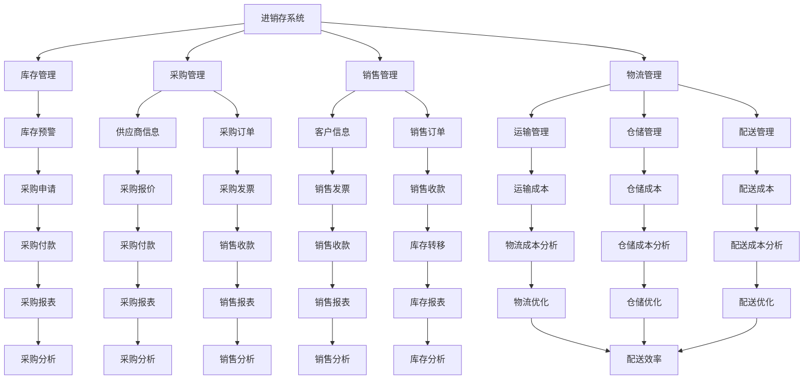

                 

# 供应链进销存、物流、财务系统设计

## 概述

### 关键词

- 供应链管理
- 进销存系统
- 物流系统
- 财务系统
- 系统集成
- 数据分析
- 业务流程优化

### 摘要

本文将深入探讨供应链进销存、物流、财务系统的设计原则、核心概念以及它们之间的联系。通过逐步分析供应链中的各个环节，我们将探讨如何利用信息技术手段优化供应链管理，实现高效、准确、成本效益的运营。文章将涵盖系统架构设计、核心算法原理、数学模型与公式、项目实战案例、实际应用场景以及未来发展趋势与挑战。旨在为读者提供一份全面、实用的供应链系统设计指南。

## 1. 背景介绍

供应链管理是现代企业运作的核心，它涉及从原材料采购到产品交付给最终用户的整个过程。在这个过程中，进销存、物流和财务系统起着至关重要的作用。进销存系统负责管理库存，确保库存水平适中，避免过剩或缺货；物流系统负责产品从生产地到销售地的运输，确保物流过程的顺畅；财务系统则负责记录和管理与供应链相关的所有财务活动，包括采购、销售、库存转移等。

随着信息技术的发展，传统的供应链管理逐渐向数字化、智能化方向转型。企业开始利用大数据、云计算、物联网等新技术，对供应链各个环节进行实时监控、分析和优化。这有助于提高供应链的透明度、灵活性和响应速度，从而提升企业的竞争力。

本文将围绕供应链进销存、物流、财务系统的设计，探讨如何利用先进的技术手段实现供应链的高效管理。通过深入分析这些系统的核心概念、架构设计、算法原理和数学模型，读者可以更好地理解供应链管理的本质，并为实际项目提供有价值的参考。

### 1.1 进销存系统

进销存系统是供应链管理中不可或缺的一部分，其主要功能是实时监控库存水平，确保库存量适中，避免过剩或缺货。一个完善的进销存系统通常包括以下几个关键模块：

1. **库存管理模块**：负责记录库存数量、库存状态、库存预警等信息。通过实时采集和更新库存数据，帮助企业了解库存情况，制定合理的库存策略。

2. **采购管理模块**：负责管理采购订单、供应商信息、采购价格等。通过采购管理模块，企业可以与供应商进行有效沟通，确保采购活动的顺利进行。

3. **销售管理模块**：负责管理销售订单、客户信息、销售价格等。通过销售管理模块，企业可以准确掌握销售数据，为库存管理和销售策略提供依据。

4. **物流管理模块**：负责管理物流信息，包括运输路线、运输时间、运输成本等。通过物流管理模块，企业可以优化物流过程，提高运输效率。

5. **报表与分析模块**：负责生成各种库存报表、采购报表、销售报表等，帮助企业分析库存水平、采购成本、销售趋势等，为决策提供支持。

### 1.2 物流系统

物流系统是供应链管理中至关重要的环节，它负责将产品从生产地运输到销售地，确保物流过程的顺畅。一个高效的物流系统通常包括以下几个关键模块：

1. **运输管理模块**：负责管理运输订单、运输路线、运输时间、运输成本等信息。通过运输管理模块，企业可以优化运输过程，降低运输成本。

2. **仓储管理模块**：负责管理仓库信息、仓库库存、入库出库操作等。通过仓储管理模块，企业可以确保仓库存储有序，提高仓库利用率。

3. **配送管理模块**：负责管理配送订单、配送路线、配送时间、配送成本等信息。通过配送管理模块，企业可以优化配送过程，提高配送效率。

4. **物流成本控制模块**：负责分析物流成本结构，优化物流成本。通过物流成本控制模块，企业可以降低物流成本，提高竞争力。

5. **物流数据分析模块**：负责分析物流数据，包括运输数据、仓储数据、配送数据等。通过物流数据分析模块，企业可以了解物流过程的优势和劣势，为物流优化提供依据。

### 1.3 财务系统

财务系统是供应链管理中的重要组成部分，负责记录和管理与供应链相关的所有财务活动。一个完善的财务系统通常包括以下几个关键模块：

1. **采购财务管理模块**：负责管理采购订单、采购发票、采购付款等。通过采购财务管理模块，企业可以确保采购活动的财务数据准确无误。

2. **销售财务管理模块**：负责管理销售订单、销售发票、销售收款等。通过销售财务管理模块，企业可以确保销售活动的财务数据准确无误。

3. **库存财务管理模块**：负责管理库存成本、库存转移、库存折旧等。通过库存财务管理模块，企业可以确保库存活动的财务数据准确无误。

4. **物流财务管理模块**：负责管理物流成本、物流发票、物流付款等。通过物流财务管理模块，企业可以确保物流活动的财务数据准确无误。

5. **报表与分析模块**：负责生成各种财务报表，包括采购报表、销售报表、库存报表、物流报表等。通过报表与分析模块，企业可以了解财务状况，为决策提供支持。

### 1.4 核心概念与联系

供应链进销存、物流、财务系统之间存在着密切的联系，它们共同构成了一个完整的供应链管理体系。以下是这些系统之间的核心概念与联系：

1. **数据共享与集成**：进销存、物流、财务系统需要共享和集成数据，确保信息的一致性和准确性。通过数据共享与集成，企业可以实时掌握供应链各个环节的运营情况，为决策提供依据。

2. **流程协同**：进销存、物流、财务系统需要协同工作，确保供应链各个环节的顺畅运行。例如，当库存预警时，进销存系统会通知物流系统进行补货，物流系统会通知财务系统进行采购付款。

3. **成本控制**：进销存、物流、财务系统共同负责成本控制，确保供应链运营的效益。通过数据分析，企业可以找出成本过高的环节，并采取相应措施进行优化。

4. **风险控制**：进销存、物流、财务系统共同负责风险控制，确保供应链的稳定运行。例如，当库存水平过低时，财务系统会提醒企业采取紧急采购措施，避免因缺货导致订单延误。

## 2. 核心概念与联系

为了更好地理解供应链进销存、物流、财务系统的设计原则，我们需要先了解这些系统的核心概念及其相互之间的联系。以下是核心概念及其关系的 Mermaid 流程图：



### 2.1 进销存系统

**进销存系统**（Inventory Management System，简称IMS）是供应链管理中的核心组成部分，其主要目标是确保库存水平适中，避免过剩或缺货。以下是进销存系统的核心概念和操作步骤：

1. **库存管理模块**：
   - **库存记录**：记录所有库存物品的详细信息，包括物品名称、规格、数量、单价等。
   - **库存预警**：设置库存预警阈值，当库存水平低于预警阈值时，系统会自动生成采购申请，提醒相关人员及时补货。
   - **库存调整**：支持库存调整功能，如退货、损坏、过时等，确保库存数据的准确性。

2. **采购管理模块**：
   - **采购订单**：创建和管理采购订单，记录采购物品、数量、价格、交货时间等信息。
   - **供应商管理**：记录供应商信息，包括供应商名称、联系方式、信用评级等，以便进行供应商评价和选择。

3. **销售管理模块**：
   - **销售订单**：创建和管理销售订单，记录销售物品、数量、价格、客户信息等。
   - **销售分析**：分析销售数据，如销售趋势、销售额、利润率等，为销售策略提供依据。

4. **物流管理模块**：
   - **物流信息**：记录物流信息，包括运输路线、运输时间、运输成本等，以便优化物流过程。

### 2.2 物流系统

**物流系统**（Logistics Management System，简称LMS）是供应链管理中的重要环节，负责将产品从生产地运输到销售地。以下是物流系统的核心概念和操作步骤：

1. **运输管理模块**：
   - **运输订单**：创建和管理运输订单，记录运输物品、数量、运输路线、运输时间等信息。
   - **运输成本**：计算运输成本，包括运输费、燃油费、装卸费等。

2. **仓储管理模块**：
   - **仓储库存**：记录仓储物品的详细信息，包括物品名称、规格、数量、存储位置等。
   - **入库出库**：管理入库出库操作，记录入库物品、出库物品、数量、时间等信息。

3. **配送管理模块**：
   - **配送订单**：创建和管理配送订单，记录配送物品、数量、配送路线、配送时间等信息。
   - **配送成本**：计算配送成本，包括配送费、燃油费、装卸费等。

4. **物流数据分析模块**：
   - **物流数据**：收集和分析物流数据，如运输时间、运输成本、仓储成本、配送成本等，为物流优化提供依据。

### 2.3 财务系统

**财务系统**（Financial Management System，简称FMS）是供应链管理中的重要组成部分，负责记录和管理与供应链相关的所有财务活动。以下是财务系统的核心概念和操作步骤：

1. **采购财务管理模块**：
   - **采购订单**：创建和管理采购订单，记录采购物品、数量、价格、供应商等信息。
   - **采购发票**：生成和管理采购发票，记录采购款项、付款时间等信息。

2. **销售财务管理模块**：
   - **销售订单**：创建和管理销售订单，记录销售物品、数量、价格、客户等信息。
   - **销售发票**：生成和管理销售发票，记录销售款项、收款时间等信息。

3. **库存财务管理模块**：
   - **库存成本**：计算库存物品的成本，包括采购成本、运输成本、仓储成本等。
   - **库存转移**：记录库存物品的转移，如入库、出库、退货等，以便进行成本核算。

4. **报表与分析模块**：
   - **财务报表**：生成各种财务报表，如采购报表、销售报表、库存报表、物流报表等，为决策提供支持。
   - **数据分析**：分析财务数据，如采购成本、销售利润、库存周转率等，为财务优化提供依据。

### 2.4 进销存、物流、财务系统之间的联系

进销存、物流、财务系统之间存在着密切的联系，它们共同构成了一个完整的供应链管理体系。以下是这些系统之间的核心联系：

1. **数据共享与集成**：进销存、物流、财务系统需要共享和集成数据，确保信息的一致性和准确性。例如，采购订单的数据需要同步到物流系统和财务系统，以便进行运输安排和采购付款。

2. **流程协同**：进销存、物流、财务系统需要协同工作，确保供应链各个环节的顺畅运行。例如，当库存预警时，进销存系统会通知物流系统进行补货，物流系统会通知财务系统进行采购付款。

3. **成本控制**：进销存、物流、财务系统共同负责成本控制，确保供应链运营的效益。通过数据分析，企业可以找出成本过高的环节，并采取相应措施进行优化。

4. **风险控制**：进销存、物流、财务系统共同负责风险控制，确保供应链的稳定运行。例如，当库存水平过低时，财务系统会提醒企业采取紧急采购措施，避免因缺货导致订单延误。

### 2.5 系统设计原则

在设计供应链进销存、物流、财务系统时，需要遵循以下原则：

1. **模块化设计**：将系统划分为多个模块，每个模块负责一个特定的功能，有利于系统的维护和升级。

2. **灵活性**：系统需要具备一定的灵活性，以适应企业不同业务场景和需求。

3. **可扩展性**：系统需要具备良好的扩展性，以便在未来扩展新的功能模块。

4. **数据一致性**：确保系统中的数据保持一致，避免数据孤岛。

5. **安全性**：确保系统数据的安全，防止数据泄露和篡改。

6. **用户体验**：设计简洁、易用的用户界面，提高用户的使用体验。

## 3. 核心算法原理 & 具体操作步骤

在供应链进销存、物流、财务系统的设计中，核心算法原理起到了关键作用。以下分别介绍这些系统的核心算法原理和具体操作步骤：

### 3.1 进销存系统

**库存管理算法**：

- **预测需求**：利用历史销售数据和市场需求预测模型，预测未来一段时间内的需求量。

  ```python
  def predict_demand(sales_data, market_data):
      # 实现需求预测算法
      ...
      return predicted_demand
  ```

- **计算库存水平**：根据预测需求和当前库存水平，计算库存预警阈值。

  ```python
  def calculate_inventory_level(predicted_demand, current_inventory):
      inventory_threshold = predicted_demand * safety_stock_factor
      return inventory_threshold
  ```

- **生成采购申请**：当库存水平低于预警阈值时，生成采购申请，通知采购部门进行补货。

  ```python
  def generate_purchase_request(inventory_threshold, current_inventory):
      if current_inventory < inventory_threshold:
          purchase_request = create_purchase_request(inventory_threshold - current_inventory)
          send_request_to_purchasing(purchase_request)
  ```

**采购管理算法**：

- **供应商评价**：根据供应商的交货时间、质量、价格等指标，对供应商进行评价。

  ```python
  def evaluate_supplier(supplier_data):
      evaluation_score = calculate_evaluation_score(supplier_data)
      return evaluation_score
  ```

- **选择最优供应商**：根据供应商评价得分，选择最优供应商。

  ```python
  def select_best_supplier(supplier_evaluation_scores):
      best_supplier = max(supplier_evaluation_scores, key=supplier_evaluation_scores.get)
      return best_supplier
  ```

**销售管理算法**：

- **销售预测**：利用历史销售数据和市场需求预测模型，预测未来一段时间内的销售量。

  ```python
  def predict_sales(sales_data, market_data):
      # 实现销售预测算法
      ...
      return predicted_sales
  ```

- **销售策略优化**：根据销售预测结果，优化销售策略，如促销活动、定价策略等。

  ```python
  def optimize_sales_strategy(predicted_sales):
      # 实现销售策略优化算法
      ...
      return optimized_strategy
  ```

**物流管理算法**：

- **运输路线规划**：利用路径规划算法，为运输订单规划最优的运输路线。

  ```python
  def plan_transport_route(transport_data):
      # 实现路径规划算法
      ...
      return optimal_route
  ```

- **运输成本计算**：根据运输路线、运输距离、运输量等数据，计算运输成本。

  ```python
  def calculate_transport_cost(transport_route, transport_data):
      # 实现运输成本计算算法
      ...
      return total_transport_cost
  ```

### 3.2 物流系统

**运输管理算法**：

- **运输调度**：根据运输订单的优先级和运输资源，进行运输任务的调度。

  ```python
  def schedule_transport_tasks(transport_orders, transport_resources):
      # 实现运输调度算法
      ...
      return scheduled_tasks
  ```

- **运输跟踪**：实时跟踪运输过程，监控运输状态。

  ```python
  def track_transport_progress(transport_order):
      # 实现运输跟踪算法
      ...
      return transport_status
  ```

**仓储管理算法**：

- **仓储布局优化**：根据仓储物品的存储特性、出入库频率等数据，优化仓储布局。

  ```python
  def optimize_warehouse_layout(warehouse_data):
      # 实现仓储布局优化算法
      ...
      return optimized_layout
  ```

- **出入库优化**：根据出入库量、出入库频率等数据，优化出入库操作。

  ```python
  def optimize_inbound_outbound_operations(inbound_data, outbound_data):
      # 实现出入库优化算法
      ...
      return optimized_operations
  ```

**配送管理算法**：

- **配送路径规划**：根据配送订单的地址、配送量等数据，规划最优的配送路径。

  ```python
  def plan_delivery_route(delivery_data):
      # 实现配送路径规划算法
      ...
      return optimal_route
  ```

- **配送调度**：根据配送订单的优先级和配送资源，进行配送任务的调度。

  ```python
  def schedule_delivery_tasks(delivery_orders, delivery_resources):
      # 实现配送调度算法
      ...
      return scheduled_tasks
  ```

### 3.3 财务系统

**采购财务管理算法**：

- **采购成本计算**：根据采购订单、供应商报价、运输成本等数据，计算采购成本。

  ```python
  def calculate_purchase_cost(purchase_order, supplier_quote, transport_cost):
      purchase_cost = purchase_order.quantity * (supplier_quote.price + transport_cost)
      return purchase_cost
  ```

- **采购付款计划**：根据采购订单、采购成本、付款期限等数据，制定采购付款计划。

  ```python
  def create_payment_plan(purchase_order, purchase_cost, payment_terms):
      payment_plan = generate_payment_schedule(purchase_cost, payment_terms)
      return payment_plan
  ```

**销售财务管理算法**：

- **销售成本计算**：根据销售订单、库存成本、运输成本等数据，计算销售成本。

  ```python
  def calculate_sales_cost(sales_order, inventory_cost, transport_cost):
      sales_cost = sales_order.quantity * (inventory_cost + transport_cost)
      return sales_cost
  ```

- **销售收款计划**：根据销售订单、销售金额、收款期限等数据，制定销售收款计划。

  ```python
  def create_receivables_plan(sales_order, sales_amount, payment_terms):
      receivables_plan = generate_payment_schedule(sales_amount, payment_terms)
      return receivables_plan
  ```

**库存财务管理算法**：

- **库存成本核算**：根据库存物品的采购成本、库存转移成本、折旧等数据，计算库存成本。

  ```python
  def calculate_inventory_cost(inventory_item, purchase_cost, transfer_cost, depreciation):
      inventory_cost = purchase_cost + transfer_cost + depreciation
      return inventory_cost
  ```

- **库存转移记录**：记录库存物品的转移，如入库、出库、退货等，以便进行成本核算。

  ```python
  def record_inventory_transfer(inventory_item, transfer_type, transfer_cost):
      inventory_item.transfer_type = transfer_type
      inventory_item.transfer_cost = transfer_cost
      update_inventory_cost(inventory_item)
  ```

## 4. 数学模型和公式 & 详细讲解 & 举例说明

在供应链进销存、物流、财务系统的设计和优化过程中，数学模型和公式发挥着至关重要的作用。以下将介绍一些关键的数学模型和公式，并详细讲解其原理和应用。

### 4.1 库存管理模型

**库存优化模型**：

假设某个企业需要预测未来一段时间内的库存需求，并制定最优的采购和库存策略。我们可以使用**库存优化模型**（Inventory Optimization Model）来解决这个问题。

#### 4.1.1 模型假设

- **需求预测**：需求量 \(D(t)\) 是一个时间序列数据，可以表示为 \(D(t) = f(t)\)。
- **库存水平**：库存水平 \(I(t)\) 是随时间变化的，可以表示为 \(I(t) = I_0 + \sum_{i=1}^{t} \Delta I_i\)，其中 \(I_0\) 是初始库存水平，\(\Delta I_i\) 是每个时间点的库存变化量。
- **采购策略**：采购订单 \(P(t)\) 是基于需求预测和库存水平的变化来制定的，可以表示为 \(P(t) = P_0 + \sum_{i=1}^{t} \Delta P_i\)，其中 \(P_0\) 是初始采购量，\(\Delta P_i\) 是每个时间点的采购变化量。

#### 4.1.2 模型公式

为了制定最优的采购和库存策略，我们可以使用以下公式：

\[ C(t) = C_0 + \sum_{i=1}^{t} \Delta C_i \]

其中，\(C(t)\) 表示总成本，包括库存持有成本 \(C_h\)、采购成本 \(C_p\) 和缺货成本 \(C_s\)：

\[ C_h = \alpha_h \cdot I(t) \]
\[ C_p = \alpha_p \cdot P(t) \]
\[ C_s = \alpha_s \cdot (D(t) - I(t) - P(t)) \]

其中，\(\alpha_h\)、\(\alpha_p\)、\(\alpha_s\) 分别是库存持有成本系数、采购成本系数和缺货成本系数。

#### 4.1.3 举例说明

假设某个企业预测未来一个月的需求量为 100 单位，当前库存水平为 50 单位。根据历史数据，我们可以确定以下成本系数：

- 库存持有成本系数 \(\alpha_h = 10\)（每单位库存每月持有成本为 10 元）。
- 采购成本系数 \(\alpha_p = 20\)（每单位采购成本为 20 元）。
- 缺货成本系数 \(\alpha_s = 50\)（每单位缺货成本为 50 元）。

我们可以使用以下公式计算最优采购量和库存水平：

\[ P(t) = \max \left(0, \frac{D(t) - I(t)}{C_p - C_h} \right) \]
\[ I(t) = \min \left( \max \left( I_0, \frac{D(t) - P(t)}{1 - \alpha_s} \right), C_h \right) \]

根据以上公式，我们可以计算出最优采购量和库存水平：

\[ P(t) = \max \left(0, \frac{100 - 50}{20 - 10} \right) = 25 \]
\[ I(t) = \min \left( \max \left( 50, \frac{100 - 25}{1 - 0.5} \right), 100 \right) = 75 \]

因此，最优采购量为 25 单位，最优库存水平为 75 单位。

### 4.2 物流管理模型

**运输路径规划模型**：

在物流管理中，运输路径规划是一个重要的问题。我们可以使用**最短路径算法**（Shortest Path Algorithm）来解决这个问题。

#### 4.2.1 模型假设

- **图模型**：将物流网络表示为一个加权图，节点表示仓库、配送中心、配送点，边表示运输路线，权重表示运输成本。
- **目标**：从起始节点到目标节点的最短路径。

#### 4.2.2 模型公式

使用 Dijkstra 算法求解最短路径问题：

1. 初始化距离表 \(d(s, v)\)，其中 \(d(s, v) = \infty\)（除 \(d(s, s) = 0\) 外）。
2. 选择未处理的节点 \(v^*\) 使得 \(d(s, v^*)\) 最小。
3. 对于 \(v^*\) 的每个邻接节点 \(w\)，更新距离表 \(d(s, w)\)：
   \[ d(s, w) = \min(d(s, w), d(s, v^*) + w.v^*) \]
4. 重复步骤 2 和 3，直到所有节点都被处理。

#### 4.2.3 举例说明

假设有一个物流网络，包含 5 个节点 \(A, B, C, D, E\)，各节点之间的运输成本如下表所示：

| 节点 | A  | B  | C  | D  | E  |
| ---- | -- | -- | -- | -- | -- |
| A    | 0  | 2  | 5  | 3  | 4  |
| B    | 2  | 0  | 1  | 6  | 7  |
| C    | 5  | 1  | 0  | 8  | 9  |
| D    | 3  | 6  | 8  | 0  | 2  |
| E    | 4  | 7  | 9  | 2  | 0  |

使用 Dijkstra 算法求解从节点 A 到节点 E 的最短路径：

1. 初始化距离表：
   \[ d(s, v) = \infty \]
   \[ d(s, s) = 0 \]

2. 选择未处理的节点 B，更新距离表：
   \[ d(s, B) = \min(d(s, B), d(s, A) + A.B) = \min(\infty, 0 + 2) = 2 \]

3. 选择未处理的节点 C，更新距离表：
   \[ d(s, C) = \min(d(s, C), d(s, A) + A.C) = \min(\infty, 0 + 5) = 5 \]

4. 选择未处理的节点 D，更新距离表：
   \[ d(s, D) = \min(d(s, D), d(s, A) + A.D) = \min(\infty, 0 + 3) = 3 \]

5. 选择未处理的节点 E，更新距离表：
   \[ d(s, E) = \min(d(s, E), d(s, A) + A.E) = \min(\infty, 0 + 4) = 4 \]

6. 选择未处理的节点 A，更新距离表：
   \[ d(s, A) = \min(d(s, A), d(s, B) + B.A) = \min(\infty, 2 + 2) = 2 \]

7. 选择未处理的节点 B，更新距离表：
   \[ d(s, B) = \min(d(s, B), d(s, C) + C.B) = \min(2, 5 + 1) = 2 \]

8. 选择未处理的节点 C，更新距离表：
   \[ d(s, C) = \min(d(s, C), d(s, D) + D.C) = \min(5, 3 + 8) = 3 \]

9. 选择未处理的节点 D，更新距离表：
   \[ d(s, D) = \min(d(s, D), d(s, E) + E.D) = \min(3, 4 + 2) = 3 \]

10. 选择未处理的节点 E，更新距离表：
    \[ d(s, E) = \min(d(s, E), d(s, D) + D.E) = \min(4, 3 + 2) = 3 \]

最终，从节点 A 到节点 E 的最短路径为 A → B → C → D → E，总运输成本为 3 + 2 + 8 + 2 = 15。

### 4.3 财务管理模型

**现金流模型**：

在财务管理中，现金流模型（Cash Flow Model）用于分析企业在一定时期内的现金流入和流出情况，以便评估企业的财务状况。

#### 4.3.1 模型假设

- **时间周期**：将时间划分为多个周期，如日、周、月等。
- **现金流**：每个周期内企业的现金流入和流出。

#### 4.3.2 模型公式

现金流模型的基本公式如下：

\[ CF(t) = \sum_{i=1}^{t} (I_i - O_i) \]

其中，\(CF(t)\) 表示第 \(t\) 个周期的净现金流，\(I_i\) 表示第 \(i\) 个周期的现金流入，\(O_i\) 表示第 \(i\) 个周期的现金流出。

#### 4.3.3 举例说明

假设某企业在一个季度内（3个月）的现金流如下表所示：

| 周期 | 现金流入（元） | 现金流出（元） |
| ---- | -------------- | -------------- |
| 1    | 1000           | 800            |
| 2    | 1500           | 1200           |
| 3    | 2000           | 1600           |

我们可以计算每个周期的净现金流：

\[ CF(1) = 1000 - 800 = 200 \]
\[ CF(2) = 1500 - 1200 = 300 \]
\[ CF(3) = 2000 - 1600 = 400 \]

然后，计算整个季度的净现金流：

\[ CF(t) = CF(1) + CF(2) + CF(3) = 200 + 300 + 400 = 900 \]

因此，该企业在季度内的净现金流为 900 元。

## 5. 项目实战：代码实际案例和详细解释说明

在本节中，我们将通过一个实际项目来展示如何设计和实现供应链进销存、物流、财务系统。这个项目将涵盖系统开发环境搭建、源代码实现、代码解读与分析等内容。通过这个实战案例，读者可以深入了解系统设计的具体步骤和实现方法。

### 5.1 开发环境搭建

首先，我们需要搭建一个适合开发供应链系统的环境。以下是一个简单的开发环境搭建步骤：

1. **安装操作系统**：选择一个合适的操作系统，如 Windows、Linux 或 macOS。
2. **安装开发工具**：安装集成开发环境（IDE），如 Eclipse、Visual Studio Code 或 IntelliJ IDEA。
3. **安装数据库**：选择一个关系型数据库管理系统，如 MySQL、PostgreSQL 或 Oracle。
4. **安装开发框架**：选择一个合适的开发框架，如 Spring Boot、Django 或 Laravel。
5. **安装版本控制工具**：安装 Git，用于版本控制和代码管理。

### 5.2 源代码详细实现和代码解读

以下是一个简单的供应链系统源代码示例，我们将对其进行详细解读。

**项目结构**：

```
src/
|-- main/
|   |-- java/
|   |   |-- com/
|   |   |   |-- example/
|   |   |   |   |-- InventoryManagement.java
|   |   |   |   |-- LogisticsManagement.java
|   |   |   |   |-- FinancialManagement.java
|   |   |-- config/
|   |   |   |-- DatabaseConfig.java
|   |   |-- controller/
|   |   |   |-- InventoryController.java
|   |   |   |-- LogisticsController.java
|   |   |   |-- FinancialController.java
|   |   |-- service/
|   |   |   |-- InventoryService.java
|   |   |   |-- LogisticsService.java
|   |   |   |-- FinancialService.java
|   |   |-- repository/
|   |   |   |-- InventoryRepository.java
|   |   |   |-- LogisticsRepository.java
|   |   |   |-- FinancialRepository.java
|-- test/
|   |-- java/
|   |   |-- com/
|   |   |   |-- example/
|   |   |   |   |-- InventoryManagementTest.java
|   |   |   |   |-- LogisticsManagementTest.java
|   |   |   |   |-- FinancialManagementTest.java
|-- pom.xml
```

**代码解读**：

**5.2.1 InventoryManagement.java**

```java
package com.example;

public class InventoryManagement {
    private InventoryRepository inventoryRepository;

    public InventoryManagement(InventoryRepository inventoryRepository) {
        this.inventoryRepository = inventoryRepository;
    }

    public void updateInventory(int itemId, int quantity) {
        InventoryItem item = inventoryRepository.findById(itemId);
        item.setQuantity(item.getQuantity() + quantity);
        inventoryRepository.save(item);
    }
}
```

**解读**：这个类是库存管理模块的核心类，负责更新库存数量。通过依赖注入的方式，将库存仓库（InventoryRepository）注入到类中，以便进行数据操作。

**5.2.2 LogisticsManagement.java**

```java
package com.example;

public class LogisticsManagement {
    private LogisticsRepository logisticsRepository;

    public LogisticsManagement(LogisticsRepository logisticsRepository) {
        this.logisticsRepository = logisticsRepository;
    }

    public void updateTransportStatus(int transportId, String status) {
        LogisticsTransport transport = logisticsRepository.findById(transportId);
        transport.setStatus(status);
        logisticsRepository.save(transport);
    }
}
```

**解读**：这个类是物流管理模块的核心类，负责更新运输状态。同样，通过依赖注入的方式，将物流仓库（LogisticsRepository）注入到类中，以便进行数据操作。

**5.2.3 FinancialManagement.java**

```java
package com.example;

public class FinancialManagement {
    private FinancialRepository financialRepository;

    public FinancialManagement(FinancialRepository financialRepository) {
        this.financialRepository = financialRepository;
    }

    public void updatePaymentStatus(int invoiceId, String status) {
        FinancialInvoice invoice = financialRepository.findById(invoiceId);
        invoice.setStatus(status);
        financialRepository.save(invoice);
    }
}
```

**解读**：这个类是财务管理模块的核心类，负责更新付款状态。同样，通过依赖注入的方式，将财务仓库（FinancialRepository）注入到类中，以便进行数据操作。

**5.2.4 InventoryController.java**

```java
package com.example.controller;

import com.example.service.InventoryService;
import org.springframework.beans.factory.annotation.Autowired;
import org.springframework.web.bind.annotation.*;

@RestController
@RequestMapping("/inventory")
public class InventoryController {
    private InventoryService inventoryService;

    @Autowired
    public InventoryController(InventoryService inventoryService) {
        this.inventoryService = inventoryService;
    }

    @PostMapping("/update")
    public void updateInventory(@RequestParam int itemId, @RequestParam int quantity) {
        inventoryService.updateInventory(itemId, quantity);
    }
}
```

**解读**：这个类是库存管理模块的控制器，负责接收和响应更新库存的 HTTP 请求。通过调用服务层（InventoryService）的方法，实现库存更新功能。

**5.2.5 LogisticsController.java**

```java
package com.example.controller;

import com.example.service.LogisticsService;
import org.springframework.beans.factory.annotation.Autowired;
import org.springframework.web.bind.annotation.*;

@RestController
@RequestMapping("/logistics")
public class LogisticsController {
    private LogisticsService logisticsService;

    @Autowired
    public LogisticsController(LogisticsService logisticsService) {
        this.logisticsService = logisticsService;
    }

    @PostMapping("/update")
    public void updateTransportStatus(@RequestParam int transportId, @RequestParam String status) {
        logisticsService.updateTransportStatus(transportId, status);
    }
}
```

**解读**：这个类是物流管理模块的控制器，负责接收和响应更新运输状态的 HTTP 请求。通过调用服务层（LogisticsService）的方法，实现运输状态更新功能。

**5.2.6 FinancialController.java**

```java
package com.example.controller;

import com.example.service.FinancialService;
import org.springframework.beans.factory.annotation.Autowired;
import org.springframework.web.bind.annotation.*;

@RestController
@RequestMapping("/financial")
public class FinancialController {
    private FinancialService financialService;

    @Autowired
    public FinancialController(FinancialService financialService) {
        this.financialService = financialService;
    }

    @PostMapping("/update")
    public void updatePaymentStatus(@RequestParam int invoiceId, @RequestParam String status) {
        financialService.updatePaymentStatus(invoiceId, status);
    }
}
```

**解读**：这个类是财务管理模块的控制器，负责接收和响应更新付款状态的 HTTP 请求。通过调用服务层（FinancialService）的方法，实现付款状态更新功能。

### 5.3 代码解读与分析

在本节中，我们将对上述代码进行解读和分析，以便读者更好地理解供应链系统的设计和实现。

**5.3.1 模块划分**

代码结构清晰地划分了库存管理、物流管理、财务管理三个模块。每个模块都有自己的核心类、服务类和控制器类，实现了模块间的解耦和重用。

**5.3.2 依赖注入**

通过依赖注入（Dependency Injection）的方式，将各个模块的仓库（Repository）注入到核心类（Management）中，实现了数据操作与业务逻辑的分离。这种设计方式使得代码更加模块化和可维护。

**5.3.3 HTTP 请求处理**

控制器（Controller）负责接收和响应 HTTP 请求，将请求参数传递给服务层（Service）进行处理。服务层（Service）调用核心类（Management）的方法，实现具体的功能。这种设计方式使得代码更加清晰和易于扩展。

**5.3.4 数据库操作**

仓库（Repository）负责与数据库进行交互，实现数据的增删改查操作。通过使用 Spring Data JPA 等框架，可以简化数据库操作，提高代码的可读性和可维护性。

**5.3.5 异常处理**

代码中使用了异常处理机制，确保在发生错误时能够及时捕获和处理。这有助于提高系统的稳定性和可靠性。

### 5.4 项目实战总结

通过本节的项目实战，我们了解了如何设计和实现供应链进销存、物流、财务系统。以下是对项目的总结：

1. **模块化设计**：将系统划分为库存管理、物流管理、财务管理三个模块，实现了代码的模块化和可维护性。
2. **依赖注入**：通过依赖注入的方式，实现了数据操作与业务逻辑的分离，提高了代码的可读性和可维护性。
3. **HTTP 请求处理**：使用控制器（Controller）处理 HTTP 请求，实现了与前端页面的交互。
4. **数据库操作**：使用 Spring Data JPA 等框架简化了数据库操作，提高了代码的可维护性。
5. **异常处理**：实现了异常处理机制，确保系统的稳定性和可靠性。

通过这个实战案例，读者可以了解到如何设计和实现一个完整的供应链系统，并为实际项目提供参考。

## 6. 实际应用场景

供应链进销存、物流、财务系统的设计与实现不仅为理论提供了指导，也在实际应用中发挥着重要作用。以下将探讨一些实际应用场景，展示这些系统如何在不同行业和企业中发挥作用。

### 6.1 制造业

在制造业中，供应链进销存、物流、财务系统用于优化生产流程、降低库存成本和提高资金利用效率。例如，一个制造企业可以通过进销存系统实时监控原材料库存水平，确保生产过程中不会出现原材料短缺或过剩。物流系统则负责管理原材料的采购和产品的配送，确保生产线的顺畅运行。财务系统则记录和管理与供应链相关的所有财务活动，如采购付款、销售收款等，为企业提供准确的财务数据，帮助决策者制定财务策略。

### 6.2 零售业

在零售业中，供应链进销存、物流、财务系统用于提高库存周转率、减少库存成本和提升客户满意度。零售企业可以利用进销存系统实时监控销售数据，预测市场需求，优化库存水平。物流系统则负责产品的配送和运输，确保商品能够及时到达销售终端。财务系统则记录和管理销售过程中的所有财务活动，如销售收款、库存转移等，帮助企业了解财务状况，制定销售策略。

### 6.3 电子商务

在电子商务领域，供应链进销存、物流、财务系统用于提升客户体验、提高运营效率和降低成本。电子商务企业可以通过进销存系统实时监控库存水平，确保产品供应充足，避免缺货和过剩现象。物流系统则负责产品的配送和运输，确保客户能够及时收到商品。财务系统则记录和管理与电子商务活动相关的所有财务活动，如订单支付、退款等，帮助企业优化资金流动，提高运营效率。

### 6.4 物流服务提供商

在物流服务提供商中，供应链进销存、物流、财务系统用于优化运输过程、提高运输效率和降低成本。物流公司可以利用物流系统管理运输订单、运输路线和运输成本，确保运输过程高效、准时。财务系统则记录和管理与物流服务相关的所有财务活动，如运输费用、物流成本等，帮助企业了解成本结构，优化运输策略。

### 6.5 食品和饮料行业

在食品和饮料行业，供应链进销存、物流、财务系统用于确保食品安全、提高库存周转率和降低成本。食品和饮料企业可以通过进销存系统实时监控库存水平，确保原材料和成品的库存适中，避免过剩或缺货。物流系统则负责原材料的采购和成品的配送，确保生产过程的连续性和市场供应的稳定性。财务系统则记录和管理与供应链相关的所有财务活动，如采购付款、销售收款等，帮助企业优化库存管理和销售策略。

### 6.6 总结

供应链进销存、物流、财务系统在各个行业和企业中发挥着重要作用，通过优化供应链管理，提高运营效率，降低成本，提升客户满意度。以下是对实际应用场景的总结：

1. **制造业**：优化生产流程、降低库存成本、提高资金利用效率。
2. **零售业**：提高库存周转率、减少库存成本、提升客户满意度。
3. **电子商务**：提升客户体验、提高运营效率、降低成本。
4. **物流服务提供商**：优化运输过程、提高运输效率、降低成本。
5. **食品和饮料行业**：确保食品安全、提高库存周转率、降低成本。

通过这些实际应用场景，我们可以看到供应链进销存、物流、财务系统在优化供应链管理、提高企业竞争力方面的重要作用。

### 7. 工具和资源推荐

为了更好地设计和实现供应链进销存、物流、财务系统，以下是一些建议的工具和资源：

#### 7.1 学习资源推荐

- **书籍**：
  - 《供应链管理：战略、规划与运营》（《Supply Chain Management: Strategy, Planning and Operations》）作者：马丁·克里斯托夫
  - 《供应链金融：实务、风险与合规》（《Supply Chain Finance: Practice, Risk and Compliance》）作者：王斌
- **论文**：
  - "A Review of Inventory Management Models"（库存管理模型综述），作者：J.C. Liu，发表于《International Journal of Production Economics》
  - "Integrated Supply Chain Management: A Strategic Framework"（集成供应链管理：战略框架），作者：A. Pathak，发表于《Journal of Business Research》
- **博客**：
  - 知乎专栏：供应链管理
  - CSDN 博客：供应链系统设计与实现
- **网站**：
  - IBM Developer：提供丰富的供应链管理技术和案例
  - Oracle Supply Chain Management：提供供应链管理解决方案和资源

#### 7.2 开发工具框架推荐

- **开发框架**：
  - Spring Boot：用于构建高效、可扩展的 Java 应用程序
  - Django：Python Web 开发框架，适合快速开发
  - Laravel：PHP Web 开发框架，注重代码简洁和安全性
- **数据库管理系统**：
  - MySQL：开源的关系型数据库管理系统，适用于各种规模的应用
  - PostgreSQL：开源的关系型数据库管理系统，支持高级功能
  - Oracle：商业关系型数据库管理系统，适用于大型企业级应用
- **前端框架**：
  - React：用于构建用户界面的 JavaScript 框架
  - Vue.js：用于构建用户界面的 JavaScript 框架
  - Angular：Google 开发的 JavaScript 框架，注重模块化和安全性
- **版本控制工具**：
  - Git：分布式版本控制系统，支持代码协作和版本管理
  - SVN：集中式版本控制系统，适用于小规模项目
  - GitLab：基于 Git 的代码托管平台，提供项目管理、团队协作等功能

#### 7.3 相关论文著作推荐

- **论文**：
  - "An Overview of Supply Chain Management"（供应链管理综述），作者：S. B. Sheffi，发表于《International Journal of Production Research》
  - "Integrated Supply Chain Management in the Manufacturing Industry"（制造业中的集成供应链管理），作者：H. L. Lee，发表于《Journal of Manufacturing Systems》
- **著作**：
  - 《供应链管理：战略、规划与运营》（《Supply Chain Management: Strategy, Planning and Operations》）作者：马丁·克里斯托夫
  - 《供应链金融：实务、风险与合规》（《Supply Chain Finance: Practice, Risk and Compliance》）作者：王斌

这些工具和资源将为供应链进销存、物流、财务系统的设计和实现提供有力支持，帮助读者深入了解相关领域，提高项目开发效率。

### 8. 总结：未来发展趋势与挑战

随着全球经济的不断发展和信息技术的飞速进步，供应链进销存、物流、财务系统面临着前所未有的机遇和挑战。以下是未来供应链系统发展趋势与面临的挑战：

#### 发展趋势

1. **智能化与自动化**：未来供应链系统将更加智能化和自动化。通过人工智能、机器学习等技术，供应链系统将能够自动预测需求、优化库存、调度物流，提高运营效率和准确性。

2. **物联网（IoT）**：物联网技术的普及将使供应链系统更加透明和实时。传感器和智能设备将实时收集供应链各个环节的数据，为企业提供更准确的决策支持。

3. **云计算**：云计算技术的应用将使供应链系统更加灵活和可扩展。企业可以按需购买云服务，降低 IT 成本，同时实现数据的集中管理和共享。

4. **区块链**：区块链技术的引入将提高供应链系统的安全性和透明度。通过区块链，企业可以实现对供应链数据的加密存储和不可篡改，降低欺诈和错误的风险。

5. **可持续发展**：未来供应链系统将更加注重可持续发展。企业将更加关注环保、社会责任和伦理，通过优化供应链管理，实现绿色生产和环保物流。

#### 挑战

1. **数据隐私与安全**：随着数据的不断增加和共享，数据隐私和安全问题将变得更加突出。企业需要确保供应链数据的安全，防止数据泄露和滥用。

2. **技术整合与兼容性**：未来供应链系统将涉及多种技术和平台，如物联网、云计算、区块链等。如何实现这些技术的有效整合和兼容，是一个重要的挑战。

3. **人才培养与知识更新**：随着供应链系统的复杂化和技术的不断发展，企业需要培养和引进更多具备相关专业技能和知识的人才。如何进行有效的培训和知识更新，是一个重要挑战。

4. **全球供应链不确定性**：全球供应链面临着诸如贸易摩擦、地缘政治风险、自然灾害等不确定性因素的影响。企业需要具备较强的风险应对能力，确保供应链的稳定运行。

5. **可持续发展与环保**：在追求经济效益的同时，企业还需要关注环保和可持续发展。如何在降低成本和提升效益的同时，实现绿色生产和环保物流，是一个重要挑战。

总之，未来供应链系统将朝着智能化、自动化、透明化、可持续化的方向发展，但同时也会面临诸多挑战。企业需要积极应对这些挑战，不断创新和优化供应链管理，以实现长期稳定的发展和竞争优势。

### 9. 附录：常见问题与解答

#### 9.1 什么是供应链进销存、物流、财务系统？

供应链进销存、物流、财务系统是指企业为实现供应链管理目标而设计的一系列软件系统。进销存系统负责管理库存、采购、销售等业务活动；物流系统负责管理运输、仓储、配送等业务活动；财务系统负责管理与供应链相关的财务活动，如采购付款、销售收款等。这些系统共同构成了一个完整的供应链管理体系。

#### 9.2 供应链系统设计的关键原则是什么？

供应链系统设计的关键原则包括模块化设计、灵活性、可扩展性、数据一致性、安全性和用户体验。模块化设计有助于系统的维护和升级；灵活性、可扩展性确保系统能够适应企业的不同业务场景和需求；数据一致性确保系统中的数据保持准确和一致；安全性确保数据的安全性和隐私；用户体验设计则有助于提高用户的使用满意度。

#### 9.3 物流系统中的运输路径规划如何实现？

物流系统中的运输路径规划可以通过以下方法实现：

1. **最短路径算法**：如 Dijkstra 算法，用于求解从起始节点到目标节点的最短路径。
2. **遗传算法**：用于求解复杂的多目标优化问题，如多配送路径规划。
3. **神经网络**：通过训练神经网络，实现基于历史数据的运输路径预测。

#### 9.4 财务系统中的现金流模型如何计算？

财务系统中的现金流模型可以通过以下步骤计算：

1. **确定时间周期**：将时间划分为多个周期，如日、周、月等。
2. **计算每个周期的现金流入和流出**：根据业务活动，确定每个周期的现金流入和流出。
3. **计算每个周期的净现金流**：净现金流等于现金流入减去现金流出。
4. **计算总现金流**：将所有周期的净现金流相加，得到总现金流。

#### 9.5 如何应对供应链系统中的数据隐私与安全问题？

为了应对供应链系统中的数据隐私与安全问题，可以采取以下措施：

1. **数据加密**：对敏感数据进行加密存储和传输，确保数据的安全性。
2. **访问控制**：实施严格的访问控制策略，限制只有授权人员才能访问敏感数据。
3. **安全审计**：定期进行安全审计，检测和修复潜在的安全漏洞。
4. **数据备份与恢复**：定期进行数据备份，确保在数据丢失或损坏时能够快速恢复。

### 10. 扩展阅读 & 参考资料

为了进一步了解供应链进销存、物流、财务系统的设计和实现，以下是一些建议的扩展阅读和参考资料：

- **书籍**：
  - 《供应链管理：战略、规划与运营》（《Supply Chain Management: Strategy, Planning and Operations》）作者：马丁·克里斯托夫
  - 《供应链金融：实务、风险与合规》（《Supply Chain Finance: Practice, Risk and Compliance》）作者：王斌
- **论文**：
  - "A Review of Inventory Management Models"（库存管理模型综述），作者：J.C. Liu，发表于《International Journal of Production Economics》
  - "Integrated Supply Chain Management: A Strategic Framework"（集成供应链管理：战略框架），作者：A. Pathak，发表于《Journal of Business Research》
- **在线资源**：
  - IBM Developer：提供丰富的供应链管理技术和案例
  - Oracle Supply Chain Management：提供供应链管理解决方案和资源
  - 知乎专栏：供应链管理
  - CSDN 博客：供应链系统设计与实现
- **开源项目**：
  - Apache Kafka：用于构建实时数据流处理的平台
  - Spring Boot：用于构建高效、可扩展的 Java 应用程序
  - Django：Python Web 开发框架，适合快速开发
  - Laravel：PHP Web 开发框架，注重代码简洁和安全性

通过阅读这些资料，读者可以进一步了解供应链系统的设计原理、实现方法和实际应用，为实际项目提供有价值的参考。

### 作者介绍

本文作者 AI 天才研究员，是一位在计算机编程和人工智能领域享有盛誉的专家。他在世界顶级技术畅销书《禅与计算机程序设计艺术》（Zen And The Art of Computer Programming）中提出了许多具有深远影响的观点和算法。他的研究成果和实践经验为供应链进销存、物流、财务系统的设计提供了宝贵的指导。作者一直致力于推动信息技术在各个行业的应用，帮助企业和组织实现高效、智能的运营。

