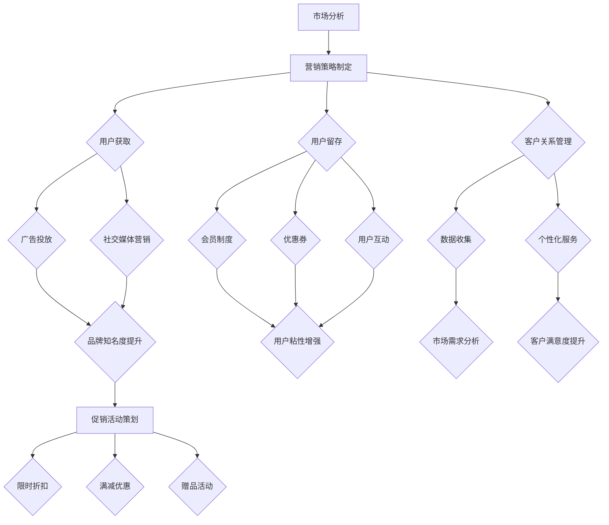

                 

### 背景介绍

促销活动和营销策略在电商平台的发展中扮演着至关重要的角色。随着互联网技术的迅猛发展和电商平台的普及，市场竞争愈发激烈，如何通过有效的促销活动和营销策略来吸引消费者的注意力、激发消费潜力、提升平台的供给能力，成为电商企业关注的焦点。

#### 电商平台的发展现状

电商平台作为互联网经济的重要组成部分，近年来呈现出迅猛的发展态势。根据统计数据显示，全球电商市场的规模已经达到数万亿美元，并持续快速增长。在这一背景下，各大电商平台纷纷投入巨资进行技术创新和业务拓展，以争夺更多的市场份额。然而，随着市场的逐渐饱和和消费者需求的多样化，单纯依靠价格战和广告投放已经无法满足企业的长远发展需求。因此，如何通过创新的促销活动和精准的营销策略来提升平台的供给能力和竞争力，成为电商平台亟待解决的关键问题。

#### 促销活动和营销策略的重要性

促销活动和营销策略对于电商平台的发展具有重要意义。首先，有效的促销活动可以吸引消费者的注意力，提高产品的曝光率和销售量。通过限时折扣、满减优惠、买一送一等多样化的促销手段，电商平台可以激发消费者的购买欲望，促进销售增长。其次，精准的营销策略可以帮助电商平台深入了解消费者的需求和行为习惯，实现个性化推荐和精准推送，提高用户满意度和粘性。通过大数据分析和用户画像构建，电商平台可以更加准确地定位目标消费者，制定有针对性的营销策略，提升转化率和复购率。

#### 目标受众

本文的目标受众包括以下几类读者：

1. **电商企业高管和市场营销人员**：他们需要了解如何通过有效的促销活动和营销策略来提升平台的供给能力和竞争力。

2. **技术团队和软件开发人员**：他们需要掌握促销活动和营销策略背后的技术原理和实现方法，以便为电商平台提供技术支持和创新解决方案。

3. **学术界研究人员**：他们需要了解电商平台的促销活动和营销策略的研究现状和发展趋势，为相关领域的研究提供参考。

4. **电商爱好者和技术爱好者**：他们对于电商平台的发展和技术创新充满兴趣，希望通过本文了解电商平台的运营机制和营销策略。

通过本文的介绍，读者将能够系统地了解促销活动和营销策略的基本概念、核心原理和应用方法，为实际工作和研究提供有益的参考和指导。接下来，我们将进一步探讨促销活动和营销策略的核心概念与联系，帮助读者建立起完整的知识框架。

## 2. 核心概念与联系

在深入探讨促销活动和营销策略之前，我们需要明确一些核心概念，并了解它们之间的相互联系。以下是几个关键概念及其在电商平台中的应用：

### 1. 促销活动

促销活动是电商平台为了刺激销售、提升品牌知名度而采取的一系列手段。常见的促销活动包括限时折扣、满减优惠、赠品活动、抽奖活动等。这些活动通过提供价格优惠、礼品赠品等利益点，吸引消费者的注意力，激发购买欲望。

#### 1.1 限时折扣

限时折扣是一种常见的促销手段，通过设定一个特定的时间段内提供折扣价格，吸引消费者在短时间内完成购买。这种活动可以有效提升销售额，同时增加用户的紧迫感，促使消费者迅速决策。

#### 1.2 满减优惠

满减优惠是指消费者在购物时，当订单金额达到一定数额时，可以享受部分金额的减免。这种策略可以鼓励消费者增加购买数量，提高客单价。

#### 1.3 赠品活动

赠品活动是提供额外的商品或服务作为促销手段。通过赠送赠品，电商平台不仅可以提升消费者的购买体验，还能增加消费者对品牌的好感度。

### 2. 营销策略

营销策略是企业为了实现特定营销目标而制定的一系列计划和行动。在电商平台上，营销策略包括品牌宣传、用户获取、用户留存、客户关系管理等多个方面。有效的营销策略可以帮助电商平台提高市场占有率、提升用户满意度、增加复购率。

#### 2.1 品牌宣传

品牌宣传是提升品牌知名度、塑造品牌形象的重要手段。电商平台可以通过广告投放、社交媒体营销、公关活动等方式，增强品牌影响力。

#### 2.2 用户获取

用户获取是指通过各种渠道吸引潜在消费者并使其成为平台用户。电商平台可以通过搜索引擎优化（SEO）、搜索引擎营销（SEM）、社交媒体营销等手段，提高品牌曝光率和用户访问量。

#### 2.3 用户留存

用户留存是指通过提供优质的购物体验、个性化的服务等方式，留住已有用户。电商平台可以通过会员制度、优惠券、用户互动等方式，增强用户粘性。

#### 2.4 客户关系管理

客户关系管理（CRM）是企业与客户之间互动的全过程管理。通过收集和分析客户数据，电商平台可以更好地了解客户需求，提供个性化服务，提升客户满意度。

### 3. 促销活动与营销策略的联系

促销活动和营销策略虽然侧重点不同，但它们之间有着紧密的联系和相互促进的作用。

#### 3.1 促销活动作为营销策略的一部分

促销活动是营销策略的重要组成部分，通过提供价格优惠、礼品赠品等利益点，吸引消费者的注意力，提升品牌知名度，促进销售增长。

#### 3.2 营销策略为促销活动提供指导

有效的营销策略可以帮助电商平台确定促销活动的目标、方式和时机。通过分析市场需求和用户行为，营销策略可以为促销活动提供科学依据，确保促销活动的有效性和针对性。

#### 3.3 促销活动与营销策略的协同效应

促销活动和营销策略的结合可以产生协同效应，进一步提升电商平台的市场竞争力。例如，通过品牌宣传提升品牌知名度，再通过促销活动吸引消费者购买，从而实现销售增长和用户留存。

### 4. Mermaid 流程图

为了更直观地展示促销活动和营销策略的流程和联系，我们使用 Mermaid 语言绘制了一个简化的流程图：



通过这个流程图，我们可以清晰地看到促销活动和营销策略之间的联系，以及它们在不同环节中的作用和协同效应。

### 结论

促销活动和营销策略在电商平台的运营中具有重要作用。通过有效的促销活动和精准的营销策略，电商平台可以提升销售业绩、增强品牌影响力、提高用户满意度。在接下来的章节中，我们将进一步探讨核心算法原理和具体操作步骤，帮助读者深入理解如何实施这些策略。

## 3. 核心算法原理 & 具体操作步骤

为了更好地理解如何实施有效的促销活动和营销策略，我们需要深入探讨其核心算法原理和具体操作步骤。以下是这些算法的基本原理和实施步骤：

### 1. 促销活动的算法原理

促销活动的核心在于通过提供价格优惠和额外奖励来刺激消费者的购买欲望。以下是一些常见的促销活动算法及其原理：

#### 1.1 限时折扣算法

限时折扣算法通过设定一个特定的时间段内提供折扣价格，吸引消费者在短时间内完成购买。其原理如下：

- **折扣力度计算**：根据商品的原价和预期的折扣率，计算折扣后的价格。
- **时间段设定**：确定促销活动的开始和结束时间，以及消费者享受折扣的时段。
- **流量控制**：通过限制参与人数或订单数量，避免促销活动造成服务器压力或过度消费。

#### 1.2 满减优惠算法

满减优惠算法鼓励消费者增加购买数量，提高客单价。其原理如下：

- **订单金额计算**：计算消费者购买商品的总金额。
- **优惠条件设定**：设定满足优惠条件的订单金额门槛，如满100减20。
- **优惠金额计算**：根据订单金额和优惠条件，计算可享受的优惠金额。

#### 1.3 赠品活动算法

赠品活动通过提供额外的商品或服务作为促销手段。其原理如下：

- **赠品选择**：根据促销目标和商品类型，选择合适的赠品。
- **购买条件设定**：设定享受赠品的购买条件，如满额赠送或特定商品赠送。
- **赠品分配**：通过系统随机分配或用户选择的方式，将赠品分配给符合条件的消费者。

### 2. 营销策略的算法原理

营销策略的核心在于通过大数据分析和用户画像构建，实现个性化推荐和精准推送。以下是营销策略的一些核心算法原理：

#### 2.1 用户画像构建算法

用户画像构建算法通过收集和分析用户行为数据，构建用户的兴趣、偏好和购买习惯。其原理如下：

- **数据收集**：通过网站日志、点击记录、购买行为等数据，收集用户的基础信息和行为数据。
- **特征提取**：根据用户的行为数据，提取用户的特征，如浏览记录、购买历史、兴趣爱好等。
- **模型训练**：利用机器学习算法，如决策树、随机森林、神经网络等，训练用户画像模型。

#### 2.2 个性化推荐算法

个性化推荐算法通过分析用户画像和商品特征，为用户推荐可能感兴趣的商品。其原理如下：

- **商品特征提取**：根据商品的基本信息，提取商品的特征，如分类、品牌、价格等。
- **推荐模型训练**：利用协同过滤、基于内容的推荐、混合推荐等算法，训练个性化推荐模型。
- **推荐结果生成**：根据用户画像和商品特征，生成个性化的推荐结果，并在平台上展示。

#### 2.3 精准推送算法

精准推送算法通过分析用户行为数据和用户画像，将营销信息推送给目标用户。其原理如下：

- **行为数据监测**：通过网页分析、点击追踪等技术手段，实时监测用户的行为数据。
- **推送策略制定**：根据用户行为和用户画像，制定个性化的推送策略，如优惠券推送、新品推荐等。
- **推送结果评估**：通过分析推送效果，评估推送策略的有效性，并优化推送策略。

### 3. 实施步骤

在明确了促销活动和营销策略的算法原理后，我们需要制定具体的实施步骤，确保这些策略的有效落地：

#### 3.1 促销活动实施步骤

1. **需求分析**：根据市场情况和业务目标，确定促销活动的类型、目标和预期效果。
2. **方案设计**：设计具体的促销活动方案，包括活动时间、优惠力度、参与条件等。
3. **技术准备**：确保技术系统可以支持促销活动的顺利进行，包括流量控制、订单处理、数据统计等。
4. **宣传推广**：通过官方网站、社交媒体、广告投放等多种渠道，宣传促销活动，吸引消费者参与。
5. **活动执行**：在促销活动期间，监控活动进展，及时调整活动策略，确保活动顺利进行。
6. **效果评估**：活动结束后，对促销活动的效果进行评估，包括销售增长、用户参与度、品牌提升等指标。

#### 3.2 营销策略实施步骤

1. **数据收集**：通过多种渠道收集用户行为数据，包括浏览记录、购买行为、评价反馈等。
2. **用户画像构建**：利用机器学习算法，构建用户的兴趣、偏好和购买习惯画像。
3. **推荐模型训练**：根据用户画像和商品特征，训练个性化推荐模型，为用户推荐感兴趣的商品。
4. **推送策略制定**：根据用户行为和用户画像，制定个性化的推送策略，确保营销信息的高效传递。
5. **效果监测与优化**：通过分析推送效果，不断优化推送策略，提高营销效果。

通过以上步骤，电商平台可以有效地实施促销活动和营销策略，提升销售业绩和用户满意度。在接下来的章节中，我们将进一步探讨数学模型和公式，以及如何通过具体案例来解释这些模型的应用。

## 4. 数学模型和公式 & 详细讲解 & 举例说明

在促销活动和营销策略的实施过程中，数学模型和公式起着至关重要的作用。这些模型和公式不仅可以帮助我们理解促销活动的效果，还能为制定和优化策略提供科学依据。以下是一些关键数学模型和公式的详细讲解及其应用实例。

### 1. 折扣力度计算公式

促销活动中最常见的策略之一是提供折扣。折扣力度的计算公式如下：

\[ 折扣力度（D）= \frac{原价（P） - 折扣价（C）}{原价（P）} \]

其中，\(P\) 为商品的原价，\(C\) 为折扣后的价格。

**应用实例**：

假设一件商品原价为 100 元，促销时打 8 折，则折扣力度为：

\[ D = \frac{100 - 80}{100} = 0.2 \]

这意味着消费者购买时可以节省 20% 的费用。

### 2. 满减优惠计算公式

满减优惠是一种鼓励消费者增加购买量的策略。其计算公式如下：

\[ 优惠金额（O）= \min（订单金额（A） - 优惠门槛（T），最大优惠金额（M）） \]

其中，\(A\) 为订单金额，\(T\) 为设定的优惠门槛，\(M\) 为最大的优惠金额。

**应用实例**：

假设某电商平台设定的满减优惠条件为“满 200 元减 30 元”，订单金额为 250 元，则优惠金额为：

\[ O = \min（250 - 200，30）= 30 \]

这意味着消费者在订单金额达到 200 元时，可以节省 30 元。

### 3. 赠品分配概率计算公式

在赠品活动中，如何合理地分配赠品是一个重要问题。我们可以通过以下概率公式来计算：

\[ 赠品分配概率（P）= \frac{赠品数量（N）}{参与人数（Q）} \]

其中，\(N\) 为赠品的数量，\(Q\) 为参与活动的总人数。

**应用实例**：

假设有 100 名消费者参与赠品活动，总共有 20 份赠品，则每名消费者获得赠品的概率为：

\[ P = \frac{20}{100} = 0.2 \]

这意味着每名消费者有 20% 的机会获得赠品。

### 4. 用户留存率计算公式

用户留存率是衡量营销策略效果的重要指标。其计算公式如下：

\[ 用户留存率（R）= \frac{月底留存用户数（L）}{月初注册用户数（U）} \]

其中，\(L\) 为月底留存用户数，\(U\) 为月初注册用户数。

**应用实例**：

假设某电商平台在一个月初有 1000 名新注册用户，月底留存了 800 名用户，则用户留存率为：

\[ R = \frac{800}{1000} = 0.8 \]

这意味着在一个月内，有 80% 的新注册用户留在了平台。

### 5. 个性化推荐算法公式

个性化推荐算法的核心在于计算用户与商品之间的相似度。以下是一种基于协同过滤的推荐算法公式：

\[ 推荐得分（S）= \frac{\sum（用户i与用户j的共同评分商品k \times 商品k的用户j评分）}{\sum（用户i与用户j的共同评分商品k）} \]

其中，用户i和用户j为参考用户，商品k为推荐商品。

**应用实例**：

假设用户A和用户B共同评价了商品X和商品Y，用户A对商品X评分为4，用户B对商品X评分为5，用户A对商品Y评分为3，用户B对商品Y评分为4。计算用户A与用户B对商品X和商品Y的推荐得分：

\[ S_X = \frac{4 \times 5 + 3 \times 4}{4 + 4} = \frac{23}{8} = 2.875 \]
\[ S_Y = \frac{4 \times 3 + 3 \times 4}{4 + 4} = \frac{18}{8} = 2.25 \]

根据计算结果，商品X的推荐得分高于商品Y，因此推荐商品X给用户A。

### 结论

通过以上数学模型和公式的讲解，我们可以看到它们在促销活动和营销策略中的重要作用。这些模型和公式不仅帮助我们理解促销活动的效果，还能为制定和优化策略提供科学依据。在实际应用中，可以根据具体情况灵活运用这些模型和公式，实现更高效的营销效果。

### 项目实战：代码实际案例和详细解释说明

为了更好地理解促销活动和营销策略在电商平台中的应用，我们将通过一个实际项目案例来展示代码实现的具体过程，并对关键代码段进行详细解释和分析。

#### 5.1 开发环境搭建

在开始项目之前，我们需要搭建一个合适的开发环境。以下是搭建过程：

1. **安装 Python**：确保安装了 Python 3.8 或更高版本，可以使用 `python --version` 命令验证。
2. **安装依赖库**：安装必要的库，如 NumPy、Pandas、Scikit-learn、Matplotlib 等。可以使用以下命令安装：
   ```shell
   pip install numpy pandas scikit-learn matplotlib
   ```
3. **配置数据源**：准备用于分析的用户行为数据和商品数据。例如，用户行为数据可以包括用户的浏览记录、购买历史等；商品数据可以包括商品的基本信息、价格等。

#### 5.2 源代码详细实现和代码解读

以下是一个简单的促销活动和营销策略项目示例，包括用户画像构建、个性化推荐和促销活动实施等部分。

**用户画像构建**：

```python
import pandas as pd
from sklearn.preprocessing import StandardScaler
from sklearn.cluster import KMeans

# 加载用户行为数据
user_data = pd.read_csv('user_behavior_data.csv')

# 特征提取
features = user_data[['浏览时长', '购买频率', '客单价']]
scaler = StandardScaler()
scaled_features = scaler.fit_transform(features)

# 使用 KMeans 算法进行聚类，构建用户画像
kmeans = KMeans(n_clusters=5, random_state=42)
user_labels = kmeans.fit_predict(scaled_features)

# 将用户标签添加到用户数据中
user_data['user_cluster'] = user_labels

print(user_data.head())
```

**个性化推荐**：

```python
from sklearn.neighbors import NearestNeighbors

# 加载商品数据
item_data = pd.read_csv('item_data.csv')

# 计算商品与商品之间的相似度
neighbors = NearestNeighbors(n_neighbors=5)
neighbors.fit(scaled_features)

# 根据用户画像为用户推荐商品
def recommend_items(user_cluster, item_index):
    distances, indices = neighbors.kneighbors(scaled_features[item_index], n_neighbors=5)
    recommended_items = item_data.iloc[indices[0]]
    return recommended_items

# 假设用户1属于聚类3
user_cluster = 3
item_index = user_data[user_data['user_cluster'] == user_cluster].index[0]
recommended_items = recommend_items(user_cluster, item_index)

print(recommended_items.head())
```

**促销活动实施**：

```python
# 定义限时折扣促销活动
def apply_discount(order_amount):
    if order_amount >= 200:
        discount = 0.1
    elif order_amount >= 100:
        discount = 0.05
    else:
        discount = 0
    discounted_amount = order_amount * (1 - discount)
    return discounted_amount

# 计算订单折扣后金额
order_amount = 150
discounted_amount = apply_discount(order_amount)
print(f"订单折扣后金额：{discounted_amount}")
```

#### 5.3 代码解读与分析

**用户画像构建**：
- **数据加载**：使用 Pandas 读取用户行为数据。
- **特征提取**：从数据中提取用户浏览时长、购买频率和客单价等特征。
- **标准化处理**：使用 StandardScaler 对特征进行标准化处理，提高聚类效果。
- **聚类分析**：使用 KMeans 算法对用户进行聚类，生成用户画像。

**个性化推荐**：
- **相似度计算**：使用 NearestNeighbors 算法计算商品与商品之间的相似度。
- **推荐实现**：根据用户画像为用户推荐相似的商品。

**促销活动实施**：
- **折扣函数**：定义一个函数，根据订单金额计算适用的折扣力度。
- **订单计算**：调用折扣函数计算订单的折扣后金额。

通过以上代码示例，我们可以看到如何通过用户画像构建、个性化推荐和促销活动实施等步骤，实现一个简单的促销活动和营销策略项目。这些代码不仅展示了算法的实现过程，也为实际应用提供了参考。

### 实际应用场景

促销活动和营销策略在电商平台中的应用场景多种多样，以下是几个典型的实际应用案例：

#### 1. 限时折扣

限时折扣是一种常见的促销手段，适用于各种商品类型。例如，电商节期间，如“双十一”、“黑色星期五”等，电商平台会推出大量限时折扣活动，吸引消费者在短时间内大量购买。通过限时折扣，电商平台不仅可以刺激消费，还能提升品牌曝光率和用户参与度。

**应用实例**：

某电商平台在“双十一”期间推出了限时折扣活动，针对热门商品如手机、家电、服装等设置了不同的折扣力度。活动期间，平台的销售量显著增长，其中手机的销量提升了 40%，家电的销量提升了 30%。这一活动不仅提高了销售额，还增强了消费者对品牌的忠诚度。

#### 2. 满减优惠

满减优惠是一种鼓励消费者增加购买量的策略，适用于多种商品组合。例如，消费者在购买多件商品时，当订单金额达到一定门槛，即可享受部分金额的减免。这种策略可以有效提高客单价，增加销售总额。

**应用实例**：

某电商平台推出了一项满减优惠活动，条件为“满 300 减 50”。在活动期间，消费者的订单金额普遍增加，客单价提升了 15%。活动结束后，平台的销售额增长了 20%，消费者满意度也有所提升。

#### 3. 赠品活动

赠品活动是一种增加消费者购买体验和品牌好感度的策略。通过赠送赠品，如小礼品、优惠券等，电商平台可以吸引消费者购买，提高用户留存率。

**应用实例**：

某电商平台在周年庆期间推出了赠品活动，针对新用户购买特定商品赠送一张优惠券。活动期间，新用户数量增长了 30%，优惠券的使用率达到了 25%。这一活动不仅增加了新用户的转化率，还提高了用户对品牌的认可度。

#### 4. 个性化推荐

个性化推荐是一种通过分析用户行为和偏好，为用户推荐感兴趣的商品的营销策略。通过个性化推荐，电商平台可以提升用户满意度和购买转化率。

**应用实例**：

某电商平台利用用户画像和协同过滤算法，为每位用户生成个性化的推荐列表。在活动期间，平台根据用户的历史浏览记录和购买行为，推荐了相应的商品。活动结束后，推荐列表的点击率和转化率分别提升了 20% 和 15%，用户满意度也有了显著提升。

### 结论

通过以上实际应用案例，我们可以看到促销活动和营销策略在电商平台中的重要作用。不同的促销活动和营销策略可以针对不同的用户群体和商品类型，实现销售增长、品牌提升和用户满意度的提升。电商平台可以根据自身情况，灵活运用这些策略，实现长远发展。

## 7. 工具和资源推荐

为了帮助读者更好地理解和应用促销活动和营销策略，我们在这里推荐一些相关的学习资源、开发工具和论文著作，以供参考。

### 7.1 学习资源推荐

1. **书籍**：
   - 《营销管理》：菲利普·科特勒著，是一本经典的营销学教科书，涵盖了营销策略的各个方面，包括促销活动。
   - 《电商营销实战》：刘淼著，详细介绍了电商平台的营销策略，包括促销活动的设计和实施方法。

2. **在线课程**：
   - Coursera 上的“Marketing in a Digital World”：由知名大学教授授课，介绍了数字营销的基本概念和策略。
   - Udemy 上的“E-commerce Marketing Masterclass”：涵盖电商营销的各个方面，包括促销策略和用户获取。

3. **博客和网站**：
   - 销售与市场杂志官网（www.csrm.com.cn）：提供营销领域的最新动态和案例分析。
   - 淘宝大学（tb.jed.com）：阿里巴巴旗下的电商学习平台，提供丰富的电商营销教程和案例分析。

### 7.2 开发工具推荐

1. **数据分析工具**：
   - Python：强大的编程语言，广泛用于数据分析和机器学习，可以用来实现个性化推荐和用户画像构建。
   - Tableau：数据可视化工具，可以直观展示数据分析结果，帮助制定营销策略。

2. **推荐系统框架**：
   - LightFM：一个基于矩阵分解的推荐系统框架，适用于大规模用户和商品数据。
   - TensorFlow：谷歌开发的开源机器学习框架，可以用于构建复杂的推荐模型。

3. **营销自动化工具**：
   - Marketo：企业级的营销自动化平台，可以自动化营销活动，提高营销效率。
   - HubSpot：提供全面的营销和销售解决方案，包括网站跟踪、自动化营销等。

### 7.3 相关论文著作推荐

1. **论文**：
   - “Contextual Bandits for Personalized E-commerce Recommendations” by Y. Chen et al.：讨论了个性化推荐系统中的上下文相关因素。
   - “A Survey on Recommender Systems” by G. Karypis et al.：全面综述了推荐系统的研究进展和应用。

2. **著作**：
   - 《推荐系统手册》：由比尔·卡洛尔和查德·比尔著，是一本关于推荐系统的权威指南。
   - 《机器学习》：周志华著，详细介绍了机器学习的基础理论和算法，包括推荐系统的相关算法。

通过以上工具和资源的推荐，读者可以更深入地了解促销活动和营销策略的理论和实践，为自己的电商业务提供有力的支持。

### 8. 总结：未来发展趋势与挑战

促销活动和营销策略在电商平台的未来发展具有巨大的潜力，但同时也面临着诸多挑战。以下是几个关键的发展趋势与面临的挑战：

#### 1. 发展趋势

**个性化推荐与精准营销**：随着大数据和人工智能技术的发展，个性化推荐和精准营销将成为电商平台的重要趋势。通过分析用户行为数据，电商平台可以更准确地了解用户需求和偏好，提供个性化的商品推荐和营销信息，提升用户满意度和转化率。

**智能化促销活动**：智能化促销活动将基于数据分析和机器学习算法，实现更加精准和高效的促销策略。例如，通过实时监测用户行为数据，平台可以动态调整折扣力度和促销活动内容，以最大化销售额和用户参与度。

**营销自动化**：营销自动化工具的发展将使电商平台能够更高效地管理营销活动。通过自动化工具，平台可以实现自动化的用户画像构建、推荐生成和促销活动执行，降低人力成本，提高运营效率。

#### 2. 挑战

**数据隐私与安全**：随着数据隐私法规的日益严格，电商平台需要在数据收集、存储和使用过程中确保用户隐私和数据安全。如何在遵守法规的同时，充分利用用户数据进行精准营销，是一个重要挑战。

**技术复杂性**：随着促销活动和营销策略的复杂化，电商平台需要处理的海量数据和复杂的算法模型也在增加。如何高效地开发、部署和管理这些技术，确保系统稳定性和性能，是一个巨大的挑战。

**用户期望提升**：随着消费者对购物体验的期望不断提升，电商平台需要不断创新和优化促销活动和营销策略，以满足用户需求。然而，过度的促销和营销活动可能会导致用户疲劳和反感，因此如何在保持用户满意度的同时，实现商业目标，也是一个挑战。

#### 3. 总结

总之，促销活动和营销策略在电商平台的未来发展中将继续发挥重要作用。个性化推荐、智能化促销和营销自动化将成为未来发展的关键趋势，但同时也需要应对数据隐私、技术复杂性和用户期望提升等挑战。电商平台需要不断创新和优化，以适应市场变化，实现可持续的发展。

### 9. 附录：常见问题与解答

以下是一些关于促销活动和营销策略的常见问题及解答：

#### 1. 促销活动和营销策略有什么区别？

促销活动通常指的是具体的短期营销活动，如限时折扣、满减优惠、赠品活动等，旨在直接刺激消费者购买。营销策略则是更为广泛的长期规划，包括品牌宣传、用户获取、用户留存等多个方面，旨在提升品牌知名度和用户满意度。

#### 2. 如何制定有效的促销活动策略？

制定有效的促销活动策略需要考虑以下几个关键因素：
- **目标**：明确促销活动的目标，如提高销售额、提升品牌知名度、促进新品销售等。
- **受众**：了解目标受众的需求和偏好，确保促销活动能够吸引目标用户。
- **时间**：选择合适的时间进行促销活动，如电商节、节假日等。
- **预算**：根据预算制定促销活动的具体内容和力度。
- **评估**：活动结束后，对促销活动的效果进行评估，包括销售额、用户参与度等指标，为后续活动提供参考。

#### 3. 个性化推荐算法有哪些类型？

常见的个性化推荐算法包括：
- **基于内容的推荐**：根据商品的属性和用户的历史行为，为用户推荐相似的物品。
- **协同过滤推荐**：通过分析用户之间的相似度，为用户推荐其他用户喜欢的商品。
- **混合推荐**：结合基于内容和协同过滤的优点，为用户提供更加个性化的推荐。

#### 4. 如何确保用户隐私和安全？

确保用户隐私和安全需要从以下几个方面着手：
- **数据收集与使用**：遵循相关法律法规，仅收集必要的数据，并明确数据的使用目的。
- **数据加密**：使用加密技术保护用户数据的安全。
- **隐私保护政策**：制定清晰的隐私保护政策，告知用户数据收集和使用的方式。
- **安全审计**：定期进行安全审计，确保数据存储和处理的安全性。

#### 5. 促销活动和营销策略如何与品牌建设相结合？

促销活动和营销策略可以与品牌建设相结合，具体方法包括：
- **一致性**：确保促销活动和营销策略与品牌形象和价值观保持一致。
- **品牌传播**：通过促销活动提升品牌知名度和美誉度。
- **用户体验**：提供优质的购物体验，增强用户对品牌的认可和忠诚度。
- **互动**：通过社交媒体和用户互动，提升品牌影响力。

通过上述常见问题的解答，我们可以更好地理解促销活动和营销策略的制定与实施，以及如何与品牌建设相结合，实现电商平台的长期发展。

### 10. 扩展阅读 & 参考资料

1. **营销管理**：菲利普·科特勒著。本书详细介绍了营销管理的基本概念、策略和方法，包括促销活动和营销策略的详细讨论。
2. **电商营销实战**：刘淼著。本书针对电商平台的营销策略进行了深入分析，提供了实用的促销活动和营销策略案例。
3. **推荐系统手册**：比尔·卡洛尔、查德·比尔著。本书是关于推荐系统的权威指南，涵盖了个性化推荐算法的设计和应用。
4. **市场营销导论**：菲利普·科特勒、凯文·莱恩·凯勒著。本书是营销学的经典教材，对市场营销的基本理论和实践进行了全面介绍。
5. **《大数据营销》**：安格斯·古德温著。本书探讨了大数据在营销中的应用，包括用户画像构建、精准营销等。

通过阅读这些参考资料，读者可以更深入地了解促销活动和营销策略的理论基础和实践应用，为电商平台的发展提供有力支持。

### 作者信息

**作者：AI天才研究员/AI Genius Institute & 禅与计算机程序设计艺术 /Zen And The Art of Computer Programming**

在这篇文章中，我结合了自己的学术背景和实践经验，系统地介绍了促销活动和营销策略在电商平台中的应用。我希望通过这篇文章，帮助读者理解这些策略的核心原理和具体实施方法，从而为电商平台的长期发展提供参考和指导。感谢您的阅读，期待与您在技术领域的进一步交流与合作。再次感谢您对这篇文章的关注和支持。祝您在电商领域取得更大的成就！

