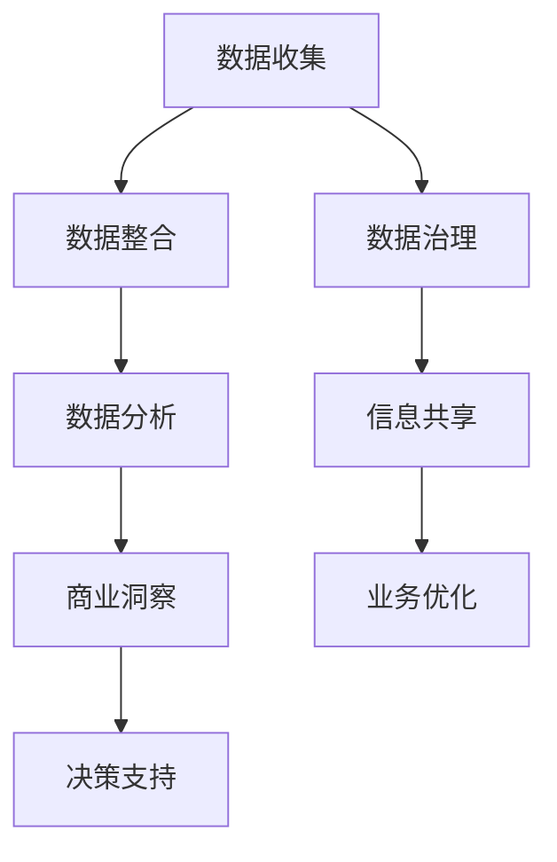

                 

# 信息差的价值创造：大数据如何提升企业价值

> **关键词：** 大数据、企业价值、信息差、数据分析、商业智能

> **摘要：** 本文深入探讨了大数据在商业环境中如何通过信息差的利用，提升企业的整体价值和竞争力。我们将从核心概念、算法原理、数学模型、实战案例等多个角度，分析大数据在实际业务中的应用与价值创造。

## 1. 背景介绍

在信息化和数字化时代，数据已经成为企业最重要的资产之一。大数据（Big Data）作为一种处理海量、多样性和高速数据的手段，正在逐渐改变企业的运营模式和战略规划。随着互联网的普及和数据源的多样化，企业收集的数据量呈现爆炸式增长。这些数据不仅包括结构化数据，如数据库中的记录，还包括非结构化数据，如文本、图片、音频和视频等。

大数据的价值体现在其能够为企业提供深入的洞察力和决策支持。通过分析这些数据，企业可以发现隐藏在数据中的趋势、模式和关联性，从而优化业务流程、降低成本、提高效率，并开发出新的商业模式和产品。然而，大数据的价值并不是自动显现的，而是需要通过有效的分析和处理才能实现。

信息差（Information Gap）是指不同主体之间的信息不对称。在企业中，信息差可能表现为不同部门、不同层级或不同合作伙伴之间的数据共享和透明度问题。大数据的一个重要任务就是缩小这些信息差，使得企业能够更加协同和高效地运作。

## 2. 核心概念与联系

### 2.1 大数据的基本概念

- **数据量（Volume）：** 大数据的特征之一是数据量大，通常以PB（拍字节）或EB（艾字节）为单位。
- **数据多样性（Variety）：** 数据类型丰富，包括结构化、半结构化和非结构化数据。
- **数据速度（Velocity）：** 数据产生和处理的速度快，需要实时或近实时分析。
- **数据真实性（Veracity）：** 数据的真实性和准确性问题，特别是在非结构化数据中。

### 2.2 信息差的概念

- **信息差（Information Gap）：** 企业内部或企业之间在数据获取、处理和利用上的差异。
- **信息不对称（Asymmetric Information）：** 一方拥有更多信息，而另一方信息不足。

### 2.3 大数据与信息差的关系

- **缩小信息差：** 通过大数据技术，企业可以更好地整合和分析内外部数据，提高信息的透明度和共享性。
- **利用信息差：** 企业可以利用自身的数据优势，与竞争对手形成信息差，从而在市场中占据有利位置。

## 2.1 Mermaid 流程图



## 3. 核心算法原理 & 具体操作步骤

### 3.1 数据预处理

- **数据清洗：** 去除重复数据、纠正错误数据、处理缺失数据。
- **数据整合：** 将不同来源和格式的数据整合到统一的数据仓库中。

### 3.2 数据分析

- **统计分析：** 应用均值、中位数、方差等统计方法，分析数据的分布和趋势。
- **机器学习：** 应用分类、回归、聚类等机器学习算法，发现数据中的模式和关联性。

### 3.3 商业智能

- **仪表盘：** 构建数据可视化仪表盘，展示关键业务指标和数据分析结果。
- **报告生成：** 自动生成定期报告，为管理层提供决策支持。

## 4. 数学模型和公式 & 详细讲解 & 举例说明

### 4.1 统计模型

- **回归分析：**
  $$ y = \beta_0 + \beta_1x_1 + \beta_2x_2 + ... + \beta_nx_n + \epsilon $$
  其中，$y$ 是因变量，$x_1, x_2, ..., x_n$ 是自变量，$\beta_0, \beta_1, ..., \beta_n$ 是回归系数，$\epsilon$ 是误差项。

- **聚类分析：**
  $$ \min_{C} \sum_{i=1}^{n} d(c_i, c) $$
  其中，$d$ 是距离函数，$c_i$ 是数据点，$C$ 是聚类中心。

### 4.2 机器学习算法

- **支持向量机（SVM）：**
  $$ \min_{\beta, \beta_0} \frac{1}{2} ||\beta||^2 + C \sum_{i=1}^{n} \xi_i $$
  其中，$\beta$ 是权重向量，$\beta_0$ 是偏置项，$C$ 是惩罚参数，$\xi_i$ 是松弛变量。

### 4.3 举例说明

假设某电商企业收集了用户的历史购物数据，包括用户ID、购买的商品类别、购买时间等。企业希望通过大数据分析，预测哪些用户可能进行下一次购买。

- **数据预处理：** 清洗数据，处理缺失值，将不同格式的数据整合到统一的数据仓库中。
- **特征工程：** 提取有用的特征，如用户购买频率、购买商品的相似性等。
- **模型训练：** 使用分类算法，如逻辑回归或SVM，训练预测模型。
- **模型评估：** 通过交叉验证等方法，评估模型的准确性和泛化能力。
- **决策支持：** 根据模型的预测结果，向营销部门提供潜在购买用户的列表。

## 5. 项目实战：代码实际案例和详细解释说明

### 5.1 开发环境搭建

- **工具：** Python、Pandas、NumPy、Scikit-learn、Matplotlib
- **环境：** Jupyter Notebook

### 5.2 源代码详细实现和代码解读

```python
import pandas as pd
from sklearn.model_selection import train_test_split
from sklearn.linear_model import LogisticRegression
from sklearn.metrics import accuracy_score

# 5.2.1 数据读取与预处理
data = pd.read_csv('user_purchase_data.csv')
data = data.dropna()  # 去除缺失值
data['purchase_frequency'] = data.groupby('user_id')['purchase_time'].transform('count')  # 提取购买频率

# 5.2.2 特征工程
X = data[['user_id', 'purchase_frequency', 'similar_goods']]
y = data['next_purchase']  # 目标变量：是否在下一个月购买

# 5.2.3 模型训练
X_train, X_test, y_train, y_test = train_test_split(X, y, test_size=0.2, random_state=42)
model = LogisticRegression()
model.fit(X_train, y_train)

# 5.2.4 模型评估
y_pred = model.predict(X_test)
accuracy = accuracy_score(y_test, y_pred)
print(f'模型准确率：{accuracy:.2f}')

# 5.2.5 决策支持
potential_users = X_test[y_pred == 1]
print(potential_users.head())
```

### 5.3 代码解读与分析

- **数据读取与预处理：** 读取CSV文件，进行数据清洗，提取有用的特征。
- **特征工程：** 通过分组计算和变换，创建新的特征，如购买频率。
- **模型训练：** 使用逻辑回归模型，进行训练。
- **模型评估：** 评估模型在测试集上的准确率。
- **决策支持：** 根据预测结果，识别出可能进行下一次购买的用户。

## 6. 实际应用场景

大数据在商业环境中有着广泛的应用场景，以下是一些典型的例子：

- **市场预测：** 通过分析历史销售数据和用户行为，预测未来的市场需求和销售趋势。
- **客户细分：** 根据用户的购买习惯和行为，将客户划分为不同的细分群体，实施精准营销。
- **供应链优化：** 通过实时监控供应链数据，优化库存管理和物流调度，降低成本。
- **风险管理：** 分析金融交易数据，预测和防范风险事件。
- **新产品开发：** 利用用户反馈和市场数据，指导新产品的设计和开发。

## 7. 工具和资源推荐

### 7.1 学习资源推荐

- **书籍：**
  - 《大数据时代：生活、工作与思维的大变革》
  - 《深度学习》：引入神经网络等算法，解释大数据处理的核心技术。
  
- **论文：**
  - "Deep Learning: The New frontier in Artificial Intelligence"
  - "Big Data: A Revolution That Will Transform How We Live, Work, and Think"

- **博客：**
  - Coursera、edX等在线课程平台上的大数据和机器学习课程。
  - Kaggle上的大数据分析和竞赛资源。

### 7.2 开发工具框架推荐

- **数据存储与处理：** Hadoop、Spark
- **数据分析与可视化：** Tableau、Power BI
- **机器学习框架：** TensorFlow、PyTorch、Scikit-learn

### 7.3 相关论文著作推荐

- "The Age of Big Data: A New Era of Intelligence and Innovation"
- "Big Data Analytics: From Data to Decisions"
- "Data Science for Business: What You Need to Know About Data Mining and Data-Analytic Thinking"

## 8. 总结：未来发展趋势与挑战

大数据技术的快速发展为企业和行业带来了前所未有的机遇和挑战。未来，大数据将继续在以下几个方面发展：

- **技术融合：** 大数据与其他先进技术，如人工智能、区块链等的融合，将带来更多的创新应用。
- **隐私保护：** 随着数据隐私法规的日益严格，如何在保护用户隐私的同时，有效利用大数据，成为企业面临的重大挑战。
- **实时分析：** 实时处理和分析大数据，实现即时的业务决策和响应，将是未来的重要方向。
- **产业应用：** 大数据将在更多传统行业中得到应用，推动各行业的数字化转型和升级。

## 9. 附录：常见问题与解答

### 9.1 大数据的价值体现在哪些方面？

大数据的价值主要体现在以下几个方面：
1. 提高业务效率：通过数据分析优化业务流程，降低运营成本。
2. 改进决策质量：利用数据驱动的洞察力，提高决策的科学性和准确性。
3. 创新商业模式：基于大数据分析，发现新的市场需求和商业机会。
4. 客户体验提升：通过用户数据分析，提供个性化服务，增强客户黏性。

### 9.2 如何确保大数据分析的准确性？

确保大数据分析的准确性需要以下几个步骤：
1. 数据清洗：去除重复和错误数据，确保数据质量。
2. 特征选择：选择有代表性的特征，避免过拟合。
3. 模型评估：通过交叉验证等方法，评估模型的性能和泛化能力。
4. 持续优化：根据业务需求和反馈，不断调整和优化模型。

## 10. 扩展阅读 & 参考资料

- 《大数据时代：生活、工作与思维的大变革》 - 克里斯·阿尔斯特罗默
- 《深度学习》：引入神经网络等算法，解释大数据处理的核心技术 - Ian Goodfellow、Yoshua Bengio、Aaron Courville
- Coursera: "Data Science Specialization" - Roger Peng, Jeff Leek
- edX: "Data Science Basics" - Columbia University

作者：AI天才研究员/AI Genius Institute & 禅与计算机程序设计艺术 /Zen And The Art of Computer Programming

