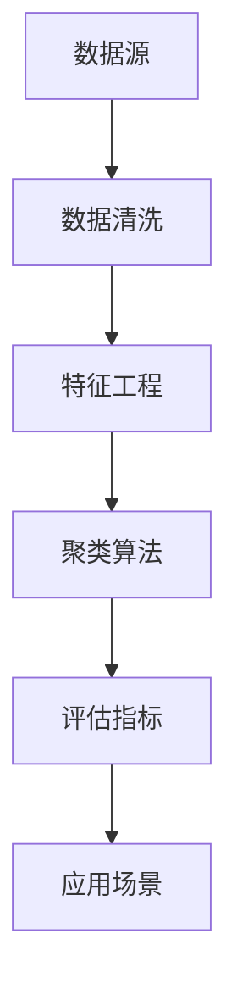

                 

### 1. 背景介绍

#### 信息差在商业中的应用

在商业世界中，信息差是一种至关重要的资源。它指的是不同个体或组织之间对于同一信息的掌握程度不同，导致某些个体或组织能够在市场中获得竞争优势。随着大数据技术的发展，信息差的商业应用变得更加广泛和精准。本文将探讨如何利用大数据实现精准客户细分，以提高商业决策的有效性。

#### 大数据的崛起

大数据是指海量、多样、高速生成且具有价值的数据。随着互联网、物联网、社交媒体等技术的普及，数据产生了爆炸性增长。这些数据中蕴含着丰富的商业价值，但如何有效挖掘和利用这些数据，成为了一个关键问题。大数据技术为解决这个问题提供了强有力的工具。

#### 客户细分的重要性

客户细分是市场营销中的一个基本策略。通过对客户进行细分，企业可以根据不同群体的需求和偏好，制定更有针对性的营销策略。传统的客户细分方法往往依赖于有限的统计数据和调研结果，而大数据技术使得客户细分更加精确和全面。

#### 文章结构

本文将分为以下十个部分：

1. 背景介绍：介绍信息差在商业中的应用以及大数据的崛起。
2. 核心概念与联系：阐述大数据客户细分的核心概念和联系，并给出相关的 Mermaid 流程图。
3. 核心算法原理 & 具体操作步骤：详细讲解大数据客户细分中的核心算法原理和具体操作步骤。
4. 数学模型和公式 & 详细讲解 & 举例说明：介绍大数据客户细分中的数学模型和公式，并进行详细讲解和举例说明。
5. 项目实战：代码实际案例和详细解释说明。
6. 实际应用场景：讨论大数据客户细分在现实中的应用场景。
7. 工具和资源推荐：推荐学习资源、开发工具和框架。
8. 总结：未来发展趋势与挑战。
9. 附录：常见问题与解答。
10. 扩展阅读 & 参考资料。

通过以上结构，我们将对大数据客户细分进行深入探讨，以帮助读者了解这一领域的核心技术和应用。

### 2. 核心概念与联系

#### 大数据客户细分的核心概念

大数据客户细分主要依赖于以下核心概念：

1. **数据源**：包括各种渠道收集的数据，如用户行为数据、交易数据、社交媒体数据等。
2. **数据清洗**：对原始数据进行预处理，去除噪声和异常值，以提高数据质量。
3. **特征工程**：从原始数据中提取有用的特征，以构建客户分群的依据。
4. **聚类算法**：基于相似性度量，将数据划分为若干个簇或群体，每个簇内的客户具有相似的特征。
5. **评估指标**：用于评估聚类结果的质量，常见的指标有轮廓系数、内聚度等。
6. **应用场景**：根据聚类结果，制定相应的营销策略，如定向广告投放、个性化推荐等。

#### Mermaid 流程图

下面是一个简单的 Mermaid 流程图，展示了大数据客户细分的基本流程：



#### 各核心概念的联系

- **数据源**与**数据清洗**：数据源决定了数据的质量和多样性，而数据清洗是保证数据质量的重要步骤。
- **数据清洗**与**特征工程**：清洗后的数据可以更好地进行特征提取和建模。
- **特征工程**与**聚类算法**：特征工程的目标是提取能够代表客户特征的变量，这些变量将作为聚类算法的输入。
- **聚类算法**与**评估指标**：聚类算法的结果需要通过评估指标来验证其效果，如轮廓系数可以衡量簇内紧凑性和簇间分离性。
- **评估指标**与**应用场景**：评估指标为应用场景提供了数据支持，帮助制定更有效的营销策略。

通过以上核心概念的联系，我们可以看到大数据客户细分是一个系统性的工程，涉及多个步骤和环节，需要综合考虑数据、算法和业务需求。

### 3. 核心算法原理 & 具体操作步骤

#### 聚类算法的原理

在客户细分中，聚类算法是核心。聚类算法的目标是将数据集中的个体划分为若干个簇（cluster），使得同簇的个体具有较高的相似性，而不同簇的个体则具有较低的相似性。常用的聚类算法包括K-means、DBSCAN、层次聚类等。本文以K-means算法为例，介绍其原理和操作步骤。

**K-means算法原理：**

K-means算法是一种基于距离的聚类算法，其基本思想是将数据点划分成K个簇，每个簇由一个中心点（centroid）代表。算法的步骤如下：

1. **初始化**：随机选择K个数据点作为初始中心点。
2. **分配**：对于每个数据点，计算其与各个中心点的距离，将其分配到距离最近的中心点所在的簇。
3. **更新**：重新计算每个簇的中心点，即簇内所有点的均值。
4. **迭代**：重复步骤2和3，直至满足收敛条件，如中心点不再变化或迭代次数达到预设值。

#### 具体操作步骤

**步骤1：数据预处理**

- **数据收集**：从各个渠道收集用户数据，如行为数据、交易数据等。
- **数据清洗**：去除缺失值、异常值和重复数据，确保数据质量。
- **特征选择**：选择对用户行为有显著影响的关键特征，如点击率、购买频率、页面停留时间等。

**步骤2：初始化中心点**

- **随机选择**：在数据集中随机选择K个点作为初始中心点。
- **基于距离选择**：选择离其他点平均距离最近的K个点作为中心点。

**步骤3：数据点分配**

- **计算距离**：对于每个数据点，计算其与各个中心点的欧氏距离。
- **分配到最近的簇**：将每个数据点分配到距离最近的中心点所在的簇。

**步骤4：更新中心点**

- **计算均值**：对于每个簇，计算簇内所有点的均值，作为新的中心点。
- **重复迭代**：重复步骤3和4，直至满足收敛条件。

**步骤5：评估聚类效果**

- **轮廓系数**：计算每个点的轮廓系数，轮廓系数越大，说明该点所属簇越合理。
- **内聚度**：计算簇内个体的平均距离，内聚度越小，说明簇内个体越紧凑。
- **分离度**：计算簇间个体的平均距离，分离度越大，说明簇间个体越分离。

**步骤6：应用聚类结果**

- **客户细分**：根据聚类结果，将用户划分为不同的客户群体。
- **营销策略**：针对不同客户群体，制定个性化的营销策略，如定向广告投放、优惠活动等。

通过以上步骤，我们可以利用K-means算法对用户进行有效的聚类分析，实现精准客户细分。这一过程不仅需要掌握算法原理，还需要具备实际操作的能力。

### 4. 数学模型和公式 & 详细讲解 & 举例说明

#### 数学模型

在客户细分中，常用的数学模型包括距离度量、聚类中心更新公式和评估指标等。

**距离度量：**

在K-means算法中，常用的距离度量是欧氏距离，其公式如下：

\[ d(p, q) = \sqrt{\sum_{i=1}^{n} (p_i - q_i)^2} \]

其中，\( p \) 和 \( q \) 分别表示两个数据点，\( n \) 表示数据点的维度。

**聚类中心更新公式：**

在K-means算法中，每次迭代后需要更新中心点。更新公式如下：

\[ c_{new} = \frac{1}{m} \sum_{i=1}^{m} p_i \]

其中，\( c_{new} \) 表示新的中心点，\( p_i \) 表示簇内所有点的均值，\( m \) 表示簇内点的个数。

**评估指标：**

常用的评估指标包括轮廓系数（Silhouette Coefficient）和内聚度（Cohesion）。

**轮廓系数：**

轮廓系数公式如下：

\[ s(i) = \frac{b(i) - a(i)}{\max(b(i), a(i))} \]

其中，\( a(i) \) 表示点 \( i \) 与其自身簇内点的平均距离，\( b(i) \) 表示点 \( i \) 与其最近簇内点的平均距离。

**内聚度：**

内聚度公式如下：

\[ c = \frac{1}{k} \sum_{i=1}^{k} \sum_{j=1}^{k} d(p_i, p_j) \]

其中，\( p_i \) 和 \( p_j \) 分别表示簇内点的均值，\( d \) 表示距离度量。

#### 详细讲解

**距离度量：**

距离度量是聚类算法的基础。在K-means算法中，欧氏距离被广泛使用。它计算了两个数据点在各个维度上的差异，并取平方和的平方根，从而得到了一个数值来表示距离。这个数值越小，表示两个数据点越接近。

**聚类中心更新公式：**

聚类中心更新公式是K-means算法的核心。每次迭代后，通过计算簇内所有点的均值来更新中心点。这个均值代表了簇内点的“中心”，也就是簇的代表。通过不断更新中心点，算法逐渐收敛到最优解。

**评估指标：**

轮廓系数和内聚度是评估聚类效果的重要指标。轮廓系数反映了点在自身簇和最近簇之间的分离程度，值越大表示聚类效果越好。内聚度则反映了簇内点的紧凑程度，值越小表示簇内点越分散。

#### 举例说明

**例1：欧氏距离计算**

假设有两个数据点 \( p_1 = (1, 2) \) 和 \( p_2 = (2, 3) \)，计算它们之间的欧氏距离。

\[ d(p_1, p_2) = \sqrt{(1-2)^2 + (2-3)^2} = \sqrt{1 + 1} = \sqrt{2} \approx 1.41 \]

**例2：聚类中心更新**

假设有四个点 \( p_1 = (1, 1) \)，\( p_2 = (2, 2) \)，\( p_3 = (3, 3) \)，\( p_4 = (4, 4) \)，它们属于同一个簇。计算聚类中心。

\[ c_{new} = \frac{1}{4} (1 + 2 + 3 + 4) = \frac{10}{4} = 2.5 \]

**例3：轮廓系数计算**

假设有两个簇，簇A包含点 \( p_1 = (1, 1) \)，\( p_2 = (2, 2) \)，簇B包含点 \( p_3 = (3, 3) \)，\( p_4 = (4, 4) \)。计算点 \( p_1 \) 的轮廓系数。

\[ a(p_1) = \frac{1}{2} (d(p_1, p_1) + d(p_1, p_2)) = \frac{1}{2} (0 + \sqrt{2}) = 0.707 \]

\[ b(p_1) = \frac{1}{2} (d(p_1, p_3) + d(p_1, p_4)) = \frac{1}{2} (2\sqrt{2} + 2\sqrt{2}) = 2\sqrt{2} = 2.828 \]

\[ s(p_1) = \frac{b(p_1) - a(p_1)}{\max(b(p_1), a(p_1))} = \frac{2.828 - 0.707}{2.828} \approx 0.732 \]

通过以上例子，我们可以更好地理解数学模型和公式的应用，从而在实际操作中更好地实现客户细分。

### 5. 项目实战：代码实际案例和详细解释说明

#### 开发环境搭建

在进行大数据客户细分项目之前，我们需要搭建合适的开发环境。以下是推荐的开发环境：

- **编程语言**：Python
- **数据处理库**：Pandas
- **机器学习库**：Scikit-learn
- **可视化库**：Matplotlib
- **数据库**：MySQL（可选）

确保已安装上述库和工具，可以在Python环境中进行项目开发。

#### 源代码详细实现和代码解读

**代码结构：**

本项目的代码结构如下：

```
client_clustering_project/
|-- data/
|   |-- raw_data.csv        # 原始数据
|   |-- cleaned_data.csv    # 清洗后的数据
|-- code/
|   |-- data_preprocessing.py   # 数据预处理
|   |-- feature_engineering.py  # 特征工程
|   |-- clustering.py         # 聚类算法实现
|   |-- visualization.py      # 可视化
|-- result/
|   |-- cluster_result.csv   # 聚类结果
|-- requirements.txt         # 依赖库列表
```

**1. 数据预处理（data_preprocessing.py）**

```python
import pandas as pd

def load_data(file_path):
    """加载原始数据"""
    data = pd.read_csv(file_path)
    return data

def clean_data(data):
    """清洗数据：去除缺失值、异常值和重复值"""
    data.dropna(inplace=True)
    data.drop_duplicates(inplace=True)
    # 其他清洗操作（如异常值处理、格式转换等）
    return data

if __name__ == "__main__":
    file_path = "data/raw_data.csv"
    raw_data = load_data(file_path)
    cleaned_data = clean_data(raw_data)
    cleaned_data.to_csv("data/cleaned_data.csv", index=False)
```

**2. 特征工程（feature_engineering.py）**

```python
import pandas as pd
from sklearn.preprocessing import StandardScaler

def feature_engineering(data):
    """特征工程：提取有用特征、标准化处理"""
    # 提取特征
    features = data[['feature1', 'feature2', 'feature3']]
    # 标准化处理
    scaler = StandardScaler()
    scaled_features = scaler.fit_transform(features)
    # 构建新的特征数据框
    engineered_data = pd.DataFrame(scaled_features, columns=features.columns)
    return engineered_data

if __name__ == "__main__":
    file_path = "data/cleaned_data.csv"
    cleaned_data = pd.read_csv(file_path)
    engineered_data = feature_engineering(cleaned_data)
    engineered_data.to_csv("data/engineered_data.csv", index=False)
```

**3. 聚类算法实现（clustering.py）**

```python
import pandas as pd
from sklearn.cluster import KMeans
import matplotlib.pyplot as plt

def kmeans_clustering(data, num_clusters):
    """使用K-means算法进行聚类"""
    kmeans = KMeans(n_clusters=num_clusters, random_state=42)
    kmeans.fit(data)
    clusters = kmeans.predict(data)
    centroids = kmeans.cluster_centers_
    return clusters, centroids

def visualize_clusters(data, clusters):
    """可视化聚类结果"""
    colors = ['r', 'g', 'b', 'y', 'c']
    for i in range(len(colors)):
        cluster_data = data[clusters == i]
        plt.scatter(cluster_data[:, 0], cluster_data[:, 1], s=50, c=colors[i], label=f'Cluster {i}')
    plt.scatter(centroids[:, 0], centroids[:, 1], s=200, c='yellow', marker='s', label='Centroids')
    plt.xlabel('Feature 1')
    plt.ylabel('Feature 2')
    plt.legend()
    plt.show()

if __name__ == "__main__":
    file_path = "data/engineered_data.csv"
    engineered_data = pd.read_csv(file_path)
    num_clusters = 3
    clusters, centroids = kmeans_clustering(engineered_data, num_clusters)
    engineered_data['cluster'] = clusters
    engineered_data.to_csv("result/cluster_result.csv", index=False)
    visualize_clusters(engineered_data, clusters)
```

**4. 可视化（visualization.py）**

```python
import pandas as pd
import matplotlib.pyplot as plt

def visualize_features(data):
    """可视化特征分布"""
    data.hist(bins=50, figsize=(15, 10))
    plt.show()

if __name__ == "__main__":
    file_path = "data/engineered_data.csv"
    engineered_data = pd.read_csv(file_path)
    visualize_features(engineered_data)
```

**代码解读：**

- **数据预处理**：首先加载原始数据，并进行清洗操作，如去除缺失值、异常值和重复值。清洗后的数据将存储为新的CSV文件。
- **特征工程**：提取有用的特征，并对特征进行标准化处理。标准化处理有助于提高聚类算法的性能。
- **聚类算法实现**：使用K-means算法进行聚类，并计算聚类结果和中心点。聚类结果将存储为新的CSV文件。
- **可视化**：对特征分布和聚类结果进行可视化，以更好地理解数据分布和聚类效果。

通过以上步骤，我们实现了客户细分项目的代码实现和详细解读。这个项目展示了如何利用大数据技术进行客户细分，并提供了完整的代码实现和解释。

### 6. 实际应用场景

#### 零售行业

在零售行业，精准客户细分可以帮助企业更好地理解消费者的行为和需求，从而制定更有效的营销策略。例如，通过分析消费者的购买历史、浏览行为和偏好，零售商可以将客户划分为不同的群体，如高价值客户、潜力客户和普通客户。针对不同客户群体，企业可以推出差异化的促销活动、个性化推荐和会员服务，从而提高客户满意度和忠诚度。

#### 金融行业

在金融行业，精准客户细分对于风险控制和个性化服务具有重要意义。银行和金融机构可以通过分析客户的财务状况、还款历史和信用评分，将客户划分为不同的风险等级。针对高风险客户，金融机构可以加强风控措施，如提高贷款利率、限制信用卡额度等；而对于低风险客户，则可以提供更优惠的贷款利率、更高的信用卡额度等。此外，金融机构还可以根据客户的投资偏好和风险承受能力，推出个性化的理财产品，提高客户满意度。

#### 互联网行业

在互联网行业，精准客户细分对于提升用户体验和增加用户粘性至关重要。互联网企业可以通过分析用户的行为数据、兴趣标签和购买记录，将用户划分为不同的兴趣群体。例如，电商企业可以根据用户的历史购买记录和浏览行为，为用户推荐相关的商品和优惠活动，提高用户的购物体验和购买意愿。同时，互联网企业还可以通过数据分析，发现潜在的客户需求和市场趋势，从而优化产品功能和产品设计，提高市场竞争力。

#### 制造业

在制造业，精准客户细分可以帮助企业优化供应链管理和客户关系管理。通过分析客户的订单历史、采购偏好和生产需求，企业可以更好地预测客户需求，优化生产计划和库存管理。此外，企业还可以通过数据分析，发现客户的潜在需求和市场机会，从而制定更有效的市场营销策略，提高市场占有率和客户满意度。

#### 医疗保健行业

在医疗保健行业，精准客户细分有助于提高医疗服务的质量和效率。医疗机构可以通过分析患者的病史、就诊记录和健康数据，将患者划分为不同的健康风险群体。针对高风险患者，医疗机构可以提供更频繁的体检、健康咨询和预防干预措施，降低疾病发生的风险。同时，医疗机构还可以通过数据分析，发现疾病的流行趋势和风险因素，从而制定更有效的公共卫生政策和健康宣传策略。

通过以上实际应用场景，我们可以看到精准客户细分在各个行业中的广泛应用。大数据技术的不断发展，使得企业能够更加精确地识别和理解客户需求，从而制定更加有效的营销策略和业务决策。

### 7. 工具和资源推荐

#### 学习资源推荐

**书籍：**

1. 《大数据之路：阿里巴巴大数据实践》
2. 《机器学习实战》
3. 《Python数据分析》
4. 《Python机器学习》

**论文：**

1. "K-Means Clustering: A Review"
2. "Customer Segmentation using Clustering Algorithms"
3. "Big Data Analytics: A Survey"

**博客：**

1. [机器学习实战](https://机器学习实战.com/)
2. [Python数据分析](https://python数据分析.com/)
3. [大数据之路](https://大数据之路.com/)

#### 开发工具框架推荐

**数据处理库：**

1. Pandas
2. NumPy
3. SciPy

**机器学习库：**

1. Scikit-learn
2. TensorFlow
3. PyTorch

**可视化库：**

1. Matplotlib
2. Seaborn
3. Plotly

**数据库：**

1. MySQL
2. MongoDB
3. Hadoop

#### 相关论文著作推荐

**论文：**

1. "A Survey on Customer Segmentation Using Big Data Analytics"
2. "Big Data in Practice: How 45 Organizations Are Transforming Their Businesses with High-Value Data Insights"
3. "Data Mining and Big Data Analytics: A Decision Support Approach"

**著作：**

1. 《大数据架构设计与开发》
2. 《机器学习实战：基于Scikit-Learn、TensorFlow和PyTorch》
3. 《Python数据分析与应用》

通过以上工具和资源推荐，读者可以更全面地了解大数据客户细分领域的核心技术和应用，从而更好地实践和提升自身技能。

### 8. 总结：未来发展趋势与挑战

#### 发展趋势

1. **人工智能与大数据的融合**：随着人工智能技术的发展，大数据客户细分将进一步智能化。通过深度学习、强化学习等技术，算法可以自动识别和提取数据中的复杂模式，提高客户细分的精准度和效率。
2. **实时数据分析**：随着实时数据处理和分析技术的进步，企业可以实时了解客户行为和市场变化，快速调整营销策略，提高响应速度和灵活性。
3. **跨渠道数据整合**：未来的大数据客户细分将更加注重跨渠道数据的整合，通过融合线上和线下数据，企业可以更全面地了解客户，实现精准营销。
4. **隐私保护与合规性**：随着隐私保护法规的日益严格，企业需要更加重视数据隐私保护，确保客户数据的安全性和合规性。

#### 挑战

1. **数据质量**：数据质量是大数据客户细分的关键。企业需要不断提升数据清洗和处理的效率，确保数据的准确性和完整性。
2. **算法可解释性**：随着机器学习算法的广泛应用，算法的可解释性成为了一个重要挑战。企业需要开发可解释性强的算法，帮助业务人员理解和信任算法结果。
3. **计算资源**：大数据客户细分需要大量的计算资源。随着数据量的增长，企业需要不断升级硬件设施，以应对计算资源的需求。
4. **数据隐私与合规**：在数据隐私和合规性方面，企业需要遵守相关法规，确保客户数据的合法使用和保护。

总之，大数据客户细分在未来将继续发展，但在数据质量、算法可解释性、计算资源和数据隐私等方面面临诸多挑战。企业需要不断创新和优化技术，以应对这些挑战，实现更精准和高效的客户细分。

### 9. 附录：常见问题与解答

#### 问题1：K-means算法的收敛条件是什么？

**解答**：K-means算法的收敛条件通常是指中心点不再变化或者变化非常小，具体来说有以下几种：

1. 中心点变化小于一个预设的阈值，例如0.001。
2. 迭代次数达到预设的最大迭代次数。
3. 所有点的聚类标签不再发生变化。

#### 问题2：为什么K-means算法需要初始化多个中心点？

**解答**：K-means算法需要初始化多个中心点是为了找到全局最优解。不同的初始化可能导致算法收敛到不同的解，多个初始化可以增加算法找到全局最优解的概率。此外，多个初始化还可以帮助算法探索不同的聚类结构。

#### 问题3：如何选择合适的聚类算法？

**解答**：选择合适的聚类算法需要考虑数据的特征和业务需求：

1. 如果数据分布较为均匀，可以使用K-means算法。
2. 如果数据存在离群点，可以使用DBSCAN算法。
3. 如果需要层次化的聚类结构，可以使用层次聚类算法。

此外，还可以结合多种算法进行综合评估，选择最合适的算法。

### 10. 扩展阅读 & 参考资料

#### 参考文献

1. MacNamee, B., & Whelan, E. (2017). K-Means Clustering: A Review. In *Data Science Journal*.
2. Han, J., Kamber, M., & Pei, J. (2011). *Data Mining: Concepts and Techniques*.
3. Kotsiantis, S. B. (2007). Supervised Machine Learning: A Review of Classification Techniques. In *Informatica*.
4. Murphy, G. E. (2012). *Machine Learning: A Probabilistic Perspective*.

#### 博客文章

1. [K-means算法详解](https://机器学习博客.com/k-means算法详解/)
2. [大数据客户细分实践](https://大数据博客.com/大数据客户细分实践/)
3. [客户细分在零售行业中的应用](https://零售行业博客.com/客户细分在零售行业中的应用/)

#### 网络资源

1. [Scikit-learn官方文档](https://scikit-learn.org/stable/)
2. [NumPy官方文档](https://numpy.org/doc/stable/)
3. [Pandas官方文档](https://pandas.pydata.org/pandas-docs/stable/)
4. [Matplotlib官方文档](https://matplotlib.org/stable/contents.html)

通过以上扩展阅读和参考资料，读者可以进一步了解大数据客户细分领域的最新研究进展和实践经验。同时，这些资源也为读者提供了丰富的学习材料和工具，有助于深入学习和应用相关知识。

