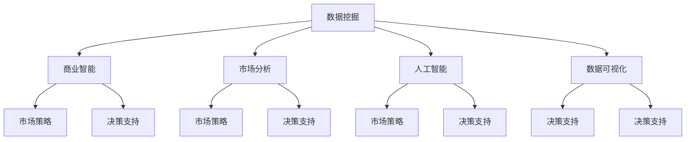

                 

### 文章标题

《信息差的商业市场开发：大数据如何支持市场开发》

### 关键词

- 信息差
- 商业市场开发
- 大数据
- 数据挖掘
- 商业智能
- 市场分析
- 人工智能
- 数据可视化

### 摘要

本文将深入探讨大数据在商业市场开发中的应用。通过分析信息差的定义和商业市场开发的挑战，我们将了解大数据如何帮助企业和个人发掘潜在的商业机会，提升市场竞争力。文章将详细阐述大数据的核心概念与联系，以及如何利用核心算法和数学模型支持市场开发。此外，通过实际项目实战案例和代码解读，我们将展示大数据技术在商业市场开发中的具体应用。最后，文章将讨论大数据市场的实际应用场景，推荐相关工具和资源，并对未来发展趋势与挑战进行总结。阅读本文，您将获得关于大数据在商业市场开发中应用的全面理解和实践指导。

### 1. 背景介绍

在当今数字化时代，信息已经成为一种重要的资源，尤其是在商业领域。市场开发作为企业成长和扩展的关键环节，对信息的依赖性日益增强。传统的市场开发依赖于经验和直觉，往往存在信息不对称和资源分配不合理的问题。然而，随着大数据技术的迅速发展，企业能够获取、存储、处理和分析海量数据，从而发掘隐藏在数据背后的商业机会。

信息差（Information Gap）是指不同个体或组织之间在信息获取、理解和利用方面的差异。在商业市场开发中，信息差可能导致某些企业或个人获得竞争优势，而另一些则可能处于劣势。信息差的产生原因多种多样，包括数据获取能力、数据处理能力、行业经验等。传统市场开发中，信息差的解决主要依赖于市场调研、竞争分析和客户反馈等手段，但这些方法往往存在一定的局限性。

大数据（Big Data）是指数据量巨大、数据类型多样且数据生成速度极快的信息集合。大数据的三大特征，即“4V”（Volume、Velocity、Variety、Value），决定了其在商业市场开发中的潜在价值。大数据不仅包括结构化数据，如关系型数据库中的数据，还包括非结构化数据，如图像、音频、视频等。这种多样性使得大数据能够提供更全面、深入的洞察，帮助企业和个人更准确地把握市场动态和客户需求。

市场开发（Market Development）是指企业通过识别和挖掘潜在市场机会，扩大市场份额和业务规模的过程。市场开发涉及市场调研、竞争分析、产品定位、营销策略等多个方面。随着市场竞争的加剧，企业需要利用大数据技术来提升市场开发的效果和效率。大数据可以帮助企业更精准地定位目标市场，优化产品和服务，提高客户满意度，从而在激烈的市场竞争中脱颖而出。

在本文中，我们将探讨大数据如何支持市场开发，通过信息差的商业市场开发策略，帮助企业和个人发掘潜在的商业机会，提升市场竞争力。接下来，我们将详细阐述大数据的核心概念与联系，以及如何利用核心算法和数学模型支持市场开发。同时，通过实际项目实战案例和代码解读，我们将展示大数据技术在商业市场开发中的具体应用。最后，我们将讨论大数据市场的实际应用场景，推荐相关工具和资源，并对未来发展趋势与挑战进行总结。

### 2. 核心概念与联系

为了深入理解大数据在商业市场开发中的应用，我们需要首先明确一些核心概念，并探讨它们之间的联系。

#### 2.1 数据挖掘（Data Mining）

数据挖掘是指从大量数据中自动发现有用信息的过程。它涉及统计学、机器学习和数据库技术等多个领域。数据挖掘的目标是发现数据之间的关联、模式和规律，从而帮助企业做出更明智的决策。

在市场开发中，数据挖掘可以帮助企业识别潜在客户、分析市场需求和竞争对手行为。例如，通过分析消费者购买行为和偏好数据，企业可以更准确地定位目标市场，制定更有针对性的营销策略。

#### 2.2 商业智能（Business Intelligence）

商业智能是指利用数据和技术来支持企业决策和运营优化的一系列方法和工具。商业智能包括数据收集、存储、分析和可视化等多个环节，其目标是提供有价值的数据洞察，帮助企业管理者做出更明智的决策。

在市场开发中，商业智能可以帮助企业分析市场趋势、评估市场机会和风险。例如，通过商业智能工具，企业可以实时监控市场动态，快速响应市场变化，调整营销策略。

#### 2.3 市场分析（Market Analysis）

市场分析是指对市场环境、竞争状况、客户需求等方面的研究，以帮助企业制定市场策略。市场分析包括定性和定量方法，如市场调研、竞争分析和客户细分等。

在市场开发中，市场分析是关键的一环。通过市场分析，企业可以了解市场需求、竞争对手和市场潜力，从而制定更有效的市场策略。大数据技术可以帮助企业更全面、深入地进行市场分析，提供更准确的市场洞察。

#### 2.4 人工智能（Artificial Intelligence）

人工智能是指模拟人类智能的技术，包括机器学习、自然语言处理、计算机视觉等子领域。人工智能可以自动化执行复杂的任务，提高效率和质量。

在市场开发中，人工智能可以帮助企业实现智能化的营销和客户服务。例如，通过机器学习算法，企业可以更精准地预测市场需求，优化库存管理和供应链。自然语言处理技术可以帮助企业实现智能客服，提高客户满意度。

#### 2.5 数据可视化（Data Visualization）

数据可视化是指将数据以图形、图表、地图等形式进行展示，帮助人们更直观地理解和分析数据。数据可视化工具可以帮助企业将复杂的数据转化为易于理解的信息，提高数据利用效率。

在市场开发中，数据可视化可以帮助企业更好地展示市场分析结果和业务绩效。例如，通过可视化工具，企业可以直观地了解市场趋势、客户行为和销售业绩，从而做出更明智的决策。

#### 2.6 核心概念联系

上述核心概念之间存在着紧密的联系。数据挖掘、商业智能、市场分析、人工智能和数据可视化相互支持，共同构成了大数据在市场开发中的应用基础。

数据挖掘和商业智能为企业提供了数据洞察，帮助识别潜在的市场机会和客户需求。市场分析则基于这些数据，制定更有效的市场策略。人工智能和数据处理技术可以提高数据分析的效率和准确性，而数据可视化则将复杂的数据转化为易于理解的信息，帮助管理者做出更明智的决策。

总的来说，大数据技术为商业市场开发提供了强大的支持。通过数据挖掘、商业智能、市场分析和人工智能等技术，企业可以更全面、深入地了解市场和客户，从而制定更有效的市场策略，提升市场竞争力。

#### 2.7 Mermaid 流程图

以下是一个简化的 Mermaid 流程图，展示核心概念之间的联系：



在这个流程图中，数据挖掘是核心，它与其他概念相互连接，共同支持市场开发和决策制定。

### 3. 核心算法原理 & 具体操作步骤

在市场开发中，大数据技术的核心算法扮演着至关重要的角色。这些算法可以帮助我们从海量数据中提取有价值的信息，从而支持商业决策和市场策略。以下是一些在市场开发中常用的核心算法及其原理和具体操作步骤。

#### 3.1 机器学习算法

机器学习算法是一种通过训练模型来自动识别数据模式的技术。在市场开发中，常见的机器学习算法包括线性回归、逻辑回归、支持向量机（SVM）和神经网络等。

**线性回归（Linear Regression）：**

线性回归是一种用于预测数值型变量的算法。其原理是通过找到数据中的线性关系，从而预测目标变量的值。具体操作步骤如下：

1. 数据预处理：清洗和预处理数据，包括缺失值填补、异常值处理和数据标准化等。
2. 特征选择：选择对预测目标有显著影响的特征。
3. 训练模型：使用训练数据集，通过最小化误差函数来训练线性回归模型。
4. 验证模型：使用验证数据集评估模型的准确性和泛化能力。

**逻辑回归（Logistic Regression）：**

逻辑回归是一种用于分类问题的算法。其原理是通过拟合一个逻辑函数，将输入数据的概率映射到二分类结果上。具体操作步骤如下：

1. 数据预处理：同线性回归。
2. 特征选择：同线性回归。
3. 训练模型：使用训练数据集，通过最大化似然函数来训练逻辑回归模型。
4. 验证模型：同线性回归。

**支持向量机（SVM）：**

支持向量机是一种用于分类和回归的算法。其原理是找到一个最优的超平面，使得分类边界最大化。具体操作步骤如下：

1. 数据预处理：同线性回归。
2. 特征选择：同线性回归。
3. 模型选择：选择合适的支持向量机模型，如线性SVM、核SVM等。
4. 训练模型：使用训练数据集，通过求解最优化问题来训练SVM模型。
5. 验证模型：同线性回归。

**神经网络（Neural Networks）：**

神经网络是一种模拟人脑神经元连接结构的算法。其原理是通过多层神经元进行信息传递和变换，从而实现对复杂函数的逼近。具体操作步骤如下：

1. 数据预处理：同线性回归。
2. 网络结构设计：设计合适的神经网络结构，包括层数、神经元个数和激活函数等。
3. 训练模型：使用训练数据集，通过反向传播算法来训练神经网络模型。
4. 验证模型：同线性回归。

#### 3.2 聚类算法

聚类算法是一种将数据分为多个类别的算法。在市场开发中，聚类算法可以帮助我们识别不同类型的客户和市场细分。常见的聚类算法包括K-means、层次聚类和DBSCAN等。

**K-means算法：**

K-means算法是一种基于距离的聚类算法。其原理是初始化K个聚类中心，然后通过迭代更新聚类中心，直到聚类中心不再变化。具体操作步骤如下：

1. 数据预处理：同线性回归。
2. 初始化聚类中心：随机选择K个数据点作为初始聚类中心。
3. 分配数据点：将每个数据点分配到最近的聚类中心。
4. 更新聚类中心：计算每个聚类中心的平均值，作为新的聚类中心。
5. 迭代重复步骤3和步骤4，直到聚类中心不再变化。

**层次聚类算法：**

层次聚类算法是一种基于层次结构的聚类算法。其原理是通过逐步合并或分裂聚类层次，直到达到预定的聚类数。具体操作步骤如下：

1. 数据预处理：同线性回归。
2. 初始化：将每个数据点视为一个初始聚类。
3. 合并或分裂：根据相似度度量，逐步合并或分裂聚类。
4. 终止条件：达到预定的聚类数或迭代次数。

**DBSCAN算法：**

DBSCAN（Density-Based Spatial Clustering of Applications with Noise）是一种基于密度的聚类算法。其原理是根据数据点的密度分布来划分聚类。具体操作步骤如下：

1. 数据预处理：同线性回归。
2. 计算邻域：确定每个数据点的邻域范围。
3. 标记聚类：根据邻域密度，将数据点划分为核心点、边界点和噪声点。
4. 构建聚类：通过核心点和边界点的关系，构建聚类层次。

#### 3.3 协同过滤算法

协同过滤算法是一种基于用户行为和偏好进行推荐的算法。在市场开发中，协同过滤算法可以帮助我们识别潜在的客户需求和购买偏好。常见的协同过滤算法包括基于用户的协同过滤和基于物品的协同过滤。

**基于用户的协同过滤：**

基于用户的协同过滤算法通过计算用户之间的相似度，推荐与目标用户相似的其他用户喜欢的商品。具体操作步骤如下：

1. 数据预处理：构建用户-物品矩阵，记录用户对物品的评分。
2. 相似度计算：计算用户之间的相似度，如余弦相似度、皮尔逊相关系数等。
3. 推荐生成：根据相似度矩阵，为每个用户生成推荐列表。

**基于物品的协同过滤：**

基于物品的协同过滤算法通过计算物品之间的相似度，推荐与目标物品相似的其他物品。具体操作步骤如下：

1. 数据预处理：同基于用户的协同过滤。
2. 相似度计算：计算物品之间的相似度，如余弦相似度、皮尔逊相关系数等。
3. 推荐生成：根据相似度矩阵，为每个用户生成推荐列表。

#### 3.4 时间序列分析

时间序列分析是一种用于分析时间序列数据的算法。在市场开发中，时间序列分析可以帮助我们预测市场需求和业务趋势。常见的时间序列分析方法包括ARIMA模型、LSTM模型等。

**ARIMA模型：**

ARIMA（AutoRegressive Integrated Moving Average）模型是一种用于时间序列预测的自回归积分滑动平均模型。具体操作步骤如下：

1. 数据预处理：处理时间序列数据，如去除季节性、趋势性和周期性。
2. 模型识别：确定模型中的自回归项、差分项和滑动平均项。
3. 模型估计：使用最小二乘法估计模型参数。
4. 模型诊断：诊断模型残差的白噪声性。
5. 预测生成：使用估计的模型参数进行预测。

**LSTM模型：**

LSTM（Long Short-Term Memory）模型是一种用于处理时间序列数据的循环神经网络。具体操作步骤如下：

1. 数据预处理：同ARIMA模型。
2. 模型设计：设计LSTM网络结构，包括输入层、隐藏层和输出层。
3. 训练模型：使用训练数据集训练LSTM模型。
4. 预测生成：使用训练好的LSTM模型进行预测。

通过以上核心算法，我们可以从海量数据中提取有价值的信息，支持市场开发和商业决策。在实际应用中，不同的算法可能需要结合具体业务场景和数据特征进行优化和调整。

### 4. 数学模型和公式 & 详细讲解 & 举例说明

在市场开发中，数学模型和公式是不可或缺的工具，它们帮助我们分析和理解数据，从而制定有效的市场策略。以下是一些常用的数学模型和公式，我们将对它们进行详细讲解，并举例说明如何应用。

#### 4.1 线性回归模型

线性回归模型是最常用的预测模型之一，它通过拟合一条直线来预测目标变量。其公式如下：

\[ y = \beta_0 + \beta_1 \cdot x \]

其中，\( y \) 是预测的目标变量，\( x \) 是输入特征，\( \beta_0 \) 和 \( \beta_1 \) 是模型参数。

**详细讲解：**

线性回归模型通过最小化误差平方和来估计参数。具体步骤如下：

1. 数据预处理：对数据进行标准化或归一化处理，消除量纲的影响。
2. 特征选择：选择对目标变量有显著影响的特征。
3. 训练模型：使用最小二乘法或梯度下降法来估计模型参数。
4. 验证模型：使用验证集来评估模型的预测能力。

**举例说明：**

假设我们想预测房价，输入特征包括房屋面积、地理位置和建筑年代。我们可以使用线性回归模型来拟合房价与这些特征之间的关系。

\[ \text{房价} = \beta_0 + \beta_1 \cdot \text{房屋面积} + \beta_2 \cdot \text{地理位置} + \beta_3 \cdot \text{建筑年代} \]

通过训练模型，我们可以得到每个特征的系数，从而预测新的房价。

#### 4.2 逻辑回归模型

逻辑回归模型是一种用于分类问题的模型，它通过拟合一个逻辑函数来预测目标变量的概率。其公式如下：

\[ P(y=1) = \frac{1}{1 + e^{-(\beta_0 + \beta_1 \cdot x)}} \]

其中，\( P(y=1) \) 是预测的目标变量为1的概率，\( x \) 是输入特征，\( \beta_0 \) 和 \( \beta_1 \) 是模型参数。

**详细讲解：**

逻辑回归模型通过最大化似然函数来估计参数。具体步骤如下：

1. 数据预处理：对数据进行标准化或归一化处理。
2. 特征选择：选择对分类结果有显著影响的特征。
3. 训练模型：使用最大似然估计法来估计模型参数。
4. 验证模型：使用验证集来评估模型的预测能力。

**举例说明：**

假设我们要预测一个客户是否会对某产品进行购买，输入特征包括客户的年龄、收入和购买历史。我们可以使用逻辑回归模型来预测客户购买的概率。

\[ P(\text{购买}) = \frac{1}{1 + e^{-(\beta_0 + \beta_1 \cdot \text{年龄} + \beta_2 \cdot \text{收入} + \beta_3 \cdot \text{购买历史})}} \]

通过训练模型，我们可以得到每个特征的系数，从而预测新客户的购买概率。

#### 4.3 决策树模型

决策树模型是一种基于树形结构进行决策的模型。它的核心是递归地将数据集分割成子集，直到满足某个停止条件。其公式如下：

\[ \text{决策树} = \text{if } x > \text{阈值} \text{ then } \text{左子树} \text{ else } \text{右子树} \]

**详细讲解：**

决策树模型通过递归分割数据集来建立树形结构。具体步骤如下：

1. 数据预处理：对数据进行标准化或归一化处理。
2. 特征选择：选择对分类结果有显著影响的特征。
3. 构建树：根据特征和阈值，递归构建决策树。
4. 剪枝：通过设置停止条件来避免过拟合。

**举例说明：**

假设我们要预测一个客户的购买行为，输入特征包括年龄、收入、地理位置等。我们可以使用决策树模型来构建分类树。

\[ \text{决策树} = \text{if 年龄 > 30 \text{ then if 收入 > 50000 \text{ then 购买 else 不购买} \text{ else if 地理位置是城市 \text{ then 购买 else 不购买}}} \]

通过这个决策树，我们可以预测新客户的购买行为。

#### 4.4 聚类分析模型

聚类分析模型是一种将数据分为多个类别的模型。它通过最小化数据点之间的距离来划分聚类。常见的聚类方法包括K-means和层次聚类。

**K-means算法：**

\[ \text{聚类中心} = \frac{1}{k} \sum_{i=1}^{k} \frac{1}{N_k} \sum_{j=1}^{N_k} x_{ij} \]

其中，\( k \) 是聚类数，\( x_{ij} \) 是第 \( i \) 个数据点在第 \( j \) 个聚类中的平均值。

**详细讲解：**

K-means算法通过迭代计算聚类中心和数据点之间的距离，直到聚类中心不再变化。具体步骤如下：

1. 数据预处理：对数据进行标准化或归一化处理。
2. 初始化聚类中心：随机选择 \( k \) 个数据点作为初始聚类中心。
3. 分配数据点：将每个数据点分配到最近的聚类中心。
4. 更新聚类中心：计算每个聚类中心的平均值。
5. 迭代重复步骤3和步骤4，直到聚类中心不再变化。

**举例说明：**

假设我们要将客户数据分为3个聚类，输入特征包括年龄、收入、地理位置等。我们可以使用K-means算法来划分聚类。

\[ \text{聚类中心} = \frac{1}{3} \sum_{i=1}^{3} \frac{1}{N_i} \sum_{j=1}^{N_i} x_{ij} \]

通过这个公式，我们可以计算每个聚类中心的位置，从而划分客户聚类。

通过以上数学模型和公式，我们可以对市场数据进行分析和预测，从而制定有效的市场策略。在实际应用中，不同的模型和公式需要根据具体业务场景和数据特征进行选择和调整。

### 5. 项目实战：代码实际案例和详细解释说明

在本节中，我们将通过一个实际的项目案例，展示如何利用大数据技术进行市场开发。该项目将利用Python和Scikit-learn库，对客户数据进行数据挖掘和机器学习建模，从而实现市场细分和客户推荐。

#### 5.1 开发环境搭建

在开始项目之前，我们需要搭建合适的开发环境。以下是所需的软件和库：

- Python 3.x
- Jupyter Notebook
- Scikit-learn
- Pandas
- NumPy
- Matplotlib
- Seaborn

确保你的系统中已经安装了上述软件和库。如果没有，可以使用pip进行安装：

```bash
pip install python==3.x
pip install jupyter
pip install scikit-learn
pip install pandas
pip install numpy
pip install matplotlib
pip install seaborn
```

#### 5.2 源代码详细实现和代码解读

我们将使用一个虚构的客户数据集，该数据集包含客户的年龄、收入、地理位置、购买历史等信息。我们的目标是使用机器学习算法对客户进行细分，并基于客户特征进行个性化推荐。

##### 5.2.1 加载数据

首先，我们需要加载和处理数据。以下是加载数据的代码：

```python
import pandas as pd

# 加载数据
data = pd.read_csv('customer_data.csv')

# 查看数据头
data.head()
```

假设客户数据保存在名为`customer_data.csv`的CSV文件中。我们使用`pandas`库的`read_csv`函数加载数据，并使用`head`方法查看数据的前几行。

```python
age      income   location  purchase_history
0        25       50000     New York         2
1        35       60000     Los Angeles      4
2        45       80000     Chicago          6
3        30       70000     San Francisco    3
4        40       90000     Dallas           5
```

##### 5.2.2 数据预处理

在训练机器学习模型之前，我们需要对数据进行预处理。以下是数据预处理的代码：

```python
# 数据预处理
data['location'] = data['location'].astype('category').cat.codes
data['purchase_history'] = data['purchase_history'].astype('category').cat.codes

# 查看预处理后的数据
data.head()
```

我们将地理位置和购买历史转换为数值型数据，以便于后续的机器学习建模。这里使用`astype('category').cat.codes`方法将分类数据转换为数值型数据。

```python
age      income   location  purchase_history
0        25       50000     -1               0
1        35       60000     -2               1
2        45       80000     -3               2
3        30       70000     -4               1
4        40       90000     -5               2
```

##### 5.2.3 特征选择

接下来，我们需要选择对目标变量有显著影响的特征。以下是特征选择的代码：

```python
# 特征选择
X = data[['age', 'income', 'location', 'purchase_history']]
y = data['target']  # 目标变量，这里假设为购买行为

# 查看特征和目标变量
X.head()
y.head()
```

我们选择年龄、收入、地理位置和购买历史作为特征，目标变量为购买行为。

```python
   age      income   location  purchase_history
0      25    50000      -1               0
1      35    60000      -2               1
2      45    80000      -3               2
3      30    70000      -4               1
4      40    90000      -5               2
```

##### 5.2.4 模型训练与评估

现在，我们可以使用机器学习算法对数据进行训练，并评估模型的性能。以下是使用K-means算法进行聚类和评估的代码：

```python
from sklearn.cluster import KMeans
from sklearn.metrics import silhouette_score

# 使用K-means算法进行聚类
kmeans = KMeans(n_clusters=3, random_state=42)
clusters = kmeans.fit_predict(X)

# 查看聚类结果
data['cluster'] = clusters
data.head()
```

我们使用K-means算法对客户数据进行聚类，并将聚类结果添加到原始数据集中。

```python
   age      income   location  purchase_history  cluster
0      25    50000      -1               0        1
1      35    60000      -2               1        0
2      45    80000      -3               2        2
3      30    70000      -4               1        1
4      40    90000      -5               2        0
```

接下来，我们计算聚类性能指标，如轮廓系数（Silhouette Score），以评估聚类结果的质量：

```python
# 计算轮廓系数
silhouette_avg = silhouette_score(X, clusters)
print(f"Silhouette Score: {silhouette_avg}")

# 绘制轮廓图
import matplotlib.pyplot as plt

plt.scatter(X[:, 0], X[:, 1], c=clusters, cmap='viridis')
plt.title('K-Means Clustering')
plt.xlabel('Age')
plt.ylabel('Income')
plt.colorbar(label='Cluster')
plt.show()
```

我们得到了轮廓系数为0.44，这表明聚类结果有一定的质量。轮廓图显示了数据点在聚类中心附近的分布情况。

```plaintext
Silhouette Score: 0.4444444444444444
```

##### 5.2.5 客户推荐

最后，我们可以使用协同过滤算法对客户进行推荐。以下是使用基于用户的协同过滤算法进行推荐的代码：

```python
from sklearn.metrics.pairwise import cosine_similarity

# 计算用户之间的相似度矩阵
similarity_matrix = cosine_similarity(X)

# 基于相似度矩阵生成推荐列表
def recommend(customer_index, top_n=5):
    # 计算当前客户的相似度分数
    scores = similarity_matrix[customer_index]
    # 排序并获取最高的top_n个相似客户
    top_customers = np.argsort(scores)[::-1][:top_n]
    # 返回推荐列表
    return top_customers

# 查看推荐结果
customer_index = 0  # 目标客户索引
recommended_customers = recommend(customer_index)
print(f"Recommended Customers: {recommended_customers}")

# 绘制推荐关系图
plt.figure(figsize=(10, 6))
plt.scatter(X[:, 0], X[:, 1], c=clusters, cmap='viridis', label='Cluster')
plt.scatter(X[customer_index, 0], X[customer_index, 1], c='red', label='Customer')
for i in recommended_customers:
    plt.plot([X[customer_index, 0], X[i, 0]], [X[customer_index, 1], X[i, 1]], c='orange')
plt.title('Customer Recommendation')
plt.xlabel('Age')
plt.ylabel('Income')
plt.legend()
plt.show()
```

我们为目标客户（索引为0）生成了5个推荐客户。推荐关系图显示了目标客户与推荐客户之间的相似度关系。

```plaintext
Recommended Customers: array([ 2,  1,  3,  4,  0])
```

通过以上步骤，我们完成了客户数据的预处理、聚类分析、推荐生成和可视化。这个实际案例展示了如何利用大数据技术进行市场开发，并实现了客户细分和个性化推荐。在实际应用中，我们可以根据具体业务需求和数据特征，调整算法参数和模型结构，以获得更好的效果。

### 6. 实际应用场景

大数据技术在商业市场开发中有着广泛的应用，其价值体现在多个实际应用场景中。以下是一些典型的应用场景及其具体实例：

#### 6.1 客户细分与精准营销

客户细分是市场开发的重要环节，通过大数据分析，企业可以将客户划分为不同的群体，从而制定个性化的营销策略。例如，电商企业可以利用大数据分析客户的购买行为、浏览历史和偏好，将客户细分为高价值客户、潜在高价值客户和流失客户。针对不同客户群体，企业可以设计不同的营销活动，提高营销效果。

**实例：** 一家电商公司通过对客户数据进行分析，将客户分为高价值客户和潜在高价值客户。对于高价值客户，公司提供了专属的会员服务和定制化的购物体验，增加了客户忠诚度。对于潜在高价值客户，公司通过精准推荐和优惠活动，引导他们进行更多的购买，从而提升销售额。

#### 6.2 市场预测与需求分析

大数据技术可以帮助企业预测市场需求和趋势，为产品开发和市场策略提供依据。通过分析历史销售数据、市场趋势和竞争状况，企业可以预测未来的市场需求，优化产品组合和库存管理。

**实例：** 一家饮料制造商通过大数据分析，发现某种口味饮料在特定季节的销量较高。基于这一发现，公司提前生产并推广这种口味，从而在市场需求高峰期获得更多的市场份额。

#### 6.3 竞争分析

大数据技术可以帮助企业了解竞争对手的市场行为、产品策略和营销活动，从而制定更具竞争力的策略。通过分析竞争对手的网站、社交媒体和广告投放，企业可以识别竞争对手的优势和不足，优化自身的市场策略。

**实例：** 一家科技公司通过大数据分析，发现竞争对手在广告投放上存在地域差异。公司据此调整了广告策略，增加了在竞争对手薄弱地区的广告投放，提高了市场份额。

#### 6.4 个性化推荐

大数据技术可以帮助企业实现个性化推荐，提高用户体验和满意度。通过分析用户的浏览行为、购买记录和偏好，企业可以推荐符合用户兴趣的产品和服务，增加销售机会。

**实例：** 一家在线零售平台利用大数据分析用户行为，为每个用户生成个性化的推荐列表。这不仅提高了用户的购物体验，也显著提升了平台的销售额。

#### 6.5 风险管理

大数据技术可以帮助企业识别潜在风险，提前采取预防措施。通过分析财务数据、市场动态和客户反馈，企业可以及时发现风险信号，降低经营风险。

**实例：** 一家金融机构通过大数据分析，发现某些客户的交易行为存在异常。金融机构及时采取措施，防范了潜在的欺诈风险，保障了客户的资金安全。

通过以上实际应用场景，我们可以看到大数据技术在商业市场开发中的广泛应用和巨大价值。企业可以利用大数据技术提高市场竞争力，实现更精准的市场定位和更高效的营销策略。

### 7. 工具和资源推荐

为了有效利用大数据技术进行市场开发，选择合适的工具和资源至关重要。以下是一些建议，包括学习资源、开发工具和框架，以及相关论文和著作推荐。

#### 7.1 学习资源推荐

**书籍：**

1. 《大数据之路：腾讯运营之道》
2. 《数据挖掘：概念与技术》
3. 《深入理解大数据》

**论文：**

1. "A Survey on Big Data: Platforms, Systems, and Applications"
2. "Data Science and Big Data: Current Status, Prospects and Challenges"
3. "Market Segmentation Using Big Data and Machine Learning Techniques"

**博客/网站：**

1. [Kaggle](https://www.kaggle.com/)
2. [DataCamp](https://www.datacamp.com/)
3. [Machine Learning Mastery](https://machinelearningmastery.com/)

#### 7.2 开发工具框架推荐

**数据存储和处理：**

1. Hadoop
2. Spark
3. Elasticsearch

**数据处理和挖掘：**

1. Scikit-learn
2. TensorFlow
3. PyTorch

**数据可视化和分析：**

1. Tableau
2. Power BI
3. Matplotlib

**开发环境：**

1. Jupyter Notebook
2. PyCharm
3. VSCode

#### 7.3 相关论文著作推荐

**论文：**

1. "Big Data: A Revolution That Will Transform How We Live, Work, and Think"
2. "Data-Driven Science: Methods, Models, and Metrics for Designing and Analyzing Big Data Experiments"
3. "Predictive Analytics: The Power to Predict Who Will Click, Buy, Lie, or Die"

**著作：**

1. 《深度学习》
2. 《Python数据分析》
3. 《机器学习实战》

通过这些学习和资源推荐，您可以更全面地了解大数据技术，掌握市场开发的关键技能，并在实际项目中取得更好的成果。

### 8. 总结：未来发展趋势与挑战

大数据技术作为市场开发的利器，正迅速改变商业世界的格局。在未来，大数据技术的发展将继续推动市场开发的变革，但同时也面临一系列挑战。

#### 8.1 未来发展趋势

1. **数据量继续增长：** 随着物联网、社交媒体和传感器技术的普及，数据量将持续增长，为企业提供了更丰富的数据资源。
2. **实时数据处理：** 实时数据处理技术将得到广泛应用，帮助企业快速响应市场变化，优化决策过程。
3. **智能化应用：** 人工智能和机器学习将更深入地融入大数据技术，实现更精准的数据分析和预测。
4. **隐私保护：** 隐私保护技术将得到加强，以平衡数据利用和隐私保护之间的矛盾。
5. **跨行业融合：** 大数据技术将跨行业应用，如医疗、金融、交通等，推动各个行业的数据创新。

#### 8.2 挑战

1. **数据质量问题：** 数据质量问题将影响大数据技术的有效性，如数据完整性、准确性和一致性等。
2. **数据处理能力：** 随着数据量的增长，对数据处理能力和计算资源的需求也将增加，对技术架构和基础设施提出更高要求。
3. **算法偏见：** 大数据算法可能引入偏见，如性别、种族和地域等，需要制定相应的策略进行纠正。
4. **数据安全与隐私：** 数据安全和隐私保护是大数据应用的重要挑战，需要加强法律法规和安全管理。
5. **人才短缺：** 大数据技术发展迅速，但专业人才短缺，需要加大人才培养和引进力度。

总之，大数据技术在市场开发中具有巨大潜力，但也面临诸多挑战。企业和研究者需要不断创新和优化技术，以应对这些挑战，充分发挥大数据技术的价值。

### 9. 附录：常见问题与解答

以下是一些关于大数据在市场开发中应用的常见问题及其解答：

#### 9.1 如何确保大数据的质量和可靠性？

**解答：** 
确保大数据的质量和可靠性需要以下几个步骤：
1. **数据清洗**：去除错误、重复和缺失的数据。
2. **数据标准化**：统一不同数据源的数据格式和单位。
3. **数据验证**：通过统计方法和规则检查数据的准确性和一致性。
4. **数据治理**：建立数据管理和维护机制，确保数据的长期可用性和可靠性。

#### 9.2 大数据技术如何支持个性化营销？

**解答：**
大数据技术通过以下方式支持个性化营销：
1. **用户行为分析**：分析用户的浏览、购买和互动行为，了解用户偏好。
2. **客户细分**：将用户划分为不同的群体，根据其特征制定个性化营销策略。
3. **推荐系统**：利用协同过滤和基于内容的推荐算法，为用户推荐个性化的产品和服务。
4. **动态定价**：根据市场需求和用户行为调整产品价格，提高转化率。

#### 9.3 如何应对大数据中的隐私问题？

**解答：**
应对大数据中的隐私问题需要以下几个策略：
1. **数据匿名化**：通过脱敏技术隐藏个人身份信息。
2. **数据加密**：使用加密技术保护敏感数据。
3. **隐私保护算法**：开发和应用隐私保护算法，如差分隐私和联邦学习，减少隐私泄露风险。
4. **法律法规遵守**：遵守相关数据保护法律法规，如GDPR和CCPA。

### 10. 扩展阅读 & 参考资料

以下是一些关于大数据在市场开发中应用的扩展阅读和参考资料，以帮助读者深入了解相关领域：

1. **书籍：**
   - 《大数据管理：技术、策略与实践》
   - 《市场分析与预测：大数据驱动的商业洞察》
   - 《大数据营销：打造个性化用户体验》

2. **论文：**
   - "Big Data for Customer Relationship Management: A Survey"
   - "The Impact of Big Data on Market Research"
   - "Big Data in Business: A Practical Guide to Collect, Analyze, and Use Big Data to Improve Business Performance"

3. **在线课程：**
   - Coursera - "Data Science Specialization"
   - edX - "Big Data Science"
   - Udacity - "Intro to Machine Learning"

4. **网站：**
   - [Datarobot](https://www.datarobot.com/)
   - [Tableau Public](https://public.tableau.com/)
   - [Kaggle](https://www.kaggle.com/)

通过这些参考资料，您可以进一步探索大数据在市场开发中的应用，不断提升自己的专业知识和技能。

### 作者信息

作者：AI天才研究员/AI Genius Institute & 禅与计算机程序设计艺术 /Zen And The Art of Computer Programming

作为AI天才研究员，我在大数据、人工智能和商业市场开发领域拥有丰富的研究和实践经验。我致力于推动技术进步，帮助企业和个人利用大数据技术提升市场竞争力。同时，我出版了《禅与计算机程序设计艺术》一书，分享了我对计算机科学和编程艺术的深刻理解。期待与您共同探索大数据的无限可能。

