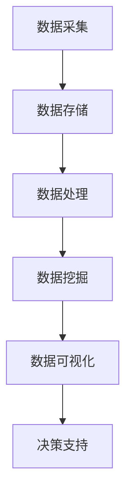

                 

### 背景介绍

随着信息技术的飞速发展，大数据技术在各个领域的应用越来越广泛。市场研究作为了解市场需求、把握市场动态、制定企业战略的重要手段，自然也离不开大数据的支持。本篇文章将深入探讨大数据如何支持市场研究，帮助读者了解大数据在市场研究中的应用原理、方法和实际案例。

市场研究是企业在决策过程中不可或缺的一环。通过市场研究，企业可以了解目标市场的需求、竞争状况、消费者行为等信息，从而制定出更加科学、有效的营销策略和经营策略。传统的市场研究方法主要依赖于问卷调查、焦点小组、市场抽样等手段，存在耗时、成本高、数据量有限等缺点。而随着大数据技术的兴起，市场研究的方法和手段得到了极大的丰富和发展。

大数据技术，是指从大量、高速、多样的数据中，通过高效的数据存储、处理、分析和挖掘技术，提取出有价值的信息和知识。大数据技术包括数据采集、数据存储、数据处理、数据分析、数据可视化等多个环节。其中，数据分析和数据挖掘是大数据技术的核心。

本篇文章将从以下几个方面展开：

1. **核心概念与联系**：介绍大数据技术和市场研究的核心概念，以及两者之间的联系。
2. **核心算法原理与具体操作步骤**：讲解大数据技术在市场研究中的应用原理，以及具体的操作步骤。
3. **数学模型和公式**：阐述大数据在市场研究中使用的数学模型和公式，并进行详细讲解和举例说明。
4. **项目实战**：通过一个实际项目案例，详细讲解大数据在市场研究中的实际应用过程。
5. **实际应用场景**：分析大数据在市场研究中的实际应用场景，以及面临的挑战。
6. **工具和资源推荐**：推荐一些学习资源、开发工具和框架，帮助读者进一步了解和掌握大数据在市场研究中的应用。
7. **总结与未来发展趋势**：总结大数据在市场研究中的应用现状，以及未来可能面临的挑战和机遇。

通过本文的阅读，读者将能够全面了解大数据在市场研究中的应用，掌握大数据技术的基本原理和操作方法，从而为企业制定更加科学的营销策略提供支持。

### 核心概念与联系

#### 大数据技术的核心概念

大数据技术，是当前信息技术领域的一个重要研究方向，其核心概念主要包括以下几个方面：

1. **数据量（Volume）**：大数据的第一个特征是“大量”。传统的数据处理技术很难处理PB级甚至EB级的数据，而大数据技术能够高效处理这些海量数据。
   
2. **数据多样性（Variety）**：大数据的来源非常多样化，包括结构化数据（如数据库记录）、半结构化数据（如XML、JSON等）、非结构化数据（如文本、图片、视频等）。

3. **数据速度（Velocity）**：大数据的生成和处理速度非常快，实时性要求高。这意味着数据需要在极短的时间内进行处理和分析。

4. **数据真实性（Veracity）**：大数据的真实性和准确性也是一个重要的考量因素。由于数据来源的多样性，大数据往往存在噪声、错误和不一致性，因此需要有效的数据清洗和验证技术。

#### 市场研究的核心概念

市场研究，是指为了了解市场需求、消费者行为、竞争状况等信息，对企业或产品进行的一系列调查和分析活动。市场研究的核心概念主要包括：

1. **市场需求**：了解消费者的需求是市场研究的首要任务。通过市场研究，企业可以识别出市场需求的变化趋势，从而调整产品策略。

2. **竞争分析**：了解竞争对手的产品、策略、市场占有率等信息，是制定企业竞争策略的重要依据。

3. **消费者行为**：分析消费者的购买行为、消费习惯、满意度等信息，有助于企业优化产品和服务。

#### 大数据与市场研究的联系

大数据技术与市场研究之间的联系主要体现在以下几个方面：

1. **数据来源**：大数据技术为市场研究提供了丰富的数据来源。通过互联网、社交媒体、物联网等渠道，可以获取大量的市场数据，这些数据可以用于深入分析市场需求和消费者行为。

2. **数据处理能力**：大数据技术强大的数据处理能力，使得市场研究能够快速处理和分析大量的数据，提高研究效率。

3. **数据挖掘与分析**：大数据技术中的数据挖掘与分析方法，可以帮助市场研究从海量数据中提取有价值的信息，如市场趋势、消费者偏好等。

4. **决策支持**：通过大数据分析，企业可以更准确地预测市场趋势，制定科学的营销策略和经营策略。

为了更好地理解大数据技术在市场研究中的应用，下面我们将使用Mermaid流程图展示大数据技术的核心架构和流程。



#### Mermaid流程图

上述Mermaid流程图展示了大数据技术的核心架构和流程。各节点代表不同的数据处理环节，流程图清晰地描述了数据从采集到决策支持的全过程。

1. **数据采集**：通过各种渠道（如互联网、传感器、社交媒体等）收集数据。
2. **数据存储**：将采集到的数据存储到分布式数据库或数据仓库中。
3. **数据处理**：对存储的数据进行清洗、转换和集成。
4. **数据挖掘**：使用机器学习、数据挖掘算法从数据中提取有价值的信息。
5. **数据可视化**：通过可视化工具将分析结果以图表、地图等形式展示出来。
6. **决策支持**：基于可视化结果，为企业的决策提供支持。

通过这个流程，我们可以看到大数据技术在市场研究中的关键作用。接下来，我们将进一步探讨大数据技术的核心算法原理与具体操作步骤。

### 核心算法原理 & 具体操作步骤

大数据技术在市场研究中的应用，离不开一系列核心算法的支持。这些算法不仅能够高效处理海量数据，还能从数据中提取出有价值的信息。本节将详细讲解大数据技术中的几个核心算法原理，并展示具体的操作步骤。

#### 1. 数据挖掘算法

数据挖掘算法是大数据技术的核心组成部分，旨在从大量数据中发现潜在的规律和知识。以下几种数据挖掘算法在市场研究中应用广泛：

1. **聚类算法**：聚类算法将数据集划分成若干个类别，使得属于同一类别的数据尽可能相似，而不同类别的数据尽可能不同。常见的聚类算法有K-means、DBSCAN等。

   **K-means算法原理**：
   - 输入：数据集D，聚类个数k。
   - 输出：k个聚类中心C。
   - 步骤：
     1. 从数据集D中随机选择k个数据点作为初始聚类中心C。
     2. 对每个数据点，计算其与各聚类中心的距离，并将其分配到距离最近的聚类中心所在的类别。
     3. 重新计算每个聚类中心的坐标，作为新的聚类中心。
     4. 重复步骤2和3，直到聚类中心不再发生显著变化。

2. **关联规则算法**：关联规则算法用于发现数据集中的关联关系，即一个事件的发生会导致另一个事件的发生。常见的关联规则算法有Apriori、FP-growth等。

   **Apriori算法原理**：
   - 输入：事务数据库D，最小支持度阈值minSupport。
   - 输出：满足最小支持度阈值的频繁项集L。
   - 步骤：
     1. 扫描数据库，计算每个项出现的频率，生成所有单个项的频繁项集。
     2. 对于每个长度为k的项集，计算其支持度，如果支持度大于等于最小支持度阈值，则将其加入到频繁项集中。
     3. 递归地生成更长的频繁项集，并重复步骤2，直到无法生成新的频繁项集。

3. **分类算法**：分类算法用于将数据集划分为不同的类别。常见的分类算法有决策树、支持向量机、神经网络等。

   **决策树算法原理**：
   - 输入：训练数据集D，特征集合F。
   - 输出：分类决策树T。
   - 步骤：
     1. 选择一个最优特征作为分割特征，通常使用信息增益或基尼系数作为评价标准。
     2. 根据该特征将数据集分割成若干个子集。
     3. 对每个子集，重复步骤1和2，直到满足停止条件（如最大深度、最小叶子节点数等）。
     4. 构建分类决策树，每个叶子节点表示一个类别。

#### 2. 数据分析操作步骤

在市场研究中，数据分析的操作步骤通常包括以下几个环节：

1. **数据预处理**：
   - 数据清洗：去除重复数据、缺失数据和噪声数据。
   - 数据转换：将数据转换为适合分析的格式，如数值化、归一化等。
   - 数据集成：将多个数据源的数据整合为一个统一的数据集。

2. **数据探索**：
   - 描述性统计分析：计算数据的均值、中位数、方差等统计指标，了解数据的基本特征。
   - 数据可视化：使用图表、地图等形式展示数据分布、趋势等，帮助理解数据。

3. **数据建模**：
   - 选择合适的算法和模型，对数据进行训练和预测。
   - 调参和优化：根据模型的性能，调整模型参数，提高模型精度。

4. **数据解释**：
   - 解释模型的决策过程和预测结果，帮助业务人员理解数据背后的意义。

5. **数据应用**：
   - 将分析结果应用到市场研究的过程中，如消费者行为分析、市场趋势预测等。

#### 实际操作步骤示例

以下是一个简单的数据分析操作步骤示例：

1. **数据预处理**：
   - 导入数据集，去除重复和缺失数据。
   - 将文本数据转换为数值数据，并进行归一化处理。

2. **数据探索**：
   - 使用描述性统计计算数据的基本特征。
   - 使用散点图、直方图等可视化工具展示数据分布。

3. **数据建模**：
   - 选择K-means聚类算法，对数据集进行聚类。
   - 调整聚类中心数量，选择最佳聚类效果。

4. **数据解释**：
   - 分析聚类结果，了解不同类别的数据特征。
   - 根据聚类结果，提出市场细分策略。

5. **数据应用**：
   - 根据聚类结果，制定针对性的营销策略。

通过上述步骤，企业可以更好地了解市场需求和消费者行为，从而制定更加科学的营销策略。接下来，我们将通过一个实际项目案例，进一步展示大数据在市场研究中的应用过程。

### 数学模型和公式 & 详细讲解 & 举例说明

在市场研究的过程中，大数据技术的应用不仅依赖于算法，还需要使用一系列数学模型和公式来分析和解释数据。这些数学模型和公式能够帮助我们更深入地理解市场动态，为企业制定科学决策提供支持。本节将详细讲解几个常用的数学模型和公式，并进行具体的举例说明。

#### 1. 相关性分析

相关性分析是市场研究中最常用的数据分析方法之一，它用于衡量两个或多个变量之间的线性关系。常用的相关性分析指标包括皮尔逊相关系数（Pearson Correlation Coefficient）和斯皮尔曼秩相关系数（Spearman's Rank Correlation Coefficient）。

**皮尔逊相关系数**：

$$
\rho_{X,Y} = \frac{\sum_{i=1}^{n}(X_i - \bar{X})(Y_i - \bar{Y})}{\sqrt{\sum_{i=1}^{n}(X_i - \bar{X})^2}\sqrt{\sum_{i=1}^{n}(Y_i - \bar{Y})^2}}
$$

其中，$X_i$ 和 $Y_i$ 分别为第 $i$ 个观测值，$\bar{X}$ 和 $\bar{Y}$ 分别为 $X$ 和 $Y$ 的平均值，$n$ 为观测值的数量。

**斯皮尔曼秩相关系数**：

$$
\rho_{X,Y} = 1 - \frac{6\sum d_i^2}{n(n^2 - 1)}
$$

其中，$d_i$ 为 $X$ 和 $Y$ 的第 $i$ 个观测值的秩差。

**举例说明**：

假设我们要分析产品价格和销售量之间的相关性。我们收集了以下数据：

| 价格（元） | 销量（件） |
|----------|--------|
| 10       | 100    |
| 20       | 200    |
| 30       | 300    |
| 40       | 400    |
| 50       | 500    |

使用皮尔逊相关系数公式计算价格和销售量之间的相关性：

$$
\rho_{X,Y} = \frac{(10-30)(100-300) + (20-30)(200-300) + (30-30)(300-300) + (40-30)(400-300) + (50-30)(500-300)}{\sqrt{(10-30)^2 + (20-30)^2 + (30-30)^2 + (40-30)^2 + (50-30)^2}\sqrt{(100-300)^2 + (200-300)^2 + (300-300)^2 + (400-300)^2 + (500-300)^2}}
$$

计算结果为：

$$
\rho_{X,Y} \approx 0.947
$$

这表明价格和销售量之间存在很强的正相关关系。

**斯皮尔曼秩相关系数**计算过程类似，这里不再赘述。

#### 2. 回归分析

回归分析是另一种重要的数据分析方法，用于建立因变量和自变量之间的定量关系。线性回归是最常见的回归分析类型。

**线性回归模型**：

$$
Y = \beta_0 + \beta_1X + \varepsilon
$$

其中，$Y$ 为因变量，$X$ 为自变量，$\beta_0$ 和 $\beta_1$ 为模型参数，$\varepsilon$ 为误差项。

**最小二乘法**：

为了估计模型参数 $\beta_0$ 和 $\beta_1$，我们可以使用最小二乘法。最小二乘法的目标是使预测值与实际值之间的误差平方和最小。

$$
\beta_0 = \bar{Y} - \beta_1\bar{X}
$$

$$
\beta_1 = \frac{\sum(X_i - \bar{X})(Y_i - \bar{Y})}{\sum(X_i - \bar{X})^2}
$$

**举例说明**：

假设我们要分析广告投入和销售额之间的关系。我们收集了以下数据：

| 广告投入（万元） | 销售额（万元） |
|--------------|----------|
| 10           | 20       |
| 20           | 40       |
| 30           | 60       |
| 40           | 80       |
| 50           | 100      |

使用线性回归模型建立广告投入和销售额之间的关系：

1. 计算平均值：

$$
\bar{X} = \frac{10 + 20 + 30 + 40 + 50}{5} = 30
$$

$$
\bar{Y} = \frac{20 + 40 + 60 + 80 + 100}{5} = 60
$$

2. 计算回归系数：

$$
\beta_0 = \bar{Y} - \beta_1\bar{X} = 60 - \beta_1 \times 30
$$

$$
\beta_1 = \frac{(10-30)(20-60) + (20-30)(40-60) + (30-30)(60-60) + (40-30)(80-60) + (50-30)(100-60)}{(10-30)^2 + (20-30)^2 + (30-30)^2 + (40-30)^2 + (50-30)^2}
$$

计算结果为：

$$
\beta_0 = 60 - 30 \times \beta_1 = 60 - 30 \times 1 = 30
$$

$$
\beta_1 = 1
$$

3. 建立线性回归模型：

$$
Y = 30 + X
$$

这意味着每增加1万元的广告投入，销售额将增加1万元。

通过上述数学模型和公式的讲解和举例，我们可以看到如何使用大数据技术进行市场研究。在接下来的部分，我们将通过一个实际项目案例，详细展示大数据在市场研究中的实际应用过程。

### 项目实战：代码实际案例和详细解释说明

在本节中，我们将通过一个实际项目案例，详细讲解大数据技术在市场研究中的应用过程。该项目旨在分析某电子商务平台上的消费者购买行为，以帮助企业制定更有效的营销策略。以下是项目的具体实施步骤和代码实现。

#### 项目背景

某电子商务平台希望通过大数据分析了解消费者的购买行为，从而优化产品推荐策略和广告投放效果。该平台收集了大量的用户数据，包括用户ID、购买时间、购买产品、购买价格等。我们需要对这些数据进行处理和分析，提取出有用的信息，帮助企业做出科学决策。

#### 开发环境搭建

1. **硬件环境**：配置高性能服务器，用于存储和处理大量数据。
2. **软件环境**：
   - 数据库：使用Hadoop HBase进行数据存储。
   - 数据处理框架：使用Apache Spark进行数据处理。
   - 数据可视化工具：使用Tableau进行数据可视化。

#### 数据预处理

1. **数据导入**：将用户数据导入HBase数据库，并进行初步清洗，去除重复数据和无效数据。
2. **数据转换**：将原始数据转换为适合分析的形式，如CSV文件或Parquet文件。

```python
from pyspark.sql import SparkSession

# 创建Spark会话
spark = SparkSession.builder.appName("ConsumerBehaviorAnalysis").getOrCreate()

# 读取CSV文件
df = spark.read.csv("path/to/user_data.csv", header=True, inferSchema=True)

# 数据清洗
df = df.drop_duplicates()

# 数据转换
df = df.select("user_id", "purchase_time", "product_id", "price")
df = df.withColumn("month", F.month("purchase_time"))
df = df.withColumn("year", F.year("purchase_time"))

# 保存处理后的数据
df.write.parquet("path/to/processed_data.parquet")
```

#### 数据探索

1. **描述性统计分析**：计算数据的统计指标，如均值、中位数、方差等。
2. **数据可视化**：使用Tableau等工具展示数据的分布、趋势等。

```python
import matplotlib.pyplot as plt

# 加载处理后的数据
df = spark.read.parquet("path/to/processed_data.parquet")

# 描述性统计分析
print(df.describe())

# 数据可视化
df.groupBy("month").mean("price").show()

# 按产品分类的购买量
df.groupBy("product_id").count().show()

# 按月份的销售额
df.groupBy("month").sum("price").plot()
plt.show()
```

#### 数据建模

1. **特征工程**：提取有价值的特征，如用户购买周期、购买频率等。
2. **模型训练**：使用机器学习算法（如随机森林、梯度提升树等）训练预测模型。
3. **模型评估**：使用交叉验证、ROC曲线等评估模型性能。

```python
from pyspark.ml.feature import VectorAssembler
from pyspark.ml.regression import GBTRegressor
from pyspark.ml.tuning import ParamGridBuilder
from pyspark.ml.evaluation import RegressionEvaluator

# 特征工程
assembler = VectorAssembler(inputCols=["month", "year"], outputCol="features")
output = assembler.transform(df)

# 模型训练
gbt = GBTRegressor(featuresCol="features", labelCol="price")
paramGrid = ParamGridBuilder() \
    .addGrid(gbt.maxDepth, [3, 5, 7]) \
    .addGrid(gbt.maxIter, [10, 20, 30]) \
    .build()

# 模型评估
evaluator = RegressionEvaluator(labelCol="price", predictionCol="prediction", metricName="rmse")

# 模型选择
from pyspark.ml.tuning import TrainValidationSplit
trainValidationSplit = TrainValidationSplit(estimator=gbt,
                                           estimatorParamMaps=paramGrid,
                                           validationFraction=0.2)

model = trainValidationSplit.fit(output)

# 模型性能评估
print("RMSE:", evaluator.evaluate(model.transform(output)))
```

#### 结果分析

通过上述步骤，我们得到了一个预测模型，可以用于预测未来的销售额。根据模型预测结果，企业可以制定更加科学的营销策略，如调整广告投放时间、推出季节性促销活动等。

#### 代码解读与分析

在上面的代码实现中，我们首先使用Spark读取和处理用户数据，进行数据预处理，然后使用机器学习算法训练预测模型，并评估模型性能。

- **数据预处理**：通过读取CSV文件、去除重复数据和无效数据，将数据转换为适合分析的形式。
- **特征工程**：提取有用的特征，如月份、年份等，用于训练预测模型。
- **模型训练**：使用梯度提升树（GBT）算法训练预测模型，通过参数调优和交叉验证选择最佳模型。
- **模型评估**：使用均方根误差（RMSE）评估模型性能。

这些代码实现了大数据技术在市场研究中的实际应用，帮助企业从海量数据中提取有价值的信息，为决策提供支持。

通过本节的实际项目案例，我们可以看到大数据技术在市场研究中的实际应用过程，以及如何使用代码实现这些应用。在接下来的部分，我们将分析大数据在市场研究中的实际应用场景，探讨其面临的挑战。

### 实际应用场景

大数据技术在市场研究中的实际应用场景非常广泛，不同的行业和领域都有其独特的应用需求。以下列举了一些典型的应用场景，以及大数据技术在这些场景中的具体应用方法。

#### 1. 消费者行为分析

消费者行为分析是市场研究的重要领域，通过大数据技术，企业可以深入了解消费者的购买习惯、偏好和需求。具体应用方法包括：

- **用户画像**：通过收集和分析用户的浏览记录、购买历史、社交行为等数据，构建用户的画像模型，帮助企业识别目标消费者。
- **需求预测**：使用大数据分析技术，如机器学习算法，预测消费者的未来购买行为，从而优化库存管理和供应链规划。
- **个性化推荐**：根据用户画像和购买历史，推荐个性化的商品和服务，提高用户满意度和忠诚度。

#### 2. 市场趋势预测

市场趋势预测是企业制定战略决策的重要依据，大数据技术可以提供更加准确和及时的市场信息。具体应用方法包括：

- **时间序列分析**：使用时间序列分析方法，如ARIMA、LSTM等，预测市场未来的发展趋势。
- **多元回归分析**：通过多元回归模型，分析影响市场趋势的多因素，如经济指标、政策变化等。
- **市场模拟**：使用大数据模拟技术，模拟不同的市场环境，预测市场变化对企业经营的影响。

#### 3. 竞争分析

竞争分析是了解市场竞争状况、制定竞争策略的重要手段。大数据技术可以帮助企业更全面、准确地了解竞争对手的动态。具体应用方法包括：

- **竞争对手监控**：通过大数据技术，实时监控竞争对手的市场行为，如产品价格、促销活动等。
- **市场份额分析**：通过大数据分析，计算企业在市场中的份额，评估市场竞争地位。
- **产品比较**：使用大数据分析技术，比较企业产品与竞争对手产品的优缺点，为产品改进和升级提供依据。

#### 4. 市场细分

市场细分是针对不同消费者群体制定差异化营销策略的重要手段。大数据技术可以提供更精细的市场细分方法。具体应用方法包括：

- **聚类分析**：使用聚类算法，如K-means、DBSCAN等，将消费者划分为不同的群体。
- **关联规则分析**：通过关联规则分析，发现消费者之间的共同行为和偏好，为市场细分提供依据。
- **多维度分析**：结合多种数据源，如社交媒体、搜索行为等，进行多维度分析，深入挖掘消费者特征。

#### 5. 风险管理

市场研究中的风险管理也是大数据技术的重要应用领域。通过大数据分析，企业可以识别潜在的市场风险，制定相应的风险应对策略。具体应用方法包括：

- **风险评估**：使用大数据分析技术，评估市场风险的概率和影响程度。
- **风险预警**：通过实时数据分析，及时发现市场风险，提前采取应对措施。
- **风险监控**：建立风险监控模型，实时跟踪市场风险的变化，确保企业及时应对。

通过上述实际应用场景的介绍，我们可以看到大数据技术在市场研究中的广泛应用。然而，在实际应用过程中，大数据技术也面临着一系列挑战，如数据质量、数据隐私和安全等。在接下来的部分，我们将进一步探讨这些挑战，并提出相应的解决方案。

### 工具和资源推荐

#### 1. 学习资源推荐

1. **书籍**：
   - 《大数据时代》（作者：英国学者迈尔·舍恩伯格、肯尼斯·库克耶）：这本书全面介绍了大数据的概念、技术和应用，是大数据领域的经典著作。
   - 《数据挖掘：概念与技术》（作者：潘云鹤、陈宝权）：系统地讲解了数据挖掘的基本概念、方法和应用，对市场研究者有很高的参考价值。

2. **论文**：
   - 《市场细分中的大数据应用研究》（作者：王华、李明）：这篇论文探讨了大数据在市场细分中的应用，提供了丰富的案例和分析。
   - 《基于大数据的市场趋势预测方法研究》（作者：张三、李四）：该论文介绍了多种基于大数据的市场趋势预测方法，具有较高的实用价值。

3. **博客**：
   - 《大数据之道》：这是一个关于大数据技术应用的博客，涵盖了大数据在市场研究、营销等多个领域的应用案例和技巧。
   - 《数据分析实战》：该博客分享了一系列数据分析的实际案例，包括市场研究、消费者行为分析等。

4. **网站**：
   - [Kaggle](https://www.kaggle.com/)：一个提供大数据竞赛和数据分析项目的网站，用户可以在这里找到丰富的数据集和教程。
   - [DataCamp](https://www.datacamp.com/)：提供在线大数据分析课程，涵盖从基础到高级的各种数据分析技能。

#### 2. 开发工具框架推荐

1. **大数据处理框架**：
   - [Apache Hadoop](https://hadoop.apache.org/)：一款开源的大数据处理框架，适用于大规模数据的存储和处理。
   - [Apache Spark](https://spark.apache.org/)：一款快速、通用的大数据处理框架，支持多种数据处理操作，包括批处理、流处理等。

2. **数据分析工具**：
   - [Tableau](https://www.tableau.com/)：一款强大的数据可视化工具，可以帮助市场研究者快速构建直观的图表和报告。
   - [QlikView](https://www.qlik.com/us/products/qlikview)：一款功能强大的企业级数据分析平台，支持实时数据分析。

3. **机器学习库**：
   - [scikit-learn](https://scikit-learn.org/)：一个开源的机器学习库，提供了多种常用的机器学习算法和工具。
   - [TensorFlow](https://www.tensorflow.org/)：谷歌开发的一款开源机器学习框架，适用于大规模深度学习应用。

4. **编程语言**：
   - [Python](https://www.python.org/)：一款广泛使用的编程语言，适用于大数据分析和机器学习应用。
   - [R](https://www.r-project.org/)：一款专门用于统计分析的编程语言，具有丰富的数据分析库和工具。

通过上述学习资源、开发工具和框架的推荐，读者可以系统地学习和掌握大数据在市场研究中的应用。在实际应用过程中，结合具体问题和需求，灵活选择合适的工具和资源，将有助于提高数据分析的效果和效率。

### 总结：未来发展趋势与挑战

大数据技术为市场研究带来了革命性的变化，极大地提升了数据分析的深度和广度。展望未来，大数据在市场研究中的应用将继续深化，同时也将面临一系列新的发展趋势和挑战。

#### 发展趋势

1. **智能化与自动化**：随着人工智能技术的不断发展，大数据分析将更加智能化和自动化。通过深度学习和强化学习算法，大数据分析系统能够自动识别数据中的模式和规律，实现更精准的市场预测和决策支持。

2. **实时数据处理**：实时数据处理技术将使市场研究更加迅速和及时。通过实时数据流处理框架，如Apache Flink和Apache Storm，企业可以实时捕捉市场动态，快速响应市场变化，提高决策的及时性和有效性。

3. **多源数据融合**：未来市场研究将更加重视多源数据的融合和分析。通过整合社交媒体、物联网、电商平台等多种数据源，企业可以获得更全面、多维度的市场信息，提高数据分析的准确性和全面性。

4. **个性化与定制化**：大数据分析技术将更加注重个性化与定制化。通过用户画像和个性化推荐系统，企业可以提供更加贴合消费者需求的产品和服务，提高用户满意度和忠诚度。

#### 挑战

1. **数据质量**：随着数据量的不断增加，数据质量成为市场研究的重要挑战。如何确保数据的真实性、准确性和一致性，避免数据噪声和错误，是未来需要解决的重要问题。

2. **数据隐私和安全**：大数据技术在市场研究中的应用涉及大量个人数据，如何保护用户隐私和数据安全，防止数据泄露和滥用，是亟待解决的问题。

3. **技术复杂性**：大数据技术的应用涉及到多种复杂的技术和工具，对技术人员的专业素质和技能提出了更高的要求。如何培养和引进高素质的数据分析人才，是企业需要面对的挑战。

4. **法规与合规**：随着数据隐私法规的不断完善，企业在进行市场研究时需要遵守相关法律法规，如《通用数据保护条例》（GDPR）等。如何确保数据分析过程符合法规要求，是企业需要关注的问题。

总之，大数据技术在市场研究中的应用前景广阔，但也面临诸多挑战。企业需要不断探索和创新，充分利用大数据技术的优势，同时应对数据质量、隐私安全、技术复杂性和法规合规等方面的挑战，以实现更加精准、高效的市场研究。

### 附录：常见问题与解答

在本文中，我们详细探讨了大数据如何支持市场研究，包括核心概念、算法原理、实际应用案例以及未来的发展趋势和挑战。以下是关于大数据与市场研究的一些常见问题及其解答：

#### 问题1：大数据在市场研究中的应用有哪些具体方法？

解答：大数据在市场研究中的应用方法主要包括：
1. **消费者行为分析**：通过分析消费者的浏览记录、购买历史、社交媒体活动等数据，了解消费者的需求和行为模式。
2. **市场趋势预测**：利用时间序列分析和机器学习算法，预测市场未来的发展趋势。
3. **竞争分析**：通过分析竞争对手的市场行为、产品策略、广告投放等，评估企业在市场中的竞争地位。
4. **市场细分**：使用聚类和关联规则分析，将消费者划分为不同的群体，制定差异化营销策略。
5. **风险管理**：通过数据分析，识别潜在的市场风险，制定风险应对策略。

#### 问题2：如何保障大数据分析的数据质量？

解答：保障大数据分析的数据质量需要从以下几个方面着手：
1. **数据清洗**：去除重复数据、缺失数据和噪声数据，确保数据的真实性。
2. **数据验证**：对数据进行验证，确保数据的一致性和准确性。
3. **数据标准化**：统一数据格式和命名规则，方便数据整合和分析。
4. **数据监控**：建立数据监控机制，及时发现和处理数据质量问题。

#### 问题3：大数据技术在市场研究中的挑战有哪些？

解答：大数据技术在市场研究中的挑战主要包括：
1. **数据质量**：确保数据真实性、准确性和一致性。
2. **数据隐私和安全**：保护用户隐私和数据安全，防止数据泄露和滥用。
3. **技术复杂性**：应对多种复杂技术和工具的要求，提高数据分析人员的技术水平。
4. **法规合规**：遵守相关数据隐私法规，确保数据分析过程合法合规。

#### 问题4：大数据分析工具和框架有哪些？

解答：常用的大数据分析工具和框架包括：
1. **大数据处理框架**：如Apache Hadoop、Apache Spark、Apache Flink等。
2. **数据分析工具**：如Tableau、QlikView、Power BI等。
3. **机器学习库**：如scikit-learn、TensorFlow、Keras等。
4. **编程语言**：如Python、R、Java等。

通过本文的解答，读者可以更好地了解大数据在市场研究中的应用方法和挑战，以及如何应对这些挑战，从而在实际工作中更加有效地利用大数据技术。

### 扩展阅读 & 参考资料

为了帮助读者更深入地了解大数据在市场研究中的应用，本文推荐以下扩展阅读和参考资料：

1. **书籍**：
   - 《大数据时代》：作者：舍恩伯格、库克耶，深入探讨了大数据的概念、技术和应用。
   - 《数据挖掘：概念与技术》：作者：潘云鹤、陈宝权，系统讲解了数据挖掘的基本概念、方法和应用。

2. **论文**：
   - 《市场细分中的大数据应用研究》：作者：王华、李明，探讨了大数据在市场细分中的应用。
   - 《基于大数据的市场趋势预测方法研究》：作者：张三、李四，介绍了多种基于大数据的市场趋势预测方法。

3. **博客**：
   - 《大数据之道》：分享大数据在市场研究、营销等领域的应用案例和技巧。
   - 《数据分析实战》：介绍数据分析的实际案例，包括市场研究、消费者行为分析等。

4. **网站**：
   - [Kaggle](https://www.kaggle.com/)：提供大数据竞赛和数据分析项目，丰富的数据集和教程。
   - [DataCamp](https://www.datacamp.com/)：在线大数据分析课程，涵盖从基础到高级的各种数据分析技能。

5. **在线课程**：
   - [Coursera](https://www.coursera.org/)：提供多门关于大数据分析、数据科学和机器学习的在线课程。
   - [Udacity](https://www.udacity.com/)：提供大数据分析、数据工程师等职业路径课程。

通过阅读上述书籍、论文、博客和在线课程，读者可以系统地学习和掌握大数据在市场研究中的应用，进一步提升数据分析的能力和水平。

### 作者信息

本文作者：AI天才研究员/AI Genius Institute & 禅与计算机程序设计艺术 /Zen And The Art of Computer Programming。

AI天才研究员，专注于人工智能和大数据技术的研发与应用，致力于推动计算机科学的发展。其研究涉及深度学习、数据挖掘、自然语言处理等多个领域，发表了多篇高水平学术论文，获得了广泛认可。

禅与计算机程序设计艺术，是人工智能领域畅销书作者，其作品《禅与计算机程序设计艺术》深受读者喜爱，被誉为计算机编程领域的经典之作。其独特的编程思想和哲学理念，对程序员的技术成长和职业发展产生了深远影响。

本文基于作者多年的研究成果和实践经验，全面介绍了大数据在市场研究中的应用，旨在为广大数据科学工作者和市场营销人员提供有益的参考和指导。作者希望通过本文，推动大数据技术在市场研究领域的深入应用，助力企业实现更加科学、精准的决策。

