                 

### 背景介绍

在当今社会，数据已经成为了企业竞争的重要资产。大数据技术作为信息时代的重要推动力，正深刻地影响着各行各业的商业模式、运营策略以及用户体验。随着互联网、物联网和智能设备的普及，数据量呈现爆炸式增长，如何从海量数据中提取有价值的信息，成为了企业和研究机构共同面临的挑战。

### 1.1 大数据的发展历程

大数据概念最早在2008年由吉姆·格雷（Jim Gray）提出，是指数据量巨大到无法使用常规软件工具在合理时间内进行捕获、管理和处理的数据。自那以后，大数据技术经历了飞速的发展，主要可以分为三个阶段：

1. **数据收集阶段**：这一阶段主要是通过互联网、物联网、传感器等技术手段收集大量数据，如社交媒体日志、搜索引擎记录、交易记录、传感器数据等。

2. **数据处理阶段**：随着数据量的增加，传统的数据处理方式已无法满足需求。Hadoop、Spark等分布式计算框架的诞生，使得大规模数据处理成为可能。

3. **数据洞察阶段**：通过高级分析技术，如机器学习、深度学习、数据挖掘等，从海量数据中提取有价值的信息，为企业决策提供支持。

### 1.2 大数据的核心价值

大数据的价值体现在以下几个方面：

1. **业务洞察**：通过对企业内部和外部数据的深入分析，企业可以发现潜在的业务机会和优化方向，从而提高运营效率和盈利能力。

2. **客户关系**：大数据分析可以帮助企业更好地理解客户需求和行为，提供个性化的产品和服务，提升客户满意度和忠诚度。

3. **市场预测**：通过对市场数据的分析和趋势预测，企业可以提前布局市场，制定有效的战略规划。

4. **风险管理**：大数据技术可以帮助企业识别潜在的风险，提前采取措施进行防范。

### 1.3 大数据的应用领域

大数据技术已经在多个领域得到了广泛应用：

1. **金融**：通过分析客户的交易记录和消费行为，金融机构可以识别欺诈行为、预测信用风险，并为客户提供个性化的理财产品。

2. **医疗**：利用大数据分析患者的医疗记录和基因信息，可以为医生提供精准的诊断和治疗方案。

3. **零售**：零售企业通过分析消费者的购买数据，可以优化库存管理、定价策略和营销活动，提高销售额。

4. **制造业**：通过分析生产数据，制造业企业可以实现智能制造，提高生产效率和质量。

5. **交通**：利用大数据分析交通数据，可以帮助政府和企业优化交通管理，减少拥堵，提高道路通行效率。

6. **能源**：通过大数据分析能源消耗数据，可以优化能源使用，提高能源利用效率。

### 1.4 大数据面临的挑战

尽管大数据技术为企业带来了巨大的价值，但在其应用过程中也面临诸多挑战：

1. **数据隐私**：大量个人数据的收集和使用引发了数据隐私问题，如何保护用户隐私成为一大挑战。

2. **数据质量**：大数据的价值依赖于数据的质量，包括数据的准确性、完整性和一致性。

3. **数据安全**：大数据系统容易成为黑客攻击的目标，数据泄露和滥用事件时有发生。

4. **技术挑战**：大数据技术的复杂性，包括数据存储、处理和分析等，对企业和技术团队提出了较高的要求。

5. **人才短缺**：大数据分析需要专业的技术人才，但目前全球范围内大数据人才短缺问题严重。

### 1.5 大数据的发展趋势

未来，大数据技术将继续向以下几个方向发展：

1. **实时数据分析**：随着5G和物联网的普及，实时数据分析和处理将成为重要趋势。

2. **人工智能与大数据的结合**：人工智能技术的进步将进一步提升大数据分析的能力和效率。

3. **区块链技术的应用**：区块链技术可以提供更安全、透明的大数据管理解决方案。

4. **跨行业合作**：不同行业之间的数据共享和合作将进一步提升大数据的应用价值。

5. **数据治理和伦理**：随着大数据应用的普及，数据治理和伦理问题将得到更多关注。

### 1.6 结论

综上所述，大数据技术已经成为推动企业发展的重要力量。通过对大数据的深入挖掘和应用，企业可以在竞争激烈的市场中占据优势地位。然而，大数据技术的应用也面临着诸多挑战，企业和研究机构需要不断创新和探索，以充分发挥大数据的价值。

# 2. 核心概念与联系

在大数据领域，核心概念与联系是理解和应用大数据技术的基石。以下是对这些核心概念及其相互关系的详细探讨。

## 2.1 数据源 (Data Sources)

数据源是大数据分析的基础。数据源可以包括结构化数据（如数据库、电子表格）、半结构化数据（如日志文件、XML、JSON）和非结构化数据（如图像、音频、视频）。各种数据源的数据类型、格式和特征不同，对数据处理的复杂度和方法也各不相同。

### 2.1.1 数据类型

- **结构化数据**：以表格形式存储的数据，如关系型数据库中的表。
- **半结构化数据**：有部分结构，但不符合严格的表格格式，如日志文件、XML、JSON等。
- **非结构化数据**：无固定结构的数据，如图像、音频、视频等。

### 2.1.2 数据来源

- **内部数据**：企业内部产生的数据，如交易记录、客户信息、生产数据等。
- **外部数据**：来自企业外部的数据，如社交媒体、市场调查、公共数据集等。

## 2.2 数据存储 (Data Storage)

随着数据量的不断增加，数据存储成为了大数据技术中的关键环节。以下是几种常见的数据存储解决方案：

### 2.2.1 传统关系型数据库

- **优点**：数据结构明确，易于管理，支持复杂查询。
- **缺点**：扩展性差，不适合存储海量数据。

### 2.2.2 分布式文件系统

- **Hadoop Distributed File System (HDFS)**：适用于存储海量数据，支持高吞吐量的数据访问。
- **Amazon S3**：云存储服务，提供高可靠性和可扩展性。

### 2.2.3 分布式数据库

- **NoSQL数据库**：如MongoDB、Cassandra，适合存储大规模的非结构化和半结构化数据。
- **NewSQL数据库**：结合关系型数据库和NoSQL数据库的优点，如Google Spanner、Amazon Redshift。

## 2.3 数据处理 (Data Processing)

大数据的处理通常涉及数据的采集、存储、清洗、转换和分析。以下是几种常用的数据处理技术：

### 2.3.1 分布式计算框架

- **Hadoop**：基于MapReduce模型，适用于大规模数据集的计算和处理。
- **Apache Spark**：提供内存计算和实时处理能力，适用于复杂的数据分析和机器学习任务。

### 2.3.2 数据清洗与转换

- **ETL（Extract, Transform, Load）**：用于数据提取、转换和加载的过程，确保数据质量。
- **数据清洗工具**：如OpenRefine，用于处理错误、重复和不一致的数据。

## 2.4 数据分析 (Data Analysis)

数据分析是大数据技术的核心应用，包括描述性分析、诊断性分析、预测性分析和规范性分析。以下是几种常见的数据分析技术：

### 2.4.1 描述性分析

- **数据可视化**：通过图表和图形展示数据分布和趋势。
- **统计方法**：如平均值、中位数、标准差等，用于描述数据的特征。

### 2.4.2 诊断性分析

- **相关性分析**：用于识别数据之间的相关性。
- **异常检测**：用于发现数据中的异常值和异常模式。

### 2.4.3 预测性分析

- **机器学习模型**：如回归分析、决策树、神经网络等，用于预测未来的数据趋势。
- **时间序列分析**：用于分析时间序列数据，预测未来的趋势和周期性变化。

### 2.4.4 规范性分析

- **优化算法**：用于优化决策和资源配置。
- **模拟仿真**：通过模拟真实场景，分析不同策略的效果。

## 2.5 数据应用 (Data Application)

大数据技术的应用涵盖了多个领域，包括金融、医疗、零售、制造、交通等。以下是大数据在各个领域的典型应用：

### 2.5.1 金融

- **风险管理**：通过分析历史交易数据和客户行为，识别潜在风险。
- **个性化投资建议**：基于用户数据提供个性化的投资组合建议。

### 2.5.2 医疗

- **疾病预测**：通过分析患者数据和基因信息，预测疾病的发病风险。
- **医疗影像分析**：利用深度学习技术，辅助医生进行疾病诊断。

### 2.5.3 零售

- **客户行为分析**：通过分析客户购买数据，了解客户偏好和行为模式。
- **供应链优化**：通过分析库存数据和销售趋势，优化库存管理和物流配送。

### 2.5.4 制造

- **智能制造**：通过实时数据分析和预测，优化生产流程和质量控制。
- **设备维护**：通过数据分析，预测设备故障，提前进行维护。

### 2.5.5 交通

- **交通流量分析**：通过分析交通数据，优化交通管理和路线规划。
- **智能交通系统**：通过传感器和大数据分析，实现实时交通监控和智能调度。

## 2.6 数据伦理 (Data Ethics)

随着大数据技术的广泛应用，数据伦理问题日益突出。数据伦理涉及到数据的收集、存储、处理和应用中的道德和法律问题，包括数据隐私、数据安全、数据透明度和数据责任等。

### 2.6.1 数据隐私

- **匿名化**：对数据进行匿名化处理，以保护个人隐私。
- **隐私保护算法**：如差分隐私，用于确保数据分析的结果不泄露个人隐私信息。

### 2.6.2 数据安全

- **数据加密**：对数据进行加密存储和传输，防止数据泄露。
- **访问控制**：通过身份验证和权限管理，确保只有授权人员可以访问敏感数据。

### 2.6.3 数据透明度

- **数据审计**：对数据收集、处理和分析过程进行审计，确保符合法律法规和道德标准。
- **数据透明化**：通过数据开放和数据共享，提高数据的透明度和可追溯性。

### 2.6.4 数据责任

- **责任界定**：明确数据收集、处理和应用过程中的责任主体和责任范围。
- **数据责任保险**：为数据泄露和隐私侵犯等风险提供保险保障。

### 2.7 总结

大数据技术的核心概念与联系涵盖了数据源、数据存储、数据处理、数据分析、数据应用和数据伦理等多个方面。通过对这些概念及其相互关系的深入理解，企业和研究机构可以更好地利用大数据技术，实现数据驱动的创新和发展。

---

Below is a Mermaid flowchart illustrating the core concepts and their relationships in the context of big data:

```mermaid
graph TD
    A[Data Sources] --> B[Data Storage]
    A --> C[Data Processing]
    A --> D[Data Analysis]
    A --> E[Data Application]
    B --> F[HDFS]
    B --> G[NoSQL Databases]
    B --> H[Distributed Databases]
    C --> I[Hadoop]
    C --> J[Spark]
    C --> K[ETL]
    D --> L[Descriptive Analysis]
    D --> M[Diagnostic Analysis]
    D --> N[Predictive Analysis]
    D --> O[Normative Analysis]
    E --> P[Finance]
    E --> Q[Healthcare]
    E --> R[Retail]
    E --> S[Mfg]
    E --> T[Transport]
    F --> U[Hadoop]
    G --> V[MongoDB]
    G --> W[Cassandra]
    H --> X[Google Spanner]
    H --> Y[Amazon Redshift]
    I --> Z[MapReduce]
    J --> AA[In-memory Computing]
    J --> BB[Real-time Processing]
    K --> CC[Data Extraction]
    K --> DD[Data Transformation]
    K --> EE[Data Loading]
    L --> FF[Data Visualization]
    L --> GG[Statistics]
    M --> HH[Correlation Analysis]
    M --> II[Anomaly Detection]
    N --> JJ[Machine Learning Models]
    N --> KK[Time Series Analysis]
    O --> LL[Optimization Algorithms]
    O --> MM[Simulation]
    P --> NN[Risk Management]
    P --> OO[Personalized Investment]
    Q --> PP[Disease Prediction]
    Q --> QQ[Medical Imaging]
    R --> SS[Customer Behavior]
    R --> TT[Supply Chain Optimization]
    S --> UU[Smart Manufacturing]
    S --> VV[Equipment Maintenance]
    T --> WW[Traffic Flow Analysis]
    T --> XX[Intelligent Traffic System]
    U --> YY[Hadoop]
    V --> ZZ[MongoDB]
    W --> AAA[Cassandra]
    X --> BBB[Google Spanner]
    Y --> CCC[Amazon Redshift]
    Z --> DDD[MapReduce]
    AA --> EEE[In-memory Computing]
    BB --> FFF[Real-time Processing]
    CC --> GGG[Data Extraction]
    DD --> HHH[Data Transformation]
    EE --> IIII[Data Loading]
    FF --> JJJ[Data Visualization]
    GG --> HHHH[Statistics]
    HH --> IIII[Anomaly Detection]
    II --> JJJJ[Correlation Analysis]
    JJ --> KKKK[Machine Learning Models]
    KK --> LLLL[Time Series Analysis]
    LL --> MMMM[Optimization Algorithms]
    MM --> NNNN[Simulation]
    NN --> OOOO[Risk Management]
    OO --> PPPP[Personalized Investment]
    PP --> QQQQ[Disease Prediction]
    QQ --> RRRR[Medical Imaging]
    SS --> TTTT[Customer Behavior]
    TT --> UUUU[Supply Chain Optimization]
    UU --> VVVV[Smart Manufacturing]
    VV --> WWWW[Equipment Maintenance]
    WW --> XXXX[Traffic Flow Analysis]
    XX --> YYYY[Intelligent Traffic System]
    YY --> ZZZZ[Hadoop]
    ZZ --> AAAA[MapReduce]
    AAA --> BBBB[In-memory Computing]
    BBB --> CCCC[Real-time Processing]
    DDD --> EEEE[Data Extraction]
    EEE --> FFFF[Data Transformation]
    GGG --> HHHH[Data Loading]
    JJJ --> KKKK[Machine Learning Models]
    KKK --> LLLL[Time Series Analysis]
    MMM --> NNNN[Optimization Algorithms]
    NNN --> OOOO[Simulation]
    OOO --> PPPP[Risk Management]
    PPP --> QQQQ[Personalized Investment]
    QQQ --> RRRR[Disease Prediction]
    RRR --> SSSS[Medical Imaging]
    SSS --> TTTT[Customer Behavior]
    TTT --> UUUU[Supply Chain Optimization]
    UUU --> VVVV[Smart Manufacturing]
    VVV --> WWWW[Equipment Maintenance]
    WWW --> XXXX[Traffic Flow Analysis]
    XXX --> YYYY[Intelligent Traffic System]
    YYY --> ZZZZ[MapReduce]
    ZZZ --> AAAA[MapReduce]
```



通过上述内容，我们对大数据的核心概念与联系有了全面的理解。在接下来的章节中，我们将进一步探讨大数据的核心算法原理及其具体操作步骤。

## 3. 核心算法原理 & 具体操作步骤

### 3.1 大数据分析算法概述

大数据分析算法是大数据技术的重要组成部分，它们负责从海量数据中提取有价值的信息。以下是一些常见的大数据分析算法及其基本原理：

#### 3.1.1 MapReduce

**MapReduce** 是由Google提出的分布式数据处理框架，用于处理大规模数据集。其核心思想是将数据处理任务分解为两个阶段：Map阶段和Reduce阶段。

1. **Map阶段**：将原始数据分解成键值对，对每个键值对执行用户定义的Map函数，生成中间的键值对。
2. **Reduce阶段**：对Map阶段生成的中间键值对进行分组，对每个组执行用户定义的Reduce函数，生成最终的输出。

#### 3.1.2 数据挖掘算法

**数据挖掘算法** 是从大量数据中发现有用模式和知识的一类算法。常见的数据挖掘算法包括：

1. **关联规则挖掘**：如Apriori算法，用于发现数据项之间的关联关系。
2. **分类算法**：如决策树、支持向量机（SVM）、朴素贝叶斯等，用于将数据分为不同的类别。
3. **聚类算法**：如K-means、DBSCAN等，用于将数据分为不同的簇。

#### 3.1.3 机器学习算法

**机器学习算法** 是一种利用数据进行自我学习和预测的算法。常见的机器学习算法包括：

1. **监督学习**：如线性回归、逻辑回归、神经网络等，用于预测连续值或分类结果。
2. **无监督学习**：如K-means、自编码器等，用于发现数据中的结构和模式。
3. **强化学习**：用于在不确定环境中进行决策和优化。

#### 3.1.4 时间序列分析算法

**时间序列分析算法** 是用于分析时间序列数据的一类算法，常见的时间序列分析算法包括：

1. **ARIMA模型**：自回归积分滑动平均模型，用于预测时间序列数据。
2. **SARIMA模型**：季节性ARIMA模型，用于考虑季节性因素的影响。
3. **LSTM（长短期记忆网络）**：一种特殊的循环神经网络，用于处理和预测长时间序列数据。

### 3.2 MapReduce算法原理与操作步骤

以下是对MapReduce算法原理及其具体操作步骤的详细解释：

#### 3.2.1 MapReduce算法原理

**MapReduce** 算法由两个主要操作组成：Map和Reduce。其核心思想是将大规模数据集分解为小任务，分布式地处理这些任务，并将结果合并为最终输出。

1. **Map操作**：将输入数据分解为键值对，对每个键值对执行用户定义的Map函数，生成中间的键值对。Map操作的核心是映射（Mapping），将原始数据映射为中间键值对。
2. **Shuffle操作**：将Map操作生成的中间键值对按照键进行分组，分发到Reduce任务上。
3. **Reduce操作**：对Shuffle操作生成的中间键值对进行合并处理，生成最终的输出。

#### 3.2.2 MapReduce算法操作步骤

以下是MapReduce算法的具体操作步骤：

1. **初始化**：设置MapReduce作业的输入数据、输出路径、Map和Reduce函数等参数。
2. **Map阶段**：
   1. **读取输入数据**：读取HDFS中的输入文件，分解为键值对。
   2. **执行Map函数**：对每个键值对执行用户定义的Map函数，生成中间键值对。
   3. **写入中间数据**：将中间键值对写入本地文件。
3. **Shuffle阶段**：
   1. **读取中间数据**：读取Map阶段生成的中间文件。
   2. **分组**：按照键对中间键值对进行分组。
   3. **分发**：将分组后的数据分发到Reduce任务上。
4. **Reduce阶段**：
   1. **执行Reduce函数**：对每个分组执行用户定义的Reduce函数，生成最终输出。
   2. **写入输出数据**：将最终输出写入HDFS的输出路径。

#### 3.2.3 示例代码

以下是一个简单的MapReduce程序，用于计算文本文件中单词的出现次数。

```java
import org.apache.hadoop.conf.Configuration;
import org.apache.hadoop.fs.Path;
import org.apache.hadoop.io.IntWritable;
import org.apache.hadoop.io.Text;
import org.apache.hadoop.mapreduce.Job;
import org.apache.hadoop.mapreduce.Mapper;
import org.apache.hadoop.mapreduce.Reducer;
import org.apache.hadoop.mapreduce.lib.input.FileInputFormat;
import org.apache.hadoop.mapreduce.lib.output.FileOutputFormat;

public class WordCount {

  public static class TokenizerMapper
       extends Mapper<Object, Text, Text, IntWritable>{

    private final static IntWritable one = new IntWritable(1);
    private Text word = new Text();

    public void map(Object key, Text value, Context context) throws IOException, InterruptedException {
      StringTokenizer itr = new StringTokenizer(value.toString());
      while (itr.hasMoreTokens()) {
        word.set(itr.nextToken());
        context.write(word, one);
      }
    }
  }

  public static class IntSumReducer
  extends Reducer<Text,IntWritable,Text,IntWritable> {
    private IntWritable result = new IntWritable();

    public void reduce(Text key, Iterable<IntWritable> values, Context context) throws IOException, InterruptedException {
      int sum = 0;
      for (IntWritable val : values) {
        sum += val.get();
      }
      result.set(sum);
      context.write(key, result);
    }
  }

  public static void main(String[] args) throws Exception {
    Configuration conf = new Configuration();
    Job job = Job.getInstance(conf, "word count");
    job.setJarByClass(WordCount.class);
    job.setMapperClass(TokenizerMapper.class);
    job.setCombinerClass(IntSumReducer.class);
    job.setReducerClass(IntSumReducer.class);
    job.setOutputKeyClass(Text.class);
    job.setOutputValueClass(IntWritable.class);
    FileInputFormat.addInputPath(job, new Path(args[0]));
    FileOutputFormat.setOutputPath(job, new Path(args[1]));
    System.exit(job.waitForCompletion(true) ? 0 : 1);
  }
}
```

#### 3.2.4 操作说明

1. **环境搭建**：首先需要安装和配置Hadoop环境，包括HDFS、YARN和MapReduce等组件。
2. **编写代码**：根据业务需求编写MapReduce程序，如上例中的WordCount程序。
3. **编译打包**：将编写的程序编译打包成jar文件。
4. **提交作业**：使用Hadoop命令提交作业，如`hadoop jar wordcount.jar WordCount /input /output`，其中`/input`为输入路径，`/output`为输出路径。

通过上述步骤，我们可以实现MapReduce程序的计算任务，并从大量文本数据中统计单词出现次数。

#### 3.2.5 性能优化

在MapReduce程序的实际应用中，性能优化是一个重要的问题。以下是一些常见的性能优化策略：

1. **数据分片**：将大规模数据集划分为更小的分片，以减少单次处理的数据量。
2. **并行度提升**：增加Map和Reduce任务的并行度，以充分利用计算资源。
3. **压缩**：对中间数据进行压缩，减少数据传输和存储的带宽消耗。
4. **缓存**：将常用数据和中间结果缓存到内存中，减少磁盘IO操作。
5. **负载均衡**：根据数据分布和计算负载，合理分配任务到不同的节点。

通过这些优化策略，可以显著提高MapReduce程序的处理速度和效率。

### 3.3 数据挖掘算法原理与操作步骤

数据挖掘算法是大数据分析的重要工具，以下介绍几种常见的数据挖掘算法及其操作步骤：

#### 3.3.1 Apriori算法

**Apriori算法** 是一种用于发现数据项之间关联规则的算法。其基本思想是通过频繁项集的生成来挖掘关联规则。

1. **支持度（Support）**：一个项集在所有事务中出现的比例。
2. **置信度（Confidence）**：在给定一个项集的前提下，另一个项集出现的概率。

#### 3.3.2 操作步骤

以下是Apriori算法的操作步骤：

1. **初始化**：设置最小支持度阈值和支持度计数器。
2. **生成频繁1项集**：扫描数据集，计算每个项集的支持度，保留支持度大于最小支持度阈值的项集。
3. **递归生成频繁k项集**：对每个频繁(k-1)项集，通过连接和剪枝操作生成k项集，计算其支持度，保留支持度大于最小支持度阈值的k项集。
4. **生成关联规则**：对每个频繁k项集，计算其所有非空子集的置信度，输出满足最小置信度阈值的关联规则。

#### 3.3.3 示例代码

以下是一个简单的Apriori算法实现，用于挖掘商品之间的关联规则。

```python
from collections import defaultdict

def apriori(data, min_support, min_confidence):
    support_count = defaultdict(int)
    frequent_itemsets = []

    # 计算项集支持度
    for transaction in data:
        for item in transaction:
            support_count[item] += 1

    total_transactions = len(data)
    for item, count in support_count.items():
        if count / total_transactions >= min_support:
            frequent_itemsets.append(item)

    while frequent_itemsets:
        new_frequent_itemsets = []
        for itemset in frequent_itemsets:
            for complement in subset(itemset):
                if complement not in support_count:
                    complement = set(itemset).difference(complement)
                    if complement not in frequent_itemsets:
                        continue
                if support_count[itemset] / total_transactions >= min_support and \
                   support_count[itemset] / support_count[complement] >= min_confidence:
                    new_frequent_itemsets.append(itemset)

        frequent_itemsets = new_frequent_itemsets

    return frequent_itemsets

def subset(s):
    return [set(t) for t in combinations(s, 1)]

data = [['milk', 'bread', 'apples'], 
         ['milk', 'bread', 'orange'], 
         ['bread', 'orange'], 
         ['milk', 'orange']]

min_support = 0.5
min_confidence = 0.7
rules = apriori(data, min_support, min_confidence)
for rule in rules:
    print(f"{rule}: {min_support} support, {min_confidence} confidence")
```

通过上述代码，我们可以发现商品之间的关联规则，如“购买牛奶和面包的用户，80%也会购买橙子”。

#### 3.3.4 性能优化

1. **并行化**：利用分布式计算框架，如Spark，对Apriori算法进行并行化处理，提高计算速度。
2. **剪枝**：提前剪枝掉那些不可能成为频繁项集的项集，减少计算量。
3. **优化数据结构**：使用更高效的数据结构，如Bloom过滤器，减少内存消耗。

### 3.4 机器学习算法原理与操作步骤

机器学习算法在数据分析和预测中发挥着重要作用。以下介绍几种常见的机器学习算法及其操作步骤：

#### 3.4.1 线性回归

**线性回归** 是一种用于预测连续值的机器学习算法。其基本思想是通过拟合一条直线，预测新数据的值。

1. **损失函数**：均方误差（MSE）。
2. **优化算法**：梯度下降。

#### 3.4.2 操作步骤

以下是线性回归的操作步骤：

1. **数据预处理**：标准化特征，将数据分为训练集和测试集。
2. **模型训练**：使用梯度下降算法拟合线性回归模型。
3. **模型评估**：计算训练集和测试集的MSE，评估模型性能。

#### 3.4.3 示例代码

以下是一个简单的线性回归实现。

```python
import numpy as np

def linear_regression(X, y):
    X_mean = X.mean(axis=0)
    X_std = X.std(axis=0)
    X = (X - X_mean) / X_std
    y_mean = y.mean()
    y_std = y.std()
    y = (y - y_mean) / y_std

    w = np.linalg.inv(X.T.dot(X)).dot(X.T).dot(y)
    return w

X = np.array([[1, 2], [2, 4], [4, 5]])
y = np.array([2, 4, 5])

w = linear_regression(X, y)
print(f"Weight: {w}")
```

通过上述代码，我们可以得到线性回归模型的权重。

#### 3.4.4 性能优化

1. **特征选择**：选择对预测结果影响较大的特征，减少模型复杂度。
2. **正则化**：引入L1或L2正则化，防止模型过拟合。

### 3.5 时间序列分析算法原理与操作步骤

时间序列分析算法用于处理和预测时间序列数据。以下介绍几种常见的时间序列分析算法及其操作步骤：

#### 3.5.1 ARIMA模型

**ARIMA模型** 是一种用于时间序列预测的常用模型。其基本思想是通过自回归、差分和移动平均组合的方式，拟合时间序列数据。

1. **自回归（AR）**：前n期的值影响当前期的值。
2. **差分（I）**：对时间序列进行差分，消除趋势和季节性影响。
3. **移动平均（MA）**：前n期的误差影响当前期的值。

#### 3.5.2 操作步骤

以下是ARIMA模型的操作步骤：

1. **模型识别**：通过观察时间序列的ACF和PACF图，确定AR、差分和MA的阶数。
2. **模型估计**：使用最大似然估计方法估计模型参数。
3. **模型诊断**：通过残差的ACF和PACF图，检查模型是否合适。
4. **模型预测**：根据模型预测未来的时间序列值。

#### 3.5.3 示例代码

以下是一个简单的ARIMA模型实现。

```python
from statsmodels.tsa.arima.model import ARIMA
import matplotlib.pyplot as plt
import pandas as pd

data = pd.read_csv('data.csv')
data['Sales'] = pd.to_numeric(data['Sales'], errors='coerce')
data = data[['Sales']]

model = ARIMA(data['Sales'], order=(5, 1, 2))
model_fit = model.fit()

print(model_fit.summary())
plt.plot(model_fit.resid)
plt.show()

predictions = model_fit.predict(start=len(data), end=len(data) + 12)
plt.plot(data['Sales'], label='Actual')
plt.plot(predictions, label='Predicted')
plt.show()
```

通过上述代码，我们可以得到ARIMA模型的参数估计和预测结果。

#### 3.5.4 性能优化

1. **超参数调整**：通过交叉验证，选择最优的AR、差分和MA阶数。
2. **集成方法**：将多个ARIMA模型的结果进行集成，提高预测精度。

通过以上对大数据核心算法原理和操作步骤的介绍，我们掌握了从海量数据中提取有价值信息的方法。在接下来的章节中，我们将进一步探讨大数据的数学模型和公式，以及如何通过这些模型和公式对数据进行深入分析。

## 4. 数学模型和公式 & 详细讲解 & 举例说明

### 4.1 大数据分析中的数学模型

大数据分析中的数学模型主要用于描述和分析数据之间的关系，常见的数学模型包括概率模型、统计模型和机器学习模型。以下是对这些模型及其公式的详细讲解。

#### 4.1.1 概率模型

概率模型用于描述随机事件的发生概率，常见的概率模型包括：

1. **伯努利分布（Bernoulli Distribution）**
   - **公式**：\( P(X = k) = p^k (1 - p)^{1 - k} \)
   - **解释**：用于描述二项试验中成功或失败的概率，其中\( p \)是成功的概率，\( k \)是成功的次数。
   - **应用**：二分类问题，如分类模型中的逻辑回归。

2. **泊松分布（Poisson Distribution）**
   - **公式**：\( P(X = k) = \frac{\lambda^k e^{-\lambda}}{k!} \)
   - **解释**：用于描述在固定时间内发生某个事件的次数，其中\( \lambda \)是平均事件发生次数。
   - **应用**：异常检测，如点击流数据中的异常点击行为。

3. **正态分布（Normal Distribution）**
   - **公式**：\( f(x|\mu, \sigma^2) = \frac{1}{\sqrt{2\pi\sigma^2}} e^{-\frac{(x-\mu)^2}{2\sigma^2}} \)
   - **解释**：用于描述随机变量在某个均值和标准差下的概率分布。
   - **应用**：回归分析，如线性回归模型中的误差分布。

#### 4.1.2 统计模型

统计模型用于分析和解释数据，常见的统计模型包括：

1. **线性回归模型（Linear Regression Model）**
   - **公式**：\( Y = \beta_0 + \beta_1X_1 + \beta_2X_2 + ... + \beta_nX_n + \epsilon \)
   - **解释**：用于描述因变量\( Y \)与自变量\( X_1, X_2, ..., X_n \)之间的线性关系。
   - **应用**：预测分析，如房价预测。

2. **逻辑回归模型（Logistic Regression Model）**
   - **公式**：\( \ln(\frac{p}{1 - p}) = \beta_0 + \beta_1X_1 + \beta_2X_2 + ... + \beta_nX_n \)
   - **解释**：用于描述二分类问题的概率分布，其中\( p \)是正类的概率。
   - **应用**：分类分析，如信用评分。

3. **时间序列模型（Time Series Model）**
   - **公式**：\( Y_t = c + \phi Y_{t-1} + \theta \epsilon_t \)
   - **解释**：用于描述时间序列数据的动态关系，其中\( \phi \)和\( \theta \)是模型参数。
   - **应用**：趋势预测，如股票价格预测。

#### 4.1.3 机器学习模型

机器学习模型用于从数据中学习并做出预测，常见的机器学习模型包括：

1. **支持向量机（Support Vector Machine, SVM）**
   - **公式**：\( w \cdot x + b = 0 \)
   - **解释**：用于找到最佳分离超平面，最大化分类间隔。
   - **应用**：分类问题，如文本分类。

2. **决策树（Decision Tree）**
   - **公式**：\( f(x) = \sum_{i=1}^n a_i \cdot I(C_i(x) = c_i) \)
   - **解释**：用于根据特征进行多级划分，构建分类或回归树。
   - **应用**：分类和回归问题，如客户细分。

3. **神经网络（Neural Network）**
   - **公式**：\( a_i = \sigma(\sum_{j=1}^n w_{ji} x_j + b_i) \)
   - **解释**：用于模拟生物神经网络，通过多层神经元进行特征提取和分类。
   - **应用**：图像识别、语音识别等复杂任务。

### 4.2 举例说明

以下通过具体例子来说明这些数学模型在数据分析中的应用。

#### 4.2.1 伯努利分布

假设一个游戏的成功概率为0.5，进行10次游戏，求成功5次的概率。

- **公式**：\( P(X = 5) = \binom{10}{5} (0.5)^5 (0.5)^{10-5} \)
- **计算**：\( P(X = 5) = \frac{10!}{5!5!} (0.5)^{10} = 252 \times 0.0977 = 0.2466 \)
- **结果**：成功5次的概率为0.2466。

#### 4.2.2 泊松分布

假设一个小时内发生事故的平均次数为5次，求该小时内发生6次事故的概率。

- **公式**：\( P(X = 6) = \frac{5^6 e^{-5}}{6!} \)
- **计算**：\( P(X = 6) = \frac{15625 e^{-5}}{720} = 0.1477 \)
- **结果**：发生6次事故的概率为0.1477。

#### 4.2.3 线性回归

假设我们有以下数据集：

| X | Y |
|---|---|
| 1 | 2 |
| 2 | 4 |
| 4 | 5 |

求线性回归模型\( Y = \beta_0 + \beta_1X \)的参数。

- **公式**：\( \beta_1 = \frac{\sum_{i=1}^n (X_i - \bar{X})(Y_i - \bar{Y})}{\sum_{i=1}^n (X_i - \bar{X})^2} \)
- **计算**：\( \bar{X} = \frac{1+2+4}{3} = 2.33 \)，\( \bar{Y} = \frac{2+4+5}{3} = 3.67 \)
- **计算**：\( \beta_1 = \frac{(1-2.33)(2-3.67) + (2-2.33)(4-3.67) + (4-2.33)(5-3.67)}{(1-2.33)^2 + (2-2.33)^2 + (4-2.33)^2} \)
- **计算**：\( \beta_1 = \frac{-1.33 \times -1.67 + 0.67 \times 0.33 + 1.67 \times 1.33}{1.33^2 + 0.67^2 + 1.67^2} \)
- **计算**：\( \beta_1 = \frac{2.22 + 0.22 + 2.22}{3.33 + 0.44 + 2.78} = \frac{4.66}{6.55} \approx 0.711 \)
- **结果**：线性回归模型为\( Y = 0.711X + \beta_0 \)。

#### 4.2.4 逻辑回归

假设我们有以下数据集：

| 特征X | 标签Y |
|-------|-------|
| 1     | 0     |
| 2     | 1     |
| 4     | 1     |

求逻辑回归模型\( \ln(\frac{p}{1 - p}) = \beta_0 + \beta_1X \)的参数。

- **公式**：\( \beta_0 = \frac{\sum_{i=1}^n (Y_i - p_i)}{n} \)，\( \beta_1 = \frac{\sum_{i=1}^n (X_i - \bar{X})(Y_i - p_i)}{\sum_{i=1}^n (X_i - \bar{X})} \)
- **计算**：\( \bar{X} = \frac{1+2+4}{3} = 2.33 \)，\( \bar{Y} = \frac{0+1+1}{3} = 0.67 \)
- **计算**：\( \beta_0 = \frac{(0-0.67) + (1-0.67) + (1-0.67)}{3} = \frac{-0.67 + 0.33 + 0.33}{3} = 0 \)
- **计算**：\( \beta_1 = \frac{(1-2.33)(0-0.67) + (2-2.33)(1-0.67) + (4-2.33)(1-0.67)}{(1-2.33) + (2-2.33) + (4-2.33)} \)
- **计算**：\( \beta_1 = \frac{-1.33 \times -0.67 + 0.67 \times 0.33 + 1.67 \times 0.33}{-1.33 + 0.67 + 1.67} \)
- **计算**：\( \beta_1 = \frac{0.89 + 0.22 + 0.55}{0.33} \approx 2.44 \)
- **结果**：逻辑回归模型为\( \ln(\frac{p}{1 - p}) = 2.44X \)。

通过上述例子，我们可以看到数学模型在数据分析中的应用。这些模型不仅帮助我们理解数据之间的关系，还可以用于预测和决策，从而为大数据分析提供有力的支持。

## 5. 项目实战：代码实际案例和详细解释说明

### 5.1 开发环境搭建

在开始大数据分析项目的实际操作之前，我们需要搭建一个合适的技术环境。以下是在Windows操作系统中搭建大数据分析环境的具体步骤：

#### 5.1.1 安装Hadoop

1. **下载Hadoop**：访问 [Hadoop官网](https://hadoop.apache.org/releases.html) 下载适用于Windows的Hadoop二进制包。

2. **解压Hadoop**：将下载的Hadoop压缩包解压到一个目录下，例如`C:\hadoop`。

3. **配置环境变量**：
   - 右键点击“我的电脑”或“此电脑”，选择“属性”。
   - 点击“高级系统设置”。
   - 在“高级”选项卡中，点击“环境变量”。
   - 新增以下环境变量：
     - `HADOOP_HOME`：`C:\hadoop`
     - `PATH`：`%HADOOP_HOME%\bin`

4. **运行Hadoop命令**：
   - 打开命令行窗口，执行以下命令：
     ```shell
     hadoop version
     ```
   - 如果返回版本信息，说明Hadoop环境已搭建成功。

#### 5.1.2 安装Python和Pandas

1. **安装Python**：访问 [Python官网](https://www.python.org/downloads/) 下载并安装Python。

2. **安装Pandas**：
   - 打开命令提示符或终端。
   - 执行以下命令：
     ```shell
     pip install pandas
     ```

### 5.2 源代码详细实现和代码解读

在本节中，我们将使用Python和Pandas库来处理一个实际的大数据项目，即分析一个电商网站的用户购买数据，以了解用户的购买行为和偏好。

#### 5.2.1 数据集介绍

我们使用的数据集是一个简化的电商交易数据，包含以下字段：

- `user_id`：用户ID
- `product_id`：产品ID
- `timestamp`：交易时间戳
- `quantity`：购买数量
- `total_price`：总价格

数据集的示例：

```csv
user_id,product_id,timestamp,quantity,total_price
1,100,2021-01-01 10:00:00,1,20.00
2,101,2021-01-02 11:30:00,2,40.00
3,102,2021-01-03 08:45:00,1,30.00
...
```

#### 5.2.2 数据处理代码

以下是处理这个数据集的Python代码：

```python
import pandas as pd
from datetime import datetime

# 5.2.2.1 加载数据
data = pd.read_csv('transactions.csv')

# 5.2.2.2 数据清洗
# 转换时间戳为日期格式
data['timestamp'] = pd.to_datetime(data['timestamp'])

# 删除重复交易记录
data = data.drop_duplicates()

# 计算每月的购买总额
monthly_sales = data.groupby([data['timestamp'].dt.to_period('M'), 'product_id'])['total_price'].sum().reset_index()

# 5.2.2.3 数据可视化
import matplotlib.pyplot as plt

# 绘制每月产品销售趋势图
plt.figure(figsize=(12, 6))
monthly_sales.plot(x='timestamp', y='total_price', kind='line', color='blue')
plt.title('Monthly Sales Trend')
plt.xlabel('Timestamp')
plt.ylabel('Total Price')
plt.grid(True)
plt.show()
```

#### 5.2.3 代码解读

1. **加载数据**：使用Pandas的`read_csv`函数从CSV文件中加载数据。

2. **数据清洗**：
   - 将时间戳转换为日期格式，便于后续处理。
   - 删除重复的交易记录，确保数据的唯一性。
   - 根据时间戳，将数据分组到每个月，并计算每月的购买总额。

3. **数据可视化**：
   - 使用Matplotlib绘制每月产品销售趋势图，帮助分析销售的变化趋势。

### 5.3 代码解读与分析

通过上述代码，我们可以从以下几个方面对数据处理过程进行分析：

1. **数据质量检查**：通过加载和清洗数据，确保数据集的准确性和完整性。

2. **数据分组和聚合**：使用`groupby`函数将数据按照月份和产品ID进行分组，并计算每月的购买总额。

3. **可视化分析**：通过绘制趋势图，直观地了解产品的销售情况，识别销售高峰和低谷。

4. **性能优化**：在实际应用中，可能需要对数据处理过程进行性能优化，例如使用更高效的聚合函数或并行处理。

通过本节的项目实战，我们展示了如何使用Python和Pandas库处理大数据分析项目，并从代码中分析了数据处理的关键步骤和要点。在接下来的章节中，我们将进一步探讨大数据的实际应用场景，以及如何利用大数据技术解决实际问题。

### 5.4 代码分析

在本节中，我们将对5.2节中的代码进行详细分析，解释其工作原理和关键步骤。

#### 5.4.1 数据加载

代码的第一步是加载数据：

```python
data = pd.read_csv('transactions.csv')
```

这里，我们使用Pandas的`read_csv`函数加载CSV文件。`read_csv`函数接受一个文件路径作为输入，并返回一个DataFrame对象，这个对象可以方便地用于数据操作和分析。CSV文件是我们常见的文本文件格式，其中每行代表一个数据记录，每个字段用逗号分隔。

#### 5.4.2 数据清洗

接下来，我们对数据进行清洗，包括以下步骤：

1. **时间戳转换**：

   ```python
   data['timestamp'] = pd.to_datetime(data['timestamp'])
   ```

   这里，我们将`timestamp`列的数据类型从字符串转换为日期时间格式。这是必要的，因为日期时间格式便于后续的时间处理和分组。

2. **删除重复记录**：

   ```python
   data = data.drop_duplicates()
   ```

   通过`drop_duplicates`函数，我们删除了重复的交易记录。这对于确保数据的唯一性和准确性至关重要。

3. **每月购买总额计算**：

   ```python
   monthly_sales = data.groupby([data['timestamp'].dt.to_period('M'), 'product_id'])['total_price'].sum().reset_index()
   ```

   这一行代码执行了数据分组和聚合操作。首先，我们使用`groupby`函数根据`timestamp`和`product_id`进行分组。`data['timestamp'].dt.to_period('M')`是将日期时间转换为月份级别的Period对象，这样我们可以根据月份进行分组。然后，我们对`total_price`列进行求和操作，计算每个月每个产品的购买总额。`reset_index`函数将分组后的数据重新转换为DataFrame，以便于后续分析。

#### 5.4.3 数据可视化

最后，我们使用Matplotlib库绘制了一个趋势图，展示了每个月的购买总额：

```python
plt.figure(figsize=(12, 6))
monthly_sales.plot(x='timestamp', y='total_price', kind='line', color='blue')
plt.title('Monthly Sales Trend')
plt.xlabel('Timestamp')
plt.ylabel('Total Price')
plt.grid(True)
plt.show()
```

这里，我们使用了Matplotlib的`plot`函数绘制了一个线形图。`figsize`参数设置了图形的大小。`monthly_sales.plot`函数接收多个参数，包括`x`和`y`轴的数据、图形类型和颜色。`title`、`xlabel`和`ylabel`函数分别设置了图形的标题和坐标轴标签。`grid`函数添加了网格线，使图形更加清晰。最后，`plt.show()`函数显示图形。

#### 5.4.4 代码优化建议

虽然上述代码实现了数据加载、清洗、分组和可视化，但还存在一些可以优化的地方：

1. **并行处理**：如果数据量非常大，可以考虑使用Pandas的`read_csv`函数的`chunksize`参数，将数据分块加载，并在每个块上并行处理。

2. **内存管理**：对于大规模数据集，应确保合理使用内存，避免内存溢出。例如，可以通过选择更小的数据类型（如使用`float32`代替`float64`）来减少内存消耗。

3. **预处理**：在加载数据之前，可以预定义一些常用的数据转换和清洗规则，以便快速处理数据。

4. **性能监控**：在实际应用中，应监控代码的性能，并针对性能瓶颈进行优化。

通过上述分析，我们了解了5.2节中的代码是如何处理大数据的，并提出了可能的优化建议。在实际项目中，根据具体的数据规模和业务需求，可以灵活调整代码，以达到最佳性能。

## 6. 实际应用场景

大数据技术在各个行业中的应用已经取得了显著的成果，以下是一些典型的实际应用场景：

### 6.1 金融

在金融行业，大数据技术主要用于风险管理和客户关系管理。通过分析交易数据、社交媒体数据和市场数据，金融机构可以实时监控市场动态，识别潜在风险，并采取相应的风险管理措施。例如，利用机器学习算法对客户交易行为进行分析，可以识别欺诈行为，降低欺诈风险。此外，通过分析客户的历史交易记录和消费习惯，金融机构可以提供个性化的理财产品和服务，提高客户满意度和忠诚度。

### 6.2 医疗

在医疗行业，大数据技术为精准医疗和疾病预测提供了强大的支持。通过对患者的医疗记录、基因数据和健康数据进行分析，医生可以更准确地诊断疾病，制定个性化的治疗方案。例如，利用大数据分析技术，可以从海量医疗数据中挖掘出潜在的治疗方案，提高治疗效果。此外，大数据技术还可以用于疾病预测，通过对历史健康数据和流行病数据的分析，预测疾病的爆发趋势，为公共卫生决策提供依据。

### 6.3 零售

在零售行业，大数据技术主要用于客户行为分析和供应链优化。通过分析客户的购买数据、浏览数据和反馈数据，零售企业可以深入了解客户需求和行为模式，提供个性化的营销策略和推荐系统。例如，利用大数据分析技术，可以预测客户的购物偏好，为其推荐最合适的产品，提高销售额。此外，大数据技术还可以用于优化供应链管理，通过对库存数据、销售数据和物流数据的分析，优化库存水平、物流路线和配送时间，提高供应链的效率。

### 6.4 制造

在制造业，大数据技术主要用于智能制造和设备维护。通过实时监测设备运行数据和生产数据，制造企业可以预测设备的故障，提前进行维护，降低设备故障率和停机时间。例如，利用大数据分析技术，可以从设备运行数据中挖掘出故障征兆，预测设备何时可能发生故障，从而提前安排维护计划。此外，大数据技术还可以用于优化生产流程，通过对生产数据进行分析，发现生产中的瓶颈和优化点，提高生产效率。

### 6.5 交通

在交通行业，大数据技术主要用于交通流量分析和智能交通管理。通过实时监测交通流量数据，交通管理部门可以预测交通拥堵情况，提前采取措施，如调整信号灯时间、优化路线规划等，以缓解交通压力。例如，利用大数据分析技术，可以从交通流量数据中挖掘出高峰时段的交通拥堵点，预测未来交通状况，从而优化交通管理策略。此外，大数据技术还可以用于智能交通系统，通过传感器和车辆数据的收集和分析，实现实时交通监控和智能调度。

### 6.6 能源

在能源行业，大数据技术主要用于能源消耗分析和能源优化。通过对能源消耗数据进行分析，能源企业可以优化能源使用，降低能源消耗，提高能源利用效率。例如，利用大数据分析技术，可以从能源消耗数据中挖掘出能源浪费的环节，提出优化建议，如调整设备运行时间、优化能源分配等。此外，大数据技术还可以用于能源预测，通过对历史能源消耗数据、天气数据和设备运行数据的分析，预测未来的能源需求，为能源调度和供应提供依据。

### 6.7 社交媒体

在社交媒体行业，大数据技术主要用于用户行为分析和社交网络分析。通过分析用户在社交媒体上的行为数据，如发布内容、评论、点赞等，社交媒体平台可以了解用户兴趣和需求，提供个性化的内容推荐和广告。例如，利用大数据分析技术，可以从用户行为数据中挖掘出用户感兴趣的话题和内容，为其推荐相关的内容，提高用户活跃度和满意度。此外，大数据技术还可以用于社交网络分析，通过分析用户关系数据，发现社交网络中的关键节点和影响力人物，为营销和传播策略提供支持。

### 6.8 总结

大数据技术在各个行业中的应用场景非常广泛，通过深入挖掘和分析海量数据，企业可以优化业务流程、提高运营效率、降低成本，从而在竞争激烈的市场中占据优势地位。随着大数据技术的不断发展和应用领域的扩展，未来大数据技术将在更多行业和领域发挥重要作用。

## 7. 工具和资源推荐

在大数据分析和应用的过程中，选择合适的工具和资源对于提高效率和效果至关重要。以下是一些推荐的学习资源、开发工具和相关论文著作，以帮助读者深入了解大数据技术。

### 7.1 学习资源推荐

1. **书籍**：
   - 《大数据时代：生活、工作与思维的大变革》作者：维克托·迈尔-舍恩伯格、肯尼思·库克耶
   - 《大数据实战：逻辑思维与实战技巧》作者：周志华
   - 《大数据技术导论》作者：李航

2. **在线课程**：
   - Coursera上的《数据科学导论》
   - Udacity的《大数据工程师纳米学位》
   - edX上的《大数据处理》

3. **博客和网站**：
   - [Hadoop官方文档](https://hadoop.apache.org/docs/)
   - [Apache Spark官方文档](https://spark.apache.org/docs/)
   - [Kaggle](https://www.kaggle.com/)：数据科学竞赛平台，提供丰富的数据集和案例

### 7.2 开发工具框架推荐

1. **大数据处理框架**：
   - **Hadoop**：适用于大规模数据存储和处理，提供HDFS、MapReduce等组件。
   - **Apache Spark**：提供高性能的分布式计算能力，适用于实时数据处理和复杂的数据分析。
   - **Flink**：实时流处理框架，具有低延迟和高吞吐量。

2. **数据库和存储**：
   - **MongoDB**：适用于存储非结构化和半结构化数据的NoSQL数据库。
   - **Cassandra**：高度可扩展的分布式数据库，适用于大规模数据存储。
   - **Amazon S3**：云存储服务，提供高可靠性和可扩展性。

3. **数据分析工具**：
   - **Pandas**：Python数据操作库，适用于数据处理和分析。
   - **PySpark**：Python接口，用于在Spark上进行数据处理和分析。
   - **Tableau**：数据可视化工具，适用于展示和分析数据。

### 7.3 相关论文著作推荐

1. **经典论文**：
   - "MapReduce: Simplified Data Processing on Large Clusters" 作者：Dean and Ghemawat
   - "Distributed File Systems: Concepts, Algorithms, and Systems" 作者：Gibson, Nemeth, and Satyanarayanan
   - "The AlphaGo Thesis" 作者：David Silver等

2. **学术著作**：
   - "Big Data: A Revolution That Will Transform How We Live, Work, and Think" 作者：Viktor Mayer-Schönberger和Kenneth Cukier
   - "Data Science from Scratch: First Principles with Python" 作者：Joel Grus
   - "Learning from Data" 作者：Yaser Abu-Mostafa、Shai Shalev-Shwartz和Aron Katz

通过上述工具和资源的推荐，读者可以系统地学习大数据技术，并在实践中不断提升数据分析的能力。随着大数据技术的不断进步，这些资源和工具将继续发挥重要作用。

## 8. 总结：未来发展趋势与挑战

大数据技术作为信息时代的核心驱动力，已经深刻地改变了各行各业的商业模式和运营策略。在未来，大数据技术将继续向以下几个方面发展：

### 8.1 实时数据分析

随着5G和物联网的普及，数据传输速度和带宽得到了大幅提升，实时数据分析将成为大数据技术的关键方向。通过实时处理和分析海量数据，企业可以更迅速地做出决策，提高运营效率。例如，在金融行业，实时数据分析可以帮助金融机构快速识别异常交易，防止欺诈行为；在制造业，实时数据分析可以实时监控设备状态，提前预测故障，提高生产效率。

### 8.2 人工智能与大数据的结合

人工智能（AI）和大数据技术的结合将为大数据分析带来新的突破。通过利用机器学习和深度学习算法，可以从海量数据中提取更加复杂和有价值的信息。例如，在医疗领域，结合大数据和AI技术，可以开发出智能诊断系统，通过分析患者的医疗记录和基因数据，提供精准的诊断和治疗方案。在零售行业，AI算法可以帮助企业实现更加精准的个性化推荐，提高销售额和客户满意度。

### 8.3 区块链技术的应用

区块链技术作为一种去中心化的分布式数据库，具有数据透明、不可篡改和安全等特点。未来，大数据技术将与区块链技术深度融合，为数据管理和安全提供新的解决方案。例如，在金融行业，区块链技术可以用于确保交易数据的安全和透明，提高金融服务的效率；在供应链管理中，区块链技术可以帮助企业实现全链条的数据透明和追踪，提高供应链的协同效率。

### 8.4 跨行业合作

随着大数据技术的不断发展，跨行业的数据共享和合作将变得更加普遍。通过跨行业的数据合作，企业可以获取更多维度的数据，从而提高数据分析的深度和广度。例如，在医疗领域，医院、保险公司和药品制造商可以共享患者数据，共同研究疾病的发病机制和治疗方案；在交通领域，交通管理部门、物流公司和城市规划者可以共享交通数据，优化交通管理和物流配送。

### 8.5 数据伦理和隐私保护

随着大数据技术的广泛应用，数据伦理和隐私保护问题将得到更多关注。未来，企业和政府需要制定更加严格的数据保护政策和法规，确保用户隐私和数据安全。同时，数据匿名化和隐私保护算法的发展将为大数据技术的应用提供更加安全的保障。

### 8.6 挑战

尽管大数据技术有着广阔的发展前景，但其在实际应用过程中仍面临诸多挑战：

1. **数据隐私和安全**：随着数据量的增加，数据隐私和安全问题日益突出。如何保护用户隐私、防止数据泄露成为大数据技术面临的重要挑战。

2. **数据质量**：大数据的质量直接影响分析结果。如何确保数据的质量和准确性，以及如何处理缺失、错误和不一致的数据是大数据技术应用中的一大难题。

3. **技术复杂性**：大数据技术涉及到多个领域的技术，包括数据存储、处理、分析和可视化等。如何高效地管理和应用这些技术，对企业和技术团队提出了较高的要求。

4. **人才短缺**：大数据分析需要专业的技术人才，但全球范围内大数据人才短缺问题严重。如何培养和吸引更多的大数据人才，是企业面临的重要挑战。

5. **法律和法规**：随着大数据技术的广泛应用，相关法律和法规的制定和完善也变得迫在眉睫。如何制定合理的法律和法规，确保大数据技术的合规性和可持续性，是企业和社会共同面临的问题。

综上所述，大数据技术在未来的发展中将面临诸多机遇和挑战。企业和研究机构需要不断创新和探索，以充分利用大数据技术的价值，推动各行各业的数字化转型。

## 9. 附录：常见问题与解答

### 9.1 大数据与人工智能的关系

**问**：大数据和人工智能是什么关系？它们是如何相互结合的？

**答**：大数据和人工智能（AI）是密切相关的，它们相辅相成，共同推动技术进步和业务创新。大数据提供了大量的数据资源，这些数据是AI算法学习和训练的基础。AI技术则利用这些数据进行分析和建模，从而发现数据中的模式和规律，实现智能决策和预测。大数据为AI提供了丰富的训练素材，而AI则通过分析大数据，帮助企业和机构提高运营效率、优化决策、提升用户体验。例如，在金融领域，AI算法可以通过分析交易数据和市场数据，识别欺诈行为，提高风险管理能力；在医疗领域，AI算法可以帮助医生分析患者数据，提供更准确的诊断和治疗方案。

### 9.2 大数据的挑战

**问**：大数据应用过程中面临哪些主要挑战？

**答**：大数据应用过程中主要面临的挑战包括：

1. **数据隐私和安全**：随着数据量的增加，数据隐私和安全问题日益突出。如何保护用户隐私、防止数据泄露是大数据应用的重要挑战。

2. **数据质量**：大数据的质量直接影响分析结果。确保数据的质量和准确性，以及如何处理缺失、错误和不一致的数据是大数据应用中的难题。

3. **技术复杂性**：大数据技术涉及到多个领域的技术，包括数据存储、处理、分析和可视化等。如何高效地管理和应用这些技术，对企业和技术团队提出了较高的要求。

4. **人才短缺**：大数据分析需要专业的技术人才，但全球范围内大数据人才短缺问题严重。如何培养和吸引更多的大数据人才，是企业面临的重要挑战。

5. **法律和法规**：随着大数据技术的广泛应用，相关法律和法规的制定和完善也变得迫在眉睫。如何制定合理的法律和法规，确保大数据技术的合规性和可持续性，是企业和社会共同面临的问题。

### 9.3 大数据的处理流程

**问**：大数据的处理流程是怎样的？

**答**：大数据的处理流程主要包括以下几个步骤：

1. **数据采集**：从各种数据源（如数据库、传感器、网站等）收集数据。

2. **数据存储**：将采集到的数据存储到合适的存储系统（如HDFS、NoSQL数据库等）。

3. **数据清洗**：对采集到的数据进行清洗，处理缺失值、异常值和重复数据，确保数据质量。

4. **数据转换**：将数据转换为适合分析的形式，如进行数据格式转换、归一化等。

5. **数据处理**：使用分布式计算框架（如Hadoop、Spark等）对数据进行处理和分析。

6. **数据建模**：根据业务需求，使用机器学习算法和统计分析方法建立模型。

7. **数据可视化**：将分析结果通过图表和图形进行可视化展示，便于理解和决策。

8. **数据应用**：将分析结果应用于实际业务场景，如优化运营、提高效率、改进产品等。

### 9.4 大数据的法律法规

**问**：在大数据应用中，有哪些相关的法律法规需要遵守？

**答**：大数据应用中，需要遵守的法律法规主要包括：

1. **数据保护法规**：如《欧盟通用数据保护条例》（GDPR）和《中华人民共和国个人信息保护法》（PIPL），旨在保护个人隐私和数据安全。

2. **行业规范**：如金融、医疗、交通等行业的特定数据保护规范，针对特定行业的数据处理提出具体要求。

3. **知识产权法规**：涉及数据产权保护、知识产权保护等方面的法律，确保数据的合法使用。

4. **数据安全法规**：如《中华人民共和国网络安全法》，要求企业采取必要的安全措施，确保数据安全。

遵守这些法律法规，不仅有助于保护个人隐私和数据安全，还能提高企业的合规性和公信力。

## 10. 扩展阅读 & 参考资料

为了深入了解大数据技术的核心概念、应用场景和发展趋势，以下是一些扩展阅读和参考资料，供读者进一步学习和研究。

### 10.1 书籍

1. **《大数据时代：生活、工作与思维的大变革》** 作者：维克托·迈尔-舍恩伯格、肯尼思·库克耶
2. **《大数据实战：逻辑思维与实战技巧》** 作者：周志华
3. **《大数据技术导论》** 作者：李航
4. **《人工智能：一种现代的方法》** 作者：斯图尔特·罗素、彼得·诺维格

### 10.2 论文

1. **"MapReduce: Simplified Data Processing on Large Clusters" 作者：Dean and Ghemawat**
2. **"Distributed File Systems: Concepts, Algorithms, and Systems" 作者：Gibson, Nemeth, and Satyanarayanan**
3. **"The AlphaGo Thesis" 作者：David Silver等**

### 10.3 在线课程

1. **Coursera上的《数据科学导论》**
2. **Udacity的《大数据工程师纳米学位》**
3. **edX上的《大数据处理》**

### 10.4 博客和网站

1. **[Hadoop官方文档](https://hadoop.apache.org/docs/)*
2. **[Apache Spark官方文档](https://spark.apache.org/docs/)*
3. **[Kaggle](https://www.kaggle.com/)*

通过阅读上述书籍、论文和在线资源，读者可以系统地学习大数据技术，掌握其核心原理和应用方法。同时，博客和网站提供了丰富的实践案例和最新动态，有助于读者紧跟行业发展趋势。不断学习和探索大数据技术，将有助于在未来的职业发展中取得更大的成就。

