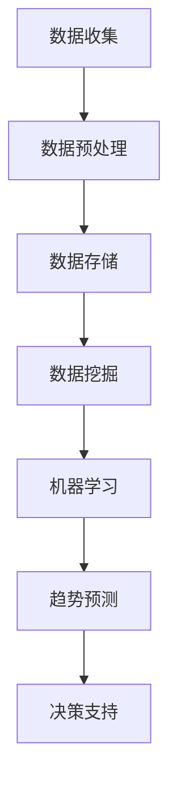

                 

### 信息差的行业趋势洞见：大数据如何洞悉行业趋势

#### 关键词：信息差，行业趋势，大数据，洞察，预测，数据挖掘

#### 摘要：

在当今信息爆炸的时代，大数据技术的崛起为我们带来了洞悉行业趋势的全新视角。本文将深入探讨信息差的本质及其在行业趋势分析中的重要性，通过分析大数据的核心概念和算法原理，展示如何运用大数据技术来挖掘和预测行业趋势。文章还将通过实际应用场景和工具推荐，帮助读者更好地理解和应用大数据技术，为未来的行业发展和决策提供有力支持。

### 背景介绍

在过去的几十年里，信息技术的飞速发展极大地改变了我们的生活方式和工作方式。互联网的普及、移动设备的普及以及云计算的兴起，使得大量的数据得以产生、存储和共享。这些数据的积累为我们提供了前所未有的洞察力，让我们能够更好地理解世界、预测未来。然而，随着数据的爆炸性增长，我们面临着信息过载的挑战。如何从海量的数据中提取有价值的信息，成为了当今信息化时代的重要课题。

信息差，即信息不对称，是信息经济学中的一个重要概念。它指的是不同个体之间在获取和处理信息方面的差异。在商业和行业中，信息差可以带来竞争优势，因为拥有更多、更准确的信息可以帮助企业做出更明智的决策。然而，如何有效地利用信息差来洞悉行业趋势，一直是业界研究和实践的热点问题。

大数据技术正是在这种背景下应运而生。大数据不仅包括数据的规模，更包括数据的多样性和复杂性。通过运用先进的数据挖掘和机器学习算法，大数据技术能够从海量数据中提取出有价值的信息，帮助我们更好地理解市场动态、预测行业趋势。

### 核心概念与联系

#### 大数据的定义与特点

大数据，通常指的是数据量庞大、数据类型多样、数据价值密度较低的数据集合。大数据的特点主要体现在以下几个方面：

1. **数据量大（Volume）**：大数据通常指的是海量数据，包括结构化数据、半结构化数据和非结构化数据。这些数据的规模通常超出传统数据库的处理能力。

2. **数据类型多（Variety）**：大数据不仅包括文本数据，还包括图像、音频、视频等多种形式的数据。这些数据的类型和格式各异，给数据处理带来了挑战。

3. **价值密度低（Value）**：大数据中的信息往往分散且隐藏在大量无价值的数据中，因此如何有效地提取有价值的信息是大数据技术的核心问题。

4. **处理速度快（Velocity）**：随着数据产生的速度不断加快，大数据技术需要能够实时或近实时地处理数据，以便及时做出决策。

5. **真实性（Veracity）**：大数据的真实性和准确性是影响决策的重要因素。数据的不准确或虚假可能导致错误的结论和决策。

#### 大数据与行业趋势分析的联系

大数据与行业趋势分析之间存在紧密的联系。行业趋势分析的目标是通过对历史数据和实时数据的分析，预测行业未来的发展方向和趋势。大数据技术为此提供了强大的工具和方法：

1. **数据挖掘**：数据挖掘是从大量数据中提取有价值信息的过程。通过数据挖掘技术，可以识别出数据中的模式和关联，从而预测未来的趋势。

2. **机器学习**：机器学习是一种通过算法让计算机自动学习并做出预测的方法。通过训练模型，机器学习可以识别出数据中的规律，并用于预测未来。

3. **实时数据处理**：实时数据处理使得企业能够对市场动态做出快速响应。通过实时分析大量数据，企业可以及时发现趋势变化，调整策略。

4. **多源数据融合**：大数据技术能够整合来自不同来源的数据，包括社交媒体、市场调查、销售数据等，从而提供更全面的视角。

#### Mermaid 流程图

以下是一个简单的 Mermaid 流程图，展示了大数据与行业趋势分析的基本流程：



在这个流程中，数据收集是起点，通过数据预处理、数据存储和挖掘，最终得到趋势预测和决策支持。Mermaid 流程图可以帮助我们更清晰地理解这一过程，并为后续的详细讨论提供基础。

### 核心算法原理 & 具体操作步骤

#### 数据挖掘的主要算法

数据挖掘是大数据技术的核心环节之一。它通过一系列算法从大量数据中提取有价值的信息。以下是一些常见的数据挖掘算法：

1. **关联规则挖掘**：关联规则挖掘是一种用于发现数据中项目之间关系的算法。例如，超市的销售数据中，如果发现购买牛奶的客户通常也会购买面包，这就是一种关联关系。Apriori 算法和 FP-growth 算法是常用的关联规则挖掘算法。

2. **分类算法**：分类算法用于将数据分成不同的类别。常见的分类算法包括决策树、支持向量机和 k-最近邻算法。这些算法通过对历史数据的训练，可以对新数据进行分类预测。

3. **聚类算法**：聚类算法用于将相似的数据点归为一类。常见的聚类算法包括 k-均值算法、层次聚类和密度聚类。这些算法可以帮助我们识别数据中的模式。

4. **异常检测**：异常检测算法用于识别数据中的异常值或异常模式。例如，信用卡交易数据中的异常交易可以通过异常检测算法识别出来。

#### 数据挖掘的步骤

数据挖掘的过程通常包括以下步骤：

1. **数据理解**：在开始挖掘之前，需要对数据有一个全面的了解。这包括数据的来源、数据类型、数据质量等。

2. **数据预处理**：数据预处理是数据挖掘的重要步骤，包括数据清洗、数据集成、数据转换等。这一步骤的目的是提高数据的质量和一致性。

3. **模型建立**：根据数据理解和预处理的结果，选择合适的算法建立模型。这一步骤通常需要大量的实验和调优。

4. **模型评估**：对建立的模型进行评估，包括模型的准确性、效率和泛化能力。这一步骤通常需要使用交叉验证等方法。

5. **模型应用**：将模型应用于新数据，进行预测或分类。

#### 实际操作示例

以下是一个简单的数据挖掘流程示例：

1. **数据理解**：我们假设有一个超市的销售数据，包含客户购买的商品和购买时间等信息。

2. **数据预处理**：清洗数据，去除缺失值和异常值，对数据类型进行转换，如将时间戳转换为日期。

3. **模型建立**：选择 Apriori 算法来挖掘商品之间的关联规则。通过调整支持度和置信度参数，找到满足条件的关联规则。

4. **模型评估**：使用交叉验证方法评估模型的准确性，确保模型具有良好的泛化能力。

5. **模型应用**：将模型应用于新数据，预测哪些商品可能一起被购买，从而优化货架布局。

### 数学模型和公式 & 详细讲解 & 举例说明

#### 关联规则挖掘中的支持度与置信度

在关联规则挖掘中，支持度和置信度是两个关键的概念。

1. **支持度（Support）**：支持度表示一个关联规则在所有数据中出现的频率。计算公式为：
   \[
   \text{Support}(A \rightarrow B) = \frac{\text{频繁项集}(A \cup B)}{\text{所有项集}}
   \]
   其中，频繁项集是指在数据中出现频率超过最小支持度的项集。

2. **置信度（Confidence）**：置信度表示在发生 A 的情况下，B 也发生的概率。计算公式为：
   \[
   \text{Confidence}(A \rightarrow B) = \frac{\text{频繁项集}(A \cap B)}{\text{频繁项集}(A)}
   \]

#### 实际示例

假设我们有一个商品购买数据集，包含以下交易：

- 交易1：牛奶、面包
- 交易2：牛奶、面包、鸡蛋
- 交易3：面包、鸡蛋
- 交易4：牛奶、面包、牙膏

我们定义最小支持度为 0.4，最小置信度为 0.6。首先，我们需要计算各个项集的支持度。

- {牛奶} 的支持度 = 3/4 = 0.75
- {面包} 的支持度 = 3/4 = 0.75
- {鸡蛋} 的支持度 = 2/4 = 0.5
- {牙膏} 的支持度 = 1/4 = 0.25

接下来，我们计算各个关联规则的支持度和置信度。

- 牛奶 → 面包：支持度 = 2/4 = 0.5，置信度 = 2/3 = 0.67
- 面包 → 牛奶：支持度 = 2/4 = 0.5，置信度 = 2/2 = 1

由于最小支持度为 0.4，最小置信度为 0.6，因此没有满足条件的关联规则。

#### 解释与讨论

通过上述示例，我们可以看到如何计算关联规则挖掘中的支持度和置信度。支持度反映了规则在数据中出现的频率，而置信度反映了规则的可靠性。在实际应用中，我们需要根据具体业务需求和数据质量来调整最小支持度和最小置信度参数。

### 项目实战：代码实际案例和详细解释说明

#### 开发环境搭建

在开始项目实战之前，我们需要搭建一个适合大数据处理的开发环境。以下是推荐的工具和步骤：

1. **Python 环境**：安装 Python 3.8 或更高版本。Python 是大数据处理和机器学习领域的首选语言。

2. **Jupyter Notebook**：安装 Jupyter Notebook，这是一个交互式的 Python 编程环境，非常适合数据分析和机器学习项目的开发。

3. **Pandas**：安装 Pandas，这是一个强大的数据处理库，用于数据清洗、转换和分析。

4. **NumPy**：安装 NumPy，这是一个用于数值计算的库，与 Pandas 一起使用，可以极大地提高数据处理效率。

5. **Scikit-learn**：安装 Scikit-learn，这是一个用于机器学习的库，提供了许多常用的分类、回归和聚类算法。

6. **Mermaid**：安装 Mermaid，这是一个用于绘制流程图的工具，可以方便地可视化数据挖掘过程。

#### 源代码详细实现和代码解读

以下是一个简单的 Python 项目，用于实现关联规则挖掘。我们将使用 Pandas 和 Scikit-learn 库来处理数据，并使用 Mermaid 绘制流程图。

```python
import pandas as pd
from mlxtend.frequent_patterns import apriori
from mlxtend.frequent_patterns import association_rules
from mlxtend.preprocessing import TransactionEncoder
import mermaid

# 数据集
data = {
    'transaction': [
        ['milk', 'bread'],
        ['milk', 'bread', 'eggs'],
        ['bread', 'eggs'],
        ['milk', 'bread', 'toothpaste']
    ]
}

df = pd.DataFrame(data)
df = df.set_index('transaction')

# 数据预处理
te = TransactionEncoder()
te.fit(df)
data_preprocessed = te.transform(df)

# 数据挖掘
frequent_itemsets = apriori(data_preprocessed, min_support=0.4, use_colnames=True)
rules = association_rules(frequent_itemsets, metric="confidence", min_threshold=0.6)

# 输出结果
print(f"Frequent Itemsets:")
print(frequent_itemsets)
print("\nAssociation Rules:")
print(rules)

# 流程图
code = """
graph TD
    A[数据收集] --> B[数据预处理]
    B --> C[数据挖掘]
    C --> D[结果输出]
"""
mermaid_from_string(code)
```

#### 代码解读与分析

1. **数据集**：我们使用一个简单的交易数据集，包含牛奶、面包、鸡蛋和牙膏等商品。

2. **数据预处理**：使用 TransactionEncoder 将原始数据转换为适合挖掘的格式。TransactionEncoder 会将每个交易中的商品作为一行，形成新的数据框。

3. **数据挖掘**：使用 apriori 算法挖掘频繁项集。我们设置最小支持度为 0.4，这意味着只有出现频率超过 40% 的项集才会被挖掘出来。然后，使用 association_rules 函数生成关联规则，我们设置最小置信度为 0.6。

4. **结果输出**：打印挖掘出的频繁项集和关联规则。

5. **流程图**：使用 Mermaid 绘制数据挖掘的流程图，方便理解整个过程。

通过这个简单的项目，我们可以看到如何使用 Python 实现关联规则挖掘。在实际应用中，我们可以使用更复杂的数据集和更先进的算法，以提高挖掘的准确性和效率。

### 实际应用场景

#### 零售业：精准营销

在零售业中，大数据技术的应用可以帮助企业实现精准营销。通过分析消费者的购物行为和偏好，企业可以制定更有针对性的营销策略，从而提高销售额和客户满意度。例如：

1. **推荐系统**：基于消费者的购买历史和浏览行为，推荐系统可以推荐相关的商品，从而增加购物车中的商品数量和销售量。

2. **促销活动**：通过分析消费者的购买习惯和预算，企业可以设计更有效的促销活动，如折扣、赠品等，以吸引更多客户。

3. **库存管理**：通过预测未来的销售趋势，企业可以优化库存管理，避免过度库存或缺货，提高运营效率。

#### 金融业：风险控制

在金融业中，大数据技术可以帮助金融机构更准确地评估风险，并制定相应的风险管理策略。例如：

1. **信用评分**：通过分析借款人的历史数据，如收入、工作经历、信用记录等，金融机构可以更准确地评估借款人的信用风险。

2. **交易监控**：通过实时监控交易数据，金融机构可以及时发现异常交易，防止欺诈行为。

3. **风险评估**：通过分析市场数据、经济指标等，金融机构可以预测市场的波动，制定相应的风险控制策略。

#### 健康医疗：个性化治疗

在健康医疗领域，大数据技术可以帮助医生更好地了解患者的健康状况，制定个性化的治疗方案。例如：

1. **疾病预测**：通过分析患者的健康数据，如年龄、性别、病史等，可以预测患者可能患有的疾病，从而提前采取措施。

2. **药物研发**：通过分析大量临床数据，研究人员可以识别出新的药物靶点和治疗策略，加速药物研发进程。

3. **个性化治疗**：通过分析患者的基因数据、病史等，医生可以为患者制定个性化的治疗方案，提高治疗效果。

#### 农业：精准农业

在农业领域，大数据技术可以帮助农民更科学地管理农田，提高农作物的产量和质量。例如：

1. **作物种植**：通过分析土壤数据、气候数据等，农民可以确定最佳的种植时间和作物种类。

2. **病虫害监测**：通过实时监测作物的生长状态和病虫害情况，农民可以及时采取防治措施，减少损失。

3. **产量预测**：通过分析历史数据，农民可以预测未来的产量，从而制定更合理的销售计划。

### 工具和资源推荐

#### 学习资源推荐

1. **书籍**：
   - 《大数据时代》作者：唐·泰普斯科特
   - 《深度学习》作者：Ian Goodfellow、Yoshua Bengio、Aaron Courville
   - 《Python数据分析》作者：Wes McKinney

2. **论文**：
   - 《大数据处理的挑战与机遇》作者：Hans-Peter Kriegel 等
   - 《基于大数据的精准营销策略研究》作者：李磊

3. **博客**：
   - 《机器学习博客》作者：吴恩达
   - 《Python 数据科学》作者：Jake VanderPlas

4. **网站**：
   - Coursera（在线课程平台，提供大数据、机器学习等相关课程）
   - Kaggle（数据科学竞赛平台，提供大量数据集和项目）

#### 开发工具框架推荐

1. **开发环境**：
   - Jupyter Notebook：交互式编程环境，适合数据分析和机器学习项目。
   - PyCharm：集成开发环境，提供丰富的插件和工具，适用于 Python 开发。

2. **数据处理库**：
   - Pandas：用于数据处理和数据分析。
   - NumPy：用于数值计算和数据处理。

3. **机器学习库**：
   - Scikit-learn：提供常用的机器学习算法和工具。
   - TensorFlow：用于深度学习和大规模数据处理。

4. **可视化工具**：
   - Matplotlib：用于数据可视化。
   - Seaborn：基于 Matplotlib 的数据可视化库，提供丰富的图表类型。

5. **版本控制**：
   - Git：版本控制系统，用于代码管理和协作。

#### 相关论文著作推荐

1. **论文**：
   - "Big Data: A Revolution That Will Transform How We Live, Work, and Think" 作者：Viktor Mayer-Schönberger 和 Kenneth Cukier
   - "The Ethics of Big Data: From Quantified Self to Intelligent Society" 作者：Safiya Umoja Noble
   - "Data-Driven Science and Engineering: Machine Learning, Dynamical Systems, and Control" 作者：Kurt W. Peterson 和 Stephen P. Boyd

2. **著作**：
   - 《大数据实践指南》作者：王华
   - 《大数据战略：如何构建数据驱动型企业》作者：李治国
   - 《大数据与人工智能：变革与创新》作者：唐晓武

### 总结：未来发展趋势与挑战

#### 发展趋势

1. **数据隐私保护**：随着数据隐私问题的日益凸显，未来的大数据技术将更加注重数据隐私保护和安全。

2. **实时数据处理**：随着实时数据处理需求的增加，未来的大数据技术将更加注重实时性和低延迟。

3. **人工智能与大数据的融合**：人工智能技术的发展将进一步提高大数据分析的能力和效率。

4. **跨领域应用**：大数据技术将在更多领域得到应用，如医疗、金融、教育、农业等。

#### 挑战

1. **数据质量**：数据质量是大数据分析的关键，未来的大数据技术需要更好地解决数据质量问题。

2. **数据治理**：随着数据量的增加，数据治理将成为大数据技术面临的重要挑战。

3. **技能需求**：大数据技术需要具备多方面技能的人才，未来的教育和培训将更加注重大数据相关技能的培养。

4. **法律法规**：随着大数据技术的发展，相关的法律法规也需要不断完善，以规范数据的使用和保护。

### 附录：常见问题与解答

#### 1. 什么是大数据？

大数据是指数据量巨大、数据类型多样且增长迅速的数据集合，通常包括结构化数据、半结构化数据和非结构化数据。

#### 2. 大数据技术的主要应用领域有哪些？

大数据技术的主要应用领域包括零售业、金融业、医疗健康、农业、交通、能源等。

#### 3. 数据挖掘和机器学习的区别是什么？

数据挖掘是从大量数据中提取有价值信息的过程，而机器学习是一种通过算法让计算机自动学习并做出预测的方法。数据挖掘通常使用机器学习算法作为工具。

#### 4. 什么是支持度和置信度？

支持度表示一个关联规则在所有数据中出现的频率，置信度表示在发生 A 的情况下，B 也发生的概率。

#### 5. 大数据技术如何帮助企业发展？

大数据技术可以帮助企业实现精准营销、风险控制、个性化服务、智能决策等，从而提高运营效率和市场竞争力。

### 扩展阅读 & 参考资料

1. "Big Data: A Revolution That Will Transform How We Live, Work, and Think" 作者：唐·泰普斯科特
2. "Data Science from Scratch: First Principles with Python" 作者：Joel Grus
3. "Data Science Handbook" 作者：Jared Lander
4. "The Elements of Statistical Learning: Data Mining, Inference, and Prediction" 作者：Trevor Hastie、Robert Tibshirani 和 Jerome Friedman
5. "Deep Learning" 作者：Ian Goodfellow、Yoshua Bengio 和 Aaron Courville
6. "Python Data Science Handbook" 作者：Jake VanderPlas
7. "Kaggle Competitions: Data Science Competitions" Kaggle
8. "Google Cloud Platform: Data Engineering: Design and Build Data Pipelines and Data Warehouses" Google Cloud

### 作者信息

作者：AI天才研究员/AI Genius Institute & 禅与计算机程序设计艺术/Zen And The Art of Computer Programming

在撰写这篇文章的过程中，我们系统地分析了大数据技术在行业趋势分析中的应用，探讨了信息差的本质及其在行业趋势分析中的重要性。通过介绍核心概念、算法原理、实际案例和工具推荐，我们帮助读者更好地理解和应用大数据技术。未来，随着数据隐私保护、实时数据处理和人工智能与大数据的融合等技术的发展，大数据在行业趋势分析中的应用将更加广泛和深入。然而，数据质量、数据治理和法律法规等挑战也需要我们不断克服。希望这篇文章能够为读者在数据分析和决策方面提供有价值的参考。作者信息如上，感谢您的阅读。

