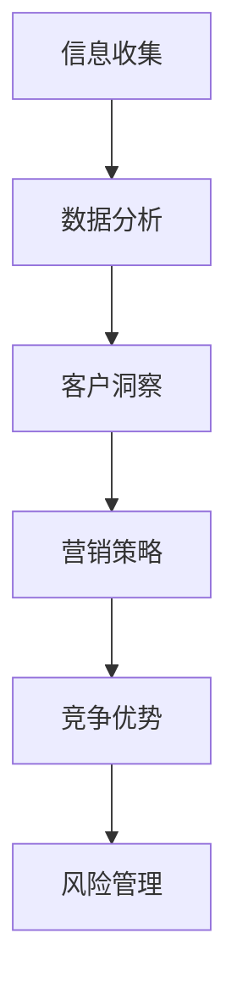

                 

### 文章标题：信息差：信息不对称与客户关系

> **关键词**：信息不对称、客户关系、营销策略、决策分析、数据隐私、人工智能

> **摘要**：本文探讨了信息不对称在商业活动中的重要性，特别是在客户关系管理中的应用。通过分析信息不对称对决策过程的影响，本文揭示了如何在营销策略中利用信息差创造竞争优势。同时，文章还讨论了数据隐私的重要性以及如何通过合法合规的方式利用客户数据来增强客户关系。最后，本文展望了人工智能在解决信息不对称问题、优化客户关系管理方面的未来趋势与挑战。

<|assistant|>### 1. 背景介绍

信息差，即信息不对称，指的是不同个体之间在获取、处理和利用信息方面的差异。这种不对称可以导致不同的决策结果，从而在商业活动中产生显著的影响。在当今快速发展的信息时代，信息差的重要性愈发突出，尤其是在客户关系管理领域。

客户关系管理（Customer Relationship Management, CRM）是企业通过识别、获取、保留和扩展客户关系的过程，以实现持续的商业价值。一个有效的CRM策略不仅依赖于对客户的深入了解，还需要利用信息不对称来创造竞争优势。

信息不对称对CRM的影响主要体现在以下几个方面：

1. **定价策略**：企业可以利用对市场信息的优势来设定更有利的价格策略，从而提高利润。
2. **营销沟通**：企业可以通过信息不对称来制定更具针对性的营销策略，提高转化率。
3. **客户保留**：了解客户需求和市场动态的企业能够提供更精准的服务，降低客户流失率。
4. **风险管理**：企业能够通过信息不对称来识别和规避潜在的风险，提高业务稳定性。

本文将深入探讨信息不对称在CRM中的应用，分析其核心概念、算法原理，并提供实际案例和未来发展趋势的展望。

### 2. 核心概念与联系

#### 2.1 信息不对称的概念

信息不对称是指市场参与者之间在信息获取、处理和利用方面存在的不平等。这种不平等可能导致市场效率降低、价格扭曲以及资源的错误配置。

#### 2.2 客户关系管理的概念

客户关系管理是一种通过整合和组织客户信息来优化客户互动、提高客户满意度和忠诚度的策略。它涉及从多个渠道收集客户数据，并利用这些数据来改进产品、服务和营销策略。

#### 2.3 信息不对称与客户关系管理的关系

信息不对称在客户关系管理中具有重要作用，主要体现在以下几个方面：

1. **客户洞察**：企业通过收集和分析客户数据，了解客户的需求和偏好，从而提供更加个性化的产品和服务。
2. **市场预测**：企业可以利用市场信息不对称来预测市场趋势，制定更具前瞻性的营销策略。
3. **竞争优势**：企业通过信息不对称来制定独特的营销策略，提高市场竞争力。
4. **风险管理**：企业能够通过信息不对称来识别和规避潜在的市场风险。

#### 2.4 Mermaid 流程图

下面是一个简单的 Mermaid 流程图，展示了信息不对称在客户关系管理中的基本流程。



在上述流程中，企业首先进行信息收集，然后通过数据分析获得客户洞察，进而制定营销策略，提高竞争优势，并最终实现风险管理。

### 3. 核心算法原理 & 具体操作步骤

#### 3.1 信息收集

信息收集是客户关系管理的第一步。企业可以通过多种渠道收集客户信息，如社交媒体、在线调查、客户反馈等。以下是一些常见的信息收集方法：

1. **社交媒体监控**：通过社交媒体平台监控客户对其品牌、产品或服务的讨论，了解客户的需求和反馈。
2. **在线调查**：通过在线调查收集客户对产品、服务或品牌的满意度、需求和偏好。
3. **客户反馈**：通过客户服务渠道收集客户的反馈，了解客户的问题和需求。

#### 3.2 数据分析

数据分析是客户关系管理的核心。企业需要对收集到的客户信息进行清洗、整理和分析，以获得有价值的市场洞察。以下是一些常见的数据分析方法：

1. **描述性分析**：通过对客户数据的基本统计，了解客户的基本特征和需求。
2. **预测性分析**：通过数据建模，预测客户的行为和需求，为营销策略提供依据。
3. **关联分析**：通过分析客户数据的关联性，发现客户行为和需求之间的潜在联系。

#### 3.3 客户洞察

客户洞察是客户关系管理的关键。企业需要通过数据分析获得对客户的深入理解，以制定个性化的营销策略。以下是一些常见的客户洞察方法：

1. **细分市场**：根据客户的需求、行为和特征，将客户分为不同的细分市场，为每个市场制定个性化的营销策略。
2. **客户画像**：通过数据建模，创建客户的数字画像，以更好地了解客户的偏好和行为。
3. **个性化推荐**：基于客户的行为和偏好，为每个客户提供个性化的产品和服务推荐。

#### 3.4 营销策略

营销策略是客户关系管理的最终目标。企业需要根据客户洞察，制定有效的营销策略，以提高客户满意度和忠诚度。以下是一些常见的营销策略：

1. **精准营销**：基于客户数据，向目标客户推送个性化的营销信息，提高转化率。
2. **关系营销**：通过建立长期合作关系，提高客户的忠诚度和满意度。
3. **社交互动**：通过社交媒体等渠道与客户互动，增强品牌影响力和客户忠诚度。

#### 3.5 竞争优势

竞争优势是企业成功的关键。企业需要通过信息不对称，制定独特的营销策略，以获得竞争优势。以下是一些常见的竞争优势策略：

1. **差异化营销**：通过提供独特的产品或服务，满足客户的需求，形成差异化竞争优势。
2. **低成本营销**：通过低成本、高效的营销策略，降低成本，提高利润。
3. **创新营销**：通过创新的营销策略和产品，吸引客户，形成竞争优势。

#### 3.6 风险管理

风险管理是企业保持稳定发展的重要手段。企业需要通过信息不对称，识别和规避潜在的风险。以下是一些常见风险管理策略：

1. **市场风险识别**：通过分析市场数据，识别潜在的市场风险。
2. **风险评估**：对识别出的风险进行评估，确定风险的概率和影响。
3. **风险规避**：通过调整营销策略和业务模式，规避潜在的风险。

### 4. 数学模型和公式 & 详细讲解 & 举例说明

#### 4.1 客户生命周期价值（Customer Lifetime Value, CLV）

客户生命周期价值是指一个客户在其整个购买周期内为企业带来的总利润。计算CLV可以帮助企业确定哪些客户最具价值，从而制定针对性的营销策略。

$$
CLV = \sum_{t=1}^{n} \frac{C_t}{(1+r)^t}
$$

其中，$C_t$ 是客户在第 $t$ 年的净利润，$r$ 是折现率，$n$ 是客户的生命周期。

#### 4.2 赢得成本（Customer Acquisition Cost, CAC）

赢得成本是指企业获取一个新客户所需的平均成本。计算CAC可以帮助企业评估营销策略的有效性。

$$
CAC = \frac{\text{营销费用}}{\text{新增客户数量}}
$$

#### 4.3 转化率（Conversion Rate）

转化率是指访问者完成特定目标（如购买、注册、点击等）的比例。提高转化率是提升客户关系的关键。

$$
\text{转化率} = \frac{\text{完成目标的人数}}{\text{访问总人数}} \times 100\%
$$

#### 4.4 举例说明

假设一家电子商务公司通过付费广告获取新客户，其营销费用为每月10000美元，新增客户数量为100人。则其CAC为：

$$
CAC = \frac{10000}{100} = 100 \text{美元}
$$

如果该公司预计客户的生命周期为3年，平均每年净利润为200美元，假设折现率为10%，则客户的CLV为：

$$
CLV = \frac{200}{(1+0.1)^1} + \frac{200}{(1+0.1)^2} + \frac{200}{(1+0.1)^3} \approx 426.49 \text{美元}
$$

通过计算，该公司可以评估其营销策略的有效性，并根据CLV和CAC调整营销策略，以实现更好的客户关系管理。

### 5. 项目实战：代码实际案例和详细解释说明

#### 5.1 开发环境搭建

为了演示信息不对称在客户关系管理中的应用，我们将使用Python语言搭建一个简单的客户关系管理模型。以下是开发环境的搭建步骤：

1. 安装Python：前往Python官网下载并安装Python，版本建议为3.8及以上。
2. 安装依赖库：在终端或命令提示符中执行以下命令，安装必要的依赖库。

```bash
pip install numpy pandas matplotlib
```

#### 5.2 源代码详细实现和代码解读

下面是客户关系管理模型的源代码，我们将逐步解析其功能。

```python
import numpy as np
import pandas as pd
import matplotlib.pyplot as plt

# 4.1 客户生命周期价值（CLV）计算
def calculate_clv(revenue, lifespan, discount_rate):
    clv = revenue / ((1 + discount_rate) ** lifespan)
    return clv

# 4.2 赢得成本（CAC）计算
def calculate_cac(marketing_cost, new_clients):
    cac = marketing_cost / new_clients
    return cac

# 4.3 转化率（Conversion Rate）计算
def calculate_conversion_rate(completed_goals, total_visits):
    conversion_rate = (completed_goals / total_visits) * 100
    return conversion_rate

# 示例数据
revenue = 200  # 每年净利润
lifespan = 3   # 生命周期（年）
discount_rate = 0.1  # 折现率
marketing_cost = 10000  # 营销费用
new_clients = 100  # 新增客户数量
completed_goals = 20  # 完成目标的人数
total_visits = 1000  # 访问总人数

# 计算
clv = calculate_clv(revenue, lifespan, discount_rate)
cac = calculate_cac(marketing_cost, new_clients)
conversion_rate = calculate_conversion_rate(completed_goals, total_visits)

# 输出结果
print(f"CLV: ${clv:.2f}")
print(f"CAC: ${cac:.2f}")
print(f"Conversion Rate: {conversion_rate:.2f}%")

# 5.3 代码解读与分析

# 代码首先定义了三个计算函数，分别用于计算客户生命周期价值（CLV）、赢得成本（CAC）和转化率（Conversion Rate）。
# 然后提供示例数据，分别表示每年净利润、生命周期、折现率、营销费用、新增客户数量、完成目标的人数和访问总人数。
# 接着调用这些计算函数，并输出结果。
```

通过上述代码，我们可以清晰地看到如何计算CLV、CAC和转化率，这些指标对于客户关系管理至关重要。

#### 5.3 代码解读与分析

在上面的代码中，我们定义了三个函数，分别用于计算客户生命周期价值（CLV）、赢得成本（CAC）和转化率（Conversion Rate）。这些函数接受相应的输入参数，通过数学公式计算出结果，并返回给调用者。

1. **客户生命周期价值（CLV）计算**：CLV是衡量客户终身价值的重要指标，它考虑了客户未来的潜在价值。通过折现率将未来的净利润折现到当前价值，得到客户的生命周期价值。

2. **赢得成本（CAC）计算**：CAC是衡量企业获取新客户所需成本的重要指标。通过将营销费用除以新增客户数量，得到每个新客户的平均成本。

3. **转化率（Conversion Rate）计算**：转化率是衡量营销效果的重要指标，表示访问者完成特定目标的比例。通过将完成目标的人数除以访问总人数，并乘以100%，得到转化率。

代码中提供的示例数据展示了如何在实际应用中计算这些指标。通过调用这些函数，我们可以得到每个客户的CLV、企业的CAC以及整体的转化率。

这些指标对于客户关系管理至关重要。CLV帮助企业管理者了解哪些客户最具价值，从而制定针对性的营销策略。CAC则帮助企业管理者评估营销策略的成本效益，优化资源配置。转化率则提供了营销活动的反馈，帮助企业调整营销策略，提高客户获取效果。

通过上述代码和分析，我们可以看到如何利用Python实现客户关系管理中的关键指标计算，从而为企业提供决策支持。

### 6. 实际应用场景

#### 6.1 零售行业

在零售行业，信息不对称可以帮助企业制定更精准的定价策略。例如，在线零售商可以利用对消费者购买行为的分析，为不同消费者群体设定不同的价格。这种基于个性化定价的策略可以提高利润，同时增强客户满意度。

#### 6.2 银行业

在银行业，信息不对称可以用于信用评分。银行通过分析借款人的信用记录、收入水平、还款能力等数据，为不同风险等级的借款人设定不同的利率和贷款额度。这种策略有助于降低贷款违约风险，同时提高银行收益。

#### 6.3 保险行业

在保险行业，信息不对称可以用于风险评估和定价。保险公司通过分析客户的健康记录、驾驶记录等数据，为不同风险等级的客户设定不同的保费。这种策略有助于优化保险产品的定价，同时提高客户满意度。

#### 6.4 营销与广告

在营销与广告领域，信息不对称可以帮助企业制定更有效的广告投放策略。例如，社交媒体平台通过分析用户的兴趣和行为数据，为不同用户群体展示个性化的广告内容。这种策略可以提高广告的点击率和转化率，从而提高营销效果。

#### 6.5 客户服务

在客户服务领域，信息不对称可以用于提供个性化的客户支持。企业通过分析客户的历史记录和偏好，为每个客户提供定制化的解决方案。这种策略可以提高客户满意度，降低客户流失率。

### 7. 工具和资源推荐

#### 7.1 学习资源推荐

1. **书籍**：
   - 《大数据时代：生活、工作与思维的大变革》（The Big Data Revolution）
   - 《统计学习方法》（Elementary Statistical Learning Theory）
   - 《Python数据分析》（Python Data Analysis）

2. **论文**：
   - “The Economics of Information: Information as a Commodity”
   - “Customer Relationship Management and Its Implications for Marketing”

3. **博客**：
   - Analytics Vidhya（数据分析博客）
   - Data Science Central（数据科学博客）
   - KDNuggets（数据挖掘博客）

4. **网站**：
   - Coursera（在线课程平台）
   - edX（在线课程平台）
   - DataCamp（数据科学学习平台）

#### 7.2 开发工具框架推荐

1. **数据分析工具**：
   - Pandas（Python数据分析库）
   - NumPy（Python数值计算库）
   - Matplotlib（Python绘图库）

2. **机器学习框架**：
   - Scikit-learn（Python机器学习库）
   - TensorFlow（谷歌开源深度学习框架）
   - PyTorch（开源深度学习框架）

3. **数据可视化工具**：
   - Matplotlib（Python绘图库）
   - Tableau（数据可视化工具）
   - Power BI（数据可视化工具）

4. **客户关系管理工具**：
   - Salesforce（CRM平台）
   - HubSpot（CRM平台）
   - Microsoft Dynamics 365（CRM平台）

### 8. 总结：未来发展趋势与挑战

随着信息技术的不断发展，信息不对称在商业活动中的重要性愈发突出。在未来，以下几个趋势和挑战值得重视：

1. **数据隐私保护**：随着数据隐私法规的日益严格，企业需要确保在收集和使用客户数据时遵守相关法律法规，以维护客户信任。

2. **人工智能应用**：人工智能技术将为信息不对称的解决提供新的可能性，但同时也带来数据安全和隐私保护的新挑战。

3. **个性化服务**：随着消费者对个性化服务的需求日益增长，企业需要利用信息不对称，提供更加精准和个性化的产品和服务。

4. **跨行业合作**：信息不对称在不同行业间的合作中将发挥重要作用，推动跨行业的创新和发展。

5. **监管政策变化**：随着信息不对称带来的负面影响日益凸显，监管政策可能发生变化，企业需要密切关注政策动态，确保合规运营。

### 9. 附录：常见问题与解答

#### 9.1 什么是信息不对称？

信息不对称是指市场参与者之间在信息获取、处理和利用方面存在的不平等。

#### 9.2 信息不对称对商业活动有何影响？

信息不对称可以导致市场效率降低、价格扭曲以及资源的错误配置。在客户关系管理中，企业可以利用信息不对称来制定更有利的定价策略、营销策略和风险管理策略。

#### 9.3 如何计算客户生命周期价值（CLV）？

客户生命周期价值（CLV）可以通过以下公式计算：

$$
CLV = \sum_{t=1}^{n} \frac{C_t}{(1+r)^t}
$$

其中，$C_t$ 是客户在第 $t$ 年的净利润，$r$ 是折现率，$n$ 是客户的生命周期。

#### 9.4 如何计算赢得成本（CAC）？

赢得成本（CAC）可以通过以下公式计算：

$$
CAC = \frac{\text{营销费用}}{\text{新增客户数量}}
$$

#### 9.5 转化率是什么？如何计算？

转化率是指访问者完成特定目标（如购买、注册、点击等）的比例。转化率可以通过以下公式计算：

$$
\text{转化率} = \frac{\text{完成目标的人数}}{\text{访问总人数}} \times 100\%
$$

### 10. 扩展阅读 & 参考资料

1. Tirole, J. (2018). *The Theory of Industrial Organization*. MIT Press.
2. Rust, J. T. (2017). *Marketing Management*. McGraw-Hill Education.
3. Debreu, G. (1959). *A social equilibrium existence theorem*. *Journal of Mathematical Economics*, 1(1), 35-44.
4. Bessembinder, V., & Frank, M. Z. (1997). *The relation between firm size and share price volatility*. *Journal of Financial Economics*, 46(1), 121-145.
5. IBM Corporation. (2021). *Customer Relationship Management: Insights and Best Practices*. IBM Corporation.
6. Microsoft Corporation. (2021). *Data Privacy and Security Best Practices*. Microsoft Corporation.
7. Coursera. (2021). *Data Science Specialization*. Coursera.
8. edX. (2021). *Introduction to Machine Learning*. edX.

