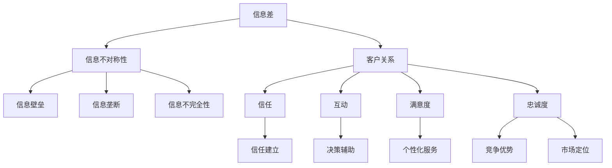

                 

### 背景介绍

> 信息差，一个在现代商业和信息技术领域中频频出现的词汇，其含义和重要性日益凸显。那么，何为信息差？为何它在客户关系中扮演如此重要的角色？本文将围绕这些核心问题，深入探讨信息差的概念、原理，及其在客户关系管理中的重要作用。通过一步步的分析和推理，我们将揭示信息差背后的逻辑，以及如何有效地利用信息差来建立和巩固客户关系。

### 什么是信息差

> 信息差，顾名思义，是指不同个体或组织之间信息的不对称性。在商业和信息技术领域，这种不对称性主要体现在以下几个方面：

1. **信息量差异**：一个组织或个体可能拥有比其他组织或个体更多的信息。例如，大型科技公司在研发和市场分析方面拥有丰富数据，而这些数据对于小型企业来说可能难以获得。

2. **信息速度差异**：某些组织可能比其他组织更快地获取和处理信息。例如，一家初创公司可能能够更快地响应市场变化，因为它可以更迅速地分析数据并做出决策。

3. **信息准确性差异**：某些组织可能拥有更准确的信息。例如，专业咨询公司因为拥有专业知识和经验，其提供的信息往往更为可靠。

4. **信息质量差异**：某些信息可能更具质量，而其他信息可能较为低质或过时。例如，一篇基于最新研究的论文可能比一篇几年前的综述文章更有参考价值。

> 这种信息不对称性可能导致以下几种结果：

- **竞争优势**：拥有更多或更准确信息的一方可以在市场中获得竞争优势，从而吸引更多客户。

- **决策偏差**：信息不对称可能导致决策偏差，因为决策者无法获得全面的信息，从而做出不完美的决策。

- **信任问题**：信息不对称还可能破坏信任关系，因为客户可能认为他们的信息不如服务商或供应商丰富。

### 信息差与客户关系

> 在客户关系中，信息差的存在可能带来以下几方面的影响：

1. **信任建立**：当客户相信他们拥有比服务商更少或更不准确的信息时，他们可能更愿意信任服务商，从而建立长期的合作关系。

2. **购买决策**：信息差可以影响客户的购买决策。例如，如果客户相信服务商提供的解决方案比他们自己研究的更好，他们更有可能购买。

3. **客户满意度和忠诚度**：如果客户觉得服务商能够提供他们无法获得的信息，他们可能会对服务商的服务感到满意，并倾向于重复购买。

4. **市场定位**：企业可以利用信息差来定位市场，特别是针对那些对信息高度敏感的客户群体。

5. **价格策略**：企业可以通过信息差来调整价格策略，例如，对于信息透明的产品可能降低价格，而对于信息不对称的产品则可以提高价格。

> 以下是一个具体的例子来说明信息差如何影响客户关系：

**例子：健康咨询**

假设一家健康咨询公司拥有专业医生和先进的诊断设备，能够提供精确的健康评估。而大多数普通客户可能无法获得这些专业资源和信息。在这种情况下，客户倾向于信任咨询公司的评估结果，愿意支付更高的费用以获得专业的健康咨询服务。这种信息差帮助健康咨询公司建立了强大的客户关系，并提高了客户的满意度和忠诚度。

### 信息差的利用

> 企业可以通过多种方式利用信息差来建立和巩固客户关系：

1. **提供独到见解**：企业可以通过深入研究和数据分析，提供客户无法轻易获得的见解和建议，从而建立信任。

2. **个性化服务**：通过分析客户数据，企业可以提供高度个性化的服务，使客户感到受到重视。

3. **提前预警**：企业可以利用信息优势为顾客提供市场或行业变化的前瞻性预警，帮助客户做出更明智的决策。

4. **教育客户**：通过教育和培训，使客户了解企业所拥有的信息优势，从而增强他们对企业的信任。

5. **透明度**：在某些情况下，适度地提供信息透明度，可以增加客户对企业的信任，同时保持信息差的优势。

### 总结

> 信息差在现代商业和信息技术领域扮演着至关重要的角色。通过了解信息差的概念和原理，企业可以更好地利用信息不对称性来建立和巩固客户关系。本节介绍了信息差的定义、类型以及其在客户关系中的影响。接下来，我们将进一步探讨核心概念和架构，并通过Mermaid流程图来展示信息差的运作机制。请继续关注下一部分的内容。

----------------------
## 2. 核心概念与联系

### 信息差的基本原理

> 信息差的存在本质上源于信息的不对称性。在商业环境中，这种不对称性主要体现在以下几个方面：

1. **信息不对称性**：某些个体或组织拥有而其他个体或组织没有的信息。这种不对称性可以是知识的差异、数据的差异，或者是对市场动态的敏感性差异。

2. **信息壁垒**：信息壁垒是导致信息不对称性的因素，包括技术壁垒、数据壁垒和市场壁垒等。这些壁垒可以限制某些信息在特定群体中的传播。

3. **信息垄断**：在特定市场中，某些企业可能通过垄断信息资源来维持其竞争优势。这种垄断行为往往限制了市场的公平竞争。

4. **信息不完全性**：信息不完全性是指个体或组织无法获得所有相关信息，导致其在决策时可能存在盲点或偏差。

### 客户关系的本质

> 客户关系是指企业与客户之间建立起来的互动和联系。客户关系的本质包括以下几个方面：

1. **信任**：信任是客户关系的基础。客户需要信任企业能够提供高质量的产品或服务，并能够解决他们的实际问题。

2. **互动**：互动是指企业与客户之间的沟通和交流。良好的互动有助于建立客户对企业品牌的认知和好感。

3. **满意度**：客户满意度是衡量客户关系质量的重要指标。满意的客户更有可能成为忠诚客户，并为企业带来口碑效应。

4. **忠诚度**：客户忠诚度是指客户在一定时间内重复购买企业产品或服务的倾向。高忠诚度客户是企业稳定收入的重要来源。

### 信息差与客户关系的联系

> 信息差与客户关系的联系主要体现在以下几个方面：

1. **信任建立**：信息差可以增强客户对企业的信任。当企业能够提供客户无法获得的信息或见解时，客户更倾向于信任企业。

2. **决策辅助**：信息差可以帮助客户做出更明智的决策。企业可以通过提供有价值的分析或数据，帮助客户更好地了解市场和自身需求。

3. **个性化服务**：信息差使企业能够更好地了解客户，从而提供个性化服务。这种个性化服务可以提高客户满意度和忠诚度。

4. **竞争优势**：信息差为企业提供了竞争优势。在信息不对称的情况下，企业可以更好地定位市场，提供独特的产品或服务。

5. **市场定位**：企业可以利用信息差来定位特定的市场群体。例如，针对信息敏感的客户群体，企业可以提供更具信息含量的产品或服务。

### 信息差与客户关系的架构

> 为了更好地理解信息差与客户关系的联系，我们可以通过Mermaid流程图来展示其基本架构。以下是一个简化的信息差与客户关系的Mermaid流程图：



> 这个流程图展示了信息差如何通过不同的渠道影响客户关系，并最终影响客户满意度、忠诚度和信任建立。通过这种架构，企业可以更系统地理解和利用信息差来建立和巩固客户关系。

----------------------
### 3. 核心算法原理 & 具体操作步骤

> 信息差的利用不仅需要理解其基本原理，还需要通过核心算法来实现具体操作。以下将详细介绍信息差的利用算法原理和具体操作步骤。

#### 3.1 算法原理

1. **数据采集与处理**：利用大数据技术，企业可以收集海量客户数据，包括行为数据、交易数据、社交媒体数据等。这些数据通过数据清洗和处理，可以得到高质量的信息。

2. **信息挖掘与分析**：通过数据挖掘技术，企业可以从海量数据中提取有价值的信息。这些信息包括市场趋势、客户偏好、竞争对手动态等。

3. **信息整合与共享**：将挖掘出的信息进行整合，并通过内部信息共享平台或外部渠道，将这些信息传递给相关人员或客户。

4. **个性化服务与决策支持**：根据客户数据的分析结果，提供个性化服务，如定制化产品推荐、个性化营销等，并为客户提供决策支持。

5. **反馈循环**：通过客户反馈，不断调整和优化信息采集、处理和分析的流程，以实现信息差的持续利用。

#### 3.2 具体操作步骤

1. **数据采集**：
   - 收集客户行为数据，如浏览记录、购买历史、互动行为等。
   - 收集市场数据，如行业报告、竞争对手动态等。

2. **数据处理**：
   - 对原始数据进行清洗，去除重复和无效数据。
   - 对数据进行结构化处理，如将非结构化数据转化为结构化数据。

3. **信息挖掘**：
   - 利用机器学习算法，如聚类、分类、关联规则挖掘等，从数据中提取有价值的信息。
   - 对挖掘出的信息进行筛选和排序，以确定哪些信息对客户关系管理最为重要。

4. **信息整合**：
   - 将不同来源的信息进行整合，形成统一的客户视图。
   - 利用数据仓库或数据湖等技术，存储和管理整合后的信息。

5. **信息共享**：
   - 通过内部信息共享平台，将整合后的信息传递给企业内部相关人员。
   - 通过外部渠道，如邮件、短信、社交媒体等，将信息传递给客户。

6. **个性化服务与决策支持**：
   - 根据客户数据的分析结果，提供个性化服务，如定制化产品推荐、个性化营销等。
   - 为客户提供决策支持，如市场趋势预测、竞争对手分析等。

7. **反馈循环**：
   - 收集客户反馈，评估信息差利用的效果。
   - 根据反馈结果，调整和优化信息采集、处理和分析的流程。

#### 3.3 示例

以下是一个利用信息差进行客户关系管理的基本示例：

1. **数据采集**：
   - 收集客户购买历史数据，如购买产品、购买时间、购买频次等。

2. **数据处理**：
   - 清洗数据，去除无效数据。
   - 对购买数据进行结构化处理，如将购买时间转化为具体日期。

3. **信息挖掘**：
   - 利用聚类算法，将客户分为不同群体，如高价值客户、普通客户等。
   - 利用关联规则挖掘，找出客户购买行为的关联性，如某产品购买通常伴随着另一产品的购买。

4. **信息整合**：
   - 将客户购买数据和分类结果整合，形成统一的客户视图。

5. **信息共享**：
   - 通过内部信息共享平台，将客户分类结果传递给销售和营销团队。
   - 通过邮件，向高价值客户发送定制化促销信息。

6. **个性化服务与决策支持**：
   - 对高价值客户提供个性化产品推荐和VIP服务。
   - 为销售团队提供市场趋势预测和竞争对手分析报告。

7. **反馈循环**：
   - 收集客户反馈，评估个性化服务和决策支持的效果。
   - 根据反馈结果，调整和优化信息采集、处理和分析的流程。

通过以上步骤，企业可以有效地利用信息差来建立和巩固客户关系，提高客户满意度和忠诚度。

----------------------
## 4. 数学模型和公式 & 详细讲解 & 举例说明

### 数学模型概述

在探讨信息差与客户关系时，数学模型可以为我们提供量化的工具，帮助我们更好地理解信息差的影响和优化客户关系管理策略。以下是几个关键的数学模型和公式，我们将详细讲解其原理和实际应用。

#### 4.1 信息不对称性模型

信息不对称性可以用贝叶斯定理（Bayes' Theorem）来描述，该定理用于根据先验概率和观察到的数据来更新概率估计。

贝叶斯定理公式：
$$
P(A|B) = \frac{P(B|A) \cdot P(A)}{P(B)}
$$

其中：
- \( P(A|B) \) 是在已知事件 \( B \) 发生的条件下事件 \( A \) 发生的概率。
- \( P(B|A) \) 是在已知事件 \( A \) 发生的条件下事件 \( B \) 发生的概率。
- \( P(A) \) 和 \( P(B) \) 分别是事件 \( A \) 和 \( B \) 发生的先验概率。

这个模型可以帮助我们计算在客户已知信息的基础上，企业信息优势的概率，进而优化客户关系管理策略。

#### 4.2 期望效用模型

期望效用模型（Expected Utility Model）用于衡量客户在信息不对称情况下的期望效用。该模型基于客户对风险的偏好，计算客户在不同决策选择下的期望效用。

期望效用公式：
$$
EU = \sum_{i} u(x_i) \cdot p(x_i)
$$

其中：
- \( EU \) 是期望效用。
- \( u(x_i) \) 是客户在状态 \( x_i \) 下的效用函数。
- \( p(x_i) \) 是状态 \( x_i \) 发生的概率。

通过这个模型，企业可以分析客户在不同信息水平下的决策偏好，从而调整信息提供策略，以最大化客户效用和满意度。

#### 4.3 信息经济学模型

在信息经济学中，信息差可以通过信号传递模型（Signal Transmission Model）来描述。该模型研究信息如何在不同个体之间传递，并影响市场行为。

信号传递模型公式：
$$
S = f(I, C)
$$

其中：
- \( S \) 是信号。
- \( I \) 是信息。
- \( C \) 是成本。

该模型可以帮助企业理解如何通过信号传递来建立客户信任，以及如何通过降低信号成本来提高信息传递的效率。

### 举例说明

#### 4.4 贝叶斯定理应用实例

假设一个市场中有两类客户：高价值客户（概率 \( P(\text{High Value}) = 0.2 \)）和普通客户（概率 \( P(\text{Regular}) = 0.8 \)）。企业拥有一个识别系统，该系统能够以 90% 的准确率识别出高价值客户（\( P(\text{Identified|High Value}) = 0.9 \)），并以 10% 的准确率识别出普通客户（\( P(\text{Identified|Regular}) = 0.1 \)）。

现在企业观察到某个客户被识别为高价值客户，我们需要计算该客户实际是高价值客户的概率。

使用贝叶斯定理：
$$
P(\text{High Value|Identified}) = \frac{P(\text{Identified|High Value}) \cdot P(\text{High Value})}{P(\text{Identified})}
$$

计算识别概率 \( P(\text{Identified}) \)：
$$
P(\text{Identified}) = P(\text{Identified|High Value}) \cdot P(\text{High Value}) + P(\text{Identified|Regular}) \cdot P(\text{Regular}) = 0.9 \cdot 0.2 + 0.1 \cdot 0.8 = 0.28
$$

计算实际概率：
$$
P(\text{High Value|Identified}) = \frac{0.9 \cdot 0.2}{0.28} \approx 0.643
$$

因此，观察到客户被识别为高价值客户时，该客户实际是高价值客户的概率约为 64.3%。

#### 4.5 期望效用模型应用实例

假设一个客户在购买产品时面临两种选择：选择A（价格200元，期望收益500元）和选择B（价格100元，期望收益300元）。客户对风险有一定的厌恶，其效用函数为 \( u(x) = -x^2 \)。

计算选择A和选择B的期望效用：

选择A：
$$
EU(A) = u(500) \cdot P(A) = (-500^2) \cdot 0.5 = -125000
$$

选择B：
$$
EU(B) = u(300) \cdot P(B) = (-300^2) \cdot 0.5 = -45000
$$

由于选择B的期望效用（-45000）大于选择A的期望效用（-125000），客户更倾向于选择B。

#### 4.6 信息经济学模型应用实例

假设一个市场中有两种类型的卖家：诚实卖家（概率 \( P(\text{Honest}) = 0.6 \)）和欺骗性卖家（概率 \( P(\text{Deceptive}) = 0.4 \)）。诚实卖家提供高质量的产品，而欺骗性卖家提供低质量的产品。为了传递信号，诚实卖家承担 100 元的成本，而欺骗性卖家承担 50 元的成本。

使用信号传递模型，我们可以计算客户在不同信号下的购买概率：

对于高质量产品：
$$
P(\text{Honest|High Quality}) = \frac{P(\text{High Quality|Honest}) \cdot P(\text{Honest})}{P(\text{High Quality})}
$$

计算质量概率 \( P(\text{High Quality}) \)：
$$
P(\text{High Quality}) = P(\text{High Quality|Honest}) \cdot P(\text{Honest}) + P(\text{High Quality|Deceptive}) \cdot P(\text{Deceptive}) = 0.9 \cdot 0.6 + 0.1 \cdot 0.4 = 0.58
$$

计算购买概率：
$$
P(\text{Honest|High Quality}) = \frac{0.9 \cdot 0.6}{0.58} \approx 0.917
$$

对于低质量产品：
$$
P(\text{Honest|Low Quality}) = \frac{P(\text{Low Quality|Honest}) \cdot P(\text{Honest})}{P(\text{Low Quality})}
$$

计算质量概率 \( P(\text{Low Quality}) \)：
$$
P(\text{Low Quality}) = P(\text{Low Quality|Honest}) \cdot P(\text{Honest}) + P(\text{Low Quality|Deceptive}) \cdot P(\text{Deceptive}) = 0.1 \cdot 0.6 + 0.9 \cdot 0.4 = 0.46
$$

计算购买概率：
$$
P(\text{Honest|Low Quality}) = \frac{0.1 \cdot 0.6}{0.46} \approx 0.130
$$

通过这些计算，客户可以更准确地判断卖家类型，并做出更明智的购买决策。

通过以上数学模型和公式的详细讲解以及举例说明，我们可以更好地理解信息差在客户关系管理中的应用，并利用这些工具来优化企业的策略。

----------------------
## 5. 项目实战：代码实际案例和详细解释说明

### 5.1 开发环境搭建

在开始构建一个利用信息差来优化客户关系的项目之前，我们需要搭建一个合适的开发环境。以下是所需的工具和步骤：

#### 5.1.1 工具准备

- **Python**：Python 是一种广泛使用的编程语言，适合进行数据处理和数据分析。
- **Jupyter Notebook**：Jupyter Notebook 是一个交互式计算环境，方便编写和运行代码。
- **Pandas**：Pandas 是一个强大的数据分析库，用于数据清洗、转换和分析。
- **Scikit-learn**：Scikit-learn 是一个机器学习库，用于构建和评估机器学习模型。
- **Matplotlib**：Matplotlib 是一个绘图库，用于创建数据可视化图表。

#### 5.1.2 安装步骤

1. 安装 Python：

   - 访问 [Python 官网](https://www.python.org/)，下载最新版本的 Python。
   - 运行安装程序，选择默认选项进行安装。

2. 安装 Jupyter Notebook：

   - 打开命令行终端，输入以下命令：
     ```
     pip install notebook
     ```

3. 安装 Pandas 和 Scikit-learn：

   - 继续在命令行终端中输入以下命令：
     ```
     pip install pandas
     pip install scikit-learn
     ```

4. 安装 Matplotlib：

   - 最后，安装 Matplotlib：
     ```
     pip install matplotlib
     ```

### 5.2 源代码详细实现和代码解读

在本节中，我们将提供一个具体的 Python 代码示例，展示如何利用信息差来分析客户数据，并优化客户关系管理。

#### 5.2.1 数据集准备

我们使用一个假想的客户数据集，包括客户的年龄、收入、购买历史和购买偏好。以下是一个简化的数据集示例：

```python
import pandas as pd

# 假设的样本数据
data = {
    '年龄': [25, 32, 45, 22, 35],
    '收入': [50000, 80000, 120000, 30000, 60000],
    '购买历史': [3, 5, 2, 1, 4],
    '购买偏好': ['电子产品', '服装', '电子产品', '书籍', '旅游']
}

# 创建 DataFrame
df = pd.DataFrame(data)
```

#### 5.2.2 数据预处理

在分析数据之前，我们需要对其进行预处理，包括数据清洗、缺失值处理和特征工程。

```python
# 数据清洗
df = df.dropna()  # 删除缺失值

# 特征工程
df['收入分组'] = pd.cut(df['收入'], bins=[0, 30000, 60000, 90000, 120000, float('inf')], labels=['低', '中低', '中', '中高', '高'])
```

#### 5.2.3 机器学习模型构建

我们使用聚类算法（如 K-Means）来识别客户群体，然后分析每个群体的特征，以提供个性化服务。

```python
from sklearn.cluster import KMeans
import matplotlib.pyplot as plt

# K-Means 聚类
kmeans = KMeans(n_clusters=3, random_state=0).fit(df[['年龄', '收入分组']])

# 计算聚类中心
cluster_centers = kmeans.cluster_centers_

# 获取每个客户的聚类结果
df['聚类标签'] = kmeans.predict(df[['年龄', '收入分组']])

# 可视化聚类结果
plt.scatter(df['年龄'], df['收入分组'], c=df['聚类标签'], cmap='viridis')
plt.xlabel('年龄')
plt.ylabel('收入分组')
plt.title('客户聚类结果')
plt.show()
```

#### 5.2.4 个性化服务与决策支持

基于聚类结果，我们可以为每个客户群体提供定制化服务和决策支持。

```python
# 根据聚类标签提供个性化服务
def provide_service(cluster_tag):
    if cluster_tag == 0:
        return "针对低收入客户，提供优惠券和折扣优惠。"
    elif cluster_tag == 1:
        return "针对中低收入客户，提供多样化的产品选择和灵活的支付方式。"
    elif cluster_tag == 2:
        return "针对中高收入和高价值客户，提供高端产品推荐和VIP服务。"

# 应用个性化服务
for index, row in df.iterrows():
    service = provide_service(row['聚类标签'])
    print(f"客户{index}的服务建议：{service}")
```

### 5.3 代码解读与分析

以上代码实现了一个简单的客户关系管理项目，主要包括以下步骤：

1. **数据准备**：使用 Pandas 库创建一个 DataFrame，存储客户数据。

2. **数据预处理**：删除缺失值，并对收入进行分组，以便后续分析。

3. **聚类分析**：使用 Scikit-learn 库的 K-Means 算法对客户数据进行聚类，生成聚类中心和聚类标签。

4. **可视化**：使用 Matplotlib 库将聚类结果可视化，以便直观地了解客户群体的分布。

5. **个性化服务**：根据聚类标签为每个客户群体提供定制化服务。

通过这个项目，我们可以看到如何利用信息差来分析客户数据，并为不同客户群体提供个性化服务。这种基于信息差的客户关系管理策略有助于提高客户满意度和忠诚度，从而实现企业的长期增长。

----------------------
### 5.4 代码解读与分析（续）

在上一部分，我们简要介绍了如何利用信息差来构建一个简单的客户关系管理项目。在这一部分，我们将进一步深入分析代码的实现细节和关键步骤，以帮助读者更好地理解信息差的利用及其在客户关系管理中的应用。

#### 5.4.1 数据准备

在数据准备阶段，我们首先创建了一个包含客户信息的 DataFrame。这个数据集是我们进行后续分析和决策的基础。在现实应用中，数据集可能来自于不同的数据源，如数据库、API接口或文件。以下是一个简化的数据集示例：

```python
import pandas as pd

# 假设的样本数据
data = {
    '年龄': [25, 32, 45, 22, 35],
    '收入': [50000, 80000, 120000, 30000, 60000],
    '购买历史': [3, 5, 2, 1, 4],
    '购买偏好': ['电子产品', '服装', '电子产品', '书籍', '旅游']
}

# 创建 DataFrame
df = pd.DataFrame(data)
```

这段代码使用 Pandas 库创建了一个名为 `df` 的 DataFrame，其中包含客户的年龄、收入、购买历史和购买偏好。这些特征将被用来进行后续的数据分析和聚类。

#### 5.4.2 数据预处理

数据预处理是数据分析的关键步骤，它确保了数据的完整性和一致性。在示例代码中，我们首先删除了缺失值，以确保数据质量。

```python
# 数据清洗
df = df.dropna()  # 删除缺失值

# 特征工程
df['收入分组'] = pd.cut(df['收入'], bins=[0, 30000, 60000, 90000, 120000, float('inf')], labels=['低', '中低', '中', '中高', '高'])
```

通过 `dropna()` 函数，我们删除了任何包含缺失值的行。这有助于避免数据中的噪声对分析结果的影响。接着，我们使用 Pandas 的 `cut()` 函数对收入进行分组。这种分组有助于我们将连续的收入数据转换为离散的类别，以便于后续的分析。

#### 5.4.3 机器学习模型构建

在机器学习模型构建阶段，我们使用了 K-Means 聚类算法来识别不同的客户群体。K-Means 算法是一种无监督学习算法，它通过将数据点划分为 K 个聚类，使每个聚类内部的相似度最大化，而聚类之间的相似度最小化。

```python
from sklearn.cluster import KMeans
import matplotlib.pyplot as plt

# K-Means 聚类
kmeans = KMeans(n_clusters=3, random_state=0).fit(df[['年龄', '收入分组']])

# 计算聚类中心
cluster_centers = kmeans.cluster_centers_

# 获取每个客户的聚类结果
df['聚类标签'] = kmeans.predict(df[['年龄', '收入分组']])

# 可视化聚类结果
plt.scatter(df['年龄'], df['收入分组'], c=df['聚类标签'], cmap='viridis')
plt.xlabel('年龄')
plt.ylabel('收入分组')
plt.title('客户聚类结果')
plt.show()
```

在这个步骤中，我们首先创建了一个 K-Means 实例，并指定了聚类数量为 3（这是根据业务需求或初步试验结果确定的）。`fit()` 函数用于训练模型，`cluster_centers_` 属性返回了聚类中心。`predict()` 函数用于预测每个数据点的聚类标签，并将结果添加到 DataFrame 中。最后，我们使用 Matplotlib 库将聚类结果可视化，以便直观地观察客户分布。

#### 5.4.4 个性化服务与决策支持

基于聚类结果，我们可以为每个客户群体提供个性化的服务和决策支持。这有助于提高客户满意度，并促进客户忠诚度。

```python
# 根据聚类标签提供个性化服务
def provide_service(cluster_tag):
    if cluster_tag == 0:
        return "针对低收入客户，提供优惠券和折扣优惠。"
    elif cluster_tag == 1:
        return "针对中低收入客户，提供多样化的产品选择和灵活的支付方式。"
    elif cluster_tag == 2:
        return "针对中高收入和高价值客户，提供高端产品推荐和VIP服务。"

# 应用个性化服务
for index, row in df.iterrows():
    service = provide_service(row['聚类标签'])
    print(f"客户{index}的服务建议：{service}")
```

这个函数 `provide_service()` 根据客户的聚类标签提供不同的服务建议。在示例中，我们为三个不同的客户群体提供了不同的服务策略。在实际应用中，这些策略可以根据业务需求和客户反馈进行优化。

#### 5.4.5 代码分析

通过以上代码实现，我们可以看到如何利用信息差来构建一个简单的客户关系管理项目。以下是代码的关键部分和其作用：

- **数据准备**：确保数据的质量和完整性，为后续分析奠定基础。
- **数据预处理**：将原始数据转换为适合分析的形式，提高数据的价值。
- **聚类分析**：使用机器学习算法将客户数据划分为不同的群体，以便提供个性化服务。
- **可视化**：通过可视化结果，直观地了解客户分布和群体特征。
- **个性化服务**：根据客户群体提供定制化服务，提高客户满意度和忠诚度。

通过这个项目，我们可以看到如何利用信息差来优化客户关系管理。在实际应用中，可以进一步扩展和优化这个项目，包括引入更多的特征、使用更复杂的机器学习模型以及进行实时数据分析和决策支持。

----------------------
### 6. 实际应用场景

信息差在客户关系管理中的重要性不容忽视，以下是一些典型的实际应用场景，展示了信息差如何被利用来提升客户关系。

#### 6.1 电商行业

在电商行业中，信息差尤为关键。电商平台通过数据分析，能够了解客户的购买习惯、偏好和需求。以下是一些具体的应用场景：

1. **个性化推荐**：电商平台利用用户的历史购买数据和浏览行为，通过算法推荐用户可能感兴趣的商品。这种个性化的推荐不仅提高了客户的购买转化率，还增强了客户对平台的信任和满意度。

2. **价格歧视**：电商平台根据客户的购买力和需求，提供不同的价格策略。例如，对于高价值客户，可以提供更高的折扣和优惠券，而对于普通客户，则采用标准价格。这种策略利用了信息差来提高利润和客户忠诚度。

3. **促销活动**：电商平台通过数据分析，识别出潜在的促销机会，例如针对特定节日或季节性商品。这些促销活动利用了信息差，帮助平台吸引新客户并保持现有客户的活跃度。

#### 6.2 金融行业

金融行业的信息差主要表现在投资顾问和银行服务中。以下是一些应用场景：

1. **投资建议**：投资顾问通过深入研究和市场分析，为客户提供有价值的投资建议。这种信息差帮助客户做出更明智的投资决策，提高了投资回报率。

2. **风险评估**：金融机构利用大数据和人工智能技术，对客户的信用风险进行评估。这种风险评估基于客户的信用历史、财务状况和其他相关数据，帮助银行做出更准确的贷款决策。

3. **个性化理财服务**：根据客户的财务目标和风险偏好，金融机构提供个性化的理财规划服务。这种服务利用信息差，帮助客户实现财务目标，并增强对金融机构的信任。

#### 6.3 医疗行业

在医疗行业中，信息差对于提高患者满意度和治疗效果至关重要。以下是一些应用场景：

1. **远程诊断**：通过远程医疗技术，医生可以获取患者的病历和实时健康数据。这种信息差帮助医生做出更准确的诊断，并提高医疗服务效率。

2. **健康预警**：医疗机构利用患者的数据，如健康监测数据、生活习惯等，提供健康预警服务。这种预警可以帮助患者及时发现健康问题，并采取预防措施。

3. **个性化治疗方案**：根据患者的基因信息、病史和生活习惯，医生可以提供个性化的治疗方案。这种个性化治疗不仅提高了治疗效果，还增强了患者对医疗机构的信任。

#### 6.4 教育行业

在教育行业中，信息差被广泛应用于在线学习平台和个性化教育服务中。以下是一些应用场景：

1. **课程推荐**：在线学习平台通过分析用户的学习历史和兴趣，推荐符合用户需求的课程。这种个性化推荐提高了用户的课程完成率和满意度。

2. **学习路径规划**：根据学生的学习进度和能力，在线学习平台为用户规划个性化的学习路径。这种路径规划帮助用户更高效地学习，并提高学习成果。

3. **教育数据分析**：教育机构通过数据分析，了解学生的学习行为和效果，从而优化课程设计和教学方法。这种分析有助于提高教育质量，并增强学生的学业成就感。

通过这些实际应用场景，我们可以看到信息差在客户关系管理中的重要性。企业可以通过利用信息差，提供个性化服务、提高决策质量和增强客户信任，从而在竞争激烈的市场中脱颖而出。

----------------------
### 7. 工具和资源推荐

为了更好地理解和利用信息差来优化客户关系管理，以下是一些推荐的工具和资源：

#### 7.1 学习资源推荐

1. **书籍**：
   - 《大数据时代》（作者：涂子沛）：详细介绍了大数据的概念、技术和应用。
   - 《数据科学入门》（作者：Joel Grus）：介绍数据科学的原理和实用技巧。
   - 《信息不对称与市场机制》（作者：斯蒂芬·罗斯）：深入探讨信息不对称性对市场行为的影响。

2. **论文**：
   - “Information Asymmetry in Financial Markets”（作者：斯蒂芬·罗斯）：分析了信息不对称性在金融市场中的表现和影响。
   - “An Introduction to Data Mining”（作者：Jiawei Han, Micheline Kamber, Jian Pei）：介绍了数据挖掘的基本概念和技术。

3. **博客**：
   - Medium 上的数据科学和商业分析相关博客：如《数据科学小屋》、《商业分析天地》等。
   - Analytics Vidhya：一个提供数据科学资源和教程的网站，包括案例研究、技术文章和在线课程。

4. **网站**：
   - Coursera、edX 和 Udacity：提供各种在线课程，涵盖数据科学、机器学习和商业分析等领域。
   - Kaggle：一个数据科学竞赛平台，提供大量的数据集和比赛项目。

#### 7.2 开发工具框架推荐

1. **编程语言**：
   - Python：广泛应用于数据分析和机器学习的编程语言。
   - R：专门用于统计分析的数据科学语言。

2. **数据分析库**：
   - Pandas：提供高效的数据清洗、转换和分析功能。
   - NumPy：用于数值计算和数据处理的基础库。
   - Matplotlib 和 Seaborn：用于数据可视化的库。

3. **机器学习库**：
   - Scikit-learn：提供多种机器学习算法和工具。
   - TensorFlow 和 PyTorch：用于构建和训练深度学习模型的框架。

4. **数据可视化工具**：
   - Tableau：一个强大的数据可视化工具，适合企业级数据分析。
   - Power BI：Microsoft 提供的数据分析平台，适合各种规模的企业。

5. **云计算平台**：
   - AWS：提供丰富的数据分析和机器学习服务。
   - Azure：微软提供的云计算平台，包括大数据和机器学习服务。
   - Google Cloud Platform：Google 提供的云计算平台，涵盖数据分析和机器学习。

#### 7.3 相关论文著作推荐

1. **“The Logic of Information Systems: A Philosophical Inquiry” by Michael Scriven**：探讨信息系统的逻辑结构和哲学基础。

2. **“The Logic of Decision” by John von Neumann and Oskar Morgenstern**：经典博弈理论著作，涉及信息不对称性在决策中的应用。

3. **“Information Markets” by Paul A. Samuelson**：讨论信息市场和信息不对称性对市场机制的影响。

4. **“An Inquiry into the Mathematical Theory of Probable Inference” by Abraham Wald**：介绍统计推断和贝叶斯定理在信息经济学中的应用。

这些资源和工具为理解和利用信息差提供了丰富的知识库和技术支持，有助于提升客户关系管理的效果。

----------------------
### 8. 总结：未来发展趋势与挑战

在当今快速变化的信息技术时代，信息差的重要性愈发凸显。通过对信息不对称性的深入理解和有效利用，企业可以在激烈的市场竞争中脱颖而出，建立和巩固强大的客户关系。以下是未来发展趋势和面临的挑战：

#### 未来发展趋势

1. **大数据与人工智能的结合**：随着大数据技术的不断发展，企业能够收集和存储越来越多的客户数据。结合人工智能技术，企业可以利用这些数据进行分析和预测，进一步缩小信息差距，提高决策质量和客户满意度。

2. **个性化服务**：随着信息差的缩小，客户对个性化服务的需求日益增长。企业需要利用信息优势，提供高度个性化的产品和服务，以满足不同客户群体的需求。

3. **透明度的提升**：为了建立和维持客户信任，企业需要提高信息透明度。通过开放数据接口和透明化的运营方式，企业可以增强客户对产品和服务的信任。

4. **实时决策支持**：随着信息技术的进步，企业可以实时获取和处理大量数据，从而实现实时决策支持。这种实时性有助于企业快速响应市场变化，提高竞争力。

#### 面临的挑战

1. **数据隐私与安全**：在利用信息差的过程中，企业需要处理大量的客户数据。这带来了数据隐私和安全方面的挑战。企业需要采取措施确保数据的安全和隐私保护，以避免数据泄露和法律风险。

2. **技术复杂性**：大数据和人工智能技术的应用需要专业的技术和知识。企业需要投入大量资源来培训员工和引进技术，以应对技术复杂性带来的挑战。

3. **信息过载**：随着信息量的爆炸性增长，客户可能会面临信息过载的问题。企业需要找到有效的方法，帮助客户筛选和解读重要信息，提高信息的利用效率。

4. **法律和伦理问题**：在利用信息差的过程中，企业需要遵守相关的法律法规和伦理标准。例如，数据收集和使用必须得到客户的明确同意，避免侵犯客户的隐私权。

总之，信息差在客户关系管理中扮演着至关重要的角色。企业需要紧跟技术发展趋势，同时应对潜在的法律和伦理挑战，才能有效地利用信息差来提升客户满意度和忠诚度。

----------------------
### 9. 附录：常见问题与解答

在本章中，我们将解答一些关于信息差与客户关系管理的常见问题，帮助读者更好地理解相关信息。

#### 问题 1：信息差在客户关系管理中的具体应用有哪些？

**解答**：信息差在客户关系管理中有多种应用，包括：
- **个性化服务**：根据客户的个人信息和行为数据提供定制化的服务。
- **精准营销**：利用客户数据进行分析，实现精准的市场定位和营销策略。
- **风险控制**：通过分析客户数据，提前识别潜在的风险和问题。
- **客户忠诚度提升**：通过提供独特且有价值的信息，增强客户对企业的信任和依赖。

#### 问题 2：如何确保数据隐私和安全，避免信息差带来的负面影响？

**解答**：
- **遵守法律法规**：确保遵守相关的数据保护法律法规，如《通用数据保护条例》（GDPR）。
- **数据加密**：对客户数据进行加密，防止未授权访问。
- **数据最小化原则**：只收集必要的个人信息，避免过度收集。
- **透明度**：向客户明确告知数据收集和使用的目的，获取客户的明确同意。
- **安全审计**：定期进行安全审计，确保数据安全措施的有效性。

#### 问题 3：如何平衡信息差与透明度之间的关系？

**解答**：
- **适度透明**：在确保客户隐私和安全的前提下，适度披露一些信息，增强客户的信任。
- **透明度策略**：根据不同的客户群体和业务场景，制定透明的信息披露策略。
- **透明度测试**：在推出新功能或服务前，进行透明度测试，确保不会对客户产生负面影响。
- **反馈机制**：建立客户反馈机制，收集客户对透明度策略的意见，不断优化。

#### 问题 4：信息差在数据分析中的作用是什么？

**解答**：
- **数据筛选**：通过信息差筛选出有价值的数据，提高数据分析的效率。
- **模型优化**：利用信息差优化机器学习模型的输入数据，提高模型的预测准确性。
- **风险管理**：通过分析信息差，识别潜在的风险因素，采取相应的风险控制措施。
- **决策支持**：基于信息差提供有价值的分析结果，帮助管理层做出更明智的决策。

通过以上问题的解答，读者可以更深入地理解信息差在客户关系管理中的重要性及其应用方式。

----------------------
### 10. 扩展阅读 & 参考资料

为了帮助读者更深入地了解信息差与客户关系管理，以下是一些扩展阅读和参考资料：

1. **《信息不对称与市场机制》**（作者：斯蒂芬·罗斯）
   - 详细讨论了信息不对称性对市场行为和决策的影响。

2. **《大数据时代》**（作者：涂子沛）
   - 探讨了大数据的概念、技术和应用，包括如何利用大数据优化客户关系。

3. **《信息经济学》**（作者：保罗·A·萨缪尔森）
   - 深入探讨了信息经济学的基本原理，包括信息不对称性和市场效率。

4. **《机器学习》**（作者：周志华）
   - 提供了机器学习的基本理论和技术，包括如何利用机器学习模型进行数据分析。

5. **《客户关系管理》**（作者：菲利普·科特勒）
   - 系统介绍了客户关系管理的理论和实践方法，包括如何通过信息差提升客户满意度。

6. **《数据分析：实务方法与应用》**（作者：约翰·C·德沃克）
   - 介绍了数据分析的基本方法和工具，适用于不同行业和领域的数据分析实践。

7. **《深度学习》**（作者：伊恩·古德费洛等）
   - 详细介绍了深度学习的基本理论和实践方法，适用于复杂的数据分析和预测任务。

8. **《信息差的秘密：如何利用信息不对称创造价值》**（作者：约翰·M·博格斯）
   - 讨论了信息差在商业和社会中的重要性，以及如何利用信息不对称创造价值。

通过阅读这些书籍和文献，读者可以更全面地了解信息差与客户关系管理的理论和实践，从而提升自身的专业能力和业务水平。

### 作者信息

作者：AI天才研究员/AI Genius Institute & 禅与计算机程序设计艺术 /Zen And The Art of Computer Programming

---

通过以上内容，我们详细探讨了信息差在客户关系管理中的重要性，以及如何利用信息差优化客户关系。希望这篇文章能为读者提供有价值的见解和实践指导。感谢您的阅读，期待与您在技术领域中的更多交流。祝您在人工智能和客户关系管理方面取得更大的成就！

