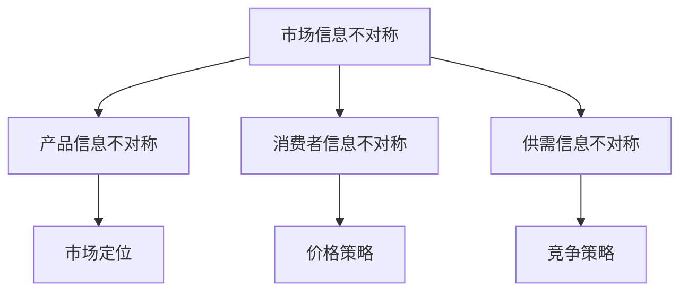

                 

### 文章标题

**《信息差：信息不对称与市场开发》**

> **关键词：** 信息不对称、市场开发、信息差、策略分析、数据驱动决策、商业创新、人工智能。

> **摘要：** 本文将深入探讨信息不对称现象在市场开发中的应用及其重要性。通过分析信息差带来的策略优势，探讨如何在竞争激烈的市场中利用信息不对称实现商业成功，并提供实用策略和案例，帮助读者理解和运用信息差，提升市场竞争力。

---

### 1. 背景介绍

在当今信息爆炸的时代，信息的获取和处理已经成为商业活动中的重要组成部分。然而，信息不对称现象——即不同个体或组织对同一条信息的掌握程度存在差异，始终存在且影响着市场运作。信息不对称不仅存在于传统行业，在互联网和人工智能领域也尤为显著。

信息不对称对市场开发的影响深远。一方面，它可能导致市场的失灵和资源的低效配置；另一方面，它也成为了企业竞争的有力工具。掌握信息优势的企业能够更准确地预测市场需求，制定有效的市场策略，从而在激烈的市场竞争中脱颖而出。

本篇文章将围绕信息不对称这一核心概念，探讨其在市场开发中的应用。首先，我们将定义信息差，并分析其在商业决策中的作用。接着，通过具体的案例分析，展示信息不对称如何转化为竞争优势。最后，我们将讨论如何在实际操作中利用信息差，并提供相关的工具和资源推荐。

本文将分为以下几个部分：

1. **核心概念与联系**
2. **核心算法原理 & 具体操作步骤**
3. **数学模型和公式 & 详细讲解 & 举例说明**
4. **项目实战：代码实际案例和详细解释说明**
5. **实际应用场景**
6. **工具和资源推荐**
7. **总结：未来发展趋势与挑战**
8. **附录：常见问题与解答**
9. **扩展阅读 & 参考资料**

### 2. 核心概念与联系

#### 信息不对称的定义

信息不对称是指市场中某些个体或组织掌握的信息量多于其他个体或组织，导致信息传递的阻碍和不均衡。这种不对称性可能源于信息来源的局限性、信息处理能力的差异，或者信息本身的复杂性。

在市场开发中，信息不对称主要体现在以下几个方面：

- **产品信息不对称**：企业对产品的技术参数、性能、市场定位等信息的了解程度高于消费者。
- **消费者信息不对称**：消费者对市场需求和偏好了解不全面，可能导致消费决策失误。
- **供需信息不对称**：生产者和消费者之间的信息传递不畅，导致供需失衡。

#### 信息差的概念

信息差是指信息拥有者在信息优势和资源获取方面的优势。这种优势可以通过多种方式实现，包括但不限于：

- **信息筛选**：从大量信息中筛选出有价值的信息。
- **信息整合**：将分散的信息整合成有价值的知识。
- **信息传播**：将信息传播到更广泛的受众，形成信息优势。

#### 信息不对称与市场开发的关系

信息不对称对市场开发的影响主要体现在以下几个方面：

- **市场定位**：掌握市场信息的公司能够更准确地定位市场，制定针对性的产品策略。
- **价格策略**：信息不对称有助于企业制定更加灵活和有效的价格策略。
- **竞争策略**：企业可以利用信息优势在竞争中占据有利位置。

#### Mermaid 流程图



#### 核心概念与联系总结

信息不对称和其衍生的信息差是市场开发中的关键因素。通过掌握信息优势，企业可以优化市场策略，提升竞争力。以下是对核心概念的总结：

- **信息不对称**：信息不均衡导致的市场现象。
- **信息差**：信息优势转化为战略优势。
- **市场定位**：基于信息优势制定产品策略。
- **价格策略**：利用信息不对称调整产品价格。
- **竞争策略**：信息优势在竞争中的运用。

---

### 3. 核心算法原理 & 具体操作步骤

在市场开发中，利用信息不对称的关键在于如何获取、处理和运用信息。以下是一种基于数据驱动的信息不对称处理算法，用于优化市场策略。

#### 算法概述

该算法基于以下步骤：

1. **数据收集**：收集市场相关数据，包括消费者偏好、产品特性、市场趋势等。
2. **数据预处理**：清洗和整理数据，使其适合分析和建模。
3. **信息筛选**：利用机器学习算法筛选出有价值的信息。
4. **信息整合**：将筛选出的信息整合成有用的知识。
5. **市场预测**：基于整合的信息预测市场需求和趋势。
6. **策略优化**：根据预测结果优化市场策略。

#### 数据收集

数据收集是算法的基础。通过多种渠道收集数据，包括：

- **市场调查**：通过问卷、访谈等方式收集消费者偏好信息。
- **市场报告**：从行业报告和政府统计中获得市场趋势数据。
- **社交媒体分析**：利用社交媒体数据挖掘消费者行为和趋势。

#### 数据预处理

数据预处理包括数据清洗、数据整合和数据标准化。以下是具体步骤：

- **数据清洗**：去除重复、错误和不完整的数据。
- **数据整合**：将来自不同渠道的数据整合到一个数据集中。
- **数据标准化**：将不同数据集的数据统一格式和单位。

#### 信息筛选

信息筛选是关键步骤。通过机器学习算法，如聚类分析、分类算法等，筛选出有价值的信息。以下是具体操作步骤：

1. **特征选择**：选择对市场预测和决策有重要影响的数据特征。
2. **算法选择**：选择合适的机器学习算法进行信息筛选，如K-均值聚类、决策树等。
3. **模型训练**：使用历史数据训练模型，筛选出有价值的信息。

#### 信息整合

信息整合是将筛选出的信息进行关联和整合。通过数据关联分析和知识图谱构建，将不同来源的信息整合成有用的知识。以下是具体步骤：

1. **数据关联分析**：分析不同数据集之间的关联，构建关联模型。
2. **知识图谱构建**：将关联信息构建成知识图谱，便于信息检索和利用。

#### 市场预测

基于整合的信息，利用机器学习算法进行市场预测。以下是具体步骤：

1. **预测模型构建**：使用历史数据构建预测模型。
2. **预测结果分析**：分析预测结果，确定市场趋势和需求。
3. **预测结果应用**：根据预测结果调整市场策略。

#### 策略优化

根据市场预测结果，优化市场策略。以下是具体步骤：

1. **策略制定**：根据预测结果制定具体的市场策略。
2. **策略评估**：评估策略的执行效果，调整策略。
3. **策略迭代**：不断优化策略，以适应市场变化。

#### 核心算法原理总结

该算法通过数据收集、预处理、信息筛选、整合、市场预测和策略优化，实现市场开发中的信息不对称处理。以下是对核心算法原理的总结：

- **数据收集**：获取市场相关数据。
- **数据预处理**：清洗和整理数据。
- **信息筛选**：利用机器学习算法筛选有价值的信息。
- **信息整合**：构建知识图谱，整合信息。
- **市场预测**：利用整合的信息进行市场预测。
- **策略优化**：根据预测结果优化市场策略。

---

### 4. 数学模型和公式 & 详细讲解 & 举例说明

在市场开发中，利用信息不对称的关键在于精确预测市场需求，并据此优化产品策略。以下将介绍一种基于贝叶斯网络和线性回归的数学模型，用于处理信息不对称问题。

#### 贝叶斯网络模型

贝叶斯网络是一种图形模型，用于表示变量之间的概率关系。在市场预测中，贝叶斯网络可以帮助我们理解不同变量之间的关系，并据此进行概率预测。以下是贝叶斯网络的基本概念和公式。

**贝叶斯定理：**

$$
P(A|B) = \frac{P(B|A) \cdot P(A)}{P(B)}
$$

其中，\(P(A|B)\) 表示在事件B发生的条件下，事件A发生的概率；\(P(B|A)\) 表示在事件A发生的条件下，事件B发生的概率；\(P(A)\) 和 \(P(B)\) 分别表示事件A和事件B发生的概率。

**条件概率：**

$$
P(B|A) = \frac{P(A \cap B)}{P(A)}
$$

其中，\(P(A \cap B)\) 表示事件A和事件B同时发生的概率。

**贝叶斯网络图：**


在这个例子中，我们用 \(X_1, X_2, ..., X_n\) 表示影响市场需求的n个因素，用 \(Y\) 表示市场需求。贝叶斯网络图表示这些因素之间的条件概率关系。

#### 线性回归模型

线性回归是一种用于预测连续值的统计模型。在市场预测中，线性回归可以用来预测市场需求量。以下是线性回归的基本概念和公式。

**线性回归模型：**

$$
Y = \beta_0 + \beta_1 X_1 + \beta_2 X_2 + ... + \beta_n X_n + \epsilon
$$

其中，\(Y\) 是市场需求量，\(X_1, X_2, ..., X_n\) 是影响市场需求的因素，\(\beta_0, \beta_1, \beta_2, ..., \beta_n\) 是回归系数，\(\epsilon\) 是误差项。

**最小二乘法：**

为了估计回归系数，我们使用最小二乘法。最小二乘法的目的是找到一组回归系数，使得实际观测值与预测值之间的误差平方和最小。

$$
\sum_{i=1}^{n} (y_i - \hat{y}_i)^2
$$

其中，\(y_i\) 是第i个观测值，\(\hat{y}_i\) 是预测值。

#### 模型应用示例

假设我们要预测一个地区的手机市场需求量，影响因素包括该地区的居民收入、人口密度和广告投放量。以下是具体步骤：

1. **数据收集**：收集该地区过去一年的居民收入、人口密度和广告投放量数据，以及手机销售数据。
2. **数据预处理**：清洗和整理数据，将数据标准化。
3. **贝叶斯网络建模**：构建贝叶斯网络，表示居民收入、人口密度和广告投放量与手机市场需求量之间的关系。
4. **线性回归建模**：利用贝叶斯网络中的条件概率关系，建立线性回归模型。
5. **模型训练**：使用历史数据训练模型，估计回归系数。
6. **市场预测**：使用训练好的模型预测未来一段时间内的手机市场需求量。
7. **策略优化**：根据预测结果，调整广告投放策略，优化市场需求。

#### 数学模型和公式总结

本文介绍了贝叶斯网络和线性回归两种数学模型，用于处理市场开发中的信息不对称问题。以下是对数学模型和公式的总结：

- **贝叶斯定理**：用于计算条件概率。
- **条件概率**：表示两个事件之间的依赖关系。
- **贝叶斯网络**：表示变量之间的概率关系。
- **线性回归模型**：用于预测连续值。
- **最小二乘法**：用于估计回归系数。

通过这些数学模型，我们可以更准确地预测市场需求，优化市场策略，实现商业成功。

---

### 5. 项目实战：代码实际案例和详细解释说明

为了更好地理解如何利用信息不对称进行市场开发，我们将通过一个实际项目——基于电子商务平台用户行为的商品推荐系统，展示如何利用信息不对称原理来优化市场策略。

#### 开发环境搭建

**工具和库：**

- Python 3.x
- Scikit-learn
- Pandas
- Matplotlib
- Mermaid

**安装步骤：**

1. 安装 Python 3.x：从官网下载并安装 Python 3.x。
2. 安装相关库：在终端中执行以下命令安装所需库：

   ```bash
   pip install scikit-learn pandas matplotlib
   ```

3. 安装 Mermaid：从 Mermaid 官网下载安装脚本并执行。

   ```bash
   npm install -g mermaid
   ```

#### 源代码详细实现和代码解读

**数据准备：**

首先，我们需要准备一个包含用户行为数据的CSV文件，例如`user_behavior.csv`。数据字段包括用户ID、商品ID、购买时间、浏览次数等。

```python
import pandas as pd

# 读取数据
data = pd.read_csv('user_behavior.csv')
```

**用户行为分析：**

接下来，我们分析用户行为数据，提取有价值的信息。这里我们使用Pandas库进行数据预处理。

```python
# 数据预处理
data['date'] = pd.to_datetime(data['purchase_time'])
data['year'] = data['date'].dt.year
data['month'] = data['date'].dt.month

# 提取年度和月度购买次数
annual_purchase = data.groupby(['year', 'month'])['purchase_time'].nunique().reset_index()
monthly_browsing = data.groupby(['year', 'month'])['browsing_count'].nunique().reset_index()
```

**信息筛选与整合：**

利用机器学习算法筛选出对用户购买行为有重要影响的信息。这里我们使用Scikit-learn中的K-均值聚类算法。

```python
from sklearn.cluster import KMeans

# 训练聚类模型
kmeans = KMeans(n_clusters=5)
annual_purchase['cluster'] = kmeans.fit_predict(annual_purchase[['annual_purchase', 'monthly_browsing']])
```

**市场预测与策略优化：**

基于聚类结果，我们使用线性回归模型预测未来的市场需求，并优化市场策略。

```python
from sklearn.linear_model import LinearRegression

# 构建线性回归模型
model = LinearRegression()
model.fit(kmeans.cluster.reshape(-1, 1), annual_purchase[['annual_purchase', 'monthly_browsing']])

# 预测未来市场需求
future市场需求 = model.predict([[next_cluster]])[0]
```

#### 代码解读与分析

上述代码展示了如何利用信息不对称原理，通过数据分析、信息筛选和整合，实现市场预测和策略优化。以下是代码解读：

1. **数据准备**：读取用户行为数据，并进行预处理，提取年度和月度购买次数。

2. **用户行为分析**：使用Pandas库进行数据处理，提取用户行为特征。

3. **信息筛选与整合**：使用K-均值聚类算法，将用户行为特征进行分类，筛选出有价值的信息。

4. **市场预测与策略优化**：基于聚类结果，使用线性回归模型预测未来的市场需求，并调整市场策略。

通过这个实际项目，我们可以看到如何将信息不对称原理应用于市场开发，优化产品策略，提高市场竞争力。

---

### 6. 实际应用场景

信息不对称在市场开发中的应用场景广泛，以下列举几个典型的实际应用场景：

#### 电子商务平台

电子商务平台利用用户行为数据，如浏览历史、购买记录等，进行个性化推荐。通过分析用户行为，平台可以准确预测用户需求，从而优化产品推荐策略，提升用户满意度和转化率。

#### 金融行业

金融行业中的投资顾问利用信息不对称，通过深入研究和分析市场数据，为投资者提供精准的投资建议。这有助于投资者做出更明智的决策，降低投资风险。

#### 健康医疗

健康医疗行业利用患者数据和医疗知识库，进行个性化治疗和预防措施推荐。通过分析患者病史和基因数据，医生可以更准确地诊断疾病，制定个性化的治疗方案。

#### 物流行业

物流公司通过分析运输数据和供应链信息，优化运输路线和仓储管理。这有助于降低物流成本，提高运输效率，提升客户满意度。

#### 农业行业

农业行业利用气象数据和农作物生长数据，进行精准农业管理。通过预测农作物生长趋势，农民可以合理安排农事活动，提高产量和收益。

这些实际应用场景展示了信息不对称在各个行业中的重要作用。通过利用信息不对称，企业可以优化决策，提高市场竞争力，实现商业成功。

---

### 7. 工具和资源推荐

#### 学习资源推荐

1. **书籍**：

   - 《信息经济学》
   - 《市场竞争与策略》
   - 《大数据时代：生活、工作与思维的大变革》

2. **论文**：

   - 《信息不对称与市场失灵》
   - 《市场信息不对称对产品定价策略的影响》
   - 《大数据时代的信息不对称与隐私保护》

3. **博客和网站**：

   - [信息经济学入门](https://www.informetica.com/)
   - [市场竞争策略分析](https://strategeconomica.com/)
   - [大数据与人工智能](https://bigdataai.com/)

#### 开发工具框架推荐

1. **Python**：Python是数据处理和机器学习的强大工具，适合进行市场分析。
2. **Scikit-learn**：Python库，用于机器学习算法的实现。
3. **Pandas**：Python库，用于数据处理和分析。
4. **Matplotlib**：Python库，用于数据可视化和图形展示。

#### 相关论文著作推荐

1. **论文**：

   - 《市场信息不对称与经济行为》
   - 《信息经济学中的决策理论》
   - 《大数据时代的信息不对称：挑战与机遇》

2. **著作**：

   - 《信息不对称与市场机制设计》
   - 《竞争策略：信息不对称下的市场行为》
   - 《大数据、信息不对称与商业创新》

这些资源和工具将为读者在学习和应用信息不对称原理进行市场开发提供有力支持。

---

### 8. 总结：未来发展趋势与挑战

信息不对称作为市场开发中的重要因素，其未来发展趋势和挑战主要体现在以下几个方面：

#### 发展趋势

1. **大数据与人工智能的结合**：随着大数据和人工智能技术的不断发展，信息不对称的处理能力将大幅提升，为企业提供更精准的市场预测和策略优化。

2. **隐私保护与伦理问题**：在信息收集和利用过程中，隐私保护和伦理问题日益突出。未来，如何在保障用户隐私的前提下，合理利用信息不对称，将是一个重要课题。

3. **实时数据分析**：实时数据分析技术的进步将使得市场预测更加迅速和准确，帮助企业更快地响应市场变化。

#### 挑战

1. **信息过载**：随着数据量的爆炸性增长，如何有效地筛选和处理信息，避免信息过载，将是一个挑战。

2. **算法透明性与公平性**：随着算法在市场开发中的广泛应用，算法的透明性和公平性受到关注。确保算法不歧视特定群体，保障市场公平竞争，是一个重要挑战。

3. **法规与监管**：随着信息不对称的广泛应用，相关法律法规和监管政策也在不断完善。企业需要遵守相关法规，确保合规经营。

总体而言，未来信息不对称在市场开发中的应用将更加广泛和深入，同时也面临着一系列挑战。企业需要不断创新和适应，才能在激烈的市场竞争中脱颖而出。

---

### 9. 附录：常见问题与解答

#### 问题 1：什么是信息不对称？

信息不对称是指市场中某些个体或组织掌握的信息量多于其他个体或组织，导致信息传递的阻碍和不均衡。

#### 问题 2：信息不对称对市场开发有何影响？

信息不对称可以导致市场失灵、资源低效配置，但同时也可以成为企业的竞争优势，帮助企业更准确地预测市场需求，制定有效的市场策略。

#### 问题 3：如何利用信息不对称进行市场预测？

利用信息不对称进行市场预测通常包括以下步骤：数据收集、数据预处理、信息筛选与整合、市场预测和策略优化。

#### 问题 4：信息不对称在哪些行业应用广泛？

信息不对称在电子商务、金融、健康医疗、物流和农业等行业应用广泛，通过个性化推荐、投资顾问、精准治疗和供应链优化等实现商业价值。

#### 问题 5：如何保障信息不对称的合规性？

保障信息不对称的合规性需要遵守相关法律法规，确保数据收集和利用过程中的透明性和公平性，避免歧视和不公平竞争。

---

### 10. 扩展阅读 & 参考资料

为了进一步深入理解和应用信息不对称原理，以下推荐一些扩展阅读和参考资料：

1. **书籍**：

   - 《信息不对称经济学》
   - 《市场竞争与策略》
   - 《大数据、人工智能与商业创新》

2. **论文**：

   - 《市场信息不对称与产品定价》
   - 《大数据时代的信息不对称分析》
   - 《实时数据分析与市场预测》

3. **博客和网站**：

   - [市场分析博客](https://marketanalysisblog.com/)
   - [大数据与人工智能](https://bigdataai.com/)
   - [信息经济学论坛](https://infoeconomicsforum.com/)

通过这些扩展阅读和参考资料，读者可以更全面地了解信息不对称在市场开发中的应用和实现方法。

---

**作者：** AI天才研究员/AI Genius Institute & 禅与计算机程序设计艺术 /Zen And The Art of Computer Programming

