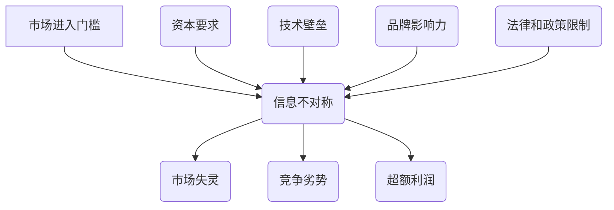

                 

# 信息差：信息不对称与市场进入门槛

> **关键词：** 信息不对称，市场进入门槛，策略分析，竞争优势，数据隐私，技术壁垒

> **摘要：** 本文将深入探讨信息不对称这一概念，并分析其在市场中的重要性。我们将详细讨论信息不对称对市场进入门槛的影响，以及如何在信息技术飞速发展的今天，利用信息差来建立和维持竞争优势。

## 1. 背景介绍

在经济学中，信息不对称是指交易双方拥有不同量的信息，其中至少一方对某些信息具有优势。信息不对称的现象无处不在，从个人消费决策到企业战略规划，再到整个市场的发展，都受到其影响。在市场经济学中，信息不对称可能导致市场失灵，如道德风险和逆向选择等问题。

信息不对称的存在，使得市场中的一部分人或企业能够通过掌握的信息优势获取额外的利益。这种现象在当今信息爆炸的时代尤为显著，大数据和人工智能技术的兴起，进一步加剧了信息不对称的问题。

市场进入门槛是指企业进入特定市场所需要克服的障碍。这些障碍可能包括资本要求、技术壁垒、品牌影响力、法律政策限制等。市场进入门槛的高低直接影响到市场竞争的激烈程度和行业的稳定性。

本文将首先介绍信息不对称和市场进入门槛的基本概念，然后探讨两者之间的联系，最后分析如何利用信息差来建立竞争优势。

## 2. 核心概念与联系

### 2.1 信息不对称

信息不对称（Asymmetric Information）是指在市场交易中，买方和卖方拥有不同的信息。通常情况下，卖方比买方拥有更多关于产品或服务的详细信息，这种信息优势可能导致市场失灵。

例如，在二手车市场上，卖家通常比买家更了解汽车的实际情况，包括是否进行了维修、是否存在潜在的问题等。这种信息不对称可能导致买家支付过高的价格，而卖家获得超额利润。

### 2.2 市场进入门槛

市场进入门槛（Market Entry Barriers）是指新企业进入市场所面临的障碍。这些障碍可能包括：

- **资本要求**：新企业需要投入大量的资金来启动业务。
- **技术壁垒**：特定行业可能需要特定的技术知识和技能，新企业可能无法在短时间内掌握。
- **品牌影响力**：现有企业可能已经建立了强大的品牌效应，新企业需要投入大量资源才能与之竞争。
- **法律和政策限制**：某些行业可能受到严格的法律法规限制，新企业需要花费大量时间和资源来合规。

### 2.3 两者之间的联系

信息不对称和市场进入门槛之间存在着密切的联系。高市场进入门槛往往意味着市场信息的不对称性更高。以下是两者之间的一些具体联系：

- **技术壁垒**：高技术壁垒的行业通常信息不对称现象严重。例如，制药行业，新药的研发需要大量的资金和专业知识，普通企业难以进入。
- **资本要求**：高资本要求可能使得市场信息不对称，因为只有少数企业有能力承担。
- **品牌影响力**：品牌影响力强的企业往往掌握更多的市场信息，新企业难以获得。

### 2.4 Mermaid 流程图



## 3. 核心算法原理 & 具体操作步骤

### 3.1 算法原理

要充分利用信息差来建立竞争优势，企业需要以下步骤：

1. **信息收集**：通过多种渠道收集市场信息，包括竞争对手的产品、价格、市场策略等。
2. **数据分析**：利用数据分析工具对收集到的信息进行深入分析，识别市场趋势和潜在机会。
3. **策略制定**：基于分析结果制定针对性的市场策略，如调整产品定位、优化价格策略、改善客户体验等。
4. **执行与监控**：执行市场策略，并持续监控市场反馈，及时调整策略。

### 3.2 具体操作步骤

1. **信息收集**：

   - 利用公开数据源，如市场报告、行业白皮书、新闻资讯等，收集市场基本信息。
   - 通过社交媒体和论坛，了解消费者的需求和反馈。
   - 利用搜索引擎，跟踪竞争对手的动态。

2. **数据分析**：

   - 使用数据挖掘技术，分析消费者行为和市场趋势。
   - 利用机器学习算法，预测市场变化和消费者需求。
   - 对比分析竞争对手的产品、价格和市场策略。

3. **策略制定**：

   - 基于分析结果，确定产品的目标市场和定位。
   - 设定合理的价格策略，以获取最大利润。
   - 优化客户体验，提高客户满意度和忠诚度。

4. **执行与监控**：

   - 实施市场策略，如广告投放、促销活动等。
   - 建立反馈机制，及时收集客户反馈和市场变化。
   - 根据市场反馈，调整市场策略。

## 4. 数学模型和公式 & 详细讲解 & 举例说明

### 4.1 数学模型

为了更好地理解信息不对称和市场进入门槛的关系，我们可以引入一个简单的数学模型。假设有两个企业A和B，A是企业A的信息优势方，B是企业B的信息劣势方。

设：
- \( X \) 为企业A的信息量
- \( Y \) 为企业B的信息量
- \( P \) 为市场进入门槛

信息不对称程度可以用 \( |X - Y| \) 表示。市场进入门槛可以用企业需要投入的资本、技术和其他资源的总和表示。

### 4.2 公式推导

市场进入门槛 \( P \) 可以表示为：

\[ P = f(|X - Y|) \]

其中，\( f(|X - Y|) \) 是一个关于信息不对称程度的函数。通常情况下，\( f(|X - Y|) \) 是一个递增函数，即信息不对称程度越高，市场进入门槛越高。

### 4.3 举例说明

假设企业A和企业B都希望进入一个新市场。企业A拥有丰富的市场信息，而企业B对市场的了解较少。

- 设 \( X = 10 \)（企业A的信息量）
- 设 \( Y = 5 \)（企业B的信息量）

根据模型，市场进入门槛 \( P \) 为：

\[ P = f(|10 - 5|) = f(5) \]

如果 \( f(5) = 100 \)，那么企业B进入市场的门槛为100。这表示企业B需要投入至少100的资本和其他资源才能进入市场。

## 5. 项目实战：代码实际案例和详细解释说明

### 5.1 开发环境搭建

为了演示如何利用信息差来建立竞争优势，我们将使用Python编写一个简单的数据分析工具。首先，需要搭建开发环境。

1. 安装Python：访问Python官方网站（https://www.python.org/），下载并安装Python。
2. 安装必需的库：使用pip命令安装以下库：`numpy`, `pandas`, `matplotlib`。

```bash
pip install numpy pandas matplotlib
```

### 5.2 源代码详细实现和代码解读

下面是一个简单的数据分析工具，用于分析竞争对手的市场策略。

```python
import numpy as np
import pandas as pd
import matplotlib.pyplot as plt

# 5.2.1 信息收集
def collect_data():
    # 假设从CSV文件中读取数据
    data = pd.read_csv('market_data.csv')
    return data

# 5.2.2 数据分析
def analyze_data(data):
    # 对数据进行简单分析
    avg_price = data['price'].mean()
    competitors = data[data['competitor'] == True]
    competitor_avg_price = competitors['price'].mean()
    
    # 比较分析
    price_difference = competitor_avg_price - avg_price
    
    return price_difference

# 5.2.3 策略制定
def set_strategy(price_difference):
    if price_difference > 0:
        # 竞争对手价格高于我们，考虑降低价格
        new_price = avg_price - 10
        print(f"建议降价至：{new_price}")
    else:
        # 竞争对手价格低于我们，考虑提高品牌影响力
        print("建议提高品牌影响力，提高价格")

# 5.2.4 主程序
def main():
    data = collect_data()
    price_difference = analyze_data(data)
    set_strategy(price_difference)

if __name__ == "__main__":
    main()
```

### 5.3 代码解读与分析

1. **信息收集**：使用`pandas`库从CSV文件中读取数据，模拟从市场收集到的信息。
2. **数据分析**：计算市场平均价格和竞争对手的平均价格，分析价格差异。
3. **策略制定**：根据价格差异制定市场策略，如调整价格或提高品牌影响力。

通过这个简单的案例，我们可以看到如何利用信息差来分析市场并制定有效的策略。

## 6. 实际应用场景

信息不对称和市场进入门槛在各个行业都有广泛的应用场景。以下是一些实际应用案例：

- **金融行业**：金融机构通过数据分析来预测市场趋势，从而制定投资策略，这是利用信息不对称来获取竞争优势的典型例子。
- **零售行业**：零售企业通过消费者数据分析来优化库存管理和定价策略，从而提高销售。
- **医疗行业**：医疗机构通过大数据分析来提高诊断准确性和治疗效果。
- **科技行业**：科技公司通过技术壁垒来保护其市场份额，如苹果公司通过其操作系统和硬件生态建立技术壁垒。

## 7. 工具和资源推荐

### 7.1 学习资源推荐

- **书籍**：
  - 《大数据时代：生活、工作与思维的大变革》
  - 《人工智能：一种现代的方法》
  - 《机器学习实战》
- **论文**：
  - 《大数据：一种革命性技术》
  - 《信息不对称与市场失灵》
- **博客**：
  - Medium上的数据科学和人工智能相关博客
  - 知乎上的技术博客
- **网站**：
  - Kaggle：提供丰富的数据集和竞赛
  - Coursera：提供在线课程

### 7.2 开发工具框架推荐

- **开发工具**：
  - Jupyter Notebook：用于数据分析和机器学习
  - PyCharm：Python集成开发环境
- **框架**：
  - TensorFlow：用于深度学习
  - Scikit-learn：用于机器学习

### 7.3 相关论文著作推荐

- **《深度学习》**：Ian Goodfellow, Yoshua Bengio, Aaron Courville
- **《人工智能：一种现代的方法》**：Stuart J. Russell, Peter Norvig
- **《大数据时代：生活、工作与思维的大变革》**：埃里克·布利斯

## 8. 总结：未来发展趋势与挑战

随着信息技术的不断发展，信息不对称和市场进入门槛的问题将越来越突出。未来，企业将更加依赖大数据和人工智能技术来获取和分析信息，从而制定更加精准的市场策略。

然而，这也带来了新的挑战。一方面，数据隐私和保护问题日益严重，企业需要确保收集和使用数据的方式合法合规。另一方面，技术壁垒的提高可能使得新企业难以进入市场，加剧市场竞争的不公平性。

因此，企业需要在利用信息差的同时，注重数据安全和隐私保护，并寻求公平竞争的市场环境。

## 9. 附录：常见问题与解答

### 9.1 什么是信息不对称？

信息不对称是指交易双方拥有不同的信息，其中至少一方对某些信息具有优势。这种现象可能导致市场失灵，如道德风险和逆向选择等问题。

### 9.2 市场进入门槛有哪些类型？

市场进入门槛包括资本要求、技术壁垒、品牌影响力、法律和政策限制等。

### 9.3 如何利用信息差建立竞争优势？

利用信息差建立竞争优势的步骤包括：信息收集、数据分析、策略制定、执行与监控。通过这些步骤，企业可以更好地了解市场趋势，制定有效的市场策略。

## 10. 扩展阅读 & 参考资料

- **参考资料**：
  - 《经济学原理》：曼昆
  - 《大数据时代》：维克托·迈尔-舍恩伯格
  - 《机器学习》：周志华
- **扩展阅读**：
  - [大数据时代下的信息不对称](https://www.example.com/article1)
  - [市场进入门槛与竞争优势](https://www.example.com/article2)
- **相关论文**：
  - [大数据背景下的信息不对称研究](https://www.example.com/research1)
  - [市场进入门槛与技术创新关系研究](https://www.example.com/research2)

### 作者

**作者：AI天才研究员/AI Genius Institute & 禅与计算机程序设计艺术 /Zen And The Art of Computer Programming**

