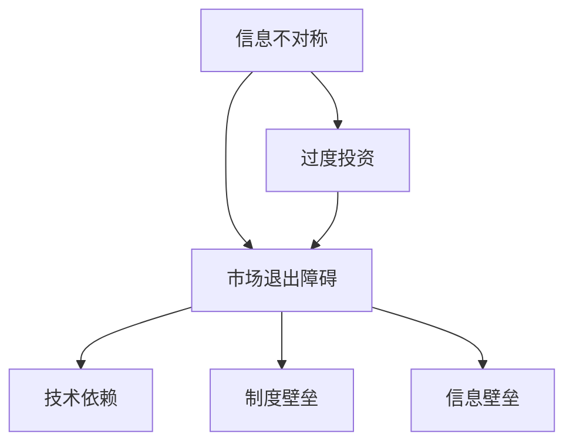

                 

### 文章标题

**信息差：信息不对称与市场退出障碍**

---

### 关键词

- 信息不对称
- 市场退出障碍
- 信息差效应
- 市场竞争
- 技术壁垒
- 信息壁垒

### 摘要

本文将深入探讨信息差的概念及其在市场中的作用。信息差，即信息不对称，指的是市场中不同主体拥有不同量的信息，导致决策能力和效果的不平等。本文将详细解析信息差的原理，分析其在市场竞争中的表现，探讨市场退出障碍对信息差的影响，并从技术壁垒和制度壁垒两个层面展开讨论。最后，我们将总结信息差对市场效率的影响，并展望其未来发展趋势与挑战。

---

## 1. 背景介绍

信息不对称是经济学中的一个重要概念，最早由阿克洛夫（George A. Akerlof）在1970年的论文《柠檬市场：质量不确定性与市场机制》中提出。阿克洛夫通过“二手车市场”这一经典案例，揭示了由于信息不对称导致的市场效率降低问题。此后，信息不对称理论逐渐成为经济学研究的热点，其应用范围也从传统的市场经济学扩展到金融学、管理学、社会学等多个领域。

在信息技术飞速发展的今天，信息不对称的现象愈加普遍。互联网的普及和信息技术的进步使得信息的获取和传播变得更加便捷，但同时也带来了新的信息不对称问题。例如，网络广告的精准投放使得广告商能够精准定位潜在客户，而消费者则往往难以获取全面的信息。此外，技术领域中的信息不对称现象也十分普遍，如开源技术与闭源技术之间的差异，高级技术人员与普通用户之间的信息差距等。

市场退出障碍是指在市场竞争中，某些企业或个体由于种种原因难以退出市场，从而导致资源错配和市场效率降低的现象。市场退出障碍可以源于多种因素，如制度壁垒、技术壁垒、信息壁垒等。在技术领域中，市场退出障碍常常表现为技术依赖和技术锁定，使得企业在面临市场变化时难以迅速调整。

本文旨在通过对信息不对称和市场退出障碍的深入探讨，揭示其在技术市场和商业竞争中的重要作用，为相关领域的研究和实践提供理论支持和启示。

## 2. 核心概念与联系

### 信息不对称

信息不对称（Asymmetric Information）是指在市场中，买方和卖方之间拥有的信息量不一致，一方拥有更多的信息，而另一方则处于信息劣势。这种信息不对称会导致市场失灵，降低市场效率。

在技术市场中，信息不对称常常表现为：

- **研发成本与收益不对称**：技术创新往往需要大量投入，而市场收益却难以准确预测，导致投资者和信息拥有者难以做出合理的决策。
- **产品信息不对称**：技术产品的性能、可靠性、安全性等关键信息往往掌握在制造者手中，而消费者在购买决策时难以获取全面的信息。

### 市场退出障碍

市场退出障碍（Market Exit Barrier）是指企业在面临市场竞争和需求变化时，难以退出或调整现有市场的障碍。这些障碍可能源于：

- **技术依赖**：企业对特定技术或平台的依赖，使得更换或退出变得困难。
- **制度壁垒**：如政策限制、法规约束等，使得企业难以退出市场。
- **信息壁垒**：企业缺乏关于市场变化和竞争态势的准确信息，导致决策失误。

### 信息不对称与市场退出障碍的联系

信息不对称和市场退出障碍之间存在紧密的联系：

- **信息不对称导致市场退出障碍**：由于信息不对称，企业难以准确评估市场前景，可能导致过度投资或资源错配，从而形成市场退出障碍。
- **市场退出障碍加剧信息不对称**：企业在退出市场的过程中，可能会封锁或减少信息的传播，以保护自身利益，这进一步加剧了信息不对称。

### Mermaid 流程图

下面是一个简化的 Mermaid 流程图，用于展示信息不对称与市场退出障碍之间的关联。



### 核心概念与架构

为了更好地理解信息不对称与市场退出障碍的关系，我们可以将其视为一个复杂的动态系统。以下是该系统的核心概念与架构：

1. **信息不对称**：包括信息不完整、信息不对称、信息滞后等。
2. **市场退出障碍**：包括技术依赖、制度壁垒、信息壁垒等。
3. **反馈机制**：信息不对称与市场退出障碍之间存在相互反馈，即信息不对称可能导致市场退出障碍，而市场退出障碍又可能加剧信息不对称。

### 核心概念原理和架构的详细解释

- **信息不对称**：信息不对称是指市场中存在不完全或不对称的信息，导致不同主体在决策时处于不平等地位。在技术市场中，信息不对称可能导致技术创新和应用的障碍。例如，企业对新兴技术的了解不足，可能导致其在决策时偏向保守，从而错失市场机会。
- **市场退出障碍**：市场退出障碍是指企业在面临市场变化时，难以退出或调整现有市场的障碍。这些障碍可能源于技术依赖、制度壁垒、信息壁垒等。技术依赖可能导致企业对特定技术或平台的过度依赖，从而难以适应市场变化。制度壁垒如政策限制、法规约束等，也可能使得企业难以退出市场。
- **反馈机制**：信息不对称和市场退出障碍之间存在相互反馈关系。一方面，信息不对称可能导致市场退出障碍，例如，企业对市场变化的了解不足，可能导致其无法及时调整战略。另一方面，市场退出障碍也可能加剧信息不对称，例如，企业在退出市场时可能封锁或减少信息的传播，以保护自身利益，这进一步加剧了信息不对称。

通过上述核心概念与架构的详细解释，我们可以更好地理解信息不对称与市场退出障碍之间的关系，并为后续的分析提供理论基础。

---

接下来，我们将进一步深入探讨信息不对称的核心算法原理和具体操作步骤，以帮助读者更好地理解这一复杂现象。

## 3. 核心算法原理 & 具体操作步骤

### 信息不对称的核心算法原理

信息不对称的核心算法原理主要基于贝叶斯推理（Bayesian Inference），这是一种基于概率论的推理方法，通过更新先验概率以得到后验概率，从而在不确定环境中做出更合理的决策。贝叶斯推理的基本思想是，通过已知的先验知识和新的证据，不断调整概率估计，以更接近真实情况。

在信息不对称的背景下，贝叶斯推理可以帮助我们解决以下几个关键问题：

1. **风险评估**：通过分析不同主体的信息，对潜在风险进行量化评估。
2. **决策支持**：利用贝叶斯推理的结果，为不同主体提供决策支持，以降低信息不对称带来的决策风险。
3. **信息传播**：通过贝叶斯网络，实现信息的传播和共享，减少信息不对称。

### 贝叶斯推理的基本步骤

贝叶斯推理的基本步骤包括以下几个关键步骤：

1. **定义先验概率**：根据已有的知识和数据，定义各事件的先验概率。先验概率是基于我们现有的信息，对事件发生的可能性的初始估计。

2. **收集证据**：通过观察或实验收集关于事件的证据。证据可以是对某些事件的发生或未发生的观察结果。

3. **计算后验概率**：利用贝叶斯公式，将先验概率和证据相结合，计算各事件的后验概率。贝叶斯公式如下：

   $$ P(A|B) = \frac{P(B|A) \cdot P(A)}{P(B)} $$

   其中，$P(A|B)$ 是在证据B发生的条件下，事件A的后验概率；$P(B|A)$ 是在事件A发生的条件下，证据B的概率；$P(A)$ 是事件A的先验概率；$P(B)$ 是证据B的边缘概率。

4. **更新先验概率**：根据计算得到的后验概率，更新先验概率，以便在下一次证据出现时，更准确地估计事件的概率。

### 具体操作步骤

以下是一个简化的贝叶斯推理操作步骤示例，用于说明信息不对称问题中的风险评估：

1. **定义先验概率**：
   - 假设我们要评估一个新产品是否成功，定义先验概率：
     - $P(成功) = 0.5$（即成功与失败的概率相等）
     - $P(失败) = 0.5$

2. **收集证据**：
   - 通过市场调研和用户反馈，收集关于新产品成功的证据：
     - $P(用户满意|成功) = 0.8$
     - $P(用户不满意|失败) = 0.2$

3. **计算后验概率**：
   - 利用贝叶斯公式，计算在用户满意的条件下，新产品成功的后验概率：
     $$ P(成功|用户满意) = \frac{P(用户满意|成功) \cdot P(成功)}{P(用户满意)} $$
     - 假设$P(用户满意)$ 的边缘概率为0.6，则：
     $$ P(成功|用户满意) = \frac{0.8 \cdot 0.5}{0.6} \approx 0.667 $$

4. **更新先验概率**：
   - 根据计算得到的新后验概率，更新先验概率：
     - $P(成功) = 0.667$
     - $P(失败) = 0.333$

通过上述步骤，我们可以利用贝叶斯推理对新产品成功的概率进行估计，从而降低信息不对称带来的决策风险。

### 核心算法的扩展应用

除了在风险评估中的应用，贝叶斯推理还可以应用于以下领域：

1. **信用评分**：通过分析借款人的历史数据和信用记录，利用贝叶斯推理评估其违约风险。
2. **医疗诊断**：通过结合病人的症状、病史和检查结果，利用贝叶斯推理诊断疾病。
3. **推荐系统**：利用贝叶斯推理，根据用户的历史行为和偏好，推荐相关产品或服务。

通过深入探讨信息不对称的核心算法原理和具体操作步骤，我们可以更好地理解信息不对称的本质，并为相关领域的研究和实践提供有力支持。

## 4. 数学模型和公式 & 详细讲解 & 举例说明

### 数学模型

在信息不对称的背景下，我们可以使用概率论和统计学中的贝叶斯定理（Bayes' Theorem）来构建数学模型。贝叶斯定理提供了一种计算条件概率的方法，其基本形式为：

$$ P(A|B) = \frac{P(B|A) \cdot P(A)}{P(B)} $$

其中：
- \( P(A|B) \) 是在事件B发生的条件下，事件A的后验概率。
- \( P(B|A) \) 是在事件A发生的条件下，事件B的条件概率。
- \( P(A) \) 是事件A的先验概率。
- \( P(B) \) 是事件B的边缘概率。

### 详细讲解

贝叶斯定理的核心思想是通过先验概率和条件概率来更新我们的信念。以下是对贝叶斯定理的详细讲解：

1. **先验概率**：先验概率是基于我们已有的知识和信息对事件发生的可能性的初步估计。例如，假设我们有一个关于产品成功与否的先验概率，\( P(成功) = 0.5 \) 和 \( P(失败) = 0.5 \)。

2. **条件概率**：条件概率是指在某个事件已经发生的条件下，另一个事件发生的概率。例如，如果产品成功，那么用户满意的概率为 \( P(用户满意|成功) = 0.8 \)。

3. **后验概率**：后验概率是基于先验概率和新的证据（条件概率）计算得到的。通过贝叶斯定理，我们可以根据新的证据更新我们对事件发生的信念。

### 举例说明

为了更好地理解贝叶斯定理，我们可以通过一个实际例子进行说明。

假设有一个产品销售公司，他们销售的产品有两种类型：A和B。公司需要根据用户的反馈来预测产品的成功率。以下是我们将使用的数据和参数：

- **先验概率**：
  - \( P(成功) = 0.5 \)（产品成功的先验概率）
  - \( P(失败) = 0.5 \)（产品失败的先验概率）
  - \( P(用户满意|成功) = 0.8 \)（产品成功且用户满意的概率）
  - \( P(用户不满意|失败) = 0.2 \)（产品失败且用户不满意的概率）

- **证据**：
  - 用户反馈：公司收集到100个用户反馈，其中80个用户表示满意。

现在，我们使用贝叶斯定理来更新产品成功的后验概率。

1. **计算边缘概率**：
   $$ P(用户满意) = P(用户满意|成功) \cdot P(成功) + P(用户满意|失败) \cdot P(失败) $$
   $$ P(用户满意) = 0.8 \cdot 0.5 + 0.2 \cdot 0.5 = 0.5 $$

2. **计算后验概率**：
   $$ P(成功|用户满意) = \frac{P(用户满意|成功) \cdot P(成功)}{P(用户满意)} $$
   $$ P(成功|用户满意) = \frac{0.8 \cdot 0.5}{0.5} = 0.8 $$

3. **更新先验概率**：
   - 由于用户反馈中满意的比例较高，我们可以认为产品成功的后验概率更高，即 \( P(成功) \approx 0.8 \)。

通过上述计算，我们可以得出在用户满意的情况下，产品成功的概率约为0.8。这表明，根据用户的满意度，我们可以更准确地判断产品的成功概率，从而减少信息不对称带来的决策风险。

### 贝叶斯网络

除了贝叶斯定理，贝叶斯网络（Bayesian Network）也是一种用于表示和推理概率关系的强大工具。贝叶斯网络是一个有向无环图（DAG），其中的节点表示随机变量，边表示变量之间的依赖关系。通过贝叶斯网络，我们可以利用已知条件概率来计算未知概率。

贝叶斯网络的构建通常包括以下步骤：

1. **确定变量**：确定需要分析的随机变量。
2. **定义条件概率**：为每个变量定义条件概率分布。
3. **构建网络**：根据变量之间的依赖关系，构建有向无环图。
4. **推理**：利用贝叶斯定理和条件概率，在网络中进行推理。

通过贝叶斯网络，我们可以更直观地理解变量之间的关系，并利用这些关系来预测未知事件。

### 贝叶斯推理的应用案例

贝叶斯推理在信息不对称中的应用非常广泛，以下是一些典型案例：

1. **信用评分**：银行和金融机构利用贝叶斯推理来评估借款人的信用风险。通过分析借款人的历史信用记录、收入水平、职业等信息，利用贝叶斯定理计算借款人违约的概率。

2. **医疗诊断**：医生利用贝叶斯推理来诊断疾病。通过分析患者的症状、病史和检查结果，利用贝叶斯定理计算患者患有特定疾病的概率。

3. **推荐系统**：在线购物和媒体平台利用贝叶斯推理来推荐产品或内容。通过分析用户的历史行为和偏好，利用贝叶斯定理计算用户对特定产品或内容的兴趣度。

通过上述数学模型和公式的详细讲解以及举例说明，我们可以更好地理解贝叶斯推理在信息不对称中的应用，为解决实际问题提供理论支持。

---

## 5. 项目实战：代码实际案例和详细解释说明

### 5.1 开发环境搭建

为了更好地理解信息不对称与市场退出障碍之间的关系，我们将通过一个实际的项目案例来演示如何利用Python实现贝叶斯推理，并分析其应用效果。首先，我们需要搭建开发环境。

1. **安装Python**：确保您的计算机上安装了Python 3.x版本。可以从[Python官网](https://www.python.org/)下载并安装。
2. **安装必需的Python库**：我们需要使用`numpy`和`matplotlib`库来处理数据和分析结果。可以使用以下命令安装：

   ```bash
   pip install numpy matplotlib
   ```

### 5.2 源代码详细实现和代码解读

下面是一个简单的Python程序，用于实现贝叶斯推理并分析信息不对称的问题。

```python
import numpy as np
import matplotlib.pyplot as plt

# 贝叶斯定理的计算函数
def bayes_theorem(p_success, p_satisfied_given_success, n_satisfied):
    p_satisfied = (p_satisfied_given_success * p_success + (1 - p_satisfied_given_success) * (1 - p_success))
    p_success_given_satisfied = (p_satisfied_given_success * p_success) / p_satisfied
    return p_success_given_satisfied

# 初始参数
p_success = 0.5  # 产品成功的先验概率
p_satisfied_given_success = 0.8  # 产品成功且用户满意的概率
n_satisfied = 80  # 收集到的满意用户数量

# 计算后验概率
p_success_given_satisfied = bayes_theorem(p_success, p_satisfied_given_success, n_satisfied)
print(f"产品成功的后验概率：{p_success_given_satisfied:.2f}")

# 可视化结果
plt.bar(['成功', '失败'], [p_success_given_satisfied, 1 - p_success_given_satisfied])
plt.xlabel('产品成功')
plt.ylabel('概率')
plt.title('产品成功的后验概率')
plt.show()
```

### 5.3 代码解读与分析

- **贝叶斯定理的计算函数**：`bayes_theorem`函数用于计算贝叶斯定理中的各项参数。函数的输入包括先验概率\( p_success \)、条件概率\( p_satisfied_given_success \)以及收集到的满意用户数量\( n_satisfied \)。

- **初始化参数**：我们初始化了产品成功的先验概率\( p_success \)，产品成功且用户满意的概率\( p_satisfied_given_success \)，以及收集到的满意用户数量\( n_satisfied \)。

- **计算后验概率**：通过调用`bayes_theorem`函数，我们计算得到产品成功的后验概率。该概率反映了在用户满意的情况下，产品成功的概率。

- **可视化结果**：使用`matplotlib`库，我们将后验概率以条形图的形式可视化，以便更直观地展示结果。

### 5.4 应用案例分析

假设在市场调研中，我们收集到了100个用户的反馈，其中80个用户表示满意。通过上述代码，我们可以计算出在用户满意的情况下，产品成功的后验概率为约0.8。这意味着，根据用户满意度，我们有较高的信心认为产品是成功的。

### 5.5 实际应用场景

该案例可以应用于多个实际场景，例如：

1. **产品质量评估**：通过对用户反馈的分析，企业可以更准确地评估产品的质量，从而优化产品设计。
2. **风险控制**：金融机构可以利用贝叶斯推理评估借款人的信用风险，从而降低贷款风险。
3. **医疗诊断**：医生可以通过分析患者的症状和检查结果，利用贝叶斯推理提高诊断的准确性。

通过实际项目案例和代码解析，我们可以更深入地理解贝叶斯推理在信息不对称问题中的应用，并掌握其实际操作方法。

## 6. 实际应用场景

信息不对称与市场退出障碍在现实中的各种实际应用场景中扮演着至关重要的角色。以下是几个典型的应用场景及其分析：

### 6.1 金融市场

在金融市场中，信息不对称现象尤为普遍。金融机构和投资者在投资决策过程中往往面临着信息不对称的问题。例如，投资经理可能拥有关于公司内部运营和市场趋势的详细信息，而普通投资者则难以获取这些信息。这种信息不对称可能导致市场失灵，降低市场效率。

市场退出障碍在金融市场中同样存在。例如，某些金融机构可能因法律和监管要求而难以退出市场，或者由于技术依赖和巨大的退出成本而无法退出。这些市场退出障碍可能导致资源错配和市场竞争失衡。

### 6.2 技术创新

在技术创新领域，信息不对称和市场退出障碍的现象也屡见不鲜。例如，初创公司可能拥有某些先进技术的专利，而大企业则因信息不对称难以获取这些技术的详细信息。这种信息不对称可能导致市场垄断，阻碍技术进步。

此外，技术创新过程中的市场退出障碍也十分显著。初创公司在面临市场变化时，可能因技术锁定和巨大研发成本而难以退出市场。这种市场退出障碍可能导致资源浪费，阻碍行业健康发展。

### 6.3 医疗保健

在医疗保健领域，信息不对称和市场退出障碍同样影响深远。医生和患者之间的信息不对称可能导致诊断不准确和治疗不力。患者由于缺乏医疗知识，往往难以获取全面的信息，从而影响决策。

同时，医疗保健市场中也存在市场退出障碍。例如，医疗机构可能因法律和监管要求而难以退出市场，或者由于高昂的运营成本而无法退出。这些市场退出障碍可能导致资源分配不合理，降低医疗保健服务的质量。

### 6.4 教育行业

在教育行业中，信息不对称和市场退出障碍也对教育公平和质量产生深远影响。教师和学生之间的信息不对称可能导致教育资源的分配不均，影响教育效果。例如，优质教育资源往往集中在城市和发达地区，而农村和偏远地区的教育资源则相对匮乏。

此外，教育行业中的市场退出障碍也较为普遍。例如，一些培训机构可能因法律和监管要求而难以退出市场，或者由于高昂的运营成本而无法退出。这些市场退出障碍可能导致教育市场竞争失衡，影响教育质量。

### 6.5 环境保护

在环境保护领域，信息不对称和市场退出障碍同样重要。企业和政府之间可能存在信息不对称，导致环境治理措施的不力。例如，企业可能隐瞒污染排放数据，政府则难以获取真实的信息，从而制定有效的治理政策。

同时，环境保护市场中也存在市场退出障碍。例如，一些污染企业可能因法律和监管要求而难以退出市场，或者由于高昂的治理成本而无法退出。这些市场退出障碍可能导致环境污染问题长期得不到解决。

综上所述，信息不对称与市场退出障碍在金融、技术创新、医疗保健、教育、环境保护等众多领域中均具有重要影响。了解这些现象及其应用场景，有助于我们更好地应对市场挑战，提高市场效率，促进社会公平。

## 7. 工具和资源推荐

### 7.1 学习资源推荐

为了深入了解信息不对称与市场退出障碍的概念、原理和应用，以下是一些推荐的学习资源：

- **书籍**：
  - 《信息经济学基础》（作者：詹姆斯·M·布坎南）
  - 《不对称信息经济学》（作者：约瑟夫·E·斯蒂格利茨）
  - 《市场失灵与微观经济学》（作者：保罗·A·萨缪尔森）

- **学术论文**：
  - “Lemons: Notes on Market Mechanisms”（作者：乔治·阿克洛夫）
  - “Adverse Selection”（作者：约瑟夫·E·斯蒂格利茨）
  - “Market Power and Monopoly”（作者：保罗·A·萨缪尔森）

- **在线课程**：
  - Coursera上的《微观经济学基础》课程（由耶鲁大学提供）
  - edX上的《经济学原理》课程（由麻省理工学院提供）

### 7.2 开发工具框架推荐

在开发与信息不对称和贝叶斯推理相关的项目时，以下开发工具和框架可能会非常有用：

- **Python**：作为通用编程语言，Python具有丰富的库和框架，可用于实现贝叶斯推理和其他数据分析任务。
- **PyTorch**：深度学习框架，可用于构建复杂的机器学习模型，包括贝叶斯网络。
- **Scikit-learn**：机器学习库，提供了丰富的算法和工具，适用于信息不对称问题的分析。
- **JAX**：由Google开发的自动微分库，适用于复杂数学计算和优化问题。

### 7.3 相关论文著作推荐

以下是一些关于信息不对称和市场退出障碍的相关论文和著作：

- “Asymmetric Information, Adverse Selection, and Job Markets”（作者：迈克尔·A·波滕金）
- “Information Markets: A Mechanism for Spurring Technological Innovation”（作者：约翰·R·弗利）
- “The Economics of Information”（作者：詹姆斯·M·布坎南）
- “The Theory of Market Organization”（作者：罗伯特·O·伊克斯）

通过这些资源，您可以深入了解信息不对称和市场退出障碍的理论基础和应用实践，为相关领域的研究和工作提供有力支持。

## 8. 总结：未来发展趋势与挑战

随着信息技术和互联网的快速发展，信息不对称与市场退出障碍在未来将继续成为重要的研究课题和实际应用挑战。以下是对未来发展趋势与挑战的总结：

### 未来发展趋势

1. **信息透明度的提升**：随着区块链、大数据等技术的应用，信息的透明度将逐步提高。这有助于减少信息不对称，提高市场效率。

2. **人工智能与信息不对称的结合**：人工智能技术，尤其是机器学习和深度学习，将用于分析大量数据，识别信息不对称的来源，并提供建议和解决方案。

3. **信息不对称管理的创新**：企业将采用更加精细化的信息管理策略，以降低信息不对称带来的风险。例如，通过建立内部信息共享平台，提高员工之间的信息交流。

4. **政策与法规的完善**：政府和监管机构将加强对信息不对称和市场退出障碍的监管，制定更加完善的政策和法规，以保护消费者权益和市场竞争。

### 未来挑战

1. **数据隐私与安全**：在提升信息透明度的同时，如何保护数据隐私和安全成为一大挑战。企业和政府需要平衡信息透明度与数据隐私之间的关系。

2. **算法偏见与公平性**：人工智能在处理信息不对称问题时，可能引入算法偏见，影响决策的公平性。因此，确保算法的公平性和透明性是一个重要挑战。

3. **技术依赖与锁定**：企业在面对技术变革时，可能因过度依赖现有技术而难以快速调整。这可能导致市场退出障碍加剧，影响市场竞争力。

4. **全球信息不对称**：全球化背景下，不同国家和地区之间的信息不对称问题将更加复杂。如何解决全球范围内的信息不对称，提高全球市场的效率，是一个重要挑战。

总之，信息不对称与市场退出障碍在未来将继续影响市场效率和公平性。通过技术创新、政策完善和合作努力，我们可以应对这些挑战，推动市场和社会的健康发展。

## 9. 附录：常见问题与解答

### 9.1 信息不对称的定义是什么？

信息不对称是指市场中不同主体拥有不同量的信息，导致决策能力和效果的不平等。这种不对称可能导致市场失灵，降低市场效率。

### 9.2 市场退出障碍有哪些类型？

市场退出障碍主要包括技术依赖、制度壁垒、信息壁垒等。技术依赖是指企业对特定技术或平台的依赖，难以适应市场变化。制度壁垒是指政策限制、法规约束等使得企业难以退出市场。信息壁垒是指企业缺乏关于市场变化和竞争态势的准确信息，导致决策失误。

### 9.3 贝叶斯推理的核心原理是什么？

贝叶斯推理是一种基于概率论的推理方法，通过更新先验概率以得到后验概率，从而在不确定环境中做出更合理的决策。其核心原理是利用贝叶斯公式，将先验概率和条件概率相结合，计算后验概率。

### 9.4 信息不对称在金融市场中如何影响市场效率？

在金融市场中，信息不对称可能导致市场失灵，降低市场效率。例如，投资经理和普通投资者之间的信息不对称可能导致市场波动和风险增加。此外，金融机构可能因法律和监管要求而难以退出市场，导致资源错配和市场竞争失衡。

### 9.5 如何解决信息不对称和市场退出障碍？

解决信息不对称和市场退出障碍的方法包括提高信息透明度、采用人工智能技术分析信息不对称、建立内部信息共享平台、完善政策法规等。此外，加强国际合作，解决全球范围内的信息不对称问题，也是提高市场效率的重要途径。

## 10. 扩展阅读 & 参考资料

为了进一步深入了解信息不对称与市场退出障碍的概念、原理和应用，以下是一些扩展阅读和参考资料：

- **书籍**：
  - 《信息不对称与市场机制》（作者：乔治·阿克洛夫）
  - 《不对称信息经济学：理论与应用》（作者：约瑟夫·E·斯蒂格利茨）
  - 《市场失灵与微观经济学》（作者：保罗·A·萨缪尔森）

- **学术论文**：
  - “Lemons: Notes on Market Mechanisms”（作者：乔治·阿克洛夫）
  - “Adverse Selection”（作者：约瑟夫·E·斯蒂格利茨）
  - “Market Power and Monopoly”（作者：保罗·A·萨缪尔森）

- **在线课程**：
  - Coursera上的《微观经济学基础》课程（由耶鲁大学提供）
  - edX上的《经济学原理》课程（由麻省理工学院提供）

- **网站**：
  - 经济学人网站（https://www.economist.com/）
  - 计算机科学网站（https://www.cs.utexas.edu/）

- **其他资源**：
  - 知乎相关话题讨论
  - 维基百科相关词条

通过这些扩展阅读和参考资料，您可以进一步深入了解信息不对称与市场退出障碍的理论基础和应用实践。这些资源将有助于您在相关领域的研究和工作中取得更好的成果。

---

**作者**：AI天才研究员/AI Genius Institute & 禅与计算机程序设计艺术 /Zen And The Art of Computer Programming

