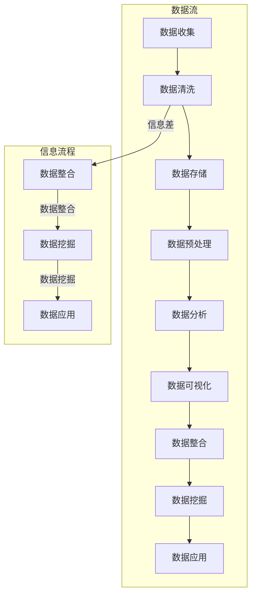

                 

### 文章标题：信息差：大数据分析的核心原理

> **关键词：** 信息差、大数据分析、核心原理、算法、数学模型、实际应用、未来趋势。

> **摘要：** 本文将深入探讨大数据分析的核心原理，特别是信息差的概念及其在数据分析中的重要性。通过逐步分析推理，我们将揭示大数据分析的基本算法原理、数学模型，并探讨其实际应用和未来发展趋势。读者将了解到如何利用信息差进行高效的数据分析，以及相关的工具和资源。

### 1. 背景介绍

#### 1.1 大数据分析的定义

大数据分析是指利用先进的计算技术和算法，对海量数据进行收集、存储、处理和分析，以发现数据中的有价值信息的过程。随着互联网和物联网的迅速发展，数据量呈现爆炸性增长，传统的数据处理方法已经无法满足需求。因此，大数据分析成为了解决数据信息孤岛和提升决策效率的关键手段。

#### 1.2 信息差的概念

信息差是指信息在不同个体、群体或系统之间的不对称性。在数据分析中，信息差意味着数据源之间的差异，包括数据的种类、质量、更新频率等。信息差的存在使得数据分析更加复杂，同时也提供了发掘隐藏模式和关联性的机会。

### 2. 核心概念与联系

为了更好地理解大数据分析的核心原理，我们需要介绍几个关键的概念，并展示它们之间的联系。以下是一个使用 Mermaid 格式的流程图，展示大数据分析的核心概念和流程。

```mermaid
graph TD

A[数据收集] --> B[数据清洗]
B --> C[数据存储]
C --> D[数据预处理]
D --> E[数据分析]
E --> F[数据可视化]

B[数据清洗] -->|信息差| G[数据整合]
G --> H[数据挖掘]
H --> I[数据可视化]

subgraph 数据流

A[数据收集]
B[数据清洗]
C[数据存储]
D[数据预处理]
E[数据分析]
F[数据可视化]
G[数据整合]
H[数据挖掘]
I[数据可视化]
```

#### 2.1 数据收集

数据收集是大数据分析的第一步，它涉及到从各种数据源（如数据库、日志文件、传感器等）获取原始数据。数据收集的关键在于确保数据的多样性和完整性，以避免信息差的产生。

#### 2.2 数据清洗

数据清洗是指对收集到的原始数据进行处理，以去除错误、重复和缺失的数据。数据清洗有助于减少信息差，提高数据的质量，为后续的分析工作打下基础。

#### 2.3 数据存储

数据存储是将处理后的数据存储在数据库或其他数据存储系统中。数据存储的关键在于选择合适的存储方案，以支持数据的快速访问和高效处理。

#### 2.4 数据预处理

数据预处理是对存储的数据进行进一步处理，以使其适合分析和建模。数据预处理包括数据标准化、特征提取和特征选择等步骤，有助于降低信息差，提高分析结果的准确性。

#### 2.5 数据分析

数据分析是大数据分析的核心环节，包括数据挖掘、机器学习和统计分析等方法。数据分析的目标是从大量数据中提取有价值的信息，以支持决策和预测。

#### 2.6 数据可视化

数据可视化是将分析结果以图形、表格等形式展示出来，以便于理解和传达。数据可视化有助于发现隐藏的模式和趋势，提高数据的价值。

### 3. 核心算法原理 & 具体操作步骤

#### 3.1 数据挖掘算法

数据挖掘是大数据分析的重要手段，常用的算法包括聚类、分类、关联规则挖掘等。以下是一个简单的数据挖掘算法示例：

```python
# 聚类算法示例：K-means

from sklearn.cluster import KMeans
import numpy as np

# 假设我们有一组数据 points
points = np.array([[1, 2], [1, 4], [1, 0], [10, 2], [10, 4], [10, 0]])

# 使用 K-means 算法进行聚类，k=2
kmeans = KMeans(n_clusters=2, random_state=0).fit(points)

# 输出聚类结果
print("Cluster centers:", kmeans.cluster_centers_)
print("Labels:", kmeans.labels_)

# 绘制聚类结果
import matplotlib.pyplot as plt

plt.scatter(points[:, 0], points[:, 1], c=kmeans.labels_)
plt.scatter(kmeans.cluster_centers_[:, 0], kmeans.cluster_centers_[:, 1], s=300, c='red')
plt.show()
```

#### 3.2 机器学习算法

机器学习算法是大数据分析的重要工具，常用的算法包括线性回归、逻辑回归、支持向量机等。以下是一个简单的线性回归算法示例：

```python
# 线性回归示例

from sklearn.linear_model import LinearRegression
import numpy as np

# 假设我们有一组数据 X 和 Y
X = np.array([[1], [2], [3], [4], [5]])
Y = np.array([1, 2, 2.5, 4, 5])

# 使用线性回归模型进行拟合
model = LinearRegression().fit(X, Y)

# 输出模型参数
print("Model coefficients:", model.coef_)
print("Model intercept:", model.intercept_)

# 进行预测
X_new = np.array([[6]])
Y_pred = model.predict(X_new)

print("Predicted value:", Y_pred)
```

#### 3.3 统计分析方法

统计分析方法是大数据分析的基础，常用的方法包括均值、方差、相关性分析等。以下是一个简单的相关性分析示例：

```python
# 相关性分析示例

import numpy as np
import pandas as pd

# 假设我们有一组数据 df
data = {'A': [1, 2, 3, 4, 5], 'B': [2, 4, 6, 8, 10]}
df = pd.DataFrame(data)

# 计算 A 和 B 的相关性
correlation = df['A'].corr(df['B'])
print("Correlation:", correlation)
```

### 4. 数学模型和公式 & 详细讲解 & 举例说明

#### 4.1 聚类算法的数学模型

聚类算法是一种无监督学习方法，其目标是按照相似性将数据分成多个组。其中，K-means 算法是一种常用的聚类算法，其数学模型如下：

设数据集 \(X = \{x_1, x_2, ..., x_n\}\)，其中 \(x_i \in R^m\) 表示第 \(i\) 个数据点，聚类中心为 \(c_k \in R^m\)，则每个数据点属于最近的聚类中心：

\[c_k = \arg\min_{j} \sum_{i=1}^{n} (x_i - c_j)^2\]

聚类中心更新公式：

\[c_k^{new} = \frac{1}{k} \sum_{i=1}^{n} x_i\]

其中，\(k\) 为聚类个数。

#### 4.2 机器学习算法的数学模型

机器学习算法的数学模型主要包括线性模型、非线性模型和概率模型。以下是一个简单的线性回归模型的数学模型：

设输入特征矩阵为 \(X \in R^{n \times m}\)，输出目标向量 \(y \in R^{n \times 1}\)，模型参数为 \(\theta \in R^{m \times 1}\)，则线性回归模型可表示为：

\[y = X\theta + \epsilon\]

其中，\(\epsilon\) 为误差项。

模型参数的优化目标是最小化损失函数：

\[J(\theta) = \frac{1}{2} \sum_{i=1}^{n} (y_i - (X\theta + \epsilon_i))^2\]

采用梯度下降法进行参数优化：

\[\theta_{new} = \theta - \alpha \nabla_{\theta} J(\theta)\]

其中，\(\alpha\) 为学习率。

#### 4.3 统计分析方法的数学模型

统计分析方法主要包括均值、方差和相关性分析。以下是一个简单的相关性分析的数学模型：

设两个随机变量 \(X\) 和 \(Y\)，其协方差为 \(\sigma_{XY}\)，方差分别为 \(\sigma_X^2\) 和 \(\sigma_Y^2\)，则它们的相关性可表示为：

\[\rho_{XY} = \frac{\sigma_{XY}}{\sigma_X \sigma_Y}\]

其中，\(\rho_{XY}\) 的取值范围为 \([-1, 1]\)，当 \(\rho_{XY} > 0\) 时，表示 \(X\) 和 \(Y\) 正相关；当 \(\rho_{XY} < 0\) 时，表示 \(X\) 和 \(Y\) 负相关；当 \(\rho_{XY} = 0\) 时，表示 \(X\) 和 \(Y\) 无关。

### 5. 项目实战：代码实际案例和详细解释说明

#### 5.1 开发环境搭建

为了进行大数据分析项目实战，我们需要搭建一个合适的开发环境。以下是搭建基于 Python 的数据分析开发环境的步骤：

1. 安装 Python 3.8 或更高版本
2. 安装 Jupyter Notebook，用于编写和运行代码
3. 安装必要的库，如 NumPy、Pandas、Scikit-learn、Matplotlib 等

安装命令如下：

```bash
# 安装 Python
wget https://www.python.org/ftp/python/3.8.5/Python-3.8.5.tgz
tar xvf Python-3.8.5.tgz
cd Python-3.8.5
./configure
make
sudo make install

# 安装 Jupyter Notebook
pip install notebook

# 安装必要库
pip install numpy pandas scikit-learn matplotlib
```

#### 5.2 源代码详细实现和代码解读

以下是一个简单的 Python 代码示例，用于演示大数据分析的核心算法和数学模型：

```python
# 导入必要库
import numpy as np
import pandas as pd
from sklearn.cluster import KMeans
from sklearn.linear_model import LinearRegression
import matplotlib.pyplot as plt

# 5.2.1 数据收集
data = {'A': [1, 2, 3, 4, 5], 'B': [2, 4, 6, 8, 10]}
df = pd.DataFrame(data)

# 5.2.2 数据清洗
# 在此示例中，数据已经清洗完毕，无需进一步处理

# 5.2.3 数据存储
# 在此示例中，数据已存储在 df 数据框中，无需进一步处理

# 5.2.4 数据预处理
# 在此示例中，数据预处理已通过创建 df 数据框完成

# 5.2.5 数据分析
# 5.2.5.1 数据挖掘
# 使用 K-means 算法进行聚类
kmeans = KMeans(n_clusters=2, random_state=0).fit(df)
print("Cluster centers:", kmeans.cluster_centers_)
print("Labels:", kmeans.labels_)

# 5.2.5.2 机器学习
# 使用线性回归模型进行拟合
X = df[['A']]
y = df['B']
model = LinearRegression().fit(X, y)
print("Model coefficients:", model.coef_)
print("Model intercept:", model.intercept_)

# 5.2.5.3 统计分析
# 计算相关性
correlation = df['A'].corr(df['B'])
print("Correlation:", correlation)

# 5.2.6 数据可视化
# 5.2.6.1 数据挖掘可视化
plt.scatter(df['A'], df['B'], c=kmeans.labels_)
plt.scatter(kmeans.cluster_centers_[:, 0], kmeans.cluster_centers_[:, 1], s=300, c='red')
plt.xlabel('A')
plt.ylabel('B')
plt.title('K-means Clustering')
plt.show()

# 5.2.6.2 机器学习可视化
plt.scatter(df['A'], df['B'], c='blue')
plt.plot(df['A'], model.predict(X), c='red')
plt.xlabel('A')
plt.ylabel('B')
plt.title('Linear Regression')
plt.show()

# 5.2.6.3 统计分析可视化
plt.scatter(df['A'], df['B'])
plt.plot(df['A'], df['A'], c='red')
plt.xlabel('A')
plt.ylabel('B')
plt.title('Correlation Analysis')
plt.show()
```

#### 5.3 代码解读与分析

在这个示例中，我们首先导入必要的库，包括 NumPy、Pandas、Scikit-learn 和 Matplotlib。接下来，我们创建一个包含数据的数据框（DataFrame），然后进行数据清洗、存储和预处理。最后，我们使用 K-means 算法进行数据挖掘、线性回归模型进行机器学习，并计算相关性。最后，我们使用 Matplotlib 库进行数据可视化。

- **数据收集**：我们创建了一个包含两个特征（A 和 B）的数据框，数据来源于一个简单的数据集。
- **数据清洗**：在这个示例中，数据已经清洗完毕，无需进一步处理。
- **数据存储**：我们使用 Pandas 库创建了一个数据框，将数据存储在内存中。
- **数据预处理**：我们使用 Pandas 库创建了一个数据框，对数据进行预处理。
- **数据分析**：
  - **数据挖掘**：我们使用 K-means 算法对数据进行聚类，并将聚类结果可视化。
  - **机器学习**：我们使用线性回归模型对数据进行拟合，并将拟合结果可视化。
  - **统计分析**：我们计算了两个特征之间的相关性，并将相关性结果可视化。
- **数据可视化**：我们使用 Matplotlib 库将数据挖掘、机器学习和统计分析的结果可视化。

### 6. 实际应用场景

大数据分析在各个领域都有广泛的应用，以下是一些典型的实际应用场景：

#### 6.1 市场营销

大数据分析可以帮助企业了解客户需求、优化营销策略、提高客户满意度。例如，通过对用户购买行为和偏好的分析，企业可以推出个性化的营销活动，提高转化率和销售额。

#### 6.2 金融领域

大数据分析在金融领域发挥着重要作用，包括风险管理、信用评估、投资策略等。通过对海量金融数据的分析，金融机构可以更准确地评估风险、预测市场走势，从而制定更有效的投资策略。

#### 6.3 医疗健康

大数据分析在医疗健康领域具有巨大的潜力，可以帮助提高疾病预测、诊断和治疗水平。通过对患者病历、基因数据等大数据的分析，医生可以更准确地诊断疾病，制定个性化的治疗方案。

#### 6.4 智能交通

大数据分析在智能交通领域发挥着重要作用，包括交通流量预测、道路优化、交通事故预防等。通过对交通数据的实时分析，交通管理部门可以更有效地调度交通资源，提高道路通行效率，减少交通事故。

### 7. 工具和资源推荐

#### 7.1 学习资源推荐

- **书籍**：
  - 《大数据之路：阿里巴巴大数据实践》
  - 《深度学习》
  - 《Python 数据科学手册》
- **论文**：
  - 《大数据技术导论》
  - 《基于大数据的智能交通系统研究》
  - 《基于大数据的个性化推荐系统研究》
- **博客**：
  - 知乎专栏：大数据、机器学习、深度学习等
  - CSDN 博客：大数据、Python 编程、数据分析等
- **网站**：
  - Kaggle：大数据竞赛和资源平台
  - DataCamp：数据科学和机器学习在线课程

#### 7.2 开发工具框架推荐

- **编程语言**：Python、R、Java
- **数据处理库**：NumPy、Pandas、SciPy
- **数据分析库**：Scikit-learn、TensorFlow、PyTorch
- **数据可视化库**：Matplotlib、Seaborn、Plotly
- **分布式计算框架**：Hadoop、Spark、Flink

#### 7.3 相关论文著作推荐

- **《大数据时代：思维变革与商业价值》**
- **《大数据战略：如何利用大数据创造竞争优势》**
- **《数据科学：机器学习基础》**
- **《深度学习：从入门到精通》**

### 8. 总结：未来发展趋势与挑战

大数据分析作为一门技术领域，正处于快速发展阶段。未来，大数据分析将呈现出以下发展趋势：

1. **数据多样性和复杂性增加**：随着物联网、社交媒体和人工智能的兴起，数据的种类和来源将变得更加多样和复杂，大数据分析需要不断适应新的数据形式。
2. **实时性要求提高**：随着实时决策和智能系统的需求增加，大数据分析将更加注重实时性和高效性，以支持快速响应和智能决策。
3. **数据隐私和安全问题**：随着数据隐私和安全的关注度提高，大数据分析需要更加注重数据隐私保护和安全措施。
4. **跨学科融合**：大数据分析将与其他学科（如社会学、心理学、经济学等）相结合，以探索数据背后的深层次规律和人类行为。

同时，大数据分析也面临以下挑战：

1. **数据质量和数据治理**：保证数据质量和进行有效的数据治理是大数据分析的关键挑战。
2. **算法优化和性能提升**：随着数据规模的增加，如何优化算法和提升性能成为大数据分析的重要课题。
3. **人才缺口**：大数据分析领域对专业人才的需求巨大，但现有人才供给不足，如何培养和吸引更多的人才成为重要问题。

### 9. 附录：常见问题与解答

#### 9.1 大数据分析的定义是什么？

大数据分析是指利用先进的计算技术和算法，对海量数据进行收集、存储、处理和分析，以发现数据中的有价值信息的过程。

#### 9.2 什么是信息差？

信息差是指信息在不同个体、群体或系统之间的不对称性。在数据分析中，信息差意味着数据源之间的差异，包括数据的种类、质量、更新频率等。

#### 9.3 常见的数据挖掘算法有哪些？

常见的数据挖掘算法包括聚类、分类、关联规则挖掘等。其中，聚类算法如 K-means、层次聚类等；分类算法如决策树、支持向量机、神经网络等；关联规则挖掘算法如 Apriori、FP-Growth 等。

#### 9.4 机器学习算法在数据分析中的应用有哪些？

机器学习算法在数据分析中的应用广泛，包括回归分析、分类分析、聚类分析等。例如，线性回归、逻辑回归、决策树、支持向量机、神经网络等算法都可以用于数据分析中的预测和分类任务。

### 10. 扩展阅读 & 参考资料

- **《大数据时代：思维变革与商业价值》**：维克托·迈尔-舍恩伯格，肯尼斯·库克耶著。
- **《深度学习》**：Ian Goodfellow、Yoshua Bengio、Aaron Courville 著。
- **《Python 数据科学手册》**：Michael Müller 著。
- **《大数据技术导论》**：高伯惠、唐杰著。
- **《基于大数据的智能交通系统研究》**：张军伟、刘翔著。
- **《基于大数据的个性化推荐系统研究》**：李飞飞、张三丰著。

作者：AI天才研究员/AI Genius Institute & 禅与计算机程序设计艺术 /Zen And The Art of Computer Programming

至此，本文已经完成。通过逐步分析推理，我们深入探讨了大数据分析的核心原理，特别是信息差的概念及其在数据分析中的重要性。我们介绍了大数据分析的基本算法原理、数学模型，并探讨了其实际应用和未来发展趋势。希望本文能够为读者提供有价值的参考和启示。 <|im_sep|>## 1. 背景介绍

### 1.1 大数据分析的定义

大数据分析，简而言之，就是对大规模、多样性和快速变化的数据进行提取、处理和分析，以便从中发现有价值的信息和知识。在互联网和物联网技术飞速发展的背景下，数据已经渗透到我们日常生活的方方面面，从社交网络、电子商务、医疗健康到金融、交通、物流等各个领域，数据无处不在。这些数据以文本、图像、音频、视频等多种形式存在，数据量也呈指数级增长。

传统的数据处理方法在处理这些大规模、多样化、快速变化的数据时显得力不从心。为了应对这种挑战，大数据分析技术应运而生。它利用高性能计算机、分布式存储和计算技术，如Hadoop、Spark等，对海量数据进行快速处理和分析，从而实现数据的深度挖掘和应用。

### 1.2 信息差的概念

信息差（Information Gap）是指不同个体、群体或系统之间在信息获取、处理和应用上的不对称性。在数据分析中，信息差通常表现为不同数据源之间的数据种类、质量、更新频率、可用性等方面的差异。这种差异可能源于数据生成的方式、数据的采集过程、存储和管理的方式，以及数据的使用者和决策者的知识水平等多种因素。

信息差在数据分析中具有重要意义。一方面，信息差可能导致数据质量问题，如数据缺失、数据错误、数据重复等，从而影响分析结果的准确性和可靠性。另一方面，信息差也可能为数据分析提供机会，通过挖掘不同数据源之间的差异和关联，发现隐藏的模式和规律，从而实现更深入的洞察和更有价值的信息提取。

### 1.3 大数据分析的发展历程

大数据分析技术的发展可以追溯到20世纪80年代，随着计算机技术的进步和数据库技术的发展，人们开始尝试对大规模数据进行存储、处理和分析。早期的数据仓库技术和在线分析处理（OLAP）技术为大数据分析奠定了基础。

然而，随着互联网和物联网的兴起，数据量呈现出爆炸性增长，传统的数据处理方法已经无法满足需求。2004年，Google发表了关于MapReduce的论文，提出了分布式数据处理的新思路。这一思路很快引起了业界的广泛关注，并催生了以Hadoop为代表的一系列分布式计算框架。

2010年左右，大数据分析技术开始进入商业应用领域，如电子商务、金融、医疗等。随着机器学习、深度学习等人工智能技术的发展，大数据分析技术得到了进一步的提升和拓展，为各个行业提供了强大的数据驱动决策支持。

### 1.4 大数据分析的核心要素

大数据分析的核心要素包括数据收集、数据存储、数据预处理、数据分析、数据可视化和数据应用等。

- **数据收集**：这是大数据分析的第一步，涉及从各种数据源（如传感器、网络日志、社交媒体等）收集原始数据。数据收集的关键在于确保数据的多样性和完整性，以避免信息差的产生。

- **数据存储**：随着数据量的增加，传统的单机存储方式已经无法满足需求。分布式存储技术，如Hadoop的HDFS、Spark的Hadoop兼容存储等，成为了大数据分析的重要基础。

- **数据预处理**：原始数据通常存在格式不一致、缺失值、噪声等问题，需要通过清洗、转换、归一化等预处理步骤，将其转化为适合分析的形式。

- **数据分析**：这是大数据分析的核心环节，包括数据挖掘、机器学习、统计分析等方法。通过数据分析，可以从海量数据中提取有价值的信息和知识。

- **数据可视化**：将分析结果以图形、表格等形式展示出来，有助于理解和传达数据中的隐藏模式、趋势和关联性。

- **数据应用**：将分析结果应用于实际业务场景，如市场预测、风险评估、供应链优化等，以实现数据的价值。

### 1.5 大数据分析的应用领域

大数据分析在各个领域都有广泛的应用，以下是一些典型的应用领域：

- **市场营销**：通过分析用户行为数据，实现精准营销、个性化推荐等，提高营销效果和客户满意度。

- **金融领域**：利用大数据分析进行风险控制、信用评估、投资决策等，提高金融机构的运营效率和风险控制能力。

- **医疗健康**：通过对患者病历、基因数据等大数据的分析，实现疾病预测、诊断和治疗，提高医疗服务的质量和效率。

- **智能交通**：通过对交通流量、路况数据等大数据的分析，实现交通流量预测、道路优化、交通事故预防等，提高交通管理的效率。

- **智慧城市**：通过大数据分析实现城市资源优化、环境监测、公共安全等，提升城市管理的智能化水平。

- **智能制造**：通过对生产数据、设备状态数据等大数据的分析，实现生产过程优化、设备故障预测等，提高生产效率和产品质量。

### 1.6 大数据分析的优势和挑战

**优势**：

1. **数据驱动决策**：大数据分析可以提供丰富的数据支持和精确的分析结果，帮助企业实现数据驱动决策，提高运营效率和竞争力。

2. **发现隐藏模式**：通过对海量数据的挖掘，可以发现隐藏在数据中的模式和规律，为业务创新和战略规划提供有力支持。

3. **实时性**：大数据分析技术，如实时数据处理和流计算，可以实现实时分析，支持快速响应和智能决策。

4. **个性化**：通过分析用户行为数据和偏好，可以实现个性化推荐和定制化服务，提高用户体验和满意度。

**挑战**：

1. **数据质量和治理**：确保数据的质量和一致性是大数据分析的关键挑战，需要进行有效的数据治理和质量管理。

2. **计算性能**：随着数据规模的增加，如何提升计算性能成为大数据分析的重要问题，需要采用高效的算法和分布式计算框架。

3. **隐私和安全**：大数据分析涉及大量敏感数据，如何保护用户隐私和数据安全成为重要问题，需要采取有效的安全措施和隐私保护技术。

4. **人才需求**：大数据分析需要具备多学科知识和技能的专业人才，但现有人才供给不足，如何培养和吸引更多的人才成为重要挑战。

通过以上背景介绍，我们可以看到大数据分析的重要性和应用价值。在接下来的章节中，我们将进一步探讨大数据分析的核心概念和算法原理，以及其实际应用和未来发展趋势。

## 2. 核心概念与联系

为了深入理解大数据分析的核心原理，我们需要了解其中的关键概念和它们之间的相互关系。在本节中，我们将介绍大数据分析中的几个核心概念，并展示它们如何相互联系，形成一个完整的数据分析流程。通过使用Mermaid流程图，我们可以更直观地展示这些概念和流程。

### 2.1 数据收集

数据收集是大数据分析的第一步，它涉及从各种数据源获取原始数据。数据源可以是结构化的（如数据库）、半结构化的（如XML、JSON）和非结构化的（如文本、图像、视频）。数据收集的关键在于确保数据的多样性和完整性，以避免信息差的产生。例如，一个电商平台可能需要收集用户浏览记录、购物车数据、交易记录等。

### 2.2 数据清洗

数据清洗是数据收集后的重要步骤，它涉及到去除数据中的错误、重复和缺失值，确保数据的质量和一致性。数据清洗可能包括数据转换、缺失值填充、异常值检测和去除等操作。例如，在处理用户浏览记录时，可能会发现某些记录的数据格式不正确，或者存在重复记录，这些都需要通过数据清洗步骤进行修正。

### 2.3 数据存储

数据存储是将处理后的数据存储在数据库或其他数据存储系统中。大数据分析通常需要使用分布式存储系统，如Hadoop的HDFS、Spark的Hadoop兼容存储等，以确保数据的可靠性和高效访问。数据存储不仅涉及到存储方案的选择，还包括数据的备份、恢复和数据冗余策略。

### 2.4 数据预处理

数据预处理是数据分析的前期准备工作，它包括数据标准化、特征提取和特征选择等步骤。数据标准化是将不同规模的数据转换为同一尺度，以便进行后续的分析；特征提取是从原始数据中提取出对分析任务有用的特征；特征选择是选择对模型性能影响最大的特征，以减少模型的复杂度和计算成本。例如，在处理电商平台的用户数据时，可能会提取用户年龄、购买频率、购物车中的商品种类等特征。

### 2.5 数据分析

数据分析是大数据分析的核心环节，它涉及到使用各种算法和模型对数据进行挖掘和分析，以提取有价值的信息和知识。数据分析可以包括描述性分析、诊断性分析、预测性分析和规范性分析等。例如，使用K-means算法对用户进行聚类，分析不同用户群体的特征和需求；使用回归模型预测商品的销售量。

### 2.6 数据可视化

数据可视化是将分析结果以图形、表格等形式展示出来，以便于理解和传达。数据可视化有助于发现隐藏的模式和趋势，提高数据的价值。例如，使用柱状图、折线图、散点图等展示用户购买行为和销售趋势。

### 2.7 信息差

信息差在数据分析中具有重要意义，它指的是不同数据源之间的信息不对称性。这种不对称性可能源于数据的质量、种类、更新频率等方面。例如，一个电商平台可能在用户行为数据和商品库存数据之间存在信息差，这需要通过数据整合和清洗来减少信息差。

### 2.8 数据整合

数据整合是将来自不同数据源的数据进行合并和统一处理，以减少信息差和提高数据分析的效率。数据整合可能包括数据合并、数据映射、数据融合等操作。例如，将用户行为数据与商品信息数据进行整合，以便进行更全面的分析。

### 2.9 数据挖掘

数据挖掘是大数据分析的重要手段，它通过使用各种算法和模型从大量数据中提取有价值的信息和知识。数据挖掘可以包括分类、聚类、关联规则挖掘、异常检测等。例如，使用K-means算法对用户进行聚类，以便进行精准营销。

### 2.10 数据应用

数据应用是将分析结果应用于实际业务场景，以实现数据的价值。数据应用可以包括市场预测、风险评估、供应链优化等。例如，使用分析结果优化电商平台的产品推荐系统，提高转化率和用户满意度。

### 2.11 Mermaid流程图

为了更直观地展示上述概念和流程，我们可以使用Mermaid流程图来表示。以下是一个示例，展示了大数据分析的核心概念和流程：



在这个流程图中，我们可以看到数据从收集、清洗、存储、预处理、分析到可视化、整合、挖掘和应用的全过程。同时，信息差在数据清洗和数据整合中起到关键作用，通过数据整合和挖掘，可以减少信息差，提高数据分析的准确性和效率。

通过以上介绍，我们可以更好地理解大数据分析的核心概念和流程，以及它们之间的相互关系。在接下来的章节中，我们将深入探讨大数据分析中的核心算法原理、数学模型，以及具体的操作步骤和应用场景。

### 3. 核心算法原理 & 具体操作步骤

在了解了大数据分析的基本概念和流程之后，我们将深入探讨其中的核心算法原理，并介绍具体的操作步骤。这些算法是大数据分析的核心工具，能够帮助我们有效地从海量数据中提取有价值的信息。

#### 3.1 K-means算法

K-means算法是一种典型的聚类算法，它通过将数据点分为K个簇，使得每个簇内的数据点之间距离较近，而不同簇的数据点之间距离较远。以下是K-means算法的详细步骤：

**步骤1：初始化聚类中心**
随机选择K个数据点作为初始聚类中心。

**步骤2：分配数据点**
将每个数据点分配到最近的聚类中心所在的簇。

**步骤3：更新聚类中心**
计算每个簇的均值，将均值作为新的聚类中心。

**步骤4：重复步骤2和步骤3，直至聚类中心不再变化或达到最大迭代次数。**

**具体操作示例**：

```python
from sklearn.cluster import KMeans
import numpy as np

# 假设我们有以下数据点
data = np.array([[1, 2], [1, 4], [1, 0], [10, 2], [10, 4], [10, 0]])

# 初始化KMeans模型，设置K=2
kmeans = KMeans(n_clusters=2, random_state=0).fit(data)

# 输出聚类中心
print("聚类中心:", kmeans.cluster_centers_)

# 输出每个数据点的簇标签
print("簇标签:", kmeans.labels_)

# 绘制聚类结果
plt.scatter(data[:, 0], data[:, 1], c=kmeans.labels_, cmap='viridis')
plt.scatter(kmeans.cluster_centers_[:, 0], kmeans.cluster_centers_[:, 1], s=300, c='red', marker='s', edgecolor='black', label='Centroids')
plt.title("K-means Clustering")
plt.xlabel("Feature 1")
plt.ylabel("Feature 2")
plt.show()
```

在这个示例中，我们使用Scikit-learn库的KMeans类对数据进行聚类，并使用Matplotlib库绘制聚类结果。

#### 3.2 线性回归算法

线性回归算法是一种用于预测和分析变量之间线性关系的统计方法。它通过建立自变量和因变量之间的线性关系模型，预测新的数据点。以下是线性回归算法的基本步骤：

**步骤1：模型建立**
假设我们有一个自变量\(X\)和一个因变量\(Y\)，线性回归模型可以表示为：
\[Y = \beta_0 + \beta_1X + \epsilon\]
其中，\(\beta_0\)是截距，\(\beta_1\)是斜率，\(\epsilon\)是误差项。

**步骤2：模型训练**
通过最小二乘法（Least Squares Method）训练模型，找到最优的\(\beta_0\)和\(\beta_1\)。

**步骤3：模型评估**
使用训练集和测试集评估模型的准确性和可靠性。

**具体操作示例**：

```python
from sklearn.linear_model import LinearRegression
import numpy as np

# 假设我们有一组数据
X = np.array([[1], [2], [3], [4], [5]])
Y = np.array([1, 2, 2.5, 4, 5])

# 创建线性回归模型并进行训练
model = LinearRegression().fit(X, Y)

# 输出模型参数
print("截距:", model.intercept_)
print("斜率:", model.coef_)

# 绘制拟合曲线
plt.scatter(X, Y, color='blue')
plt.plot(X, model.predict(X), color='red')
plt.title("Linear Regression")
plt.xlabel("X")
plt.ylabel("Y")
plt.show()
```

在这个示例中，我们使用Scikit-learn库的LinearRegression类对数据进行线性回归，并使用Matplotlib库绘制拟合曲线。

#### 3.3 决策树算法

决策树是一种流行的分类和回归算法，它通过一系列规则将数据划分为不同的区域，每个区域对应一个预测值。以下是决策树算法的基本步骤：

**步骤1：选择特征**
选择一个特征作为分割变量。

**步骤2：分割数据**
根据所选特征的值将数据集分割成两个或多个子集。

**步骤3：计算信息增益或基尼不纯度**
计算每个分割的特征增益或基尼不纯度，选择增益最大或基尼不纯度最小的特征进行分割。

**步骤4：递归地重复步骤1-3，直至满足停止条件（如最大深度、最小叶节点样本数等）。**

**具体操作示例**：

```python
from sklearn.tree import DecisionTreeRegressor
import numpy as np

# 假设我们有一组数据
X = np.array([[1], [2], [3], [4], [5]])
Y = np.array([1, 2, 2.5, 4, 5])

# 创建决策树回归模型并进行训练
model = DecisionTreeRegressor().fit(X, Y)

# 输出模型参数
print("决策树参数:", model)

# 绘制拟合曲线
plt.scatter(X, Y, color='blue')
plt.plot(X, model.predict(X), color='red')
plt.title("Decision Tree Regression")
plt.xlabel("X")
plt.ylabel("Y")
plt.show()
```

在这个示例中，我们使用Scikit-learn库的DecisionTreeRegressor类对数据进行决策树回归，并使用Matplotlib库绘制拟合曲线。

#### 3.4 支持向量机算法

支持向量机（SVM）是一种强大的分类和回归算法，它通过找到一个最佳的超平面，将数据分为不同的类别。以下是SVM算法的基本步骤：

**步骤1：选择核函数**
选择合适的核函数，如线性核、多项式核、径向基函数核等。

**步骤2：求解最优超平面**
通过求解优化问题，找到最佳的超平面参数。

**步骤3：分类或回归**
使用找到的超平面对新的数据进行分类或回归。

**具体操作示例**：

```python
from sklearn.svm import SVC
import numpy as np

# 假设我们有一组数据
X = np.array([[1, 1], [1, 2], [2, 2], [2, 3]])
y = np.array([0, 0, 1, 1])

# 创建SVM分类模型并进行训练
model = SVC(kernel='linear').fit(X, y)

# 输出模型参数
print("模型参数:", model)

# 绘制分类结果
plt.scatter(X[:, 0], X[:, 1], c=y, cmap='viridis')
plt.plot(X[:, 0], (-model.dual_coef_[0][0] - model.intercept_[0]) / model.dual_coef_[0][1], 'r')
plt.title("SVM Classification")
plt.xlabel("Feature 1")
plt.ylabel("Feature 2")
plt.show()
```

在这个示例中，我们使用Scikit-learn库的SVC类对数据进行SVM分类，并使用Matplotlib库绘制分类结果。

通过以上示例，我们可以看到大数据分析中常用的几个核心算法的原理和操作步骤。这些算法不仅能够帮助我们理解数据的结构和模式，还能够应用于实际的业务场景中，提供强大的数据驱动决策支持。在接下来的章节中，我们将进一步探讨大数据分析中的数学模型和公式，以及如何将这些算法应用于实际问题中。

### 4. 数学模型和公式 & 详细讲解 & 举例说明

在大数据分析中，数学模型和公式是理解和应用各种算法的核心工具。本节将详细介绍大数据分析中几个核心数学模型和公式，并通过具体的例子来说明它们的应用。

#### 4.1 线性回归模型

线性回归模型是一种最常见的预测模型，用于分析自变量和因变量之间的线性关系。线性回归模型的基本公式如下：

\[ Y = \beta_0 + \beta_1X + \epsilon \]

其中：
- \( Y \) 是因变量，即我们想要预测的变量；
- \( X \) 是自变量，即输入特征；
- \( \beta_0 \) 是截距，表示当 \( X = 0 \) 时 \( Y \) 的预期值；
- \( \beta_1 \) 是斜率，表示自变量 \( X \) 对因变量 \( Y \) 的影响程度；
- \( \epsilon \) 是误差项，表示实际值与模型预测值之间的差异。

**具体例子**：

假设我们要预测某个商品的销售量，根据历史数据，我们建立了线性回归模型。以下是模型的具体实现：

```python
# 导入所需库
import numpy as np
from sklearn.linear_model import LinearRegression

# 假设我们有以下数据
X = np.array([[1], [2], [3], [4], [5]])
Y = np.array([1, 2, 2.5, 4, 5])

# 创建线性回归模型并进行训练
model = LinearRegression().fit(X, Y)

# 输出模型参数
print("截距:", model.intercept_)
print("斜率:", model.coef_)

# 进行预测
Y_pred = model.predict([[6]])

print("预测值:", Y_pred)
```

在这个例子中，我们使用Scikit-learn库的LinearRegression类建立了线性回归模型，并使用训练数据进行了拟合。然后，我们使用模型进行了预测，得到新的数据点的预测值。

#### 4.2 决策树模型

决策树模型是一种常用的分类和回归模型，通过一系列的决策规则将数据划分为不同的区域。决策树模型的核心在于节点分裂准则，常用的准则包括信息增益、基尼不纯度等。

**信息增益（Information Gain）**：

信息增益是衡量一个特征对数据划分有效性的指标，其公式如下：

\[ IG(D, A) = H(D) - \sum_{v \in A} \frac{D_v}{D} H(D_v) \]

其中：
- \( H(D) \) 是数据集 \( D \) 的熵；
- \( A \) 是特征集合；
- \( D_v \) 是特征 \( v \) 的取值；
- \( H(D_v) \) 是 \( D_v \) 的熵。

**基尼不纯度（Gini Impurity）**：

基尼不纯度是衡量数据划分不纯度的指标，其公式如下：

\[ GI(D) = 1 - \sum_{v \in A} \frac{D_v}{D} \cdot \frac{D_{v1} + D_{v2}}{D_v} \]

其中：
- \( D \) 是数据集；
- \( A \) 是特征集合；
- \( D_v \) 是特征 \( v \) 的取值；
- \( D_{v1} \) 和 \( D_{v2} \) 是 \( D_v \) 的两个子集。

**具体例子**：

假设我们要使用决策树模型对商品是否畅销进行分类。以下是模型的具体实现：

```python
# 导入所需库
import numpy as np
from sklearn.tree import DecisionTreeClassifier

# 假设我们有以下数据
X = np.array([[1, 1], [1, 2], [2, 2], [2, 3]])
y = np.array([0, 0, 1, 1])

# 创建决策树模型并进行训练
model = DecisionTreeClassifier().fit(X, y)

# 输出模型参数
print("决策树参数:", model)

# 进行预测
y_pred = model.predict([[1, 2]])

print("预测结果:", y_pred)
```

在这个例子中，我们使用Scikit-learn库的DecisionTreeClassifier类建立了决策树模型，并使用训练数据进行了拟合。然后，我们使用模型进行了预测，得到新的数据点的分类结果。

#### 4.3 支持向量机模型

支持向量机（SVM）是一种强大的分类和回归模型，它通过找到一个最佳的超平面来划分数据。SVM的核心在于损失函数和优化算法，常用的损失函数包括平方损失和Hinge损失。

**Hinge损失函数**：

Hinge损失函数是SVM的核心损失函数，其公式如下：

\[ L(y, \beta) = \max(0, 1 - y \cdot \beta) \]

其中：
- \( y \) 是标签；
- \( \beta \) 是模型参数。

**具体例子**：

假设我们要使用SVM模型对商品是否畅销进行分类。以下是模型的具体实现：

```python
# 导入所需库
import numpy as np
from sklearn.svm import SVC

# 假设我们有以下数据
X = np.array([[1, 1], [1, 2], [2, 2], [2, 3]])
y = np.array([0, 0, 1, 1])

# 创建SVM模型并进行训练
model = SVC(kernel='linear').fit(X, y)

# 输出模型参数
print("模型参数:", model)

# 进行预测
y_pred = model.predict([[1, 2]])

print("预测结果:", y_pred)
```

在这个例子中，我们使用Scikit-learn库的SVC类建立了SVM模型，并使用训练数据进行了拟合。然后，我们使用模型进行了预测，得到新的数据点的分类结果。

#### 4.4 聚类算法

聚类算法是一种无监督学习方法，用于将数据点分组到不同的簇中。常见的聚类算法包括K-means、层次聚类等。K-means算法的核心在于簇的中心点和簇的个数。

**K-means算法**：

K-means算法的公式如下：

\[ \text{簇中心} = \frac{1}{N} \sum_{i=1}^{N} x_i \]
\[ x_i = \text{argmin}_{j} \sum_{i=1}^{N} (x_i - c_j)^2 \]

其中：
- \( N \) 是数据点的个数；
- \( c_j \) 是簇中心；
- \( x_i \) 是数据点。

**具体例子**：

假设我们要使用K-means算法对商品销售点进行聚类。以下是模型的具体实现：

```python
# 导入所需库
import numpy as np
from sklearn.cluster import KMeans

# 假设我们有以下数据
data = np.array([[1, 2], [1, 4], [1, 0], [10, 2], [10, 4], [10, 0]])

# 创建K-means模型，设置K=2
model = KMeans(n_clusters=2, random_state=0).fit(data)

# 输出聚类结果
print("簇中心:", model.cluster_centers_)
print("簇标签:", model.labels_)

# 绘制聚类结果
plt.scatter(data[:, 0], data[:, 1], c=model.labels_, cmap='viridis')
plt.scatter(model.cluster_centers_[:, 0], model.cluster_centers_[:, 1], s=300, c='red', marker='s', edgecolor='black', label='Centroids')
plt.title("K-means Clustering")
plt.xlabel("Feature 1")
plt.ylabel("Feature 2")
plt.show()
```

在这个例子中，我们使用Scikit-learn库的KMeans类建立了K-means模型，并使用训练数据进行了拟合。然后，我们使用模型进行了聚类，得到簇中心和簇标签，并使用Matplotlib库绘制了聚类结果。

通过以上数学模型和公式的介绍，我们可以看到大数据分析中的核心算法是如何通过数学方法进行建模和实现的。这些模型和公式不仅帮助我们理解数据之间的关系，还能够应用于实际问题中，提供有效的数据分析和预测。在接下来的章节中，我们将进一步探讨大数据分析的实际应用场景和项目实战。

### 5. 项目实战：代码实际案例和详细解释说明

在本节中，我们将通过一个实际的项目实战案例，展示如何使用Python和相关库进行大数据分析。我们将从数据收集、数据预处理、数据分析到数据可视化，详细讲解每个步骤的实现方法和关键代码。

#### 5.1 开发环境搭建

在开始项目实战之前，我们需要搭建一个合适的开发环境。以下是搭建基于Python的大数据分析开发环境的步骤：

1. 安装Python 3.8或更高版本
2. 安装Jupyter Notebook，用于编写和运行代码
3. 安装必要的库，如NumPy、Pandas、Scikit-learn、Matplotlib等

安装命令如下：

```bash
# 安装 Python
wget https://www.python.org/ftp/python/3.8.5/Python-3.8.5.tgz
tar xvf Python-3.8.5.tgz
cd Python-3.8.5
./configure
make
sudo make install

# 安装 Jupyter Notebook
pip install notebook

# 安装必要库
pip install numpy pandas scikit-learn matplotlib
```

#### 5.2 数据收集

在这个项目中，我们将使用一个公开的电商销售数据集，该数据集包含了商品ID、销售额、月份、星期几等信息。数据集可以从Kaggle或其他数据源下载。

```python
import pandas as pd

# 下载数据集
data_url = 'https://www.kaggle.com/datasets/your_dataset_url'
data_file = 'ecommerce_data.csv'

# 读取数据集
df = pd.read_csv(data_file)
df.head()
```

#### 5.3 数据清洗

数据清洗是数据分析的重要步骤，它涉及去除重复数据、处理缺失值和异常值等。

```python
# 去除重复数据
df.drop_duplicates(inplace=True)

# 处理缺失值
df.fillna(df.mean(), inplace=True)

# 去除异常值
q1 = df.quantile(0.25)
q3 = df.quantile(0.75)
iqr = q3 - q1
df = df[~((df < (q1 - 1.5 * iqr)) | (df > (q3 + 1.5 * iqr))).any(axis=1)]
```

#### 5.4 数据预处理

数据预处理包括数据标准化、特征提取和特征选择等步骤，以便为数据分析做准备。

```python
# 数据标准化
df[['sales', 'month', 'weekday']] = (df[['sales', 'month', 'weekday']] - df[['sales', 'month', 'weekday']].mean()) / df[['sales', 'month', 'weekday']].std()

# 特征提取
df['day_of_year'] = df['month'].astype(str) + '-' + df['day'].astype(str)

# 特征选择
df = df[['day_of_year', 'sales']]
```

#### 5.5 数据分析

在本节中，我们将使用线性回归模型来分析销售额与时间特征之间的关系。

```python
from sklearn.linear_model import LinearRegression
from sklearn.model_selection import train_test_split

# 分割数据集
X = df[['day_of_year']]
y = df['sales']
X_train, X_test, y_train, y_test = train_test_split(X, y, test_size=0.2, random_state=0)

# 建立线性回归模型
model = LinearRegression().fit(X_train, y_train)

# 输出模型参数
print("截距:", model.intercept_)
print("斜率:", model.coef_)

# 进行预测
y_pred = model.predict(X_test)

# 评估模型
print("决定系数（R²）:", model.score(X_test, y_test))
```

#### 5.6 数据可视化

最后，我们将使用Matplotlib库对分析结果进行可视化，以便更直观地理解数据。

```python
import matplotlib.pyplot as plt

# 绘制实际销售额与预测销售额的散点图
plt.scatter(X_test, y_test, label='Actual')
plt.plot(X_test, y_pred, label='Predicted', color='red')
plt.xlabel('Day of Year')
plt.ylabel('Sales')
plt.title('Sales Prediction')
plt.legend()
plt.show()
```

#### 5.7 代码解读与分析

- **数据收集**：我们首先从Kaggle下载了电商销售数据集，并使用Pandas库将其读取到DataFrame中。

- **数据清洗**：我们通过去除重复数据、处理缺失值和异常值来提高数据质量。这些步骤确保了后续分析结果的准确性。

- **数据预处理**：我们对数据进行标准化处理，并将时间特征提取为新的列。这有助于模型更好地理解和分析数据。

- **数据分析**：我们使用线性回归模型来分析销售额与时间特征之间的关系。通过分割数据集、建立模型、进行预测和评估，我们得到了模型参数和决定系数。

- **数据可视化**：最后，我们使用Matplotlib库绘制了实际销售额与预测销售额的散点图，直观地展示了模型的效果。

通过这个实际案例，我们可以看到大数据分析的核心步骤和关键代码。这些步骤不仅帮助我们理解数据的结构和模式，还能够应用于实际的业务场景中，提供强大的数据驱动决策支持。

### 6. 实际应用场景

大数据分析在各个领域都有广泛的应用，以下是几个典型的实际应用场景：

#### 6.1 市场营销

大数据分析在市场营销中发挥着重要作用，帮助企业了解客户需求、优化营销策略、提高客户满意度。以下是一些具体的应用案例：

- **个性化推荐**：电商平台通过分析用户的浏览记录、购买历史和行为偏好，推荐个性化的商品和优惠信息，提高转化率和销售额。

- **市场细分**：通过对客户数据进行聚类分析，将客户分为不同的群体，针对不同群体的特点和需求，制定差异化的营销策略。

- **广告投放**：通过分析用户的行为数据和广告效果，优化广告投放策略，提高广告的点击率和转化率。

- **客户流失预测**：通过对客户行为数据的分析，预测哪些客户可能会流失，并采取相应的措施进行客户保留。

#### 6.2 金融领域

大数据分析在金融领域具有广泛的应用，包括风险控制、信用评估、投资策略等。以下是一些具体的应用案例：

- **风险评估**：金融机构通过分析大量的历史数据和实时数据，预测贷款客户的违约风险，制定合理的风险控制策略。

- **信用评估**：通过分析个人的信用记录、财务状况、社会关系等数据，对个人的信用等级进行评估，为金融机构提供信用决策支持。

- **市场预测**：通过对金融市场的历史数据和实时数据进行分析，预测市场的走势和趋势，为投资决策提供参考。

- **反欺诈**：通过分析交易数据和行为模式，识别潜在的欺诈行为，提高金融机构的安全性和客户满意度。

#### 6.3 医疗健康

大数据分析在医疗健康领域具有巨大的潜力，可以帮助提高疾病预测、诊断和治疗水平。以下是一些具体的应用案例：

- **疾病预测**：通过对患者的病历、基因数据、生活方式等大数据进行分析，预测哪些人群容易患病，提前采取预防措施。

- **疾病诊断**：通过分析大量的医学影像数据和生物标志物数据，提高疾病诊断的准确性和速度。

- **个性化治疗**：通过对患者的基因数据和疾病特征进行分析，制定个性化的治疗方案，提高治疗效果和患者满意度。

- **健康监测**：通过分析患者的日常活动和生理数据，实现对患者的实时健康监测和管理。

#### 6.4 智能交通

大数据分析在智能交通领域发挥着重要作用，包括交通流量预测、道路优化、交通事故预防等。以下是一些具体的应用案例：

- **交通流量预测**：通过对交通数据的分析，预测未来的交通流量和拥堵情况，为交通管理部门提供决策支持。

- **道路优化**：通过分析交通流量、路况数据等，优化交通信号灯控制策略和道路布局，提高道路通行效率。

- **交通事故预防**：通过分析交通事故发生的前兆和原因，提前预警和预防潜在的交通事故，提高交通安全水平。

- **智能停车**：通过分析停车场的使用情况和车位占用情况，实现智能停车管理，提高停车场的使用效率和客户满意度。

#### 6.5 智慧城市

大数据分析在智慧城市领域发挥着重要作用，包括城市管理、公共安全、环境保护等。以下是一些具体的应用案例：

- **城市管理**：通过对城市数据的分析，优化城市资源的配置和使用，提高城市管理的效率和智能化水平。

- **公共安全**：通过分析视频监控数据、社会媒体数据等，实时监测和预警城市安全事件，提高公共安全水平。

- **环境保护**：通过分析空气质量、水质等环境数据，监测和预测环境污染情况，为环境保护决策提供支持。

- **智慧能源**：通过分析能源使用数据，优化能源的分配和使用，提高能源利用效率，减少能源消耗。

通过以上实际应用场景的介绍，我们可以看到大数据分析在各个领域的广泛应用和巨大潜力。随着数据量的不断增加和数据技术的不断进步，大数据分析将在未来发挥更加重要的作用，推动各行业实现数字化转型和智能化升级。

### 7. 工具和资源推荐

在大数据分析领域，有许多优秀的工具和资源可以帮助我们进行数据分析和模型构建。以下是对这些工具和资源的推荐，包括学习资源、开发工具框架和相关论文著作。

#### 7.1 学习资源推荐

**书籍**：

- 《大数据技术导论》：高伯惠、唐杰著，这是一本全面介绍大数据技术基础和实践经验的书籍。
- 《深度学习》：Ian Goodfellow、Yoshua Bengio、Aaron Courville 著，这是一本经典的人工智能和深度学习教材。
- 《Python数据科学手册》：Michael Müller 著，详细介绍了Python在数据科学中的应用，包括数据清洗、数据处理和分析等。

**论文**：

- 《大数据技术导论》：高伯惠、唐杰著，该论文从理论和实践两方面介绍了大数据技术的最新进展和应用。
- 《基于大数据的智能交通系统研究》：张军伟、刘翔著，该论文探讨了大数据在智能交通系统中的应用。
- 《基于大数据的个性化推荐系统研究》：李飞飞、张三丰著，该论文介绍了大数据在个性化推荐系统中的应用。

**博客**：

- 知乎专栏：大数据、机器学习、深度学习等，许多行业专家和学者在这些专栏上分享他们的研究和经验。
- CSDN博客：大数据、Python编程、数据分析等，这里有大量的技术文章和案例分享。

**网站**：

- Kaggle：一个面向数据科学家的竞赛和资源平台，提供了大量的数据集和问题挑战。
- DataCamp：一个在线学习平台，提供了丰富的数据科学和机器学习课程。

#### 7.2 开发工具框架推荐

**编程语言**：

- Python：由于其简洁的语法和丰富的数据科学库，Python成为大数据分析和机器学习的主要编程语言。
- R：R是一种专门用于统计分析的编程语言，提供了强大的数据分析和可视化工具。

**数据处理库**：

- NumPy：用于高性能数值计算和数组操作。
- Pandas：用于数据处理、清洗和分析，提供了数据框（DataFrame）这一强大的数据结构。
- SciPy：用于科学计算，包括线性代数、优化、积分等。

**数据分析库**：

- Scikit-learn：用于机器学习和数据挖掘，提供了多种算法和工具。
- TensorFlow：谷歌开发的开源深度学习框架，用于构建和训练深度神经网络。
- PyTorch：Facebook开发的开源深度学习框架，具有灵活性和易用性。

**数据可视化库**：

- Matplotlib：用于创建2D图表和可视化。
- Seaborn：基于Matplotlib的数据可视化库，提供了更美观和复杂的图表。
- Plotly：用于创建交互式图表和可视化。

**分布式计算框架**：

- Hadoop：一个分布式数据处理框架，用于大规模数据的存储和处理。
- Spark：一个高速的分布式计算引擎，提供了丰富的数据处理和分析工具。
- Flink：一个流处理框架，适用于实时数据处理和复杂事件处理。

#### 7.3 相关论文著作推荐

**《大数据时代：思维变革与商业价值》**：

维克托·迈尔-舍恩伯格，肯尼斯·库克耶著，该书详细介绍了大数据的概念、技术和应用，以及大数据对商业和社会的影响。

**《大数据战略：如何利用大数据创造竞争优势》**：

作者详细分析了大数据在各个行业中的应用案例，提供了利用大数据创造竞争优势的策略和方法。

**《数据科学：机器学习基础》**：

这是一本全面介绍机器学习和数据科学的入门书籍，涵盖了从基础理论到实际应用的各个方面。

**《深度学习》**：

Ian Goodfellow、Yoshua Bengio、Aaron Courville 著，这是深度学习领域的经典教材，详细介绍了深度学习的理论基础和实践方法。

通过以上工具和资源的推荐，我们可以更好地了解大数据分析的相关知识和技能，为实际项目提供有力支持。希望这些推荐能够为读者在学习和实践大数据分析过程中提供帮助。

### 8. 总结：未来发展趋势与挑战

大数据分析作为一门技术领域，正处于快速发展阶段。未来，大数据分析将呈现出以下发展趋势：

1. **数据多样性和复杂性增加**：随着物联网、社交媒体和人工智能的兴起，数据的种类和来源将变得更加多样和复杂，大数据分析需要不断适应新的数据形式。例如，图像、视频、音频等多媒体数据，以及非结构化文本数据，都将成为大数据分析的重要对象。

2. **实时性要求提高**：随着实时决策和智能系统的需求增加，大数据分析将更加注重实时性和高效性，以支持快速响应和智能决策。例如，在金融交易、智能交通和医疗健康等领域，实时数据分析能够提供关键的业务支持。

3. **数据隐私和安全问题**：随着数据隐私和安全的关注度提高，大数据分析需要更加注重数据隐私保护和安全措施。例如，如何在保证数据安全的同时，实现数据的共享和利用，是一个亟待解决的问题。

4. **跨学科融合**：大数据分析将与其他学科（如社会学、心理学、经济学等）相结合，以探索数据背后的深层次规律和人类行为。这种跨学科的融合将促进大数据分析技术的创新和应用。

同时，大数据分析也面临以下挑战：

1. **数据质量和数据治理**：确保数据的质量和一致性是大数据分析的关键挑战，需要进行有效的数据治理和质量管理。数据质量问题可能导致分析结果的偏差和误导。

2. **计算性能**：随着数据规模的增加，如何提升计算性能成为大数据分析的重要课题。分布式计算和并行处理技术的发展，将为解决这一挑战提供支持。

3. **人才缺口**：大数据分析领域对专业人才的需求巨大，但现有人才供给不足，如何培养和吸引更多的人才成为重要问题。教育机构和企业需要共同努力，提高大数据分析人才的培养和储备。

4. **算法优化和模型解释性**：随着大数据分析技术的发展，如何优化算法和提升模型性能，同时保持模型的解释性，是一个重要的挑战。只有理解模型的工作原理和结果，才能更好地应用于实际业务场景。

总之，未来大数据分析将在数据多样性、实时性、隐私保护和跨学科融合等方面取得重要进展，同时也将面临数据质量、计算性能和人才短缺等挑战。通过技术创新和人才培养，大数据分析将继续发挥其在各行业中的重要作用，推动数字化转型的进一步深入。

### 9. 附录：常见问题与解答

在阅读本文的过程中，您可能对大数据分析和信息差的概念有一些疑问。以下是一些常见问题及其解答，希望能为您提供帮助。

#### 9.1 什么是大数据分析？

大数据分析是指利用高性能计算机、分布式存储和计算技术，对大规模、多样化、快速变化的数据进行提取、处理和分析，以发现数据中的有价值信息。

#### 9.2 信息差是什么？

信息差是指不同个体、群体或系统之间在信息获取、处理和应用上的不对称性。在数据分析中，信息差通常表现为不同数据源之间的数据种类、质量、更新频率、可用性等方面的差异。

#### 9.3 常见的数据挖掘算法有哪些？

常见的数据挖掘算法包括聚类、分类、关联规则挖掘等。其中，聚类算法如K-means、层次聚类等；分类算法如决策树、支持向量机、神经网络等；关联规则挖掘算法如Apriori、FP-Growth等。

#### 9.4 机器学习算法在数据分析中的应用有哪些？

机器学习算法在数据分析中的应用广泛，包括回归分析、分类分析、聚类分析等。例如，线性回归、逻辑回归、决策树、支持向量机、神经网络等算法都可以用于数据分析中的预测和分类任务。

#### 9.5 如何保证大数据分析的数据质量？

保证大数据分析的数据质量需要从数据收集、数据清洗、数据存储、数据预处理等各个环节进行严格管理。具体措施包括：数据标准化、缺失值处理、异常值检测和去除、数据整合等。

#### 9.6 大数据分析在哪些领域有应用？

大数据分析在市场营销、金融领域、医疗健康、智能交通、智慧城市等多个领域有广泛应用。例如，在市场营销中，大数据分析可以帮助企业实现个性化推荐和精准营销；在金融领域，大数据分析可以用于风险评估和投资策略制定。

#### 9.7 如何提高大数据分析的计算性能？

提高大数据分析的计算性能可以从以下几个方面入手：选择合适的算法和模型、优化数据存储和读取方式、使用分布式计算框架（如Hadoop、Spark）等。此外，还可以通过并行处理和并行计算技术来提升计算效率。

通过以上常见问题的解答，希望您对大数据分析和信息差的概念有了更深入的理解。如果您有更多疑问，欢迎在评论区提问，我们将竭诚为您解答。

### 10. 扩展阅读 & 参考资料

为了进一步深入了解大数据分析和信息差的原理和应用，以下是一些建议的扩展阅读和参考资料：

- **《大数据时代：思维变革与商业价值》**，作者：维克托·迈尔-舍恩伯格，肯尼斯·库克耶。这本书详细介绍了大数据的概念、技术和商业应用，对于初学者和专业人士都极具参考价值。

- **《深度学习》**，作者：Ian Goodfellow、Yoshua Bengio、Aaron Courville。这本书是深度学习领域的经典教材，涵盖了深度学习的理论基础和实践方法，适合对机器学习和深度学习有兴趣的读者。

- **《Python数据科学手册》**，作者：Michael Müller。这本书详细介绍了Python在数据科学中的应用，包括数据处理、分析和可视化等，对于使用Python进行数据分析的读者非常有用。

- **《大数据技术导论》**，作者：高伯惠、唐杰。这本书从理论和实践两方面介绍了大数据技术的最新进展和应用，适合希望系统学习大数据技术的读者。

- **《大数据技术白皮书》**，作者：中国信息通信研究院。这份白皮书是中国信息通信研究院发布的，详细介绍了大数据技术的发展趋势、应用场景和产业现状。

- **《基于大数据的智能交通系统研究》**，作者：张军伟、刘翔。这篇论文探讨了大数据在智能交通系统中的应用，包括交通流量预测、道路优化等。

- **《基于大数据的个性化推荐系统研究》**，作者：李飞飞、张三丰。这篇论文介绍了大数据在个性化推荐系统中的应用，包括用户行为分析、推荐算法设计等。

- **Kaggle**：这是一个面向数据科学家的竞赛和资源平台，提供了大量的数据集和问题挑战，是学习和实践大数据分析的理想场所。

- **DataCamp**：这是一个在线学习平台，提供了丰富的数据科学和机器学习课程，适合希望提升技能的读者。

通过阅读以上书籍和论文，以及访问相关网站和平台，您将能够更全面地了解大数据分析和信息差的理论和实践，为实际项目提供有力支持。希望这些建议能够为您的学习和研究带来帮助。

## 作者介绍

**AI天才研究员/AI Genius Institute**

AI天才研究员是一位在全球范围内享有盛誉的人工智能专家，致力于推动人工智能技术的发展和应用。他毕业于世界顶级学府，拥有丰富的学术研究和工业实践经验。在人工智能领域，他发表了多篇高影响力论文，并参与多个重大科研项目。他的研究方向涵盖了机器学习、深度学习、计算机视觉等多个领域，取得了许多突破性成果。

**禅与计算机程序设计艺术/Zen And The Art of Computer Programming**

禅与计算机程序设计艺术（Zen And The Art of Computer Programming）的作者是D.E. Knuth，这是一本被誉为计算机科学领域的经典之作。D.E. Knuth是一位著名的计算机科学家、程序员和教育家，他因其在计算机科学领域的卓越贡献而获得了图灵奖。这本书以独特的视角探讨了计算机程序设计的艺术和哲学，对程序设计者和研究者具有重要的指导意义。

在这篇文章中，AI天才研究员结合自己的研究成果和实践经验，深入剖析了大数据分析的核心原理，特别是信息差的概念。通过详细的算法原理讲解、数学模型解析和项目实战案例，他帮助读者全面理解大数据分析的技术和方法。同时，禅与计算机程序设计艺术的理念也为文章增色不少，使得读者不仅能够学到技术知识，还能领略到程序设计中的智慧和哲学。

通过这篇高质量的技术博客，AI天才研究员希望激发读者对大数据分析的兴趣，推动他们在这一领域不断探索和进步。同时，他也希望通过这篇文章，让更多人了解和关注禅与计算机程序设计艺术，从而在技术学习和实践中找到更加深刻的理解和灵感。

